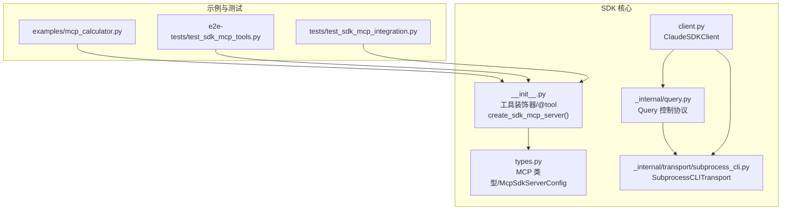
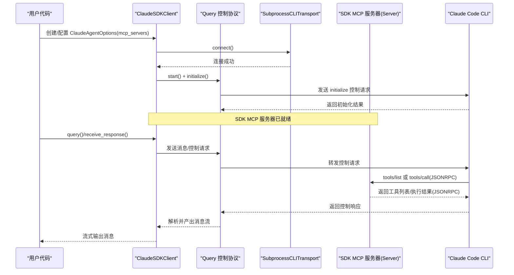
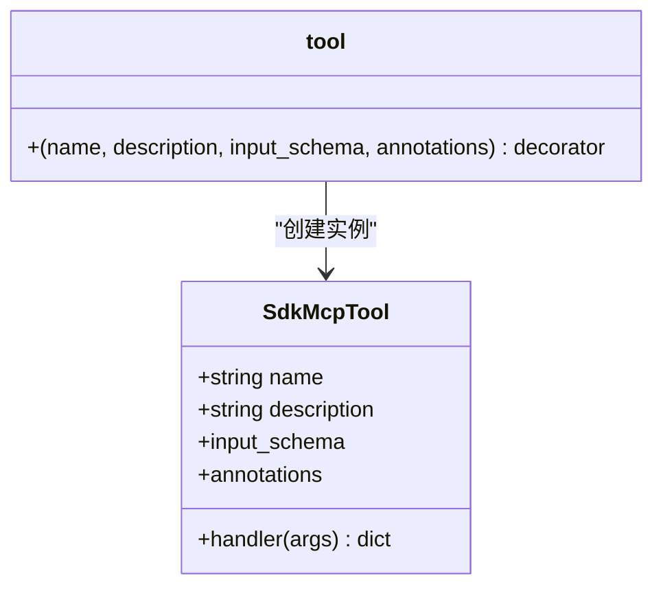
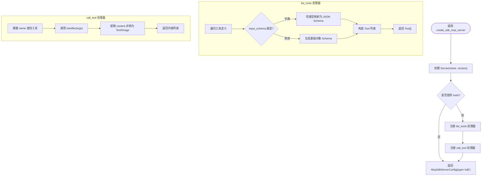
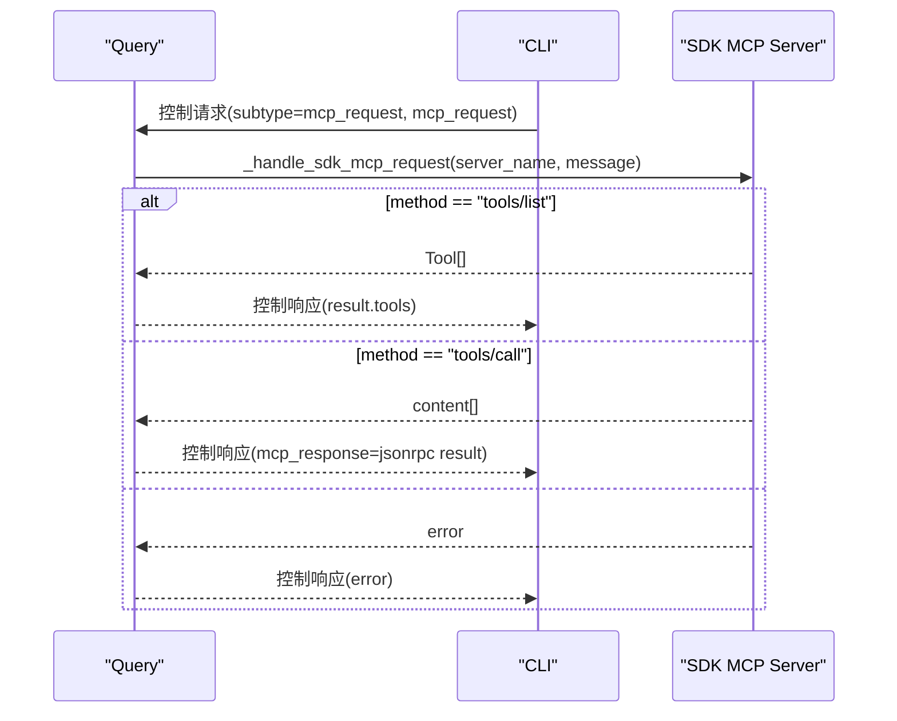
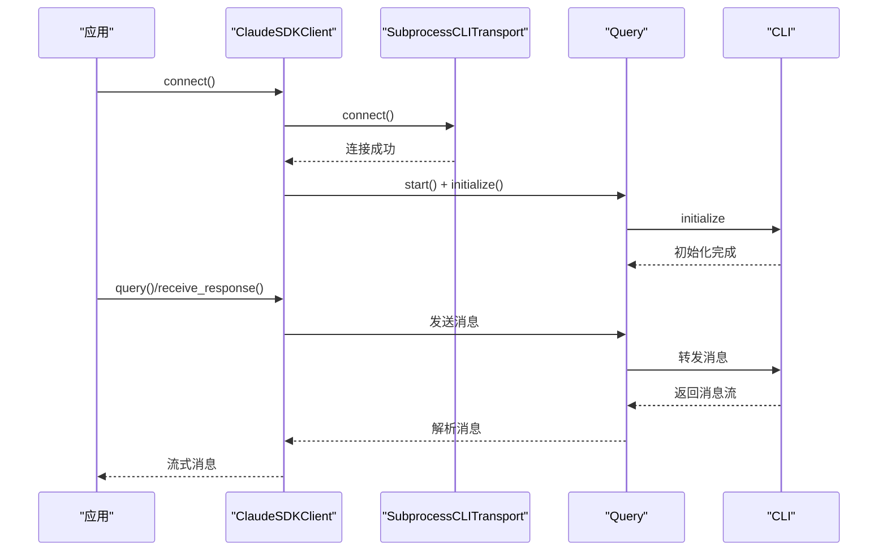
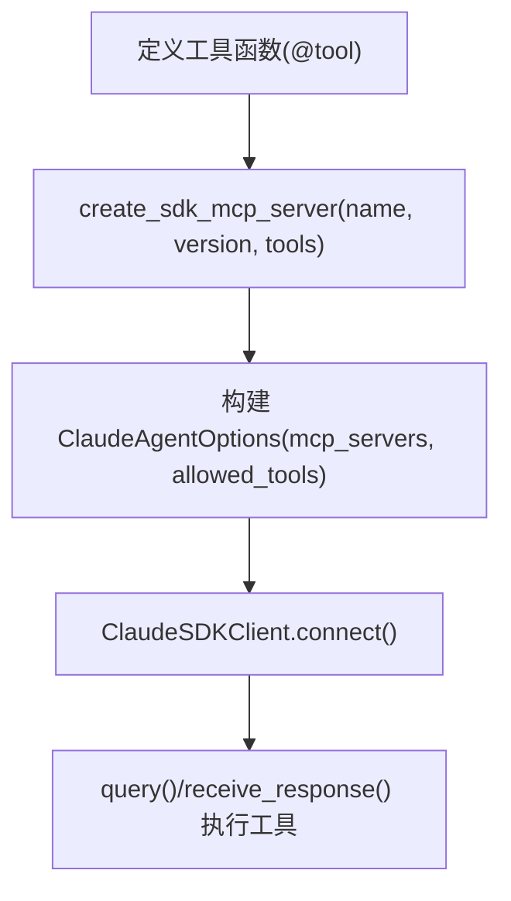
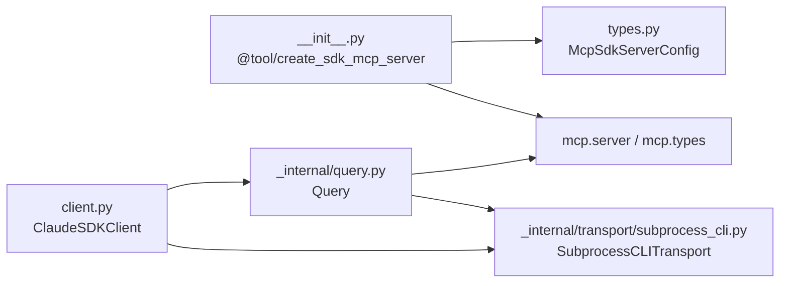

# MCP 协议详解

<cite>
**本文引用的文件**
- [src/claude_agent_sdk/__init__.py](file://src/claude_agent_sdk/__init__.py)
- [src/claude_agent_sdk/types.py](file://src/claude_agent_sdk/types.py)
- [src/claude_agent_sdk/client.py](file://src/claude_agent_sdk/client.py)
- [src/claude_agent_sdk/_internal/query.py](file://src/claude_agent_sdk/_internal/query.py)
- [src/claude_agent_sdk/_internal/transport/subprocess_cli.py](file://src/claude_agent_sdk/_internal/transport/subprocess_cli.py)
- [src/claude_agent_sdk/_errors.py](file://src/claude_agent_sdk/_errors.py)
- [examples/mcp_calculator.py](file://examples/mcp_calculator.py)
- [e2e-tests/test_sdk_mcp_tools.py](file://e2e-tests/test_sdk_mcp_tools.py)
- [tests/test_sdk_mcp_integration.py](file://tests/test_sdk_mcp_integration.py)
</cite>

## 目录
1. [简介](#简介)
2. [项目结构](#项目结构)
3. [核心组件](#核心组件)
4. [架构总览](#架构总览)
5. [详细组件分析](#详细组件分析)
6. [依赖关系分析](#依赖关系分析)
7. [性能考量](#性能考量)
8. [故障排查指南](#故障排查指南)
9. [结论](#结论)
10. [附录](#附录)

## 简介
本文件系统性阐述 Claude Agent SDK 中的 MCP（Model Context Protocol）服务器实现与使用方法，重点覆盖以下内容：
- MCP 协议基础：工具发现与调用、初始化握手、通知与状态查询
- SDK 内置 MCP 服务器：create_sdk_mcp_server() 的工作机制与配置项
- 工具装饰器 @tool：如何定义工具、参数校验与返回值格式
- 生命周期与消息传递：服务器注册、请求路由、结果封装
- 实战示例：计算器工具、权限控制与端到端测试
- 与 Claude Code 平台集成：通过控制协议桥接 SDK MCP 服务器

## 项目结构
围绕 MCP 的核心代码主要位于以下模块：
- 公共入口与工具装饰器：src/claude_agent_sdk/__init__.py
- 类型定义与 MCP 配置：src/claude_agent_sdk/types.py
- 客户端与控制协议：src/claude_agent_sdk/client.py、src/claude_agent_sdk/_internal/query.py
- 进程传输层：src/claude_agent_sdk/_internal/transport/subprocess_cli.py
- 错误类型：src/claude_agent_sdk/_errors.py
- 示例与测试：examples/mcp_calculator.py、e2e-tests/test_sdk_mcp_tools.py、tests/test_sdk_mcp_integration.py

图表来源
- [src/claude_agent_sdk/__init__.py:178-340](file://src/claude_agent_sdk/__init__.py#L178-L340)
- [src/claude_agent_sdk/types.py:493-529](file://src/claude_agent_sdk/types.py#L493-L529)
- [src/claude_agent_sdk/client.py:94-180](file://src/claude_agent_sdk/client.py#L94-L180)
- [src/claude_agent_sdk/_internal/query.py:53-120](file://src/claude_agent_sdk/_internal/query.py#L53-L120)
- [src/claude_agent_sdk/_internal/transport/subprocess_cli.py:33-120](file://src/claude_agent_sdk/_internal/transport/subprocess_cli.py#L33-L120)

章节来源
- [src/claude_agent_sdk/__init__.py:1-445](file://src/claude_agent_sdk/__init__.py#L1-L445)
- [src/claude_agent_sdk/types.py:1-200](file://src/claude_agent_sdk/types.py#L1-L200)

## 核心组件
- 工具装饰器 @tool：用于声明 MCP 工具，支持名称、描述、输入模式（字典/TypedDict/JSON Schema）与注解，返回 SdkMcpTool 实例供 create_sdk_mcp_server() 注册。
- create_sdk_mcp_server()：创建内嵌于应用进程的 MCP 服务器，自动注册 tools/list 与 tools/call 处理器，并返回 McpSdkServerConfig 以供 ClaudeAgentOptions.mcp_servers 使用。
- Query 控制协议：负责与 Claude Code CLI 的双向控制协议交互，解析控制请求、转发 MCP 请求至 SDK 服务器、封装响应。
- SubprocessCLITransport：启动并管理 Claude Code CLI 子进程，负责消息读写、版本检查、错误处理与资源清理。
- ClaudeSDKClient：高层客户端，封装连接、消息收发、权限模式切换、MCP 服务器启停与状态查询。

章节来源
- [src/claude_agent_sdk/__init__.py:111-340](file://src/claude_agent_sdk/__init__.py#L111-L340)
- [src/claude_agent_sdk/_internal/query.py:53-120](file://src/claude_agent_sdk/_internal/query.py#L53-L120)
- [src/claude_agent_sdk/_internal/transport/subprocess_cli.py:33-120](file://src/claude_agent_sdk/_internal/transport/subprocess_cli.py#L33-L120)
- [src/claude_agent_sdk/client.py:21-120](file://src/claude_agent_sdk/client.py#L21-L120)

## 架构总览
下图展示 SDK MCP 服务器在 Claude Agent SDK 中的运行时架构与数据流：

图表来源
- [src/claude_agent_sdk/client.py:94-180](file://src/claude_agent_sdk/client.py#L94-L180)
- [src/claude_agent_sdk/_internal/query.py:119-163](file://src/claude_agent_sdk/_internal/query.py#L119-L163)
- [src/claude_agent_sdk/_internal/query.py:394-538](file://src/claude_agent_sdk/_internal/query.py#L394-L538)
- [src/claude_agent_sdk/_internal/transport/subprocess_cli.py:335-411](file://src/claude_agent_sdk/_internal/transport/subprocess_cli.py#L335-L411)

## 详细组件分析

### 工具装饰器 @tool 与 SdkMcpTool
- @tool 装饰器接收工具元信息（名称、描述、输入模式、注解），返回 SdkMcpTool 实例，内部包含 handler 异步函数。
- 输入模式支持：
  - 字典映射：键为参数名，值为类型（字符串、整数、浮点、布尔等）
  - TypedDict 或其他类型：生成基础 JSON Schema
- 返回值约定：handler 应返回包含 "content" 键的字典；content 由文本或图像内容组成；可通过 "is_error" 标记错误状态。

图表来源
- [src/claude_agent_sdk/__init__.py:100-176](file://src/claude_agent_sdk/__init__.py#L100-L176)

章节来源
- [src/claude_agent_sdk/__init__.py:111-176](file://src/claude_agent_sdk/__init__.py#L111-L176)

### create_sdk_mcp_server() 服务器创建与注册
- 创建 mcp.server.Server 实例，设置 name 与 version
- 注册 tools/list 处理器：将 SdkMcpTool 的 input_schema 转换为 JSON Schema 并返回 Tool 列表
- 注册 tools/call 处理器：按名称查找工具，调用 handler(args)，将返回内容转换为 MCP 文本/图像内容列表
- 返回 McpSdkServerConfig（type="sdk"），包含 name 与 instance（Server）

图表来源
- [src/claude_agent_sdk/__init__.py:178-340](file://src/claude_agent_sdk/__init__.py#L178-L340)

章节来源
- [src/claude_agent_sdk/__init__.py:178-340](file://src/claude_agent_sdk/__init__.py#L178-L340)

### 控制协议与 SDK MCP 桥接
- Query 在连接后发送 initialize 控制请求，等待 CLI 初始化完成
- 当 CLI 发送 MCP 请求（如 tools/list、tools/call）时，Query 将其路由到对应 SDK MCP 服务器
- 对于 tools/list，Query 将 MCP 结果转换为控制协议响应中的工具数组
- 对于 tools/call，Query 调用 SDK 服务器的处理器并将结果封装为 JSONRPC 响应

图表来源
- [src/claude_agent_sdk/_internal/query.py:309-538](file://src/claude_agent_sdk/_internal/query.py#L309-L538)

章节来源
- [src/claude_agent_sdk/_internal/query.py:309-538](file://src/claude_agent_sdk/_internal/query.py#L309-L538)

### 客户端生命周期与消息流
- ClaudeSDKClient.connect() 会构建 SubprocessCLITransport，启动 CLI 子进程，初始化 Query 并开始读取消息
- receive_messages()/receive_response() 提供消息迭代器，支持中断、权限模式切换、MCP 服务器启停与状态查询
- reconnect_mcp_server()/toggle_mcp_server() 支持动态重连与启用/禁用服务器

图表来源
- [src/claude_agent_sdk/client.py:94-180](file://src/claude_agent_sdk/client.py#L94-L180)
- [src/claude_agent_sdk/_internal/transport/subprocess_cli.py:335-411](file://src/claude_agent_sdk/_internal/transport/subprocess_cli.py#L335-L411)

章节来源
- [src/claude_agent_sdk/client.py:94-180](file://src/claude_agent_sdk/client.py#L94-L180)
- [src/claude_agent_sdk/_internal/transport/subprocess_cli.py:335-411](file://src/claude_agent_sdk/_internal/transport/subprocess_cli.py#L335-L411)

### 示例：MCP 计算器工具
- 使用 @tool 定义加减乘除、开方、幂运算等工具
- 通过 create_sdk_mcp_server() 创建服务器并注入工具
- 在 ClaudeAgentOptions 中配置 mcp_servers 与 allowed_tools，随后使用 ClaudeSDKClient 查询

图表来源
- [examples/mcp_calculator.py:24-98](file://examples/mcp_calculator.py#L24-L98)
- [examples/mcp_calculator.py:142-154](file://examples/mcp_calculator.py#L142-L154)
- [examples/mcp_calculator.py:158-168](file://examples/mcp_calculator.py#L158-L168)

章节来源
- [examples/mcp_calculator.py:1-194](file://examples/mcp_calculator.py#L1-L194)

### 端到端测试要点
- 验证 create_sdk_mcp_server() 返回的配置类型与实例字段
- 验证 SDK 服务器的 tools/list 与 tools/call 处理器存在并可被调用
- 验证工具执行路径与权限控制（allowed_tools/disallowed_tools）

章节来源
- [tests/test_sdk_mcp_integration.py:39-190](file://tests/test_sdk_mcp_integration.py#L39-L190)
- [e2e-tests/test_sdk_mcp_tools.py:19-169](file://e2e-tests/test_sdk_mcp_tools.py#L19-L169)

## 依赖关系分析
- 入口模块依赖 mcp.server.Server 与 mcp.types（Tool、TextContent、ImageContent 等）
- Query 依赖 mcp.types 的 CallToolRequest/ListToolsRequest 以及内部传输接口
- SubprocessCLITransport 依赖 anyio 进程与流、环境变量与 CLI 可执行文件路径
- ClaudeSDKClient 依赖 Query 与 Transport，提供高层 API

图表来源
- [src/claude_agent_sdk/__init__.py:250-340](file://src/claude_agent_sdk/__init__.py#L250-L340)
- [src/claude_agent_sdk/_internal/query.py:10-26](file://src/claude_agent_sdk/_internal/query.py#L10-L26)
- [src/claude_agent_sdk/_internal/transport/subprocess_cli.py:16-26](file://src/claude_agent_sdk/_internal/transport/subprocess_cli.py#L16-L26)

章节来源
- [src/claude_agent_sdk/__init__.py:250-340](file://src/claude_agent_sdk/__init__.py#L250-L340)
- [src/claude_agent_sdk/_internal/query.py:10-26](file://src/claude_agent_sdk/_internal/query.py#L10-L26)
- [src/claude_agent_sdk/_internal/transport/subprocess_cli.py:16-26](file://src/claude_agent_sdk/_internal/transport/subprocess_cli.py#L16-L26)

## 性能考量
- 内嵌服务器优势：与应用同进程，避免 IPC 开销，提升工具调用性能与调试便利性
- 服务器生命周期：由 SDK 自动管理，无需外部进程维护
- 流式传输：通过子进程标准流进行消息读写，注意缓冲区大小与 JSON 解码容错

[本节为通用指导，不直接分析具体文件]

## 故障排查指南
常见问题与定位建议：
- 无法连接 CLI：确认 Claude Code CLI 是否安装、版本是否满足最低要求、工作目录是否存在
- 工具未执行：检查 allowed_tools/disallowed_tools 配置，确保工具名称前缀与命名空间一致
- MCP 服务器状态异常：使用 get_mcp_status() 获取连接状态与错误信息，必要时调用 reconnect_mcp_server()/toggle_mcp_server()

章节来源
- [src/claude_agent_sdk/_internal/transport/subprocess_cli.py:88-95](file://src/claude_agent_sdk/_internal/transport/subprocess_cli.py#L88-L95)
- [src/claude_agent_sdk/_internal/transport/subprocess_cli.py:587-626](file://src/claude_agent_sdk/_internal/transport/subprocess_cli.py#L587-L626)
- [src/claude_agent_sdk/client.py:385-416](file://src/claude_agent_sdk/client.py#L385-L416)
- [src/claude_agent_sdk/_errors.py:14-57](file://src/claude_agent_sdk/_errors.py#L14-L57)

## 结论
Claude Agent SDK 通过 @tool 与 create_sdk_mcp_server() 提供了简洁高效的 MCP 工具开发与集成方案。借助 Query 与 SubprocessCLITransport，SDK 将 MCP 请求桥接到内嵌服务器，实现了低延迟、易调试、强扩展的工具生态。配合 ClaudeSDKClient 的流式消息与权限控制，开发者可以快速构建从本地计算到文件系统操作的各类工具，并与 Claude Code 平台无缝协作。

[本节为总结性内容，不直接分析具体文件]

## 附录
- MCP 服务器配置类型：McpSdkServerConfig（type="sdk"，包含 name 与 instance）
- 工具注解：McpToolAnnotations（如只读、破坏性、开放世界）
- 状态类型：McpServerStatus、McpServerConnectionStatus、McpStatusResponse

章节来源
- [src/claude_agent_sdk/types.py:493-600](file://src/claude_agent_sdk/types.py#L493-L600)