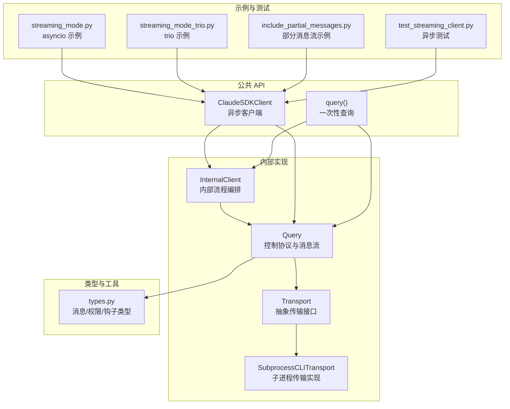
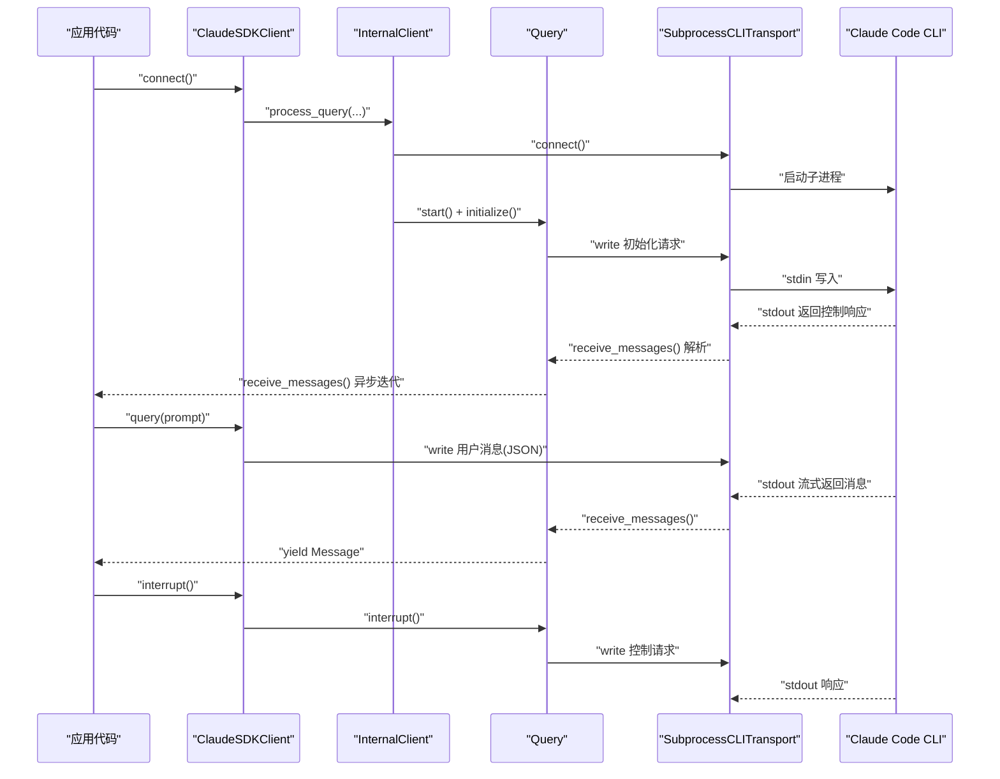
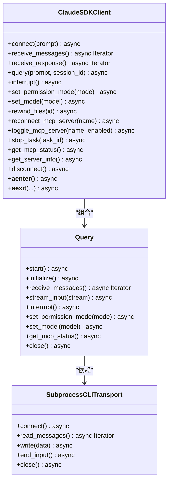
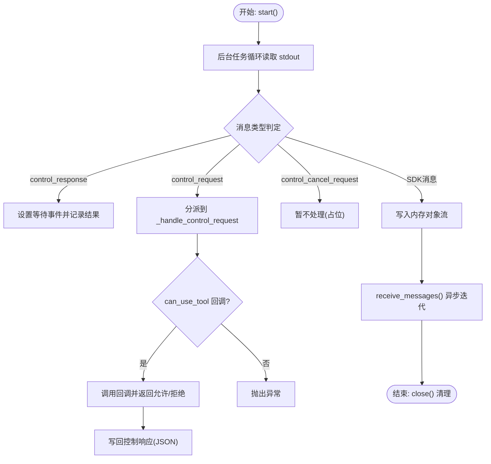
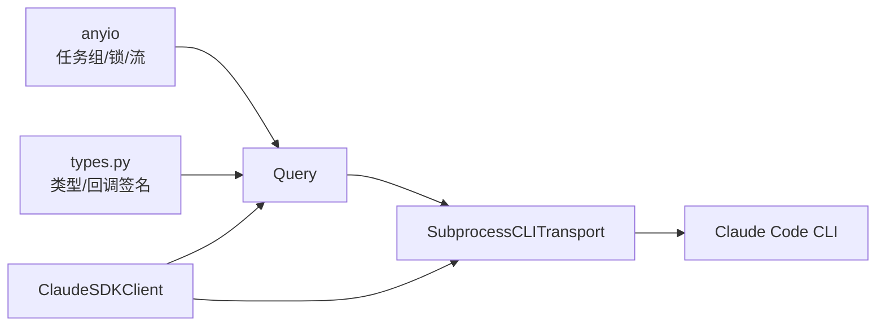

# 异步编程模型

<cite>
**本文引用的文件**
- [client.py](file://src/claude_agent_sdk/client.py)
- [_internal/client.py](file://src/claude_agent_sdk/_internal/client.py)
- [query.py](file://src/claude_agent_sdk/query.py)
- [_internal/query.py](file://src/claude_agent_sdk/_internal/query.py)
- [_internal/transport/subprocess_cli.py](file://src/claude_agent_sdk/_internal/transport/subprocess_cli.py)
- [types.py](file://src/claude_agent_sdk/types.py)
- [streaming_mode.py](file://examples/streaming_mode.py)
- [streaming_mode_trio.py](file://examples/streaming_mode_trio.py)
- [include_partial_messages.py](file://examples/include_partial_messages.py)
- [test_streaming_client.py](file://tests/test_streaming_client.py)
</cite>

## 目录
1. [简介](#简介)
2. [项目结构](#项目结构)
3. [核心组件](#核心组件)
4. [架构总览](#架构总览)
5. [详细组件分析](#详细组件分析)
6. [依赖分析](#依赖分析)
7. [性能考量](#性能考量)
8. [故障排查指南](#故障排查指南)
9. [结论](#结论)
10. [附录](#附录)

## 简介
本文件系统性阐述 Claude Agent SDK 的异步编程模型，聚焦 Python 异步生态（asyncio/trio）在 SDK 中的应用，包括：
- async/await 语法在客户端生命周期、消息收发与控制协议中的使用
- 异步迭代器与流式数据处理（AsyncIterable/AsyncIterator）
- 单次查询、流式交互与双向对话的异步模式
- 异步客户端生命周期管理：连接建立、消息发送/接收、连接关闭
- 异步编程最佳实践：错误处理、超时控制、资源管理
- 实际应用示例：流式查询、实时对话、并发处理
- 异步与同步差异及迁移注意事项

## 项目结构
SDK 的异步能力由以下层次构成：
- 公共 API 层：面向用户的 ClaudeSDKClient 与 query 函数
- 内部实现层：内部客户端 InternalClient、控制协议 Query、传输层 Transport 及子进程实现 SubprocessCLITransport
- 类型与工具层：消息类型、权限回调、钩子类型等
- 示例与测试：演示不同运行时（asyncio/trio）、流式选项、并发与错误处理

图表来源
- [client.py:21-500](file://src/claude_agent_sdk/client.py#L21-L500)
- [_internal/client.py:20-146](file://src/claude_agent_sdk/_internal/client.py#L20-L146)
- [_internal/query.py:53-679](file://src/claude_agent_sdk/_internal/query.py#L53-L679)
- [_internal/transport/subprocess_cli.py:33-630](file://src/claude_agent_sdk/_internal/transport/subprocess_cli.py#L33-L630)
- [types.py:1-200](file://src/claude_agent_sdk/types.py#L1-L200)
- [streaming_mode.py:1-512](file://examples/streaming_mode.py#L1-L512)
- [streaming_mode_trio.py:1-81](file://examples/streaming_mode_trio.py#L1-L81)
- [include_partial_messages.py:1-63](file://examples/include_partial_messages.py#L1-L63)
- [test_streaming_client.py:1-1197](file://tests/test_streaming_client.py#L1-L1197)

章节来源
- [client.py:1-500](file://src/claude_agent_sdk/client.py#L1-L500)
- [_internal/client.py:1-146](file://src/claude_agent_sdk/_internal/client.py#L1-L146)
- [_internal/query.py:1-679](file://src/claude_agent_sdk/_internal/query.py#L1-L679)
- [_internal/transport/subprocess_cli.py:1-630](file://src/claude_agent_sdk/_internal/transport/subprocess_cli.py#L1-L630)
- [types.py:1-200](file://src/claude_agent_sdk/types.py#L1-L200)
- [streaming_mode.py:1-512](file://examples/streaming_mode.py#L1-L512)
- [streaming_mode_trio.py:1-81](file://examples/streaming_mode_trio.py#L1-L81)
- [include_partial_messages.py:1-63](file://examples/include_partial_messages.py#L1-L63)
- [test_streaming_client.py:1-1197](file://tests/test_streaming_client.py#L1-L1197)

## 核心组件
- ClaudeSDKClient：面向用户的异步客户端，支持双向、有状态、可中断的交互；提供 receive_messages/receive_response/query/interrupt 等异步方法，并通过上下文管理器自动连接/断开。
- InternalClient：内部流程编排器，负责根据选项配置传输、初始化 Query、启动消息读取、处理输入流与输出流。
- Query：控制协议与消息流的核心类，封装 anyio 任务组、内存对象流、控制请求/响应路由、工具权限回调、钩子回调、MCP 服务器桥接等。
- SubprocessCLITransport：基于 anyio 的子进程传输实现，负责 CLI 进程生命周期、stdin/stdout/stderr 流读写、并发写入锁、版本检查、错误传播。
- types：定义消息类型、权限结果、钩子事件、工具回调签名等，支撑异步回调与流式解析。

章节来源
- [client.py:21-500](file://src/claude_agent_sdk/client.py#L21-L500)
- [_internal/client.py:20-146](file://src/claude_agent_sdk/_internal/client.py#L20-L146)
- [_internal/query.py:53-679](file://src/claude_agent_sdk/_internal/query.py#L53-L679)
- [_internal/transport/subprocess_cli.py:33-630](file://src/claude_agent_sdk/_internal/transport/subprocess_cli.py#L33-L630)
- [types.py:1-200](file://src/claude_agent_sdk/types.py#L1-L200)

## 架构总览
SDK 的异步架构围绕“传输层 + 控制协议层 + 应用层”展开：
- 传输层：SubprocessCLITransport 使用 anyio 打开子进程，提供 read_messages/write/end_input/close 等异步接口。
- 控制协议层：Query 在传输之上构建任务组，读取 stdout 流，分发控制请求/响应，路由 SDK 消息到内存对象流，同时处理工具权限与钩子回调。
- 应用层：ClaudeSDKClient/ InternalClient 提供高层 API，如 connect/query/receive_messages/receive_response/interrupt 等，统一生命周期与错误处理。

图表来源
- [client.py:94-185](file://src/claude_agent_sdk/client.py#L94-L185)
- [_internal/client.py:44-146](file://src/claude_agent_sdk/_internal/client.py#L44-L146)
- [_internal/query.py:165-235](file://src/claude_agent_sdk/_internal/query.py#L165-L235)
- [_internal/transport/subprocess_cli.py:335-518](file://src/claude_agent_sdk/_internal/transport/subprocess_cli.py#L335-L518)

章节来源
- [client.py:94-185](file://src/claude_agent_sdk/client.py#L94-L185)
- [_internal/client.py:44-146](file://src/claude_agent_sdk/_internal/client.py#L44-L146)
- [_internal/query.py:165-235](file://src/claude_agent_sdk/_internal/query.py#L165-L235)
- [_internal/transport/subprocess_cli.py:335-518](file://src/claude_agent_sdk/_internal/transport/subprocess_cli.py#L335-L518)

## 详细组件分析

### ClaudeSDKClient：异步客户端生命周期与消息流
- 连接阶段：connect 支持字符串或 AsyncIterable 提示；内部创建 SubprocessCLITransport 并启动 Query.start/initialize；若提供 AsyncIterable，会在 Query 内部以任务组后台流式发送。
- 消息接收：receive_messages/receive_response 提供两种异步迭代器；前者逐条产出消息，后者在遇到 ResultMessage 后停止。
- 查询与中断：query 支持字符串或异步迭代器；interrupt 发送控制请求；其他管理方法如 set_permission_mode/set_model/reconnect_mcp_server/toggle_mcp_server/stop_task/get_mcp_status/get_server_info 等均通过 Query 的控制请求实现。
- 生命周期：__aenter__/__aexit__ 自动 connect/disconnect；disconnect 关闭 Query 与 Transport。

图表来源
- [client.py:21-500](file://src/claude_agent_sdk/client.py#L21-L500)
- [_internal/query.py:53-679](file://src/claude_agent_sdk/_internal/query.py#L53-L679)
- [_internal/transport/subprocess_cli.py:33-630](file://src/claude_agent_sdk/_internal/transport/subprocess_cli.py#L33-L630)

章节来源
- [client.py:94-499](file://src/claude_agent_sdk/client.py#L94-L499)

### InternalClient：一次性查询与内部流程编排
- process_query 将外部调用转换为内部流程：配置选项、创建/连接 Transport、构造 Query、启动消息读取、初始化、处理提示输入（字符串或异步迭代器）、异步迭代输出消息并解析为具体消息类型。
- 对于 can_use_tool 与 permission_prompt_tool_name 的互斥校验、SDK MCP 服务器提取、agents 字典化等逻辑均在内部完成。

章节来源
- [_internal/client.py:44-146](file://src/claude_agent_sdk/_internal/client.py#L44-L146)

### Query：控制协议与消息流核心
- 任务组与内存流：使用 anyio 任务组与内存对象流承载消息通道；start 启动后台读取任务；receive_messages 异步迭代 SDK 消息。
- 控制请求/响应：_send_control_request 统一封装控制请求，生成唯一 request_id，等待 anyio.Event；控制响应到达后设置事件并返回结果。
- 控制请求处理：_handle_control_request 分派 can_use_tool/hook_callback/mcp_message 等子类型，调用回调或桥接 SDK MCP 服务器。
- 输入流：stream_input 接收 AsyncIterable，逐条写入 Transport；wait_for_result_and_end_input 在需要时等待首条结果后再关闭 stdin。
- 资源关闭：close 取消任务组、关闭传输，确保清理。

图表来源
- [_internal/query.py:165-235](file://src/claude_agent_sdk/_internal/query.py#L165-L235)
- [_internal/query.py:236-346](file://src/claude_agent_sdk/_internal/query.py#L236-L346)
- [_internal/query.py:614-647](file://src/claude_agent_sdk/_internal/query.py#L614-L647)

章节来源
- [_internal/query.py:165-346](file://src/claude_agent_sdk/_internal/query.py#L165-L346)
- [_internal/query.py:614-679](file://src/claude_agent_sdk/_internal/query.py#L614-L679)

### SubprocessCLITransport：异步传输与并发安全
- 子进程生命周期：connect 打开 CLI 进程，准备 stdout/stdin/stderr 流；stderr 可选地在任务组中异步读取并回调。
- 异步读取：read_messages 逐行读取 stdout，拼接 JSON 缓冲，解析为消息字典；支持长行截断与缓冲上限保护。
- 并发写入：write 使用 anyio.Lock 防止多任务并发写入导致的资源忙错误；end_input 关闭 stdin；close 终止进程并清理资源。
- 版本检查：_check_claude_version 限制最低 CLI 版本并发出警告。

章节来源
- [_internal/transport/subprocess_cli.py:335-518](file://src/claude_agent_sdk/_internal/transport/subprocess_cli.py#L335-L518)
- [_internal/transport/subprocess_cli.py:519-586](file://src/claude_agent_sdk/_internal/transport/subprocess_cli.py#L519-L586)

### 异步迭代器与流式数据处理
- AsyncIterable/AsyncIterator：query/connect 支持 AsyncIterable 提示；stream_input 逐条写入；receive_messages/receive_response 逐条产出。
- 内存对象流：Query 使用 anyio.create_memory_object_stream 作为消息通道，避免阻塞；end/error 特殊消息用于终止/错误传播。
- 部分消息流：include_partial_messages 选项启用增量事件，适用于实时 UI 或进度监控。

章节来源
- [query.py:12-127](file://src/claude_agent_sdk/query.py#L12-L127)
- [_internal/query.py:105-117](file://src/claude_agent_sdk/_internal/query.py#L105-L117)
- [include_partial_messages.py:1-63](file://examples/include_partial_messages.py#L1-L63)

### 异步模式与应用场景
- 单次查询：query() 一次性发送提示并接收完整响应，适合无状态、简单任务。
- 流式交互：ClaudeSDKClient.connect + query + receive_messages/receive_response，适合多轮对话与工具调用。
- 双向对话：通过 receive_messages 持续消费消息，同时发送新 query，实现“边发边收”的实时交互。
- 并发处理：示例展示在 asyncio/trio 下并发发送与接收，结合任务取消与超时控制。

章节来源
- [streaming_mode.py:59-131](file://examples/streaming_mode.py#L59-L131)
- [streaming_mode_trio.py:46-77](file://examples/streaming_mode_trio.py#L46-L77)
- [test_streaming_client.py:158-474](file://tests/test_streaming_client.py#L158-L474)

## 依赖分析
- 运行时抽象：anyio 提供跨运行时（asyncio/trio）的任务组、锁、内存对象流、超时控制等。
- 类型与回调：types 定义权限回调签名、钩子事件与消息类型，Query 与客户端据此进行类型安全的回调与消息解析。
- 传输与控制：SubprocessCLITransport 与 Query 形成“传输-控制协议”双层抽象，便于替换自定义传输或扩展控制协议。

图表来源
- [_internal/query.py:10-31](file://src/claude_agent_sdk/_internal/query.py#L10-L31)
- [types.py:1-200](file://src/claude_agent_sdk/types.py#L1-L200)
- [_internal/transport/subprocess_cli.py:16-25](file://src/claude_agent_sdk/_internal/transport/subprocess_cli.py#L16-L25)
- [client.py:1-500](file://src/claude_agent_sdk/client.py#L1-L500)

章节来源
- [_internal/query.py:1-31](file://src/claude_agent_sdk/_internal/query.py#L1-L31)
- [types.py:1-200](file://src/claude_agent_sdk/types.py#L1-L200)
- [_internal/transport/subprocess_cli.py:1-25](file://src/claude_agent_sdk/_internal/transport/subprocess_cli.py#L1-L25)
- [client.py:1-500](file://src/claude_agent_sdk/client.py#L1-L500)

## 性能考量
- 任务组与内存流：Query 使用 anyio 任务组与内存对象流，避免阻塞与上下文切换开销；合理设置内存流缓冲上限可防止内存膨胀。
- 并发写入：SubprocessCLITransport 的写入锁确保并发安全，避免 BusyResourceError；建议批量/合并写入以减少系统调用次数。
- 超时与取消：控制请求使用 anyio.fail_after/anyio.move_on_after 管理超时；Query.close 使用取消作用域优雅退出。
- 流式解析：SubprocessCLITransport 的 JSON 缓冲与最大缓冲限制平衡了长行与内存占用。
- 运行时选择：示例同时覆盖 asyncio/trio，可根据项目运行时选择；注意客户端实例不可跨不同运行时上下文使用。

章节来源
- [_internal/query.py:165-235](file://src/claude_agent_sdk/_internal/query.py#L165-L235)
- [_internal/query.py:378-392](file://src/claude_agent_sdk/_internal/query.py#L378-L392)
- [_internal/transport/subprocess_cli.py:481-514](file://src/claude_agent_sdk/_internal/transport/subprocess_cli.py#L481-L514)
- [_internal/transport/subprocess_cli.py:546-554](file://src/claude_agent_sdk/_internal/transport/subprocess_cli.py#L546-L554)
- [client.py:53-59](file://src/claude_agent_sdk/client.py#L53-L59)

## 故障排查指南
- 连接失败：检查 CLI 是否安装、路径是否正确、工作目录是否存在；查看 stderr 回调或调试输出。
- 写入失败：确认 Transport 已就绪且进程未退出；并发写入需依赖写入锁；避免在 close 后继续写入。
- 控制请求超时：调整 initialize_timeout 或控制请求超时；检查 CLI 与 MCP 服务器状态。
- 错误传播：Query 在 fatal 错误时向内存流发送 error 消息，receive_messages 会抛出异常；应用侧应捕获并处理。
- 资源泄漏：确保使用上下文管理器或显式调用 disconnect/close；测试覆盖了并发写入锁与无锁失败场景。

章节来源
- [_internal/transport/subprocess_cli.py:396-410](file://src/claude_agent_sdk/_internal/transport/subprocess_cli.py#L396-L410)
- [_internal/transport/subprocess_cli.py:481-505](file://src/claude_agent_sdk/_internal/transport/subprocess_cli.py#L481-L505)
- [_internal/query.py:220-234](file://src/claude_agent_sdk/_internal/query.py#L220-L234)
- [test_streaming_client.py:756-830](file://tests/test_streaming_client.py#L756-L830)

## 结论
Claude Agent SDK 的异步编程模型以 anyio 为核心，通过 Transport/Query/ClaudeSDKClient 三层抽象实现了：
- 统一的异步生命周期管理与资源清理
- 流式消息处理与双向控制协议
- 易于替换的传输实现与可扩展的控制协议
- 跨运行时（asyncio/trio）的一致行为
遵循本文的最佳实践与示例，可在复杂交互场景中获得稳定、高性能的异步体验。

## 附录

### 异步与同步差异与迁移
- 同步 vs 异步：同步 query() 适合一次性、无状态任务；异步 ClaudeSDKClient 更适合多轮对话、工具调用与实时交互。
- 迁移要点：将阻塞调用替换为 await；使用 AsyncIterable 替代一次性字符串；在应用层引入超时与取消；确保资源在 finally/__aexit__ 中释放。
- 运行时注意：客户端实例不可跨不同运行时上下文使用（参见客户端注释）。

章节来源
- [query.py:12-127](file://src/claude_agent_sdk/query.py#L12-L127)
- [client.py:53-59](file://src/claude_agent_sdk/client.py#L53-L59)

### 实际应用示例索引
- 基础流式：示例展示基本 streaming 模式与上下文管理器用法。
- 多轮对话：示例演示多轮交互与中断能力。
- 并发处理：示例演示在 asyncio/trio 下并发发送与接收。
- 部分消息流：示例演示 include_partial_messages 的增量事件。

章节来源
- [streaming_mode.py:59-131](file://examples/streaming_mode.py#L59-L131)
- [streaming_mode.py:133-174](file://examples/streaming_mode.py#L133-L174)
- [streaming_mode_trio.py:46-77](file://examples/streaming_mode_trio.py#L46-L77)
- [include_partial_messages.py:28-57](file://examples/include_partial_messages.py#L28-L57)