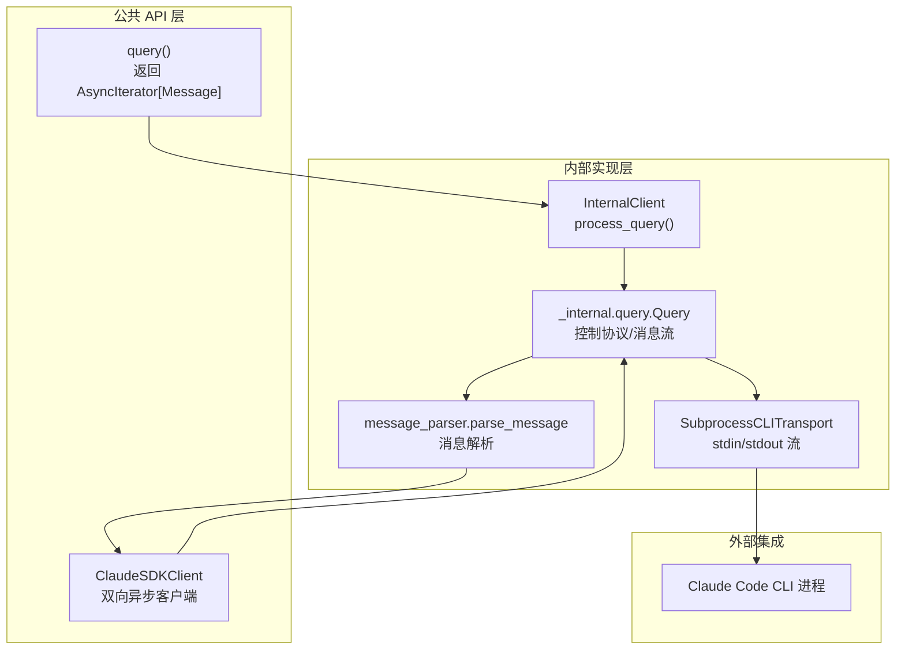
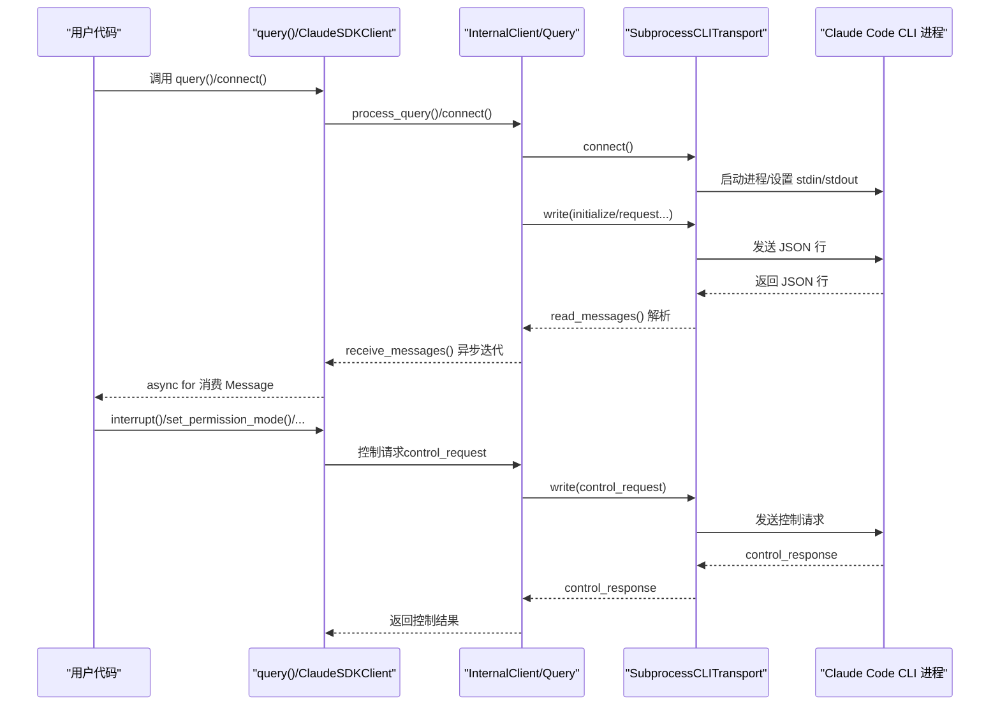
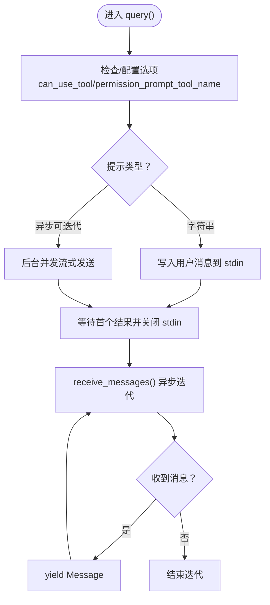
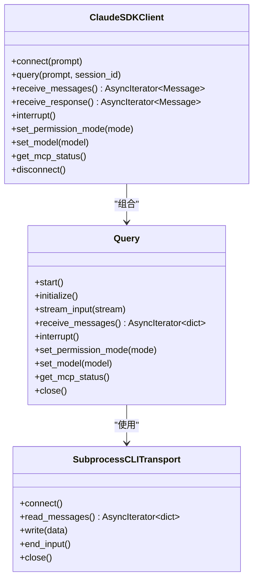
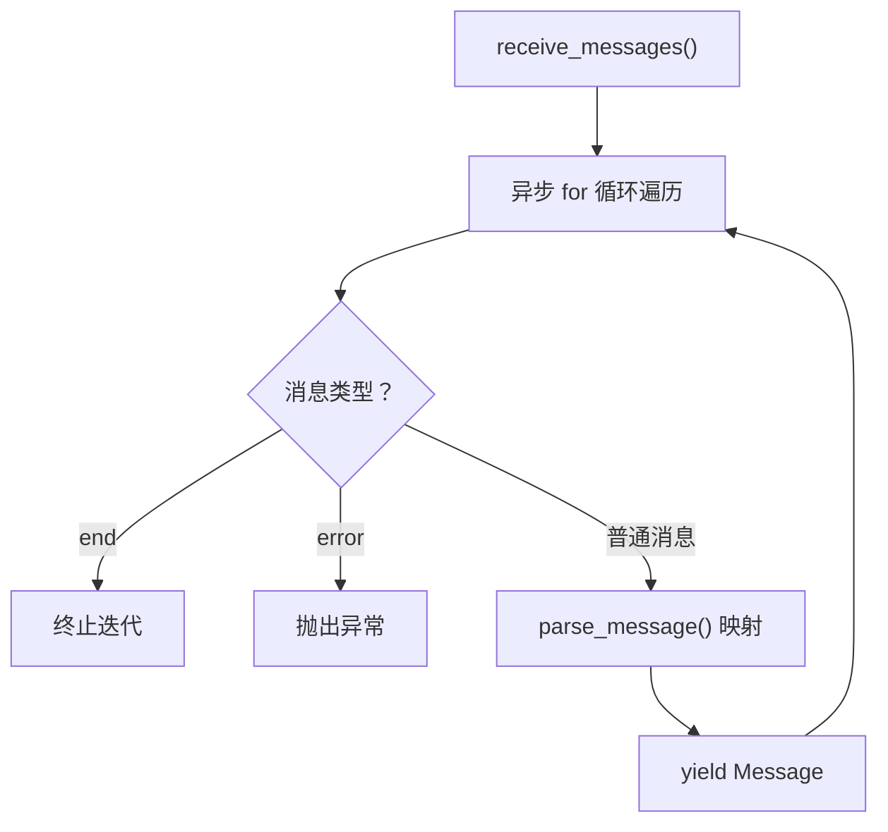
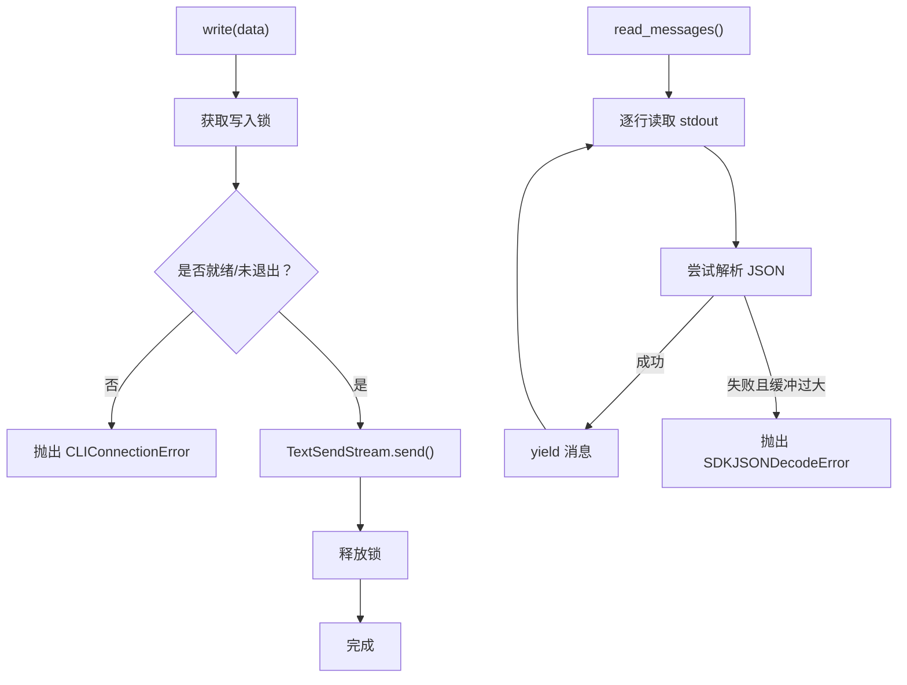
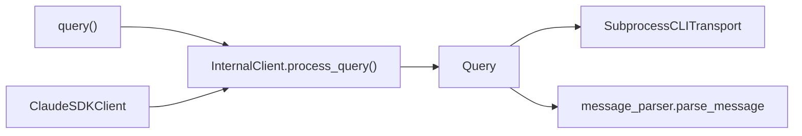

# 异步编程模式

<cite>
**本文引用的文件**
- [query.py](file://src/claude_agent_sdk/query.py)
- [query.py（内部）](file://src/claude_agent_sdk/_internal/query.py)
- [client.py（公共）](file://src/claude_agent_sdk/client.py)
- [client.py（内部）](file://src/claude_agent_sdk/_internal/client.py)
- [subprocess_cli.py](file://src/claude_agent_sdk/_internal/transport/subprocess_cli.py)
- [message_parser.py](file://src/claude_agent_sdk/_internal/message_parser.py)
- [types.py](file://src/claude_agent_sdk/types.py)
- [streaming_mode.py](file://examples/streaming_mode.py)
</cite>

## 目录
1. [简介](#简介)
2. [项目结构与异步架构概览](#项目结构与异步架构概览)
3. [核心组件与异步模式](#核心组件与异步模式)
4. [架构总览](#架构总览)
5. [详细组件分析](#详细组件分析)
6. [依赖关系分析](#依赖关系分析)
7. [性能与并发特性](#性能与并发特性)
8. [故障排查指南](#故障排查指南)
9. [结论](#结论)
10. [附录：使用示例与最佳实践](#附录使用示例与最佳实践)

## 简介
本文件系统性阐述 Claude Agent SDK 的异步编程模式，重点覆盖：
- Python 异步编程在 SDK 中的应用：async/await、异步迭代器、任务管理与取消
- query() 函数如何实现“单向流式响应”（AsyncIterator[Message]）
- ClaudeSDKClient 中的双向异步通信：连接建立、消息发送、响应接收与控制协议交互
- 如何正确使用 async for 处理流式消息，以及在异步环境中处理错误与取消
- 异步编程优势：非阻塞 I/O、并发处理与资源效率

## 项目结构与异步架构概览
SDK 通过“公共 API 层 + 内部实现层”的分层设计，结合 anyio 提供的异步运行时抽象，实现跨运行时（如 asyncio/trio）的兼容与高性能异步 I/O。

图表来源
- [query.py:12-127](file://src/claude_agent_sdk/query.py#L12-L127)
- [client.py（公共）:21-500](file://src/claude_agent_sdk/client.py#L21-L500)
- [client.py（内部）:44-146](file://src/claude_agent_sdk/_internal/client.py#L44-L146)
- [query.py（内部）:53-679](file://src/claude_agent_sdk/_internal/query.py#L53-L679)
- [subprocess_cli.py:33-630](file://src/claude_agent_sdk/_internal/transport/subprocess_cli.py#L33-L630)
- [message_parser.py:29-251](file://src/claude_agent_sdk/_internal/message_parser.py#L29-L251)

章节来源
- [query.py:12-127](file://src/claude_agent_sdk/query.py#L12-L127)
- [client.py（公共）:21-500](file://src/claude_agent_sdk/client.py#L21-L500)
- [client.py（内部）:44-146](file://src/claude_agent_sdk/_internal/client.py#L44-L146)
- [query.py（内部）:53-679](file://src/claude_agent_sdk/_internal/query.py#L53-L679)
- [subprocess_cli.py:33-630](file://src/claude_agent_sdk/_internal/transport/subprocess_cli.py#L33-L630)
- [message_parser.py:29-251](file://src/claude_agent_sdk/_internal/message_parser.py#L29-L251)

## 核心组件与异步模式
- 异步迭代器与流式响应
  - query() 返回 AsyncIterator[Message]，调用方可用 async for 逐步消费消息，无需等待完整响应
  - 内部通过 anyio 的内存对象流（memory object stream）在读取线程与消费协程之间解耦
- 双向异步通信
  - ClaudeSDKClient 在 connect() 后启动后台任务组，持续从 CLI 读取消息并路由到内部消息流
  - 支持控制协议请求（如中断、权限模式切换、MCP 状态查询等），通过事件同步与超时控制保证可靠性
- 任务管理与取消
  - 使用 anyio TaskGroup 管理后台读取任务；异常或关闭时通过取消作用域安全退出
  - 传输层写入使用锁避免并发写入竞争

章节来源
- [query.py:12-127](file://src/claude_agent_sdk/query.py#L12-L127)
- [query.py（内部）:104-118](file://src/claude_agent_sdk/_internal/query.py#L104-L118)
- [client.py（公共）:94-185](file://src/claude_agent_sdk/client.py#L94-L185)
- [subprocess_cli.py:481-514](file://src/claude_agent_sdk/_internal/transport/subprocess_cli.py#L481-L514)

## 架构总览
下图展示从用户调用到 CLI 响应的端到端异步流程，包括控制协议与消息流的交互。

图表来源
- [client.py（公共）:94-185](file://src/claude_agent_sdk/client.py#L94-L185)
- [client.py（内部）:44-146](file://src/claude_agent_sdk/_internal/client.py#L44-L146)
- [query.py（内部）:119-180](file://src/claude_agent_sdk/_internal/query.py#L119-L180)
- [subprocess_cli.py:335-411](file://src/claude_agent_sdk/_internal/transport/subprocess_cli.py#L335-L411)

## 详细组件分析

### query() 函数与单向流式响应
- 功能定位
  - 面向一次性、无状态的查询场景，支持字符串提示或异步可迭代提示
  - 返回 AsyncIterator[Message]，便于逐步消费响应
- 实现要点
  - 将输入提示转换为内部 Query 对象，启动读取与初始化流程
  - 对于字符串提示，直接写入用户消息后等待结果并结束输入
  - 对于异步可迭代提示，后台并发流式发送消息，同时等待首个结果以决定何时关闭输入
- 错误与终止
  - 读取线程遇到致命错误会向消息流注入 error 消息，消费侧收到后抛出异常
  - 读取线程结束时注入 end 消息，迭代器自然终止

图表来源
- [query.py:12-127](file://src/claude_agent_sdk/query.py#L12-L127)
- [client.py（内部）:44-146](file://src/claude_agent_sdk/_internal/client.py#L44-L146)
- [query.py（内部）:614-657](file://src/claude_agent_sdk/_internal/query.py#L614-L657)

章节来源
- [query.py:12-127](file://src/claude_agent_sdk/query.py#L12-L127)
- [client.py（内部）:44-146](file://src/claude_agent_sdk/_internal/client.py#L44-L146)
- [query.py（内部）:614-657](file://src/claude_agent_sdk/_internal/query.py#L614-L657)

### ClaudeSDKClient 双向异步通信
- 连接与初始化
  - connect() 创建 SubprocessCLITransport 并启动 CLI 进程
  - 初始化 Query，启动后台任务组并执行 initialize 请求（用于发送代理定义等）
- 消息收发
  - receive_messages() 将底层消息流转换为强类型 Message，并在遇到 ResultMessage 时可作为单轮响应的结束信号
  - query() 支持字符串与异步可迭代两种输入；异步可迭代会并发发送消息
- 控制协议
  - 支持中断、权限模式切换、模型切换、MCP 状态查询、任务停止等控制请求
  - 所有控制请求通过 control_request/control_response 协议完成，带超时与事件同步

图表来源
- [client.py（公共）:21-500](file://src/claude_agent_sdk/client.py#L21-L500)
- [query.py（内部）:53-679](file://src/claude_agent_sdk/_internal/query.py#L53-L679)
- [subprocess_cli.py:33-630](file://src/claude_agent_sdk/_internal/transport/subprocess_cli.py#L33-L630)

章节来源
- [client.py（公共）:94-483](file://src/claude_agent_sdk/client.py#L94-L483)
- [query.py（内部）:119-180](file://src/claude_agent_sdk/_internal/query.py#L119-L180)
- [subprocess_cli.py:335-411](file://src/claude_agent_sdk/_internal/transport/subprocess_cli.py#L335-L411)

### 异步迭代器与消息解析
- 异步迭代器
  - Query.receive_messages() 通过内部内存对象流消费消息，遇到 "end" 或 "error" 特殊消息时终止或抛错
  - ClaudeSDKClient.receive_messages() 在 Query 基础上调用 parse_message() 转换为强类型 Message
- 消息解析
  - parse_message() 将底层字典消息映射为 UserMessage、AssistantMessage、SystemMessage、ResultMessage 等
  - 对未知类型消息采用前向兼容策略，跳过以保证新旧 CLI 兼容

图表来源
- [query.py（内部）:648-657](file://src/claude_agent_sdk/_internal/query.py#L648-L657)
- [client.py（公共）:186-197](file://src/claude_agent_sdk/client.py#L186-L197)
- [message_parser.py:29-251](file://src/claude_agent_sdk/_internal/message_parser.py#L29-L251)

章节来源
- [query.py（内部）:648-657](file://src/claude_agent_sdk/_internal/query.py#L648-L657)
- [client.py（公共）:186-197](file://src/claude_agent_sdk/client.py#L186-L197)
- [message_parser.py:29-251](file://src/claude_agent_sdk/_internal/message_parser.py#L29-L251)

### 传输层与并发写入
- 传输层
  - SubprocessCLITransport 使用 anyio 的 TextReceiveStream/TextSendStream 包装子进程的 stdin/stdout
  - 通过 Lock 串行化并发写入，避免 BusyResourceError 等竞争问题
- 读取与错误传播
  - 读取循环按行解析 JSON，缓冲不完整的片段，超过最大缓冲区大小则抛出 SDKJSONDecodeError
  - 子进程退出码非零时封装为 ProcessError 并抛出

图表来源
- [subprocess_cli.py:481-514](file://src/claude_agent_sdk/_internal/transport/subprocess_cli.py#L481-L514)
- [subprocess_cli.py:519-586](file://src/claude_agent_sdk/_internal/transport/subprocess_cli.py#L519-L586)

章节来源
- [subprocess_cli.py:481-514](file://src/claude_agent_sdk/_internal/transport/subprocess_cli.py#L481-L514)
- [subprocess_cli.py:519-586](file://src/claude_agent_sdk/_internal/transport/subprocess_cli.py#L519-L586)

## 依赖关系分析
- 组件耦合
  - Public API（query/ClaudeSDKClient）仅依赖内部实现（InternalClient/Query），降低对外部细节的耦合
  - Query 与 Transport 通过接口契约解耦，便于替换不同传输实现
- 外部依赖
  - anyio：TaskGroup、内存对象流、锁、超时控制
  - mcp.types：MCP 协议请求/响应类型（在内部 Query 中使用）

图表来源
- [query.py:12-127](file://src/claude_agent_sdk/query.py#L12-L127)
- [client.py（公共）:21-500](file://src/claude_agent_sdk/client.py#L21-L500)
- [client.py（内部）:44-146](file://src/claude_agent_sdk/_internal/client.py#L44-L146)
- [query.py（内部）:53-679](file://src/claude_agent_sdk/_internal/query.py#L53-L679)
- [message_parser.py:29-251](file://src/claude_agent_sdk/_internal/message_parser.py#L29-L251)

章节来源
- [query.py:12-127](file://src/claude_agent_sdk/query.py#L12-L127)
- [client.py（公共）:21-500](file://src/claude_agent_sdk/client.py#L21-L500)
- [client.py（内部）:44-146](file://src/claude_agent_sdk/_internal/client.py#L44-L146)
- [query.py（内部）:53-679](file://src/claude_agent_sdk/_internal/query.py#L53-L679)
- [message_parser.py:29-251](file://src/claude_agent_sdk/_internal/message_parser.py#L29-L251)

## 性能与并发特性
- 非阻塞 I/O
  - 通过 anyio 的文本流包装 stdin/stdout，避免阻塞主线程
- 并发处理
  - 后台任务组并发读取 CLI 输出，消费侧独立处理消息
  - 异步可迭代提示允许边发送边接收，提升交互吞吐
- 资源效率
  - 内存对象流限制缓冲大小，防止内存膨胀
  - 写入锁确保并发安全，避免底层流竞争导致的错误

[本节为通用性能讨论，不直接分析具体文件]

## 故障排查指南
- 常见错误与处理
  - CLIConnectionError：进程未就绪、已退出或工作目录不存在
  - SDKJSONDecodeError：消息过大或格式异常
  - ProcessError：CLI 进程返回非零退出码
- 异常传播路径
  - 传输层读取循环捕获异常并注入 error 消息，消费侧在 receive_messages() 抛出
  - 控制请求超时通过 fail_after 触发异常，Query 内部统一处理
- 建议
  - 使用 asyncio.timeout 或 anyio.fail_after 为长轮询设置合理超时
  - 在消费侧对 StopAsyncIteration 与异常进行捕获与清理

章节来源
- [subprocess_cli.py:519-586](file://src/claude_agent_sdk/_internal/transport/subprocess_cli.py#L519-L586)
- [query.py（内部）:220-234](file://src/claude_agent_sdk/_internal/query.py#L220-L234)
- [query.py（内部）:376-392](file://src/claude_agent_sdk/_internal/query.py#L376-L392)

## 结论
该 SDK 通过清晰的分层与 anyio 异步基础设施，实现了：
- 单向流式查询（query()）与双向交互（ClaudeSDKClient）两种模式
- 基于内存对象流的消息解耦与并发安全
- 完整的控制协议支持与错误传播机制
在实际应用中，建议优先使用 ClaudeSDKClient 进行多轮对话与实时控制，使用 query() 进行一次性、无状态的任务。

[本节为总结性内容，不直接分析具体文件]

## 附录：使用示例与最佳实践

### 正确使用 async for 处理流式消息
- 单轮响应
  - 使用 ClaudeSDKClient.receive_response() 自动在遇到 ResultMessage 后停止
- 多轮对话
  - 使用 ClaudeSDKClient.receive_messages() 手动处理每条消息，直到需要停止
- 示例参考
  - 基本流式、多轮对话、并发收发、中断、手动处理、自定义选项、异步可迭代提示、工具使用、控制协议、错误处理等

章节来源
- [streaming_mode.py:59-512](file://examples/streaming_mode.py#L59-L512)

### 在异步环境中处理错误与取消
- 超时控制
  - 使用 asyncio.timeout 或 anyio.fail_after 包裹长时间等待
- 取消与清理
  - 在上下文管理器或 finally 中调用 disconnect()/close()，确保后台任务被取消与资源释放
- 异常捕获
  - 捕获 CLIConnectionError、SDKJSONDecodeError、ProcessError 等，分别进行重试或降级

章节来源
- [client.py（公共）:484-499](file://src/claude_agent_sdk/client.py#L484-L499)
- [query.py（内部）:659-667](file://src/claude_agent_sdk/_internal/query.py#L659-L667)
- [streaming_mode.py:421-464](file://examples/streaming_mode.py#L421-L464)

### 异步编程优势
- 非阻塞 I/O：避免主线程等待 CLI 输出
- 并发处理：后台读取与前台消费并行，提升交互效率
- 资源效率：内存对象流与锁保障高吞吐低开销

[本节为通用指导，不直接分析具体文件]