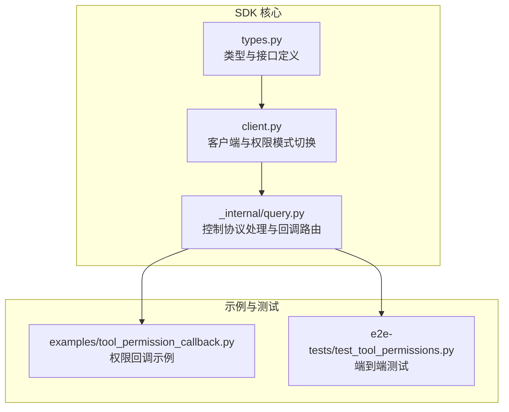
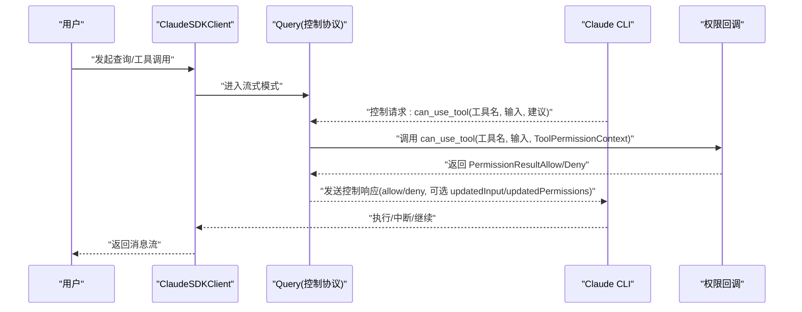
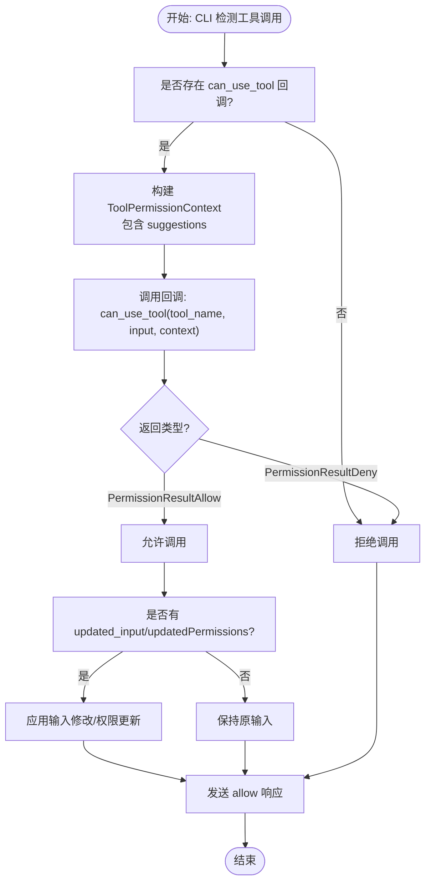
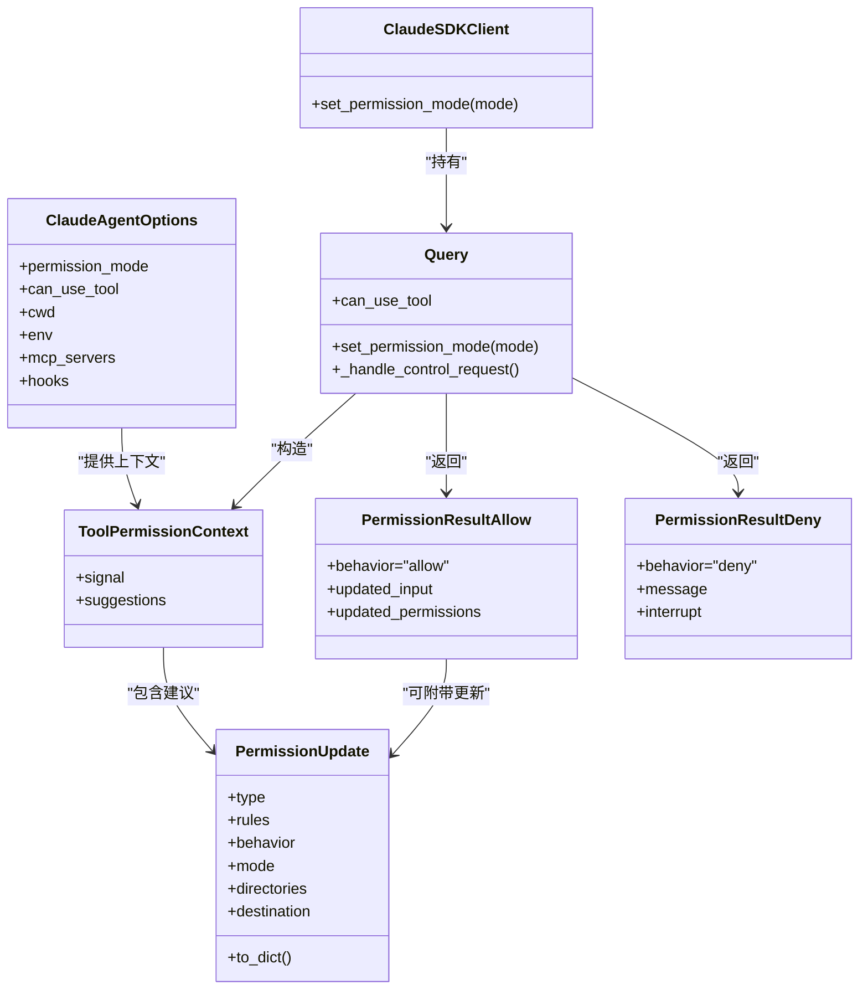

# 权限控制系统

<cite>
**本文引用的文件**
- [types.py](file://src/claude_agent_sdk/types.py)
- [client.py](file://src/claude_agent_sdk/client.py)
- [query.py](file://src/claude_agent_sdk/_internal/query.py)
- [tool_permission_callback.py](file://examples/tool_permission_callback.py)
- [test_tool_permissions.py](file://e2e-tests/test_tool_permissions.py)
</cite>

## 目录
1. [简介](#简介)
2. [项目结构](#项目结构)
3. [核心组件](#核心组件)
4. [架构总览](#架构总览)
5. [详细组件分析](#详细组件分析)
6. [依赖关系分析](#依赖关系分析)
7. [性能考量](#性能考量)
8. [故障排查指南](#故障排查指南)
9. [结论](#结论)
10. [附录](#附录)

## 简介
本文件系统性阐述 Claude Agent SDK 的权限控制系统，重点覆盖：
- 工具权限控制与三种权限模式（default、acceptEdits、bypassPermissions）的设计与使用场景
- ToolPermissionContext 上下文对象的结构与用途
- 工具权限回调函数的实现方式、权限检查逻辑与动态权限授予/拒绝机制
- 实际应用示例：安全敏感操作保护与权限分级管理

该权限体系通过“控制协议”在 SDK 与 Claude CLI 之间建立双向通信，确保对工具调用进行细粒度控制，并支持运行时动态调整权限模式。

## 项目结构
围绕权限控制的核心代码位于以下模块：
- 类型与接口定义：types.py
- 客户端与权限模式切换：client.py
- 控制协议处理与回调路由：_internal/query.py
- 示例与端到端测试：examples/tool_permission_callback.py、e2e-tests/test_tool_permissions.py

图表来源
- [types.py:17-18](file://src/claude_agent_sdk/types.py#L17-L18)
- [client.py:234-256](file://src/claude_agent_sdk/client.py#L234-L256)
- [query.py:53-118](file://src/claude_agent_sdk/_internal/query.py#L53-L118)
- [tool_permission_callback.py:26-93](file://examples/tool_permission_callback.py#L26-L93)
- [test_tool_permissions.py:19-60](file://e2e-tests/test_tool_permissions.py#L19-L60)

章节来源
- [types.py:17-18](file://src/claude_agent_sdk/types.py#L17-L18)
- [client.py:234-256](file://src/claude_agent_sdk/client.py#L234-L256)
- [query.py:53-118](file://src/claude_agent_sdk/_internal/query.py#L53-L118)

## 核心组件
- 权限模式枚举：default、acceptEdits、plan、bypassPermissions
- 工具权限回调签名：接收工具名、输入参数、ToolPermissionContext，返回 PermissionResultAllow 或 PermissionResultDeny
- ToolPermissionContext：包含信号与 CLI 建议（PermissionUpdate 列表）
- PermissionUpdate：用于动态更新权限规则或模式
- ClaudeAgentOptions：配置 can_use_tool 回调与 permission_mode

章节来源
- [types.py:17-18](file://src/claude_agent_sdk/types.py#L17-L18)
- [types.py:124-157](file://src/claude_agent_sdk/types.py#L124-L157)
- [types.py:68-121](file://src/claude_agent_sdk/types.py#L68-L121)
- [types.py:1030-1099](file://src/claude_agent_sdk/types.py#L1030-L1099)

## 架构总览
权限控制通过控制协议在 SDK 与 CLI 之间传递“是否允许某工具调用”的决策请求。当 CLI 检测到需要用户确认的工具调用时，会向 SDK 发送 can_use_tool 请求；SDK 调用开发者提供的回调函数，根据策略决定允许、拒绝或修改输入后允许，并可附带动态权限更新建议。

图表来源
- [query.py:236-345](file://src/claude_agent_sdk/_internal/query.py#L236-L345)
- [query.py:245-286](file://src/claude_agent_sdk/_internal/query.py#L245-L286)
- [client.py:234-256](file://src/claude_agent_sdk/client.py#L234-L256)

## 详细组件分析

### 权限模式与使用场景
- default（默认模式）
  - 特点：对危险工具进行提示，非只读命令需经确认
  - 使用场景：日常开发与探索，兼顾安全性与交互性
- acceptEdits（自动接受文件编辑）
  - 特点：自动允许文件写入类工具（如 Write/Edit/MultiEdit），减少交互
  - 使用场景：代码审查、批量改写、自动化修复流程
- plan（计划模式）
  - 特点：允许工具执行但要求先生成计划
  - 使用场景：需要先评估再执行的高风险任务
- bypassPermissions（绕过权限）
  - 特点：允许所有工具，谨慎使用
  - 使用场景：受信任环境下的自动化脚本或内部工具链

章节来源
- [client.py:234-256](file://src/claude_agent_sdk/client.py#L234-L256)
- [types.py:17-18](file://src/claude_agent_sdk/types.py#L17-L18)

### ToolPermissionContext 上下文对象
- 字段
  - signal：未来支持中止信号（占位）
  - suggestions：来自 CLI 的权限建议列表（PermissionUpdate）
- 用途
  - 在回调中记录工具调用上下文
  - 接收 CLI 提供的权限建议，用于动态调整权限策略

章节来源
- [types.py:124-131](file://src/claude_agent_sdk/types.py#L124-L131)

### 权限回调函数实现
- 函数签名
  - 参数：tool_name（字符串）、input_data（字典）、context（ToolPermissionContext）
  - 返回：PermissionResultAllow 或 PermissionResultDeny
- 典型逻辑
  - 识别工具类型（只读 vs 写入/破坏性）
  - 基于输入参数进行安全检查（如路径前缀、命令模式）
  - 动态修改输入（如重定向写入路径）
  - 生成动态权限更新（如添加/替换规则、设置模式）
  - 对未知工具进行用户确认或策略化拒绝

章节来源
- [types.py:155-157](file://src/claude_agent_sdk/types.py#L155-L157)
- [tool_permission_callback.py:26-93](file://examples/tool_permission_callback.py#L26-L93)

### 权限更新与建议
- PermissionUpdate
  - 支持的操作：addRules、replaceRules、removeRules、setMode、addDirectories、removeDirectories
  - 可指定目标位置（userSettings、projectSettings、localSettings、session）
  - 转换为 CLI 控制协议格式（to_dict）
- CLI 建议
  - 在 can_use_tool 请求中携带 permission_suggestions
  - 回调可在返回 PermissionResultAllow 时附带 updatedPermissions

章节来源
- [types.py:68-121](file://src/claude_agent_sdk/types.py#L68-L121)
- [query.py:252-286](file://src/claude_agent_sdk/_internal/query.py#L252-L286)

### 控制协议与回调路由
- Query._handle_control_request
  - 处理 can_use_tool 请求：构造 ToolPermissionContext（含 suggestions），调用回调，转换 PermissionResult 为 CLI 响应
  - 处理 hook_callback 与 SDK MCP 请求
- ClaudeSDKClient.set_permission_mode
  - 运行时动态切换权限模式（仅流式模式有效）

章节来源
- [query.py:236-345](file://src/claude_agent_sdk/_internal/query.py#L236-L345)
- [query.py:540-547](file://src/claude_agent_sdk/_internal/query.py#L540-L547)
- [client.py:234-256](file://src/claude_agent_sdk/client.py#L234-L256)

### 权限结果数据结构
- PermissionResultAllow
  - behavior: "allow"
  - updated_input: 可选，修改后的输入
  - updated_permissions: 可选，动态权限更新列表
- PermissionResultDeny
  - behavior: "deny"
  - message: 拒绝原因
  - interrupt: 是否中断后续流程

章节来源
- [types.py:135-151](file://src/claude_agent_sdk/types.py#L135-L151)
- [query.py:264-286](file://src/claude_agent_sdk/_internal/query.py#L264-L286)

### 权限控制工作流（算法流程）

图表来源
- [query.py:245-286](file://src/claude_agent_sdk/_internal/query.py#L245-L286)

## 依赖关系分析
- 类型层
  - PermissionMode、PermissionBehavior、PermissionRuleValue、PermissionUpdate、ToolPermissionContext、PermissionResultAllow/Deny、CanUseTool
- 组件层
  - ClaudeAgentOptions 持有 can_use_tool 与 permission_mode
  - ClaudeSDKClient 在连接时校验回调与互斥配置，并暴露 set_permission_mode
  - Query 在控制协议中路由 can_use_tool 请求，调用回调并转换响应

图表来源
- [types.py:17-18](file://src/claude_agent_sdk/types.py#L17-L18)
- [types.py:68-157](file://src/claude_agent_sdk/types.py#L68-L157)
- [types.py:1030-1099](file://src/claude_agent_sdk/types.py#L1030-L1099)
- [client.py:234-256](file://src/claude_agent_sdk/client.py#L234-L256)
- [query.py:53-118](file://src/claude_agent_sdk/_internal/query.py#L53-L118)

章节来源
- [types.py:17-18](file://src/claude_agent_sdk/types.py#L17-L18)
- [types.py:68-157](file://src/claude_agent_sdk/types.py#L68-L157)
- [types.py:1030-1099](file://src/claude_agent_sdk/types.py#L1030-L1099)
- [client.py:234-256](file://src/claude_agent_sdk/client.py#L234-L256)
- [query.py:53-118](file://src/claude_agent_sdk/_internal/query.py#L53-L118)

## 性能考量
- 流式模式必要性：使用 can_use_tool 回调必须启用流式模式，以便实时处理控制请求
- 回调开销：权限检查应在回调内尽量轻量，避免阻塞控制协议通道
- 动态权限更新：批量更新规则时注意序列化与网络往返时间
- 超时与取消：控制请求具备超时机制，异常与取消需正确传播

章节来源
- [client.py:113-127](file://src/claude_agent_sdk/client.py#L113-L127)
- [query.py:347-393](file://src/claude_agent_sdk/_internal/query.py#L347-L393)

## 故障排查指南
- 回调未触发
  - 确认使用了非只读工具（例如 Bash、Write、Edit、MultiEdit）
  - 确认 permission_mode 设置为 default 或 acceptEdits（某些只读工具可能被 CLI 自动放行）
- 回调冲突
  - can_use_tool 与 permission_prompt_tool_name 互斥，不可同时设置
- 权限模式切换
  - 仅在流式模式下可用，且需在连接后调用
- 端到端验证
  - 参考端到端测试，验证回调被调用且返回值符合预期

章节来源
- [test_tool_permissions.py:19-60](file://e2e-tests/test_tool_permissions.py#L19-L60)
- [client.py:113-127](file://src/claude_agent_sdk/client.py#L113-L127)

## 结论
Claude Agent SDK 的权限控制系统通过清晰的类型定义、严格的控制协议与灵活的回调机制，实现了对工具调用的精细化控制。开发者可通过 ToolPermissionContext 获取上下文与 CLI 建议，结合 PermissionUpdate 实现动态权限管理；通过三种权限模式在安全性与易用性之间取得平衡。建议在生产环境中优先采用 default 模式，配合严格的回调策略与最小权限原则，逐步引入 acceptEdits 或 plan 模式以提升效率。

## 附录

### 实际应用示例

- 示例一：基于工具类型与输入的安全策略
  - 仅允许 Read/Glob/Grep 等只读工具
  - 拒绝写入系统目录（/etc、/usr）
  - 将非安全路径的写入重定向至安全目录
  - 检查 Bash 命令中的危险模式（如 rm -rf、sudo 等）
  - 未知工具提示用户确认

  章节来源
  - [tool_permission_callback.py:26-93](file://examples/tool_permission_callback.py#L26-L93)

- 示例二：端到端验证
  - 使用 can_use_tool 回调跟踪工具调用
  - 验证非只读工具（如 Bash）触发回调
  - 清理测试资源

  章节来源
  - [test_tool_permissions.py:19-60](file://e2e-tests/test_tool_permissions.py#L19-L60)

- 示例三：动态权限更新
  - 在回调中返回 updatedPermissions，向 CLI 建议添加/替换规则或切换模式
  - 通过 PermissionUpdate 的 to_dict 输出适配 CLI 控制协议

  章节来源
  - [types.py:68-121](file://src/claude_agent_sdk/types.py#L68-L121)
  - [query.py:274-278](file://src/claude_agent_sdk/_internal/query.py#L274-L278)