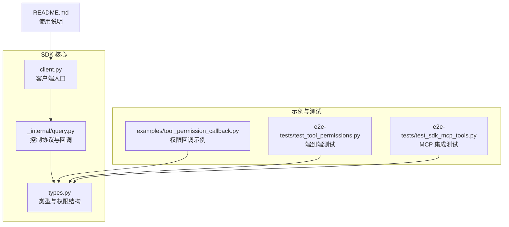
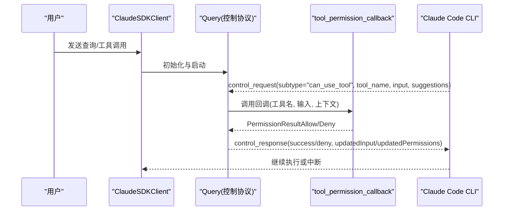
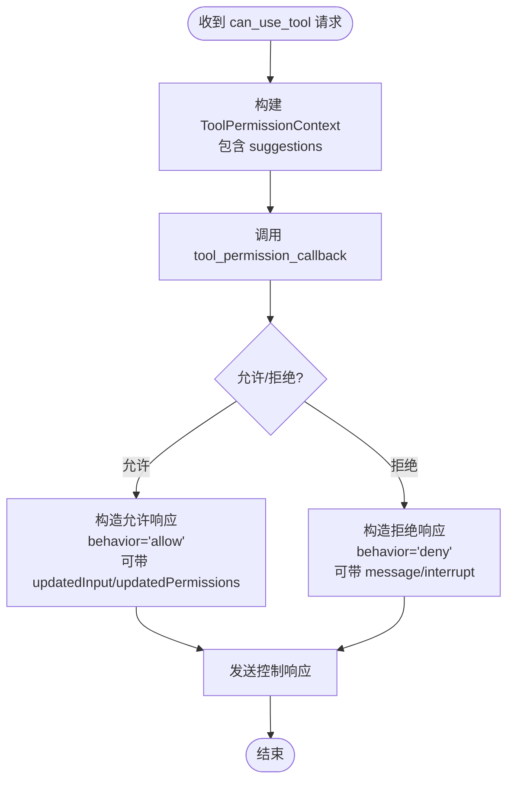
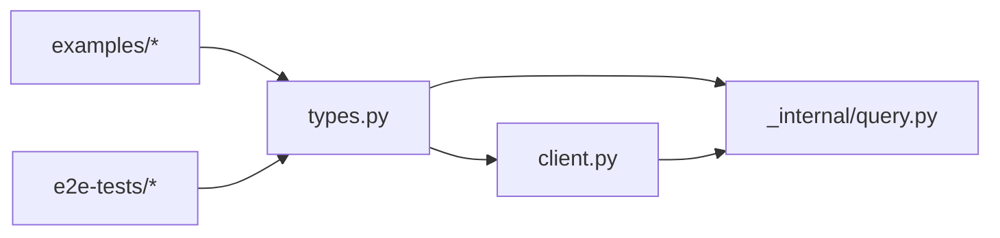

# 权限模型

<cite>
**本文引用的文件**
- [types.py](file://src/claude_agent_sdk/types.py)
- [client.py](file://src/claude_agent_sdk/client.py)
- [query.py](file://src/claude_agent_sdk/_internal/query.py)
- [tool_permission_callback.py](file://examples/tool_permission_callback.py)
- [test_tool_permissions.py](file://e2e-tests/test_tool_permissions.py)
- [test_sdk_mcp_tools.py](file://e2e-tests/test_sdk_mcp_tools.py)
- [README.md](file://README.md)
</cite>

## 目录
1. [简介](#简介)
2. [项目结构](#项目结构)
3. [核心组件](#核心组件)
4. [架构总览](#架构总览)
5. [详细组件分析](#详细组件分析)
6. [依赖分析](#依赖分析)
7. [性能考量](#性能考量)
8. [故障排查指南](#故障排查指南)
9. [结论](#结论)
10. [附录](#附录)

## 简介
本文件系统性阐述 Claude Agent SDK 的权限模型，重点覆盖：
- 工具访问控制机制与权限模式选择
- 运行时权限管理（tool_permission_callback）的实现与使用
- 权限决策流程（工具调用请求的验证与授权）
- 不同权限模式的安全考量（含危险工具处理与用户确认机制）
- 权限回调函数的实现示例（自定义权限控制逻辑）
- 权限缓存与状态管理、多轮对话中的权限持久化
- 权限模型与 MCP 工具系统的集成方式

## 项目结构
围绕权限模型的关键代码分布在以下模块：
- 类型与权限数据结构：types.py
- 客户端入口与运行时控制：client.py
- 控制协议与权限回调处理：_internal/query.py
- 示例与端到端测试：examples/tool_permission_callback.py、e2e-tests/test_tool_permissions.py、e2e-tests/test_sdk_mcp_tools.py
- 文档与使用说明：README.md

图表来源
- [types.py:17-157](file://src/claude_agent_sdk/types.py#L17-L157)
- [client.py:21-500](file://src/claude_agent_sdk/client.py#L21-L500)
- [query.py:53-679](file://src/claude_agent_sdk/_internal/query.py#L53-L679)
- [tool_permission_callback.py:1-159](file://examples/tool_permission_callback.py#L1-L159)
- [test_tool_permissions.py:1-66](file://e2e-tests/test_tool_permissions.py#L1-L66)
- [test_sdk_mcp_tools.py:115-168](file://e2e-tests/test_sdk_mcp_tools.py#L115-L168)
- [README.md:57-73](file://README.md#L57-L73)

章节来源
- [types.py:17-157](file://src/claude_agent_sdk/types.py#L17-L157)
- [client.py:21-500](file://src/claude_agent_sdk/client.py#L21-L500)
- [query.py:53-679](file://src/claude_agent_sdk/_internal/query.py#L53-L679)
- [tool_permission_callback.py:1-159](file://examples/tool_permission_callback.py#L1-L159)
- [test_tool_permissions.py:1-66](file://e2e-tests/test_tool_permissions.py#L1-L66)
- [test_sdk_mcp_tools.py:115-168](file://e2e-tests/test_sdk_mcp_tools.py#L115-L168)
- [README.md:57-73](file://README.md#L57-L73)

## 核心组件
- 权限模式与行为
  - 权限模式：default、acceptEdits、plan、bypassPermissions
  - 权限行为：allow、deny、ask
  - 权限更新类型：addRules、replaceRules、removeRules、setMode、addDirectories、removeDirectories
- 工具权限回调
  - CanUseTool：异步回调签名，接收 tool_name、input、ToolPermissionContext，返回 PermissionResultAllow 或 PermissionResultDeny
  - ToolPermissionContext：包含 suggestions（来自 CLI 的权限建议）等上下文信息
- 权限结果
  - PermissionResultAllow：允许执行，可选 updated_input、updated_permissions
  - PermissionResultDeny：拒绝执行，可选 message、interrupt
- 客户端控制
  - set_permission_mode：动态切换权限模式
  - get_mcp_status：查询 MCP 服务器连接状态（与工具可用性相关）

章节来源
- [types.py:17-157](file://src/claude_agent_sdk/types.py#L17-L157)
- [types.py:123-157](file://src/claude_agent_sdk/types.py#L123-L157)
- [client.py:234-256](file://src/claude_agent_sdk/client.py#L234-L256)

## 架构总览
权限模型通过控制协议在 SDK 与 Claude Code CLI 之间协作完成：
- 客户端在交互会话中启用 can_use_tool 回调（需流式模式）
- 当 CLI 检测到需要授权的工具调用时，向 SDK 发送 control_request subtype=can_use_tool
- SDK 调用用户提供的回调，根据策略决定 allow/deny，并可修改输入或更新权限
- SDK 将结果转换为控制响应返回给 CLI

图表来源
- [query.py:236-346](file://src/claude_agent_sdk/_internal/query.py#L236-L346)
- [types.py:123-157](file://src/claude_agent_sdk/types.py#L123-L157)

## 详细组件分析

### 权限模式与安全考量
- default：默认模式，CLI 对危险工具进行提示；适合一般场景
- acceptEdits：自动接受文件编辑类工具，提升开发效率但降低安全性
- plan：用于规划阶段，可能限制某些写操作
- bypassPermissions：绕过权限检查（高风险），仅在受控环境下使用
- 行为 ask/deny/allow：用于规则与钩子的决策分支

安全要点
- 危险工具识别：如 Bash 命令模式匹配、文件写入路径校验
- 用户确认机制：在 default 模式下，CLI 可能弹出确认对话
- 自动放行与拦截：read-only 工具在某些情况下自动放行，write/edit 工具需要显式授权

章节来源
- [types.py:17-57](file://src/claude_agent_sdk/types.py#L17-L57)
- [client.py:234-256](file://src/claude_agent_sdk/client.py#L234-L256)
- [README.md:57-73](file://README.md#L57-L73)

### 运行时权限管理（tool_permission_callback）
- 回调签名与职责
  - 接收工具名、输入参数、ToolPermissionContext
  - 返回 PermissionResultAllow 或 PermissionResultDeny
  - 可修改输入（如重定向输出路径）、更新权限（返回 updated_permissions）
- 上下文与建议
  - suggestions：来自 CLI 的权限建议列表，可用于引导用户或自动决策
- 流式模式要求
  - 使用 can_use_tool 回调时，必须以流式模式（AsyncIterable）发送提示
  - 与 permission_prompt_tool_name 互斥

章节来源
- [types.py:123-157](file://src/claude_agent_sdk/types.py#L123-L157)
- [client.py:112-131](file://src/claude_agent_sdk/client.py#L112-L131)
- [query.py:236-346](file://src/claude_agent_sdk/_internal/query.py#L236-L346)

### 权限决策流程
- 请求到达：CLI 发送 control_request subtype=can_use_tool
- SDK 处理：构造 ToolPermissionContext，调用回调
- 结果转换：PermissionResultAllow/Deny 转换为控制响应格式
  - 允许：behavior=allow，可携带 updatedInput
  - 拒绝：behavior=deny，可携带 message、interrupt
- 更新权限：若回调返回 updated_permissions，则写回 CLI

图表来源
- [query.py:236-346](file://src/claude_agent_sdk/_internal/query.py#L236-L346)
- [types.py:135-157](file://src/claude_agent_sdk/types.py#L135-L157)

### 权限回调实现示例
示例展示了如何基于工具类型、输入内容进行决策，并支持：
- 自动放行只读工具
- 拒绝写入系统目录
- 重定向写入路径到安全目录
- 拦截危险 Bash 命令
- 对未知工具进行用户确认

章节来源
- [tool_permission_callback.py:26-94](file://examples/tool_permission_callback.py#L26-L94)

### 端到端测试验证
- 测试确保 can_use_tool 回调在非只读命令（如 touch）触发时被调用
- 验证回调返回允许后，工具得以执行

章节来源
- [test_tool_permissions.py:17-66](file://e2e-tests/test_tool_permissions.py#L17-L66)

### 权限与 MCP 工具系统的集成
- allowed_tools/disallowed_tools：工具白名单/黑名单，影响工具是否直接放行或进入权限流程
- SDK MCP 服务器：通过 create_sdk_mcp_server 注册内联工具，结合 allowed_tools 控制可用性
- 未显式允许的 SDK MCP 工具不会被执行（测试覆盖）

章节来源
- [README.md:57-73](file://README.md#L57-L73)
- [test_sdk_mcp_tools.py:115-168](file://e2e-tests/test_sdk_mcp_tools.py#L115-L168)

### 权限缓存与状态管理、多轮对话中的持久化
- 动态切换权限模式：通过 set_permission_mode 在会话中调整策略
- MCP 状态查询：通过 get_mcp_status 获取服务器连接状态与工具清单
- 会话生命周期：客户端在连接期间维护控制协议状态，权限变更通过控制请求生效

章节来源
- [client.py:234-256](file://src/claude_agent_sdk/client.py#L234-L256)
- [client.py:385-416](file://src/claude_agent_sdk/client.py#L385-L416)
- [query.py:532-547](file://src/claude_agent_sdk/_internal/query.py#L532-L547)

## 依赖分析
- 类型依赖：types.py 定义了权限模式、行为、规则、回调签名与结果类型
- 运行时依赖：client.py 在连接时校验 can_use_tool 与 permission_prompt_tool_name 的互斥性，并设置控制协议
- 控制协议依赖：query.py 负责解析 CLI 的 control_request，调用回调并返回控制响应

图表来源
- [types.py:17-157](file://src/claude_agent_sdk/types.py#L17-L157)
- [client.py:112-131](file://src/claude_agent_sdk/client.py#L112-L131)
- [query.py:236-346](file://src/claude_agent_sdk/_internal/query.py#L236-L346)

## 性能考量
- 回调同步：tool_permission_callback 必须是异步函数，避免阻塞控制协议
- 输入修改：尽量减少昂贵的输入变换，必要时缓存计算结果
- 流式模式：使用流式输入可减少等待时间，提高交互体验
- MCP 服务器：SDK MCP 服务器在进程内运行，避免 IPC 开销

## 故障排查指南
- 回调未触发
  - 确认使用了 can_use_tool 并且以流式模式发送提示
  - 检查 allowed_tools 是否已包含目标工具（否则会进入权限流程）
- 回调返回类型错误
  - 必须返回 PermissionResultAllow 或 PermissionResultDeny
- 权限模式切换无效
  - 确保在流式模式下调用 set_permission_mode
- MCP 工具未执行
  - 检查 allowed_tools 是否包含对应工具名称前缀（如 mcp__server__tool）

章节来源
- [query.py:264-286](file://src/claude_agent_sdk/_internal/query.py#L264-L286)
- [client.py:112-131](file://src/claude_agent_sdk/client.py#L112-L131)
- [client.py:234-256](file://src/claude_agent_sdk/client.py#L234-L256)
- [test_tool_permissions.py:17-66](file://e2e-tests/test_tool_permissions.py#L17-L66)
- [test_sdk_mcp_tools.py:115-168](file://e2e-tests/test_sdk_mcp_tools.py#L115-L168)

## 结论
Claude Agent SDK 的权限模型通过“权限模式 + 工具权限回调”的组合，在保证安全的同时提供了灵活的定制能力。开发者可通过 can_use_tool 实现细粒度的工具控制与输入修改，并借助 set_permission_mode 与 get_mcp_status 在多轮对话中动态调整策略。与 MCP 工具系统的集成进一步扩展了工具生态，配合 allowed_tools/disallowed_tools 实现可控的工具可用性。

## 附录
- 使用建议
  - 默认使用 default 模式，仅在需要时切换到 acceptEdits 或 bypassPermissions
  - 对危险工具（如 Bash、文件写入）实施严格校验与最小权限原则
  - 利用 suggestions 与 updated_permissions 提升用户体验与安全性
  - 在复杂场景中结合钩子（hooks）实现更广泛的控制点