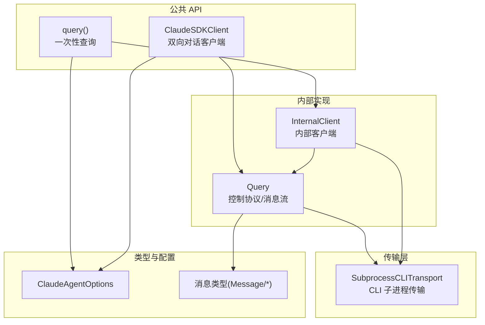
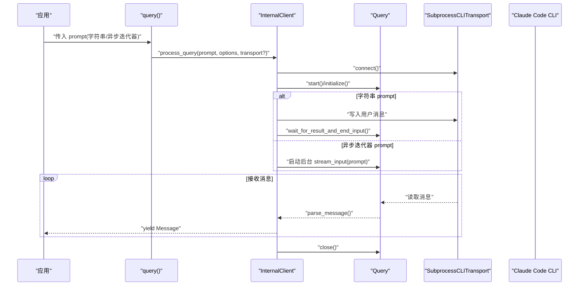
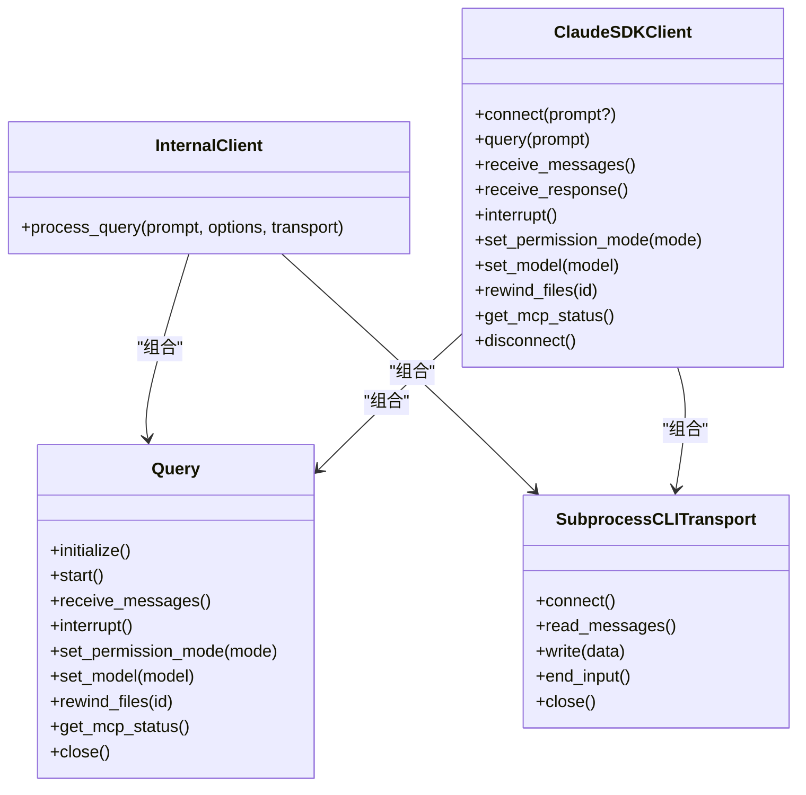

# 查询模式对比

<cite>
**本文引用的文件列表**
- [query.py](file://src/claude_agent_sdk/query.py)
- [client.py](file://src/claude_agent_sdk/client.py)
- [_internal/client.py](file://src/claude_agent_sdk/_internal/client.py)
- [_internal/query.py](file://src/claude_agent_sdk/_internal/query.py)
- [types.py](file://src/claude_agent_sdk/types.py)
- [subprocess_cli.py](file://src/claude_agent_sdk/_internal/transport/subprocess_cli.py)
- [streaming_mode.py](file://examples/streaming_mode.py)
- [quick_start.py](file://examples/quick_start.py)
- [tools_option.py](file://examples/tools_option.py)
</cite>

## 目录
1. [简介](#简介)
2. [项目结构](#项目结构)
3. [核心组件](#核心组件)
4. [架构总览](#架构总览)
5. [详细组件分析](#详细组件分析)
6. [依赖关系分析](#依赖关系分析)
7. [性能考量](#性能考量)
8. [故障排查指南](#故障排查指南)
9. [结论](#结论)
10. [附录：使用场景与示例路径](#附录使用场景与示例路径)

## 简介
本文件系统性对比 Claude Agent SDK 中两种交互模式：
- 一次性查询（query）：无状态、单向、简单、不可中断
- 双向对话（ClaudeSDKClient）：有状态、双向、复杂、可中断、可动态控制

我们将从架构、数据流、处理逻辑、集成点、错误处理与性能等方面进行深入解析，并给出具体使用场景与示例路径，帮助读者在不同需求下做出正确选择。

## 项目结构
围绕查询模式的关键模块如下：
- 公共入口与高层 API：query() 与 ClaudeSDKClient
- 内部实现：InternalClient、Query 控制协议与消息流
- 类型与配置：ClaudeAgentOptions、消息类型、控制协议类型
- 传输层：SubprocessCLITransport（始终以流式模式运行）

图表来源
- [query.py:12-127](file://src/claude_agent_sdk/query.py#L12-L127)
- [client.py:21-500](file://src/claude_agent_sdk/client.py#L21-L500)
- [_internal/client.py:20-146](file://src/claude_agent_sdk/_internal/client.py#L20-L146)
- [_internal/query.py:53-679](file://src/claude_agent_sdk/_internal/query.py#L53-L679)
- [subprocess_cli.py:33-62](file://src/claude_agent_sdk/_internal/transport/subprocess_cli.py#L33-L62)
- [types.py:1030-1199](file://src/claude_agent_sdk/types.py#L1030-L1199)

章节来源
- [query.py:12-127](file://src/claude_agent_sdk/query.py#L12-L127)
- [client.py:21-500](file://src/claude_agent_sdk/client.py#L21-L500)
- [_internal/client.py:20-146](file://src/claude_agent_sdk/_internal/client.py#L20-L146)
- [_internal/query.py:53-679](file://src/claude_agent_sdk/_internal/query.py#L53-L679)
- [subprocess_cli.py:33-62](file://src/claude_agent_sdk/_internal/transport/subprocess_cli.py#L33-L62)
- [types.py:1030-1199](file://src/claude_agent_sdk/types.py#L1030-L1199)

## 核心组件
- query()：面向“一次性、无状态、单向”的查询场景；支持字符串或异步迭代器作为 prompt；内部通过 InternalClient 调用 Query 控制协议，始终以流式模式运行。
- ClaudeSDKClient：面向“有状态、双向、可中断、可动态控制”的会话场景；支持多轮对话、工具权限切换、模型切换、任务停止、MCP 服务器管理等高级能力。
- InternalClient：封装传输连接、初始化、输入写入、消息接收与解析。
- Query：实现控制协议（initialize、interrupt、set_permission_mode、mcp_* 等），负责消息路由、控制请求/响应、Hook 回调、SDK MCP 服务器桥接。
- SubprocessCLITransport：基于 CLI 的子进程传输，始终启用流式模式（stream-json），通过 stdin/stdout 读写消息。
- ClaudeAgentOptions：统一的配置载体，包含工具、系统提示、MCP 服务器、权限模式、工作目录、环境变量、钩子、代理/插件等。

章节来源
- [query.py:12-127](file://src/claude_agent_sdk/query.py#L12-L127)
- [client.py:21-500](file://src/claude_agent_sdk/client.py#L21-L500)
- [_internal/client.py:20-146](file://src/claude_agent_sdk/_internal/client.py#L20-L146)
- [_internal/query.py:53-679](file://src/claude_agent_sdk/_internal/query.py#L53-L679)
- [subprocess_cli.py:33-62](file://src/claude_agent_sdk/_internal/transport/subprocess_cli.py#L33-L62)
- [types.py:1030-1199](file://src/claude_agent_sdk/types.py#L1030-L1199)

## 架构总览
下面的序列图展示了两种模式在关键流程上的差异：query() 是“一次性”且“不可中断”的单向流；ClaudeSDKClient 是“持续会话”且“可中断/可控制”的双向流。

图表来源
- [query.py:12-127](file://src/claude_agent_sdk/query.py#L12-L127)
- [_internal/client.py:44-146](file://src/claude_agent_sdk/_internal/client.py#L44-L146)
- [_internal/query.py:165-679](file://src/claude_agent_sdk/_internal/query.py#L165-L679)
- [subprocess_cli.py:33-62](file://src/claude_agent_sdk/_internal/transport/subprocess_cli.py#L33-L62)

章节来源
- [query.py:12-127](file://src/claude_agent_sdk/query.py#L12-L127)
- [_internal/client.py:44-146](file://src/claude_agent_sdk/_internal/client.py#L44-L146)
- [_internal/query.py:165-679](file://src/claude_agent_sdk/_internal/query.py#L165-L679)
- [subprocess_cli.py:33-62](file://src/claude_agent_sdk/_internal/transport/subprocess_cli.py#L33-L62)

## 详细组件分析

### 一次性查询（query）
- 无状态与单向：每次调用独立完成，不维护会话上下文；即使传入异步迭代器，也是“先发后收”的单向流，不支持后续交互。
- 支持的 prompt 形态：
  - 字符串：内部自动包装为用户消息并写入 stdin，等待首个结果后关闭输入。
  - 异步迭代器：内部在后台任务中持续写入消息，直到迭代结束；但仍是单向，不会根据响应再发送新消息。
- options 配置作用：
  - 权限模式、工具集、系统提示、工作目录、MCP 服务器、钩子、代理/插件、输出格式、思考配置、文件检查点等。
  - 当启用 can_use_tool 时，要求使用异步迭代器（否则抛出异常），并自动设置 permission_prompt_tool_name 为 "stdio"。
- transport 自定义：可注入自定义 Transport 实现，默认使用 SubprocessCLITransport，始终以流式模式运行。
- 流式特性与限制：
  - 即使是字符串 prompt，也通过流式模式发送，确保大配置（如 agents）可通过 initialize 请求经 stdin 发送，避免命令行长度限制。
  - 不支持中断；无法在收到部分响应后继续发送后续消息。

章节来源
- [query.py:12-127](file://src/claude_agent_sdk/query.py#L12-L127)
- [_internal/client.py:44-146](file://src/claude_agent_sdk/_internal/client.py#L44-L146)
- [types.py:1030-1199](file://src/claude_agent_sdk/types.py#L1030-L1199)

### 双向对话（ClaudeSDKClient）
- 有状态与双向：维持会话上下文，可在任意时刻发送新消息、接收响应、中断、切换权限/模型、管理 MCP 服务器、停止任务等。
- 关键能力：
  - query()：发送字符串或异步迭代器消息；字符串会被包装为用户消息；异步迭代器逐条写入。
  - receive_messages()/receive_response()：分别用于遍历完整消息流或仅到首个 ResultMessage 结束。
  - interrupt()：发送中断请求（需保持活跃的消息消费通道）。
  - set_permission_mode()/set_model()：运行时调整权限与模型。
  - rewind_files()/toggle_mcp_server()/stop_task()/get_mcp_status()：文件回滚、MCP 开关、任务停止、状态查询。
- 连接与生命周期：
  - connect()：建立传输、初始化 Query、启动消息读取、可选地开始发送初始 prompt 流。
  - __aenter__/__aexit__：上下文管理器，自动 connect/disconnect。
- 限制与注意事项：
  - 客端实例不能跨异步运行时上下文使用（内部持有持久 anyio 任务组）。
  - can_use_tool 回调需要异步迭代器模式，且与 permission_prompt_tool_name 互斥。

章节来源
- [client.py:21-500](file://src/claude_agent_sdk/client.py#L21-L500)
- [_internal/query.py:53-679](file://src/claude_agent_sdk/_internal/query.py#L53-L679)

### 控制协议与消息流（Query）
- 初始化与控制：
  - initialize()：发送 initialize 控制请求，携带 hooks 与 agents（通过 stdin 的 initialize 请求发送）。
  - 控制请求类型：interrupt、set_permission_mode、set_model、rewind_files、mcp_status/mcp_reconnect/mcp_toggle、stop_task 等。
- 消息路由与解析：
  - _read_messages()：从传输读取消息，区分控制消息与 SDK 消息；控制消息交由 _handle_control_request() 处理；SDK 消息进入内存流供上层消费。
  - receive_messages()：异步迭代 SDK 消息；遇到 "end" 或 "error" 特殊消息时终止或抛错。
- 输入流与关闭策略：
  - stream_input()：持续写入异步迭代器中的消息；在 SDK MCP 服务器或 hooks 需要双向通信时，等待首个结果后再关闭 stdin，否则立即关闭。
  - wait_for_result_and_end_input()：根据 hooks/MCP 服务器存在与否决定是否等待首个结果再关闭 stdin。
- Hook 与 MCP：
  - Hook 回调注册与转换（async_/continue_ 到 async/continue）。
  - SDK MCP 服务器桥接：手动路由 initialize/tools/list/tools/call 等方法，返回 JSON-RPC 响应。

章节来源
- [_internal/query.py:53-679](file://src/claude_agent_sdk/_internal/query.py#L53-L679)

### 传输层（SubprocessCLITransport）
- 始终以流式模式（stream-json）运行，确保：
  - 通过 stdin 发送 initialize 请求与用户消息，避免命令行长度限制。
  - 通过 stdout 流式接收消息，支持高吞吐与低延迟。
- 支持 stderr 输出回调、最大缓冲区大小、工作目录、CLI 路径、环境变量等配置。

章节来源
- [subprocess_cli.py:33-62](file://src/claude_agent_sdk/_internal/transport/subprocess_cli.py#L33-L62)

### 类型与配置（ClaudeAgentOptions）
- 统一承载所有配置项：工具、系统提示、MCP 服务器、权限模式、模型、预算、钩子、代理/插件、思维配置、输出格式、文件检查点等。
- 与控制协议字段一一对应，保证 Python SDK 与 CLI 的兼容性。

章节来源
- [types.py:1030-1199](file://src/claude_agent_sdk/types.py#L1030-L1199)

## 依赖关系分析
- query() 依赖 InternalClient，InternalClient 依赖 Query 与 SubprocessCLITransport。
- ClaudeSDKClient 直接依赖 Query 与 SubprocessCLITransport，并在 connect() 中完成初始化。
- Query 依赖 anyio 任务组、内存对象流、控制协议类型与 MCP 类型。
- 所有消息类型（User/Assistant/System/Result/StreamEvent/RateLimitEvent）由 types.py 定义，供上层消费。

图表来源
- [_internal/client.py:20-146](file://src/claude_agent_sdk/_internal/client.py#L20-L146)
- [_internal/query.py:53-679](file://src/claude_agent_sdk/_internal/query.py#L53-L679)
- [client.py:21-500](file://src/claude_agent_sdk/client.py#L21-L500)
- [subprocess_cli.py:33-62](file://src/claude_agent_sdk/_internal/transport/subprocess_cli.py#L33-L62)

章节来源
- [_internal/client.py:20-146](file://src/claude_agent_sdk/_internal/client.py#L20-L146)
- [_internal/query.py:53-679](file://src/claude_agent_sdk/_internal/query.py#L53-L679)
- [client.py:21-500](file://src/claude_agent_sdk/client.py#L21-L500)
- [subprocess_cli.py:33-62](file://src/claude_agent_sdk/_internal/transport/subprocess_cli.py#L33-L62)

## 性能考量
- 流式模式优势：
  - 通过 stdin 流式发送 initialize 与用户消息，避免命令行长度限制，适合大配置（如 agents）。
  - 低延迟、高吞吐的消息读写，适合实时交互。
- 关闭策略：
  - 在存在 SDK MCP 服务器或 hooks 的情况下，等待首个结果后再关闭 stdin，确保双向控制协议通信完成。
- 资源管理：
  - Query 使用 anyio 任务组管理读取与输入流；异常时主动广播错误并关闭流，避免阻塞。
- 限制与权衡：
  - query() 不支持中断与后续交互，适合批处理与自动化脚本。
  - ClaudeSDKClient 需要持续的消息消费通道以支持中断等控制操作。

章节来源
- [_internal/query.py:614-647](file://src/claude_agent_sdk/_internal/query.py#L614-L647)
- [subprocess_cli.py:33-62](file://src/claude_agent_sdk/_internal/transport/subprocess_cli.py#L33-L62)

## 故障排查指南
- can_use_tool 与权限模式冲突：
  - 若启用 can_use_tool，必须使用异步迭代器 prompt，且不能同时设置 permission_prompt_tool_name。
- 中断无效：
  - ClaudeSDKClient 的中断需要在活跃消费消息通道的前提下才能生效；若未消费消息，中断请求可能被忽略。
- 会话上下文丢失：
  - ClaudeSDKClient 实例不能跨异步运行时上下文使用；应在同一上下文中完成所有操作。
- MCP 服务器问题：
  - 使用 get_mcp_status() 检查连接状态；必要时使用 reconnect_mcp_server() 或 toggle_mcp_server()。
- 错误消息处理：
  - receive_messages() 会在收到 "error" 特殊消息时抛出异常；建议在上层捕获并记录。

章节来源
- [client.py:94-180](file://src/claude_agent_sdk/client.py#L94-L180)
- [_internal/query.py:172-235](file://src/claude_agent_sdk/_internal/query.py#L172-L235)

## 结论
- 一次性查询（query）适用于“简单、无状态、单向”的场景：单次提问、批量处理、CI/CD 自动化、已知输入的代码生成等。
- 双向对话（ClaudeSDKClient）适用于“有状态、可交互、可控制”的场景：聊天界面、调试探索、多轮对话、实时控制（中断/权限/模型/任务）等。
- 两者均以流式模式运行，确保大配置与高吞吐；但 query() 不支持中断与后续交互，ClaudeSDKClient 提供更丰富的控制能力与会话管理。

## 附录：使用场景与示例路径
- 一次性查询（query）
  - 简单问答：[quick_start.py:15-25](file://examples/quick_start.py#L15-L25)
  - 带选项的查询：[quick_start.py:27-44](file://examples/quick_start.py#L27-L44)
  - 工具使用示例：[quick_start.py:46-66](file://examples/quick_start.py#L46-L66)
  - 工具列表与预设：[tools_option.py:16-101](file://examples/tools_option.py#L16-L101)
- 双向对话（ClaudeSDKClient）
  - 基础流式示例：[streaming_mode.py:59-72](file://examples/streaming_mode.py#L59-L72)
  - 多轮对话：[streaming_mode.py:74-94](file://examples/streaming_mode.py#L74-L94)
  - 并发发送/接收：[streaming_mode.py:97-131](file://examples/streaming_mode.py#L97-L131)
  - 中断示例：[streaming_mode.py:133-174](file://examples/streaming_mode.py#L133-L174)
  - 自定义选项与工具：[streaming_mode.py:213-246](file://examples/streaming_mode.py#L213-L246)
  - 异步迭代器消息流：[streaming_mode.py:248-294](file://examples/streaming_mode.py#L248-L294)
  - Bash 命令与工具块：[streaming_mode.py:296-340](file://examples/streaming_mode.py#L296-L340)
  - 控制协议与中断：[streaming_mode.py:342-419](file://examples/streaming_mode.py#L342-L419)
  - 错误处理：[streaming_mode.py:421-465](file://examples/streaming_mode.py#L421-L465)