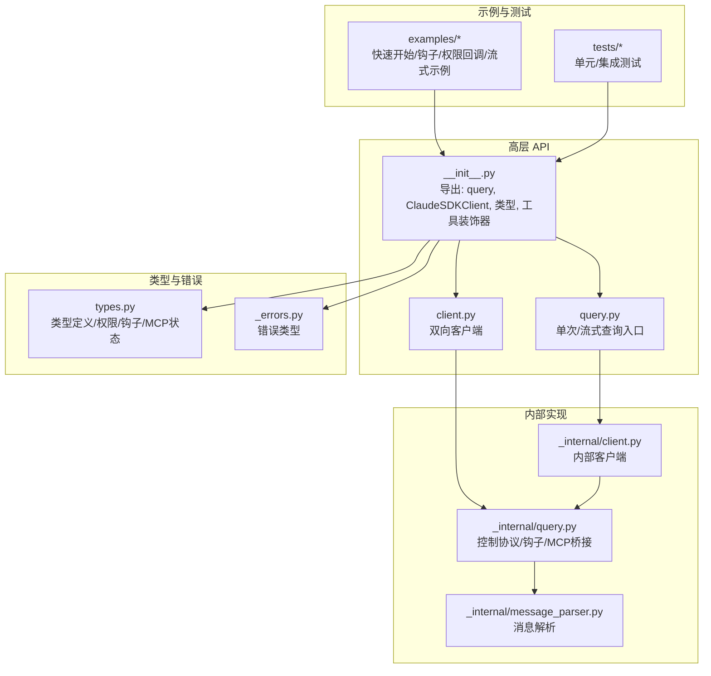
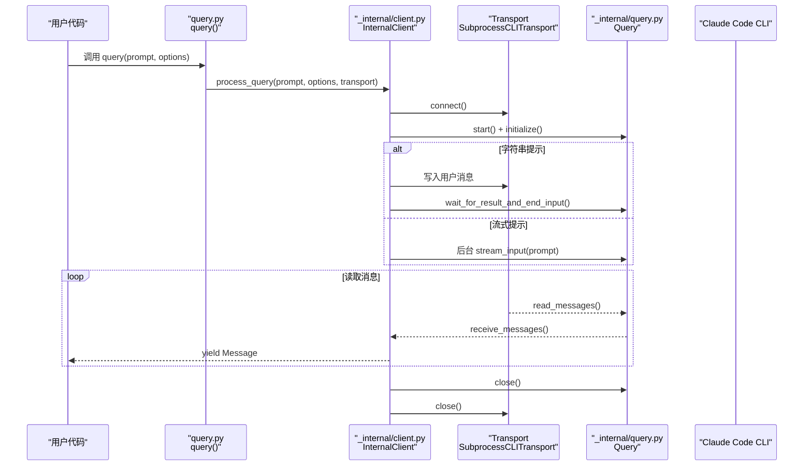
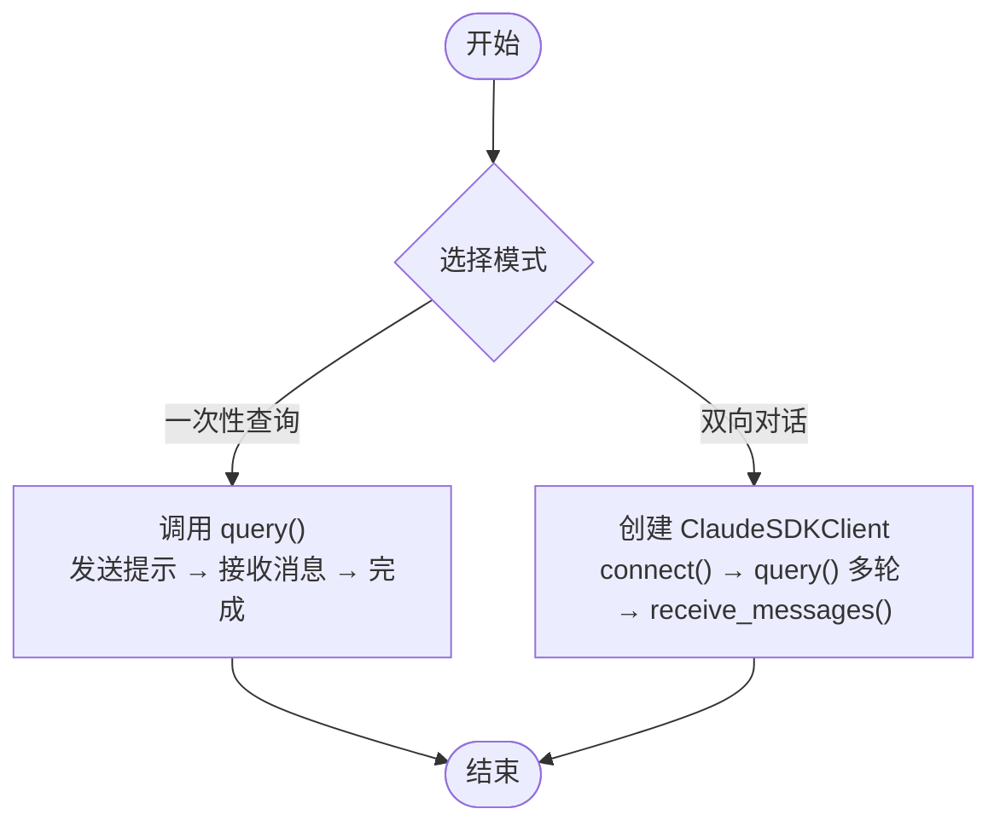
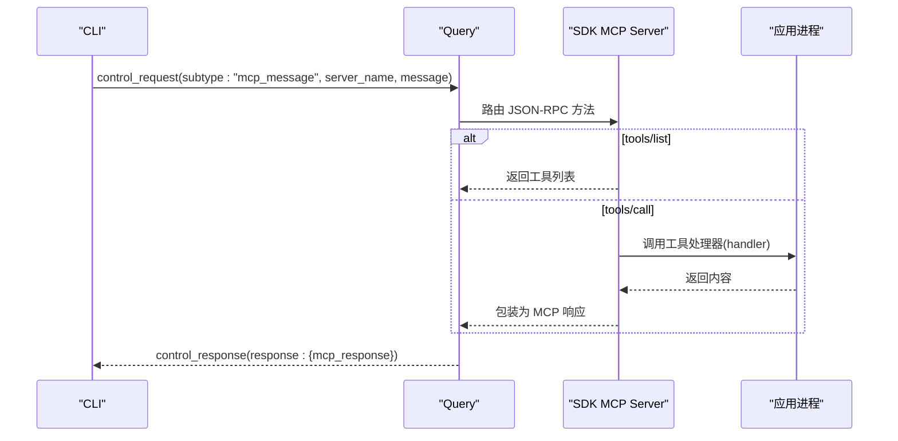
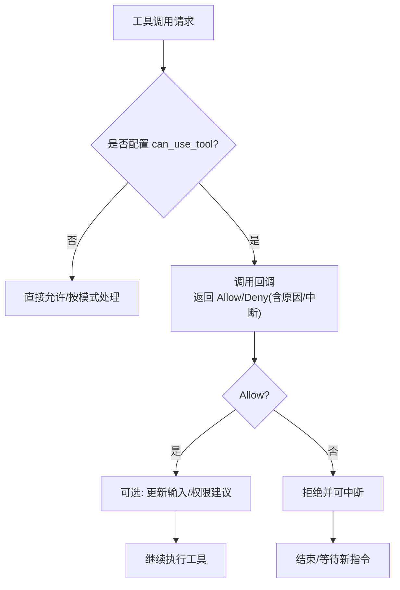
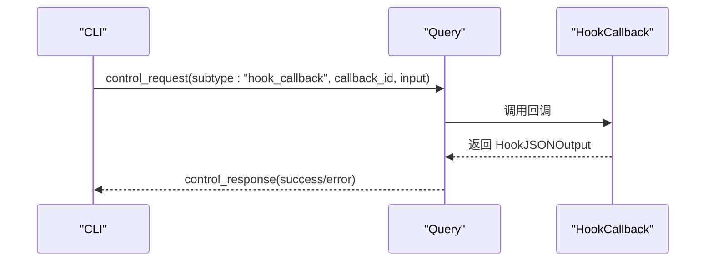
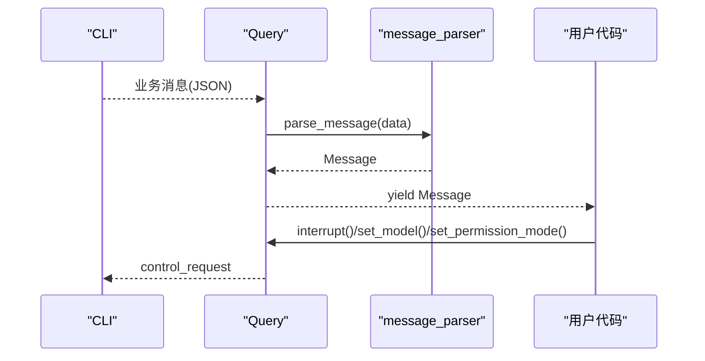
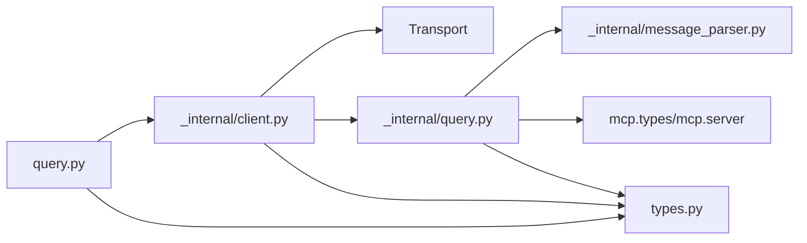

# 核心概念

<cite>
**本文引用的文件**
- [src/claude_agent_sdk/__init__.py](file://src/claude_agent_sdk/__init__.py)
- [src/claude_agent_sdk/client.py](file://src/claude_agent_sdk/client.py)
- [src/claude_agent_sdk/query.py](file://src/claude_agent_sdk/query.py)
- [src/claude_agent_sdk/types.py](file://src/claude_agent_sdk/types.py)
- [src/claude_agent_sdk/_internal/client.py](file://src/claude_agent_sdk/_internal/client.py)
- [src/claude_agent_sdk/_internal/query.py](file://src/claude_agent_sdk/_internal/query.py)
- [src/claude_agent_sdk/_internal/message_parser.py](file://src/claude_agent_sdk/_internal/message_parser.py)
- [src/claude_agent_sdk/_errors.py](file://src/claude_agent_sdk/_errors.py)
- [examples/quick_start.py](file://examples/quick_start.py)
- [examples/hooks.py](file://examples/hooks.py)
- [examples/tool_permission_callback.py](file://examples/tool_permission_callback.py)
- [examples/streaming_mode.py](file://examples/streaming_mode.py)
- [examples/streaming_mode_ipython.py](file://examples/streaming_mode_ipython.py)
- [tests/test_client.py](file://tests/test_client.py)
</cite>

## 目录
1. [简介](#简介)
2. [项目结构](#项目结构)
3. [核心组件](#核心组件)
4. [架构总览](#架构总览)
5. [详细组件分析](#详细组件分析)
6. [依赖分析](#依赖分析)
7. [性能考虑](#性能考虑)
8. [故障排查指南](#故障排查指南)
9. [结论](#结论)
10. [附录](#附录)

## 简介
本文件面向 Claude Agent SDK 的使用者与贡献者，系统性阐述以下核心概念与实现要点：
- 一次性查询（单向）与双向对话（流式）的区别、适用场景与行为差异
- MCP（Model Context Protocol）服务器的概念、工作原理与应用场景
- 权限系统：工具权限控制、权限模式、工具权限回调机制
- 钩子系统：事件类型、匹配器与自定义钩子开发
- 异步编程模型：async/await 使用与最佳实践
- 消息传递机制、会话管理与实时交互的实现原理
- 结合概念图与实际代码示例路径，帮助初学者快速上手，同时为高级用户提供深入的技术洞察

## 项目结构
该 SDK 将“高层 API”与“内部实现”清晰分层：
- 高层 API：对外导出的模块入口与用户接口，如查询函数、客户端类、类型定义等
- 内部实现：控制协议封装、传输层、消息解析、会话管理等
- 示例与测试：演示典型用法与验证行为

**图表来源**
- [src/claude_agent_sdk/__init__.py:1-445](file://src/claude_agent_sdk/__init__.py#L1-L445)
- [src/claude_agent_sdk/query.py:1-127](file://src/claude_agent_sdk/query.py#L1-L127)
- [src/claude_agent_sdk/client.py:1-500](file://src/claude_agent_sdk/client.py#L1-L500)
- [src/claude_agent_sdk/_internal/client.py:1-146](file://src/claude_agent_sdk/_internal/client.py#L1-L146)
- [src/claude_agent_sdk/_internal/query.py:1-679](file://src/claude_agent_sdk/_internal/query.py#L1-L679)
- [src/claude_agent_sdk/_internal/message_parser.py:1-251](file://src/claude_agent_sdk/_internal/message_parser.py#L1-L251)
- [src/claude_agent_sdk/types.py:1-1199](file://src/claude_agent_sdk/types.py#L1-L1199)
- [src/claude_agent_sdk/_errors.py:1-57](file://src/claude_agent_sdk/_errors.py#L1-L57)

**章节来源**
- [src/claude_agent_sdk/__init__.py:1-445](file://src/claude_agent_sdk/__init__.py#L1-L445)
- [src/claude_agent_sdk/query.py:1-127](file://src/claude_agent_sdk/query.py#L1-L127)
- [src/claude_agent_sdk/client.py:1-500](file://src/claude_agent_sdk/client.py#L1-L500)

## 核心组件
- 查询入口（query）：面向一次性或单向流式交互，适合简单、无状态、无需中断的场景
- 双向客户端（ClaudeSDKClient）：面向交互式、多轮、可中断、可动态变更配置的会话
- 控制协议（Query）：在传输之上封装双向控制请求/响应、钩子回调、MCP SDK 服务器桥接
- 消息解析（message_parser）：将 CLI 输出转换为强类型消息对象
- 类型与权限（types）：统一的权限模式、钩子事件、MCP 状态、消息类型等
- 错误体系（_errors）：连接、JSON 解码、消息解析等错误类型

**章节来源**
- [src/claude_agent_sdk/query.py:12-127](file://src/claude_agent_sdk/query.py#L12-L127)
- [src/claude_agent_sdk/client.py:21-500](file://src/claude_agent_sdk/client.py#L21-L500)
- [src/claude_agent_sdk/_internal/query.py:53-679](file://src/claude_agent_sdk/_internal/query.py#L53-L679)
- [src/claude_agent_sdk/_internal/message_parser.py:29-251](file://src/claude_agent_sdk/_internal/message_parser.py#L29-L251)
- [src/claude_agent_sdk/types.py:17-800](file://src/claude_agent_sdk/types.py#L17-L800)
- [src/claude_agent_sdk/_errors.py:6-57](file://src/claude_agent_sdk/_errors.py#L6-L57)

## 架构总览
SDK 在“高层 API”与“底层传输”之间通过“内部客户端/查询”进行解耦。高层 API 负责参数校验、默认值与便捷方法；内部实现负责与 CLI 的控制协议交互、消息流读取、钩子与 MCP 服务器桥接。

**图表来源**
- [src/claude_agent_sdk/query.py:12-127](file://src/claude_agent_sdk/query.py#L12-L127)
- [src/claude_agent_sdk/_internal/client.py:44-146](file://src/claude_agent_sdk/_internal/client.py#L44-L146)
- [src/claude_agent_sdk/_internal/query.py:165-235](file://src/claude_agent_sdk/_internal/query.py#L165-L235)
- [src/claude_agent_sdk/_internal/message_parser.py:648-658](file://src/claude_agent_sdk/_internal/message_parser.py#L648-L658)

**章节来源**
- [src/claude_agent_sdk/query.py:12-127](file://src/claude_agent_sdk/query.py#L12-L127)
- [src/claude_agent_sdk/_internal/client.py:44-146](file://src/claude_agent_sdk/_internal/client.py#L44-L146)
- [src/claude_agent_sdk/_internal/query.py:165-235](file://src/claude_agent_sdk/_internal/query.py#L165-L235)

## 详细组件分析

### 一次性查询 vs 双向对话
- 单次查询（query）
  - 行为特征：发送所有输入后一次性接收全部输出；无状态、不可中断
  - 适用场景：简单问答、批量处理、CI/CD 自动化脚本
  - 关键点：支持字符串或异步迭代器；内部始终以流式模式初始化，但字符串提示会在初始化后关闭输入
- 双向对话（ClaudeSDKClient）
  - 行为特征：连接后可多次发送消息、接收消息、中断、切换模型/权限模式、管理 MCP 服务器
  - 适用场景：聊天界面、REPL、调试探索、长会话
  - 关键点：必须在相同异步上下文内使用；支持 receive_messages/receive_response；支持 hooks、can_use_tool 回调

**图表来源**
- [src/claude_agent_sdk/query.py:12-127](file://src/claude_agent_sdk/query.py#L12-L127)
- [src/claude_agent_sdk/client.py:94-185](file://src/claude_agent_sdk/client.py#L94-L185)

**章节来源**
- [src/claude_agent_sdk/query.py:12-127](file://src/claude_agent_sdk/query.py#L12-L127)
- [src/claude_agent_sdk/client.py:21-120](file://src/claude_agent_sdk/client.py#L21-L120)

### MCP（Model Context Protocol）服务器
- 概念与作用
  - MCP 是一种标准化协议，允许外部工具/服务被模型调用。SDK 支持两类 MCP 服务器：
    - 外部服务器（stdio/sse/http/claudeai-proxy）
    - SDK 内嵌服务器（create_sdk_mcp_server + tool 装饰器）
- 工作原理
  - SDK 通过控制协议转发 MCP 请求到对应服务器；对于 SDK 内嵌服务器，Query 手动路由 JSON-RPC 方法（tools/list、tools/call 等），并将结果包装为 CLI 期望格式
  - 客户端可查询 MCP 状态、重连失败服务器、启用/禁用服务器
- 应用场景
  - 在应用进程内直接暴露工具，避免 IPC 开销
  - 快速构建计算器、文件操作、网络请求等工具集

**图表来源**
- [src/claude_agent_sdk/_internal/query.py:304-531](file://src/claude_agent_sdk/_internal/query.py#L304-L531)
- [src/claude_agent_sdk/__init__.py:178-341](file://src/claude_agent_sdk/__init__.py#L178-L341)

**章节来源**
- [src/claude_agent_sdk/_internal/query.py:304-531](file://src/claude_agent_sdk/_internal/query.py#L304-L531)
- [src/claude_agent_sdk/__init__.py:95-341](file://src/claude_agent_sdk/__init__.py#L95-L341)

### 权限系统
- 权限模式
  - default：CLI 对危险工具进行提示
  - acceptEdits：自动接受文件编辑
  - plan：计划模式（用于特定能力）
  - bypassPermissions：绕过权限（谨慎使用）
- 工具权限回调（can_use_tool）
  - 当启用回调时，每次工具调用前会询问是否允许，并可返回更新后的输入或权限建议
  - 与 Hook 的 PreToolUse 不同：前者是“是否允许 + 修改输入”，后者是“钩子扩展 + 决策字段”
- 权限更新（PermissionUpdate）
  - 支持添加/替换/移除规则、设置模式、增删目录等，可指定目标位置（用户/项目/本地/会话）

**图表来源**
- [src/claude_agent_sdk/_internal/query.py:245-287](file://src/claude_agent_sdk/_internal/query.py#L245-L287)
- [src/claude_agent_sdk/types.py:52-158](file://src/claude_agent_sdk/types.py#L52-L158)

**章节来源**
- [src/claude_agent_sdk/_internal/query.py:245-287](file://src/claude_agent_sdk/_internal/query.py#L245-L287)
- [src/claude_agent_sdk/types.py:52-158](file://src/claude_agent_sdk/types.py#L52-L158)
- [examples/tool_permission_callback.py:26-94](file://examples/tool_permission_callback.py#L26-L94)

### 钩子系统
- 事件类型
  - PreToolUse、PostToolUse、PostToolUseFailure、UserPromptSubmit、Stop、SubagentStop、PreCompact、Notification、SubagentStart、PermissionRequest
- 匹配器（HookMatcher）
  - 支持按工具名匹配（正则风格字符串），并可设置超时
- 输出控制
  - 同步输出：continue_/suppressOutput/stopReason/decision/systemMessage/hookSpecificOutput
  - 异步输出：async_（延迟执行）
- 自定义钩子开发
  - 通过 HookCallback 接口实现，接收 input/tool_use_id/context，返回 HookJSONOutput
  - 可在初始化时通过 ClaudeAgentOptions.hooks 注入

**图表来源**
- [src/claude_agent_sdk/_internal/query.py:288-346](file://src/claude_agent_sdk/_internal/query.py#L288-L346)
- [src/claude_agent_sdk/types.py:160-453](file://src/claude_agent_sdk/types.py#L160-L453)

**章节来源**
- [src/claude_agent_sdk/types.py:160-453](file://src/claude_agent_sdk/types.py#L160-L453)
- [examples/hooks.py:46-154](file://examples/hooks.py#L46-L154)

### 异步编程模型与最佳实践
- 运行时与任务组
  - SDK 使用 anyio 的任务组读取消息流；客户端实例需在同一异步上下文内使用
- async/await 使用
  - query/receive_messages/receive_response 等均为异步迭代器
  - 双向客户端支持并发发送与接收，注意竞态与顺序
- 最佳实践
  - 使用上下文管理器（with/async with）确保资源释放
  - 在需要中断/切换模型/权限时，仅在流式模式下可用
  - 钩子与工具权限回调中避免阻塞操作，必要时使用超时

**章节来源**
- [src/claude_agent_sdk/client.py:53-60](file://src/claude_agent_sdk/client.py#L53-L60)
- [src/claude_agent_sdk/_internal/query.py:165-171](file://src/claude_agent_sdk/_internal/query.py#L165-L171)
- [examples/streaming_mode.py:78-120](file://examples/streaming_mode.py#L78-L120)

### 消息传递机制、会话管理与实时交互
- 消息传递
  - 传输层持续读取 CLI 输出，Query 将控制消息与业务消息分离；业务消息经解析器转为强类型消息对象
- 会话管理
  - 支持列出会话、获取会话消息、重命名会话、打标签等
  - 会话消息支持分页（limit/offset）与命令回放
- 实时交互
  - 双向客户端可在后台持续接收消息，同时发送新的提示
  - 支持中断、重播文件、任务停止、MCP 状态查询与重连

**图表来源**
- [src/claude_agent_sdk/_internal/message_parser.py:29-251](file://src/claude_agent_sdk/_internal/message_parser.py#L29-L251)
- [src/claude_agent_sdk/_internal/query.py:172-235](file://src/claude_agent_sdk/_internal/query.py#L172-L235)

**章节来源**
- [src/claude_agent_sdk/_internal/message_parser.py:29-251](file://src/claude_agent_sdk/_internal/message_parser.py#L29-L251)
- [src/claude_agent_sdk/_internal/query.py:532-613](file://src/claude_agent_sdk/_internal/query.py#L532-L613)

## 依赖分析
- 模块耦合
  - query.py 与 _internal/client.py 通过 Transport 抽象耦合
  - _internal/query.py 作为控制协议中枢，向上对接 ClaudeSDKClient/InternalClient，向下对接 Transport
  - types.py 提供跨模块共享的类型与常量
- 外部依赖
  - mcp.types/mcp.server：MCP 协议与服务器桥接
  - anyio：异步任务组与内存对象流

**图表来源**
- [src/claude_agent_sdk/query.py:12-127](file://src/claude_agent_sdk/query.py#L12-L127)
- [src/claude_agent_sdk/_internal/client.py:44-146](file://src/claude_agent_sdk/_internal/client.py#L44-L146)
- [src/claude_agent_sdk/_internal/query.py:1-679](file://src/claude_agent_sdk/_internal/query.py#L1-L679)
- [src/claude_agent_sdk/_internal/message_parser.py:1-251](file://src/claude_agent_sdk/_internal/message_parser.py#L1-L251)
- [src/claude_agent_sdk/types.py:1-1199](file://src/claude_agent_sdk/types.py#L1-L1199)

**章节来源**
- [src/claude_agent_sdk/query.py:12-127](file://src/claude_agent_sdk/query.py#L12-L127)
- [src/claude_agent_sdk/_internal/client.py:44-146](file://src/claude_agent_sdk/_internal/client.py#L44-L146)
- [src/claude_agent_sdk/_internal/query.py:1-679](file://src/claude_agent_sdk/_internal/query.py#L1-L679)

## 性能考虑
- SDK 内嵌 MCP 服务器避免 IPC 开销，适合高频工具调用
- 流式模式下，Query 会根据是否存在 SDK MCP 服务器或钩子决定何时关闭输入，避免过早关闭导致控制协议无法通信
- 传输层采用 anyio 的内存对象流，具备背压与缓冲控制
- 建议在高并发场景下复用同一客户端实例，避免频繁建立/销毁连接

[本节为通用指导，不涉及具体文件分析]

## 故障排查指南
- 连接与进程错误
  - CLIConnectionError/CLINotFoundError/ProcessError：检查 CLI 是否安装、路径是否正确、环境变量是否设置
- JSON 解码与消息解析
  - CLIJSONDecodeError/MessageParseError：检查 CLI 输出格式变化或 SDK 版本兼容性
- 常见问题定位
  - 若工具未触发权限回调，请确认是否传入了 can_use_tool 且模式为流式
  - 若 MCP 服务器未生效，使用 get_mcp_status() 查看状态并尝试 reconnect_mcp_server()

**章节来源**
- [src/claude_agent_sdk/_errors.py:6-57](file://src/claude_agent_sdk/_errors.py#L6-L57)
- [src/claude_agent_sdk/client.py:385-416](file://src/claude_agent_sdk/client.py#L385-L416)

## 结论
本文件从架构与实现两个层面梳理了 Claude Agent SDK 的核心概念：一次性查询与双向对话的差异、MCP 服务器的桥接与内嵌优势、权限系统的回调与更新机制、钩子系统的事件与输出控制、以及异步编程模型下的消息传递与实时交互。结合示例与测试，读者可以快速掌握从入门到进阶的关键能力。

[本节为总结性内容，不涉及具体文件分析]

## 附录
- 快速开始示例路径
  - [examples/quick_start.py:15-77](file://examples/quick_start.py#L15-L77)
- 钩子示例路径
  - [examples/hooks.py:156-351](file://examples/hooks.py#L156-L351)
- 工具权限回调示例路径
  - [examples/tool_permission_callback.py:26-159](file://examples/tool_permission_callback.py#L26-L159)
- 流式交互示例路径
  - [examples/streaming_mode.py:78-446](file://examples/streaming_mode.py#L78-L446)
  - [examples/streaming_mode_ipython.py:34-149](file://examples/streaming_mode_ipython.py#L34-L149)
- 单元测试参考路径
  - [tests/test_client.py:11-130](file://tests/test_client.py#L11-L130)