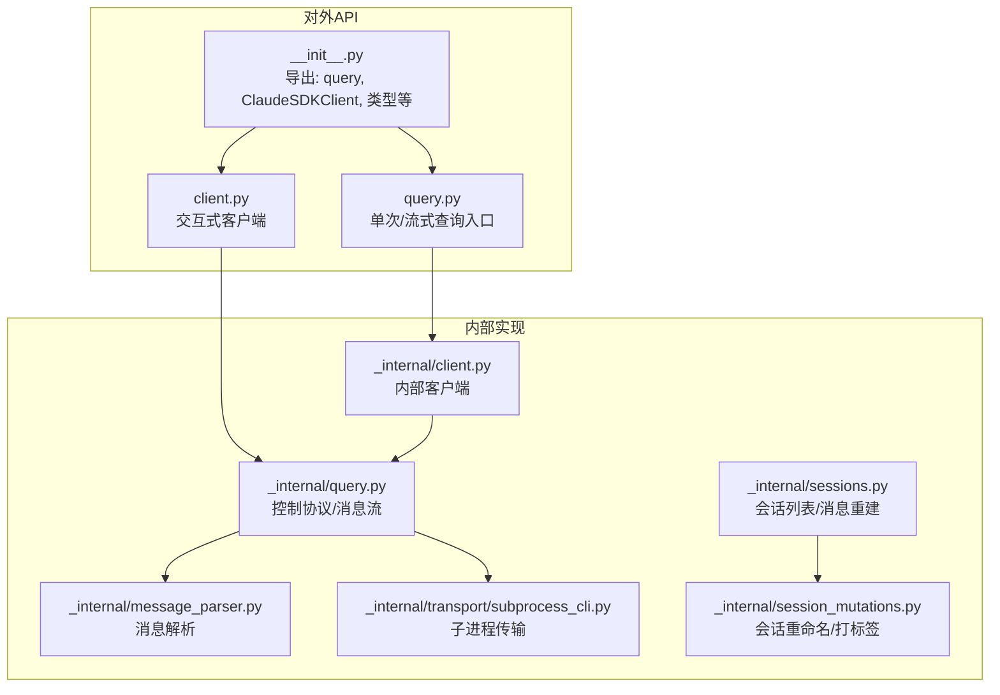
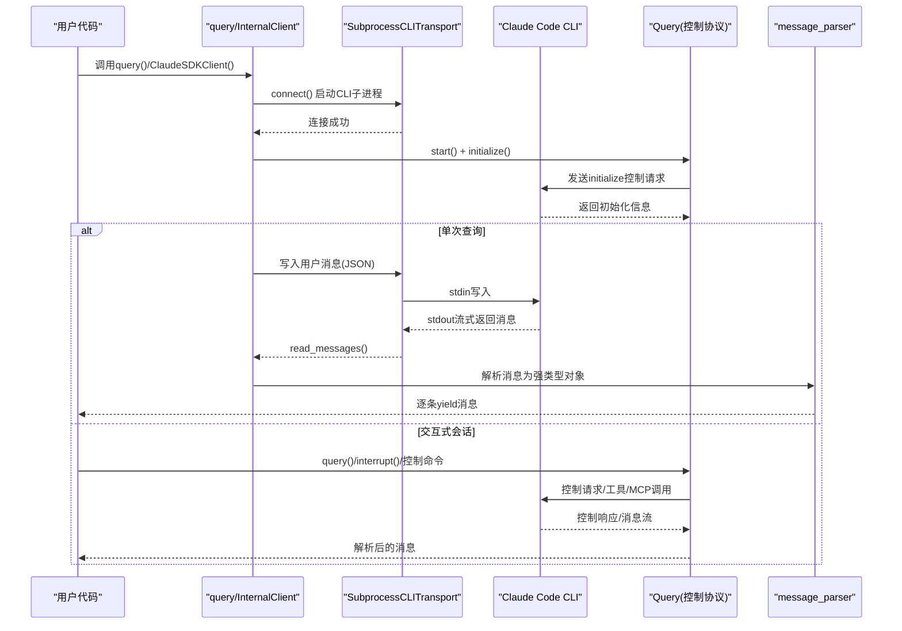
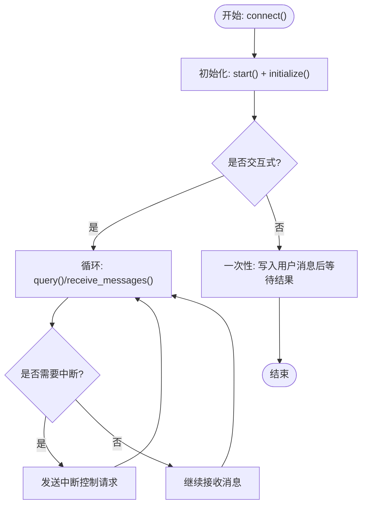
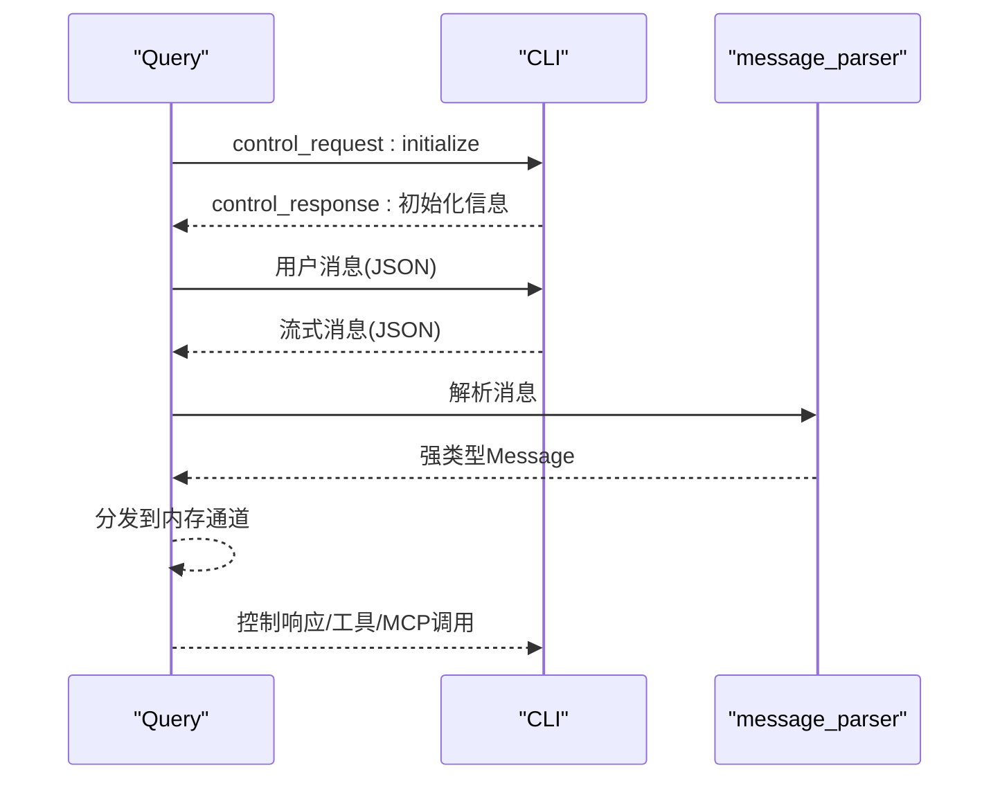
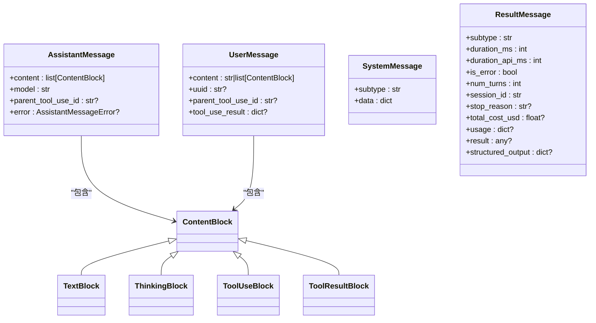
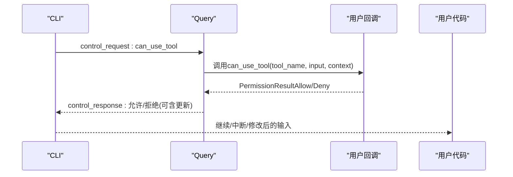
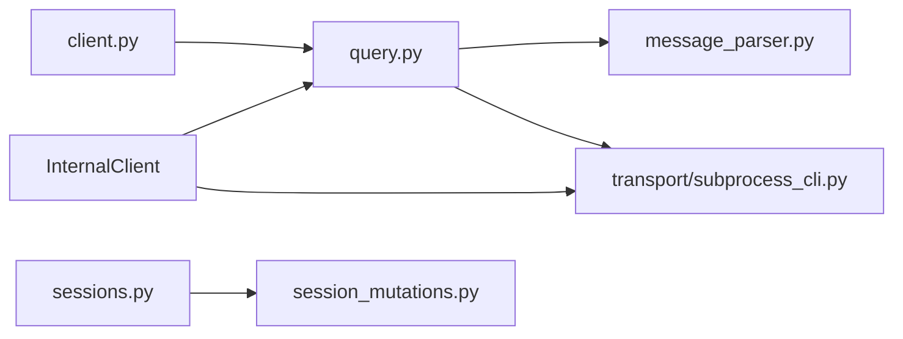

# 核心概念

<cite>
**本文引用的文件**
- [src/claude_agent_sdk/__init__.py](file://src/claude_agent_sdk/__init__.py)
- [src/claude_agent_sdk/types.py](file://src/claude_agent_sdk/types.py)
- [src/claude_agent_sdk/client.py](file://src/claude_agent_sdk/client.py)
- [src/claude_agent_sdk/query.py](file://src/claude_agent_sdk/query.py)
- [_internal/client.py](file://src/claude_agent_sdk/_internal/client.py)
- [_internal/transport/subprocess_cli.py](file://src/claude_agent_sdk/_internal/transport/subprocess_cli.py)
- [_internal/message_parser.py](file://src/claude_agent_sdk/_internal/message_parser.py)
- [_internal/query.py](file://src/claude_agent_sdk/_internal/query.py)
- [_internal/sessions.py](file://src/claude_agent_sdk/_internal/sessions.py)
- [_internal/session_mutations.py](file://src/claude_agent_sdk/_internal/session_mutations.py)
- [examples/quick_start.py](file://examples/quick_start.py)
- [examples/streaming_mode.py](file://examples/streaming_mode.py)
- [examples/tools_option.py](file://examples/tools_option.py)
- [examples/tool_permission_callback.py](file://examples/tool_permission_callback.py)
</cite>

## 目录
1. [简介](#简介)
2. [项目结构](#项目结构)
3. [核心组件](#核心组件)
4. [架构总览](#架构总览)
5. [详细组件分析](#详细组件分析)
6. [依赖分析](#依赖分析)
7. [性能考虑](#性能考虑)
8. [故障排查指南](#故障排查指南)
9. [结论](#结论)
10. [附录](#附录)

## 简介
本文件面向Claude Agent SDK的使用者与贡献者，系统性阐述SDK的核心概念与实现要点，重点覆盖以下主题：
- 异步编程模式：async/await、异步迭代器与任务管理在SDK中的应用
- Claude Code集成原理：与Claude Code CLI的通信机制、消息流处理与会话管理
- 消息类型系统：AssistantMessage、UserMessage、SystemMessage与ResultMessage的差异与用途
- ContentBlock概念：TextBlock、ToolUseBlock与ToolResultBlock的结构与使用场景
- 配置选项系统：ClaudeAgentOptions的参数与作用域
- 权限模型与工具访问控制：工具回调、权限决策与更新
- 概念图与流程图：帮助理解复杂的异步数据流与消息传递模式

## 项目结构
SDK采用分层设计，核心分为对外API、内部客户端与传输层、消息解析与控制协议处理、以及会话管理模块。对外API通过顶层导出统一入口暴露；内部模块负责与CLI交互、消息解析与控制请求路由；会话模块提供会话列表与元数据读取能力。

**图表来源**
- [src/claude_agent_sdk/__init__.py:1-445](file://src/claude_agent_sdk/__init__.py#L1-L445)
- [src/claude_agent_sdk/query.py:1-127](file://src/claude_agent_sdk/query.py#L1-L127)
- [src/claude_agent_sdk/client.py:1-500](file://src/claude_agent_sdk/client.py#L1-L500)
- [_internal/client.py:1-146](file://src/claude_agent_sdk/_internal/client.py#L1-L146)
- [_internal/query.py:1-679](file://src/claude_agent_sdk/_internal/query.py#L1-L679)
- [_internal/message_parser.py:1-251](file://src/claude_agent_sdk/_internal/message_parser.py#L1-L251)
- [_internal/transport/subprocess_cli.py:1-630](file://src/claude_agent_sdk/_internal/transport/subprocess_cli.py#L1-L630)
- [_internal/sessions.py:1-927](file://src/claude_agent_sdk/_internal/sessions.py#L1-L927)
- [_internal/session_mutations.py:1-302](file://src/claude_agent_sdk/_internal/session_mutations.py#L1-L302)

**章节来源**
- [src/claude_agent_sdk/__init__.py:1-445](file://src/claude_agent_sdk/__init__.py#L1-L445)
- [src/claude_agent_sdk/query.py:1-127](file://src/claude_agent_sdk/query.py#L1-L127)
- [src/claude_agent_sdk/client.py:1-500](file://src/claude_agent_sdk/client.py#L1-L500)

## 核心组件
- 对外API与导出
  - 顶层导出query函数、ClaudeSDKClient类、各类消息与类型定义、MCP工具装饰器与SDK MCP服务器创建器
  - 提供统一入口，简化用户使用
- 内部客户端与查询
  - InternalClient负责连接、初始化、输入流与消息流的处理
  - Query封装控制协议（can_use_tool、hook、MCP桥接）与消息路由
- 传输层
  - SubprocessCLITransport基于anyio启动CLI子进程，处理stdin/stdout/stderr，支持缓冲区与超时控制
- 消息解析
  - 将CLI输出的JSON消息解析为强类型Message对象，包含UserMessage、AssistantMessage、SystemMessage、ResultMessage等
- 会话管理
  - 列举会话、读取会话消息、重命名与打标签等操作

**章节来源**
- [src/claude_agent_sdk/__init__.py:1-445](file://src/claude_agent_sdk/__init__.py#L1-L445)
- [_internal/client.py:1-146](file://src/claude_agent_sdk/_internal/client.py#L1-L146)
- [_internal/query.py:1-679](file://src/claude_agent_sdk/_internal/query.py#L1-L679)
- [_internal/transport/subprocess_cli.py:1-630](file://src/claude_agent_sdk/_internal/transport/subprocess_cli.py#L1-L630)
- [_internal/message_parser.py:1-251](file://src/claude_agent_sdk/_internal/message_parser.py#L1-L251)
- [_internal/sessions.py:1-927](file://src/claude_agent_sdk/_internal/sessions.py#L1-L927)
- [_internal/session_mutations.py:1-302](file://src/claude_agent_sdk/_internal/session_mutations.py#L1-L302)

## 架构总览
SDK以“查询/客户端”双入口协同工作：query用于一次性或单向流式交互；ClaudeSDKClient用于双向、可中断、可控制的交互式会话。两者均通过SubprocessCLITransport与CLI通信，并由Query处理控制协议与消息路由。

**图表来源**
- [src/claude_agent_sdk/query.py:1-127](file://src/claude_agent_sdk/query.py#L1-L127)
- [_internal/client.py:1-146](file://src/claude_agent_sdk/_internal/client.py#L1-L146)
- [_internal/transport/subprocess_cli.py:1-630](file://src/claude_agent_sdk/_internal/transport/subprocess_cli.py#L1-L630)
- [_internal/query.py:1-679](file://src/claude_agent_sdk/_internal/query.py#L1-L679)
- [_internal/message_parser.py:1-251](file://src/claude_agent_sdk/_internal/message_parser.py#L1-L251)

## 详细组件分析

### 异步编程模式与任务管理
- async/await与异步迭代器
  - query与ClaudeSDKClient均以异步函数实现，支持AsyncIterable作为prompt输入，便于流式发送消息
  - ClaudeSDKClient.receive_messages/receive_response返回异步迭代器，便于按消息顺序消费
- 任务管理与并发
  - Query内部使用anyio任务组管理消息读取、输入流与控制协议处理
  - SubprocessCLITransport使用锁避免竞态，确保写入安全
- 中断与控制
  - ClaudeSDKClient提供interrupt方法，Query通过控制协议发送中断请求
  - 支持动态切换模型、权限模式、MCP服务器状态等运行时控制

**图表来源**
- [src/claude_agent_sdk/client.py:1-500](file://src/claude_agent_sdk/client.py#L1-L500)
- [_internal/query.py:1-679](file://src/claude_agent_sdk/_internal/query.py#L1-L679)

**章节来源**
- [src/claude_agent_sdk/client.py:1-500](file://src/claude_agent_sdk/client.py#L1-L500)
- [_internal/query.py:1-679](file://src/claude_agent_sdk/_internal/query.py#L1-L679)
- [_internal/transport/subprocess_cli.py:1-630](file://src/claude_agent_sdk/_internal/transport/subprocess_cli.py#L1-L630)

### Claude Code集成原理与消息流
- 与CLI的通信
  - SubprocessCLITransport通过anyio启动CLI子进程，设置stdin/stdout/stderr管道
  - 使用“stream-json”格式进行输入输出，支持partial message与错误处理
- 控制协议
  - Query负责控制请求/响应路由，处理can_use_tool、hook回调、MCP桥接与服务器状态查询
  - 支持“initialize”握手，携带hooks与agents配置
- 消息解析
  - message_parser将CLI输出映射为强类型Message，包括UserMessage、AssistantMessage、SystemMessage、ResultMessage、StreamEvent、RateLimitEvent等

**图表来源**
- [_internal/query.py:1-679](file://src/claude_agent_sdk/_internal/query.py#L1-L679)
- [_internal/message_parser.py:1-251](file://src/claude_agent_sdk/_internal/message_parser.py#L1-L251)
- [_internal/transport/subprocess_cli.py:1-630](file://src/claude_agent_sdk/_internal/transport/subprocess_cli.py#L1-L630)

**章节来源**
- [_internal/transport/subprocess_cli.py:1-630](file://src/claude_agent_sdk/_internal/transport/subprocess_cli.py#L1-L630)
- [_internal/message_parser.py:1-251](file://src/claude_agent_sdk/_internal/message_parser.py#L1-L251)
- [_internal/query.py:1-679](file://src/claude_agent_sdk/_internal/query.py#L1-L679)

### 消息类型系统
- AssistantMessage：包含内容块列表（文本/思考/工具使用/工具结果），附带模型与可选错误
- UserMessage：包含内容块列表（文本/工具使用/工具结果），可携带父工具use_id与工具结果
- SystemMessage：系统消息，包含子类型与原始数据
- ResultMessage：一次交互的汇总结果，包含耗时、turn数、费用、用量等

**图表来源**
- [src/claude_agent_sdk/types.py:766-800](file://src/claude_agent_sdk/types.py#L766-L800)
- [src/claude_agent_sdk/types.py:730-764](file://src/claude_agent_sdk/types.py#L730-L764)

**章节来源**
- [src/claude_agent_sdk/types.py:766-800](file://src/claude_agent_sdk/types.py#L766-L800)
- [_internal/message_parser.py:1-251](file://src/claude_agent_sdk/_internal/message_parser.py#L1-L251)

### ContentBlock概念与使用场景
- TextBlock：纯文本内容块
- ThinkingBlock：思考内容块（含签名），用于内部推理展示
- ToolUseBlock：工具调用块，包含工具名、参数与唯一ID
- ToolResultBlock：工具结果块，包含工具use_id、内容与错误标记

典型使用场景：
- AssistantMessage中出现ToolUseBlock表示Claude计划调用工具；随后可能收到对应ToolResultBlock
- UserMessage中出现ToolResultBlock表示用户侧工具执行结果回传

**章节来源**
- [src/claude_agent_sdk/types.py:730-764](file://src/claude_agent_sdk/types.py#L730-L764)
- [_internal/message_parser.py:1-251](file://src/claude_agent_sdk/_internal/message_parser.py#L1-L251)

### 配置选项系统（ClaudeAgentOptions）
- 基础参数
  - system_prompt：系统提示词或预设
  - tools：工具集合（数组或预设）
  - allowed_tools/disallowed_tools：允许/禁止的工具白名单
  - model/fallback_model：主备模型
  - max_turns/max_budget_usd：对话轮次与预算
  - permission_mode/permission_prompt_tool_name：权限模式与提示工具
  - cwd/env/extra_args：工作目录、环境变量与扩展参数
- 高级参数
  - thinking/thinking相关：思考令牌预算策略
  - output_format：结构化输出的JSON Schema
  - include_partial_messages：包含部分消息
  - mcp_servers：MCP服务器配置（stdio/SSE/HTTP/SDK）
  - hooks：钩子匹配器与回调
  - agents：代理定义（通过initialize下发）
  - plugins：插件目录
  - setting_sources/settings：设置来源与合并策略
  - sandbox：沙箱网络与违规忽略策略
  - stderr/debug_stderr：错误输出与调试输出
  - enable_file_checkpointing：文件检查点
- 作用域与行为
  - 与CLI参数映射：如--tools/--allowedTools/--max-budget-usd/--permission-mode等
  - 与控制协议联动：hooks、agents、MCP服务器在initialize阶段下发

**章节来源**
- [_internal/transport/subprocess_cli.py:166-333](file://src/claude_agent_sdk/_internal/transport/subprocess_cli.py#L166-L333)
- [_internal/query.py:119-163](file://src/claude_agent_sdk/_internal/query.py#L119-L163)
- [src/claude_agent_sdk/types.py:17-21](file://src/claude_agent_sdk/types.py#L17-L21)

### 权限模型与工具访问控制
- 工具权限回调
  - can_use_tool：在工具调用前拦截，返回允许/拒绝与可选输入修改
  - ToolPermissionContext：上下文包含建议规则与信号占位
- 权限结果
  - PermissionResultAllow：允许，可附带更新后的输入与权限变更
  - PermissionResultDeny：拒绝，可附带消息与中断标志
- 控制协议交互
  - Query监听“can_use_tool”控制请求，调用用户提供的回调并返回结果
- 示例
  - 在示例中演示了基于工具类型、输入路径与命令模式的策略化控制

**图表来源**
- [_internal/query.py:236-346](file://src/claude_agent_sdk/_internal/query.py#L236-L346)

**章节来源**
- [src/claude_agent_sdk/types.py:124-157](file://src/claude_agent_sdk/types.py#L124-L157)
- [_internal/query.py:236-346](file://src/claude_agent_sdk/_internal/query.py#L236-L346)
- [examples/tool_permission_callback.py:1-159](file://examples/tool_permission_callback.py#L1-L159)

### 会话管理与工具访问控制
- 会话列表与消息重建
  - list_sessions：扫描~/.claude/projects下的.jsonl文件，提取摘要、时间戳与Git分支等元信息
  - get_session_messages：基于uuid链重建对话树，支持侧链与压缩边界处理
- 会话元数据变更
  - rename_session/tag_session：追加自定义标题/标签到会话文件尾部，遵循CLI一致的读取逻辑
- 与工具访问控制的关系
  - 会话元数据变更不影响工具权限策略，但可用于审计与追踪

**章节来源**
- [_internal/sessions.py:1-927](file://src/claude_agent_sdk/_internal/sessions.py#L1-L927)
- [_internal/session_mutations.py:1-302](file://src/claude_agent_sdk/_internal/session_mutations.py#L1-L302)

## 依赖分析
- 外部依赖
  - anyio：异步I/O、任务组、锁与进程管理
  - mcp.types：MCP工具接口定义（tools/list、tools/call等）
  - json：消息序列化与反序列化
- 内部耦合
  - query与message_parser紧密耦合，前者负责消息路由，后者负责类型转换
  - transport与query耦合，前者提供底层I/O，后者提供控制协议语义
  - client与query耦合，前者提供高层API，后者提供控制协议与消息流

**图表来源**
- [src/claude_agent_sdk/query.py:1-127](file://src/claude_agent_sdk/query.py#L1-L127)
- [_internal/client.py:1-146](file://src/claude_agent_sdk/_internal/client.py#L1-L146)
- [_internal/query.py:1-679](file://src/claude_agent_sdk/_internal/query.py#L1-L679)
- [_internal/message_parser.py:1-251](file://src/claude_agent_sdk/_internal/message_parser.py#L1-L251)
- [_internal/transport/subprocess_cli.py:1-630](file://src/claude_agent_sdk/_internal/transport/subprocess_cli.py#L1-L630)
- [_internal/sessions.py:1-927](file://src/claude_agent_sdk/_internal/sessions.py#L1-L927)
- [_internal/session_mutations.py:1-302](file://src/claude_agent_sdk/_internal/session_mutations.py#L1-L302)

**章节来源**
- [src/claude_agent_sdk/query.py:1-127](file://src/claude_agent_sdk/query.py#L1-L127)
- [_internal/client.py:1-146](file://src/claude_agent_sdk/_internal/client.py#L1-L146)
- [_internal/query.py:1-679](file://src/claude_agent_sdk/_internal/query.py#L1-L679)

## 性能考虑
- 流式I/O与背压
  - 使用anyio内存对象流承载消息，限制最大缓冲大小，避免内存膨胀
- 子进程与缓冲区
  - 传输层对stdout进行逐行解析与缓冲区上限控制，防止过大消息导致内存占用
- 并发与锁
  - 写入路径使用锁避免竞态；任务组统一管理生命周期，减少资源泄漏风险
- MCP桥接
  - SDK MCP服务器直接在进程中运行，避免IPC开销，提升工具调用性能

[本节为通用指导，无需特定文件引用]

## 故障排查指南
- 连接失败
  - CLI未找到：检查安装路径与PATH，或显式指定cli_path
  - 工作目录不存在：确认cwd存在且可访问
- 消息解析错误
  - JSON解码异常：检查消息格式与缓冲区上限
- 控制协议超时
  - initialize或工具调用超时：检查hooks/mcp服务器启动时间与超时配置
- 权限问题
  - can_use_tool回调未触发：确认使用交互式会话并正确配置permission_mode
- MCP服务器状态
  - get_mcp_status查看连接状态与错误信息，必要时reconnect或toggle

**章节来源**
- [_internal/transport/subprocess_cli.py:396-410](file://src/claude_agent_sdk/_internal/transport/subprocess_cli.py#L396-L410)
- [_internal/transport/subprocess_cli.py:546-554](file://src/claude_agent_sdk/_internal/transport/subprocess_cli.py#L546-L554)
- [_internal/query.py:378-392](file://src/claude_agent_sdk/_internal/query.py#L378-L392)
- [src/claude_agent_sdk/client.py:385-416](file://src/claude_agent_sdk/client.py#L385-L416)

## 结论
本SDK通过清晰的分层设计与严格的异步抽象，实现了与Claude Code CLI的高效、可控集成。其消息类型系统与ContentBlock模型为复杂对话与工具协作提供了坚实基础；权限回调与控制协议使工具访问具备细粒度的安全控制；会话管理与MCP桥接进一步增强了可扩展性与可观测性。建议在生产环境中结合hooks、权限策略与MCP工具，构建安全、可维护的智能体应用。

[本节为总结性内容，无需特定文件引用]

## 附录
- 快速开始与示例
  - 基础查询与选项配置：参考示例脚本
  - 交互式会话与中断：参考流式示例
  - 工具权限回调：参考权限示例
  - 工具集合配置：参考tools选项示例

**章节来源**
- [examples/quick_start.py:1-77](file://examples/quick_start.py#L1-L77)
- [examples/streaming_mode.py:1-512](file://examples/streaming_mode.py#L1-L512)
- [examples/tools_option.py:1-112](file://examples/tools_option.py#L1-L112)
- [examples/tool_permission_callback.py:1-159](file://examples/tool_permission_callback.py#L1-L159)