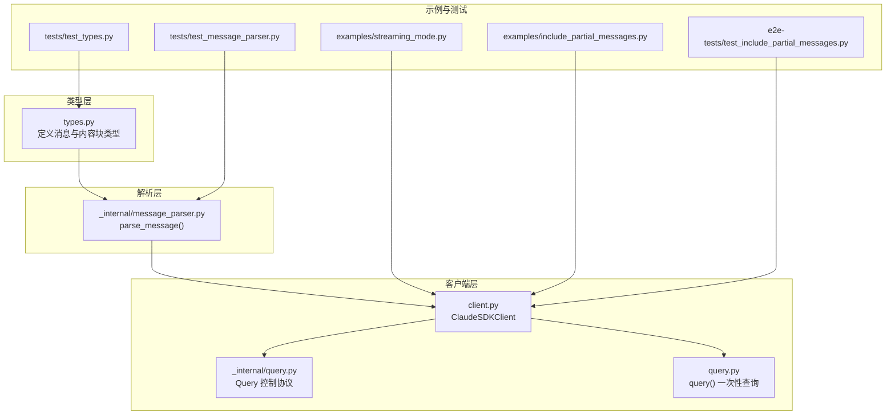
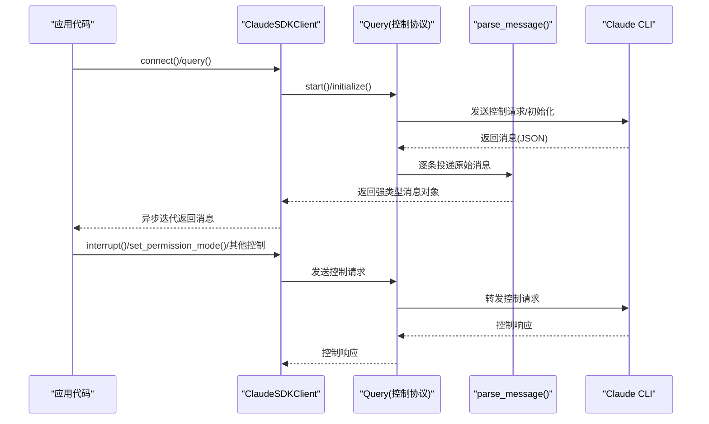
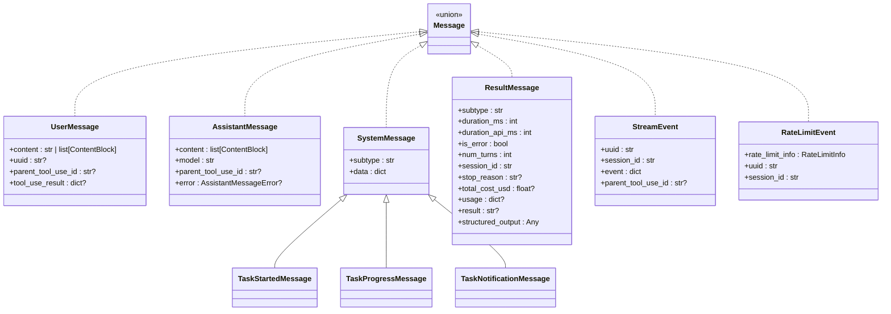
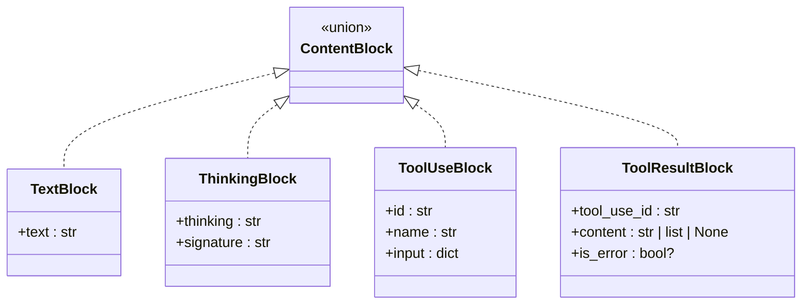
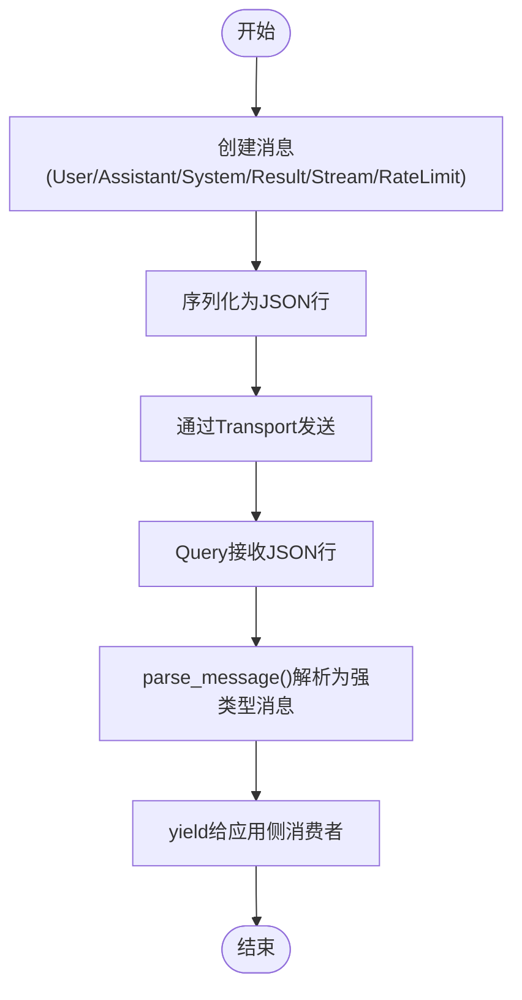
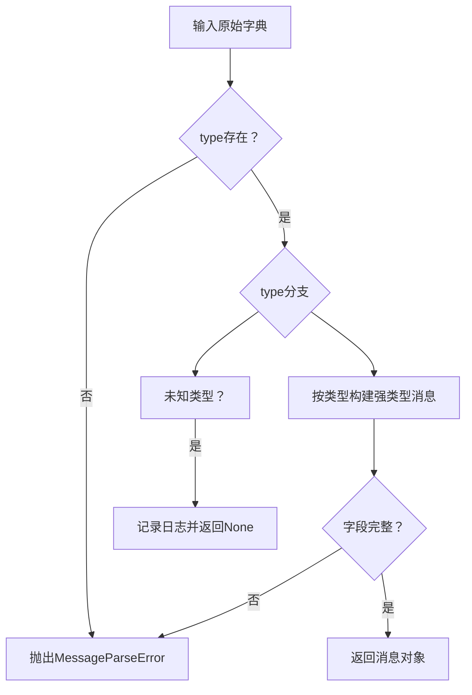
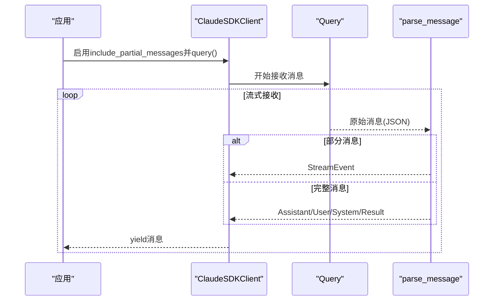
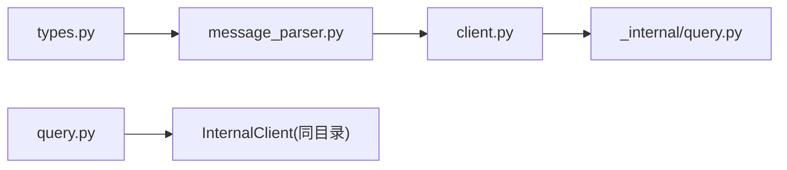

# 消息系统

<cite>
**本文引用的文件**
- [types.py](file://src/claude_agent_sdk/types.py)
- [message_parser.py](file://src/claude_agent_sdk/_internal/message_parser.py)
- [client.py](file://src/claude_agent_sdk/client.py)
- [query.py](file://src/claude_agent_sdk/query.py)
- [query.py（内部）](file://src/claude_agent_sdk/_internal/query.py)
- [test_types.py](file://tests/test_types.py)
- [test_message_parser.py](file://tests/test_message_parser.py)
- [include_partial_messages.py](file://examples/include_partial_messages.py)
- [streaming_mode.py](file://examples/streaming_mode.py)
- [test_include_partial_messages.py](file://e2e-tests/test_include_partial_messages.py)
</cite>

## 目录
1. [简介](#简介)
2. [项目结构](#项目结构)
3. [核心组件](#核心组件)
4. [架构总览](#架构总览)
5. [详细组件分析](#详细组件分析)
6. [依赖分析](#依赖分析)
7. [性能考虑](#性能考虑)
8. [故障排查指南](#故障排查指南)
9. [结论](#结论)
10. [附录：消息格式与示例](#附录消息格式与示例)

## 简介
本文件面向Claude Agent SDK的消息系统，系统性阐述消息类型体系、ContentBlock内容块模型、消息生命周期、解析机制、JSON序列化/反序列化、流式消息处理（partial vs complete）等关键主题，并通过测试与示例文件定位具体实现位置，帮助开发者在不直接阅读源码的情况下也能准确理解与使用消息系统。

## 项目结构
消息系统主要由以下模块构成：
- 类型定义：统一的消息与内容块数据结构
- 解析器：将CLI输出的原始字典解析为强类型消息对象
- 客户端与查询：负责连接、发送、接收与控制协议交互
- 示例与测试：验证消息格式、解析行为与流式特性

图表来源
- [types.py:729-952](file://src/claude_agent_sdk/types.py#L729-L952)
- [message_parser.py:29-250](file://src/claude_agent_sdk/_internal/message_parser.py#L29-L250)
- [client.py:21-499](file://src/claude_agent_sdk/client.py#L21-L499)
- [query.py（内部）:53-679](file://src/claude_agent_sdk/_internal/query.py#L53-L679)
- [query.py:12-127](file://src/claude_agent_sdk/query.py#L12-L127)

章节来源
- [types.py:729-952](file://src/claude_agent_sdk/types.py#L729-L952)
- [message_parser.py:29-250](file://src/claude_agent_sdk/_internal/message_parser.py#L29-L250)
- [client.py:21-499](file://src/claude_agent_sdk/client.py#L21-L499)
- [query.py（内部）:53-679](file://src/claude_agent_sdk/_internal/query.py#L53-L679)
- [query.py:12-127](file://src/claude_agent_sdk/query.py#L12-L127)

## 核心组件
- 消息类型：UserMessage、AssistantMessage、SystemMessage、ResultMessage、StreamEvent、RateLimitEvent
- 内容块：TextBlock、ThinkingBlock、ToolUseBlock、ToolResultBlock
- 解析器：parse_message() 将原始字典映射为上述强类型消息
- 客户端：ClaudeSDKClient 提供双向交互、中断、权限模式切换、MCP服务器管理等能力
- 查询：query() 提供一次性、无状态查询；内部通过InternalClient驱动

章节来源
- [types.py:729-952](file://src/claude_agent_sdk/types.py#L729-L952)
- [message_parser.py:29-250](file://src/claude_agent_sdk/_internal/message_parser.py#L29-L250)
- [client.py:21-499](file://src/claude_agent_sdk/client.py#L21-L499)
- [query.py:12-127](file://src/claude_agent_sdk/query.py#L12-L127)

## 架构总览
消息系统从CLI输出到应用消费的端到端流程如下：

图表来源
- [client.py:94-196](file://src/claude_agent_sdk/client.py#L94-L196)
- [query.py（内部）:165-234](file://src/claude_agent_sdk/_internal/query.py#L165-L234)
- [message_parser.py:29-250](file://src/claude_agent_sdk/_internal/message_parser.py#L29-L250)

## 详细组件分析

### 消息类型系统
- UserMessage：用户输入消息，支持字符串或内容块列表；可携带uuid、父级工具调用id、工具执行结果元数据
- AssistantMessage：助手回复消息，包含内容块列表、模型名、可选错误标识
- SystemMessage：系统消息基类，包含subtype与原始data；另有TaskStartedMessage、TaskProgressMessage、TaskNotificationMessage三种子类型
- ResultMessage：会话结果消息，包含时长、错误标志、轮次数、会话id、停止原因、费用、用量、结构化输出等
- StreamEvent：部分消息事件，用于流式增量更新
- RateLimitEvent：速率限制状态变更事件

图表来源
- [types.py:777-952](file://src/claude_agent_sdk/types.py#L777-L952)

章节来源
- [types.py:777-952](file://src/claude_agent_sdk/types.py#L777-L952)

### ContentBlock内容块模型
- TextBlock：纯文本内容
- ThinkingBlock：思考内容（含思考文本与签名）
- ToolUseBlock：工具调用（含id、名称、输入参数）
- ToolResultBlock：工具结果（含工具调用id、内容、是否错误）

图表来源
- [types.py:729-763](file://src/claude_agent_sdk/types.py#L729-L763)

章节来源
- [types.py:729-763](file://src/claude_agent_sdk/types.py#L729-L763)

### 消息生命周期
- 创建：应用侧构造消息（如UserMessage），或由CLI生成（Assistant/System/Result/Stream/RateLimit）
- 发送：通过Transport写入JSON行；ClaudeSDKClient.query()负责将字符串或异步流消息序列化后发送
- 接收：Query._read_messages()从Transport读取JSON行，分发到消息通道；receive_messages()异步迭代
- 解析：parse_message()将原始字典映射为强类型消息对象
- 消费：应用侧遍历消息，识别类型并处理内容块

图表来源
- [client.py:198-227](file://src/claude_agent_sdk/client.py#L198-L227)
- [query.py（内部）:648-657](file://src/claude_agent_sdk/_internal/query.py#L648-L657)
- [message_parser.py:29-250](file://src/claude_agent_sdk/_internal/message_parser.py#L29-L250)

章节来源
- [client.py:198-227](file://src/claude_agent_sdk/client.py#L198-L227)
- [query.py（内部）:648-657](file://src/claude_agent_sdk/_internal/query.py#L648-L657)
- [message_parser.py:29-250](file://src/claude_agent_sdk/_internal/message_parser.py#L29-L250)

### 消息解析机制
- 输入：原始字典（来自CLI输出）
- 类型判定：根据type字段匹配
- 字段校验：缺失必填字段抛出MessageParseError
- 结构映射：将message.content中的各块映射为对应ContentBlock类型
- 兼容性：未知消息类型返回None（向前兼容）

图表来源
- [message_parser.py:29-250](file://src/claude_agent_sdk/_internal/message_parser.py#L29-L250)

章节来源
- [message_parser.py:29-250](file://src/claude_agent_sdk/_internal/message_parser.py#L29-L250)

### 流式消息处理（partial vs complete）
- partial messages：当启用include_partial_messages选项时，CLI会发送StreamEvent以增量推送中间状态；应用侧在receive_response中可同时收到普通消息与StreamEvent
- complete messages：未启用时仅收到最终的完整消息（Assistant/Result/System等）

图表来源
- [include_partial_messages.py:28-56](file://examples/include_partial_messages.py#L28-L56)
- [test_include_partial_messages.py:25-47](file://e2e-tests/test_include_partial_messages.py#L25-L47)
- [client.py:443-482](file://src/claude_agent_sdk/client.py#L443-L482)

章节来源
- [include_partial_messages.py:28-56](file://examples/include_partial_messages.py#L28-L56)
- [test_include_partial_messages.py:25-47](file://e2e-tests/test_include_partial_messages.py#L25-L47)
- [client.py:443-482](file://src/claude_agent_sdk/client.py#L443-L482)

## 依赖分析
- 类型定义依赖：types.py集中定义所有消息与内容块类型
- 解析依赖：message_parser.py依赖types.py中的消息与内容块类型
- 客户端依赖：client.py依赖message_parser.py进行消息解析；依赖query.py（内部）进行控制协议与消息流管理
- 查询函数：query.py依赖InternalClient（位于同目录）进行一次性查询

图表来源
- [types.py:729-952](file://src/claude_agent_sdk/types.py#L729-L952)
- [message_parser.py:7-24](file://src/claude_agent_sdk/_internal/message_parser.py#L7-L24)
- [client.py:1-18](file://src/claude_agent_sdk/client.py#L1-L18)
- [query.py:7-9](file://src/claude_agent_sdk/query.py#L7-L9)

章节来源
- [types.py:729-952](file://src/claude_agent_sdk/types.py#L729-L952)
- [message_parser.py:7-24](file://src/claude_agent_sdk/_internal/message_parser.py#L7-L24)
- [client.py:1-18](file://src/claude_agent_sdk/client.py#L1-L18)
- [query.py:7-9](file://src/claude_agent_sdk/query.py#L7-L9)

## 性能考虑
- 流式解析：parse_message()对每条消息进行类型判定与字段校验，建议在应用侧尽早过滤不需要的消息类型，减少不必要的处理
- 缓冲与背压：Query内部使用内存对象流承载消息，注意合理消费速度，避免阻塞
- 并发写入：Transport层对并发写入进行了串行化保护，避免BusyResourceError
- 超时控制：初始化与控制请求均设置超时，避免长时间阻塞

章节来源
- [query.py（内部）:104-117](file://src/claude_agent_sdk/_internal/query.py#L104-L117)
- [test_transport.py:729-765](file://tests/test_transport.py#L729-L765)

## 故障排查指南
- 解析异常：MessageParseError通常由缺失type字段或必填字段导致；检查CLI输出格式与字段完整性
- 未知消息类型：解析器对未知类型返回None并记录日志，确保SDK版本与CLI版本兼容
- 连接错误：未连接即调用客户端方法会抛出CLIConnectionError；确保先调用connect()
- 流式中断：需要在消费消息的同时才能处理interrupt；否则无法生效
- 权限问题：can_use_tool回调与permission_prompt_tool_name互斥；确保配置正确

章节来源
- [message_parser.py:42-51](file://src/claude_agent_sdk/_internal/message_parser.py#L42-L51)
- [client.py:186-196](file://src/claude_agent_sdk/client.py#L186-L196)
- [query.py（内部）:236-345](file://src/claude_agent_sdk/_internal/query.py#L236-L345)

## 结论
Claude Agent SDK的消息系统以强类型消息与内容块为核心，结合解析器与客户端/查询层，提供了从CLI到应用的完整消息生命周期管理。通过StreamEvent实现了partial消息的增量推送，配合ResultMessage完成一次完整对话的收尾。类型定义清晰、解析逻辑健壮、流式处理灵活，适合构建实时交互与工具编排场景。

## 附录：消息格式与示例

### 消息类型与字段概览
- UserMessage
  - content: 字符串或内容块数组
  - uuid: 可选，用于文件回溯
  - parent_tool_use_id: 可选，父级工具调用id
  - tool_use_result: 可选，工具执行结果元数据
- AssistantMessage
  - content: 内容块数组
  - model: 使用模型
  - parent_tool_use_id: 可选
  - error: 可选，错误类型
- SystemMessage
  - subtype: 子类型
  - data: 原始数据
- TaskStartedMessage/TaskProgressMessage/TaskNotificationMessage
  - 继承自SystemMessage，扩展任务相关字段
- ResultMessage
  - subtype、duration_ms、duration_api_ms、is_error、num_turns、session_id、stop_reason、total_cost_usd、usage、result、structured_output
- StreamEvent
  - uuid、session_id、event、parent_tool_use_id
- RateLimitEvent
  - rate_limit_info（包含状态、重置时间、类型、利用率、超量状态等）、uuid、session_id

章节来源
- [types.py:777-952](file://src/claude_agent_sdk/types.py#L777-L952)

### ContentBlock结构与嵌套
- TextBlock：text字段
- ThinkingBlock：thinking、signature字段
- ToolUseBlock：id、name、input字段
- ToolResultBlock：tool_use_id、content、is_error字段

章节来源
- [types.py:729-763](file://src/claude_agent_sdk/types.py#L729-L763)

### JSON序列化/反序列化要点
- 发送：ClaudeSDKClient.query()将消息序列化为JSON行并写入Transport
- 接收：Query._read_messages()逐行读取JSON，分发到消息通道
- 解析：parse_message()将原始字典映射为强类型消息对象

章节来源
- [client.py:212-226](file://src/claude_agent_sdk/client.py#L212-L226)
- [query.py（内部）:172-234](file://src/claude_agent_sdk/_internal/query.py#L172-L234)
- [message_parser.py:29-250](file://src/claude_agent_sdk/_internal/message_parser.py#L29-L250)

### 流式消息示例路径
- 启用partial消息示例：[include_partial_messages.py:28-56](file://examples/include_partial_messages.py#L28-L56)
- 流式交互示例：[streaming_mode.py:59-173](file://examples/streaming_mode.py#L59-L173)
- 端到端partial消息测试：[test_include_partial_messages.py:25-47](file://e2e-tests/test_include_partial_messages.py#L25-L47)

章节来源
- [include_partial_messages.py:28-56](file://examples/include_partial_messages.py#L28-L56)
- [streaming_mode.py:59-173](file://examples/streaming_mode.py#L59-L173)
- [test_include_partial_messages.py:25-47](file://e2e-tests/test_include_partial_messages.py#L25-L47)

### 单元测试参考
- 类型定义与构造：[test_types.py:25-82](file://tests/test_types.py#L25-L82)
- 消息解析与错误处理：[test_message_parser.py:23-696](file://tests/test_message_parser.py#L23-L696)

章节来源
- [test_types.py:25-82](file://tests/test_types.py#L25-L82)
- [test_message_parser.py:23-696](file://tests/test_message_parser.py#L23-L696)