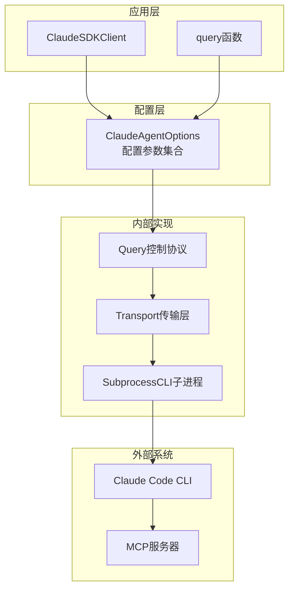
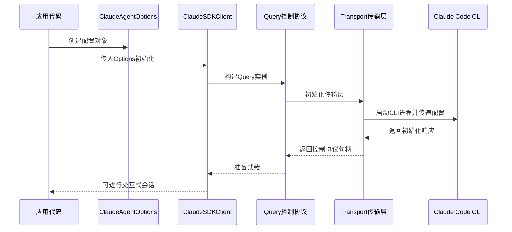
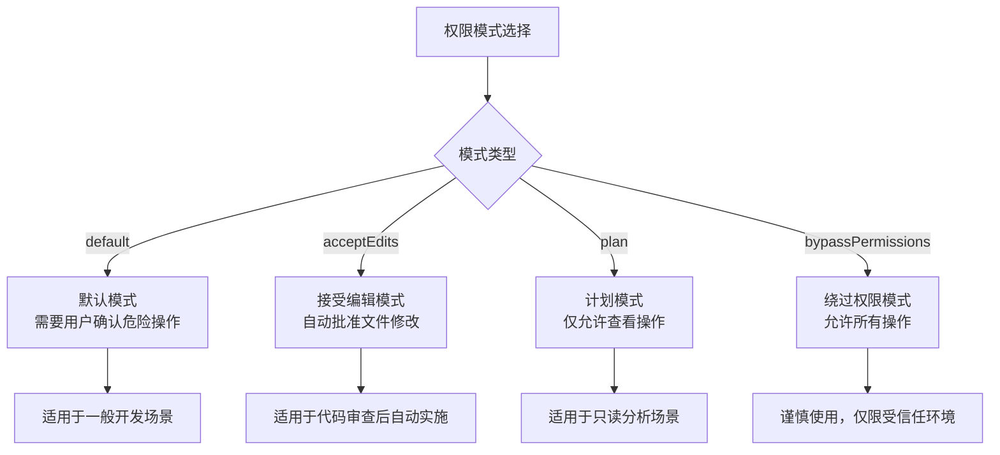
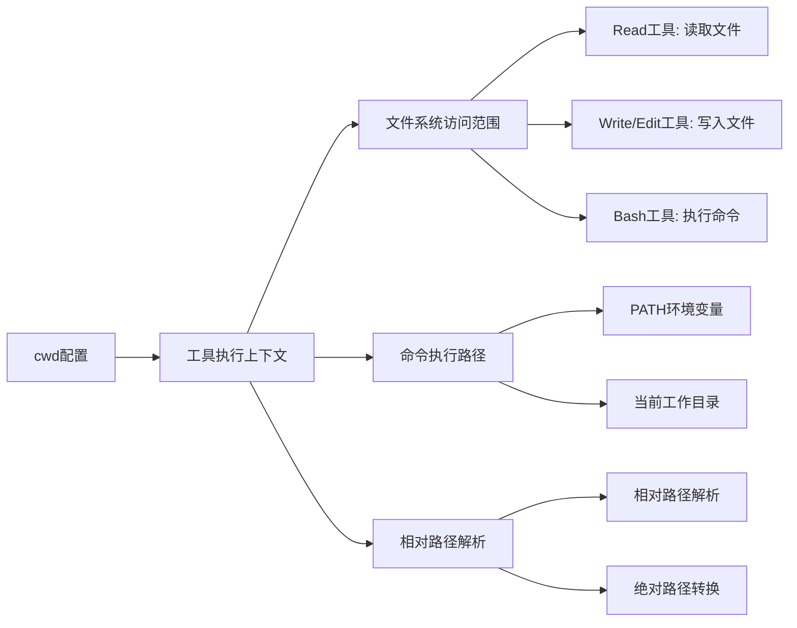
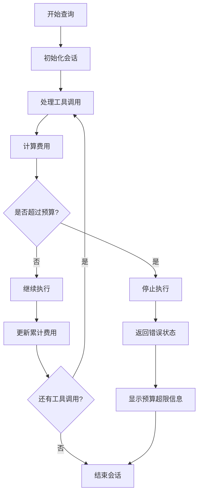
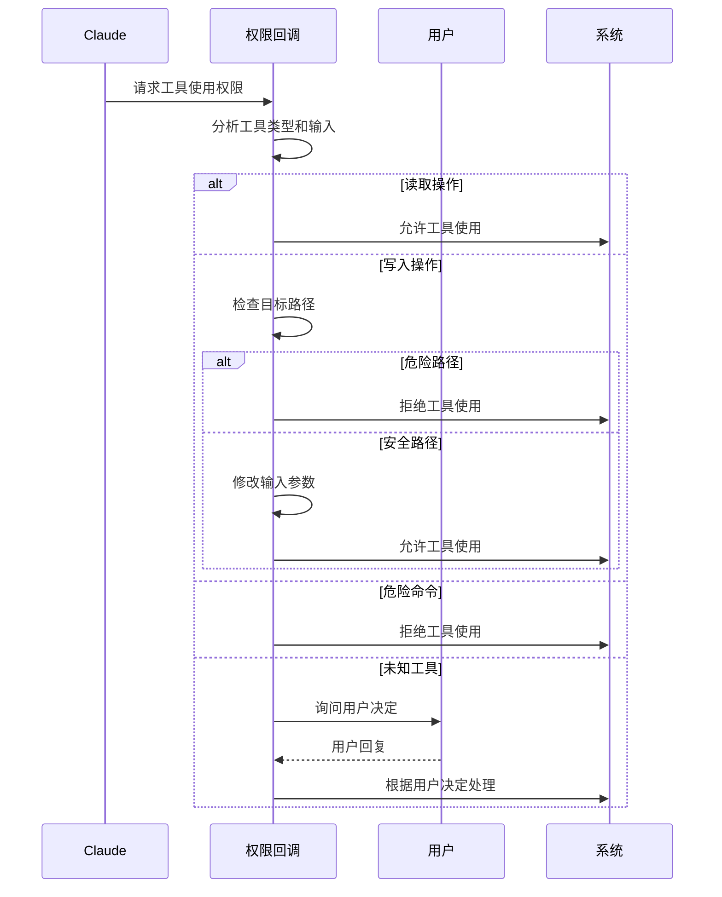
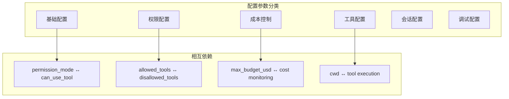

# 配置选项系统

<cite>
**本文档引用的文件**
- [types.py](file://src/claude_agent_sdk/types.py)
- [client.py](file://src/claude_agent_sdk/client.py)
- [query.py](file://src/claude_agent_sdk/query.py)
- [subprocess_cli.py](file://src/claude_agent_sdk/_internal/transport/subprocess_cli.py)
- [system_prompt.py](file://examples/system_prompt.py)
- [max_budget_usd.py](file://examples/max_budget_usd.py)
- [tool_permission_callback.py](file://examples/tool_permission_callback.py)
- [setting_sources.py](file://examples/setting_sources.py)
- [tools_option.py](file://examples/tools_option.py)
- [test_types.py](file://tests/test_types.py)
</cite>

## 目录
1. [简介](#简介)
2. [项目结构](#项目结构)
3. [核心组件](#核心组件)
4. [架构概览](#架构概览)
5. [详细组件分析](#详细组件分析)
6. [依赖分析](#依赖分析)
7. [性能考虑](#性能考虑)
8. [故障排除指南](#故障排除指南)
9. [结论](#结论)
10. [附录](#附录)

## 简介
本文件深入解析Claude Agent SDK的配置选项系统，重点围绕ClaudeAgentOptions类进行全面说明。内容涵盖：
- 所有配置参数的作用与使用场景
- 权限模式(permission_mode)的三种模式及其区别
- 工作目录(cwd)配置对工具执行的影响
- 预算限制(max_budget_usd)的设置与计费机制
- 配置组合的实际示例与最佳实践
- 配置优先级与继承规则，以及在不同组件间的共享方式

## 项目结构
Claude Agent SDK采用模块化设计，配置选项系统主要集中在types.py中的ClaudeAgentOptions类，通过client.py和query.py对外提供统一的配置入口，并由内部传输层(subprocess_cli.py)负责将配置传递给底层CLI。



**图表来源**
- [client.py:62-75](file://src/claude_agent_sdk/client.py#L62-L75)
- [types.py:1030-1099](file://src/claude_agent_sdk/types.py#L1030-L1099)
- [subprocess_cli.py:255-289](file://src/claude_agent_sdk/_internal/transport/subprocess_cli.py#L255-L289)

**章节来源**
- [client.py:1-500](file://src/claude_agent_sdk/client.py#L1-L500)
- [types.py:1030-1099](file://src/claude_agent_sdk/types.py#L1030-L1099)

## 核心组件
ClaudeAgentOptions是整个配置系统的核心数据结构，定义了所有可用的配置参数。该类包含以下关键配置类别：

### 基础配置参数
- **tools**: 工具集配置，支持工具数组或预设配置
- **system_prompt**: 系统提示词配置，支持字符串或预设配置
- **cwd**: 工作目录路径，影响工具执行的根目录
- **model**: AI模型选择
- **fallback_model**: 备用模型

### 权限与安全配置
- **permission_mode**: 权限模式，控制工具使用的安全策略
- **allowed_tools**: 允许工具白名单
- **disallowed_tools**: 禁止工具黑名单
- **can_use_tool**: 自定义工具权限回调函数

### 成本控制配置
- **max_budget_usd**: 最大预算限制（美元）
- **max_turns**: 最大对话轮数

### MCP服务器配置
- **mcp_servers**: MCP服务器配置字典
- **plugins**: 插件配置列表

### 会话与调试配置
- **setting_sources**: 设置源控制
- **hooks**: 钩子配置
- **debug_stderr/stderr**: 调试输出配置
- **extra_args**: 额外CLI参数

**章节来源**
- [types.py:1030-1099](file://src/claude_agent_sdk/types.py#L1030-L1099)

## 架构概览
配置系统采用分层架构，从高层到低层的流转过程如下：



**图表来源**
- [client.py:94-180](file://src/claude_agent_sdk/client.py#L94-L180)
- [subprocess_cli.py:255-289](file://src/claude_agent_sdk/_internal/transport/subprocess_cli.py#L255-L289)

## 详细组件分析

### ClaudeAgentOptions类详解

#### 权限模式(permission_mode)配置
权限模式是配置系统中最关键的安全控制参数，支持三种模式：



**图表来源**
- [types.py:17-18](file://src/claude_agent_sdk/types.py#L17-L18)
- [client.py:234-256](file://src/claude_agent_sdk/client.py#L234-L256)

##### 默认模式(default)
- **行为**: 对危险工具操作要求用户确认
- **适用场景**: 日常开发、代码审查、安全审计
- **特点**: 平衡安全性与便利性

##### 接受编辑模式(acceptEdits)
- **行为**: 自动批准文件写入和编辑操作
- **适用场景**: 代码审查完成后的自动化实施
- **特点**: 提高效率，但仍保留其他工具的确认机制

##### 绕过权限模式(bypassPermissions)
- **行为**: 允许所有工具操作，无需确认
- **适用场景**: 受信任的开发环境或自动化脚本
- **注意**: 安全风险最高，需谨慎使用

##### 计划模式(plan)
- **行为**: 仅允许查看和分析操作，禁止修改
- **适用场景**: 代码分析、静态检查、安全扫描
- **特点**: 最高的安全性，最低的操作权限

**章节来源**
- [types.py:17-18](file://src/claude_agent_sdk/types.py#L17-L18)
- [client.py:234-256](file://src/claude_agent_sdk/client.py#L234-L256)

#### 工作目录(cwd)配置
工作目录配置对工具执行具有重要影响：



**图表来源**
- [types.py:1048](file://src/claude_agent_sdk/types.py#L1048)
- [client.py:234-256](file://src/claude_agent_sdk/client.py#L234-L256)

工作目录的主要影响包括：
- **文件访问范围**: 限制工具只能访问指定目录下的文件
- **命令执行上下文**: 影响Bash命令的执行路径
- **相对路径解析**: 影响相对路径的解析结果

**章节来源**
- [types.py:1048](file://src/claude_agent_sdk/types.py#L1048)

#### 预算限制(max_budget_usd)配置
预算限制用于控制API调用成本：



**图表来源**
- [max_budget_usd.py:15-77](file://examples/max_budget_usd.py#L15-L77)

预算限制的特点：
- **实时监控**: 每次API调用完成后检查累计费用
- **容差机制**: 最终费用可能略高于设定值（最多一个API调用的费用）
- **错误处理**: 当预算超限时返回特定的状态码

**章节来源**
- [max_budget_usd.py:15-77](file://examples/max_budget_usd.py#L15-L77)

#### 工具权限回调(can_use_tool)
自定义工具权限回调提供了细粒度的权限控制：



**图表来源**
- [tool_permission_callback.py:26-94](file://examples/tool_permission_callback.py#L26-L94)

**章节来源**
- [tool_permission_callback.py:26-94](file://examples/tool_permission_callback.py#L26-L94)

### 配置组合示例

#### 开发环境配置
```python
# 基础开发配置
options = ClaudeAgentOptions(
    system_prompt="你是一个专业的软件工程师助手。",
    cwd="./projects/my-app",
    allowed_tools=["Read", "Write", "Edit", "Bash"],
    permission_mode="default",
    max_budget_usd=1.0,
    max_turns=10
)
```

#### 代码审查配置
```python
# 代码审查专用配置
options = ClaudeAgentOptions(
    system_prompt={"type": "preset", "preset": "claude_code"},
    cwd=".",
    allowed_tools=["Read", "Grep"],
    disallowed_tools=["Write", "Edit", "Bash"],
    permission_mode="plan",
    max_budget_usd=0.5
)
```

#### 自动化部署配置
```python
# 自动化部署配置
options = ClaudeAgentOptions(
    system_prompt="你是一个DevOps专家。",
    cwd="/app",
    allowed_tools=["Read", "Write", "Bash"],
    permission_mode="acceptEdits",
    max_budget_usd=5.0,
    env={"ENV": "production"}
)
```

**章节来源**
- [system_prompt.py:26-75](file://examples/system_prompt.py#L26-L75)
- [tools_option.py:16-100](file://examples/tools_option.py#L16-L100)

## 依赖分析

### 配置参数依赖关系


**图表来源**
- [types.py:1030-1099](file://src/claude_agent_sdk/types.py#L1030-L1099)

### 组件耦合分析
配置系统遵循低耦合高内聚的设计原则：
- **ClaudeAgentOptions**: 纯数据结构，无业务逻辑
- **Client层**: 负责配置验证和传递
- **Query层**: 处理控制协议和权限决策
- **Transport层**: 负责与CLI的通信

**章节来源**
- [client.py:62-75](file://src/claude_agent_sdk/client.py#L62-L75)
- [query.py](file://src/claude_agent_sdk/query.py)

## 性能考虑
配置系统在性能方面的考量包括：

### 配置加载性能
- **延迟加载**: 配置参数按需解析，避免不必要的开销
- **缓存机制**: 常用配置参数在会话期间缓存
- **增量更新**: 支持运行时动态调整部分配置

### 传输层优化
- **连接复用**: 保持CLI进程长连接，减少启动开销
- **批量处理**: 将多个配置参数合并为单个请求
- **异步处理**: 使用异步I/O提高并发性能

## 故障排除指南

### 常见配置问题
1. **权限模式冲突**
   - 问题: `can_use_tool`回调与`permission_prompt_tool_name`同时使用
   - 解决: 二选一使用，或移除其中一个

2. **工作目录权限不足**
   - 问题: 工具无法访问指定目录
   - 解决: 确认目录存在且具有适当权限

3. **预算超限**
   - 问题: 查询被意外中断
   - 解决: 增加`max_budget_usd`或优化工具使用

### 调试技巧
- 使用`stderr`回调捕获CLI输出
- 启用详细日志记录
- 逐步简化配置以定位问题

**章节来源**
- [client.py:112-131](file://src/claude_agent_sdk/client.py#L112-L131)

## 结论
Claude Agent SDK的配置选项系统通过ClaudeAgentOptions类实现了高度模块化的配置管理。系统的关键优势包括：

1. **灵活性**: 支持多种配置组合，适应不同使用场景
2. **安全性**: 通过权限模式和工具回调提供多层安全控制
3. **可扩展性**: 模块化设计便于功能扩展和定制
4. **易用性**: 清晰的配置参数命名和丰富的示例代码

建议在实际使用中：
- 根据具体场景选择合适的权限模式
- 合理设置预算限制以控制成本
- 利用工具回调实现细粒度的权限控制
- 通过示例代码学习最佳实践

## 附录

### 配置参数完整列表
- **tools**: 工具集配置
- **allowed_tools**: 允许工具列表
- **disallowed_tools**: 禁止工具列表
- **system_prompt**: 系统提示词
- **mcp_servers**: MCP服务器配置
- **permission_mode**: 权限模式
- **can_use_tool**: 权限回调函数
- **cwd**: 工作目录
- **max_budget_usd**: 预算限制
- **max_turns**: 最大轮数
- **model/fallback_model**: 模型选择
- **setting_sources**: 设置源控制
- **hooks**: 钩子配置
- **plugins**: 插件配置
- **env**: 环境变量
- **extra_args**: 额外参数

### 配置优先级规则
1. **显式配置 > 默认配置**
2. **会话配置 > 全局配置**
3. **局部配置 > 继承配置**
4. **运行时配置 > 初始化配置**

### 配置共享机制
- **会话级别**: 在单个会话中共享配置
- **客户端级别**: 在同一客户端实例中共享配置
- **进程级别**: 在整个进程中共享配置
- **环境变量**: 通过环境变量传递配置