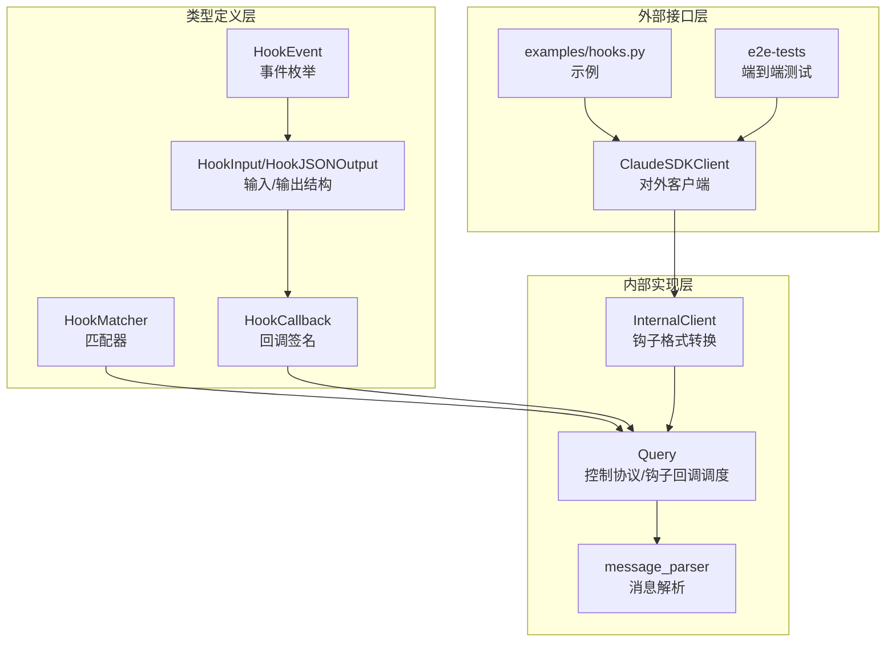
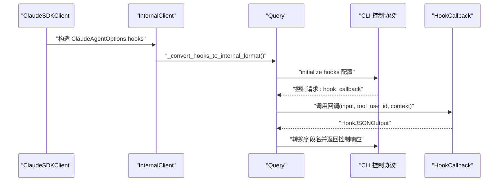
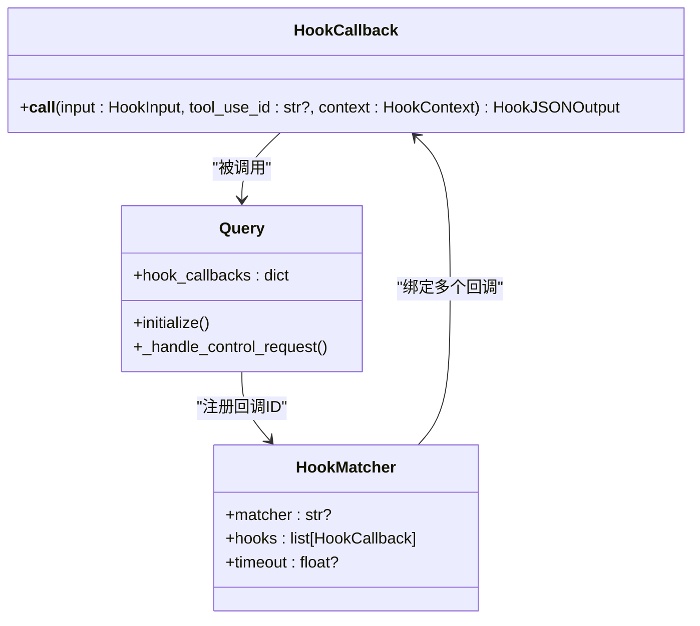
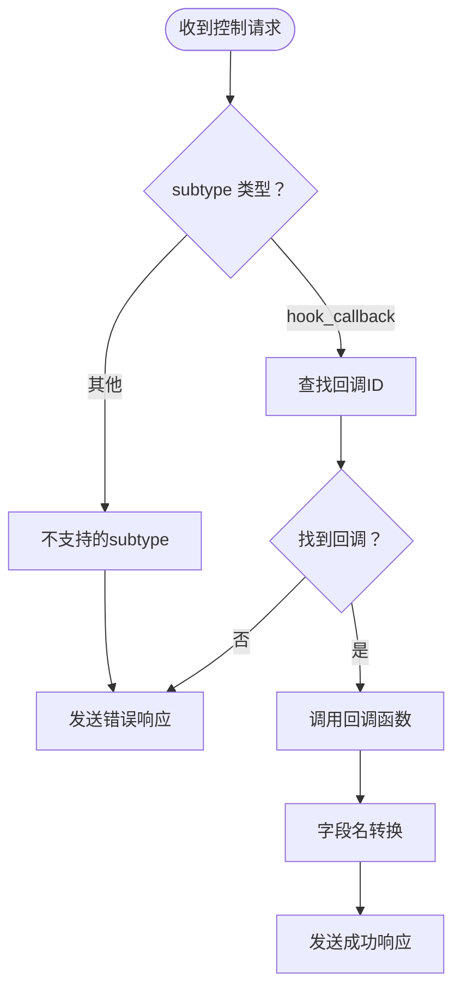
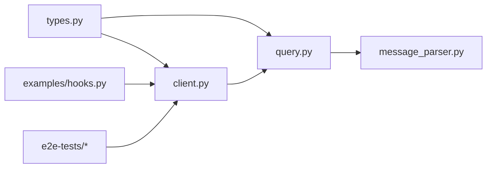

# 钩子系统机制

<cite>
**本文档引用的文件**
- [src/claude_agent_sdk/__init__.py](file://src/claude_agent_sdk/__init__.py)
- [src/claude_agent_sdk/types.py](file://src/claude_agent_sdk/types.py)
- [src/claude_agent_sdk/_internal/query.py](file://src/claude_agent_sdk/_internal/query.py)
- [src/claude_agent_sdk/_internal/client.py](file://src/claude_agent_sdk/_internal/client.py)
- [src/claude_agent_sdk/_internal/message_parser.py](file://src/claude_agent_sdk/_internal/message_parser.py)
- [examples/hooks.py](file://examples/hooks.py)
- [e2e-tests/test_hooks.py](file://e2e-tests/test_hooks.py)
- [e2e-tests/test_hook_events.py](file://e2e-tests/test_hook_events.py)
</cite>

## 目录
1. [简介](#简介)
2. [项目结构](#项目结构)
3. [核心组件](#核心组件)
4. [架构总览](#架构总览)
5. [详细组件分析](#详细组件分析)
6. [依赖关系分析](#依赖关系分析)
7. [性能考虑](#性能考虑)
8. [故障排除指南](#故障排除指南)
9. [结论](#结论)
10. [附录](#附录)

## 简介
本文件系统性阐述 Claude Agent SDK 的钩子（Hook）系统：设计理念、工作机制、事件类型与触发时机、匹配器（HookMatcher）用法、钩子函数实现模式（同步/异步）、执行顺序与错误处理，以及在日志记录、监控统计、安全审计等场景中的实践应用。通过源码级别的分析与图示，帮助开发者正确配置与扩展钩子系统，构建可观察、可审计、可控制的智能体交互流程。

## 项目结构
钩子系统由以下关键模块组成：
- 类型定义层：定义事件类型、输入输出结构、回调签名与匹配器
- 内部查询层：负责初始化、控制协议通信、钩子回调分发
- 客户端封装层：对外暴露选项与客户端，完成钩子配置到内部格式的转换
- 示例与测试：演示钩子的实际使用与端到端验证

**图表来源**
- [src/claude_agent_sdk/types.py:160-472](file://src/claude_agent_sdk/types.py#L160-L472)
- [src/claude_agent_sdk/_internal/query.py:53-163](file://src/claude_agent_sdk/_internal/query.py#L53-L163)
- [src/claude_agent_sdk/_internal/client.py:20-42](file://src/claude_agent_sdk/_internal/client.py#L20-L42)
- [src/claude_agent_sdk/_internal/message_parser.py:29-251](file://src/claude_agent_sdk/_internal/message_parser.py#L29-L251)

**章节来源**
- [src/claude_agent_sdk/__init__.py:22-93](file://src/claude_agent_sdk/__init__.py#L22-L93)
- [src/claude_agent_sdk/types.py:160-472](file://src/claude_agent_sdk/types.py#L160-L472)
- [src/claude_agent_sdk/_internal/query.py:53-163](file://src/claude_agent_sdk/_internal/query.py#L53-L163)
- [src/claude_agent_sdk/_internal/client.py:20-42](file://src/claude_agent_sdk/_internal/client.py#L20-L42)
- [src/claude_agent_sdk/_internal/message_parser.py:29-251](file://src/claude_agent_sdk/_internal/message_parser.py#L29-L251)

## 核心组件
- 事件类型（HookEvent）：预工具使用（PreToolUse）、后工具使用（PostToolUse）、工具使用失败（PostToolUseFailure）、用户提示提交（UserPromptSubmit）、停止（Stop）、子代理停止（SubagentStop）、压缩前（PreCompact）、通知（Notification）、子代理启动（SubagentStart）、权限请求（PermissionRequest）
- 输入类型（HookInput）：基于事件类型强类型化的输入结构，包含会话上下文、工具名、输入参数、响应内容、错误信息、工具使用标识等
- 输出类型（HookJSONOutput）：同步输出（SyncHookJSONOutput）支持 continue_、stopReason、decision、systemMessage、reason、hookSpecificOutput；异步输出（AsyncHookJSONOutput）支持 async_ 与 asyncTimeout
- 匹配器（HookMatcher）：用于将事件与回调函数关联，支持工具名匹配与超时设置
- 回调签名（HookCallback）：接收强类型输入、可选工具使用ID、上下文，返回异步输出
- 查询与控制协议（Query）：负责初始化钩子配置、接收控制请求、分发钩子回调、转换字段名以适配 CLI

**章节来源**
- [src/claude_agent_sdk/types.py:160-472](file://src/claude_agent_sdk/types.py#L160-L472)
- [src/claude_agent_sdk/_internal/query.py:236-346](file://src/claude_agent_sdk/_internal/query.py#L236-L346)

## 架构总览
钩子系统采用“事件驱动 + 控制协议”的双向通信架构：
- 初始化阶段：客户端将用户配置的 HookMatcher 转换为内部格式，并通过 initialize 请求发送给 CLI
- 运行阶段：CLI 在相应事件发生时向 SDK 发送 hook_callback 控制请求，Query 将请求路由到已注册的回调函数
- 输出阶段：回调函数返回结构化输出，Query 将 Python 字段名转换为 CLI 所需名称并回传

**图表来源**
- [src/claude_agent_sdk/_internal/client.py:26-42](file://src/claude_agent_sdk/_internal/client.py#L26-L42)
- [src/claude_agent_sdk/_internal/query.py:119-163](file://src/claude_agent_sdk/_internal/query.py#L119-L163)
- [src/claude_agent_sdk/_internal/query.py:288-303](file://src/claude_agent_sdk/_internal/query.py#L288-L303)

## 详细组件分析

### 事件类型与触发时机
- PreToolUse：工具调用前触发，可用于权限决策、输入修改、上下文注入
- PostToolUse：工具调用后触发，可用于结果审核、上下文补充、统计上报
- PostToolUseFailure：工具调用失败时触发，可用于错误恢复、告警
- UserPromptSubmit：用户提交提示时触发，可用于上下文注入、个性化定制
- Stop：会话停止时触发
- SubagentStop/SubagentStart：子代理生命周期事件
- PreCompact：压缩前事件
- Notification：通知事件
- PermissionRequest：权限请求事件

这些事件在控制协议中由 CLI 触发，SDK 通过 Query 接收并分发到对应回调。

**章节来源**
- [src/claude_agent_sdk/types.py:160-310](file://src/claude_agent_sdk/types.py#L160-L310)
- [src/claude_agent_sdk/_internal/query.py:288-303](file://src/claude_agent_sdk/_internal/query.py#L288-L303)

### 钩子匹配器（HookMatcher）
- matcher：字符串，用于匹配事件目标（如工具名），支持多值组合
- hooks：回调函数列表
- timeout：匹配器级超时（秒）

匹配器在初始化时被转换为内部格式，每个回调会被分配唯一回调ID并注册到 Query 的回调表中。

**章节来源**
- [src/claude_agent_sdk/types.py:475-491](file://src/claude_agent_sdk/types.py#L475-L491)
- [src/claude_agent_sdk/_internal/query.py:128-147](file://src/claude_agent_sdk/_internal/query.py#L128-L147)

### 钩子回调实现模式
- 同步钩子：返回 SyncHookJSONOutput，支持 continue_/stopReason/decision/systemMessage/reason/hookSpecificOutput
- 异步钩子：返回 AsyncHookJSONOutput，支持 async_/asyncTimeout
- 字段名转换：Python 使用 async_ 与 continue_，Query 自动转换为 CLI 所需的 async 与 continue

**图表来源**
- [src/claude_agent_sdk/types.py:465-472](file://src/claude_agent_sdk/types.py#L465-L472)
- [src/claude_agent_sdk/types.py:475-491](file://src/claude_agent_sdk/types.py#L475-L491)
- [src/claude_agent_sdk/_internal/query.py:119-163](file://src/claude_agent_sdk/_internal/query.py#L119-L163)
- [src/claude_agent_sdk/_internal/query.py:288-303](file://src/claude_agent_sdk/_internal/query.py#L288-L303)

**章节来源**
- [src/claude_agent_sdk/types.py:393-452](file://src/claude_agent_sdk/types.py#L393-L452)
- [src/claude_agent_sdk/_internal/query.py:34-50](file://src/claude_agent_sdk/_internal/query.py#L34-L50)

### 执行顺序与错误处理
- 执行顺序：初始化时按事件与匹配器顺序注册回调ID；运行时 CLI 按事件发生顺序发起 hook_callback 请求，Query 并发调度回调
- 错误处理：控制请求异常统一转换为控制响应错误；消息读取异常会广播错误到消息流；超时抛出异常并清理等待状态

**图表来源**
- [src/claude_agent_sdk/_internal/query.py:236-346](file://src/claude_agent_sdk/_internal/query.py#L236-L346)

**章节来源**
- [src/claude_agent_sdk/_internal/query.py:172-235](file://src/claude_agent_sdk/_internal/query.py#L172-L235)
- [src/claude_agent_sdk/_internal/query.py:347-393](file://src/claude_agent_sdk/_internal/query.py#L347-L393)

### 实际应用示例
- 日志记录：在 PostToolUse 中记录工具名、输入、响应与耗时
- 监控统计：在 PreToolUse 中注入额外上下文，或在 PostToolUse 中更新 MCP 工具输出
- 安全审计：在 PreToolUse 中基于工具名与输入参数进行策略判断，返回 permissionDecision 与 reason
- 执行控制：在 PostToolUse 中根据工具输出决定 continue_=False 与 stopReason

示例参考：
- [examples/hooks.py:46-154](file://examples/hooks.py#L46-L154)
- [e2e-tests/test_hooks.py:17-157](file://e2e-tests/test_hooks.py#L17-L157)
- [e2e-tests/test_hook_events.py:17-197](file://e2e-tests/test_hook_events.py#L17-L197)

**章节来源**
- [examples/hooks.py:46-154](file://examples/hooks.py#L46-L154)
- [e2e-tests/test_hooks.py:17-157](file://e2e-tests/test_hooks.py#L17-L157)
- [e2e-tests/test_hook_events.py:17-197](file://e2e-tests/test_hook_events.py#L17-L197)

## 依赖关系分析
- 类型层依赖：事件枚举、输入输出结构、回调签名、匹配器
- 查询层依赖：控制协议类型、回调注册与分发、字段名转换
- 客户端层依赖：将用户提供的 HookMatcher 转换为内部格式
- 示例与测试：验证钩子行为与字段兼容性

**图表来源**
- [src/claude_agent_sdk/types.py:160-472](file://src/claude_agent_sdk/types.py#L160-L472)
- [src/claude_agent_sdk/_internal/query.py:53-163](file://src/claude_agent_sdk/_internal/query.py#L53-L163)
- [src/claude_agent_sdk/_internal/client.py:20-42](file://src/claude_agent_sdk/_internal/client.py#L20-L42)
- [src/claude_agent_sdk/_internal/message_parser.py:29-251](file://src/claude_agent_sdk/_internal/message_parser.py#L29-L251)

**章节来源**
- [src/claude_agent_sdk/__init__.py:22-93](file://src/claude_agent_sdk/__init__.py#L22-L93)

## 性能考虑
- 回调并发：Query 使用任务组并发处理控制请求，避免阻塞消息流
- 超时控制：匹配器级超时与初始化超时，防止长时间阻塞
- 流关闭策略：在存在 SDK MCP 或钩子时等待首个结果后再关闭 stdin，确保双向通信
- 字段名转换开销：仅在响应阶段进行一次字典键转换，成本较低

**章节来源**
- [src/claude_agent_sdk/_internal/query.py:168-171](file://src/claude_agent_sdk/_internal/query.py#L168-L171)
- [src/claude_agent_sdk/_internal/query.py:614-631](file://src/claude_agent_sdk/_internal/query.py#L614-L631)
- [src/claude_agent_sdk/_internal/query.py:34-50](file://src/claude_agent_sdk/_internal/query.py#L34-L50)

## 故障排除指南
- 钩子未触发：检查 HookMatcher 的 matcher 是否与工具名匹配；确认事件类型是否正确注册
- 权限决策无效：确认返回的 hookSpecificOutput.hookEventName 与事件一致，且包含 permissionDecision
- 执行中断：检查 continue_=False 与 stopReason 是否正确设置
- 字段名不生效：确认使用 Python SDK 的 async_ 与 continue_，Query 会自动转换
- 超时问题：适当提高 HookMatcher.timeout 或全局初始化超时

**章节来源**
- [src/claude_agent_sdk/_internal/query.py:347-393](file://src/claude_agent_sdk/_internal/query.py#L347-L393)
- [src/claude_agent_sdk/_internal/query.py:34-50](file://src/claude_agent_sdk/_internal/query.py#L34-L50)

## 结论
Claude Agent SDK 的钩子系统通过强类型事件模型、灵活的匹配器与严格的控制协议交互，提供了强大的扩展能力。开发者可通过同步/异步钩子实现日志、监控、安全与控制等多样化需求。建议在生产环境中合理设置超时、完善错误处理，并通过示例与测试验证钩子行为。

## 附录
- 常用字段说明
  - continue_：是否继续后续流程
  - stopReason：停止原因
  - decision：阻断决策（部分事件有效）
  - systemMessage：显示给用户的系统消息
  - reason：对决策的解释
  - hookSpecificOutput：事件特定输出，如 permissionDecision、additionalContext、updatedMCPToolOutput 等
  - async_：延迟钩子执行
  - asyncTimeout：异步超时时间（毫秒）

**章节来源**
- [src/claude_agent_sdk/types.py:393-452](file://src/claude_agent_sdk/types.py#L393-L452)