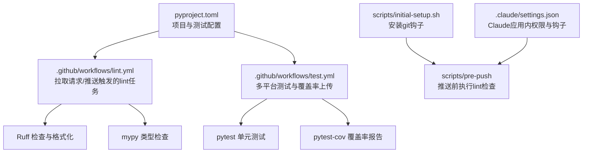
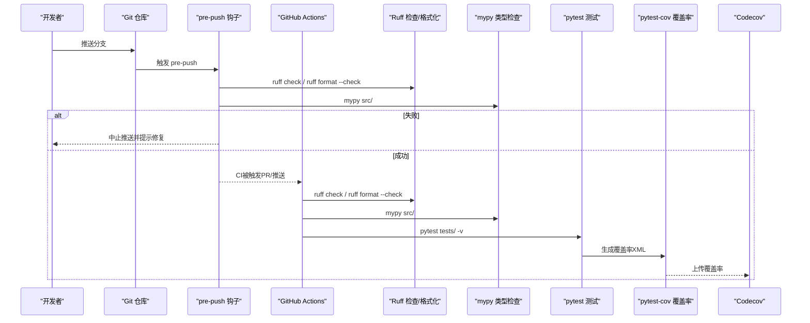
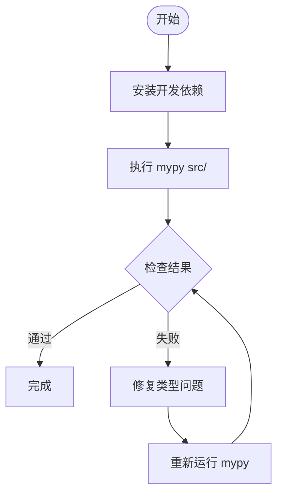
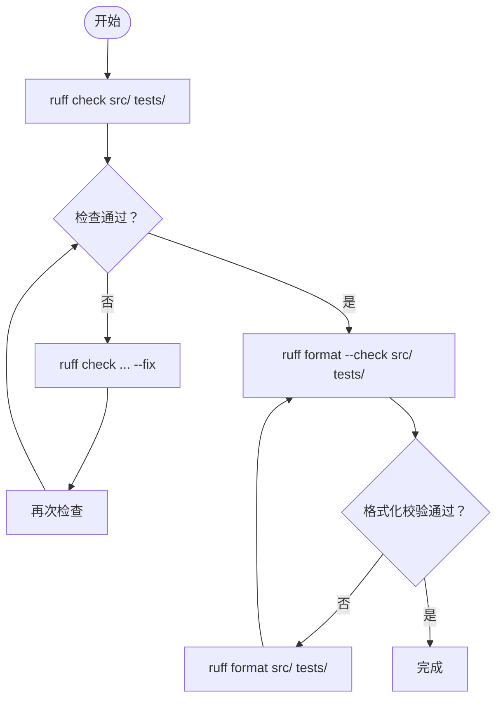
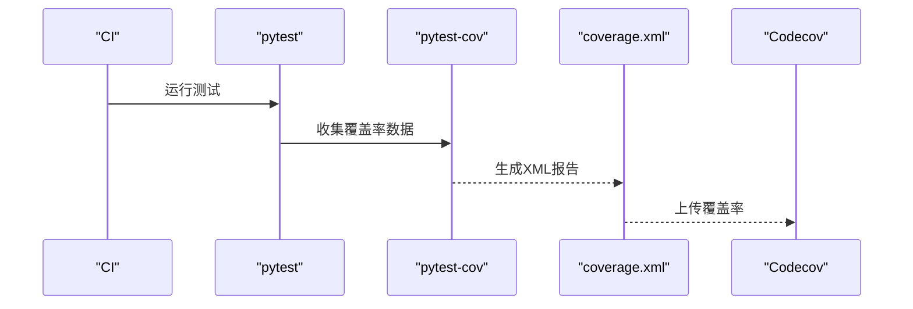
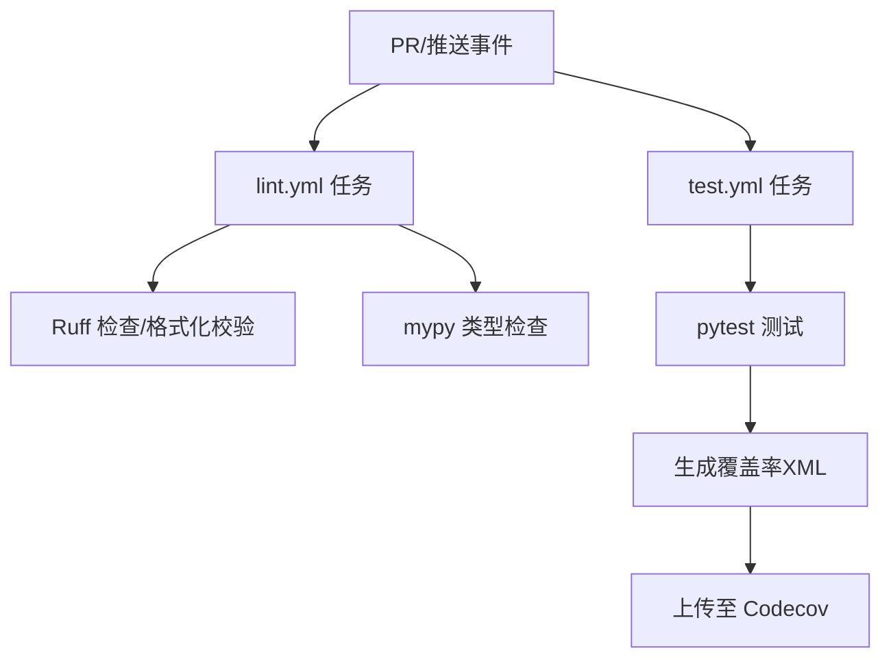
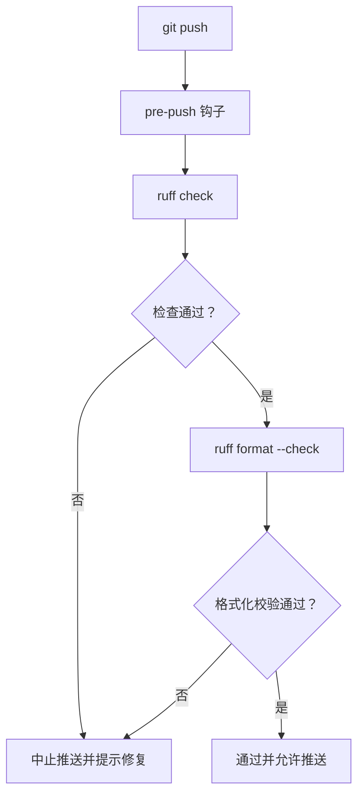
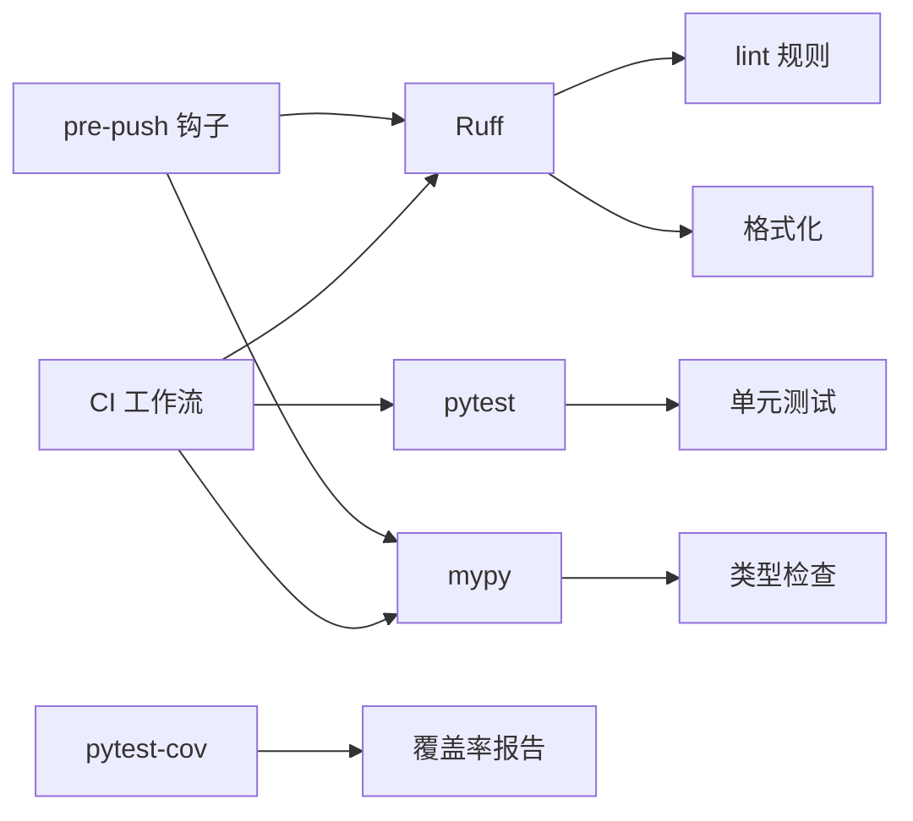

# 代码质量工具

<cite>
**本文引用的文件**
- [pyproject.toml](file://pyproject.toml)
- [.github/workflows/lint.yml](file://.github/workflows/lint.yml)
- [.github/workflows/test.yml](file://.github/workflows/test.yml)
- [README.md](file://README.md)
- [scripts/initial-setup.sh](file://scripts/initial-setup.sh)
- [scripts/pre-push](file://scripts/pre-push)
- [.claude/settings.json](file://.claude/settings.json)
</cite>

## 目录
1. [简介](#简介)
2. [项目结构](#项目结构)
3. [核心组件](#核心组件)
4. [架构总览](#架构总览)
5. [详细组件分析](#详细组件分析)
6. [依赖关系分析](#依赖关系分析)
7. [性能考量](#性能考量)
8. [故障排查指南](#故障排查指南)
9. [结论](#结论)
10. [附录](#附录)

## 简介
本指南面向开发者与贡献者，系统讲解本项目的代码质量工具链：静态分析（mypy）、代码格式化（Ruff/Black风格）、lint与格式化（Ruff）、测试与覆盖率（pytest/pytest-cov）、以及在本地与CI中的一体化集成方案。文档同时覆盖GitHub Actions工作流、pre-commit钩子、以及代码审查最佳实践，帮助团队建立一致、可重复且自动化的质量保障流程。

## 项目结构
本项目采用标准Python工程布局，核心质量配置集中在以下位置：
- 工程与测试配置：pyproject.toml
- 本地与CI质量检查工作流：.github/workflows/lint.yml、.github/workflows/test.yml
- 开发环境集成：scripts/initial-setup.sh、scripts/pre-push
- Claude Code应用侧的权限与钩子配置：.claude/settings.json

图表来源
- [pyproject.toml:60-107](file://pyproject.toml#L60-L107)
- [.github/workflows/lint.yml:1-33](file://.github/workflows/lint.yml#L1-L33)
- [.github/workflows/test.yml:1-171](file://.github/workflows/test.yml#L1-L171)
- [scripts/initial-setup.sh:1-23](file://scripts/initial-setup.sh#L1-L23)
- [scripts/pre-push:1-31](file://scripts/pre-push#L1-L31)
- [.claude/settings.json:1-25](file://.claude/settings.json#L1-L25)

章节来源
- [pyproject.toml:1-109](file://pyproject.toml#L1-L109)
- [.github/workflows/lint.yml:1-33](file://.github/workflows/lint.yml#L1-L33)
- [.github/workflows/test.yml:1-171](file://.github/workflows/test.yml#L1-L171)
- [README.md:290-300](file://README.md#L290-L300)
- [scripts/initial-setup.sh:1-23](file://scripts/initial-setup.sh#L1-L23)
- [scripts/pre-push:1-31](file://scripts/pre-push#L1-L31)
- [.claude/settings.json:1-25](file://.claude/settings.json#L1-L25)

## 核心组件
- 静态分析与类型检查：mypy
  - 在配置中启用严格模式与多项告警选项，确保类型安全与一致性。
  - 运行范围覆盖源码目录。
- 代码格式化与lint：Ruff
  - 使用Ruff统一执行lint与格式化，选择规则集覆盖常见PEP8、pyflakes、isort、命名规范等，并忽略长行警告（由格式化器处理）。
  - 配置了目标版本与行宽，以及first-party模块识别。
- 测试与覆盖率：pytest + pytest-cov
  - 测试路径与pythonpath在配置中明确；覆盖率以XML报告形式上传至Codecov。
- 本地与CI质量检查：GitHub Actions工作流
  - lint.yml：在Ubuntu上安装开发依赖后，先执行Ruff检查与格式化校验，再执行mypy。
  - test.yml：多平台运行单元测试，生成覆盖率XML并上传到Codecov。
- 本地pre-commit钩子
  - initial-setup.sh安装pre-push钩子，pre-push与CI工作流保持一致的检查步骤，避免提交失败。
- 应用侧权限与钩子（Claude）
  - .claude/settings.json允许在编辑/写入后自动触发Ruff检查与格式化命令，辅助在IDE中即时修复。

章节来源
- [pyproject.toml:71-107](file://pyproject.toml#L71-L107)
- [.github/workflows/lint.yml:21-33](file://.github/workflows/lint.yml#L21-L33)
- [.github/workflows/test.yml:29-37](file://.github/workflows/test.yml#L29-L37)
- [scripts/initial-setup.sh:12-22](file://scripts/initial-setup.sh#L12-L22)
- [scripts/pre-push:8-26](file://scripts/pre-push#L8-L26)
- [.claude/settings.json:3-24](file://.claude/settings.json#L3-L24)

## 架构总览
下图展示了从本地开发到CI的质量检查流水线，以及与应用侧钩子的联动：

图表来源
- [.github/workflows/lint.yml:21-33](file://.github/workflows/lint.yml#L21-L33)
- [.github/workflows/test.yml:29-37](file://.github/workflows/test.yml#L29-L37)
- [scripts/pre-push:8-26](file://scripts/pre-push#L8-L26)
- [.claude/settings.json:12-23](file://.claude/settings.json#L12-L23)

## 详细组件分析

### 组件A：mypy类型检查器
- 配置要点
  - 启用严格模式与多项告警项，如未返回值、不可达代码、冗余转换、未使用忽略等，确保高质量类型标注。
  - Python版本与源码范围在配置中明确。
- 运行方式
  - 本地：在安装开发依赖后执行mypy对src目录进行检查。
  - CI：在lint工作流中执行。
- 建议
  - 新增或修改函数时同步完善类型注解，减少any与不完整定义。
  - 对第三方库通过stubs或类型别名补充缺失的类型信息。

图表来源
- [.github/workflows/lint.yml:31-33](file://.github/workflows/lint.yml#L31-L33)
- [pyproject.toml:71-86](file://pyproject.toml#L71-L86)

章节来源
- [pyproject.toml:71-86](file://pyproject.toml#L71-L86)
- [.github/workflows/lint.yml:31-33](file://.github/workflows/lint.yml#L31-L33)

### 组件B：Ruff（格式化与lint）
- 配置要点
  - 目标版本与行宽；选择规则集覆盖pycodestyle、pyflakes、isort、pep8-naming、flake8-bugbear、flake8-comprehensions、flake8-use-pathlib、flake8-simplify等。
  - 忽略长行警告（由格式化器处理），并配置first-party模块识别。
- 运行方式
  - 本地：先执行检查，再执行格式化校验；必要时使用修复参数自动修正。
  - CI：与本地一致，确保PR与主分支一致性。
- 建议
  - 将Ruff检查与格式化纳入IDE保存动作或pre-commit钩子，减少遗漏。
  - 对规则集按需微调，平衡风格与可读性。

图表来源
- [.github/workflows/lint.yml:26-29](file://.github/workflows/lint.yml#L26-L29)
- [scripts/pre-push:8-26](file://scripts/pre-push#L8-L26)
- [pyproject.toml:87-107](file://pyproject.toml#L87-L107)

章节来源
- [pyproject.toml:87-107](file://pyproject.toml#L87-L107)
- [.github/workflows/lint.yml:26-29](file://.github/workflows/lint.yml#L26-L29)
- [scripts/pre-push:8-26](file://scripts/pre-push#L8-L26)

### 组件C：pytest与pytest-cov覆盖率
- 配置要点
  - 测试路径与pythonpath在配置中明确；异步模式已启用。
  - CI中运行测试并生成覆盖率XML，随后上传至Codecov。
- 运行方式
  - 本地：安装开发依赖后执行pytest对tests目录进行测试。
  - CI：多平台矩阵运行，生成XML并上传。
- 建议
  - 为关键模块编写针对性测试，持续提升覆盖率。
  - 结合分支覆盖率定位薄弱环节。

图表来源
- [.github/workflows/test.yml:29-37](file://.github/workflows/test.yml#L29-L37)
- [pyproject.toml:60-69](file://pyproject.toml#L60-L69)

章节来源
- [pyproject.toml:60-69](file://pyproject.toml#L60-L69)
- [.github/workflows/test.yml:29-37](file://.github/workflows/test.yml#L29-L37)

### 组件D：GitHub Actions工作流
- lint.yml
  - 触发条件：PR与推送至main。
  - 步骤：安装依赖、运行Ruff检查与格式化校验、运行mypy。
- test.yml
  - 触发条件：PR与推送至main。
  - 步骤：多平台安装依赖、运行测试、生成并上传覆盖率XML至Codecov。
- 建议
  - 保持本地与CI步骤一致，避免“本地能过、CI不过”的情况。
  - 可根据需要增加缓存策略以加速安装与运行。

图表来源
- [.github/workflows/lint.yml:1-33](file://.github/workflows/lint.yml#L1-L33)
- [.github/workflows/test.yml:1-171](file://.github/workflows/test.yml#L1-L171)

章节来源
- [.github/workflows/lint.yml:1-33](file://.github/workflows/lint.yml#L1-L33)
- [.github/workflows/test.yml:1-171](file://.github/workflows/test.yml#L1-L171)

### 组件E：本地pre-commit钩子
- 安装
  - 执行初始化脚本安装pre-push钩子，使其在每次推送前运行与CI一致的检查。
- 行为
  - 先执行Ruff检查，再执行格式化校验；任一步失败则中止推送并提示修复。
- 建议
  - 如需临时跳过，可使用相应参数绕过钩子，但不建议长期关闭。

图表来源
- [scripts/initial-setup.sh:12-22](file://scripts/initial-setup.sh#L12-L22)
- [scripts/pre-push:8-26](file://scripts/pre-push#L8-L26)

章节来源
- [scripts/initial-setup.sh:12-22](file://scripts/initial-setup.sh#L12-L22)
- [scripts/pre-push:8-26](file://scripts/pre-push#L8-L26)

### 组件F：应用侧权限与钩子（Claude）
- 权限
  - 允许在编辑/写入场景下执行Ruff检查与格式化命令，便于在IDE中即时修复。
- 钩子
  - 在PostToolUse阶段自动触发Ruff检查与格式化，减少手动干预。
- 建议
  - 与本地pre-push钩子配合，形成“编辑即修复”的闭环。

章节来源
- [.claude/settings.json:3-24](file://.claude/settings.json#L3-L24)

## 依赖关系分析
- 工具链耦合
  - Ruff负责lint与格式化，mypy负责类型检查，pytest负责测试，pytest-cov负责覆盖率。
  - CI与本地钩子共享同一套检查步骤，降低不一致风险。
- 外部依赖
  - GitHub Actions、Codecov、Python生态工具链。
- 潜在循环依赖
  - 当前配置无直接循环依赖；建议在新增规则时避免相互冲突的规则组合。

图表来源
- [pyproject.toml:71-107](file://pyproject.toml#L71-L107)
- [.github/workflows/lint.yml:21-33](file://.github/workflows/lint.yml#L21-L33)
- [.github/workflows/test.yml:29-37](file://.github/workflows/test.yml#L29-L37)
- [scripts/pre-push:8-26](file://scripts/pre-push#L8-L26)

章节来源
- [pyproject.toml:71-107](file://pyproject.toml#L71-L107)
- [.github/workflows/lint.yml:21-33](file://.github/workflows/lint.yml#L21-L33)
- [.github/workflows/test.yml:29-37](file://.github/workflows/test.yml#L29-L37)
- [scripts/pre-push:8-26](file://scripts/pre-push#L8-L26)

## 性能考量
- 缓存与增量
  - 在CI中启用依赖缓存可显著缩短安装时间；针对大型项目可考虑分层缓存。
- 并行化
  - 测试阶段可利用多平台矩阵并行执行，缩短整体耗时。
- 规则集优化
  - 仅启用必要的lint规则，避免过度检查导致的性能损耗。
- 本地效率
  - 将Ruff检查与格式化纳入IDE保存动作，减少往返成本。

## 故障排查指南
- mypy报错
  - 检查是否缺少类型注解或存在不兼容的类型推断；逐步缩小范围定位问题模块。
  - 参考配置中的严格选项，逐项核对告警含义。
- Ruff检查失败
  - 根据错误提示修复风格或导入顺序问题；必要时使用修复参数自动修正。
  - 若为长行警告，确认格式化器已正确处理。
- Ruff格式化校验失败
  - 执行格式化命令后重试；确保编辑器保存时自动格式化。
- CI失败
  - 对照本地pre-push钩子行为，确保步骤一致；查看CI日志定位具体失败点。
- 覆盖率异常
  - 确认测试路径与包名匹配；检查覆盖率报告生成与上传步骤。

章节来源
- [pyproject.toml:71-107](file://pyproject.toml#L71-L107)
- [.github/workflows/lint.yml:21-33](file://.github/workflows/lint.yml#L21-L33)
- [.github/workflows/test.yml:29-37](file://.github/workflows/test.yml#L29-L37)
- [scripts/pre-push:8-26](file://scripts/pre-push#L8-L26)

## 结论
本项目已建立起完善的代码质量工具链：mypy保证类型安全，Ruff统一风格与lint，pytest与pytest-cov保障测试与覆盖率，GitHub Actions与pre-push钩子实现本地与CI的一致性。建议在日常开发中坚持“编辑即修复”的原则，结合应用侧钩子与权限配置，形成从IDE到CI的全链路质量保障体系。

## 附录
- 开发环境集成步骤
  - 安装开发依赖后，执行初始化脚本安装pre-push钩子。
  - 在IDE中配置保存时自动运行Ruff格式化，或启用pre-commit插件。
- 常用命令路径参考
  - Ruff检查：[pyproject.toml:87-107](file://pyproject.toml#L87-L107)
  - Ruff格式化：[pyproject.toml:87-107](file://pyproject.toml#L87-L107)
  - mypy类型检查：[pyproject.toml:71-86](file://pyproject.toml#L71-L86)
  - pytest测试：[pyproject.toml:60-69](file://pyproject.toml#L60-L69)
  - pytest-cov覆盖率：[pyproject.toml:60-69](file://pyproject.toml#L60-L69)
  - CI工作流（lint）：[.github/workflows/lint.yml:1-33](file://.github/workflows/lint.yml#L1-L33)
  - CI工作流（test）：[.github/workflows/test.yml:1-171](file://.github/workflows/test.yml#L1-L171)
  - 本地钩子安装：[scripts/initial-setup.sh:12-22](file://scripts/initial-setup.sh#L12-L22)
  - 本地钩子逻辑：[scripts/pre-push:8-26](file://scripts/pre-push#L8-L26)
  - 应用侧权限与钩子：[.claude/settings.json:3-24](file://.claude/settings.json#L3-L24)