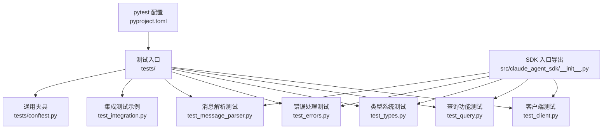
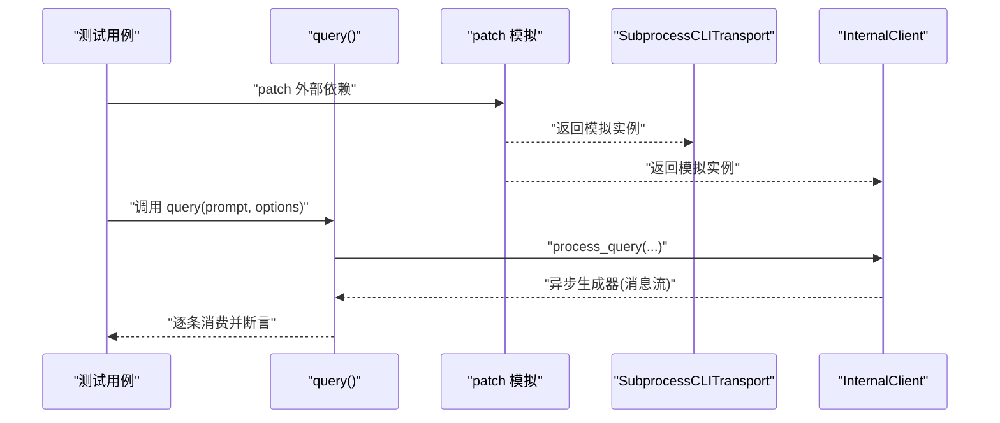
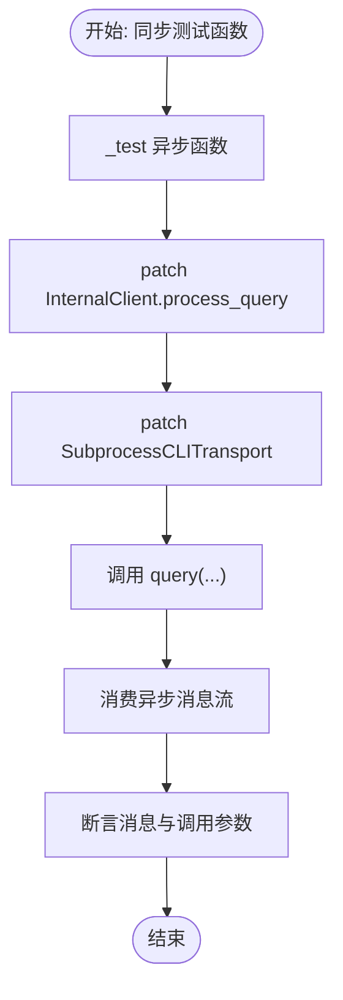
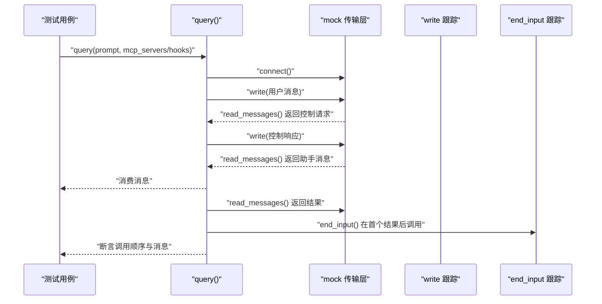
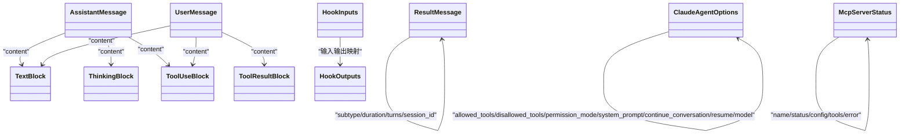
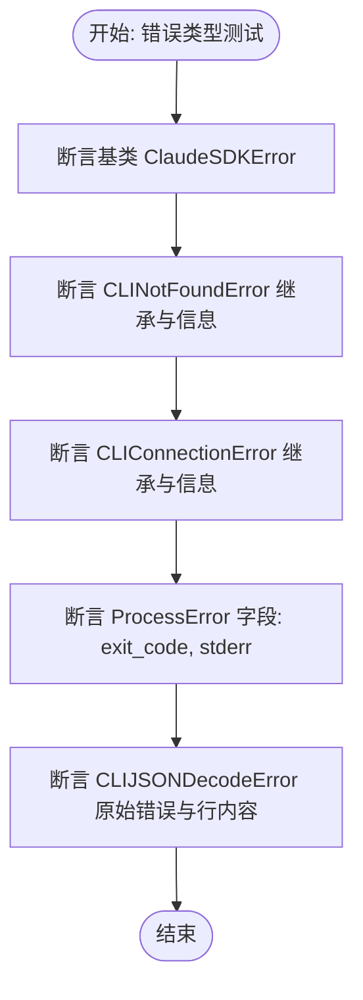
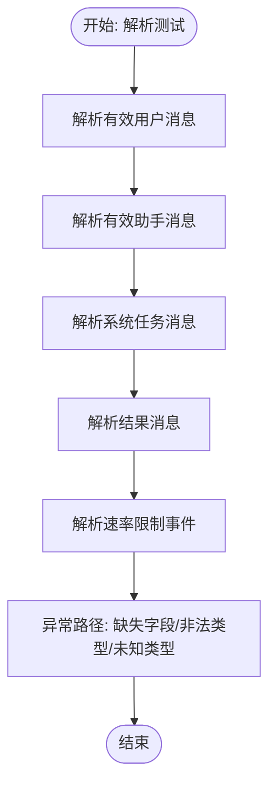
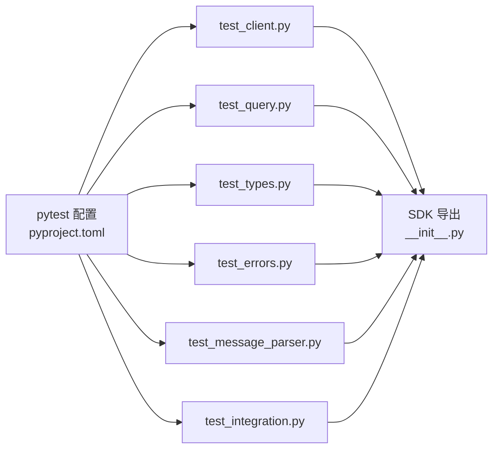

# 单元测试

<cite>
**本文引用的文件**
- [pyproject.toml](file://pyproject.toml)
- [tests/conftest.py](file://tests/conftest.py)
- [tests/test_client.py](file://tests/test_client.py)
- [tests/test_query.py](file://tests/test_query.py)
- [tests/test_types.py](file://tests/test_types.py)
- [tests/test_errors.py](file://tests/test_errors.py)
- [tests/test_message_parser.py](file://tests/test_message_parser.py)
- [tests/test_integration.py](file://tests/test_integration.py)
- [src/claude_agent_sdk/__init__.py](file://src/claude_agent_sdk/__init__.py)
</cite>

## 目录
1. [简介](#简介)
2. [项目结构](#项目结构)
3. [核心组件](#核心组件)
4. [架构总览](#架构总览)
5. [详细组件分析](#详细组件分析)
6. [依赖分析](#依赖分析)
7. [性能考虑](#性能考虑)
8. [故障排查指南](#故障排查指南)
9. [结论](#结论)
10. [附录](#附录)

## 简介
本指南面向Claude Agent SDK的单元测试编写与实践，围绕pytest测试框架的配置与使用、测试夹具(conftest.py)的作用、各模块测试策略（客户端、查询、类型系统、错误处理、消息解析）展开；同时给出测试设计原则（边界条件、异常、正常流程）、异步测试方法（anyio与AsyncMock）、测试数据与模拟对象（patch装饰器）的最佳实践，以及测试覆盖率测量与提升建议和测试命名、断言、隔离等规范。

## 项目结构
本项目采用“源码在src、测试在tests”的标准布局，测试通过pytest驱动，支持同步测试封装为异步执行（anyio.run），并提供基础的pytest配置与插件依赖。

**图表来源**
- [pyproject.toml:60-69](file://pyproject.toml#L60-L69)
- [tests/conftest.py:1-5](file://tests/conftest.py#L1-L5)
- [tests/test_client.py:1-130](file://tests/test_client.py#L1-L130)
- [tests/test_query.py:1-439](file://tests/test_query.py#L1-L439)
- [tests/test_types.py:1-429](file://tests/test_types.py#L1-L429)
- [tests/test_errors.py:1-53](file://tests/test_errors.py#L1-L53)
- [tests/test_message_parser.py:1-696](file://tests/test_message_parser.py#L1-L696)
- [tests/test_integration.py:1-200](file://tests/test_integration.py#L1-L200)
- [src/claude_agent_sdk/__init__.py:1-445](file://src/claude_agent_sdk/__init__.py#L1-L445)

**章节来源**
- [pyproject.toml:60-69](file://pyproject.toml#L60-L69)
- [tests/conftest.py:1-5](file://tests/conftest.py#L1-L5)

## 核心组件
- 测试框架与配置
  - pytest配置位于pyproject.toml中，设置测试路径、pythonpath与导入模式，并启用asyncio插件以支持异步测试。
  - 项目声明了pytest、pytest-asyncio、pytest-cov等开发依赖，便于异步测试与覆盖率统计。
- 测试夹具
  - tests/conftest.py为空配置文件，注释说明当前使用anyio.run进行同步测试包装，无需额外异步插件。
- 异步测试模式
  - 多个测试通过在测试函数内部定义异步子函数并在末尾调用anyio.run(_test)实现同步测试中的异步行为验证。

**章节来源**
- [pyproject.toml:33-41](file://pyproject.toml#L33-L41)
- [pyproject.toml:60-69](file://pyproject.toml#L60-L69)
- [tests/conftest.py:1-5](file://tests/conftest.py#L1-L5)
- [tests/test_client.py:17-37](file://tests/test_client.py#L17-L37)
- [tests/test_query.py:121-169](file://tests/test_query.py#L121-L169)
- [tests/test_integration.py:27-86](file://tests/test_integration.py#L27-L86)

## 架构总览
下图展示典型测试调用链：测试通过patch对外部依赖（如SubprocessCLITransport、InternalClient）进行模拟，构造消息流，驱动被测函数（query等），最终断言结果与调用行为。

**图表来源**
- [tests/test_client.py:17-37](file://tests/test_client.py#L17-L37)
- [tests/test_query.py:138-169](file://tests/test_query.py#L138-L169)
- [tests/test_integration.py:27-86](file://tests/test_integration.py#L27-L86)

## 详细组件分析

### 客户端测试（test_client.py）
- 测试目标
  - 验证query主流程、选项传递、工作目录参数、以及与底层传输层的交互。
- 关键点
  - 使用patch替换InternalClient.process_query，返回自定义异步生成器，模拟消息流。
  - 使用patch替换SubprocessCLITransport，注入模拟read_messages等方法，验证cwd等参数是否正确传入。
  - 使用anyio.run包装异步逻辑，确保同步测试中可运行异步代码。
- 断言要点
  - 消息数量、消息类型、内容字段、调用参数等。
- 设计原则
  - 正常流程：单提示词、多轮对话、工具使用。
  - 边界条件：空选项、默认值、None值。
  - 异常：CLI不可用、连接失败、JSON解析失败等（见错误处理测试）。

**图表来源**
- [tests/test_client.py:17-37](file://tests/test_client.py#L17-L37)
- [tests/test_client.py:77-129](file://tests/test_client.py#L77-L129)

**章节来源**
- [tests/test_client.py:11-130](file://tests/test_client.py#L11-L130)

### 查询功能测试（test_query.py）
- 测试目标
  - 验证字符串与异步迭代器两种提示输入路径在存在/不存在SDK MCP服务器或钩子时的行为差异，特别是stdin关闭时机。
- 关键点
  - 自定义辅助函数构造mock传输层，注入控制请求与常规消息，验证写入顺序与end_input调用时机。
  - 通过跟踪write与end_input调用顺序，确保在出现MCP控制请求或钩子时保持stdin打开直到首个结果到达。
  - 支持SDK MCP服务器工具注册与调用响应。
- 断言要点
  - 消息数量与类型、控制响应数量、写入消息内容与顺序。
- 设计原则
  - 正常流程：无MCP/钩子时立即关闭stdin。
  - 异常/边界：未知系统子类型、缺失字段、非法数据类型等。

**图表来源**
- [tests/test_query.py:117-169](file://tests/test_query.py#L117-L169)
- [tests/test_query.py:202-257](file://tests/test_query.py#L202-L257)
- [tests/test_query.py:313-371](file://tests/test_query.py#L313-L371)

**章节来源**
- [tests/test_query.py:27-439](file://tests/test_query.py#L27-L439)

### 类型系统测试（test_types.py）
- 测试目标
  - 验证消息类型、选项配置、钩子输入输出类型、MCP状态类型等的构造与字段完整性。
- 关键点
  - 对UserMessage、AssistantMessage、ResultMessage、ThinkingBlock、ToolUseBlock、ToolResultBlock等进行实例化与字段断言。
  - 对ClaudeAgentOptions的多种配置组合进行断言，覆盖权限模式、系统提示、会话续传、模型指定等。
  - 对Hook输入输出类型进行可选字段与附加上下文字段的断言。
  - 对MCP服务器状态类型进行最小/完整/失败场景断言。
- 设计原则
  - 正常流程：字段齐全、类型匹配。
  - 边界条件：可选字段缺失、仅必需字段、错误状态字段存在。

**图表来源**
- [tests/test_types.py:25-160](file://tests/test_types.py#L25-L160)
- [tests/test_types.py:162-334](file://tests/test_types.py#L162-L334)
- [tests/test_types.py:336-429](file://tests/test_types.py#L336-L429)

**章节来源**
- [tests/test_types.py:1-429](file://tests/test_types.py#L1-L429)

### 错误处理测试（test_errors.py）
- 测试目标
  - 验证SDK错误类型及其属性，包括基类、CLI未找到、连接失败、进程错误、JSON解码错误等。
- 关键点
  - 断言错误字符串包含性、继承关系、特定字段（如exit_code、stderr）。
  - 对JSON解码错误，断言原始错误与行内容保留。
- 设计原则
  - 正常流程：错误信息可读、包含关键上下文。
  - 异常：不同来源的错误类型应有明确区分。

**图表来源**
- [tests/test_errors.py:15-53](file://tests/test_errors.py#L15-L53)

**章节来源**
- [tests/test_errors.py:1-53](file://tests/test_errors.py#L1-L53)

### 消息解析测试（test_message_parser.py）
- 测试目标
  - 验证parse_message对各类消息类型的解析行为，包括用户消息、助手消息、系统任务消息、结果消息、速率限制事件等。
- 关键点
  - 对有效数据进行类型转换与字段断言。
  - 对缺失字段、非法类型、未知类型等异常路径进行MessageParseError断言。
  - 对向后兼容性（如任务消息仍可作为SystemMessage识别）进行断言。
- 设计原则
  - 正常流程：字段齐全、类型正确。
  - 异常：缺失字段抛出MessageParseError，未知类型返回None以向前兼容。

**图表来源**
- [tests/test_message_parser.py:26-696](file://tests/test_message_parser.py#L26-L696)

**章节来源**
- [tests/test_message_parser.py:1-696](file://tests/test_message_parser.py#L1-L696)

### 集成测试示例（test_integration.py）
- 测试目标
  - 展示端到端的集成测试思路：通过patch替换底层传输层，模拟CLI响应，验证query主流程与工具使用。
- 关键点
  - 使用AsyncMock与AsyncMock的副作用函数记录写入消息。
  - 验证助手消息内容、工具使用块、结果消息字段。
  - 验证CLI不可用场景下的异常抛出。
- 设计原则
  - 通过最小化模拟与可控消息流，覆盖真实调用路径。

**章节来源**
- [tests/test_integration.py:21-200](file://tests/test_integration.py#L21-L200)

## 依赖分析
- 测试框架与工具
  - pytest、pytest-asyncio、pytest-cov用于测试执行、异步模式与覆盖率统计。
  - anyio用于在同步测试中运行异步代码。
- 模块间耦合
  - 测试主要依赖SDK入口导出（src/claude_agent_sdk/__init__.py），并通过patch替换内部实现细节（如_internal.client、_internal.query、_internal.message_parser）。
- 可能的循环依赖
  - 测试不直接导入内部实现，而是通过patch间接控制，避免循环依赖风险。

**图表来源**
- [pyproject.toml:33-41](file://pyproject.toml#L33-L41)
- [src/claude_agent_sdk/__init__.py:1-445](file://src/claude_agent_sdk/__init__.py#L1-L445)

**章节来源**
- [pyproject.toml:33-41](file://pyproject.toml#L33-L41)
- [src/claude_agent_sdk/__init__.py:1-445](file://src/claude_agent_sdk/__init__.py#L1-L445)

## 性能考虑
- 测试性能优化建议
  - 尽量使用AsyncMock而非真实外部进程，减少IO等待。
  - 合理拆分测试用例，避免重复setup/teardown。
  - 使用pytest的缓存与并行执行（在不破坏隔离的前提下）。
- 异步测试开销
  - anyio.run包装异步测试会引入少量开销，但远小于真实IO；优先保证测试稳定性与可维护性。

## 故障排查指南
- 常见问题与定位
  - 异常断言失败：检查patch路径是否正确、模拟对象方法签名是否匹配。
  - 未触发预期调用：确认调用参数（如cwd、options）是否按预期传入，或查看call_args/call_kwargs。
  - 覆盖率不足：补充边界条件与异常分支用例，尤其是消息解析的缺失字段与未知类型路径。
- 推荐调试步骤
  - 打印关键调用顺序与消息内容，结合断言失败信息定位问题。
  - 使用更小的测试用例复现问题，逐步缩小范围。

**章节来源**
- [tests/test_client.py:66-71](file://tests/test_client.py#L66-L71)
- [tests/test_query.py:161-169](file://tests/test_query.py#L161-L169)
- [tests/test_message_parser.py:573-590](file://tests/test_message_parser.py#L573-L590)

## 结论
本指南总结了基于pytest的单元测试实践：通过conftest与pyproject.toml配置、anyio与AsyncMock配合、patch模拟外部依赖，覆盖客户端、查询、类型系统、错误处理与消息解析五大模块。遵循边界条件、异常与正常流程三类用例设计原则，结合断言与隔离策略，可显著提升测试质量与可维护性。同时，利用pytest-cov进行覆盖率度量与持续改进，确保关键路径与异常分支得到充分验证。

## 附录

### 测试设计原则
- 正常流程：覆盖典型输入与期望输出。
- 边界条件：空值、None、最小字段集合、可选字段缺失。
- 异常情况：缺失字段、非法类型、未知类型、外部服务不可用。

### 异步测试编写方法
- 使用anyio.run包装异步测试函数，确保同步测试中可运行异步逻辑。
- 对需要等待的事件（如stdin关闭时机）使用AsyncMock与副作用函数记录调用顺序。

**章节来源**
- [tests/test_client.py:37-37](file://tests/test_client.py#L37-L37)
- [tests/test_query.py:169-169](file://tests/test_query.py#L169-L169)
- [tests/test_integration.py:86-86](file://tests/test_integration.py#L86-L86)

### 测试数据与模拟对象
- patch装饰器使用
  - 替换内部实现类（如SubprocessCLITransport、InternalClient）为AsyncMock/AsyncMock实例。
  - 对于需要返回异步生成器的方法，使用自定义异步函数模拟消息流。
- 模拟对象方法
  - connect、read_messages、write、end_input、close、is_ready等，按需设置返回值或副作用。

**章节来源**
- [tests/test_client.py:18-27](file://tests/test_client.py#L18-L27)
- [tests/test_query.py:138-147](file://tests/test_query.py#L138-L147)
- [tests/test_integration.py:37-66](file://tests/test_integration.py#L37-L66)

### 测试覆盖率测量与分析
- 配置与命令
  - 项目已声明pytest-cov依赖；可通过pytest --cov=src/claude_agent_sdk --cov-report=term-missing运行覆盖率统计。
- 分析与提升
  - 关注未覆盖的分支（如消息解析的异常路径、类型系统的可选字段）。
  - 为每个模块补充边界与异常用例，逐步提高整体覆盖率。

**章节来源**
- [pyproject.toml:38-38](file://pyproject.toml#L38-L38)

### 测试最佳实践
- 命名约定
  - 测试类使用TestXxx，测试方法使用test_xxx，清晰表达意图。
- 断言方法
  - 优先使用具体断言（如assert isinstance、assert len、assert field值），避免过于宽泛的断言。
- 测试隔离
  - 使用patch隔离外部依赖，避免共享状态；每个测试独立setup/teardown。
- 异步与同步
  - 在同步测试中使用anyio.run包装异步逻辑，保持测试风格一致。

**章节来源**
- [tests/test_client.py:14-14](file://tests/test_client.py#L14-L14)
- [tests/test_query.py:117-117](file://tests/test_query.py#L117-L117)
- [tests/test_types.py:28-28](file://tests/test_types.py#L28-L28)
- [tests/test_errors.py:15-15](file://tests/test_errors.py#L15-L15)
- [tests/test_message_parser.py:26-26](file://tests/test_message_parser.py#L26-L26)