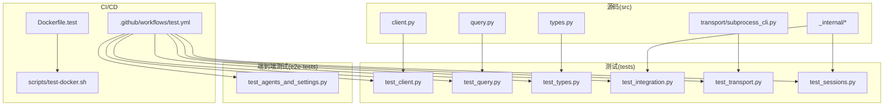
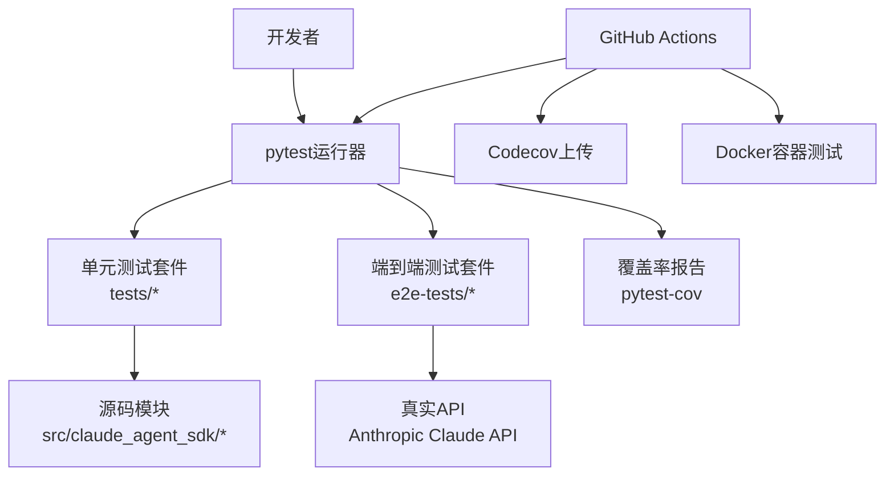
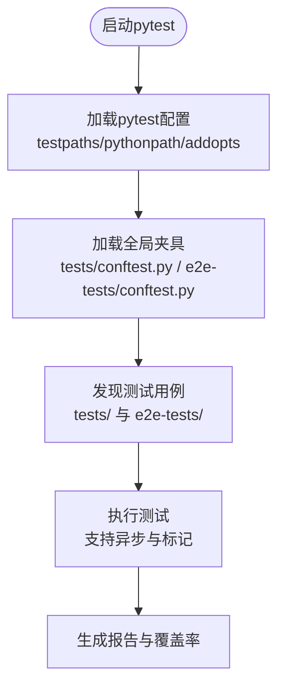
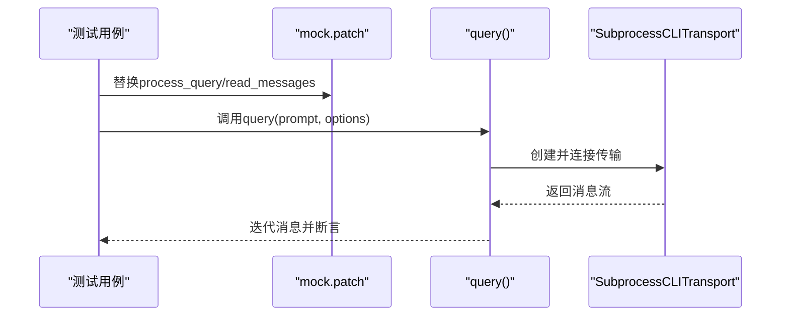
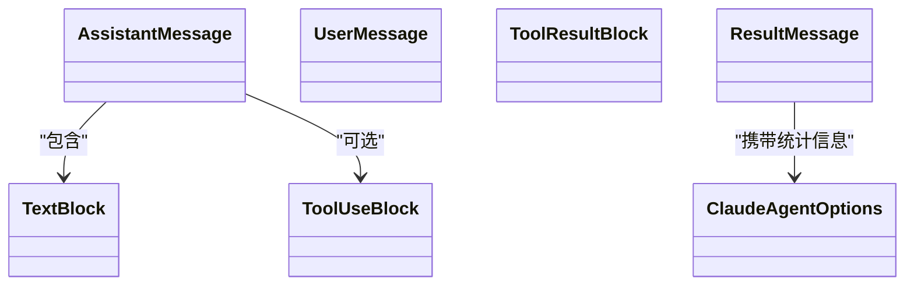
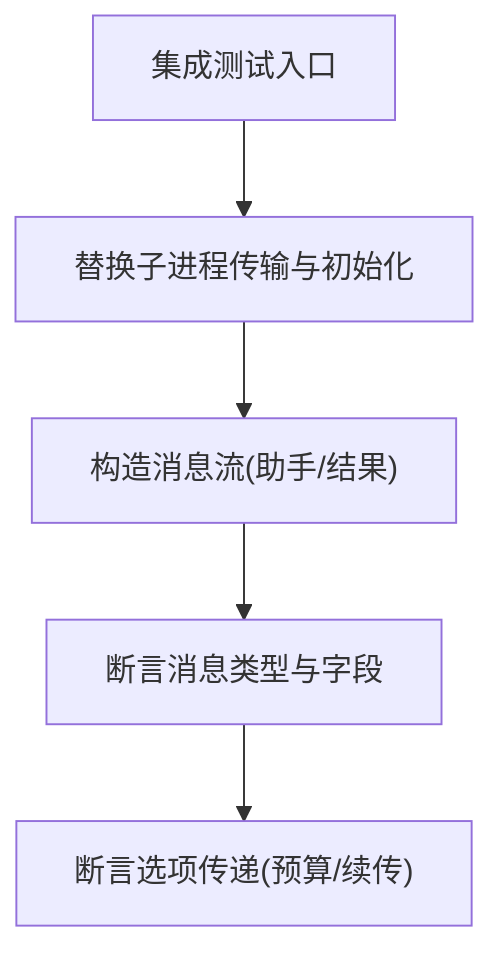
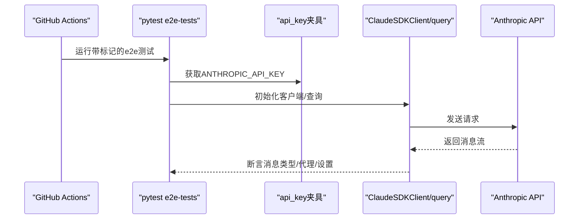
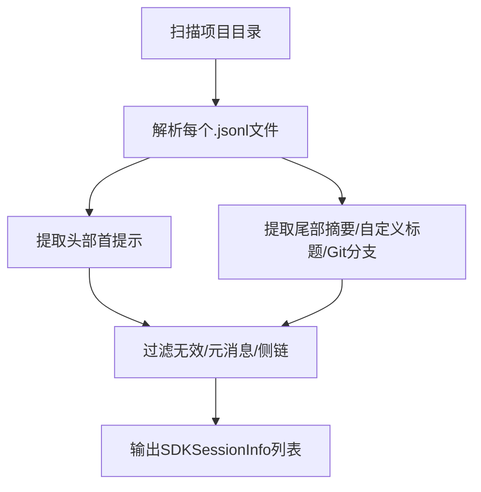
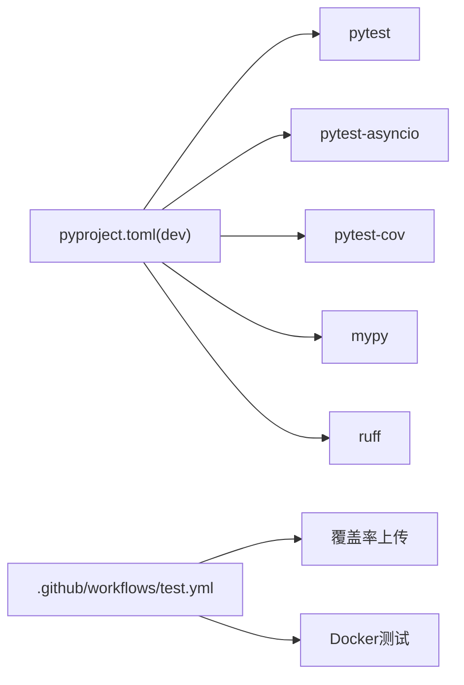

# 测试和质量保证

<cite>
**本文引用的文件**
- [pyproject.toml](file://pyproject.toml)
- [.github/workflows/test.yml](file://.github/workflows/test.yml)
- [tests/conftest.py](file://tests/conftest.py)
- [e2e-tests/conftest.py](file://e2e-tests/conftest.py)
- [Dockerfile.test](file://Dockerfile.test)
- [scripts/test-docker.sh](file://scripts/test-docker.sh)
- [tests/test_client.py](file://tests/test_client.py)
- [tests/test_query.py](file://tests/test_query.py)
- [tests/test_types.py](file://tests/test_types.py)
- [tests/test_integration.py](file://tests/test_integration.py)
- [tests/test_transport.py](file://tests/test_transport.py)
- [tests/test_sessions.py](file://tests/test_sessions.py)
- [e2e-tests/test_agents_and_settings.py](file://e2e-tests/test_agents_and_settings.py)
- [e2e-tests/README.md](file://e2e-tests/README.md)
- [README.md](file://README.md)
</cite>

## 目录
1. [简介](#简介)
2. [项目结构](#项目结构)
3. [核心组件](#核心组件)
4. [架构总览](#架构总览)
5. [详细组件分析](#详细组件分析)
6. [依赖分析](#依赖分析)
7. [性能考虑](#性能考虑)
8. [故障排查指南](#故障排查指南)
9. [结论](#结论)
10. [附录](#附录)

## 简介
本指南面向Claude Agent SDK Python项目的测试与质量保证，覆盖从本地开发到CI/CD的全流程：测试框架配置与使用（pytest）、测试夹具定义、单元测试与类型测试、集成测试与端到端测试、测试覆盖率要求与测量、持续集成流程（GitHub Actions）、测试数据准备与管理、最佳实践（模拟对象、异步测试、并发测试）、代码质量工具（mypy、ruff）以及测试环境搭建与维护。

## 项目结构
该项目采用“分层+功能模块”组织方式：
- 源码位于src/claude_agent_sdk，包含客户端、查询、类型、内部传输等模块
- 单元测试位于tests目录，覆盖客户端、查询、类型、传输、会话等功能
- 端到端测试位于e2e-tests目录，使用真实API进行验证
- 开发与测试工具集中在pyproject.toml中，CI通过.github/workflows/test.yml执行
- Docker测试镜像用于捕获容器特定问题

**图表来源**
- [pyproject.toml:60-69](file://pyproject.toml#L60-L69)
- [.github/workflows/test.yml:9-38](file://.github/workflows/test.yml#L9-L38)
- [Dockerfile.test:1-30](file://Dockerfile.test#L1-L30)

**章节来源**
- [pyproject.toml:60-69](file://pyproject.toml#L60-L69)
- [.github/workflows/test.yml:9-38](file://.github/workflows/test.yml#L9-L38)
- [Dockerfile.test:1-30](file://Dockerfile.test#L1-L30)

## 核心组件
- 测试框架与配置
  - pytest配置：testpaths、pythonpath、插件导入模式、异步模式
  - 开发依赖：pytest、pytest-asyncio、pytest-cov、mypy、ruff
- 质量工具
  - mypy严格模式（strict=true）
  - ruff规则集与排序配置
- CI流水线
  - 多平台矩阵（Ubuntu、macOS、Windows）
  - 单元测试+覆盖率上传Codecov
  - 端到端测试（含Docker容器测试）

**章节来源**
- [pyproject.toml:33-41](file://pyproject.toml#L33-L41)
- [pyproject.toml:60-69](file://pyproject.toml#L60-L69)
- [pyproject.toml:71-86](file://pyproject.toml#L71-L86)
- [pyproject.toml:87-106](file://pyproject.toml#L87-L106)
- [.github/workflows/test.yml:9-38](file://.github/workflows/test.yml#L9-L38)

## 架构总览
下图展示测试与质量保证在系统中的位置与交互：

**图表来源**
- [.github/workflows/test.yml:29-37](file://.github/workflows/test.yml#L29-L37)
- [pyproject.toml:38](file://pyproject.toml#L38)

**章节来源**
- [.github/workflows/test.yml:29-37](file://.github/workflows/test.yml#L29-L37)
- [pyproject.toml:38](file://pyproject.toml#L38)

## 详细组件分析

### 测试框架与夹具
- pytest配置
  - testpaths指向tests目录，pythonpath包含src，确保导入源码模块
  - addopts启用importlib模式与asyncio插件，支持异步测试
- 测试夹具
  - tests/conftest.py：空配置，使用anyio.run运行异步测试
  - e2e-tests/conftest.py：定义api_key与event_loop_policy夹具；为e2e测试添加标记

**图表来源**
- [pyproject.toml:60-69](file://pyproject.toml#L60-L69)
- [tests/conftest.py:1-5](file://tests/conftest.py#L1-L5)
- [e2e-tests/conftest.py:8-32](file://e2e-tests/conftest.py#L8-L32)

**章节来源**
- [pyproject.toml:60-69](file://pyproject.toml#L60-L69)
- [tests/conftest.py:1-5](file://tests/conftest.py#L1-L5)
- [e2e-tests/conftest.py:8-32](file://e2e-tests/conftest.py#L8-L32)

### 单元测试：客户端与查询
- 客户端测试
  - 使用unittest.mock.patch模拟内部客户端与子进程传输
  - 验证query函数行为、选项传递、工作目录参数
- 查询测试
  - 验证字符串提示与异步可迭代提示路径
  - 验证MCP服务器控制请求处理与stdin生命周期
  - 验证钩子场景下的stdin保持策略

**图表来源**
- [tests/test_client.py:11-130](file://tests/test_client.py#L11-L130)
- [tests/test_query.py:114-197](file://tests/test_query.py#L114-L197)
- [tests/test_query.py:310-372](file://tests/test_query.py#L310-L372)

**章节来源**
- [tests/test_client.py:11-130](file://tests/test_client.py#L11-L130)
- [tests/test_query.py:114-197](file://tests/test_query.py#L114-L197)
- [tests/test_query.py:310-372](file://tests/test_query.py#L310-L372)

### 类型测试
- 验证消息类型、内容块、选项配置、钩子输入输出类型
- 验证MCP服务器状态类型与响应结构
- 确保类型定义与SDK对外接口一致

**图表来源**
- [tests/test_types.py:25-82](file://tests/test_types.py#L25-L82)
- [tests/test_types.py:84-160](file://tests/test_types.py#L84-L160)
- [tests/test_types.py:290-334](file://tests/test_types.py#L290-L334)

**章节来源**
- [tests/test_types.py:25-82](file://tests/test_types.py#L25-L82)
- [tests/test_types.py:84-160](file://tests/test_types.py#L84-L160)
- [tests/test_types.py:290-334](file://tests/test_types.py#L290-L334)

### 集成测试
- 验证与CLI子进程通信、工具调用、预算限制、会话续传等端到端行为
- 验证传输层命令构建、环境变量传递、并发写入序列化等

**图表来源**
- [tests/test_integration.py:21-86](file://tests/test_integration.py#L21-L86)
- [tests/test_integration.py:88-162](file://tests/test_integration.py#L88-L162)
- [tests/test_transport.py:23-504](file://tests/test_transport.py#L23-L504)

**章节来源**
- [tests/test_integration.py:21-86](file://tests/test_integration.py#L21-L86)
- [tests/test_integration.py:88-162](file://tests/test_integration.py#L88-L162)
- [tests/test_transport.py:23-504](file://tests/test_transport.py#L23-L504)

### 端到端测试
- 使用真实API验证代理定义、设置来源、大体积代理注册、文件系统代理加载等
- 通过标记@e2e与夹具api_key确保测试在CI中正确执行

**图表来源**
- [.github/workflows/test.yml:39-83](file://.github/workflows/test.yml#L39-L83)
- [e2e-tests/conftest.py:8-17](file://e2e-tests/conftest.py#L8-L17)
- [e2e-tests/test_agents_and_settings.py:42-106](file://e2e-tests/test_agents_and_settings.py#L42-L106)

**章节来源**
- [.github/workflows/test.yml:39-83](file://.github/workflows/test.yml#L39-L83)
- [e2e-tests/conftest.py:8-17](file://e2e-tests/conftest.py#L8-L17)
- [e2e-tests/test_agents_and_settings.py:42-106](file://e2e-tests/test_agents_and_settings.py#L42-L106)

### 会话与消息读取测试
- 列出会话：解析JSONL文件、提取首提示、摘要、自定义标题、Git分支、工作目录
- 读取会话消息：构建对话链、过滤元消息、支持分页与去重

**图表来源**
- [tests/test_sessions.py:242-453](file://tests/test_sessions.py#L242-L453)
- [tests/test_sessions.py:631-800](file://tests/test_sessions.py#L631-L800)

**章节来源**
- [tests/test_sessions.py:242-453](file://tests/test_sessions.py#L242-L453)
- [tests/test_sessions.py:631-800](file://tests/test_sessions.py#L631-L800)

## 依赖分析
- 工具链依赖
  - pytest、pytest-asyncio、pytest-cov：测试与覆盖率
  - mypy、ruff：静态检查与格式化
- 运行时依赖
  - anyio、typing_extensions、mcp：SDK核心能力
- CI依赖
  - codecov-action：覆盖率上传
  - Docker镜像：容器化测试

**图表来源**
- [pyproject.toml:33-41](file://pyproject.toml#L33-L41)
- [.github/workflows/test.yml:33-37](file://.github/workflows/test.yml#L33-L37)
- [Dockerfile.test:1-30](file://Dockerfile.test#L1-L30)

**章节来源**
- [pyproject.toml:33-41](file://pyproject.toml#L33-L41)
- [.github/workflows/test.yml:33-37](file://.github/workflows/test.yml#L33-L37)
- [Dockerfile.test:1-30](file://Dockerfile.test#L1-L30)

## 性能考虑
- 异步与并发
  - 使用pytest-asyncio与anyio.run运行异步测试，避免阻塞
  - 传输层并发写入序列化，防止BusyResourceError
- 覆盖率
  - 使用pytest-cov生成XML报告并上传至Codecov，监控覆盖率变化
- 容器化测试
  - Dockerfile.test与scripts/test-docker.sh帮助捕获容器特定问题（如#406）

**章节来源**
- [pyproject.toml:35-39](file://pyproject.toml#L35-L39)
- [tests/test_transport.py:699-754](file://tests/test_transport.py#L699-L754)
- [.github/workflows/test.yml:33-37](file://.github/workflows/test.yml#L33-L37)
- [scripts/test-docker.sh:34-78](file://scripts/test-docker.sh#L34-L78)

## 故障排查指南
- 缺少API密钥（端到端测试）
  - e2e-tests/conftest.py会在未设置ANTHROPIC_API_KEY时报错
  - 参考e2e-tests/README.md设置与运行
- CLI未找到
  - tests/test_integration.py与tests/test_transport.py验证CLINotFoundError
- 覆盖率缺失或上传失败
  - 确认pytest-cov安装与--cov参数
  - 检查codecov-action配置与file路径
- 容器内测试失败
  - 使用scripts/test-docker.sh构建镜像并运行测试
  - 确认Dockerfile.test中claude安装与权限

**章节来源**
- [e2e-tests/conftest.py:8-17](file://e2e-tests/conftest.py#L8-L17)
- [e2e-tests/README.md:72-102](file://e2e-tests/README.md#L72-L102)
- [tests/test_integration.py:164-178](file://tests/test_integration.py#L164-L178)
- [.github/workflows/test.yml:33-37](file://.github/workflows/test.yml#L33-L37)
- [scripts/test-docker.sh:34-78](file://scripts/test-docker.sh#L34-L78)

## 结论
本项目建立了完善的测试与质量保证体系：以pytest为核心，结合mypy、ruff实现静态质量保障；通过GitHub Actions在多平台自动执行单元与端到端测试，并使用Docker容器捕获特定问题；借助pytest-cov与Codecov持续跟踪覆盖率。遵循本文档的最佳实践与流程，可在开发周期中稳定提升代码质量与交付可靠性。

## 附录

### 测试覆盖率要求与测量
- 要求
  - 保持高覆盖率，重点关注核心模块（client、query、transport、types）
- 测量
  - 使用pytest-cov生成XML报告并上传至Codecov
  - CI步骤已在工作流中配置

**章节来源**
- [.github/workflows/test.yml:29-37](file://.github/workflows/test.yml#L29-L37)

### 持续集成流程（GitHub Actions）
- 触发条件：PR与main分支推送
- 步骤
  - 安装依赖（pip install -e ".[dev]"）
  - 运行pytest并生成覆盖率XML
  - 上传覆盖率至Codecov
  - 执行端到端测试（需ANTHROPIC_API_KEY）
  - Docker容器测试（可选）

**章节来源**
- [.github/workflows/test.yml:3-83](file://.github/workflows/test.yml#L3-L83)

### 测试数据准备与管理
- 端到端测试
  - 设置ANTHROPIC_API_KEY环境变量
  - 使用e2e-tests/conftest.py提供的api_key夹具
- 单元测试
  - 使用unittest.mock.patch模拟外部依赖
  - 使用临时目录与夹具隔离文件系统影响

**章节来源**
- [e2e-tests/conftest.py:8-17](file://e2e-tests/conftest.py#L8-L17)
- [e2e-tests/README.md:7-16](file://e2e-tests/README.md#L7-L16)

### 测试最佳实践
- 模拟对象
  - 使用patch替换内部组件（如process_query、read_messages）
  - 对异步组件使用AsyncMock
- 异步测试
  - 在tests/conftest.py中使用anyio.run运行异步测试
  - 在e2e-tests中使用pytest.mark.asyncio
- 并发测试
  - 传输层写入加锁，避免并发写入冲突
  - 使用pytest-asyncio与anyio任务组

**章节来源**
- [tests/conftest.py:1-5](file://tests/conftest.py#L1-L5)
- [e2e-tests/conftest.py:20-26](file://e2e-tests/conftest.py#L20-L26)
- [tests/test_transport.py:699-754](file://tests/test_transport.py#L699-L754)

### 代码质量工具使用
- mypy
  - 严格模式（strict=true），禁止未打标签定义与不完整定义
- ruff
  - 规则集包含pycodestyle、pyflakes、isort、flake8等
  - 自动排序与格式化建议

**章节来源**
- [pyproject.toml:71-86](file://pyproject.toml#L71-L86)
- [pyproject.toml:87-106](file://pyproject.toml#L87-L106)

### 测试环境搭建与维护
- 本地
  - 安装开发依赖：pip install -e ".[dev]"
  - 运行pytest：python -m pytest tests/ -v
- Docker
  - 使用Dockerfile.test构建镜像
  - 使用scripts/test-docker.sh一键运行单元/端到端测试

**章节来源**
- [pyproject.toml:27-41](file://pyproject.toml#L27-L41)
- [Dockerfile.test:1-30](file://Dockerfile.test#L1-L30)
- [scripts/test-docker.sh:34-78](file://scripts/test-docker.sh#L34-L78)