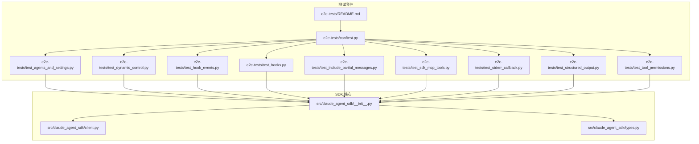
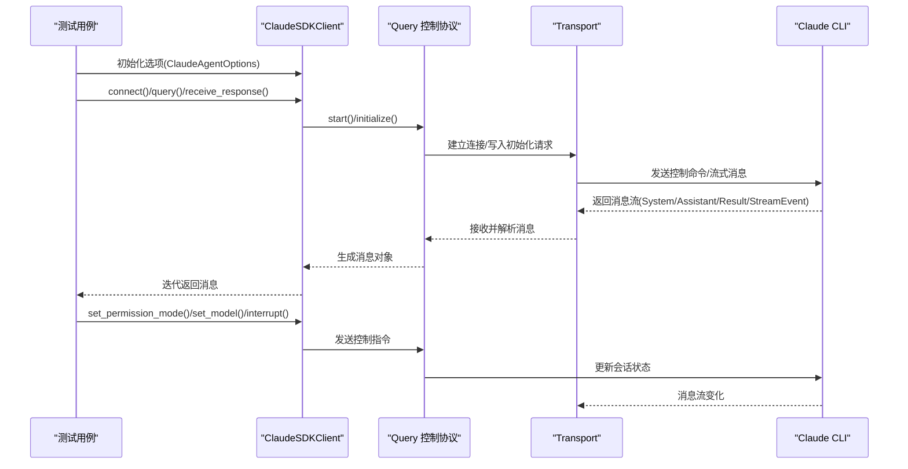
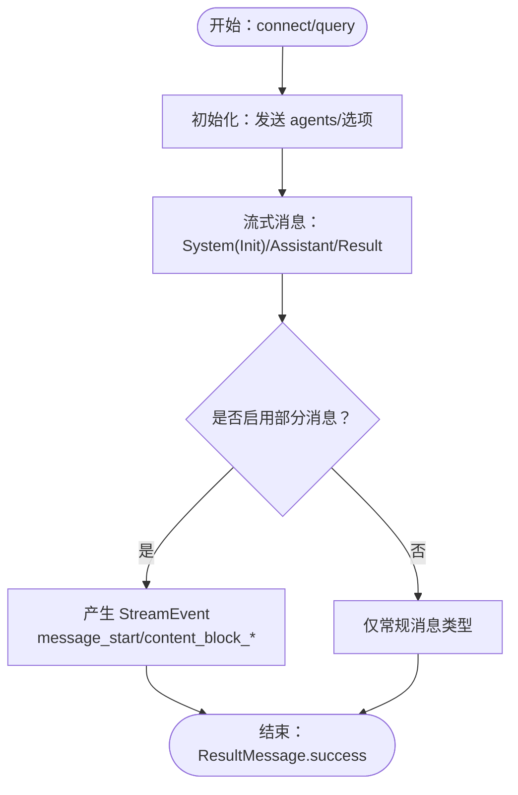
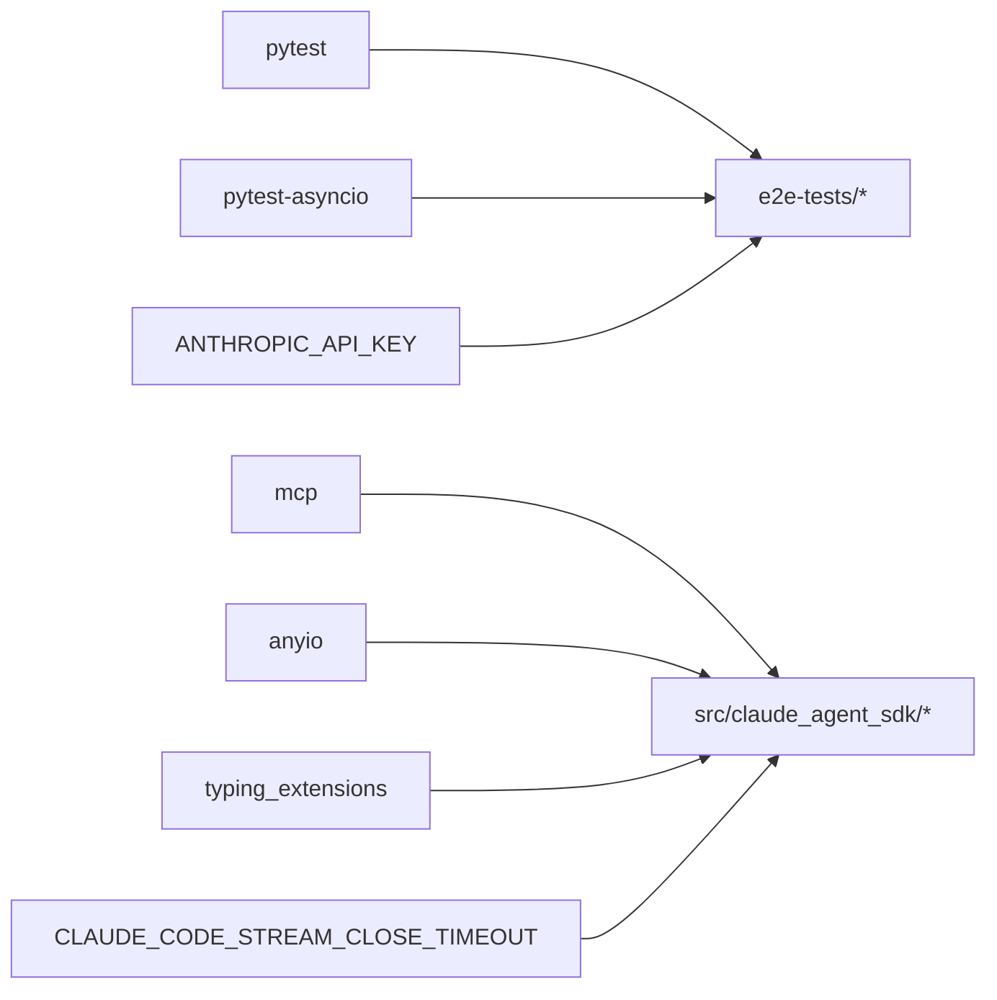

# 集成测试

<cite>
**本文引用的文件**
- [e2e-tests/README.md](file://e2e-tests/README.md)
- [e2e-tests/conftest.py](file://e2e-tests/conftest.py)
- [e2e-tests/test_agents_and_settings.py](file://e2e-tests/test_agents_and_settings.py)
- [e2e-tests/test_dynamic_control.py](file://e2e-tests/test_dynamic_control.py)
- [e2e-tests/test_hook_events.py](file://e2e-tests/test_hook_events.py)
- [e2e-tests/test_hooks.py](file://e2e-tests/test_hooks.py)
- [e2e-tests/test_include_partial_messages.py](file://e2e-tests/test_include_partial_messages.py)
- [e2e-tests/test_sdk_mcp_tools.py](file://e2e-tests/test_sdk_mcp_tools.py)
- [e2e-tests/test_stderr_callback.py](file://e2e-tests/test_stderr_callback.py)
- [e2e-tests/test_structured_output.py](file://e2e-tests/test_structured_output.py)
- [e2e-tests/test_tool_permissions.py](file://e2e-tests/test_tool_permissions.py)
- [src/claude_agent_sdk/__init__.py](file://src/claude_agent_sdk/__init__.py)
- [src/claude_agent_sdk/client.py](file://src/claude_agent_sdk/client.py)
- [src/claude_agent_sdk/types.py](file://src/claude_agent_sdk/types.py)
- [pyproject.toml](file://pyproject.toml)
</cite>

## 目录
1. [简介](#简介)
2. [项目结构](#项目结构)
3. [核心组件](#核心组件)
4. [架构总览](#架构总览)
5. [详细组件分析](#详细组件分析)
6. [依赖关系分析](#依赖关系分析)
7. [性能考虑](#性能考虑)
8. [故障排除指南](#故障排除指南)
9. [结论](#结论)
10. [附录](#附录)

## 简介
本指南面向需要在真实 Claude API 上运行端到端（E2E）集成测试的工程师与测试工程师。文档覆盖以下方面：
- 测试环境搭建与配置要求（API 密钥、依赖安装、运行方式）
- 各个集成测试场景的设计与实施要点
- 最佳实践：测试数据准备、外部依赖处理、环境隔离、超时与重试、清理步骤
- 结果验证方法与常见问题排查
- 性能与压力测试建议

## 项目结构
e2e-tests 目录包含一组标记为 e2e 的测试用例，它们通过 Claude SDK 客户端与真实 Claude API 进行交互，验证代理、设置来源、动态控制、钩子、部分消息流式传输、MCP 工具、标准错误回调、结构化输出以及工具权限等关键功能。

图表来源
- [e2e-tests/README.md:1-102](file://e2e-tests/README.md#L1-L102)
- [e2e-tests/conftest.py:1-33](file://e2e-tests/conftest.py#L1-L33)
- [src/claude_agent_sdk/__init__.py:1-445](file://src/claude_agent_sdk/__init__.py#L1-L445)

章节来源
- [e2e-tests/README.md:1-102](file://e2e-tests/README.md#L1-L102)
- [e2e-tests/conftest.py:1-33](file://e2e-tests/conftest.py#L1-L33)
- [pyproject.toml:60-70](file://pyproject.toml#L60-L70)

## 核心组件
- 测试夹具与标记
  - e2e 标记：用于筛选仅运行端到端测试
  - api_key 夹具：确保环境变量 ANTHROPIC_API_KEY 存在
  - 事件循环策略：统一异步事件循环策略
- SDK 客户端与类型
  - ClaudeSDKClient：双向交互、流式传输、动态控制（权限模式、模型切换、中断）
  - 类型系统：消息类型、内容块、钩子输入/输出、MCP 服务器配置、工具权限回调等

章节来源
- [e2e-tests/conftest.py:8-33](file://e2e-tests/conftest.py#L8-L33)
- [src/claude_agent_sdk/client.py:21-500](file://src/claude_agent_sdk/client.py#L21-L500)
- [src/claude_agent_sdk/types.py:1-800](file://src/claude_agent_sdk/types.py#L1-L800)

## 架构总览
下图展示了从测试用例到 SDK 客户端再到 Claude CLI 的调用链路，以及关键控制点（初始化、权限模式、模型切换、中断、MCP 服务器状态查询）。

图表来源
- [src/claude_agent_sdk/client.py:94-180](file://src/claude_agent_sdk/client.py#L94-L180)
- [src/claude_agent_sdk/client.py:198-280](file://src/claude_agent_sdk/client.py#L198-L280)
- [src/claude_agent_sdk/client.py:418-442](file://src/claude_agent_sdk/client.py#L418-L442)

## 详细组件分析

### 场景一：代理与设置测试（agents_and_settings）
- 覆盖点
  - 自定义代理定义（AgentDefinition）在流式模式下的可用性
  - 大型代理定义（>250KB）通过初始化请求发送
  - 文件系统代理加载（setting_sources=["project"]），校验初始化消息中的代理列表
  - 设置来源组合（user/project/local）对输出样式的影响
- 关键断言
  - SystemMessage.init 中包含 agents 列表
  - 文件系统代理被正确注册
  - 不同 setting_sources 组合影响 output_style
- 实施要点
  - 使用临时目录模拟项目根，创建 .claude/agents 与 .claude/settings.local.json
  - Windows 平台注意文件句柄释放延迟

章节来源
- [e2e-tests/test_agents_and_settings.py:42-72](file://e2e-tests/test_agents_and_settings.py#L42-L72)
- [e2e-tests/test_agents_and_settings.py:74-106](file://e2e-tests/test_agents_and_settings.py#L74-L106)
- [e2e-tests/test_agents_and_settings.py:110-140](file://e2e-tests/test_agents_and_settings.py#L110-L140)
- [e2e-tests/test_agents_and_settings.py:142-214](file://e2e-tests/test_agents_and_settings.py#L142-L214)
- [e2e-tests/test_agents_and_settings.py:215-335](file://e2e-tests/test_agents_and_settings.py#L215-L335)
- [e2e-tests/test_agents_and_settings.py:337-394](file://e2e-tests/test_agents_and_settings.py#L337-L394)

### 场景二：动态控制测试（dynamic_control）
- 覆盖点
  - 运行时修改权限模式（permission_mode）
  - 运行时切换模型（model）
  - 发送中断（interrupt）
- 关键断言
  - 权限模式变更后后续查询行为符合预期
  - 模型切换后响应来自新模型
  - 中断发送不抛出异常（可能即时生效也可能不生效）

章节来源
- [e2e-tests/test_dynamic_control.py:11-40](file://e2e-tests/test_dynamic_control.py#L11-L40)
- [e2e-tests/test_dynamic_control.py:42-74](file://e2e-tests/test_dynamic_control.py#L42-L74)
- [e2e-tests/test_dynamic_control.py:76-98](file://e2e-tests/test_dynamic_control.py#L76-L98)

### 场景三：钩子事件测试（hook_events）
- 覆盖点
  - PreToolUse 钩子返回 additionalContext 字段
  - PostToolUse 钩子接收 tool_use_id 字段
  - Notification 钩子触发（可选）
  - 多种钩子事件同时注册
- 关键断言
  - 钩子调用次数大于零
  - tool_use_id 在 PreToolUse/PostToolUse 输入中存在
  - Notification 钩子返回结构有效

章节来源
- [e2e-tests/test_hook_events.py:17-62](file://e2e-tests/test_hook_events.py#L17-L62)
- [e2e-tests/test_hook_events.py:64-110](file://e2e-tests/test_hook_events.py#L64-L110)
- [e2e-tests/test_hook_events.py:112-157](file://e2e-tests/test_hook_events.py#L112-L157)
- [e2e-tests/test_hook_events.py:159-197](file://e2e-tests/test_hook_events.py#L159-L197)

### 场景四：钩子系统测试（hooks）
- 覆盖点
  - PreToolUse 钩子使用 permissionDecision 与 reason
  - PostToolUse 钩子使用 continue_=False 与 stopReason
  - PostToolUse 钩子返回 hookSpecificOutput
- 关键断言
  - 对应工具名称的钩子被调用
  - 执行被按需阻止或继续

章节来源
- [e2e-tests/test_hooks.py:15-70](file://e2e-tests/test_hooks.py#L15-L70)
- [e2e-tests/test_hooks.py:72-113](file://e2e-tests/test_hooks.py#L72-L113)
- [e2e-tests/test_hooks.py:115-157](file://e2e-tests/test_hooks.py#L115-L157)

### 场景五：部分消息包含测试（include_partial_messages）
- 覆盖点
  - include_partial_messages=True 时产生 StreamEvent
  - thinking deltas 分片增量传输
  - 默认关闭时无 StreamEvent
- 关键断言
  - 至少包含 message_start/content_block_start/delta/stop
  - AssistantMessage 包含 ThinkingBlock 与 TextBlock
  - 关闭时仅有常规消息类型

章节来源
- [e2e-tests/test_include_partial_messages.py:23-90](file://e2e-tests/test_include_partial_messages.py#L23-L90)
- [e2e-tests/test_include_partial_messages.py:91-127](file://e2e-tests/test_include_partial_messages.py#L91-L127)
- [e2e-tests/test_include_partial_messages.py:129-158](file://e2e-tests/test_include_partial_messages.py#L129-L158)

### 场景六：SDK MCP 工具测试（sdk_mcp_tools）
- 覆盖点
  - SDK 内嵌 MCP 服务器工具执行
  - allowed_tools/disallowed_tools 权限控制
  - 多工具顺序调用
  - 未显式授权时工具不可执行
- 关键断言
  - 工具函数被实际调用
  - 权限拒绝生效
  - 允许的工具成功执行

章节来源
- [e2e-tests/test_sdk_mcp_tools.py:19-50](file://e2e-tests/test_sdk_mcp_tools.py#L19-L50)
- [e2e-tests/test_sdk_mcp_tools.py:52-95](file://e2e-tests/test_sdk_mcp_tools.py#L52-L95)
- [e2e-tests/test_sdk_mcp_tools.py:97-137](file://e2e-tests/test_sdk_mcp_tools.py#L97-L137)
- [e2e-tests/test_sdk_mcp_tools.py:139-169](file://e2e-tests/test_sdk_mcp_tools.py#L139-L169)

### 场景七：标准错误回调测试（stderr_callback）
- 覆盖点
  - 开启调试模式时捕获 stderr 输出
  - 关闭调试模式时不捕获或极少捕获
- 关键断言
  - 启用 debug-to-stderr 时包含 DEBUG 行
  - 未启用时无输出

章节来源
- [e2e-tests/test_stderr_callback.py:8-31](file://e2e-tests/test_stderr_callback.py#L8-L31)
- [e2e-tests/test_stderr_callback.py:33-51](file://e2e-tests/test_stderr_callback.py#L33-L51)

### 场景八：结构化输出测试（structured_output）
- 覆盖点
  - JSON Schema 结构化输出
  - 嵌套对象与数组
  - 枚举约束
  - 工具使用场景下的结构化输出
- 关键断言
  - ResultMessage.structured_output 存在且满足 schema
  - 嵌套字段与枚举值合法
  - 数值字段非负

章节来源
- [e2e-tests/test_structured_output.py:18-65](file://e2e-tests/test_structured_output.py#L18-L65)
- [e2e-tests/test_structured_output.py:67-117](file://e2e-tests/test_structured_output.py#L67-L117)
- [e2e-tests/test_structured_output.py:119-164](file://e2e-tests/test_structured_output.py#L119-L164)
- [e2e-tests/test_structured_output.py:166-207](file://e2e-tests/test_structured_output.py#L166-L207)

### 场景九：工具权限测试（tool_permissions）
- 覆盖点
  - can_use_tool 回调被调用（非只读命令）
  - 回调返回允许/拒绝
- 关键断言
  - Bash 工具调用触发回调
  - 回调返回允许后命令被执行

章节来源
- [e2e-tests/test_tool_permissions.py:17-66](file://e2e-tests/test_tool_permissions.py#L17-L66)

### 概念总览：消息流与控制协议

图表来源
- [src/claude_agent_sdk/client.py:94-180](file://src/claude_agent_sdk/client.py#L94-L180)
- [src/claude_agent_sdk/client.py:443-483](file://src/claude_agent_sdk/client.py#L443-L483)

## 依赖关系分析
- 测试依赖
  - pytest 与 pytest-asyncio：异步测试运行与标记
  - mcp：MCP 协议支持
- 运行时依赖
  - anyio：异步运行时抽象
  - typing_extensions：类型兼容
- 环境变量
  - ANTHROPIC_API_KEY：必需
  - CLAUDE_CODE_STREAM_CLOSE_TIMEOUT：影响初始化超时

图表来源
- [pyproject.toml:27-41](file://pyproject.toml#L27-L41)
- [e2e-tests/conftest.py:8-17](file://e2e-tests/conftest.py#L8-L17)
- [src/claude_agent_sdk/client.py:150-156](file://src/claude_agent_sdk/client.py#L150-L156)

章节来源
- [pyproject.toml:27-41](file://pyproject.toml#L27-L41)
- [e2e-tests/conftest.py:8-17](file://e2e-tests/conftest.py#L8-L17)
- [src/claude_agent_sdk/client.py:150-156](file://src/claude_agent_sdk/client.py#L150-L156)

## 性能考虑
- 成本控制
  - 单次测试通常 1-3 次 API 调用，简单提示以降低 token 使用
  - 完整套件成本低于 $0.10
- 超时与重试
  - 初始化超时受 CLAUDE_CODE_STREAM_CLOSE_TIMEOUT 影响，默认至少 60 秒
  - 可根据网络状况调整该环境变量
- 并发与资源
  - 流式模式下避免跨异步上下文复用客户端实例
  - MCP 服务器状态检查与重连（toggle/reconnect）
- 压力测试建议
  - 代理数量与大小：生成多个大型代理定义进行压力测试（参考大代理生成函数）
  - 并发查询：在独立会话中并发发起查询，观察响应稳定性
  - 钩子开销：在钩子中添加轻量日志，评估对整体延迟的影响

章节来源
- [e2e-tests/README.md:45-52](file://e2e-tests/README.md#L45-L52)
- [e2e-tests/test_agents_and_settings.py:19-40](file://e2e-tests/test_agents_and_settings.py#L19-L40)
- [src/claude_agent_sdk/client.py:150-156](file://src/claude_agent_sdk/client.py#L150-L156)
- [src/claude_agent_sdk/client.py:314-361](file://src/claude_agent_sdk/client.py#L314-L361)

## 故障排除指南
- 缺少 API 密钥
  - 现象：测试失败并提示需要设置 ANTHROPIC_API_KEY
  - 处理：导出密钥后重试
- 超时与网络
  - 现象：初始化或查询超时
  - 处理：检查密钥配额、网络连通性；适当增大 CLAUDE_CODE_STREAM_CLOSE_TIMEOUT
- 权限相关
  - 现象：PermissionDenied 或工具未执行
  - 处理：确认 allowed_tools/disallowed_tools；对于非只读命令，确保 can_use_tool 回调逻辑正确
- 钩子未触发
  - 现象：Notification/PreToolUse/PostToolUse 未出现
  - 处理：确认钩子注册与匹配器（matcher）正确；某些钩子（如 Notification）可能依 CLI 行为而定
- MCP 服务器状态
  - 现象：服务器连接失败或工具不可用
  - 处理：使用 get_mcp_status 检查状态；必要时 toggle/reconnect

章节来源
- [e2e-tests/README.md:80-93](file://e2e-tests/README.md#L80-L93)
- [e2e-tests/conftest.py:8-17](file://e2e-tests/conftest.py#L8-L17)
- [src/claude_agent_sdk/client.py:385-416](file://src/claude_agent_sdk/client.py#L385-L416)

## 结论
本指南提供了在真实 Claude API 上运行集成测试的系统化方法，涵盖从环境准备、测试设计到结果验证与故障排除的全流程。通过合理使用 SDK 的流式能力、动态控制与钩子机制，可以构建稳定可靠的端到端测试体系，并结合性能与压力测试持续优化系统表现。

## 附录
- 运行方式
  - 运行全部 e2e 测试：python -m pytest e2e-tests/ -v -m e2e
  - 运行指定测试：python -m pytest e2e-tests/<test_file>.py::<test_func> -v
- 新增测试注意事项
  - 使用 @pytest.mark.e2e 标记
  - 通过 api_key 夹具确保密钥可用
  - 保持提示简洁以控制成本
  - 验证真实工具执行而非仅模拟响应
  - 在 README 中记录特殊前置条件

章节来源
- [e2e-tests/README.md:25-44](file://e2e-tests/README.md#L25-L44)
- [e2e-tests/README.md:94-102](file://e2e-tests/README.md#L94-L102)