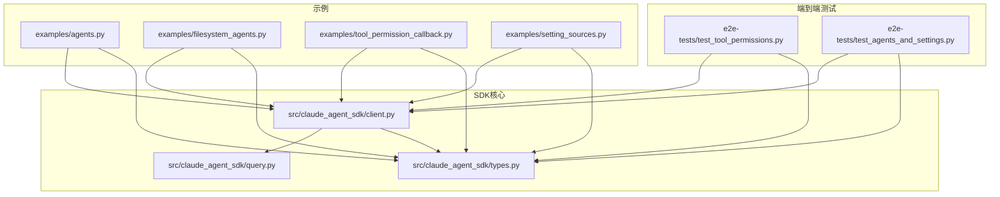
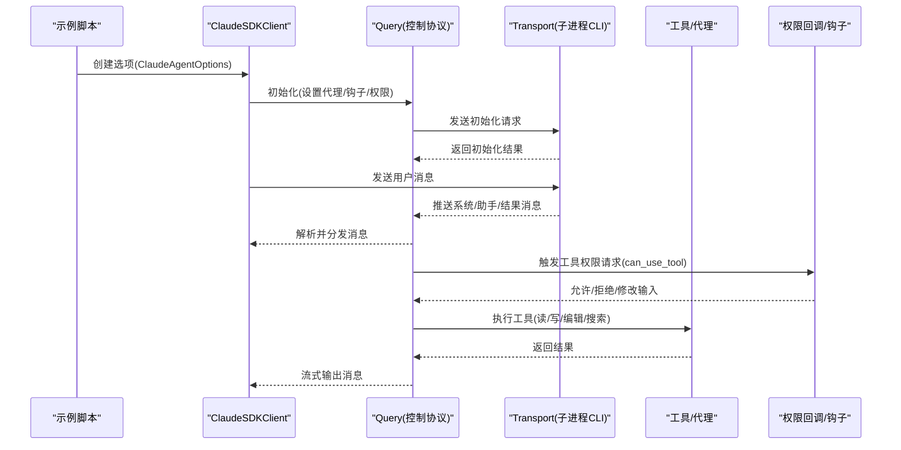
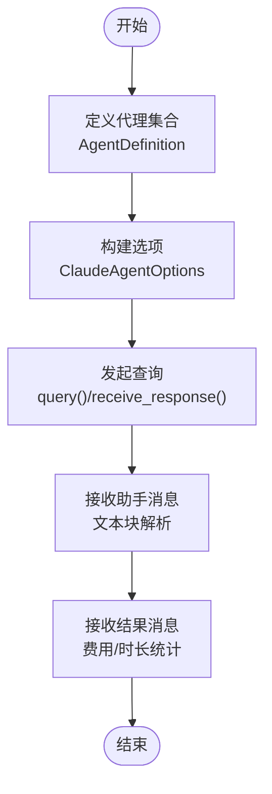
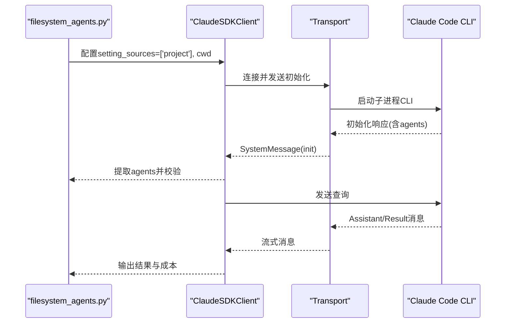
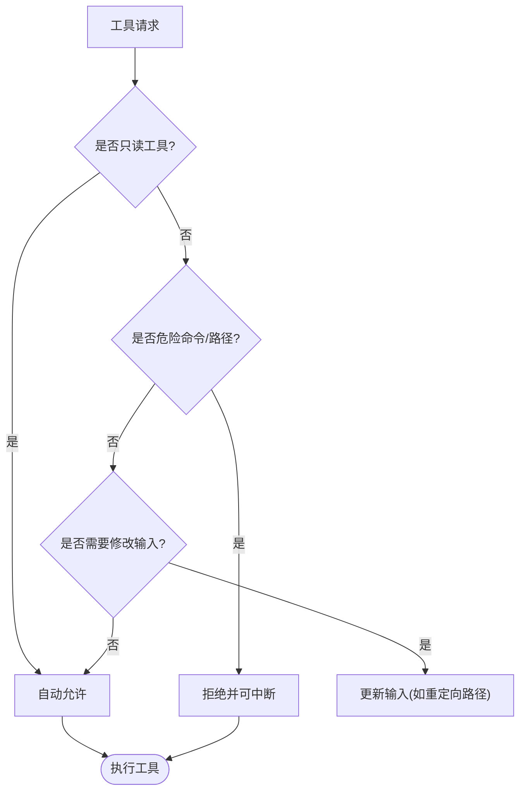
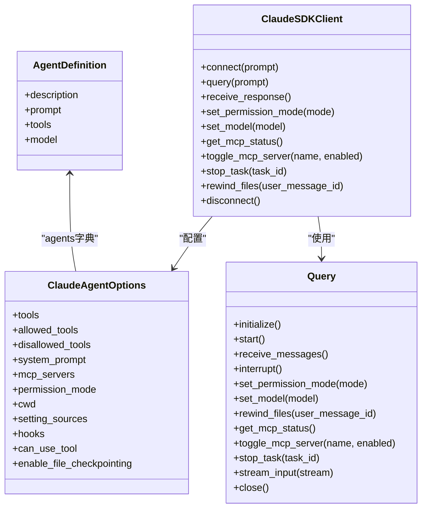
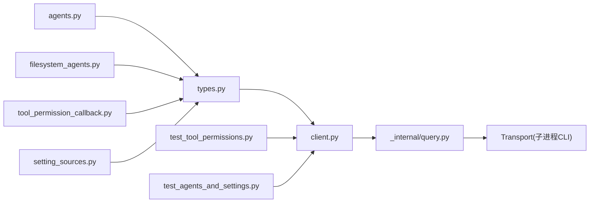

# 代理与文件系统示例

<cite>
**本文档引用的文件**
- [agents.py](file://examples/agents.py)
- [filesystem_agents.py](file://examples/filesystem_agents.py)
- [client.py](file://src/claude_agent_sdk/client.py)
- [types.py](file://src/claude_agent_sdk/types.py)
- [query.py](file://src/claude_agent_sdk/query.py)
- [tool_permission_callback.py](file://examples/tool_permission_callback.py)
- [setting_sources.py](file://examples/setting_sources.py)
- [test_tool_permissions.py](file://e2e-tests/test_tool_permissions.py)
- [test_agents_and_settings.py](file://e2e-tests/test_agents_and_settings.py)
</cite>

## 目录
1. [简介](#简介)
2. [项目结构](#项目结构)
3. [核心组件](#核心组件)
4. [架构总览](#架构总览)
5. [详细组件分析](#详细组件分析)
6. [依赖关系分析](#依赖关系分析)
7. [性能考虑](#性能考虑)
8. [故障排除指南](#故障排除指南)
9. [结论](#结论)

## 简介
本章节面向需要构建智能文件管理或系统代理应用的开发者，系统性介绍 Claude Agent SDK 在智能代理与文件系统操作中的应用实践。内容涵盖：
- 通用代理示例：如何定义与使用自定义代理（代码评审、文档撰写、多代理协作）。
- 文件系统代理示例：通过设置源加载磁盘上的代理定义，验证在不同环境下的可用性。
- 设计模式与状态管理：基于客户端的状态化会话、消息流式传输与控制协议交互。
- 文件访问权限与安全控制：工具权限回调、权限模式切换、沙箱与规则约束。
- 完整实现路径：文件读写、目录遍历、权限检查与异常处理的最佳实践。

## 项目结构
该示例位于 examples 目录下，配合 SDK 核心类型与客户端实现共同构成完整的代理与文件系统操作能力。

**图表来源**
- [agents.py:1-125](file://examples/agents.py#L1-L125)
- [filesystem_agents.py:1-108](file://examples/filesystem_agents.py#L1-L108)
- [client.py:1-500](file://src/claude_agent_sdk/client.py#L1-L500)
- [types.py:1-1199](file://src/claude_agent_sdk/types.py#L1-L1199)
- [query.py:1-127](file://src/claude_agent_sdk/query.py#L1-L127)
- [test_tool_permissions.py:1-66](file://e2e-tests/test_tool_permissions.py#L1-L66)
- [test_agents_and_settings.py:147-223](file://e2e-tests/test_agents_and_settings.py#L147-L223)

**章节来源**
- [agents.py:1-125](file://examples/agents.py#L1-L125)
- [filesystem_agents.py:1-108](file://examples/filesystem_agents.py#L1-L108)
- [client.py:1-500](file://src/claude_agent_sdk/client.py#L1-L500)
- [types.py:1-1199](file://src/claude_agent_sdk/types.py#L1-L1199)
- [query.py:1-127](file://src/claude_agent_sdk/query.py#L1-L127)

## 核心组件
- 代理定义与选项
  - AgentDefinition：描述代理的描述、提示词、工具集与模型选择。
  - ClaudeAgentOptions：统一承载工具、系统提示、MCP 服务器、权限模式、工作目录、设置源、钩子、插件等配置。
- 客户端与消息流
  - ClaudeSDKClient：支持双向、有状态、可中断的交互式对话；提供查询、权限模式切换、模型切换、MCP 管理、任务控制、文件回溯等能力。
  - query 函数：一次性或单向流式查询，适合简单场景。
- 权限与安全
  - 工具权限回调 can_use_tool：在工具执行前进行动态决策，支持允许、拒绝与输入修改。
  - 权限模式：默认、接受编辑、计划模式、绕过权限等。
  - 沙箱与规则：网络与文件系统隔离策略由权限规则驱动。
- 设置源与文件系统代理
  - setting_sources：控制从用户、项目、本地等位置加载配置与代理。
  - 文件系统代理：从 .claude/agents/ 加载 Markdown 定义的代理。

**章节来源**
- [types.py:42-50](file://src/claude_agent_sdk/types.py#L42-L50)
- [types.py:1030-1100](file://src/claude_agent_sdk/types.py#L1030-L1100)
- [client.py:21-500](file://src/claude_agent_sdk/client.py#L21-L500)
- [query.py:12-127](file://src/claude_agent_sdk/query.py#L12-L127)
- [tool_permission_callback.py:26-94](file://examples/tool_permission_callback.py#L26-L94)
- [setting_sources.py:39-44](file://examples/setting_sources.py#L39-L44)

## 架构总览
下图展示了从示例到 SDK 内核的消息流与控制协议交互，以及权限与钩子的处理链路。

**图表来源**
- [client.py:94-180](file://src/claude_agent_sdk/client.py#L94-L180)
- [_internal/query.py:119-163](file://src/claude_agent_sdk/_internal/query.py#L119-L163)
- [_internal/query.py:236-346](file://src/claude_agent_sdk/_internal/query.py#L236-L346)

## 详细组件分析

### 通用代理示例分析
- 代码评审代理：定义工具集为读取与搜索，聚焦代码质量与最佳实践。
- 文档撰写代理：具备读写与编辑能力，适合生成与维护技术文档。
- 多代理协作：在同一会话中组合分析与测试代理，提升开发效率。
- 状态管理：通过 ClaudeSDKClient 维持会话上下文，支持后续追问与中断。

**图表来源**
- [agents.py:23-50](file://examples/agents.py#L23-L50)
- [agents.py:53-79](file://examples/agents.py#L53-L79)
- [agents.py:82-113](file://examples/agents.py#L82-L113)

**章节来源**
- [agents.py:1-125](file://examples/agents.py#L1-L125)
- [client.py:443-483](file://src/claude_agent_sdk/client.py#L443-L483)

### 文件系统代理示例分析
- 目标：通过 setting_sources 从项目目录加载 .claude/agents/ 下的代理定义。
- 行为验证：在不同环境下确保初始化消息包含已加载的代理列表，并能正常返回助手与结果消息。
- 场景覆盖：Windows 环境下等待文件句柄释放，避免清理失败。

**图表来源**
- [filesystem_agents.py:43-104](file://examples/filesystem_agents.py#L43-L104)
- [test_agents_and_settings.py:190-208](file://e2e-tests/test_agents_and_settings.py#L190-L208)

**章节来源**
- [filesystem_agents.py:1-108](file://examples/filesystem_agents.py#L1-L108)
- [setting_sources.py:39-44](file://examples/setting_sources.py#L39-L44)
- [test_agents_and_settings.py:190-208](file://e2e-tests/test_agents_and_settings.py#L190-L208)

### 权限与安全控制分析
- 工具权限回调
  - 读取类工具自动放行，写入类工具进行路径检查与重定向，危险命令模式检测。
  - 支持修改输入参数以增强安全性。
- 权限模式
  - 默认：对危险工具进行用户确认。
  - 接受编辑：自动批准文件编辑。
  - 绕过权限：允许所有工具（谨慎使用）。
- 沙箱与规则
  - 文件系统与网络限制通过权限规则而非沙箱设置直接控制。
  - 沙箱用于 bash 命令隔离，可配置网络代理与忽略违规项。

**图表来源**
- [tool_permission_callback.py:26-94](file://examples/tool_permission_callback.py#L26-L94)
- [types.py:1030-1100](file://src/claude_agent_sdk/types.py#L1030-L1100)

**章节来源**
- [tool_permission_callback.py:1-159](file://examples/tool_permission_callback.py#L1-L159)
- [client.py:234-281](file://src/claude_agent_sdk/client.py#L234-L281)
- [types.py:652-727](file://src/claude_agent_sdk/types.py#L652-L727)

### 类与接口关系图

**图表来源**
- [types.py:42-50](file://src/claude_agent_sdk/types.py#L42-L50)
- [types.py:1030-1100](file://src/claude_agent_sdk/types.py#L1030-L1100)
- [client.py:21-500](file://src/claude_agent_sdk/client.py#L21-L500)
- [_internal/query.py:53-112](file://src/claude_agent_sdk/_internal/query.py#L53-L112)

## 依赖关系分析
- 示例与 SDK 的耦合
  - 通用代理示例依赖 ClaudeAgentOptions 与 query/receive_response。
  - 文件系统代理示例依赖 setting_sources 与 SystemMessage 中的 agents 字段。
  - 权限回调示例依赖 can_use_tool 与 PermissionResultAllow/Deny。
- 控制协议与传输
  - Query 负责初始化、钩子与权限回调的路由，通过 Transport 与 CLI 通信。
- 端到端测试验证
  - 权限回调测试确保回调被调用且对非只读工具生效。
  - 文件系统代理测试验证初始化消息包含代理名称。

**图表来源**
- [agents.py:1-125](file://examples/agents.py#L1-L125)
- [filesystem_agents.py:1-108](file://examples/filesystem_agents.py#L1-L108)
- [tool_permission_callback.py:1-159](file://examples/tool_permission_callback.py#L1-L159)
- [setting_sources.py:1-174](file://examples/setting_sources.py#L1-L174)
- [types.py:1-1199](file://src/claude_agent_sdk/types.py#L1-L1199)
- [client.py:1-500](file://src/claude_agent_sdk/client.py#L1-L500)
- [_internal/query.py:1-679](file://src/claude_agent_sdk/_internal/query.py#L1-L679)
- [test_tool_permissions.py:1-66](file://e2e-tests/test_tool_permissions.py#L1-L66)
- [test_agents_and_settings.py:147-223](file://e2e-tests/test_agents_and_settings.py#L147-L223)

**章节来源**
- [test_tool_permissions.py:19-61](file://e2e-tests/test_tool_permissions.py#L19-L61)
- [test_agents_and_settings.py:190-208](file://e2e-tests/test_agents_and_settings.py#L190-L208)

## 性能考虑
- 流式传输与背压
  - 使用内存对象流缓冲消息，合理设置最大缓冲区大小，避免高吞吐时内存压力。
- 初始化超时
  - 初始化阶段等待 MCP 服务器就绪，可通过环境变量调整超时时间。
- 任务与文件回溯
  - 启用文件检查点后可回溯到指定用户消息状态，但需权衡存储与计算开销。
- 模型与预算
  - 通过模型切换与预算限制控制成本，结合部分消息流式输出减少等待时间。

## 故障排除指南
- 工具权限回调未触发
  - 确认使用流式模式并设置了 can_use_tool；只读工具可能被 CLI 自动放行。
- 文件系统代理未加载
  - 检查 setting_sources 是否包含 "project"，并确保 .claude/agents/ 存在目标代理文件。
- 权限模式无效
  - 确保在流式模式下调用 set_permission_mode；默认模式需要用户确认。
- MCP 服务器连接失败
  - 使用 get_mcp_status 获取状态，必要时通过 reconnect_mcp_server 或 toggle_mcp_server 修复。
- 异常处理
  - 控制协议错误会转换为标准错误消息；在 receive_messages 流中捕获并处理。

**章节来源**
- [client.py:234-281](file://src/claude_agent_sdk/client.py#L234-L281)
- [client.py:385-416](file://src/claude_agent_sdk/client.py#L385-L416)
- [filesystem_agents.py:85-104](file://examples/filesystem_agents.py#L85-L104)
- [_internal/query.py:236-346](file://src/claude_agent_sdk/_internal/query.py#L236-L346)

## 结论
通过 Claude Agent SDK，开发者可以快速构建具备文件系统操作能力的智能代理应用。示例展示了：
- 代理定义与多代理协作的通用模式；
- 从文件系统加载代理的设置源机制；
- 基于工具权限回调的安全控制与输入修改；
- 客户端的状态化会话、流式消息与控制协议交互。

建议在生产环境中：
- 明确权限边界，优先使用规则与模式控制而非绕过权限；
- 合理配置沙箱与网络策略，确保命令执行安全；
- 利用文件检查点与任务管理能力，提升调试与回滚效率；
- 通过钩子与权限回调扩展可观测性与可控性。