# 基础示例

<cite>
**本文档引用的文件**
- [quick_start.py](file://examples/quick_start.py)
- [streaming_mode.py](file://examples/streaming_mode.py)
- [system_prompt.py](file://examples/system_prompt.py)
- [include_partial_messages.py](file://examples/include_partial_messages.py)
- [tools_option.py](file://examples/tools_option.py)
- [query.py](file://src/claude_agent_sdk/query.py)
- [client.py](file://src/claude_agent_sdk/client.py)
- [types.py](file://src/claude_agent_sdk/types.py)
- [README.md](file://README.md)
</cite>

## 目录
1. [简介](#简介)
2. [项目结构](#项目结构)
3. [核心组件](#核心组件)
4. [架构概览](#架构概览)
5. [详细组件分析](#详细组件分析)
6. [依赖关系分析](#依赖关系分析)
7. [性能考虑](#性能考虑)
8. [故障排除指南](#故障排除指南)
9. [结论](#结论)

## 简介

本章节为 Claude Agent SDK 提供入门级使用指南，涵盖从最简单的查询到流式交互的完整使用场景。通过三个核心示例：快速开始示例、流式模式示例和系统提示配置示例，帮助初学者快速掌握 SDK 的基本用法。

Claude Agent SDK 是一个强大的 Python 库，允许开发者与 Claude 代理进行智能对话和工具调用。它提供了两种主要的交互模式：
- **一次性查询模式**：适用于简单、独立的问题或任务
- **流式交互模式**：支持双向对话、实时响应和复杂的工作流程

## 项目结构

基于示例文件的组织结构，我们可以看到 SDK 的核心功能分布在以下模块中：

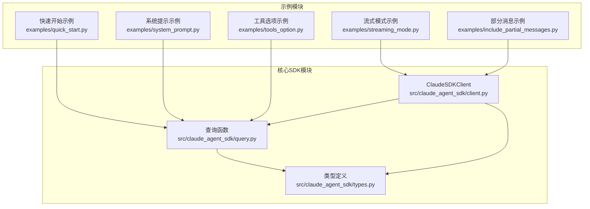

**图表来源**
- [quick_start.py:1-77](file://examples/quick_start.py#L1-L77)
- [streaming_mode.py:1-512](file://examples/streaming_mode.py#L1-L512)
- [system_prompt.py:1-87](file://examples/system_prompt.py#L1-L87)
- [query.py:1-127](file://src/claude_agent_sdk/query.py#L1-L127)
- [client.py:1-500](file://src/claude_agent_sdk/client.py#L1-L500)

**章节来源**
- [quick_start.py:1-77](file://examples/quick_start.py#L1-L77)
- [streaming_mode.py:1-512](file://examples/streaming_mode.py#L1-L512)
- [system_prompt.py:1-87](file://examples/system_prompt.py#L1-L87)

## 核心组件

### 查询函数 (query)
查询函数是 SDK 的核心入口点，提供简单的一次性交互能力：

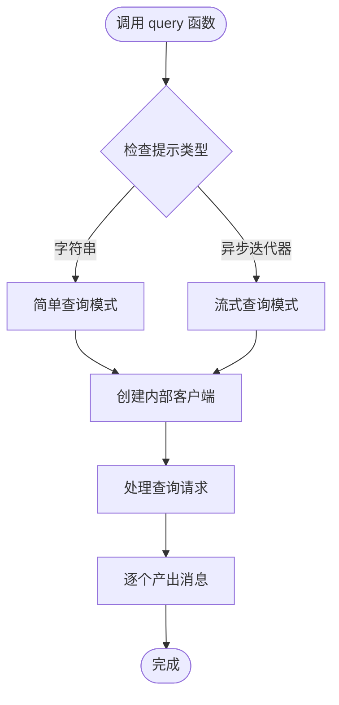

**图表来源**
- [query.py:12-127](file://src/claude_agent_sdk/query.py#L12-L127)

### ClaudeSDKClient 客户端
ClaudeSDKClient 提供完整的双向交互能力：

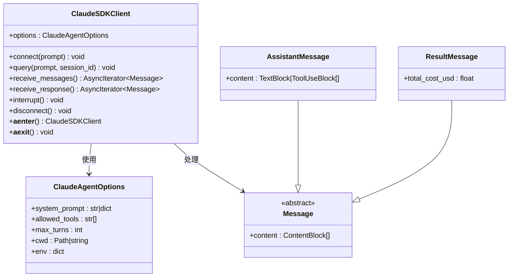

**图表来源**
- [client.py:21-500](file://src/claude_agent_sdk/client.py#L21-L500)
- [types.py:1-200](file://src/claude_agent_sdk/types.py#L1-L200)

**章节来源**
- [query.py:12-127](file://src/claude_agent_sdk/query.py#L12-L127)
- [client.py:21-500](file://src/claude_agent_sdk/client.py#L21-L500)
- [types.py:1-200](file://src/claude_agent_sdk/types.py#L1-L200)

## 架构概览

SDK 采用分层架构设计，确保不同复杂度的使用场景都能得到合适的抽象：

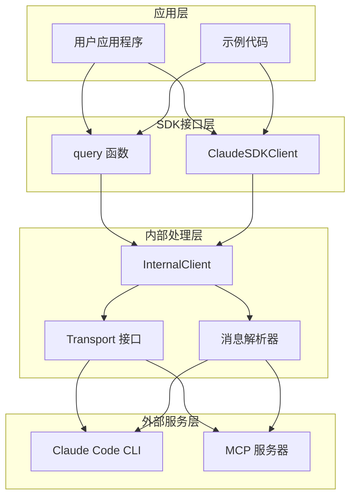

**图表来源**
- [query.py:12-127](file://src/claude_agent_sdk/query.py#L12-L127)
- [client.py:94-180](file://src/claude_agent_sdk/client.py#L94-L180)

## 详细组件分析

### 快速开始示例

快速开始示例展示了 SDK 的最基础用法，包括三种不同的使用模式：

#### 基础查询模式
这是最简单的使用方式，适合一次性问题或简单任务：

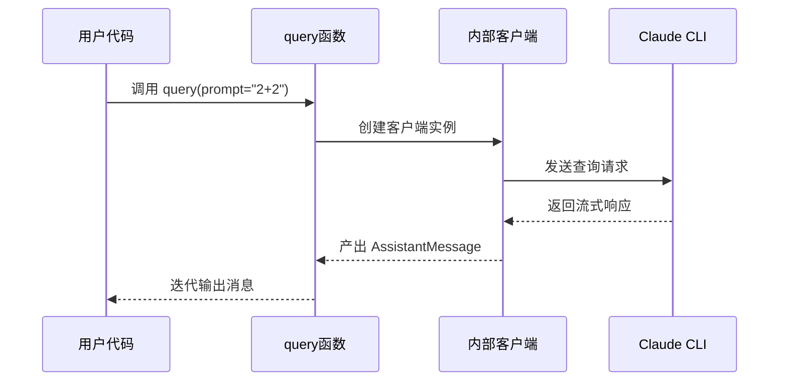

**图表来源**
- [quick_start.py:19-24](file://examples/quick_start.py#L19-L24)
- [query.py:12-127](file://src/claude_agent_sdk/query.py#L12-L127)

#### 自定义选项模式
通过 ClaudeAgentOptions 配置系统提示和对话限制：

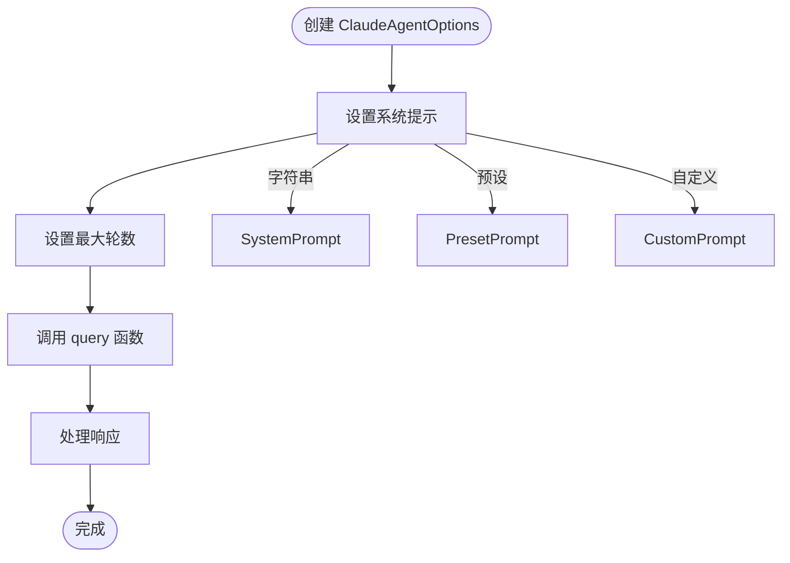

**图表来源**
- [quick_start.py:31-43](file://examples/quick_start.py#L31-L43)
- [types.py:27-40](file://src/claude_agent_sdk/types.py#L27-L40)

#### 工具使用模式
演示如何启用特定工具并处理工具调用结果：

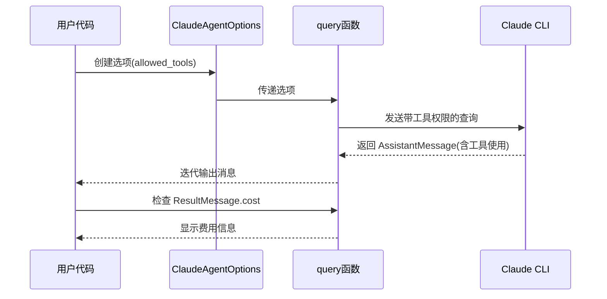

**图表来源**
- [quick_start.py:50-65](file://examples/quick_start.py#L50-L65)

**章节来源**
- [quick_start.py:15-77](file://examples/quick_start.py#L15-L77)

### 流式模式示例

流式模式提供了完整的双向交互能力，支持复杂的多轮对话和实时控制：

#### 客户端生命周期管理
流式客户端需要显式的连接和断开管理：

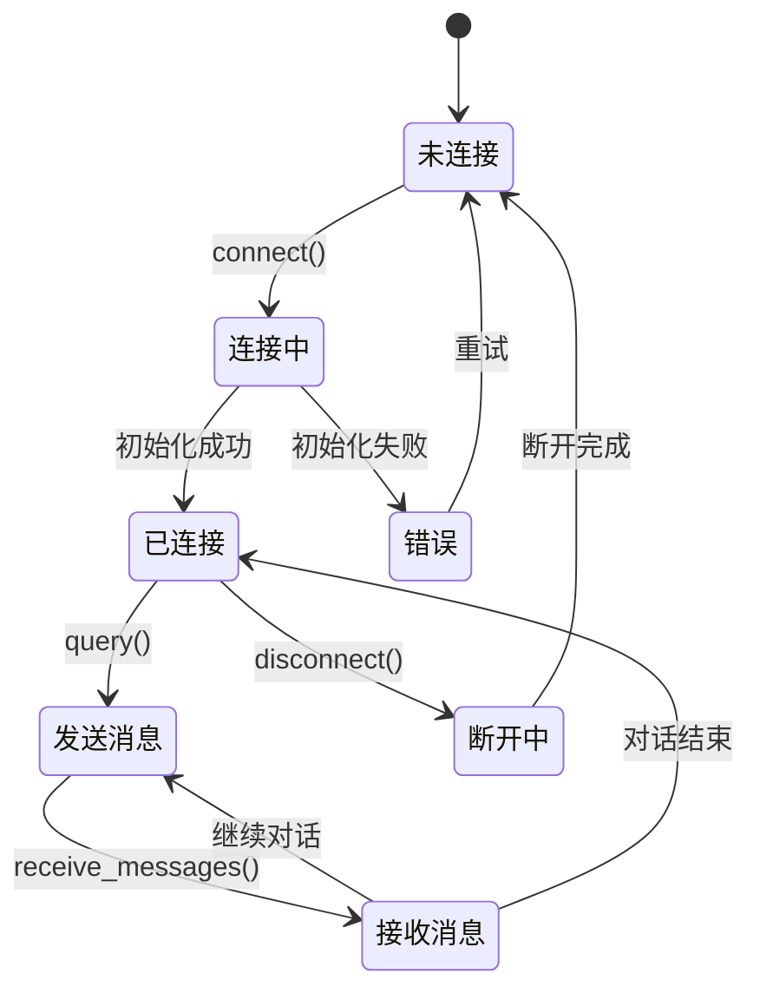

**图表来源**
- [streaming_mode.py:63-71](file://examples/streaming_mode.py#L63-L71)
- [client.py:491-499](file://src/claude_agent_sdk/client.py#L491-L499)

#### 多轮对话处理
支持连续的问答交互，每轮对话都有完整的响应周期：

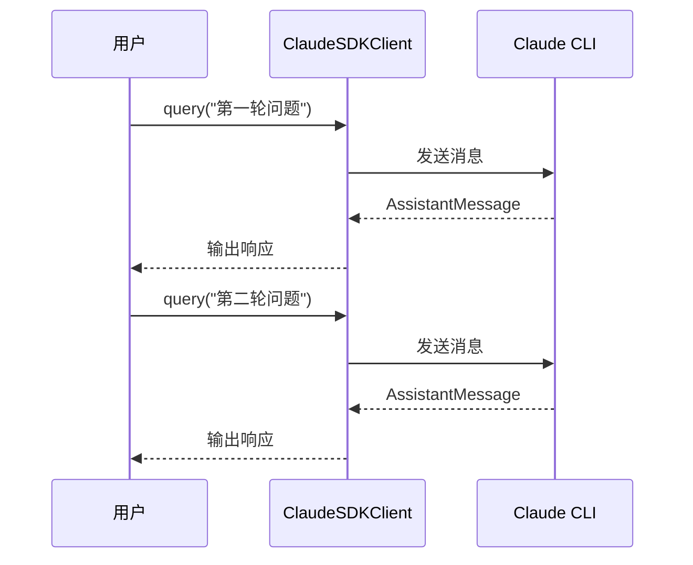

**图表来源**
- [streaming_mode.py:78-94](file://examples/streaming_mode.py#L78-L94)

#### 并发消息处理
支持同时发送多个消息并在后台接收响应：

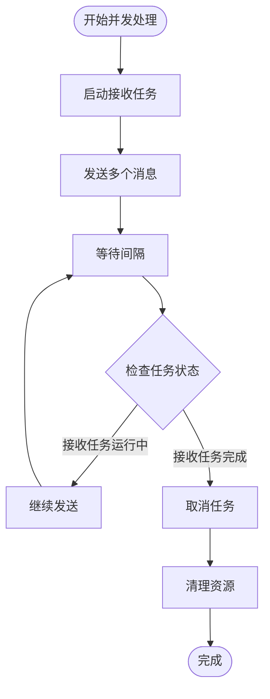

**图表来源**
- [streaming_mode.py:103-129](file://examples/streaming_mode.py#L103-L129)

**章节来源**
- [streaming_mode.py:59-246](file://examples/streaming_mode.py#L59-L246)

### 系统提示配置示例

系统提示是控制 Claude 行为的重要机制，提供了多种配置方式：

#### 无系统提示模式
使用默认的 Claude 行为，不进行任何特殊定制：

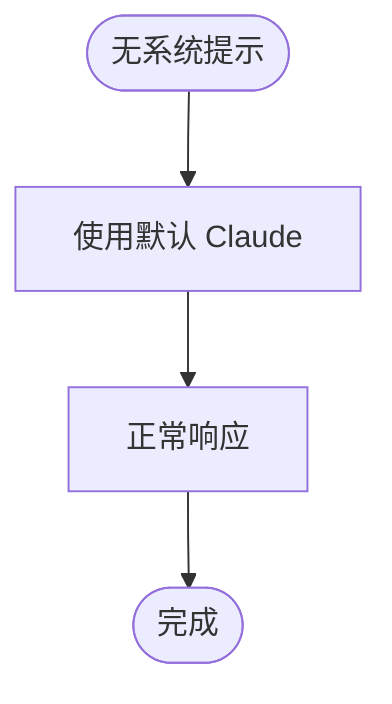

**图表来源**
- [system_prompt.py:18-23](file://examples/system_prompt.py#L18-L23)

#### 字符串系统提示
直接指定自定义的行为指令：

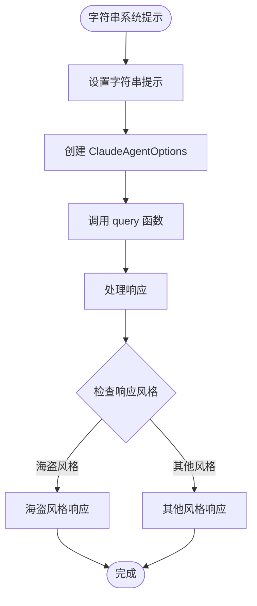

**图表来源**
- [system_prompt.py:30-39](file://examples/system_prompt.py#L30-L39)

#### 预设系统提示
使用 Claude Code 的预设配置作为基础：

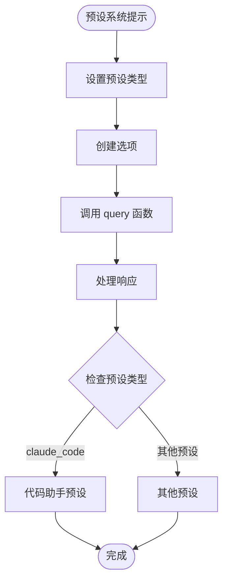

**图表来源**
- [system_prompt.py:46-55](file://examples/system_prompt.py#L46-L55)

**章节来源**
- [system_prompt.py:14-87](file://examples/system_prompt.py#L14-L87)

### 部分消息流式传输示例

部分消息流式传输允许实时接收增量更新，适用于需要即时反馈的应用场景：

#### 配置和连接
启用部分消息流式传输需要特殊的配置：

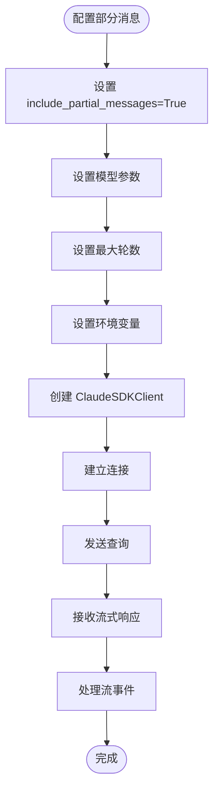

**图表来源**
- [include_partial_messages.py:30-56](file://examples/include_partial_messages.py#L30-L56)

**章节来源**
- [include_partial_messages.py:28-63](file://examples/include_partial_messages.py#L28-L63)

### 工具选项配置示例

工具选项提供了精细的工具访问控制机制：

#### 数组工具配置
精确指定可用工具列表：

```mermaid
flowchart TD
Start([数组工具配置]) --> SetToolsArray[设置 tools=['Read','Glob','Grep']]
SetToolsArray --> CreateOptions[创建选项]
CreateOptions --> CallQuery[调用 query 函数]
CallQuery --> ProcessInitMsg[处理初始化消息]
ProcessInitMsg --> ExtractTools[提取工具列表]
ExtractTools --> VerifyTools[验证工具可用性]
VerifyTools --> End([完成])
```

**图表来源**
- [tools_option.py:22-42](file://examples/tools_option.py#L22-L42)

#### 空数组禁用所有工具
完全禁用内置工具集：

```mermaid
flowchart TD
Start([空数组配置]) --> SetEmptyTools[设置 tools=[]]
SetEmptyTools --> CreateOptions[创建选项]
CreateOptions --> CallQuery[调用 query 函数]
CallQuery --> ProcessResponse[处理响应]
ProcessResponse --> CheckTools{检查可用工具}
CheckTools --> |空列表| NoTools[无可用工具]
NoTools --> End([完成])
```

**图表来源**
- [tools_option.py:51-71](file://examples/tools_option.py#L51-L71)

#### 预设工具配置
使用 Claude Code 的完整工具集：

```mermaid
flowchart TD
Start([预设工具配置]) --> SetPreset[设置 tools={'type':'preset','preset':'claude_code'}]
SetPreset --> CreateOptions[创建选项]
CreateOptions --> CallQuery[调用 query 函数]
CallQuery --> ProcessInitMsg[处理初始化消息]
ProcessInitMsg --> CountTools[统计工具数量]
CountTools --> VerifyFullSet[验证完整工具集]
VerifyFullSet --> End([完成])
```

**图表来源**
- [tools_option.py:80-100](file://examples/tools_option.py#L80-L100)

**章节来源**
- [tools_option.py:16-112](file://examples/tools_option.py#L16-L112)

## 依赖关系分析

SDK 的依赖关系相对简洁，主要围绕核心接口展开：

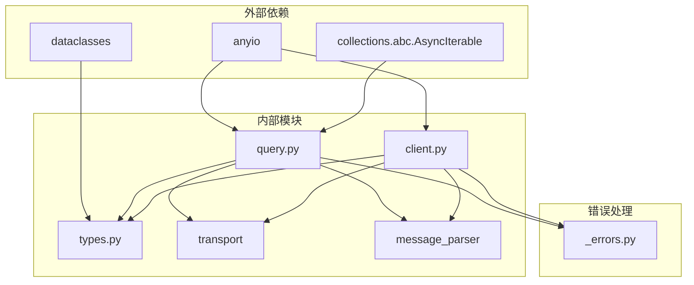

**图表来源**
- [query.py:1-127](file://src/claude_agent_sdk/query.py#L1-L127)
- [client.py:1-500](file://src/claude_agent_sdk/client.py#L1-L500)

**章节来源**
- [query.py:1-127](file://src/claude_agent_sdk/query.py#L1-L127)
- [client.py:1-500](file://src/claude_agent_sdk/client.py#L1-L500)

## 性能考虑

### 查询模式 vs 流式模式
- **查询模式**：适合一次性任务，启动开销小，但无法中断或后续交互
- **流式模式**：适合复杂工作流，支持中断和多轮对话，但有持续的连接开销

### 消息处理优化
- 使用异步迭代器避免阻塞
- 合理设置超时时间防止长时间等待
- 及时清理取消的任务和连接

### 资源管理
- 流式客户端必须正确管理连接生命周期
- 在上下文管理器中使用客户端确保资源释放
- 及时断开连接释放系统资源

## 故障排除指南

### 常见连接问题
- **CLI 未找到**：检查 Claude Code CLI 是否正确安装
- **连接超时**：调整超时设置或检查网络连接
- **权限不足**：检查工具权限配置

### 消息处理问题
- **消息丢失**：确保正确消费消息流
- **响应不完整**：检查流式模式配置
- **工具调用失败**：验证工具权限和输入参数

### 调试技巧
- 启用详细日志记录
- 使用最小化示例重现问题
- 检查环境变量配置
- 验证输入数据格式

**章节来源**
- [README.md:247-269](file://README.md#L247-L269)

## 结论

Claude Agent SDK 提供了从简单到复杂的完整解决方案。通过本章的基础示例，您应该能够：

1. **快速上手**：使用 query 函数进行一次性查询
2. **深入交互**：使用 ClaudeSDKClient 进行双向对话
3. **精细控制**：通过系统提示和工具配置定制行为
4. **实时响应**：利用流式传输获得即时反馈

建议从快速开始示例入手，然后逐步探索更高级的功能。记住根据具体需求选择合适的交互模式，并始终注意资源管理和错误处理。