# 流式处理示例

<cite>
**本文档引用的文件**
- [examples/streaming_mode.py](file://examples/streaming_mode.py)
- [examples/streaming_mode_ipython.py](file://examples/streaming_mode_ipython.py)
- [examples/streaming_mode_trio.py](file://examples/streaming_mode_trio.py)
- [examples/include_partial_messages.py](file://examples/include_partial_messages.py)
- [src/claude_agent_sdk/client.py](file://src/claude_agent_sdk/client.py)
- [src/claude_agent_sdk/types.py](file://src/claude_agent_sdk/types.py)
- [src/claude_agent_sdk/_internal/query.py](file://src/claude_agent_sdk/_internal/query.py)
- [src/claude_agent_sdk/_internal/message_parser.py](file://src/claude_agent_sdk/_internal/message_parser.py)
- [src/claude_agent_sdk/_internal/transport/subprocess_cli.py](file://src/claude_agent_sdk/_internal/transport/subprocess_cli.py)
- [tests/test_streaming_client.py](file://tests/test_streaming_client.py)
</cite>

## 目录
1. [简介](#简介)
2. [项目结构](#项目结构)
3. [核心组件](#核心组件)
4. [架构概览](#架构概览)
5. [详细组件分析](#详细组件分析)
6. [依赖关系分析](#依赖关系分析)
7. [性能考虑](#性能考虑)
8. [故障排除指南](#故障排除指南)
9. [结论](#结论)

## 简介

Claude Agent SDK 提供了强大的实时数据流处理能力，支持多种异步框架和集成场景。本文档专注于流式处理示例章节，详细介绍如何使用 Claude Agent SDK 实现实时数据流处理，包括标准流式模式、IPython 集成流式模式、Trio 异步流式模式以及部分消息包含示例。

流式处理是现代 AI 应用开发的关键特性，它允许应用程序在数据生成过程中实时接收和处理响应，为用户提供流畅的交互体验。通过 Claude Agent SDK，开发者可以轻松构建实时聊天界面、交互式调试工具、多轮对话系统等应用场景。

## 项目结构

Claude Agent SDK 的流式处理功能主要分布在以下模块中：

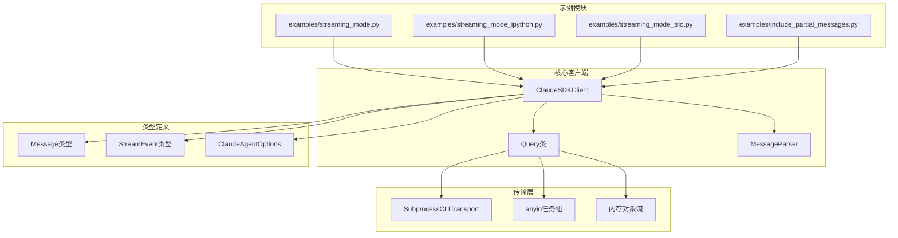

**图表来源**
- [examples/streaming_mode.py:1-512](file://examples/streaming_mode.py#L1-L512)
- [src/claude_agent_sdk/client.py:21-500](file://src/claude_agent_sdk/client.py#L21-L500)
- [src/claude_agent_sdk/_internal/query.py:53-679](file://src/claude_agent_sdk/_internal/query.py#L53-L679)

**章节来源**
- [examples/streaming_mode.py:1-512](file://examples/streaming_mode.py#L1-L512)
- [src/claude_agent_sdk/client.py:1-500](file://src/claude_agent_sdk/client.py#L1-L500)

## 核心组件

### ClaudeSDKClient 类

ClaudeSDKClient 是流式处理的核心组件，提供了完整的双向交互能力：

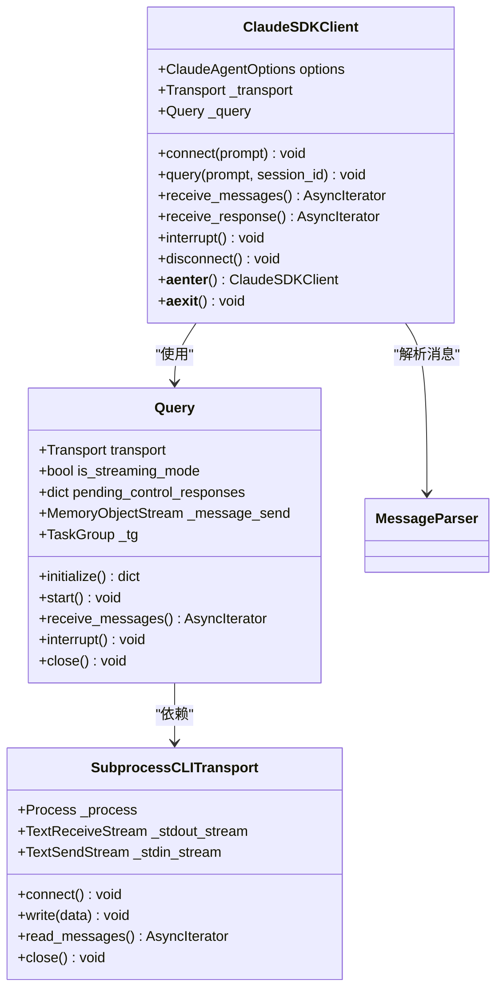

**图表来源**
- [src/claude_agent_sdk/client.py:21-500](file://src/claude_agent_sdk/client.py#L21-L500)
- [src/claude_agent_sdk/_internal/query.py:53-679](file://src/claude_agent_sdk/_internal/query.py#L53-L679)
- [src/claude_agent_sdk/_internal/transport/subprocess_cli.py:33-630](file://src/claude_agent_sdk/_internal/transport/subprocess_cli.py#L33-L630)

ClaudeSDKClient 提供了以下关键功能：
- **双向通信**：支持实时发送和接收消息
- **状态保持**：维护对话上下文跨消息传递
- **交互控制**：支持中断和会话管理
- **异步支持**：兼容 asyncio 和 trio 等异步框架

**章节来源**
- [src/claude_agent_sdk/client.py:21-500](file://src/claude_agent_sdk/client.py#L21-L500)

### 消息类型系统

SDK 定义了完整的消息类型系统，支持各种消息类型的解析和处理：

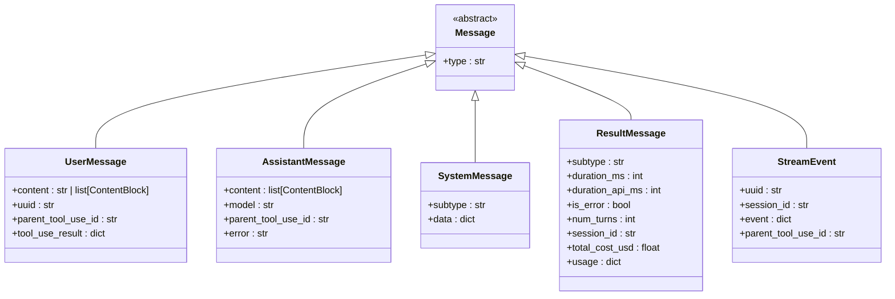

**图表来源**
- [src/claude_agent_sdk/types.py:766-952](file://src/claude_agent_sdk/types.py#L766-L952)

**章节来源**
- [src/claude_agent_sdk/types.py:766-952](file://src/claude_agent_sdk/types.py#L766-L952)

## 架构概览

Claude Agent SDK 的流式处理架构采用分层设计，确保了高可扩展性和可靠性：

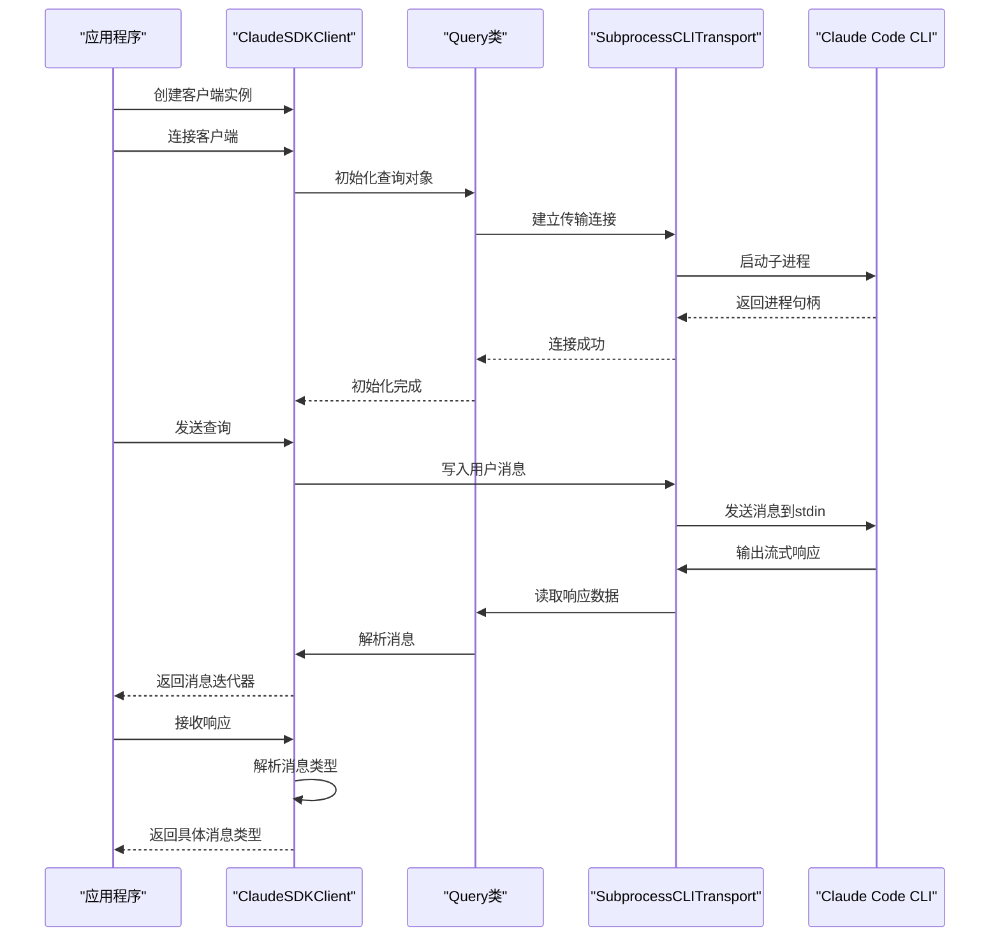

**图表来源**
- [src/claude_agent_sdk/client.py:94-185](file://src/claude_agent_sdk/client.py#L94-L185)
- [src/claude_agent_sdk/_internal/query.py:165-235](file://src/claude_agent_sdk/_internal/query.py#L165-L235)
- [src/claude_agent_sdk/_internal/transport/subprocess_cli.py:335-411](file://src/claude_agent_sdk/_internal/transport/subprocess_cli.py#L335-L411)

## 详细组件分析

### 标准流式模式

标准流式模式是最常用的实现方式，适用于大多数 asyncio 应用场景：

#### 基本流式处理流程

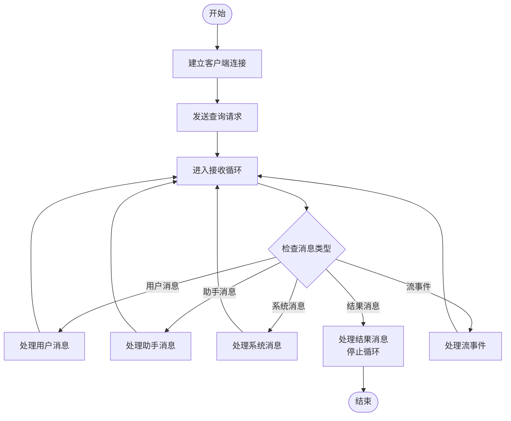

**图表来源**
- [examples/streaming_mode.py:59-71](file://examples/streaming_mode.py#L59-L71)
- [examples/streaming_mode.py:74-94](file://examples/streaming_mode.py#L74-L94)

#### 多轮对话实现

多轮对话是流式处理的重要应用场景，支持上下文保持和状态管理：

**章节来源**
- [examples/streaming_mode.py:74-94](file://examples/streaming_mode.py#L74-L94)

### IPython 集成流式模式

IPython 集成模式专为交互式开发环境设计，提供了简洁的代码片段：

#### 实时显示实现

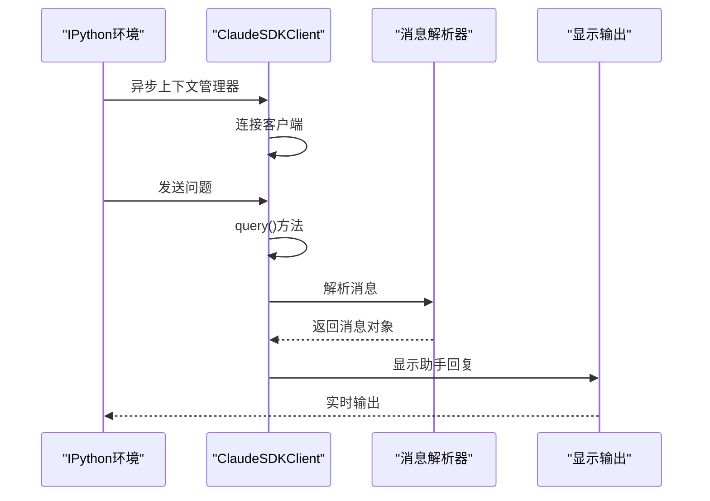

**图表来源**
- [examples/streaming_mode_ipython.py:19-28](file://examples/streaming_mode_ipython.py#L19-L28)

**章节来源**
- [examples/streaming_mode_ipython.py:1-230](file://examples/streaming_mode_ipython.py#L1-L230)

### Trio 异步流式模式

Trio 异步框架提供了更安全的并发编程模型，适用于需要更强并发控制的应用：

#### 任务管理机制

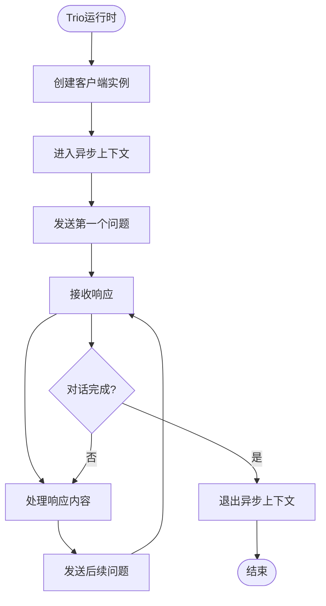

**图表来源**
- [examples/streaming_mode_trio.py:46-77](file://examples/streaming_mode_trio.py#L46-L77)

**章节来源**
- [examples/streaming_mode_trio.py:1-81](file://examples/streaming_mode_trio.py#L1-L81)

### 部分消息包含示例

部分消息流式处理允许应用程序在完整响应生成之前接收增量更新：

#### 流事件处理机制

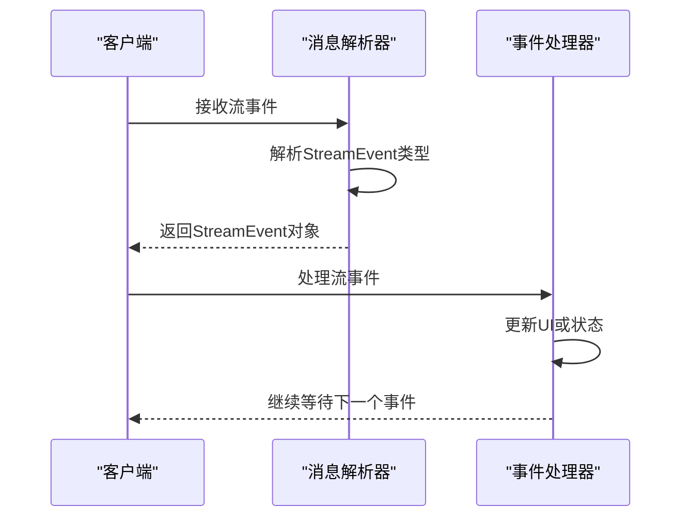

**图表来源**
- [examples/include_partial_messages.py:28-57](file://examples/include_partial_messages.py#L28-L57)
- [src/claude_agent_sdk/_internal/message_parser.py:211-222](file://src/claude_agent_sdk/_internal/message_parser.py#L211-L222)

**章节来源**
- [examples/include_partial_messages.py:1-63](file://examples/include_partial_messages.py#L1-L63)

## 依赖关系分析

Claude Agent SDK 的流式处理功能涉及多个层次的依赖关系：

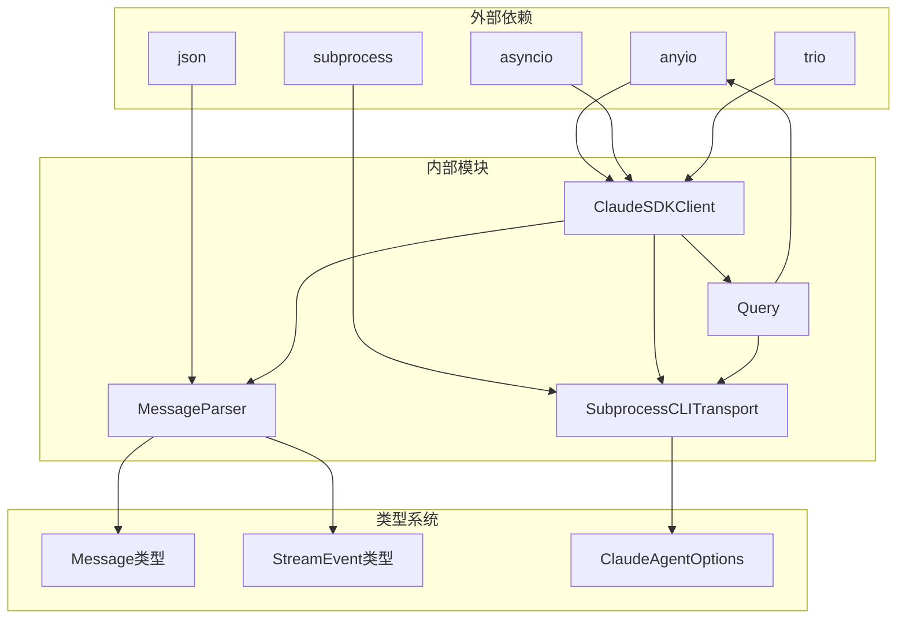

**图表来源**
- [src/claude_agent_sdk/client.py:1-20](file://src/claude_agent_sdk/client.py#L1-L20)
- [src/claude_agent_sdk/_internal/query.py:1-26](file://src/claude_agent_sdk/_internal/query.py#L1-L26)
- [src/claude_agent_sdk/_internal/transport/subprocess_cli.py:1-25](file://src/claude_agent_sdk/_internal/transport/subprocess_cli.py#L1-L25)

### 数据流处理机制

流式数据处理的核心在于高效的数据缓冲和实时更新：

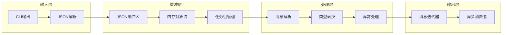

**图表来源**
- [src/claude_agent_sdk/_internal/transport/subprocess_cli.py:515-571](file://src/claude_agent_sdk/_internal/transport/subprocess_cli.py#L515-L571)
- [src/claude_agent_sdk/_internal/query.py:104-118](file://src/claude_agent_sdk/_internal/query.py#L104-L118)
- [src/claude_agent_sdk/_internal/message_parser.py:29-51](file://src/claude_agent_sdk/_internal/message_parser.py#L29-L51)

**章节来源**
- [src/claude_agent_sdk/_internal/transport/subprocess_cli.py:515-571](file://src/claude_agent_sdk/_internal/transport/subprocess_cli.py#L515-L571)
- [src/claude_agent_sdk/_internal/query.py:104-118](file://src/claude_agent_sdk/_internal/query.py#L104-L118)
- [src/claude_agent_sdk/_internal/message_parser.py:29-51](file://src/claude_agent_sdk/_internal/message_parser.py#L29-L51)

## 性能考虑

### 缓冲机制优化

Claude Agent SDK 采用了多层缓冲机制来优化流式处理性能：

1. **JSON 缓冲区**：防止长行截断导致的解析错误
2. **内存对象流**：限制最大缓冲大小避免内存溢出
3. **任务组管理**：并发处理多个消息流

### 并发处理策略

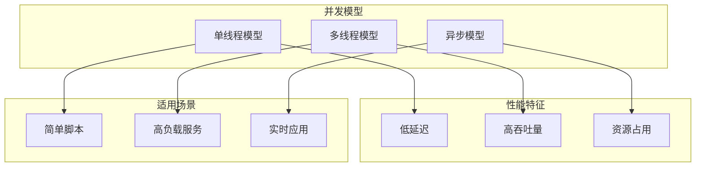

### 最佳实践建议

1. **合理设置缓冲大小**：根据应用场景调整最大缓冲限制
2. **及时清理资源**：确保在异常情况下正确释放资源
3. **监控内存使用**：定期检查内存使用情况避免泄漏
4. **错误处理**：实现完善的异常处理机制

**章节来源**
- [src/claude_agent_sdk/_internal/transport/subprocess_cli.py:29-62](file://src/claude_agent_sdk/_internal/transport/subprocess_cli.py#L29-L62)
- [src/claude_agent_sdk/_internal/query.py:104-118](file://src/claude_agent_sdk/_internal/query.py#L104-L118)

## 故障排除指南

### 常见问题及解决方案

#### 连接问题

| 问题类型 | 可能原因 | 解决方案 |
|---------|---------|---------|
| CLI未找到 | 路径配置错误 | 检查CLAUDE_CODE_PATH环境变量 |
| 版本不兼容 | CLI版本过低 | 升级到支持的版本 |
| 权限不足 | 文件权限问题 | 检查工作目录权限 |
| 超时错误 | 网络连接问题 | 检查网络配置 |

#### 流式处理问题

| 问题类型 | 可能原因 | 解决方案 |
|---------|---------|---------|
| 消息丢失 | 缓冲区溢出 | 增加缓冲大小限制 |
| 处理延迟 | 解析开销过大 | 优化消息解析逻辑 |
| 内存泄漏 | 资源未正确释放 | 检查异步上下文管理 |

**章节来源**
- [tests/test_streaming_client.py:1040-1115](file://tests/test_streaming_client.py#L1040-L1115)

### 调试技巧

1. **启用详细日志**：使用调试模式查看详细的处理过程
2. **监控资源使用**：定期检查内存和CPU使用情况
3. **单元测试**：编写针对性的单元测试验证功能
4. **集成测试**：在真实环境中测试流式处理性能

## 结论

Claude Agent SDK 的流式处理功能为开发者提供了强大而灵活的实时数据处理能力。通过标准流式模式、IPython 集成模式、Trio 异步模式和部分消息包含示例，开发者可以根据具体需求选择最适合的实现方式。

关键优势包括：
- **多框架支持**：兼容 asyncio、trio 等主流异步框架
- **高性能设计**：优化的缓冲机制和并发处理策略
- **类型安全**：完整的类型系统确保代码质量
- **易于集成**：简洁的API设计便于快速集成

对于需要实现实时交互应用的开发者，Claude Agent SDK 提供了可靠的基础设施，可以轻松构建从简单聊天机器人到复杂 AI 辅助工具的各种应用场景。