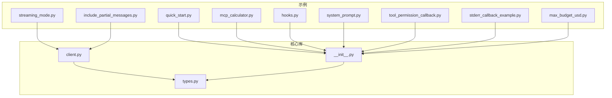
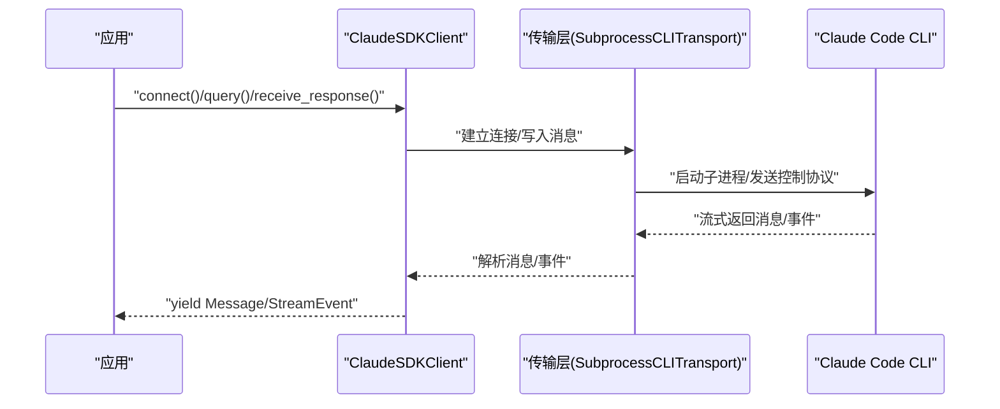
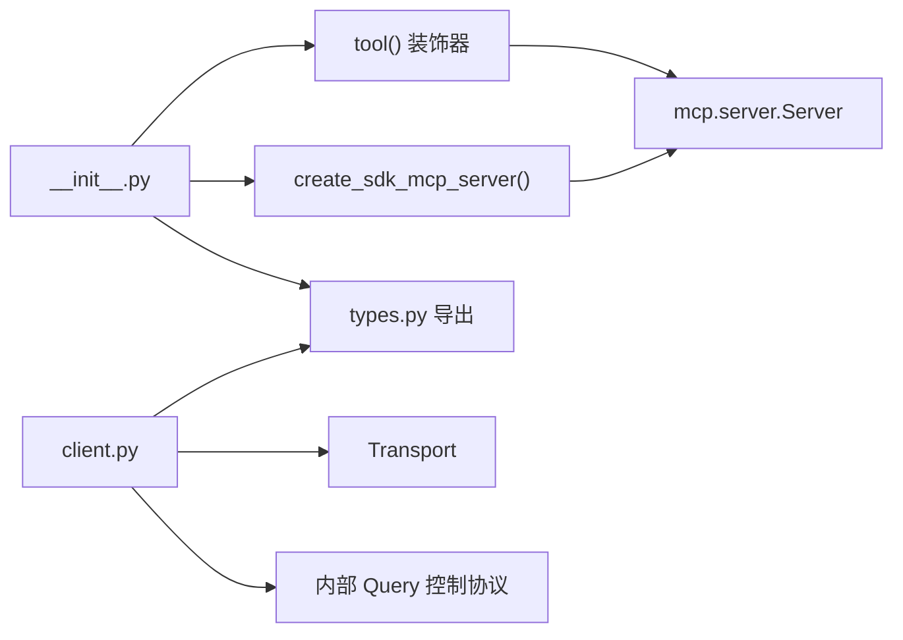

# 示例与最佳实践

<cite>
**本文引用的文件**
- [README.md](file://README.md)
- [CLAUDE.md](file://CLAUDE.md)
- [src/claude_agent_sdk/__init__.py](file://src/claude_agent_sdk/__init__.py)
- [src/claude_agent_sdk/client.py](file://src/claude_agent_sdk/client.py)
- [src/claude_agent_sdk/types.py](file://src/claude_agent_sdk/types.py)
- [examples/quick_start.py](file://examples/quick_start.py)
- [examples/streaming_mode.py](file://examples/streaming_mode.py)
- [examples/mcp_calculator.py](file://examples/mcp_calculator.py)
- [examples/hooks.py](file://examples/hooks.py)
- [examples/system_prompt.py](file://examples/system_prompt.py)
- [examples/tool_permission_callback.py](file://examples/tool_permission_callback.py)
- [examples/stderr_callback_example.py](file://examples/stderr_callback_example.py)
- [examples/include_partial_messages.py](file://examples/include_partial_messages.py)
- [examples/max_budget_usd.py](file://examples/max_budget_usd.py)
</cite>

## 目录
1. [简介](#简介)
2. [项目结构](#项目结构)
3. [核心组件](#核心组件)
4. [架构总览](#架构总览)
5. [详细组件分析](#详细组件分析)
6. [依赖关系分析](#依赖关系分析)
7. [性能考量](#性能考量)
8. [故障排查指南](#故障排查指南)
9. [结论](#结论)
10. [附录：模板与配置清单](#附录模板与配置清单)

## 简介
本指南系统整理 Claude Agent SDK 的示例与最佳实践，覆盖从入门到进阶的完整用法，包括一次性查询、交互式会话、自定义工具（SDK MCP 服务器）、钩子（Hooks）控制、权限回调、部分消息流、预算控制、错误处理与调试等主题。文档提供可直接使用的模板与配置清单，并解释不同使用模式的优缺点与选择标准。

## 项目结构
- 核心包位于 src/claude_agent_sdk，包含对外导出、类型定义、客户端与内部传输层。
- 示例位于 examples/，按功能分门别类，便于对照学习与复用。
- README 提供安装、快速开始、类型说明与错误处理指引；CLAUDE.md 提供开发工作流与目录结构说明。

图表来源
- [examples/quick_start.py:1-77](file://examples/quick_start.py#L1-L77)
- [examples/streaming_mode.py:1-512](file://examples/streaming_mode.py#L1-L512)
- [examples/mcp_calculator.py:1-194](file://examples/mcp_calculator.py#L1-L194)
- [examples/hooks.py:1-351](file://examples/hooks.py#L1-L351)
- [examples/system_prompt.py:1-87](file://examples/system_prompt.py#L1-L87)
- [examples/tool_permission_callback.py:1-159](file://examples/tool_permission_callback.py#L1-L159)
- [examples/stderr_callback_example.py:1-44](file://examples/stderr_callback_example.py#L1-L44)
- [examples/include_partial_messages.py:1-63](file://examples/include_partial_messages.py#L1-L63)
- [examples/max_budget_usd.py:1-96](file://examples/max_budget_usd.py#L1-L96)
- [src/claude_agent_sdk/__init__.py:1-445](file://src/claude_agent_sdk/__init__.py#L1-L445)
- [src/claude_agent_sdk/client.py:1-500](file://src/claude_agent_sdk/client.py#L1-L500)
- [src/claude_agent_sdk/types.py:1-800](file://src/claude_agent_sdk/types.py#L1-L800)

章节来源
- [README.md:1-360](file://README.md#L1-L360)
- [CLAUDE.md:1-28](file://CLAUDE.md#L1-L28)

## 核心组件
- 对外导出与装饰器
  - 工具装饰器与 SDK MCP 服务器创建函数，支持在进程内运行自定义工具，避免外部进程 IPC 开销。
  - 类型导出与版本信息，统一暴露给用户。
- 客户端 ClaudeSDKClient
  - 支持双向交互、流式消息、中断、权限模式切换、模型切换、任务停止、MCP 服务器状态查询与重连、文件回滚等。
- 类型系统
  - 消息类型、内容块、权限与钩子输入输出、MCP 服务器配置与状态、沙箱设置、会话管理等。

章节来源
- [src/claude_agent_sdk/__init__.py:1-445](file://src/claude_agent_sdk/__init__.py#L1-L445)
- [src/claude_agent_sdk/client.py:1-500](file://src/claude_agent_sdk/client.py#L1-L500)
- [src/claude_agent_sdk/types.py:1-800](file://src/claude_agent_sdk/types.py#L1-L800)

## 架构总览
SDK 将 Python 应用与 Claude Code CLI 通过子进程传输层连接，支持：
- 一次性查询（query）：适合简单、无状态任务。
- 交互式客户端（ClaudeSDKClient）：适合多轮对话、实时控制、工具调用与钩子拦截。

图表来源
- [src/claude_agent_sdk/client.py:94-180](file://src/claude_agent_sdk/client.py#L94-L180)
- [src/claude_agent_sdk/__init__.py:1-445](file://src/claude_agent_sdk/__init__.py#L1-L445)

## 详细组件分析

### 组件一：一次性查询（query）
- 设计思路
  - 面向“一次性、无状态”场景，返回异步迭代器，逐条产出消息。
  - 支持 ClaudeAgentOptions 控制系统提示词、工具白名单、工作目录、预算等。
- 实现要点
  - 使用选项对象配置工具许可、系统提示、环境变量、最大轮次等。
  - 在迭代中识别 AssistantMessage/ResultMessage 等类型，提取文本或成本信息。
- 适用场景
  - 批处理、脚本化、无需上下文延续的任务。
- 最佳实践
  - 对于需要工具的场景，显式配置 allowed_tools 或 disallowed_tools，避免默认全开带来的风险。
  - 使用 max_budget_usd 控制成本，结合 ResultMessage.subtype 判断是否超预算。
- 参考示例
  - 快速开始、系统提示词、预算控制等。

章节来源
- [README.md:33-84](file://README.md#L33-L84)
- [examples/quick_start.py:1-77](file://examples/quick_start.py#L1-L77)
- [examples/system_prompt.py:1-87](file://examples/system_prompt.py#L1-L87)
- [examples/max_budget_usd.py:1-96](file://examples/max_budget_usd.py#L1-L96)

### 组件二：交互式客户端（ClaudeSDKClient）
- 设计思路
  - 维护会话状态，支持多轮对话、并发收发、中断、权限模式切换、模型切换、任务停止、MCP 状态查询与重连。
- 关键流程
  - 连接阶段：校验 can_use_tool 与 permission_prompt_tool_name 的互斥；自动注入控制协议；初始化 Query。
  - 流式消息：receive_messages/receive_response 解析消息，支持中断与控制命令。
  - MCP 管理：查询状态、重连失败服务器、启用/禁用服务器。
- 适用场景
  - 聊天界面、调试探索、实时协作、复杂工具编排。
- 最佳实践
  - 使用 streaming 模式以启用中断与控制协议；确保消费消息以使中断生效。
  - 合理设置 CLAUDE_CODE_STREAM_CLOSE_TIMEOUT 环境变量以平衡初始化等待时间。
- 参考示例
  - 流式模式综合示例、中断演示、错误处理、MCP 状态查询。

章节来源
- [src/claude_agent_sdk/client.py:94-180](file://src/claude_agent_sdk/client.py#L94-L180)
- [examples/streaming_mode.py:1-512](file://examples/streaming_mode.py#L1-L512)

### 组件三：自定义工具（SDK MCP 服务器）
- 设计思路
  - 使用 @tool 装饰器定义工具，create_sdk_mcp_server 创建进程内 MCP 服务器，直接调用 Python 函数，避免 IPC。
- 实现要点
  - 输入模式：字典映射、TypedDict、JSON Schema；返回内容为文本或图片列表。
  - 权限：通过 allowed_tools 预授权，减少权限弹窗；也可使用 can_use_tool 回调动态决策。
- 适用场景
  - 需要高性能、低延迟、与应用状态强耦合的工具。
- 最佳实践
  - 将工具名称设计为 mcp__<server>__<tool> 形式，便于在 allowed_tools 中精确授权。
  - 对危险操作（如文件写入、网络访问）进行输入校验与路径限制。
- 参考示例
  - 计算器工具集、MCP 状态查询与重连。

章节来源
- [src/claude_agent_sdk/__init__.py:111-340](file://src/claude_agent_sdk/__init__.py#L111-L340)
- [examples/mcp_calculator.py:1-194](file://examples/mcp_calculator.py#L1-L194)
- [examples/streaming_mode.py:385-416](file://examples/streaming_mode.py#L385-L416)

### 组件四：钩子（Hooks）
- 设计思路
  - 在 Claude 应用侧而非 Claude 侧触发，用于拦截与控制工具使用、会话生命周期、通知等。
- 实现要点
  - HookMatcher 匹配器支持按工具名或事件类型；支持超时；回调返回同步/异步输出结构。
  - 常见事件：PreToolUse、PostToolUse、PostToolUseFailure、UserPromptSubmit、Stop、SubagentStart/Stop、PermissionRequest、Notification。
- 适用场景
  - 安全策略、合规审计、自动化反馈、上下文增强。
- 最佳实践
  - PreToolUse 用于阻断高危命令；PostToolUse 用于记录与告警；UserPromptSubmit 用于注入上下文。
  - 使用 permissionDecision/decision 字段明确控制意图，配合 reason/systemMessage 提供反馈。
- 参考示例
  - 阻断特定 Bash 命令、添加自定义指令、审查工具输出、严格审批写入、错误时停止执行。

章节来源
- [src/claude_agent_sdk/types.py:160-452](file://src/claude_agent_sdk/types.py#L160-L452)
- [examples/hooks.py:1-351](file://examples/hooks.py#L1-L351)

### 组件五：工具权限回调（can_use_tool）
- 设计思路
  - 在工具调用前由 can_use_tool 回调决定允许/拒绝，并可修改输入参数。
- 实现要点
  - 与 streaming 模式配合使用；与 permission_prompt_tool_name 互斥；可结合 PermissionUpdate 建议权限变更。
- 适用场景
  - 动态权限控制、输入净化与重定向、未知工具的人机确认。
- 最佳实践
  - 对系统目录写入、危险 Bash 命令进行严格检查；对非信任路径写入进行重定向至安全目录。
- 参考示例
  - 读写/编辑/多编辑/查找/归档/命令工具的权限控制与输入改写。

章节来源
- [examples/tool_permission_callback.py:1-159](file://examples/tool_permission_callback.py#L1-L159)
- [src/claude_agent_sdk/types.py:124-157](file://src/claude_agent_sdk/types.py#L124-L157)

### 组件六：部分消息流（include_partial_messages）
- 设计思路
  - 允许在完整响应完成前接收增量更新，适用于实时 UI、进度监控与早期结果。
- 实现要点
  - 需 CLI 支持；消息流中混杂 StreamEvent 与常规消息；需在 receive_response 中区分处理。
- 适用场景
  - 实时聊天、长文本生成预览、工具使用进度展示。
- 最佳实践
  - 明确开启 include_partial_messages 并设置合理 max_turns 与模型参数。
- 参考示例
  - 部分消息流示例。

章节来源
- [examples/include_partial_messages.py:1-63](file://examples/include_partial_messages.py#L1-L63)

### 组件七：预算控制（max_budget_usd）
- 设计思路
  - 在每次 API 调用完成后检查累计费用，超过阈值时终止并标记 subtype。
- 实现要点
  - 结合 ResultMessage.subtype 判断是否超预算；最终费用可能略高于阈值（一个调用的量级）。
- 适用场景
  - 生产环境成本控制、批处理上限保护。
- 最佳实践
  - 为简单查询设置合理预算；对复杂任务预留缓冲；结合日志与告警。
- 参考示例
  - 不同预算下的行为对比。

章节来源
- [examples/max_budget_usd.py:1-96](file://examples/max_budget_usd.py#L1-L96)

### 组件八：错误处理与调试
- 错误类型
  - 基础异常与 CLI 相关异常：找不到 CLI、连接失败、进程错误、JSON 解析失败等。
- 调试技巧
  - 使用 stderr 回调捕获 CLI 输出；开启 debug-to-stderr；在 streaming 模式下消费消息以启用中断。
- 参考示例
  - 错误处理示例、stderr 回调示例。

章节来源
- [README.md:247-269](file://README.md#L247-L269)
- [examples/streaming_mode.py:421-464](file://examples/streaming_mode.py#L421-L464)
- [examples/stderr_callback_example.py:1-44](file://examples/stderr_callback_example.py#L1-L44)

## 依赖关系分析
- 外部依赖
  - mcp.server 与 mcp.types：SDK MCP 服务器注册与工具签名。
- 内部依赖
  - __init__.py 导出工具装饰器、SDK MCP 服务器创建函数与类型。
  - client.py 依赖 Transport 与内部 Query 控制协议。
  - types.py 定义消息、权限、钩子、MCP 服务器配置与状态等类型。

图表来源
- [src/claude_agent_sdk/__init__.py:111-340](file://src/claude_agent_sdk/__init__.py#L111-L340)
- [src/claude_agent_sdk/client.py:94-180](file://src/claude_agent_sdk/client.py#L94-L180)
- [src/claude_agent_sdk/types.py:1-800](file://src/claude_agent_sdk/types.py#L1-L800)

章节来源
- [src/claude_agent_sdk/__init__.py:1-445](file://src/claude_agent_sdk/__init__.py#L1-L445)
- [src/claude_agent_sdk/client.py:1-500](file://src/claude_agent_sdk/client.py#L1-L500)
- [src/claude_agent_sdk/types.py:1-800](file://src/claude_agent_sdk/types.py#L1-L800)

## 性能考量
- SDK MCP 服务器
  - 优点：无 IPC 开销、部署简单、调试方便、类型安全。
  - 注意：与应用同进程，异常可能影响主流程；工具数量与复杂度需评估内存与 CPU。
- 流式模式
  - 优点：支持中断、实时控制、细粒度进度。
  - 注意：需持续消费消息以启用中断；合理设置超时与缓冲。
- 工具权限
  - 通过 allowed_tools 预授权可减少权限弹窗与等待；can_use_tool 回调建议在必要时使用，避免过度阻塞。
- 预算控制
  - 在批处理中尽早发现超支，减少无效调用。

## 故障排查指南
- 连接问题
  - 症状：无法连接 CLI。
  - 排查：确认 CLI 是否安装、路径是否正确；查看 CLINotFoundError/CLIConnectionError。
- 中断无效
  - 症状：调用 interrupt() 无响应。
  - 排查：确保处于 streaming 模式且正在消费消息；检查环境变量 CLAUDE_CODE_STREAM_CLOSE_TIMEOUT。
- 工具未被调用
  - 症状：工具未出现或被阻断。
  - 排查：核对 allowed_tools 名称格式（mcp__<server>__<tool>）；检查 can_use_tool 与 permission_prompt_tool_name 的互斥；查看 Hooks 的 PreToolUse 决策。
- 预算超支
  - 症状：最终状态为 error_max_budget_usd。
  - 排查：适当提高预算或拆分任务；关注 ResultMessage.subtype 与 total_cost_usd。
- MCP 服务器断连
  - 症状：get_mcp_status 显示 failed。
  - 排查：使用 reconnect_mcp_server 或 toggle_mcp_server 修复；检查服务器配置与网络。

章节来源
- [README.md:247-269](file://README.md#L247-L269)
- [src/claude_agent_sdk/client.py:385-416](file://src/claude_agent_sdk/client.py#L385-L416)
- [examples/streaming_mode.py:421-464](file://examples/streaming_mode.py#L421-L464)

## 结论
- 一次性查询适合简单、无状态任务；交互式客户端适合复杂、实时、可控制的场景。
- SDK MCP 服务器提供高性能、易调试的工具扩展能力；Hooks 与权限回调共同构建安全可控的执行边界。
- 结合预算控制、部分消息流与完善的错误处理，可在生产环境中稳定运行。

## 附录：模板与配置清单

### 模板一：基础一次性查询
- 步骤
  - 导入 query 与 ClaudeAgentOptions。
  - 配置 system_prompt、max_turns、allowed_tools 等。
  - 异步遍历消息，提取文本或成本。
- 参考路径
  - [examples/quick_start.py:15-73](file://examples/quick_start.py#L15-L73)

### 模板二：交互式客户端（多轮对话 + 中断）
- 步骤
  - 使用 ClaudeSDKClient 上下文管理器。
  - query 发送消息；receive_response 获取完整响应；interrupt 触发中断。
- 参考路径
  - [examples/streaming_mode.py:59-174](file://examples/streaming_mode.py#L59-L174)

### 模板三：SDK MCP 服务器（计算器）
- 步骤
  - 使用 @tool 定义多个工具；create_sdk_mcp_server 创建服务器；在 options.mcp_servers 中注册；在 allowed_tools 中授权。
- 参考路径
  - [examples/mcp_calculator.py:138-194](file://examples/mcp_calculator.py#L138-L194)

### 模板四：钩子（PreToolUse 阻断危险命令）
- 步骤
  - 定义 HookMatcher 与回调；在 options.hooks 中注册；在回调中设置 permissionDecision 与 reason。
- 参考路径
  - [examples/hooks.py:156-193](file://examples/hooks.py#L156-L193)

### 模板五：工具权限回调（动态决策）
- 步骤
  - 实现 can_use_tool 回调；根据工具类型与输入决定允许/拒绝或修改输入；注意与 permission_prompt_tool_name 的互斥。
- 参考路径
  - [examples/tool_permission_callback.py:26-94](file://examples/tool_permission_callback.py#L26-L94)

### 模板六：部分消息流（实时 UI）
- 步骤
  - 设置 include_partial_messages；在 receive_response 中区分普通消息与 StreamEvent。
- 参考路径
  - [examples/include_partial_messages.py:28-57](file://examples/include_partial_messages.py#L28-L57)

### 模板七：预算控制（批处理防护）
- 步骤
  - 设置 max_budget_usd；在 ResultMessage.subtype 中判断是否超支；记录 total_cost_usd。
- 参考路径
  - [examples/max_budget_usd.py:15-96](file://examples/max_budget_usd.py#L15-L96)

### 模板八：调试与日志（stderr 回调）
- 步骤
  - 在 ClaudeAgentOptions 中设置 stderr 回调与 debug-to-stderr；在回调中过滤与记录关键信息。
- 参考路径
  - [examples/stderr_callback_example.py:8-41](file://examples/stderr_callback_example.py#L8-L41)