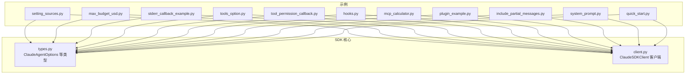
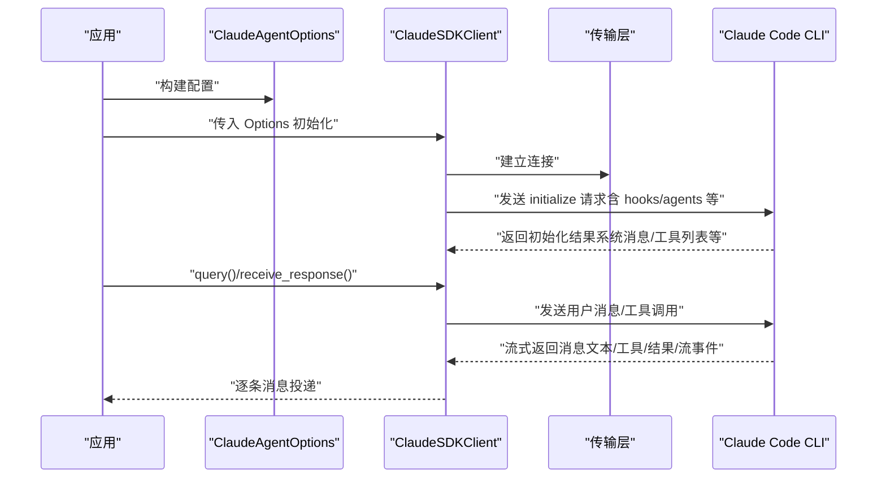
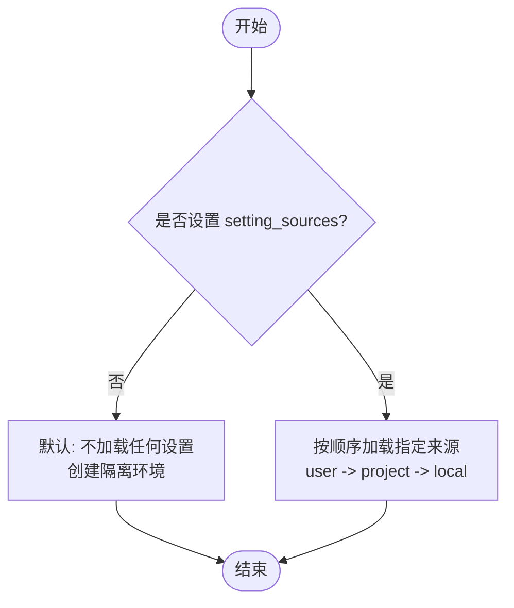
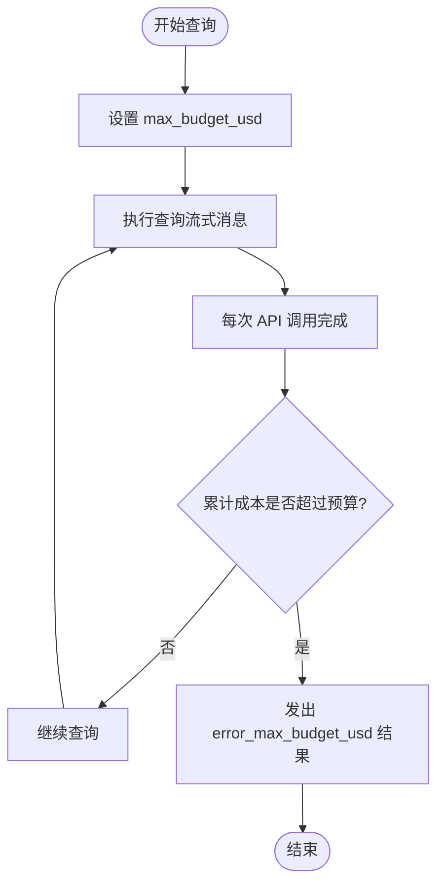
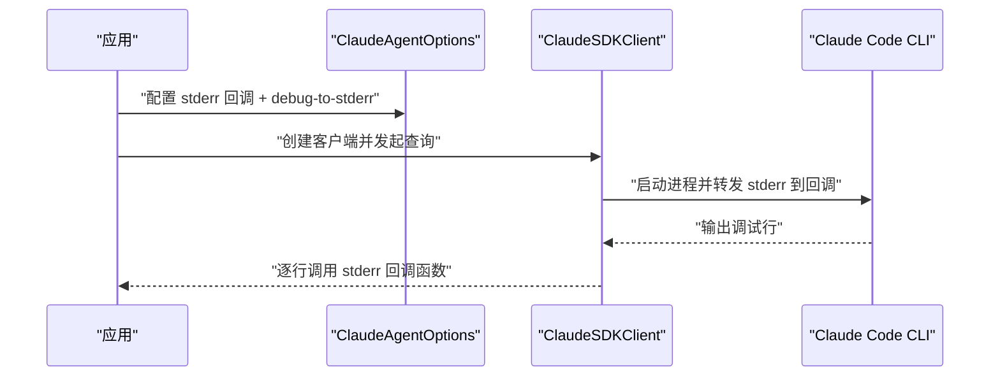
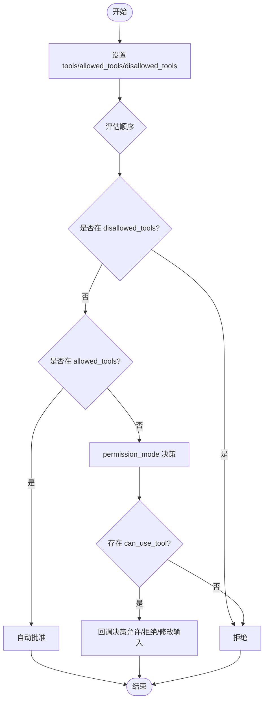
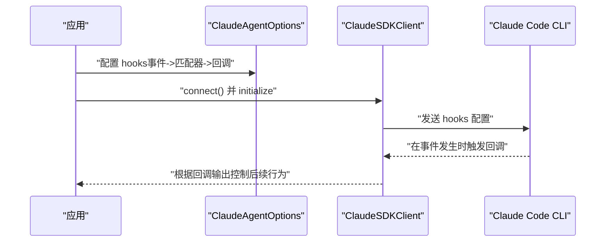
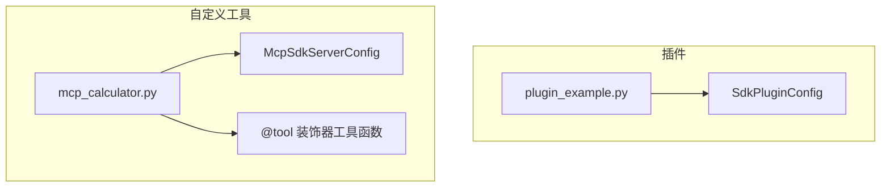
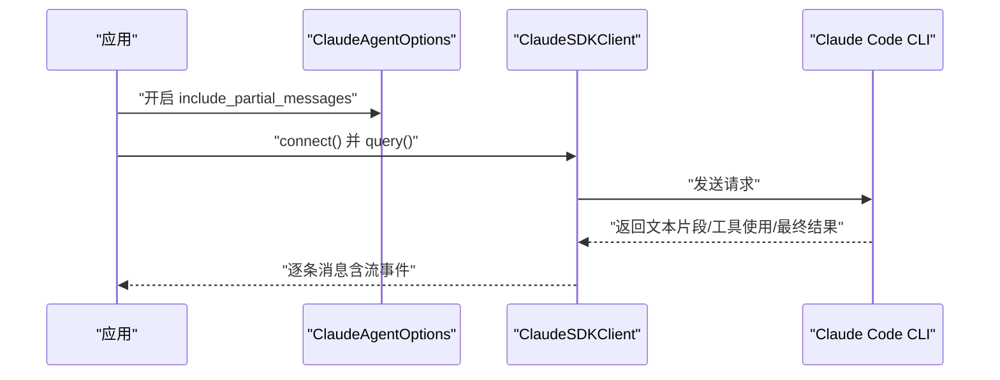
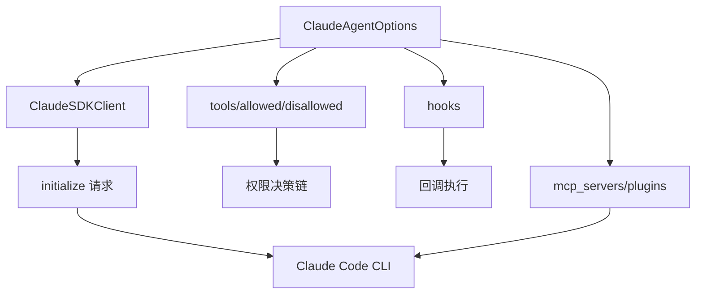

# 配置与定制示例

<cite>
**本文档引用的文件**
- [examples/setting_sources.py](file://examples/setting_sources.py)
- [examples/max_budget_usd.py](file://examples/max_budget_usd.py)
- [examples/stderr_callback_example.py](file://examples/stderr_callback_example.py)
- [examples/tools_option.py](file://examples/tools_option.py)
- [examples/tool_permission_callback.py](file://examples/tool_permission_callback.py)
- [examples/hooks.py](file://examples/hooks.py)
- [src/claude_agent_sdk/types.py](file://src/claude_agent_sdk/types.py)
- [src/claude_agent_sdk/client.py](file://src/claude_agent_sdk/client.py)
- [examples/mcp_calculator.py](file://examples/mcp_calculator.py)
- [examples/plugin_example.py](file://examples/plugin_example.py)
- [examples/include_partial_messages.py](file://examples/include_partial_messages.py)
- [examples/system_prompt.py](file://examples/system_prompt.py)
- [examples/quick_start.py](file://examples/quick_start.py)
- [README.md](file://README.md)
</cite>

## 目录
1. [简介](#简介)
2. [项目结构](#项目结构)
3. [核心组件](#核心组件)
4. [架构总览](#架构总览)
5. [详细组件分析](#详细组件分析)
6. [依赖分析](#依赖分析)
7. [性能考虑](#性能考虑)
8. [故障排除指南](#故障排除指南)
9. [结论](#结论)
10. [附录](#附录)

## 简介
本章节聚焦于 Claude Agent SDK 的“配置与定制示例”，系统性展示如何通过 ClaudeAgentOptions 对 SDK 进行灵活配置，覆盖以下关键主题：
- 设置源（setting_sources）：隔离环境与按需加载用户/项目/本地配置
- 最大预算（max_budget_usd）：成本控制与超支检测
- 标准错误回调（stderr 回调）：捕获 CLI 调试输出，辅助问题定位
- 工具选项（tools/allowed_tools/disallowed_tools）：工具集裁剪与权限策略
- 工具权限回调（can_use_tool）：动态授权与输入修改
- 钩子（hooks）：在关键生命周期点拦截与控制行为
- 插件与自定义工具（plugins/mcp_servers）：扩展命令与工具生态
- 部分消息流（include_partial_messages）：实时响应与进度反馈
- 系统提示（system_prompt）：默认提示与预设扩展

这些配置适用于企业级应用对精细化控制的需求，包括预算控制、错误处理、日志记录与工具管理的完整解决方案。

## 项目结构
围绕“配置与定制示例”的相关文件组织如下：
- 示例脚本位于 examples/ 下，每个脚本演示一个或多个配置项
- 类型定义与客户端实现位于 src/claude_agent_sdk/ 下
- README 提供总体使用说明与最佳实践指引

图表来源
- [examples/setting_sources.py:1-174](file://examples/setting_sources.py#L1-L174)
- [examples/max_budget_usd.py:1-96](file://examples/max_budget_usd.py#L1-L96)
- [examples/stderr_callback_example.py:1-44](file://examples/stderr_callback_example.py#L1-L44)
- [examples/tools_option.py:1-112](file://examples/tools_option.py#L1-L112)
- [examples/tool_permission_callback.py:1-159](file://examples/tool_permission_callback.py#L1-L159)
- [examples/hooks.py:1-351](file://examples/hooks.py#L1-L351)
- [examples/mcp_calculator.py:1-194](file://examples/mcp_calculator.py#L1-L194)
- [examples/plugin_example.py:1-72](file://examples/plugin_example.py#L1-L72)
- [examples/include_partial_messages.py:1-63](file://examples/include_partial_messages.py#L1-L63)
- [examples/system_prompt.py:1-87](file://examples/system_prompt.py#L1-L87)
- [examples/quick_start.py:1-77](file://examples/quick_start.py#L1-L77)
- [src/claude_agent_sdk/types.py:1029-1199](file://src/claude_agent_sdk/types.py#L1029-L1199)
- [src/claude_agent_sdk/client.py:1-500](file://src/claude_agent_sdk/client.py#L1-L500)

章节来源
- [README.md:1-360](file://README.md#L1-L360)

## 核心组件
- ClaudeAgentOptions：所有配置入口，涵盖工具、权限、预算、模型、钩子、MCP 服务器、插件、工作目录、调试输出等
- ClaudeSDKClient：交互式客户端，支持双向对话、中断、会话管理、MCP 服务器启停与状态查询
- 类型系统：系统提示、工具预设、钩子事件、MCP 服务器配置、沙箱设置、插件配置等

章节来源
- [src/claude_agent_sdk/types.py:1029-1199](file://src/claude_agent_sdk/types.py#L1029-L1199)
- [src/claude_agent_sdk/client.py:21-500](file://src/claude_agent_sdk/client.py#L21-L500)

## 架构总览
下图展示了 SDK 的配置与执行路径：应用通过 ClaudeAgentOptions 指定行为，ClaudeSDKClient 建立与 CLI 的连接，传输初始化请求，随后进入消息循环；在工具使用、钩子触发、MCP 服务器交互等环节，配置项决定具体行为。

图表来源
- [src/claude_agent_sdk/client.py:94-180](file://src/claude_agent_sdk/client.py#L94-L180)
- [src/claude_agent_sdk/types.py:1115-1199](file://src/claude_agent_sdk/types.py#L1115-L1199)

## 详细组件分析

### 设置源（setting_sources）示例
- 目标：控制从用户、项目、本地等不同来源加载配置，实现隔离或组合加载
- 关键点：
  - setting_sources=None（默认）：不加载任何设置，创建隔离环境
  - setting_sources=["user"]：仅加载用户级设置
  - setting_sources=["user","project"]：合并用户与项目设置
- 使用场景：CI 环境隔离、团队共享默认配置、项目特定命令覆盖
- 影响范围：系统消息中的 slash 命令、插件、代理等配置

图表来源
- [examples/setting_sources.py:1-174](file://examples/setting_sources.py#L1-L174)

章节来源
- [examples/setting_sources.py:1-174](file://examples/setting_sources.py#L1-L174)
- [src/claude_agent_sdk/types.py:24-24](file://src/claude_agent_sdk/types.py#L24-L24)

### 最大预算（max_budget_usd）示例
- 目标：限制单次查询或会话的累计消费，防止意外超支
- 关键点：
  - max_budget_usd=float：以美元为单位的上限
  - 预算检查发生在每次 API 调用完成后，最终可能略高于设定值（最多一个调用的差额）
  - 当超过预算时，结果消息 subtype 会携带 error_max_budget_usd
- 使用场景：成本敏感任务、批量处理预算控制、合规审计
- 影响范围：ResultMessage 中的 total_cost_usd 与 subtype

图表来源
- [examples/max_budget_usd.py:1-96](file://examples/max_budget_usd.py#L1-L96)

章节来源
- [examples/max_budget_usd.py:1-96](file://examples/max_budget_usd.py#L1-L96)
- [src/claude_agent_sdk/types.py:1041-1041](file://src/claude_agent_sdk/types.py#L1041-L1041)

### 标准错误回调（stderr 回调）示例
- 目标：捕获 CLI 的 stderr 输出，用于调试与监控
- 关键点：
  - stderr=Callable[[str], None]：接收每行 stderr 文本
  - 可结合 extra_args={"debug-to-stderr": None} 启用 CLI 调试输出
- 使用场景：开发调试、生产问题排查、自动化日志采集
- 影响范围：CLI 子进程的标准错误流

图表来源
- [examples/stderr_callback_example.py:1-44](file://examples/stderr_callback_example.py#L1-L44)
- [src/claude_agent_sdk/types.py:1060-1060](file://src/claude_agent_sdk/types.py#L1060-L1060)

章节来源
- [examples/stderr_callback_example.py:1-44](file://examples/stderr_callback_example.py#L1-L44)
- [src/claude_agent_sdk/types.py:1053-1060](file://src/claude_agent_sdk/types.py#L1053-L1060)

### 工具选项（tools/allowed_tools/disallowed_tools）示例
- 目标：精确控制可用工具集合与权限策略
- 关键点：
  - tools：数组（名称列表）、空数组（禁用内置工具）、预设（preset）
  - allowed_tools：白名单，自动批准；未列出的工具走 permission_mode 或 can_use_tool
  - disallowed_tools：黑名单，优先于 allowed_tools
- 使用场景：最小权限原则、安全加固、功能裁剪
- 影响范围：系统消息 init 中的 tools 列表、工具调用决策链

图表来源
- [examples/tools_option.py:1-112](file://examples/tools_option.py#L1-L112)
- [examples/tool_permission_callback.py:1-159](file://examples/tool_permission_callback.py#L1-L159)
- [src/claude_agent_sdk/types.py:1033-1042](file://src/claude_agent_sdk/types.py#L1033-L1042)
- [src/claude_agent_sdk/types.py:1047-1063](file://src/claude_agent_sdk/types.py#L1047-L1063)

章节来源
- [examples/tools_option.py:1-112](file://examples/tools_option.py#L1-L112)
- [examples/tool_permission_callback.py:1-159](file://examples/tool_permission_callback.py#L1-L159)
- [src/claude_agent_sdk/types.py:1033-1063](file://src/claude_agent_sdk/types.py#L1033-L1063)

### 钩子（hooks）示例
- 目标：在关键生命周期点注入控制逻辑（如 PreToolUse、PostToolUse、UserPromptSubmit 等）
- 关键点：
  - hooks: dict[HookEvent, list[HookMatcher]]
  - HookMatcher: matcher（工具名/正则）、hooks（回调列表）、timeout
  - 回调可返回同步输出（控制继续/停止、附加上下文、权限决策等）
- 使用场景：安全策略、审计留痕、流程编排、错误阻断
- 影响范围：工具使用前后、会话开始、用户提交提示等

图表来源
- [examples/hooks.py:1-351](file://examples/hooks.py#L1-L351)
- [src/claude_agent_sdk/types.py:160-473](file://src/claude_agent_sdk/types.py#L160-L473)

章节来源
- [examples/hooks.py:1-351](file://examples/hooks.py#L1-L351)
- [src/claude_agent_sdk/types.py:160-473](file://src/claude_agent_sdk/types.py#L160-L473)

### 插件与自定义工具（plugins/mcp_servers）
- 插件（plugins）：加载本地插件，提供自定义命令与资源
- 自定义工具（mcp_servers）：通过 SDK 内嵌 MCP 服务器提供工具，无需外部进程
- 使用场景：企业内部工具集成、快速原型、简化部署
- 影响范围：系统消息 init 中的插件信息、工具可用性

图表来源
- [examples/plugin_example.py:1-72](file://examples/plugin_example.py#L1-L72)
- [examples/mcp_calculator.py:1-194](file://examples/mcp_calculator.py#L1-L194)
- [src/claude_agent_sdk/types.py:642-650](file://src/claude_agent_sdk/types.py#L642-L650)
- [src/claude_agent_sdk/types.py:519-529](file://src/claude_agent_sdk/types.py#L519-L529)

章节来源
- [examples/plugin_example.py:1-72](file://examples/plugin_example.py#L1-L72)
- [examples/mcp_calculator.py:1-194](file://examples/mcp_calculator.py#L1-L194)
- [src/claude_agent_sdk/types.py:642-650](file://src/claude_agent_sdk/types.py#L642-L650)
- [src/claude_agent_sdk/types.py:519-529](file://src/claude_agent_sdk/types.py#L519-L529)

### 部分消息流（include_partial_messages）
- 目标：在流式响应中接收增量更新，提升实时性与可观测性
- 关键点：
  - include_partial_messages=True：启用流事件（StreamEvent）
  - 与 ResultMessage、AssistantMessage、SystemMessage 等混合出现
- 使用场景：实时 UI、进度监控、早期结果展示
- 影响范围：消息流的丰富度与解析复杂度

图表来源
- [examples/include_partial_messages.py:1-63](file://examples/include_partial_messages.py#L1-L63)
- [src/claude_agent_sdk/types.py:889-896](file://src/claude_agent_sdk/types.py#L889-L896)

章节来源
- [examples/include_partial_messages.py:1-63](file://examples/include_partial_messages.py#L1-L63)
- [src/claude_agent_sdk/types.py:889-896](file://src/claude_agent_sdk/types.py#L889-L896)

### 系统提示（system_prompt）
- 目标：定制 Claude 的行为风格与上下文
- 关键点：
  - system_prompt=str：直接字符串
  - system_prompt={"type":"preset","preset":"claude_code","append": "..."}：基于默认提示扩展
- 使用场景：角色扮演、风格约束、领域增强
- 影响范围：初始化阶段注入到系统消息

章节来源
- [examples/system_prompt.py:1-87](file://examples/system_prompt.py#L1-L87)
- [src/claude_agent_sdk/types.py:27-40](file://src/claude_agent_sdk/types.py#L27-L40)

## 依赖分析
- ClaudeAgentOptions 是所有配置的根节点，被 ClaudeSDKClient 在 connect/initialize 阶段读取并传递给 CLI
- 工具与权限链路：disallowed_tools > allowed_tools > permission_mode > can_use_tool
- 钩子链路：事件类型 -> 匹配器 -> 回调 -> 同步/异步输出
- MCP 服务器与插件作为外部扩展，通过 mcp_servers/plugins 注入

图表来源
- [src/claude_agent_sdk/client.py:165-180](file://src/claude_agent_sdk/client.py#L165-L180)
- [src/claude_agent_sdk/types.py:1033-1066](file://src/claude_agent_sdk/types.py#L1033-L1066)

章节来源
- [src/claude_agent_sdk/client.py:94-180](file://src/claude_agent_sdk/client.py#L94-L180)
- [src/claude_agent_sdk/types.py:1033-1066](file://src/claude_agent_sdk/types.py#L1033-L1066)

## 性能考虑
- 流式模式与部分消息流：减少等待时间，但增加消息解析复杂度
- MCP 服务器内嵌：避免 IPC 开销，提升工具调用性能
- 预算控制：及时终止昂贵操作，降低整体成本
- 日志与调试：stderr 回调与 debug-to-stderr 有助于定位瓶颈，但会带来额外 IO

## 故障排除指南
- 预算超支：关注 ResultMessage.subtype 是否为 error_max_budget_usd，并记录 total_cost_usd
- 权限问题：确认 disallowed_tools/allowed_tools/permission_mode/can_use_tool 的组合是否符合预期
- 钩子异常：检查 HookMatcher.timeout 与回调返回结构，确保字段命名正确（如 permissionDecision）
- MCP 服务器失败：使用 get_mcp_status() 获取状态，必要时 toggle_mcp_server/reconnect_mcp_server
- CLI 未找到/连接失败：捕获对应错误类型并引导安装或路径修正

章节来源
- [examples/max_budget_usd.py:70-77](file://examples/max_budget_usd.py#L70-L77)
- [examples/hooks.py:138-154](file://examples/hooks.py#L138-L154)
- [src/claude_agent_sdk/client.py:385-416](file://src/claude_agent_sdk/client.py#L385-L416)

## 结论
通过 ClaudeAgentOptions 与 ClaudeSDKClient 的组合，企业级应用可以实现对设置源、预算、工具、权限、钩子、MCP 服务器与插件的全面控制。上述示例提供了从零到一的配置路径，建议在生产环境中：
- 明确设置源策略，确保环境隔离与配置可控
- 设定 max_budget_usd 并配套告警
- 使用 stderr 回调与日志体系进行可观测性建设
- 采用最小权限原则与 can_use_tool 动态授权
- 通过 hooks 实现业务规则与审计留痕
- 以 SDK 内嵌 MCP 服务器简化部署与提升性能

## 附录
- 快速开始与基础用法参考：[examples/quick_start.py:1-77](file://examples/quick_start.py#L1-L77)
- 系统提示配置参考：[examples/system_prompt.py:1-87](file://examples/system_prompt.py#L1-L87)
- 部分消息流参考：[examples/include_partial_messages.py:1-63](file://examples/include_partial_messages.py#L1-L63)
- 插件加载参考：[examples/plugin_example.py:1-72](file://examples/plugin_example.py#L1-L72)
- 自定义工具（MCP 计算器）参考：[examples/mcp_calculator.py:1-194](file://examples/mcp_calculator.py#L1-L194)