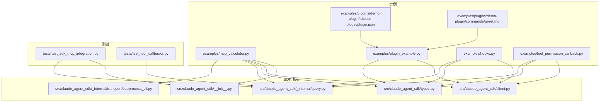
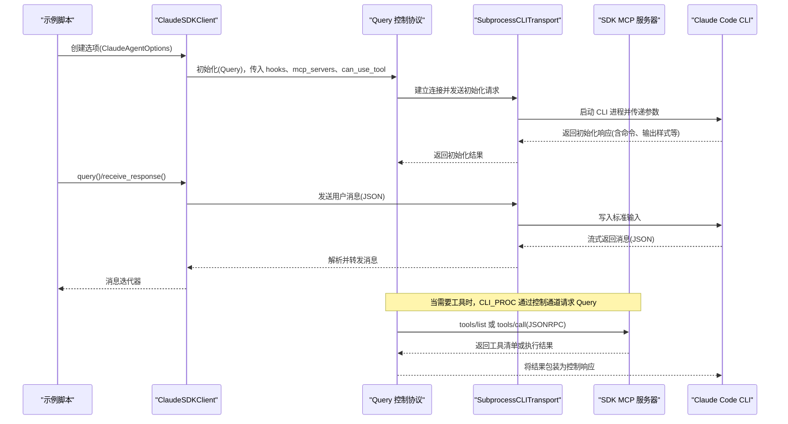
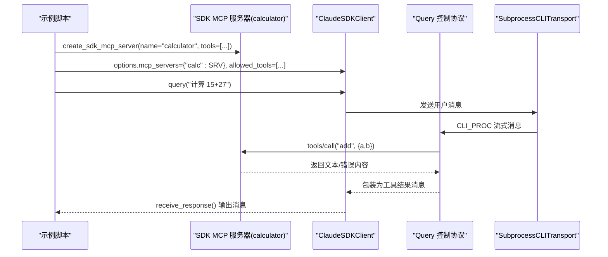
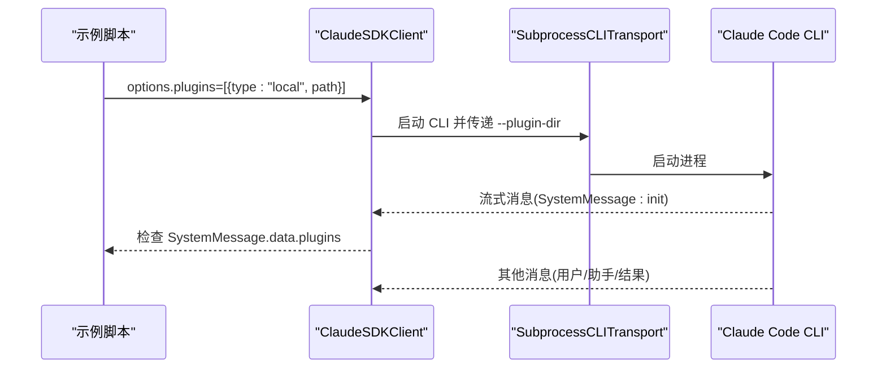
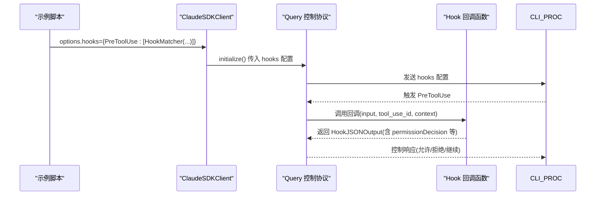
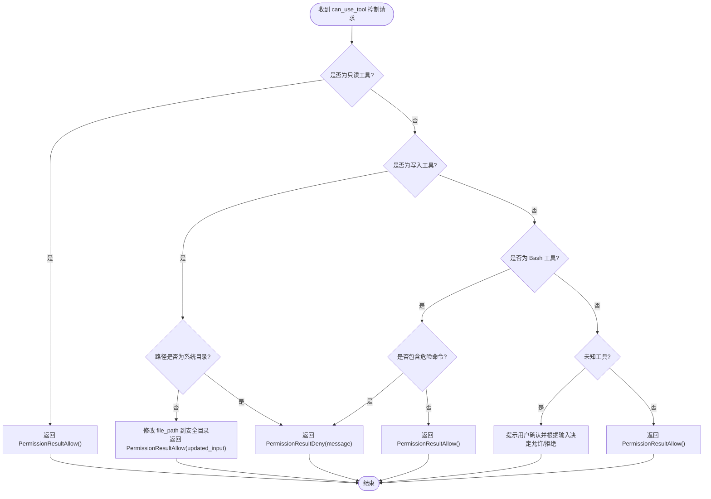
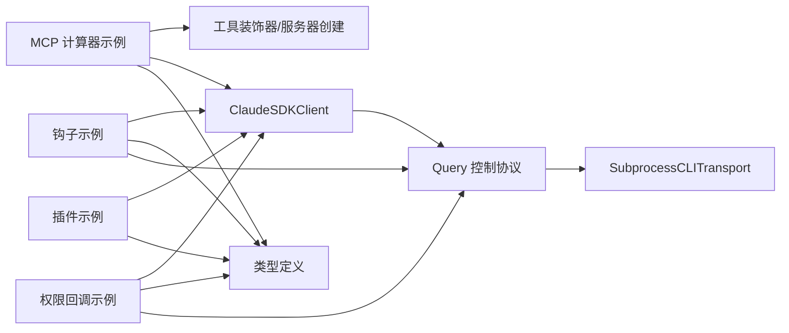

# 高级示例

<cite>
**本文引用的文件**
- [examples/mcp_calculator.py](file://examples/mcp_calculator.py)
- [examples/plugin_example.py](file://examples/plugin_example.py)
- [examples/hooks.py](file://examples/hooks.py)
- [examples/tool_permission_callback.py](file://examples/tool_permission_callback.py)
- [src/claude_agent_sdk/__init__.py](file://src/claude_agent_sdk/__init__.py)
- [src/claude_agent_sdk/client.py](file://src/claude_agent_sdk/client.py)
- [src/claude_agent_sdk/types.py](file://src/claude_agent_sdk/types.py)
- [src/claude_agent_sdk/_internal/query.py](file://src/claude_agent_sdk/_internal/query.py)
- [src/claude_agent_sdk/_internal/transport/subprocess_cli.py](file://src/claude_agent_sdk/_internal/transport/subprocess_cli.py)
- [examples/plugins/demo-plugin/.claude-plugin/plugin.json](file://examples/plugins/demo-plugin/.claude-plugin/plugin.json)
- [examples/plugins/demo-plugin/commands/greet.md](file://examples/plugins/demo-plugin/commands/greet.md)
- [tests/test_sdk_mcp_integration.py](file://tests/test_sdk_mcp_integration.py)
- [tests/test_tool_callbacks.py](file://tests/test_tool_callbacks.py)
</cite>

## 目录
1. [简介](#简介)
2. [项目结构](#项目结构)
3. [核心组件](#核心组件)
4. [架构总览](#架构总览)
5. [详细组件分析](#详细组件分析)
6. [依赖分析](#依赖分析)
7. [性能考虑](#性能考虑)
8. [故障排查指南](#故障排查指南)
9. [结论](#结论)
10. [附录](#附录)

## 简介
本章面向有经验的开发者，系统讲解 Claude Agent SDK 的高级能力与复杂用法，涵盖以下主题：
- MCP 计算器示例：演示如何在进程中创建自定义 MCP 工具服务器，并通过 SDK 注册与调用。
- 插件系统示例：展示如何加载本地插件，验证其生效并通过系统消息查看插件信息。
- 钩子系统示例：演示多种事件钩子（PreToolUse、PostToolUse、UserPromptSubmit 等）的配置与行为控制。
- 工具权限回调示例：演示如何通过 can_use_tool 回调对工具调用进行细粒度控制、输入修改与策略建议。

本章不仅提供完整示例与配置说明，还深入解析 SDK 内部实现（如 Query 控制协议、SubprocessCLITransport 传输层），帮助读者理解端到端数据流与扩展点。

## 项目结构
高级示例位于 examples 目录，核心 SDK 实现位于 src/claude_agent_sdk 及其内部模块。下图展示了与高级示例直接相关的文件与模块关系：

**图表来源**
- [examples/mcp_calculator.py:1-194](file://examples/mcp_calculator.py#L1-L194)
- [examples/plugin_example.py:1-72](file://examples/plugin_example.py#L1-L72)
- [examples/hooks.py:1-351](file://examples/hooks.py#L1-L351)
- [examples/tool_permission_callback.py:1-159](file://examples/tool_permission_callback.py#L1-L159)
- [src/claude_agent_sdk/__init__.py:111-340](file://src/claude_agent_sdk/__init__.py#L111-L340)
- [src/claude_agent_sdk/client.py:21-500](file://src/claude_agent_sdk/client.py#L21-L500)
- [src/claude_agent_sdk/types.py:1-800](file://src/claude_agent_sdk/types.py#L1-L800)
- [src/claude_agent_sdk/_internal/query.py:53-679](file://src/claude_agent_sdk/_internal/query.py#L53-L679)
- [src/claude_agent_sdk/_internal/transport/subprocess_cli.py:33-630](file://src/claude_agent_sdk/_internal/transport/subprocess_cli.py#L33-L630)
- [tests/test_sdk_mcp_integration.py:1-382](file://tests/test_sdk_mcp_integration.py#L1-L382)
- [tests/test_tool_callbacks.py:1-773](file://tests/test_tool_callbacks.py#L1-L773)

**章节来源**
- [examples/mcp_calculator.py:1-194](file://examples/mcp_calculator.py#L1-L194)
- [examples/plugin_example.py:1-72](file://examples/plugin_example.py#L1-L72)
- [examples/hooks.py:1-351](file://examples/hooks.py#L1-L351)
- [examples/tool_permission_callback.py:1-159](file://examples/tool_permission_callback.py#L1-L159)

## 核心组件
- MCP 工具装饰器与服务器创建：通过 @tool 装饰器定义工具，create_sdk_mcp_server 创建进程内 MCP 服务器，注册 list_tools 与 call_tool 处理器。
- ClaudeSDKClient：提供双向交互、会话管理、权限模式切换、模型切换、MCP 服务器状态查询与重连等能力。
- Query 控制协议：负责与 Claude Code CLI 的控制通道通信，处理 can_use_tool 权限请求、hook 回调、SDK MCP 请求桥接。
- SubprocessCLITransport：封装 CLI 进程生命周期、标准输入输出读写、错误处理与版本检查。
- 钩子系统：以 HookMatcher 为单位配置不同事件（PreToolUse、PostToolUse、UserPromptSubmit 等）的匹配规则与回调函数。
- 工具权限回调：通过 can_use_tool 在工具执行前进行决策、输入修改与策略建议，支持异步与同步两种模式。

**章节来源**
- [src/claude_agent_sdk/__init__.py:111-340](file://src/claude_agent_sdk/__init__.py#L111-L340)
- [src/claude_agent_sdk/client.py:21-500](file://src/claude_agent_sdk/client.py#L21-L500)
- [src/claude_agent_sdk/_internal/query.py:53-679](file://src/claude_agent_sdk/_internal/query.py#L53-L679)
- [src/claude_agent_sdk/_internal/transport/subprocess_cli.py:33-630](file://src/claude_agent_sdk/_internal/transport/subprocess_cli.py#L33-L630)
- [src/claude_agent_sdk/types.py:160-800](file://src/claude_agent_sdk/types.py#L160-L800)

## 架构总览
下图展示了从示例到 SDK 内部组件的端到端调用链路，重点体现 MCP 工具、钩子与权限控制的协作关系：

**图表来源**
- [src/claude_agent_sdk/client.py:94-180](file://src/claude_agent_sdk/client.py#L94-L180)
- [src/claude_agent_sdk/_internal/query.py:119-163](file://src/claude_agent_sdk/_internal/query.py#L119-L163)
- [src/claude_agent_sdk/_internal/transport/subprocess_cli.py:335-411](file://src/claude_agent_sdk/_internal/transport/subprocess_cli.py#L335-L411)
- [src/claude_agent_sdk/_internal/query.py:394-531](file://src/claude_agent_sdk/_internal/query.py#L394-L531)

## 详细组件分析

### MCP 计算器示例
该示例演示了如何在进程中创建一个计算器 MCP 服务器，注册加减乘除、平方根与幂运算等工具，并通过 ClaudeSDKClient 与 allowed_tools 预授权列表进行调用。

- 工具定义与装饰器：使用 @tool 定义工具名称、描述与输入模式；create_sdk_mcp_server 自动注册 list_tools 与 call_tool 处理器。
- 服务器配置：通过 McpSdkServerConfig 将服务器实例注入 ClaudeAgentOptions.mcp_servers，并在 allowed_tools 中预授权所有计算器工具。
- 客户端交互：使用 ClaudeSDKClient.query 与 receive_response 接收流式消息，显示用户、助手与工具结果。

**图表来源**
- [examples/mcp_calculator.py:138-194](file://examples/mcp_calculator.py#L138-L194)
- [src/claude_agent_sdk/__init__.py:178-340](file://src/claude_agent_sdk/__init__.py#L178-L340)
- [src/claude_agent_sdk/_internal/query.py:394-531](file://src/claude_agent_sdk/_internal/query.py#L394-L531)

**章节来源**
- [examples/mcp_calculator.py:1-194](file://examples/mcp_calculator.py#L1-L194)
- [src/claude_agent_sdk/__init__.py:111-340](file://src/claude_agent_sdk/__init__.py#L111-L340)
- [tests/test_sdk_mcp_integration.py:21-98](file://tests/test_sdk_mcp_integration.py#L21-L98)

### 插件系统示例
该示例展示了如何加载本地插件目录，使插件中的自定义命令（如 /greet）在会话中可用，并通过系统消息查看插件加载情况。

- 插件配置：通过 ClaudeAgentOptions.plugins 指定本地插件路径（type: "local"）。
- 系统消息检查：监听 SystemMessage，查找 data.plugins 字段确认插件已加载。
- 插件元数据与命令：插件目录下的 plugin.json 提供插件基本信息，commands/*.md 定义可执行命令。

**图表来源**
- [examples/plugin_example.py:23-67](file://examples/plugin_example.py#L23-L67)
- [src/claude_agent_sdk/_internal/transport/subprocess_cli.py:283-289](file://src/claude_agent_sdk/_internal/transport/subprocess_cli.py#L283-L289)

**章节来源**
- [examples/plugin_example.py:1-72](file://examples/plugin_example.py#L1-L72)
- [examples/plugins/demo-plugin/.claude-plugin/plugin.json:1-9](file://examples/plugins/demo-plugin/.claude-plugin/plugin.json#L1-L9)
- [examples/plugins/demo-plugin/commands/greet.md:1-6](file://examples/plugins/demo-plugin/commands/greet.md#L1-L6)

### 钩子系统示例
该示例集中演示了多种钩子事件的配置与行为控制，包括：
- PreToolUse：在工具调用前进行拦截与决策（允许/拒绝/修改输入），支持 additionalContext、permissionDecision 等字段。
- PostToolUse：在工具调用后进行审查与反馈，支持 updatedMCPToolOutput、additionalContext 等。
- UserPromptSubmit：在用户提交提示时追加上下文。
- 组合控制：通过 continue_、stopReason、systemMessage 等字段控制后续流程。

**图表来源**
- [examples/hooks.py:156-193](file://examples/hooks.py#L156-L193)
- [examples/hooks.py:218-240](file://examples/hooks.py#L218-L240)
- [examples/hooks.py:279-301](file://examples/hooks.py#L279-L301)
- [src/claude_agent_sdk/_internal/query.py:288-346](file://src/claude_agent_sdk/_internal/query.py#L288-L346)

**章节来源**
- [examples/hooks.py:1-351](file://examples/hooks.py#L1-L351)
- [src/claude_agent_sdk/types.py:160-453](file://src/claude_agent_sdk/types.py#L160-L453)
- [tests/test_tool_callbacks.py:212-460](file://tests/test_tool_callbacks.py#L212-L460)

### 工具权限回调示例
该示例演示如何通过 can_use_tool 回调对工具调用进行细粒度控制，包括：
- 自动放行只读工具（Read/Glob/Grep）
- 拒绝写入系统目录（Write/Edit/MultiEdit）
- 重定向写入到安全目录并修改输入
- 拦截危险 Bash 命令
- 对未知工具进行用户确认

**图表来源**
- [examples/tool_permission_callback.py:26-94](file://examples/tool_permission_callback.py#L26-L94)
- [src/claude_agent_sdk/_internal/query.py:245-287](file://src/claude_agent_sdk/_internal/query.py#L245-L287)

**章节来源**
- [examples/tool_permission_callback.py:1-159](file://examples/tool_permission_callback.py#L1-L159)
- [src/claude_agent_sdk/types.py:124-158](file://src/claude_agent_sdk/types.py#L124-L158)
- [tests/test_tool_callbacks.py:53-210](file://tests/test_tool_callbacks.py#L53-L210)

## 依赖分析
- 示例与 SDK 的耦合点：
  - MCP 计算器示例依赖 @tool 与 create_sdk_mcp_server，以及 ClaudeSDKClient 的 allowed_tools 与 mcp_servers 配置。
  - 插件示例依赖 ClaudeAgentOptions.plugins 与 SubprocessCLITransport 的 --plugin-dir 参数。
  - 钩子示例依赖 HookMatcher 与 Query 的 initialize/hook_callback 控制协议。
  - 权限回调示例依赖 can_use_tool 与 Query 的 can_use_tool 控制协议。
- 内部模块职责：
  - __init__.py：导出工具装饰器、服务器创建器与类型定义。
  - client.py：对外暴露 ClaudeSDKClient，负责连接、消息接收与 MCP 状态查询。
  - query.py：实现控制协议、钩子回调、权限回调与 SDK MCP 请求桥接。
  - subprocess_cli.py：封装 CLI 进程、参数构建与流式读写。

**图表来源**
- [src/claude_agent_sdk/__init__.py:111-340](file://src/claude_agent_sdk/__init__.py#L111-L340)
- [src/claude_agent_sdk/client.py:21-500](file://src/claude_agent_sdk/client.py#L21-L500)
- [src/claude_agent_sdk/_internal/query.py:53-679](file://src/claude_agent_sdk/_internal/query.py#L53-L679)
- [src/claude_agent_sdk/_internal/transport/subprocess_cli.py:33-630](file://src/claude_agent_sdk/_internal/transport/subprocess_cli.py#L33-L630)

**章节来源**
- [src/claude_agent_sdk/__init__.py:1-445](file://src/claude_agent_sdk/__init__.py#L1-L445)
- [src/claude_agent_sdk/client.py:1-500](file://src/claude_agent_sdk/client.py#L1-L500)
- [src/claude_agent_sdk/_internal/query.py:1-679](file://src/claude_agent_sdk/_internal/query.py#L1-L679)
- [src/claude_agent_sdk/_internal/transport/subprocess_cli.py:1-630](file://src/claude_agent_sdk/_internal/transport/subprocess_cli.py#L1-L630)

## 性能考虑
- SDK MCP 服务器运行在应用进程内，避免跨进程通信开销，适合高频工具调用场景。
- ClaudeSDKClient 默认使用流式模式，结合 Query 的等待逻辑与 stdin 关闭策略，减少不必要的阻塞。
- SubprocessCLITransport 对 stdout 缓冲区大小进行限制，防止超大消息导致内存占用过高。
- 钩子与权限回调均为异步回调，注意回调内部的 I/O 与网络操作应尽量异步化，避免阻塞控制通道。

[本节为通用指导，不涉及具体文件分析]

## 故障排查指南
- CLI 版本不兼容：SubprocessCLITransport 在启动时进行版本检查，若低于最低要求会发出警告。请升级 Claude Code CLI 至推荐版本。
- 进程未就绪/已退出：当尝试写入 stdin 时，若进程已退出或不可用，将抛出连接异常。检查 CLI 路径与工作目录设置。
- MCP 服务器状态：使用 ClaudeSDKClient.get_mcp_status() 查看服务器连接状态、工具清单与错误信息，必要时调用 reconnect_mcp_server() 重连。
- 钩子字段名转换：Python SDK 使用 async_ 与 continue_ 避免关键字冲突，最终发送给 CLI 时自动转换为 async 与 continue。确保回调输出字段命名正确。
- 权限回调异常：若 can_use_tool 回调抛出异常，Query 会将其转换为控制错误响应。请在回调中捕获并返回合适的错误信息。

**章节来源**
- [src/claude_agent_sdk/_internal/transport/subprocess_cli.py:587-626](file://src/claude_agent_sdk/_internal/transport/subprocess_cli.py#L587-L626)
- [src/claude_agent_sdk/_internal/transport/subprocess_cli.py:481-506](file://src/claude_agent_sdk/_internal/transport/subprocess_cli.py#L481-L506)
- [src/claude_agent_sdk/client.py:385-416](file://src/claude_agent_sdk/client.py#L385-L416)
- [src/claude_agent_sdk/_internal/query.py:34-51](file://src/claude_agent_sdk/_internal/query.py#L34-L51)
- [tests/test_tool_callbacks.py:176-210](file://tests/test_tool_callbacks.py#L176-L210)

## 结论
通过本章的高级示例，读者可以掌握：
- 如何在进程中快速构建与集成 MCP 工具服务器；
- 如何加载与验证本地插件；
- 如何利用钩子系统对工具生命周期进行精细化控制；
- 如何通过工具权限回调实现安全策略与输入治理。

这些能力共同构成了 Claude Agent SDK 的扩展性基石，既满足复杂业务场景的需求，又保持了清晰的控制流与可观测性。

[本节为总结性内容，不涉及具体文件分析]

## 附录
- 扩展指南
  - 自定义 MCP 工具：使用 @tool 定义工具，支持简单字典模式与 JSON Schema 模式；在 create_sdk_mcp_server 中注册工具。
  - 多服务器混合：在同一会话中同时使用 SDK MCP 服务器与外部 MCP 服务器（stdio/sse/http），通过 mcp_servers 统一配置。
  - 钩子匹配器：使用 HookMatcher 的 matcher 字段按工具名或组合工具名进行匹配，支持 timeout 控制。
  - 权限策略：在 can_use_tool 回调中实现白名单/黑名单、路径重定向、危险命令拦截与用户确认等策略。
  - 插件开发：遵循插件目录结构与 plugin.json 元数据规范，编写 commands/*.md 命令文档，通过本地路径加载。

**章节来源**
- [src/claude_agent_sdk/__init__.py:111-340](file://src/claude_agent_sdk/__init__.py#L111-L340)
- [src/claude_agent_sdk/types.py:475-492](file://src/claude_agent_sdk/types.py#L475-L492)
- [tests/test_sdk_mcp_integration.py:152-174](file://tests/test_sdk_mcp_integration.py#L152-L174)