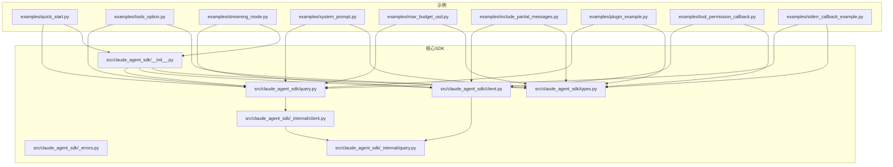
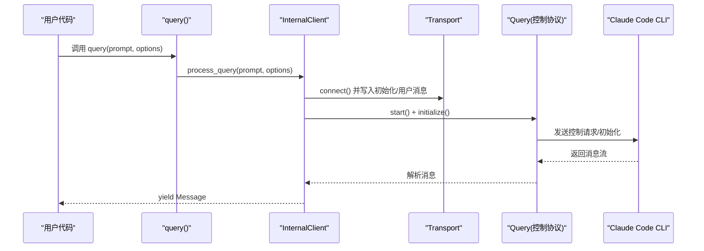
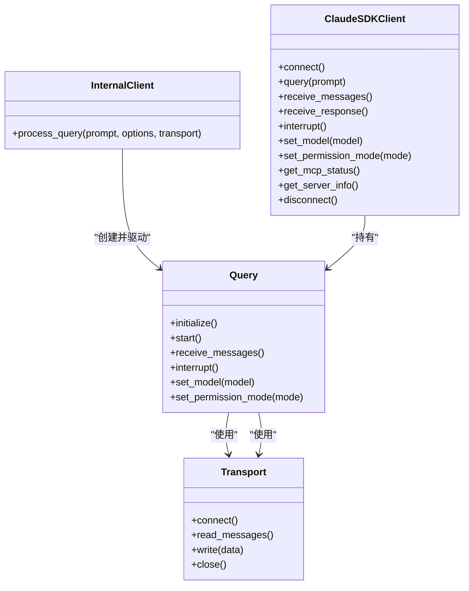

# 基础示例

<cite>
**本文引用的文件**
- [README.md](file://README.md)
- [quick_start.py](file://examples/quick_start.py)
- [tools_option.py](file://examples/tools_option.py)
- [streaming_mode.py](file://examples/streaming_mode.py)
- [system_prompt.py](file://examples/system_prompt.py)
- [max_budget_usd.py](file://examples/max_budget_usd.py)
- [include_partial_messages.py](file://examples/include_partial_messages.py)
- [plugin_example.py](file://examples/plugin_example.py)
- [tool_permission_callback.py](file://examples/tool_permission_callback.py)
- [stderr_callback_example.py](file://examples/stderr_callback_example.py)
- [__init__.py](file://src/claude_agent_sdk/__init__.py)
- [client.py](file://src/claude_agent_sdk/client.py)
- [query.py](file://src/claude_agent_sdk/query.py)
- [types.py](file://src/claude_agent_sdk/types.py)
- [_errors.py](file://src/claude_agent_sdk/_errors.py)
- [_internal/client.py](file://src/claude_agent_sdk/_internal/client.py)
- [_internal/query.py](file://src/claude_agent_sdk/_internal/query.py)
</cite>

## 目录
1. [简介](#简介)
2. [项目结构](#项目结构)
3. [核心组件](#核心组件)
4. [架构总览](#架构总览)
5. [详细组件分析](#详细组件分析)
6. [依赖关系分析](#依赖关系分析)
7. [性能考量](#性能考量)
8. [故障排查指南](#故障排查指南)
9. [结论](#结论)
10. [附录](#附录)

## 简介
本文件面向初学者与一线开发者，系统化讲解 Claude Agent SDK for Python 的“基础示例”，覆盖以下常用场景：
- 简单查询：使用 query() 发送一次性提示词，接收流式消息。
- 带选项的查询：通过 ClaudeAgentOptions 配置系统提示、工具集、预算、插件、工作目录等。
- 工具使用：允许/限制工具、权限回调、MCP 内置服务器与外部服务器混合使用。
- 流式交互：使用 ClaudeSDKClient 进行多轮对话、并发收发、中断、控制协议与错误处理。
- 异步编程与 anyio 运行时：基本概念、运行方式与注意事项。
- 消息流与工具调用：消息类型、内容块、工具使用与结果、部分消息流。
- 最佳实践：代码组织、错误处理、性能优化与安全策略。

## 项目结构
该仓库采用“示例驱动 + 核心 SDK”的组织方式：
- examples/：提供从入门到进阶的一系列可运行示例，涵盖 query()、ClaudeSDKClient、工具、钩子、插件、预算控制、部分消息流等。
- src/claude_agent_sdk/：核心 SDK 实现，包含对外 API（query、ClaudeSDKClient）、类型定义、错误类型、内部客户端与查询类、传输层等。
- README.md：安装、快速开始、基本用法、工具与钩子、类型、错误处理、示例入口等。

图表来源
- [quick_start.py:1-77](file://examples/quick_start.py#L1-L77)
- [tools_option.py:1-112](file://examples/tools_option.py#L1-L112)
- [streaming_mode.py:1-512](file://examples/streaming_mode.py#L1-L512)
- [system_prompt.py:1-87](file://examples/system_prompt.py#L1-L87)
- [max_budget_usd.py:1-96](file://examples/max_budget_usd.py#L1-L96)
- [include_partial_messages.py:1-63](file://examples/include_partial_messages.py#L1-L63)
- [plugin_example.py:1-72](file://examples/plugin_example.py#L1-L72)
- [tool_permission_callback.py:1-159](file://examples/tool_permission_callback.py#L1-L159)
- [stderr_callback_example.py:1-44](file://examples/stderr_callback_example.py#L1-L44)
- [__init__.py:1-445](file://src/claude_agent_sdk/__init__.py#L1-L445)
- [query.py:1-127](file://src/claude_agent_sdk/query.py#L1-L127)
- [client.py:1-500](file://src/claude_agent_sdk/client.py#L1-L500)
- [types.py:1-800](file://src/claude_agent_sdk/types.py#L1-L800)
- [_internal/client.py:1-146](file://src/claude_agent_sdk/_internal/client.py#L1-L146)
- [_internal/query.py:1-200](file://src/claude_agent_sdk/_internal/query.py#L1-L200)

章节来源
- [README.md:1-360](file://README.md#L1-L360)

## 核心组件
- query()：一次性或单向流式查询接口，返回异步迭代器的消息流。适合简单问答、批处理、CI/CD 等无状态场景。
- ClaudeSDKClient：双向、交互式会话客户端，支持多轮对话、并发收发、中断、模型切换、MCP 服务器管理、钩子、任务停止等。
- ClaudeAgentOptions：配置对象，支持系统提示、工具集、预算、插件、工作目录、环境变量、钩子、MCP 服务器、权限模式、沙箱设置等。
- 类型体系：Message 及其子类（UserMessage、AssistantMessage、SystemMessage、ResultMessage），内容块（TextBlock、ToolUseBlock、ToolResultBlock、ThinkingBlock），以及 Hook、MCP、权限、会话等类型。
- 错误类型：CLIConnectionError、CLINotFoundError、ProcessError、CLIJSONDecodeError、MessageParseError 等。

章节来源
- [query.py:1-127](file://src/claude_agent_sdk/query.py#L1-L127)
- [client.py:1-500](file://src/claude_agent_sdk/client.py#L1-L500)
- [types.py:766-800](file://src/claude_agent_sdk/types.py#L766-L800)
- [_errors.py:1-57](file://src/claude_agent_sdk/_errors.py#L1-L57)
- [README.md:33-270](file://README.md#L33-L270)

## 架构总览
SDK 的运行路径分为两类：
- query() 路径：内部创建 InternalClient，选择或创建 Transport，启动 Query 控制协议，发送用户消息，解析并产出消息流。
- ClaudeSDKClient 路径：直接使用 Transport，构造 Query，进入流式初始化，支持 receive_messages/receive_response、interrupt、set_model/set_permission_mode、MCP 状态查询与重连等。

图表来源
- [query.py:115-127](file://src/claude_agent_sdk/query.py#L115-L127)
- [_internal/client.py:44-146](file://src/claude_agent_sdk/_internal/client.py#L44-L146)
- [_internal/query.py:165-200](file://src/claude_agent_sdk/_internal/query.py#L165-L200)

章节来源
- [query.py:1-127](file://src/claude_agent_sdk/query.py#L1-L127)
- [_internal/client.py:1-146](file://src/claude_agent_sdk/_internal/client.py#L1-L146)
- [_internal/query.py:1-200](file://src/claude_agent_sdk/_internal/query.py#L1-L200)

## 详细组件分析

### 示例一：简单查询（query）
- 目标：最短路径体验 SDK，发送一次性提示词，打印助手文本。
- 关键点：
  - 使用 anyio.run/main 包裹异步入口。
  - query() 返回异步迭代器；遍历消息，识别 AssistantMessage，提取 TextBlock 输出。
  - 适合一次性问答、脚本化任务。
- 代码要点路径
  - [examples/quick_start.py:19-24](file://examples/quick_start.py#L19-L24)
  - [src/claude_agent_sdk/query.py:68-73](file://src/claude_agent_sdk/query.py#L68-L73)
- 运行结果
  - 控制台输出助手的自然语言回答。

章节来源
- [quick_start.py:15-25](file://examples/quick_start.py#L15-L25)
- [query.py:68-73](file://src/claude_agent_sdk/query.py#L68-L73)

### 示例二：带选项的查询（系统提示、工具、预算、插件）
- 系统提示
  - 支持字符串、预设（claude_code）及追加内容。
  - 参考：[examples/system_prompt.py:14-56](file://examples/system_prompt.py#L14-L56)
- 工具选项
  - tools 支持数组（指定工具名）、空数组（禁用内置工具）、预设（claude_code）。
  - 参考：[examples/tools_option.py:16-101](file://examples/tools_option.py#L16-L101)
- 预算控制
  - max_budget_usd 用于成本上限，超限会返回特定 subtype。
  - 参考：[examples/max_budget_usd.py:15-77](file://examples/max_budget_usd.py#L15-L77)
- 插件
  - 通过 plugins 列表加载本地插件，系统消息中可查看插件信息。
  - 参考：[examples/plugin_example.py:23-63](file://examples/plugin_example.py#L23-L63)

章节来源
- [system_prompt.py:14-56](file://examples/system_prompt.py#L14-L56)
- [tools_option.py:16-101](file://examples/tools_option.py#L16-L101)
- [max_budget_usd.py:15-77](file://examples/max_budget_usd.py#L15-L77)
- [plugin_example.py:23-63](file://examples/plugin_example.py#L23-L63)

### 示例三：工具使用（权限与回调）
- 允许/禁止工具
  - allowed_tools 与 disallowed_tools、permission_mode 控制工具执行。
  - 参考：[README.md:57-74](file://README.md#L57-L74)
- 工具权限回调
  - can_use_tool 在流式模式下拦截工具调用，允许/拒绝并可修改输入。
  - 参考：[examples/tool_permission_callback.py:26-94](file://examples/tool_permission_callback.py#L26-L94)
- 自定义工具（SDK MCP 服务器）
  - 使用 @tool 定义工具，create_sdk_mcp_server 创建内嵌服务器，配合 allowed_tools 使用。
  - 参考：[README.md:92-135](file://README.md#L92-L135)、[__init__.py:111-176](file://src/claude_agent_sdk/__init__.py#L111-L176)

章节来源
- [README.md:57-74](file://README.md#L57-L74)
- [tool_permission_callback.py:26-94](file://examples/tool_permission_callback.py#L26-L94)
- [__init__.py:111-176](file://src/claude_agent_sdk/__init__.py#L111-L176)

### 示例四：流式交互（ClaudeSDKClient）
- 多轮对话与并发收发
  - 使用 receive_messages/receive_response，后台任务持续消费消息，前台发送多个问题。
  - 参考：[examples/streaming_mode.py:97-131](file://examples/streaming_mode.py#L97-L131)
- 中断能力
  - interrupt() 需要主动消费消息以启用中断处理。
  - 参考：[examples/streaming_mode.py:133-174](file://examples/streaming_mode.py#L133-L174)
- 手动消息处理
  - 自定义逻辑提取语言名称、统计工具使用等。
  - 参考：[examples/streaming_mode.py:176-211](file://examples/streaming_mode.py#L176-L211)
- 自定义选项
  - allowed_tools、system_prompt、env 等。
  - 参考：[examples/streaming_mode.py:213-246](file://examples/streaming_mode.py#L213-L246)
- 异步可迭代提示
  - send_message 接受异步可迭代，分批发送多条消息。
  - 参考：[examples/streaming_mode.py:248-294](file://examples/streaming_mode.py#L248-L294)
- Bash 工具使用
  - 展示 ToolUseBlock 与 ToolResultBlock 的交互。
  - 参考：[examples/streaming_mode.py:296-340](file://examples/streaming_mode.py#L296-L340)
- 控制协议与服务器信息
  - get_server_info() 获取可用命令与输出样式；interrupt() 能力验证。
  - 参考：[examples/streaming_mode.py:342-419](file://examples/streaming_mode.py#L342-L419)
- 错误处理
  - connect()/disconnect()、超时、CLI 连接异常。
  - 参考：[examples/streaming_mode.py:421-465](file://examples/streaming_mode.py#L421-L465)

章节来源
- [streaming_mode.py:97-131](file://examples/streaming_mode.py#L97-L131)
- [streaming_mode.py:133-174](file://examples/streaming_mode.py#L133-L174)
- [streaming_mode.py:176-211](file://examples/streaming_mode.py#L176-L211)
- [streaming_mode.py:213-246](file://examples/streaming_mode.py#L213-L246)
- [streaming_mode.py:248-294](file://examples/streaming_mode.py#L248-L294)
- [streaming_mode.py:296-340](file://examples/streaming_mode.py#L296-L340)
- [streaming_mode.py:342-419](file://examples/streaming_mode.py#L342-L419)
- [streaming_mode.py:421-465](file://examples/streaming_mode.py#L421-L465)

### 示例五：部分消息流（实时 UI、进度监控）
- include_partial_messages=True 启用增量事件，结合 ClaudeSDKClient.receive_response() 观察 StreamEvent 与常规消息交错。
- 参考：[examples/include_partial_messages.py:28-57](file://examples/include_partial_messages.py#L28-L57)

章节来源
- [include_partial_messages.py:28-57](file://examples/include_partial_messages.py#L28-L57)

### 示例六：标准错误捕获（调试）
- stderr 回调与额外参数 debug-to-stderr，便于捕获 CLI 调试输出。
- 参考：[examples/stderr_callback_example.py:8-42](file://examples/stderr_callback_example.py#L8-L42)

章节来源
- [stderr_callback_example.py:8-42](file://examples/stderr_callback_example.py#L8-L42)

### 异步编程与 anyio 运行时
- 基本概念
  - 异步函数（async def）与异步迭代器（AsyncIterator）；await 等待协程完成；事件循环负责调度。
  - anyio 提供统一的异步运行时抽象，支持 asyncio/trio 等后端。
- 运行方式
  - 快速开始示例使用 anyio.run(main) 启动事件循环并运行异步主函数。
  - 参考：[README.md:20-32](file://README.md#L20-L32)、[examples/quick_start.py:75-77](file://examples/quick_start.py#L75-L77)
- 注意事项
  - ClaudeSDKClient 在 v0.0.20 中存在跨运行时上下文限制：实例必须在连接时的同一异步上下文中使用，避免在不同 nursery 或 task group 间复用。
  - 参考：[src/claude_agent_sdk/client.py:53-60](file://src/claude_agent_sdk/client.py#L53-L60)

章节来源
- [README.md:20-32](file://README.md#L20-L32)
- [quick_start.py:75-77](file://examples/quick_start.py#L75-L77)
- [client.py:53-60](file://src/claude_agent_sdk/client.py#L53-L60)

### 消息流与工具调用
- 消息类型
  - UserMessage、AssistantMessage、SystemMessage、ResultMessage；内容块 TextBlock、ToolUseBlock、ToolResultBlock、ThinkingBlock。
- 工具调用流程
  - AssistantMessage 中出现 ToolUseBlock；Claude Code 执行工具后产生 ToolResultBlock；最终 ResultMessage 结束一次响应。
- 参考
  - [types.py:766-800](file://src/claude_agent_sdk/types.py#L766-L800)
  - [examples/streaming_mode.py:296-340](file://examples/streaming_mode.py#L296-L340)

章节来源
- [types.py:766-800](file://src/claude_agent_sdk/types.py#L766-L800)
- [streaming_mode.py:296-340](file://examples/streaming_mode.py#L296-L340)

## 依赖关系分析
- 对外 API
  - __init__.py 导出 query、ClaudeSDKClient、类型、工具装饰器与 MCP 服务器创建函数。
- 内部协作
  - query() 通过 InternalClient 调度 Transport 与 Query；ClaudeSDKClient 直接持有 Query 并暴露 receive_messages/receive_response/interrupt 等。
- 类型与错误
  - types.py 定义消息、内容块、权限、钩子、MCP、沙箱等类型；_errors.py 定义 SDK 错误基类与具体异常。

图表来源
- [_internal/query.py:53-200](file://src/claude_agent_sdk/_internal/query.py#L53-L200)
- [_internal/client.py:44-146](file://src/claude_agent_sdk/_internal/client.py#L44-L146)
- [client.py:94-500](file://src/claude_agent_sdk/client.py#L94-L500)

章节来源
- [__init__.py:1-445](file://src/claude_agent_sdk/__init__.py#L1-L445)
- [_internal/query.py:1-200](file://src/claude_agent_sdk/_internal/query.py#L1-L200)
- [_internal/client.py:1-146](file://src/claude_agent_sdk/_internal/client.py#L1-L146)
- [client.py:1-500](file://src/claude_agent_sdk/client.py#L1-L500)

## 性能考量
- 选择合适的 API
  - 简单、无状态任务优先使用 query()，减少连接与会话管理开销。
  - 需要多轮对话、中断、动态控制时使用 ClaudeSDKClient。
- 流式与部分消息
  - include_partial_messages 可提升感知延迟，但会增加消息数量与解析开销。
- 工具与权限
  - 合理配置 allowed_tools/disallowed_tools 与 permission_mode，避免不必要的工具调用与权限弹窗。
- 资源与超时
  - 设置合理的 initialize 超时与响应超时，避免长时间阻塞。
- 沙箱与网络
  - 按需启用沙箱，仅放行必要网络与文件访问，降低风险与资源消耗。

## 故障排查指南
- 常见错误与处理
  - CLINotFoundError：未找到 Claude Code CLI，检查安装或自定义路径。
  - CLIConnectionError：无法连接 CLI，检查进程状态与权限。
  - ProcessError：CLI 进程失败，查看 exit_code 与 stderr。
  - CLIJSONDecodeError：CLI 输出 JSON 解析失败，检查 CLI 版本与日志。
  - MessageParseError：消息解析失败，检查消息格式与版本兼容性。
- 调试技巧
  - 使用 stderr 回调与 debug-to-stderr 参数收集 CLI 调试输出。
  - 在 ClaudeSDKClient 中使用 get_server_info() 与 get_mcp_status() 获取服务器状态与工具可用性。
  - 对于中断无效的情况，确认已消费消息流以启用中断处理。
- 参考
  - [examples/stderr_callback_example.py:8-42](file://examples/stderr_callback_example.py#L8-L42)
  - [examples/streaming_mode.py:342-419](file://examples/streaming_mode.py#L342-L419)
  - [examples/streaming_mode.py:421-465](file://examples/streaming_mode.py#L421-L465)
  - [_errors.py:1-57](file://src/claude_agent_sdk/_errors.py#L1-L57)

章节来源
- [stderr_callback_example.py:8-42](file://examples/stderr_callback_example.py#L8-L42)
- [streaming_mode.py:342-419](file://examples/streaming_mode.py#L342-L419)
- [streaming_mode.py:421-465](file://examples/streaming_mode.py#L421-L465)
- [_errors.py:1-57](file://src/claude_agent_sdk/_errors.py#L1-L57)

## 结论
通过本指南，你可以：
- 快速掌握 query() 与 ClaudeSDKClient 的基本用法与适用场景。
- 正确配置系统提示、工具集、预算、插件与工作目录等选项。
- 理解消息流与工具调用的生命周期，构建实时 UI 与自动化流程。
- 使用 anyio 运行时编写异步代码，并注意运行时上下文限制。
- 通过错误类型与调试技巧高效定位问题，遵循最佳实践保障性能与安全。

## 附录
- 快速开始参考
  - [README.md:20-32](file://README.md#L20-L32)
  - [examples/quick_start.py:68-77](file://examples/quick_start.py#L68-L77)
- 更多示例入口
  - [README.md:275-280](file://README.md#L275-L280)