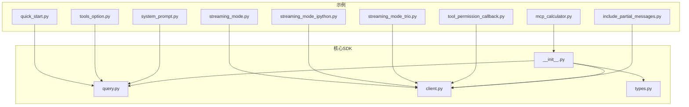
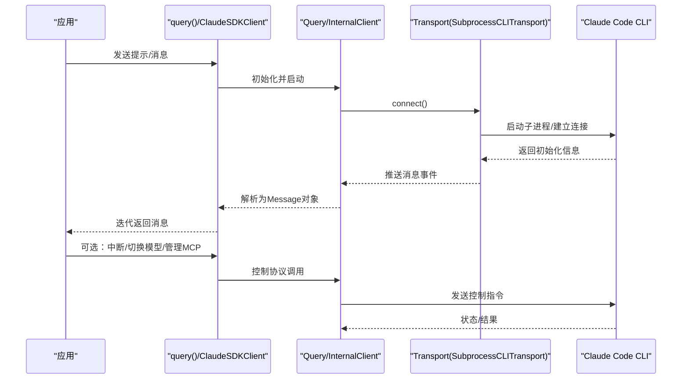
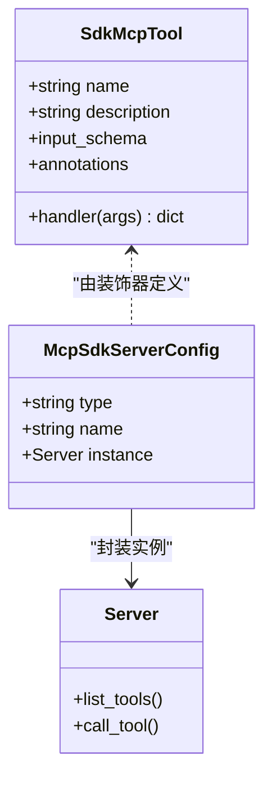
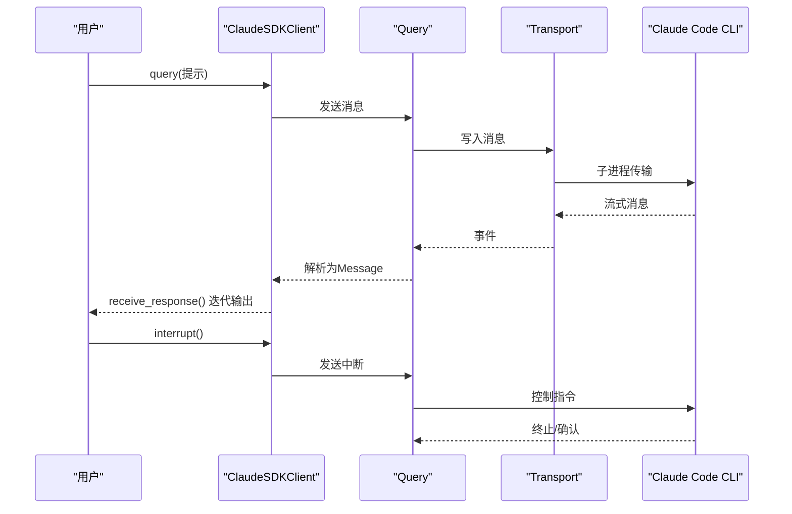
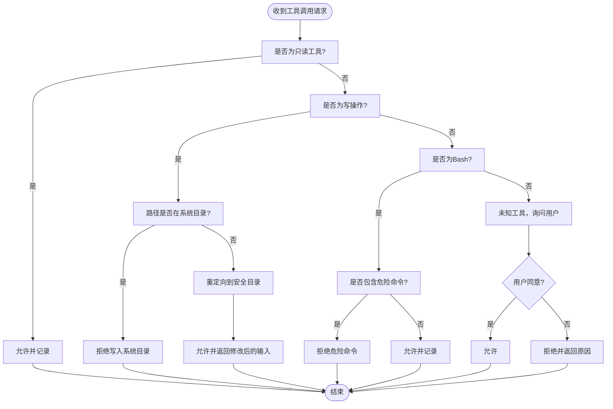

# 示例和最佳实践

<cite>
**本文引用的文件**
- [README.md](file://README.md)
- [pyproject.toml](file://pyproject.toml)
- [Dockerfile.test](file://Dockerfile.test)
- [src/claude_agent_sdk/__init__.py](file://src/claude_agent_sdk/__init__.py)
- [src/claude_agent_sdk/client.py](file://src/claude_agent_sdk/client.py)
- [src/claude_agent_sdk/query.py](file://src/claude_agent_sdk/query.py)
- [src/claude_agent_sdk/types.py](file://src/claude_agent_sdk/types.py)
- [examples/quick_start.py](file://examples/quick_start.py)
- [examples/streaming_mode.py](file://examples/streaming_mode.py)
- [examples/streaming_mode_ipython.py](file://examples/streaming_mode_ipython.py)
- [examples/streaming_mode_trio.py](file://examples/streaming_mode_trio.py)
- [examples/mcp_calculator.py](file://examples/mcp_calculator.py)
- [examples/tools_option.py](file://examples/tools_option.py)
- [examples/tool_permission_callback.py](file://examples/tool_permission_callback.py)
- [examples/system_prompt.py](file://examples/system_prompt.py)
- [examples/include_partial_messages.py](file://examples/include_partial_messages.py)
</cite>

## 目录
1. [简介](#简介)
2. [项目结构](#项目结构)
3. [核心组件](#核心组件)
4. [架构总览](#架构总览)
5. [详细组件分析](#详细组件分析)
6. [依赖分析](#依赖分析)
7. [性能考量](#性能考量)
8. [故障排查指南](#故障排查指南)
9. [结论](#结论)
10. [附录](#附录)

## 简介
本指南面向希望在Python中高效使用Claude Agent SDK的开发者，提供从基础到高级的完整示例与最佳实践。内容覆盖：
- 基础查询与流式对话
- 工具使用与权限控制
- IPython与Trio异步运行时集成
- 客户端能力（中断、模型切换、MCP服务器管理）
- 错误处理、性能优化与安全策略
- 生产部署（容器化、监控与日志）
- 代码质量保障（类型检查、测试与静态分析）
- 与其他Python生态的集成模式

## 项目结构
该仓库采用“核心SDK + 示例 + 测试”的清晰分层：
- 核心SDK位于src/claude_agent_sdk，提供query()与ClaudeSDKClient两类交互入口
- examples目录包含丰富的端到端示例，涵盖基础查询、流式对话、工具与权限、IPython/Trio集成、部分消息流等
- tests目录用于单元与集成测试
- pyproject.toml定义了构建、测试、类型检查与静态分析工具链
- Dockerfile.test提供容器化测试环境

图表来源
- [src/claude_agent_sdk/__init__.py:1-445](file://src/claude_agent_sdk/__init__.py#L1-L445)
- [src/claude_agent_sdk/query.py:1-127](file://src/claude_agent_sdk/query.py#L1-L127)
- [src/claude_agent_sdk/client.py:1-500](file://src/claude_agent_sdk/client.py#L1-L500)
- [examples/quick_start.py:1-77](file://examples/quick_start.py#L1-L77)
- [examples/streaming_mode.py:1-512](file://examples/streaming_mode.py#L1-L512)
- [examples/streaming_mode_ipython.py:1-230](file://examples/streaming_mode_ipython.py#L1-L230)
- [examples/streaming_mode_trio.py:1-81](file://examples/streaming_mode_trio.py#L1-L81)
- [examples/mcp_calculator.py:1-194](file://examples/mcp_calculator.py#L1-L194)
- [examples/tools_option.py:1-112](file://examples/tools_option.py#L1-L112)
- [examples/tool_permission_callback.py:1-159](file://examples/tool_permission_callback.py#L1-L159)
- [examples/system_prompt.py:1-87](file://examples/system_prompt.py#L1-L87)
- [examples/include_partial_messages.py:1-63](file://examples/include_partial_messages.py#L1-L63)

章节来源
- [README.md:1-360](file://README.md#L1-L360)
- [pyproject.toml:1-109](file://pyproject.toml#L1-L109)

## 核心组件
- query：一次性或单向流式查询，适合无状态、批处理与CI场景
- ClaudeSDKClient：双向、有状态、可中断的流式客户端，适合交互式对话、多轮会话与实时应用
- 类型系统与工具回调：通过ClaudeAgentOptions与工具装饰器/SDK MCP服务器实现强类型工具定义与权限控制
- 异步运行时：支持anyio、IPython与Trio，满足不同应用场景

章节来源
- [src/claude_agent_sdk/query.py:12-127](file://src/claude_agent_sdk/query.py#L12-L127)
- [src/claude_agent_sdk/client.py:21-500](file://src/claude_agent_sdk/client.py#L21-L500)
- [src/claude_agent_sdk/types.py:1-200](file://src/claude_agent_sdk/types.py#L1-L200)
- [src/claude_agent_sdk/__init__.py:111-341](file://src/claude_agent_sdk/__init__.py#L111-L341)

## 架构总览
SDK内部通过Transport抽象连接到Claude Code CLI，query()使用InternalClient进行一次性处理；ClaudeSDKClient则维护长连接与消息读取任务组，支持中断、模型切换、MCP服务器管理与会话控制。

图表来源
- [src/claude_agent_sdk/client.py:94-180](file://src/claude_agent_sdk/client.py#L94-L180)
- [src/claude_agent_sdk/query.py:12-127](file://src/claude_agent_sdk/query.py#L12-L127)

## 详细组件分析

### 基础查询（query）示例
- 典型用法：一次性提示、批量处理、CI流水线
- 关键点：无需连接管理；支持字符串或异步迭代器提示；可通过options控制工具与工作目录
- 最佳实践：合理设置system_prompt与max_turns；在工具密集场景预置allowed_tools以减少权限弹窗

章节来源
- [examples/quick_start.py:15-77](file://examples/quick_start.py#L15-L77)
- [examples/tools_option.py:16-112](file://examples/tools_option.py#L16-L112)
- [examples/system_prompt.py:14-87](file://examples/system_prompt.py#L14-L87)

### 流式对话（ClaudeSDKClient）示例
- 多轮对话：receive_response自动终止于ResultMessage
- 并发发送/接收：后台任务持续消费消息，主流程发送新问题
- 中断能力：需保持消息消费活跃，随后可发送interrupt
- 自定义选项：allowed_tools、system_prompt、env等
- 异步迭代提示：send_message支持传入异步可迭代消息流
- Bash工具演示：展示ToolUseBlock与ToolResultBlock的解析

章节来源
- [examples/streaming_mode.py:59-512](file://examples/streaming_mode.py#L59-L512)
- [src/claude_agent_sdk/client.py:186-483](file://src/claude_agent_sdk/client.py#L186-L483)

### IPython集成
- 交互式粘贴：支持在IPython中直接运行流式对话片段
- 持久化客户端：多次提问复用同一连接
- 中断与超时：演示如何在长时间任务中优雅中断与超时处理
- 异步迭代消息：将多个用户消息作为异步生成器发送

章节来源
- [examples/streaming_mode_ipython.py:1-230](file://examples/streaming_mode_ipython.py#L1-L230)

### Trio异步运行时
- 使用trio.run驱动多轮对话
- 与ClaudeSDKClient兼容，仅替换运行时入口
- 适用于需要trio生态集成的应用

章节来源
- [examples/streaming_mode_trio.py:1-81](file://examples/streaming_mode_trio.py#L1-L81)

### 工具与SDK MCP服务器
- @tool装饰器：声明式定义工具，输入schema支持字典/TypedDict/JSON Schema
- create_sdk_mcp_server：在进程中注册工具，避免IPC开销，便于调试与部署
- 计算器示例：展示多工具组合与权限预批准

章节来源
- [src/claude_agent_sdk/__init__.py:111-341](file://src/claude_agent_sdk/__init__.py#L111-L341)
- [examples/mcp_calculator.py:1-194](file://examples/mcp_calculator.py#L1-L194)

### 工具权限回调
- can_use_tool：在工具调用前动态决策允许/拒绝，可修改输入或附加权限更新
- 与permission_mode配合：默认模式确保回调被触发
- 实战：读写隔离、危险命令拦截、路径重定向

章节来源
- [examples/tool_permission_callback.py:26-159](file://examples/tool_permission_callback.py#L26-L159)
- [src/claude_agent_sdk/types.py:124-158](file://src/claude_agent_sdk/types.py#L124-L158)

### 部分消息流（partial messages）
- include_partial_messages：启用增量流事件，适合实时UI与进度感知
- 注意：需CLI支持；消息流中混杂StreamEvent与常规消息

章节来源
- [examples/include_partial_messages.py:28-63](file://examples/include_partial_messages.py#L28-L63)

### 类图：工具与SDK MCP服务器

图表来源
- [src/claude_agent_sdk/__init__.py:100-341](file://src/claude_agent_sdk/__init__.py#L100-L341)

### 序列图：流式对话与中断

图表来源
- [src/claude_agent_sdk/client.py:198-233](file://src/claude_agent_sdk/client.py#L198-L233)
- [examples/streaming_mode.py:133-174](file://examples/streaming_mode.py#L133-L174)

### 流程图：工具权限回调决策

图表来源
- [examples/tool_permission_callback.py:26-94](file://examples/tool_permission_callback.py#L26-L94)

## 依赖分析
- 运行时依赖：anyio（核心异步运行时）、mcp（MCP协议支持）
- 开发依赖：pytest、pytest-asyncio、pytest-cov、mypy、ruff
- 可选依赖：anyio[trio]（Trio支持）

章节来源
- [pyproject.toml:27-41](file://pyproject.toml#L27-L41)

## 性能考量
- SDK MCP服务器优于外部MCP服务器：无IPC开销、更易调试、类型安全
- 流式模式下保持消息消费活跃以支持中断与控制协议
- 合理设置CLAUDE_CODE_STREAM_CLOSE_TIMEOUT环境变量以平衡初始化等待
- 在工具回调中尽量避免昂贵的同步阻塞操作，必要时使用异步I/O
- 对于高并发场景，优先使用anyio运行时；如需Trio生态，可在入口处切换

章节来源
- [src/claude_agent_sdk/client.py:150-156](file://src/claude_agent_sdk/client.py#L150-L156)
- [src/claude_agent_sdk/__init__.py:178-250](file://src/claude_agent_sdk/__init__.py#L178-L250)

## 故障排查指南
- 连接类错误：CLINotFoundError、CLIConnectionError
- 进程类错误：ProcessError（含退出码）
- JSON解析错误：CLIJSONDecodeError
- 建议：在流式场景中使用超时包装；对工具回调异常进行捕获与降级；记录消息计数与耗时以便定位瓶颈

章节来源
- [README.md:247-269](file://README.md#L247-L269)
- [examples/streaming_mode.py:421-465](file://examples/streaming_mode.py#L421-L465)

## 结论
本指南提供了从入门到进阶的完整实践路径：以query快速完成一次性任务，以ClaudeSDKClient构建交互式应用，结合SDK MCP服务器与工具回调实现安全可控的自动化。通过合理的异步运行时选择、错误处理与性能优化策略，可在开发与生产环境中稳定落地。

## 附录

### 异步运行时选择与配置
- anyio：默认推荐，兼容性强，适合大多数场景
- IPython：交互式开发与演示友好，支持粘贴式流式对话
- Trio：需要trio生态集成时使用，注意与客户端生命周期一致

章节来源
- [examples/streaming_mode.py:467-512](file://examples/streaming_mode.py#L467-L512)
- [examples/streaming_mode_ipython.py:1-230](file://examples/streaming_mode_ipython.py#L1-L230)
- [examples/streaming_mode_trio.py:1-81](file://examples/streaming_mode_trio.py#L1-L81)

### 生产部署最佳实践
- 容器化：使用Dockerfile.test作为参考，安装CLI并运行测试
- 监控与日志：在应用侧记录消息数量、耗时与费用；对工具调用建立审计日志
- 配置隔离：通过ClaudeAgentOptions与环境变量区分不同环境

章节来源
- [Dockerfile.test:1-30](file://Dockerfile.test#L1-L30)
- [examples/streaming_mode.py:331-335](file://examples/streaming_mode.py#L331-L335)

### 代码质量保证
- 类型检查：mypy严格模式，开启严格等式、未使用忽略等
- 测试：pytest + pytest-asyncio，覆盖核心功能与边界条件
- 静态分析：ruff规则集，统一风格与质量基线
- 覆盖率：pytest-cov统计覆盖率，持续改进

章节来源
- [pyproject.toml:71-109](file://pyproject.toml#L71-L109)

### 与其他Python库和框架的集成模式
- Web框架：在FastAPI/Starlette中以异步视图包装query/ClaudeSDKClient
- 调度系统：Celery/Apache Airflow中使用query执行一次性任务
- 数据库：结合SQLModel/Beanie在工具回调中访问数据库
- 日志：structlog或标准logging记录消息与成本

[本节为概念性指导，不直接分析具体文件]