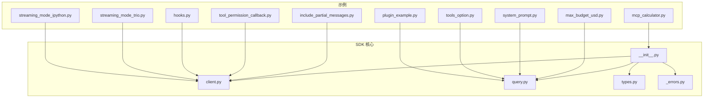
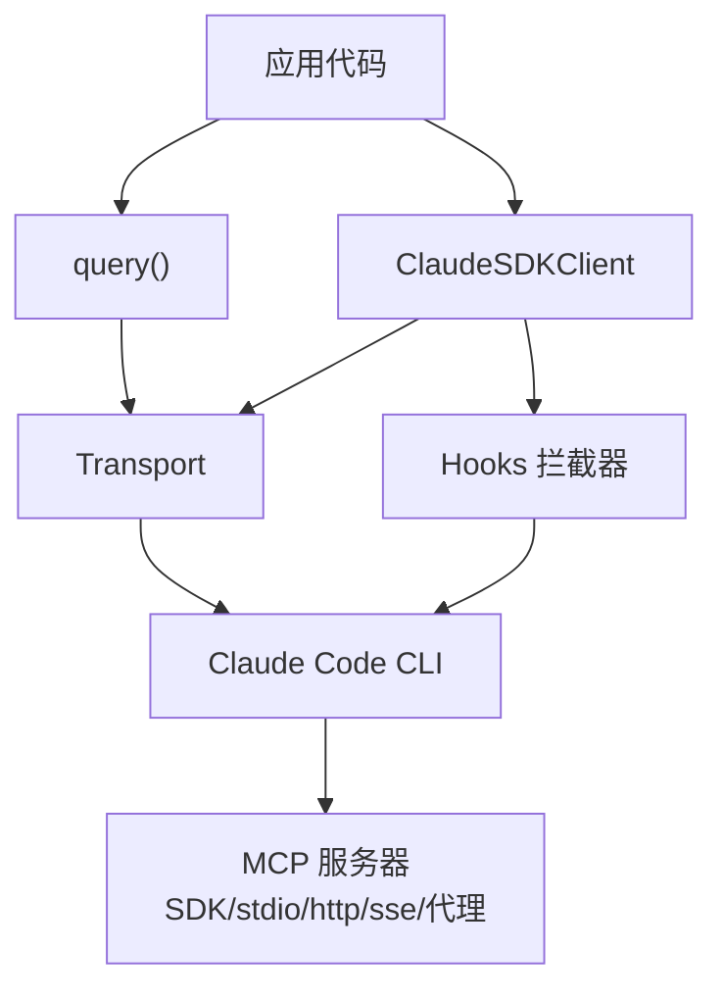
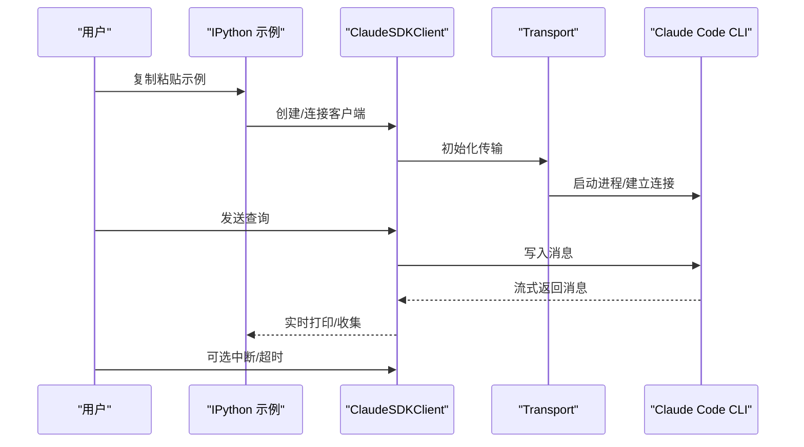
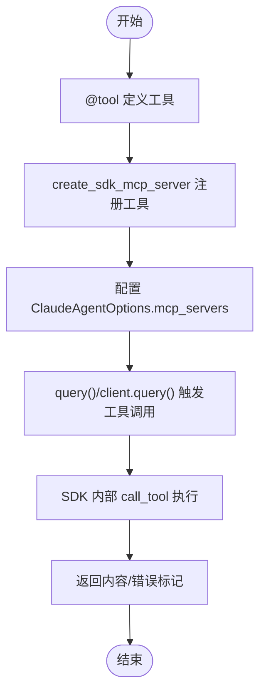
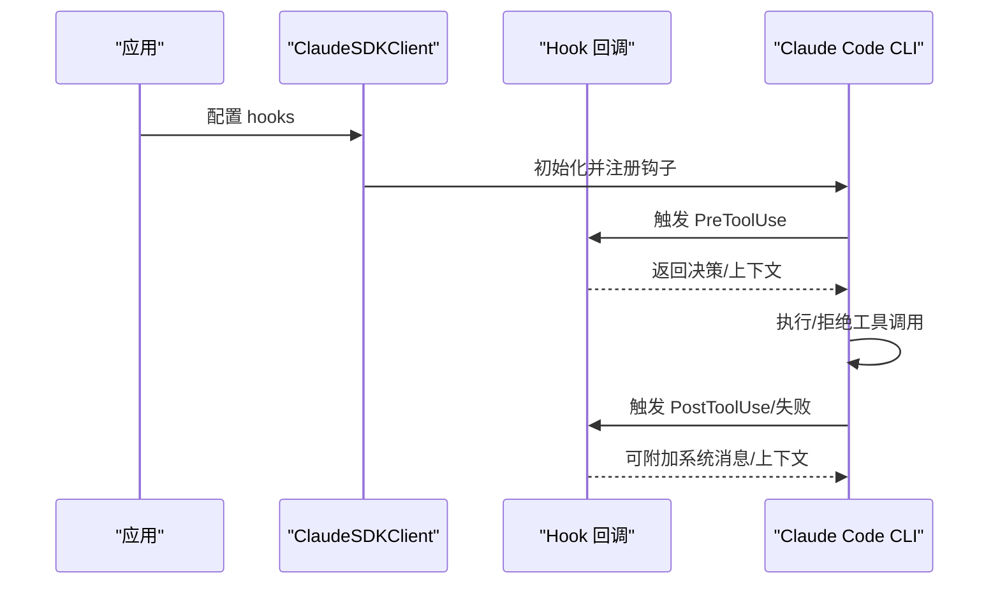
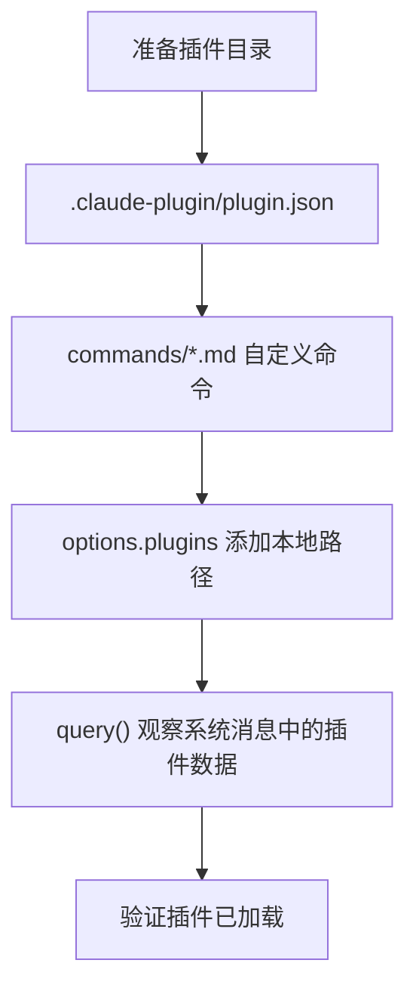
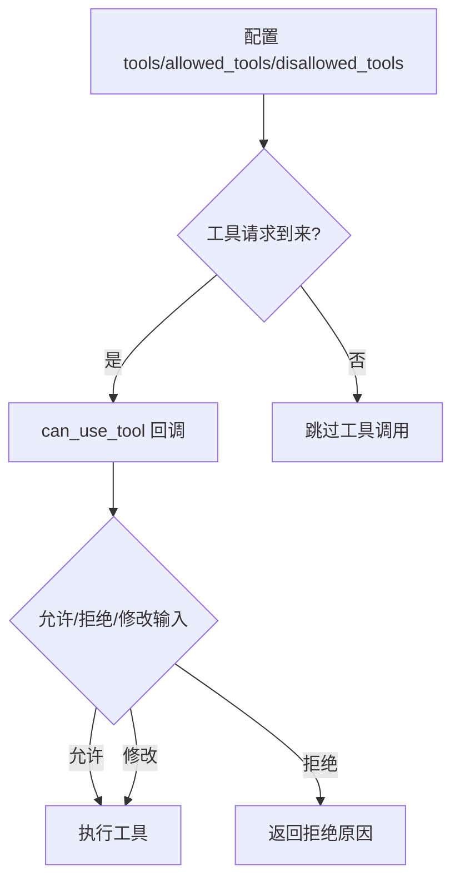
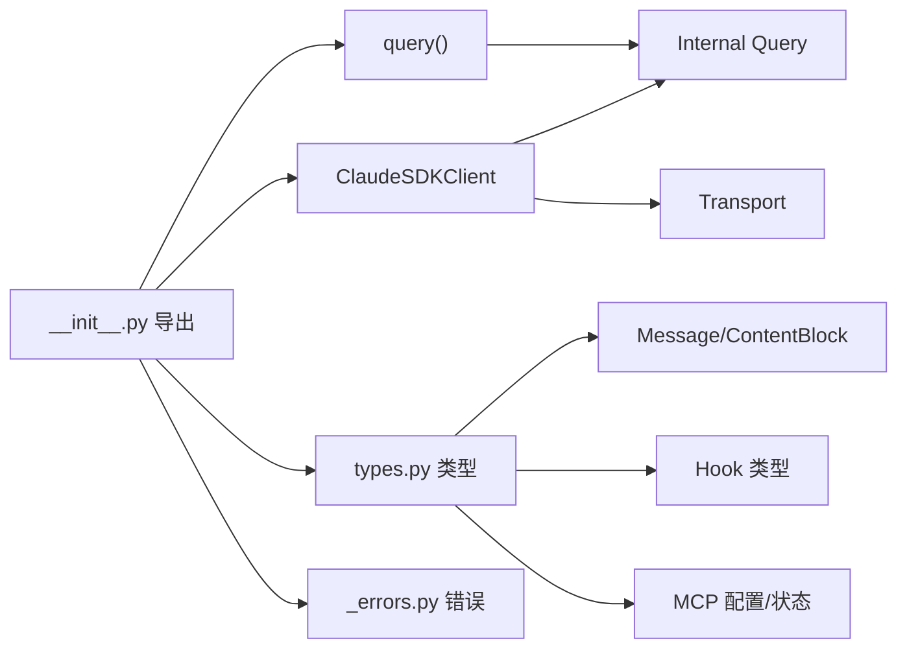

# 高级示例

<cite>
**本文引用的文件**
- [README.md](file://README.md)
- [examples/streaming_mode_ipython.py](file://examples/streaming_mode_ipython.py)
- [examples/streaming_mode_trio.py](file://examples/streaming_mode_trio.py)
- [examples/mcp_calculator.py](file://examples/mcp_calculator.py)
- [examples/plugin_example.py](file://examples/plugin_example.py)
- [examples/plugins/demo-plugin/.claude-plugin/plugin.json](file://examples/plugins/demo-plugin/.claude-plugin/plugin.json)
- [examples/plugins/demo-plugin/commands/greet.md](file://examples/plugins/demo-plugin/commands/greet.md)
- [examples/hooks.py](file://examples/hooks.py)
- [examples/tools_option.py](file://examples/tools_option.py)
- [examples/tool_permission_callback.py](file://examples/tool_permission_callback.py)
- [examples/system_prompt.py](file://examples/system_prompt.py)
- [examples/max_budget_usd.py](file://examples/max_budget_usd.py)
- [examples/include_partial_messages.py](file://examples/include_partial_messages.py)
- [src/claude_agent_sdk/__init__.py](file://src/claude_agent_sdk/__init__.py)
- [src/claude_agent_sdk/client.py](file://src/claude_agent_sdk/client.py)
- [src/claude_agent_sdk/query.py](file://src/claude_agent_sdk/query.py)
- [src/claude_agent_sdk/types.py](file://src/claude_agent_sdk/types.py)
- [src/claude_agent_sdk/_errors.py](file://src/claude_agent_sdk/_errors.py)
</cite>

## 目录
1. [简介](#简介)
2. [项目结构](#项目结构)
3. [核心组件](#核心组件)
4. [架构总览](#架构总览)
5. [详细组件分析](#详细组件分析)
6. [依赖关系分析](#依赖关系分析)
7. [性能考量](#性能考量)
8. [故障排查指南](#故障排查指南)
9. [结论](#结论)
10. [附录](#附录)

## 简介
本指南面向希望在生产环境中深度使用 Claude Agent SDK 的工程师与架构师，系统讲解高级示例与最佳实践，覆盖以下主题：
- 异步运行时：anyio、IPython、Trio 的使用场景与配置要点
- 插件开发：从项目结构到加载验证的全流程
- MCP 工具扩展：自定义工具定义、参数校验与结果处理
- 钩子（Hooks）：权限拦截、输出审查与执行控制
- 性能优化：并发控制、内存管理与资源回收
- 生产部署：容器化、监控与日志策略

## 项目结构
该仓库采用按功能分层的组织方式：
- 根目录包含 README、发布与构建脚本、工作流配置
- examples 目录提供丰富的高级示例，涵盖异步运行时、插件、MCP 工具、钩子与成本控制等
- src/claude_agent_sdk 提供 SDK 核心实现，包括客户端、查询函数、类型定义与错误处理

**图示来源**
- [examples/streaming_mode_ipython.py:1-230](file://examples/streaming_mode_ipython.py#L1-L230)
- [examples/streaming_mode_trio.py:1-81](file://examples/streaming_mode_trio.py#L1-L81)
- [examples/mcp_calculator.py:1-194](file://examples/mcp_calculator.py#L1-L194)
- [examples/plugin_example.py:1-72](file://examples/plugin_example.py#L1-L72)
- [examples/hooks.py:1-351](file://examples/hooks.py#L1-L351)
- [examples/tool_permission_callback.py:1-159](file://examples/tool_permission_callback.py#L1-L159)
- [examples/tools_option.py:1-112](file://examples/tools_option.py#L1-L112)
- [examples/system_prompt.py:1-87](file://examples/system_prompt.py#L1-L87)
- [examples/max_budget_usd.py:1-96](file://examples/max_budget_usd.py#L1-L96)
- [examples/include_partial_messages.py:1-63](file://examples/include_partial_messages.py#L1-L63)
- [src/claude_agent_sdk/__init__.py:1-445](file://src/claude_agent_sdk/__init__.py#L1-L445)
- [src/claude_agent_sdk/client.py:1-500](file://src/claude_agent_sdk/client.py#L1-L500)
- [src/claude_agent_sdk/query.py:1-127](file://src/claude_agent_sdk/query.py#L1-L127)
- [src/claude_agent_sdk/types.py:1-800](file://src/claude_agent_sdk/types.py#L1-L800)
- [src/claude_agent_sdk/_errors.py:1-57](file://src/claude_agent_sdk/_errors.py#L1-L57)

**章节来源**
- [README.md:1-360](file://README.md#L1-L360)

## 核心组件
- 查询接口：query() 提供一次性或单向流式交互；适合无状态、批处理与自动化脚本
- 客户端：ClaudeSDKClient 支持双向、可中断、多轮对话与动态消息发送；适合聊天界面、REPL、长会话与实时应用
- 类型系统：Message、ContentBlock、Hook 输入/输出、MCP 服务器配置与状态、权限模式、沙箱设置等
- 错误体系：CLI 连接失败、进程异常、JSON 解析失败、消息解析失败等
- MCP 工具：@tool 装饰器与 create_sdk_mcp_server 构建内联 MCP 服务，提升性能与简化部署

**章节来源**
- [src/claude_agent_sdk/query.py:12-127](file://src/claude_agent_sdk/query.py#L12-L127)
- [src/claude_agent_sdk/client.py:21-500](file://src/claude_agent_sdk/client.py#L21-L500)
- [src/claude_agent_sdk/types.py:1-800](file://src/claude_agent_sdk/types.py#L1-L800)
- [src/claude_agent_sdk/_errors.py:1-57](file://src/claude_agent_sdk/_errors.py#L1-L57)
- [src/claude_agent_sdk/__init__.py:100-341](file://src/claude_agent_sdk/__init__.py#L100-L341)

## 架构总览
SDK 通过 Transport 与 Claude Code CLI 建立连接，支持多种 MCP 服务器（内联 SDK、stdio、HTTP、SSE、代理），并通过 Hooks 在关键事件点进行拦截与控制。

**图示来源**
- [src/claude_agent_sdk/query.py:12-127](file://src/claude_agent_sdk/query.py#L12-L127)
- [src/claude_agent_sdk/client.py:94-180](file://src/claude_agent_sdk/client.py#L94-L180)
- [src/claude_agent_sdk/types.py:494-530](file://src/claude_agent_sdk/types.py#L494-L530)

## 详细组件分析

### 异步运行时与交互模式
- anyio：SDK 默认运行时，适合大多数命令行与批处理场景
- IPython：在交互式环境中粘贴示例即可运行，支持实时显示、持久客户端、中断与超时处理
- Trio：提供更严格的并发模型，适合需要确定性与更强并发控制的应用

**图示来源**
- [examples/streaming_mode_ipython.py:19-165](file://examples/streaming_mode_ipython.py#L19-L165)
- [src/claude_agent_sdk/client.py:94-180](file://src/claude_agent_sdk/client.py#L94-L180)

**章节来源**
- [examples/streaming_mode_ipython.py:1-230](file://examples/streaming_mode_ipython.py#L1-L230)
- [examples/streaming_mode_trio.py:1-81](file://examples/streaming_mode_trio.py#L1-L81)
- [README.md:20-31](file://README.md#L20-L31)

### MCP 工具扩展（自定义工具）
- 使用 @tool 定义工具，输入模式支持简单字典、TypedDict 或 JSON Schema
- 使用 create_sdk_mcp_server 创建内联 MCP 服务器，避免子进程开销
- 允许工具返回文本/图片内容，支持错误标记与结果格式化

**图示来源**
- [src/claude_agent_sdk/__init__.py:111-341](file://src/claude_agent_sdk/__init__.py#L111-L341)
- [examples/mcp_calculator.py:21-194](file://examples/mcp_calculator.py#L21-L194)

**章节来源**
- [src/claude_agent_sdk/__init__.py:111-341](file://src/claude_agent_sdk/__init__.py#L111-L341)
- [examples/mcp_calculator.py:1-194](file://examples/mcp_calculator.py#L1-L194)

### 钩子（Hooks）：权限拦截与执行控制
- 支持 PreToolUse、PostToolUse、PostToolUseFailure、UserPromptSubmit、Stop、SubagentStop、PreCompact、Notification、SubagentStart、PermissionRequest 等事件
- 通过 HookMatcher 将匹配规则与回调函数绑定，实现细粒度控制
- 可设置 permissionDecision、reason、systemMessage、continue_、stopReason 等字段

**图示来源**
- [src/claude_agent_sdk/types.py:160-453](file://src/claude_agent_sdk/types.py#L160-L453)
- [examples/hooks.py:46-154](file://examples/hooks.py#L46-L154)

**章节来源**
- [src/claude_agent_sdk/types.py:160-453](file://src/claude_agent_sdk/types.py#L160-L453)
- [examples/hooks.py:1-351](file://examples/hooks.py#L1-L351)

### 插件开发与加载
- 插件目录包含 .claude-plugin/plugin.json 与自定义命令文档
- 通过 ClaudeAgentOptions.plugins 加载本地插件，系统消息中可查看已加载插件信息
- 插件示例展示了如何验证插件是否成功加载

**图示来源**
- [examples/plugins/demo-plugin/.claude-plugin/plugin.json:1-9](file://examples/plugins/demo-plugin/.claude-plugin/plugin.json#L1-L9)
- [examples/plugins/demo-plugin/commands/greet.md:1-6](file://examples/plugins/demo-plugin/commands/greet.md#L1-L6)
- [examples/plugin_example.py:23-67](file://examples/plugin_example.py#L23-L67)

**章节来源**
- [examples/plugin_example.py:1-72](file://examples/plugin_example.py#L1-L72)
- [examples/plugins/demo-plugin/.claude-plugin/plugin.json:1-9](file://examples/plugins/demo-plugin/.claude-plugin/plugin.json#L1-L9)
- [examples/plugins/demo-plugin/commands/greet.md:1-6](file://examples/plugins/demo-plugin/commands/greet.md#L1-L6)

### 权限与工具控制
- tools 选项支持数组、空数组与预设，用于限制可用工具集
- can_use_tool 回调允许在运行时动态决定工具使用、修改输入或提示用户
- 允许工具名称白名单与模式匹配，结合 permission_mode 控制危险操作

**图示来源**
- [examples/tools_option.py:16-107](file://examples/tools_option.py#L16-L107)
- [examples/tool_permission_callback.py:26-94](file://examples/tool_permission_callback.py#L26-L94)
- [src/claude_agent_sdk/types.py:124-158](file://src/claude_agent_sdk/types.py#L124-L158)

**章节来源**
- [examples/tools_option.py:1-112](file://examples/tools_option.py#L1-L112)
- [examples/tool_permission_callback.py:1-159](file://examples/tool_permission_callback.py#L1-L159)
- [src/claude_agent_sdk/types.py:124-158](file://src/claude_agent_sdk/types.py#L124-L158)

### 系统提示与成本控制
- system_prompt 支持字符串、预设与追加内容，便于定制角色与行为
- max_budget_usd 用于限制单次查询或会话的费用，超过阈值将触发错误状态

**章节来源**
- [examples/system_prompt.py:1-87](file://examples/system_prompt.py#L1-L87)
- [examples/max_budget_usd.py:1-96](file://examples/max_budget_usd.py#L1-L96)

### 部分消息流与思考令牌
- include_partial_messages 可启用增量流事件，便于实时 UI 与进度反馈
- 可通过 env 设置 MAX_THINKING_TOKENS 等参数以影响推理过程

**章节来源**
- [examples/include_partial_messages.py:1-63](file://examples/include_partial_messages.py#L1-L63)

## 依赖关系分析
- SDK 导出 query、ClaudeSDKClient、类型与工具装饰器
- 客户端内部依赖 Transport 与 Query，负责连接、初始化、消息收发与控制协议
- 类型系统统一了消息、块、钩子、MCP 服务器配置与状态
- 错误模块提供统一的异常层次

**图示来源**
- [src/claude_agent_sdk/__init__.py:343-445](file://src/claude_agent_sdk/__init__.py#L343-L445)
- [src/claude_agent_sdk/client.py:94-180](file://src/claude_agent_sdk/client.py#L94-L180)
- [src/claude_agent_sdk/query.py:12-127](file://src/claude_agent_sdk/query.py#L12-L127)
- [src/claude_agent_sdk/types.py:1-800](file://src/claude_agent_sdk/types.py#L1-L800)
- [src/claude_agent_sdk/_errors.py:1-57](file://src/claude_agent_sdk/_errors.py#L1-L57)

**章节来源**
- [src/claude_agent_sdk/__init__.py:1-445](file://src/claude_agent_sdk/__init__.py#L1-L445)
- [src/claude_agent_sdk/client.py:1-500](file://src/claude_agent_sdk/client.py#L1-L500)
- [src/claude_agent_sdk/query.py:1-127](file://src/claude_agent_sdk/query.py#L1-L127)
- [src/claude_agent_sdk/types.py:1-800](file://src/claude_agent_sdk/types.py#L1-L800)
- [src/claude_agent_sdk/_errors.py:1-57](file://src/claude_agent_sdk/_errors.py#L1-L57)

## 性能考量
- 优先使用内联 SDK MCP 服务器，避免子进程与 IPC 开销
- 在交互式场景中复用 ClaudeSDKClient 连接，减少启动/断开成本
- 合理设置 include_partial_messages 与 max_turns，平衡实时性与资源占用
- 使用 allowed_tools 与 can_use_tool 回调提前过滤高风险工具，降低失败重试成本
- 对于长会话，利用 session_id 与 rewind_files 进行状态回滚，避免重复计算

[本节为通用指导，无需特定文件引用]

## 故障排查指南
- CLI 连接失败：检查 CLI 是否安装、路径是否正确、环境变量是否设置
- 进程异常：关注退出码与错误输出，定位具体工具调用问题
- JSON 解析失败：检查 CLI 输出格式变化或网络中断导致的数据截断
- 消息解析失败：确认消息类型与内容块结构是否符合预期

**章节来源**
- [src/claude_agent_sdk/_errors.py:1-57](file://src/claude_agent_sdk/_errors.py#L1-L57)
- [src/claude_agent_sdk/client.py:186-197](file://src/claude_agent_sdk/client.py#L186-L197)

## 结论
通过本指南，您可以在生产环境中安全、高效地使用 Claude Agent SDK：
- 选择合适的异步运行时与交互模式
- 利用 MCP 工具与 Hooks 构建可控、可观测的智能体
- 通过插件扩展能力边界
- 在成本与性能之间取得平衡，并建立完善的监控与日志体系

[本节为总结，无需特定文件引用]

## 附录

### 异步运行时选择标准
- anyio：默认推荐，生态成熟、兼容性强
- IPython：交互式开发与演示友好，适合快速原型
- Trio：强调确定性并发，适合复杂状态机与严格时序要求

**章节来源**
- [README.md:20-31](file://README.md#L20-L31)
- [examples/streaming_mode_ipython.py:1-230](file://examples/streaming_mode_ipython.py#L1-L230)
- [examples/streaming_mode_trio.py:1-81](file://examples/streaming_mode_trio.py#L1-L81)

### MCP 工具开发清单
- 使用 @tool 定义输入模式与描述
- 在 create_sdk_mcp_server 中注册工具
- 在 ClaudeAgentOptions.mcp_servers 中配置映射
- 通过 allowed_tools 或 permission_mode 控制访问
- 在工具中处理错误并返回标准化内容

**章节来源**
- [src/claude_agent_sdk/__init__.py:111-341](file://src/claude_agent_sdk/__init__.py#L111-L341)
- [examples/mcp_calculator.py:138-194](file://examples/mcp_calculator.py#L138-L194)

### 钩子事件与典型用途
- PreToolUse：权限拦截与输入审查
- PostToolUse：输出审计与二次处理
- PostToolUseFailure：失败恢复与告警
- UserPromptSubmit：注入上下文
- Stop/SubagentStop：生命周期管理
- Notification/SubagentStart：通知与任务编排
- PermissionRequest：动态权限协商

**章节来源**
- [src/claude_agent_sdk/types.py:160-453](file://src/claude_agent_sdk/types.py#L160-L453)
- [examples/hooks.py:156-301](file://examples/hooks.py#L156-L301)

### 成本控制与预算
- 使用 max_budget_usd 限制单次或会话费用
- 结合 tools 与 can_use_tool 回调减少昂贵工具调用
- 监控 ResultMessage 中的 total_cost_usd 与 subtype

**章节来源**
- [examples/max_budget_usd.py:15-96](file://examples/max_budget_usd.py#L15-L96)
- [src/claude_agent_sdk/types.py:766-800](file://src/claude_agent_sdk/types.py#L766-L800)

### 部分消息流与思考令牌
- include_partial_messages 用于实时 UI 与进度反馈
- 通过 env 设置 MAX_THINKING_TOKENS 等参数影响推理深度

**章节来源**
- [examples/include_partial_messages.py:28-63](file://examples/include_partial_messages.py#L28-L63)