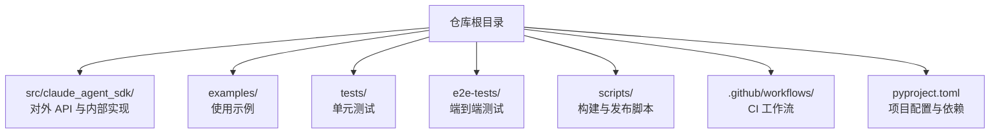
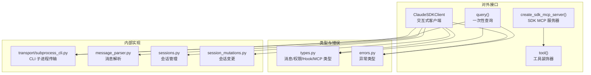
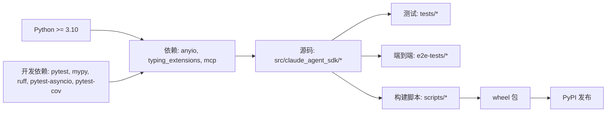

# 贡献指南

<cite>
**本文引用的文件**
- [README.md](file://README.md)
- [CLAUDE.md](file://CLAUDE.md)
- [RELEASING.md](file://RELEASING.md)
- [pyproject.toml](file://pyproject.toml)
- [scripts/initial-setup.sh](file://scripts/initial-setup.sh)
- [scripts/build_wheel.py](file://scripts/build_wheel.py)
- [.github/workflows/test.yml](file://.github/workflows/test.yml)
- [.github/workflows/lint.yml](file://.github/workflows/lint.yml)
- [src/claude_agent_sdk/__init__.py](file://src/claude_agent_sdk/__init__.py)
- [src/claude_agent_sdk/_errors.py](file://src/claude_agent_sdk/_errors.py)
- [src/claude_agent_sdk/types.py](file://src/claude_agent_sdk/types.py)
- [tests/conftest.py](file://tests/conftest.py)
- [examples/quick_start.py](file://examples/quick_start.py)
</cite>

## 目录
1. [简介](#简介)
2. [项目结构](#项目结构)
3. [核心组件](#核心组件)
4. [架构总览](#架构总览)
5. [详细组件分析](#详细组件分析)
6. [依赖关系分析](#依赖关系分析)
7. [性能考虑](#性能考虑)
8. [故障排除指南](#故障排除指南)
9. [结论](#结论)
10. [附录](#附录)

## 简介
本贡献指南面向希望为 Claude Agent SDK（Python）做出贡献的开发者，目标是帮助你在最短时间内完成开发环境搭建、理解代码结构与规范、编写与运行测试、遵循 Git 工作流与分支策略、完成 Pull Request 审查流程、维护文档与发布流程，并掌握调试与排障方法。本指南严格基于仓库中的实际文件与脚本，确保所有操作均可复现。

## 项目结构
该仓库采用“包内源码 + 示例 + 测试 + 构建与发布脚本 + GitHub Actions 工作流”的组织方式：
- 源码位于 src/claude_agent_sdk/，包含对外 API、内部实现、类型定义与错误类型等
- 示例位于 examples/，涵盖快速开始、流式交互、钩子、工具权限回调等场景
- 单元测试与端到端测试分别位于 tests/ 与 e2e-tests/
- 构建与发布相关脚本位于 scripts/，包括初始化 Git 钩子、打包与版本更新
- 发布与质量门禁通过 .github/workflows/ 中的工作流实现

图表来源
- [pyproject.toml:1-109](file://pyproject.toml#L1-L109)
- [README.md:1-360](file://README.md#L1-L360)

章节来源
- [README.md:1-360](file://README.md#L1-L360)
- [pyproject.toml:1-109](file://pyproject.toml#L1-L109)

## 核心组件
- 对外 API 与入口：通过模块导出 query、ClaudeSDKClient、工具装饰器与类型等
- 类型系统：集中于 types.py，覆盖消息、内容块、权限、Hook 输入输出、MCP 服务器配置等
- 错误体系：集中于 _errors.py，提供统一的异常基类与具体错误类型
- 内部实现：位于 _internal/，包含传输层、会话管理、消息解析等

章节来源
- [src/claude_agent_sdk/__init__.py:1-445](file://src/claude_agent_sdk/__init__.py#L1-L445)
- [src/claude_agent_sdk/types.py:1-800](file://src/claude_agent_sdk/types.py#L1-L800)
- [src/claude_agent_sdk/_errors.py:1-57](file://src/claude_agent_sdk/_errors.py#L1-L57)

## 架构总览
下图展示了 SDK 的主要模块及其职责与依赖关系：

图表来源
- [src/claude_agent_sdk/__init__.py:1-445](file://src/claude_agent_sdk/__init__.py#L1-L445)
- [src/claude_agent_sdk/types.py:1-800](file://src/claude_agent_sdk/types.py#L1-L800)
- [src/claude_agent_sdk/_errors.py:1-57](file://src/claude_agent_sdk/_errors.py#L1-L57)

## 详细组件分析

### 开发环境搭建与本地测试
- Python 版本要求与依赖
  - Python 版本：3.10 及以上
  - 依赖：anyio、typing_extensions（在旧版本 Python 上）、mcp
  - 开发依赖：pytest、pytest-asyncio、anyio[trio]、pytest-cov、mypy、ruff
- 安装与激活
  - 使用 pip 安装开发依赖：pip install -e ".[dev]"
  - 运行测试：python -m pytest tests/ 或按需指定文件
- Git 钩子
  - 执行初始化脚本以安装 pre-push 钩子：./scripts/initial-setup.sh
  - 钩子会在推送前执行与 CI 一致的检查（lint 与格式化）
- 本地构建轮子
  - 使用脚本构建包含捆绑 CLI 的 wheel，并可选择跳过下载或清理捆绑 CLI
  - 支持指定版本与 CLI 版本参数

章节来源
- [pyproject.toml:27-41](file://pyproject.toml#L27-L41)
- [pyproject.toml:60-69](file://pyproject.toml#L60-L69)
- [pyproject.toml:87-106](file://pyproject.toml#L87-L106)
- [README.md:290-332](file://README.md#L290-L332)
- [scripts/initial-setup.sh:1-23](file://scripts/initial-setup.sh#L1-L23)
- [scripts/build_wheel.py:1-393](file://scripts/build_wheel.py#L1-L393)

### 代码规范与编程标准
- 风格与格式
  - 使用 ruff 进行检查与格式化；目标版本为 py310，行宽 88
  - 启用 pycodestyle、flake8、isort、pep8-naming 等规则
  - 提供一键修复与格式化命令
- 类型注解
  - mypy 严格模式：禁止未注解定义、不完整定义、未注解装饰器、隐式可选等
  - 强制返回值与未使用忽略告警，强调类型安全
- 文档与示例
  - README 提供快速开始与使用示例
  - CLAUDE.md 提供常用命令清单（lint、类型检查、测试）

章节来源
- [pyproject.toml:87-106](file://pyproject.toml#L87-L106)
- [pyproject.toml:71-86](file://pyproject.toml#L71-L86)
- [CLAUDE.md:1-28](file://CLAUDE.md#L1-L28)
- [README.md:20-280](file://README.md#L20-L280)

### 测试指南
- 单元测试
  - pytest 配置：testpaths、pythonpath、asyncio 插件启用
  - 运行全部测试：python -m pytest tests/
  - 运行特定文件：python -m pytest tests/<file>.py
- 端到端测试
  - e2e-tests 使用真实 API，需要 Anthropic API 密钥
  - CI 中在多平台运行 e2e 与示例验证
- 覆盖率
  - CI 中生成覆盖率报告并上传至 Codecov

章节来源
- [pyproject.toml:60-69](file://pyproject.toml#L60-L69)
- [tests/conftest.py:1-5](file://tests/conftest.py#L1-L5)
- [.github/workflows/test.yml:29-37](file://.github/workflows/test.yml#L29-L37)
- [README.md:275-280](file://README.md#L275-L280)

### Git 工作流程与分支管理
- 推送前检查
  - 安装 pre-push 钩子后，每次推送前自动执行 lint 与格式化检查
  - 如需临时跳过，使用 git push --no-verify
- 分支策略
  - 主分支为 main，CI 在 push 到 main 与 PR 时触发测试
- 提交信息
  - 自动发布流程依赖特定提交信息格式（如包含捆绑 CLI 版本提升的信息）

章节来源
- [README.md:290-299](file://README.md#L290-L299)
- [scripts/initial-setup.sh:10-23](file://scripts/initial-setup.sh#L10-L23)
- [.github/workflows/test.yml:3-8](file://.github/workflows/test.yml#L3-L8)
- [RELEASING.md:28-46](file://RELEASING.md#L28-L46)

### Pull Request 流程与代码审查
- 触发 CI
  - PR 与 push 到 main 均会触发测试工作流
- 质量门禁
  - 单元测试与覆盖率上传
  - Lint 与 mypy 类型检查
- 审查要点
  - 代码风格与类型注解是否符合 mypy/ruff 配置
  - 是否新增/修改了对外 API 或类型定义
  - 是否影响 e2e 测试与示例

章节来源
- [.github/workflows/test.yml:29-37](file://.github/workflows/test.yml#L29-L37)
- [.github/workflows/lint.yml:26-33](file://.github/workflows/lint.yml#L26-L33)
- [pyproject.toml:71-86](file://pyproject.toml#L71-L86)

### 文档编写与更新流程
- 文档位置
  - README.md 为主文档，包含安装、使用、开发与发布说明
  - CLAUDE.md 提供常用命令清单
- 更新建议
  - 新增功能或变更对外 API 时，同步更新 README 与类型注释
  - 保持示例与文档一致，避免描述与实现脱节

章节来源
- [README.md:1-360](file://README.md#L1-L360)
- [CLAUDE.md:1-28](file://CLAUDE.md#L1-L28)

### 发布与版本管理
- 版本号
  - SDK 版本：pyproject.toml 与 src/claude_agent_sdk/_version.py
  - 捆绑 CLI 版本：src/claude_agent_sdk/_cli_version.py
- 发布路径
  - 自动发布：当 CLI 版本提升时自动触发，增加 SDK 补丁版本
  - 手动发布：通过 GitHub Actions 手动触发，支持自定义版本号
- 工作流
  - 多平台构建 wheel、捆绑 CLI、发布到 PyPI、创建标签与发布说明
- 脚本
  - update_version.py、update_cli_version.py、build_wheel.py、download_cli.py

章节来源
- [RELEASING.md:1-76](file://RELEASING.md#L1-L76)
- [scripts/build_wheel.py:1-393](file://scripts/build_wheel.py#L1-L393)

## 依赖关系分析
- 语言与运行时
  - Python >= 3.10
  - anyio 用于异步 I/O；mcp 用于 MCP 服务器集成
- 开发工具链
  - pytest、pytest-asyncio、pytest-cov：测试与覆盖率
  - mypy：静态类型检查
  - ruff：代码风格与格式化
- 构建与发布
  - hatchling 作为构建后端
  - twine 用于包检查（非强制）

图表来源
- [pyproject.toml:27-41](file://pyproject.toml#L27-L41)
- [pyproject.toml:1-109](file://pyproject.toml#L1-L109)

章节来源
- [pyproject.toml:1-109](file://pyproject.toml#L1-L109)

## 性能考虑
- SDK MCP 服务器（in-process）相较外部 MCP 服务器的优势
  - 无 IPC 开销，性能更优
  - 单进程部署，简化调试与状态共享
- 工具函数应保持异步特性，避免阻塞事件循环
- 消息解析与传输层尽量减少不必要的字符串处理与对象复制

章节来源
- [src/claude_agent_sdk/__init__.py:136-245](file://src/claude_agent_sdk/__init__.py#L136-L245)

## 故障排除指南
- 常见问题定位
  - CLI 未找到或无法连接：检查 CLINotFoundError/CLIConnectionError
  - 进程失败：查看 ProcessError 的退出码与错误输出
  - JSON 解析失败：检查 CLIJSONDecodeError 与原始错误行
  - 消息解析失败：检查 MessageParseError
- 本地排查步骤
  - 使用 ruff 修复风格问题与格式化
  - 使用 mypy 检查类型注解
  - 运行 pytest 验证单测与覆盖率
  - 若涉及真实 API，确认 e2e 测试密钥与网络连通性
- 示例参考
  - 快速开始示例可用于验证基本查询与工具调用

章节来源
- [src/claude_agent_sdk/_errors.py:1-57](file://src/claude_agent_sdk/_errors.py#L1-L57)
- [CLAUDE.md:4-17](file://CLAUDE.md#L4-L17)
- [examples/quick_start.py:1-77](file://examples/quick_start.py#L1-L77)

## 结论
本指南提供了从环境搭建、编码规范、测试与 CI、PR 流程到发布与排障的完整路径。建议贡献者在提交 PR 前先在本地执行 ruff、mypy、pytest，并确保 pre-push 钩子通过。对于涉及对外 API 或类型变更的改动，请同步更新文档与示例，确保一致性与可维护性。

## 附录

### 常用命令速查
- 一键修复与格式化：ruff check src/ tests/ --fix 与 ruff format src/ tests/
- 类型检查：mypy src/
- 运行测试：pytest tests/ 或 pytest tests/<file>.py
- 初始化 Git 钩子：./scripts/initial-setup.sh
- 构建轮子：python scripts/build_wheel.py

章节来源
- [CLAUDE.md:4-17](file://CLAUDE.md#L4-L17)
- [README.md:290-332](file://README.md#L290-L332)