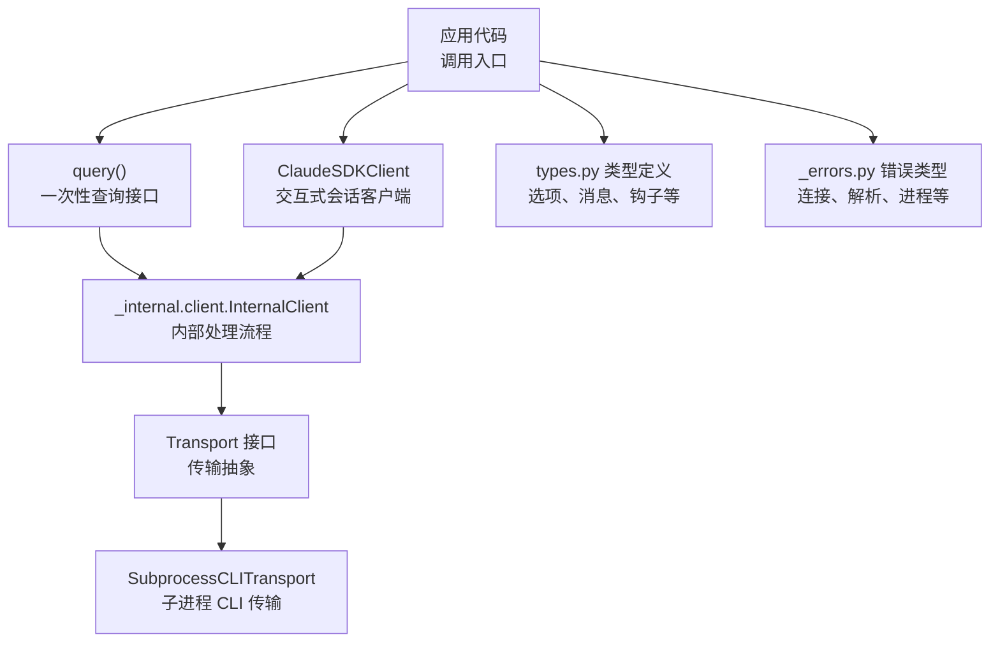
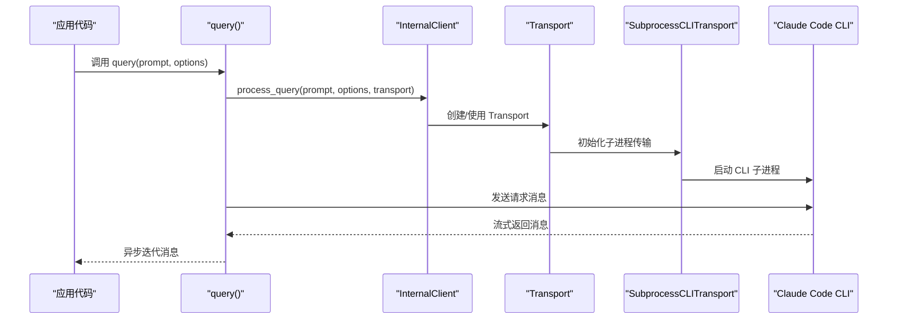
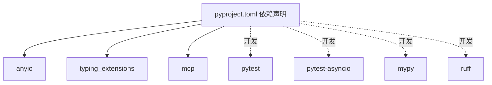

# 迁移与兼容性

<cite>
**本文引用的文件**
- [README.md](file://README.md)
- [CHANGELOG.md](file://CHANGELOG.md)
- [src/claude_agent_sdk/__init__.py](file://src/claude_agent_sdk/__init__.py)
- [src/claude_agent_sdk/_version.py](file://src/claude_agent_sdk/_version.py)
- [src/claude_agent_sdk/client.py](file://src/claude_agent_sdk/client.py)
- [src/claude_agent_sdk/query.py](file://src/claude_agent_sdk/query.py)
- [src/claude_agent_sdk/types.py](file://src/claude_agent_sdk/types.py)
- [src/claude_agent_sdk/_errors.py](file://src/claude_agent_sdk/_errors.py)
- [pyproject.toml](file://pyproject.toml)
- [examples/quick_start.py](file://examples/quick_start.py)
- [examples/agents.py](file://examples/agents.py)
- [examples/tools_option.py](file://examples/tools_option.py)
- [tests/test_client.py](file://tests/test_client.py)
</cite>

## 目录
1. [简介](#简介)
2. [项目结构](#项目结构)
3. [核心组件](#核心组件)
4. [架构总览](#架构总览)
5. [详细组件分析](#详细组件分析)
6. [依赖分析](#依赖分析)
7. [性能考虑](#性能考虑)
8. [故障排查指南](#故障排查指南)
9. [结论](#结论)
10. [附录](#附录)

## 简介
本文件面向从 Claude Code SDK（版本 < 0.1.0）升级到 Claude Agent SDK 的用户，提供完整的迁移与兼容性指导。内容涵盖：
- 从旧版本到新版本的迁移步骤与注意事项
- API 变更、配置调整与代码修改的具体要求
- 自动迁移工具与手动迁移的对比分析
- 常见迁移问题的解决方案与回滚策略
- 向后兼容性保证与废弃功能的处理方式
- 面向现有用户的清晰升级路径

## 项目结构
Claude Agent SDK 的核心模块围绕“查询接口”和“交互式客户端”展开，并通过类型系统、错误体系与内部传输层实现对 Claude Code CLI 的封装。

图表来源
- [src/claude_agent_sdk/query.py:12-127](file://src/claude_agent_sdk/query.py#L12-L127)
- [src/claude_agent_sdk/client.py:21-500](file://src/claude_agent_sdk/client.py#L21-L500)
- [src/claude_agent_sdk/types.py:1-800](file://src/claude_agent_sdk/types.py#L1-L800)
- [src/claude_agent_sdk/_errors.py:1-57](file://src/claude_agent_sdk/_errors.py#L1-L57)

章节来源
- [README.md:1-360](file://README.md#L1-L360)
- [src/claude_agent_sdk/__init__.py:1-445](file://src/claude_agent_sdk/__init__.py#L1-L445)

## 核心组件
- 查询接口：提供一次性或单向流式查询能力，适合简单任务与自动化脚本。
- 交互式客户端：支持双向、状态化对话，具备中断、权限模式切换、模型切换、MCP 管理等功能。
- 类型系统：统一的选项、消息、钩子、MCP 配置等类型定义，确保强类型与可维护性。
- 错误体系：覆盖 CLI 连接、进程失败、JSON 解析、消息解析等错误场景。
- 内部传输层：抽象出 Transport 接口，当前默认使用子进程 CLI 传输。

章节来源
- [src/claude_agent_sdk/query.py:12-127](file://src/claude_agent_sdk/query.py#L12-L127)
- [src/claude_agent_sdk/client.py:21-500](file://src/claude_agent_sdk/client.py#L21-L500)
- [src/claude_agent_sdk/types.py:1-800](file://src/claude_agent_sdk/types.py#L1-L800)
- [src/claude_agent_sdk/_errors.py:1-57](file://src/claude_agent_sdk/_errors.py#L1-L57)

## 架构总览
下图展示了从应用代码到 CLI 的端到端调用链路，以及关键组件之间的交互关系。

图表来源
- [src/claude_agent_sdk/query.py:12-127](file://src/claude_agent_sdk/query.py#L12-L127)
- [src/claude_agent_sdk/client.py:94-180](file://src/claude_agent_sdk/client.py#L94-L180)

章节来源
- [src/claude_agent_sdk/query.py:12-127](file://src/claude_agent_sdk/query.py#L12-L127)
- [src/claude_agent_sdk/client.py:94-180](file://src/claude_agent_sdk/client.py#L94-L180)

## 详细组件分析

### 1) 从 Claude Code SDK 到 Claude Agent SDK 的迁移要点
- 类型重命名：ClaudeCodeOptions → ClaudeAgentOptions
- 系统提示合并：custom_system_prompt 与 append_system_prompt 合并为 system_prompt；默认不再包含 Claude Code 系统提示
- 设置隔离：默认不加载本地设置文件；需显式通过 setting_sources 指定加载范围
- 新增功能：程序化子代理、会话分叉、工具集控制、思维配置、思维深度等

章节来源
- [CHANGELOG.md:415-461](file://CHANGELOG.md#L415-L461)
- [README.md:281-289](file://README.md#L281-L289)

### 2) API 变更与配置调整
- 选项类型变更
  - ClaudeCodeOptions → ClaudeAgentOptions
  - system_prompt 字段合并与行为变化
  - 新增 tools、setting_sources、agents、thinking、effort 等字段
- 工具与权限
  - allowed_tools 与 disallowed_tools 的组合使用
  - permission_mode 支持模式扩展
- 会话与子代理
  - agents 字典用于程序化定义子代理
  - fork_session 用于会话分叉
- 思维配置
  - thinking 字段优先于已废弃的 max_thinking_tokens
  - effort 字段控制思维深度

章节来源
- [src/claude_agent_sdk/types.py:1-800](file://src/claude_agent_sdk/types.py#L1-L800)
- [CHANGELOG.md:95-105](file://CHANGELOG.md#L95-L105)

### 3) 代码修改要求
- 导入与类型名替换
  - 将 ClaudeCodeOptions 替换为 ClaudeAgentOptions
- 系统提示配置
  - 若需要 Claude Code 默认系统提示，显式设置 system_prompt={"type": "preset", "preset": "claude_code"}
- 设置加载控制
  - 显式设置 setting_sources 以控制加载范围
- 工具集控制
  - 使用 tools 字段替代旧版工具集配置
- 思维与效率
  - 使用 thinking 与 effort 替代 max_thinking_tokens

章节来源
- [examples/quick_start.py:31-53](file://examples/quick_start.py#L31-L53)
- [examples/tools_option.py:22-82](file://examples/tools_option.py#L22-L82)
- [CHANGELOG.md:95-105](file://CHANGELOG.md#L95-L105)

### 4) 自动迁移工具与手动迁移对比
- 自动迁移工具
  - 优点：快速覆盖常见重命名与字段合并场景
  - 局限：无法处理复杂的业务逻辑差异与配置语义变化
- 手动迁移
  - 优点：逐项核对配置、行为与业务逻辑，确保正确性
  - 建议流程：
    1) 识别所有 ClaudeCodeOptions 使用点
    2) 替换为 ClaudeAgentOptions 并映射字段
    3) 检查 system_prompt 行为变化
    4) 明确 setting_sources 的加载范围
    5) 验证工具集与权限配置
    6) 更新思维与效率相关配置
    7) 编写回归测试验证

章节来源
- [CHANGELOG.md:415-461](file://CHANGELOG.md#L415-L461)
- [README.md:281-289](file://README.md#L281-L289)

### 5) 常见迁移问题与解决方案
- 问题：系统提示不符合预期
  - 解决：显式设置 system_prompt={"type": "preset", "preset": "claude_code"}
- 问题：本地设置未生效
  - 解决：设置 setting_sources 以启用用户/项目/本地设置
- 问题：工具不可用或权限不足
  - 解决：使用 tools 控制可用工具集；配置 allowed_tools 与 permission_mode
- 问题：思维深度与效率未生效
  - 解决：使用 thinking 与 effort 字段替代 max_thinking_tokens

章节来源
- [examples/quick_start.py:31-53](file://examples/quick_start.py#L31-L53)
- [examples/tools_option.py:22-82](file://examples/tools_option.py#L22-L82)
- [CHANGELOG.md:95-105](file://CHANGELOG.md#L95-L105)

### 6) 回滚策略
- 版本回退：锁定 pip 安装版本至 < 0.1.0
- 配置回退：恢复旧版 system_prompt 与 setting_sources 行为
- 功能回退：禁用新增的 tools、thinking、effort 等字段，保持最小配置集

章节来源
- [CHANGELOG.md:415-461](file://CHANGELOG.md#L415-L461)

### 7) 向后兼容性与废弃功能
- 兼容性保证
  - 0.1.x 版本内尽量保持 API 稳定
  - 对未知消息类型进行静默跳过，提升向前兼容性
- 废弃功能
  - max_thinking_tokens 字段被 thinking 与 effort 替代
  - 默认不再包含 Claude Code 系统提示，需显式配置

章节来源
- [CHANGELOG.md:69-71](file://CHANGELOG.md#L69-L71)
- [CHANGELOG.md:95-105](file://CHANGELOG.md#L95-L105)

### 8) 升级路径建议
- 第一步：安装新版本并替换类型名
- 第二步：检查并设置 system_prompt 与 setting_sources
- 第三步：迁移工具集与权限配置
- 第四步：启用思维与效率相关配置
- 第五步：编写与执行回归测试

章节来源
- [README.md:281-289](file://README.md#L281-L289)
- [examples/quick_start.py:31-53](file://examples/quick_start.py#L31-L53)
- [examples/tools_option.py:22-82](file://examples/tools_option.py#L22-L82)

## 依赖分析
- 运行时依赖
  - anyio：异步运行时支持
  - typing_extensions：类型增强（Python < 3.11）
  - mcp：MCP 协议支持
- 开发依赖
  - pytest、pytest-asyncio、mypy、ruff 等

图表来源
- [pyproject.toml:27-41](file://pyproject.toml#L27-L41)

章节来源
- [pyproject.toml:1-109](file://pyproject.toml#L1-L109)

## 性能考虑
- SDK MCP 服务器为进程内运行，避免 IPC 开销，提升性能与调试便利性
- 交互式客户端在流式模式下支持中断与动态控制，适合实时应用场景
- 会话管理与文件检查点功能可用于探索不同方案与回溯修改

章节来源
- [README.md:136-143](file://README.md#L136-L143)
- [src/claude_agent_sdk/client.py:282-313](file://src/claude_agent_sdk/client.py#L282-L313)

## 故障排查指南
- 连接类错误
  - CLINotFoundError：确认 Claude Code CLI 是否安装或指定 cli_path
  - CLIConnectionError：检查 CLI 可用性与环境变量
- 进程类错误
  - ProcessError：查看 exit_code 与 stderr 输出定位问题
- 解析类错误
  - CLIJSONDecodeError：检查 CLI 输出格式与编码
  - MessageParseError：关注未知消息类型的处理与日志

章节来源
- [src/claude_agent_sdk/_errors.py:1-57](file://src/claude_agent_sdk/_errors.py#L1-L57)
- [src/claude_agent_sdk/client.py:113-131](file://src/claude_agent_sdk/client.py#L113-L131)

## 结论
从 Claude Code SDK 升级到 Claude Agent SDK 的核心在于理解选项类型重命名、系统提示行为变化与设置隔离策略。通过明确的迁移步骤与充分的回归测试，可以平滑完成升级。对于复杂业务逻辑，建议采用手动迁移并结合自动工具辅助，确保配置与行为的一致性。

## 附录
- 快速开始示例与工具演示可参考示例目录中的脚本
- 单元测试覆盖了 query 与选项的关键行为，可作为迁移后的回归测试参考

章节来源
- [examples/quick_start.py:1-77](file://examples/quick_start.py#L1-L77)
- [examples/agents.py:1-125](file://examples/agents.py#L1-L125)
- [examples/tools_option.py:1-112](file://examples/tools_option.py#L1-L112)
- [tests/test_client.py:1-130](file://tests/test_client.py#L1-L130)