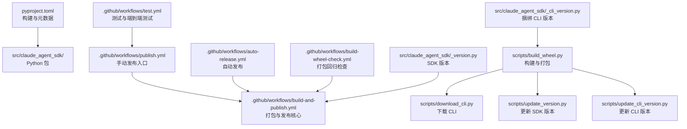
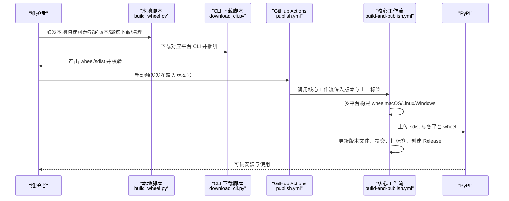
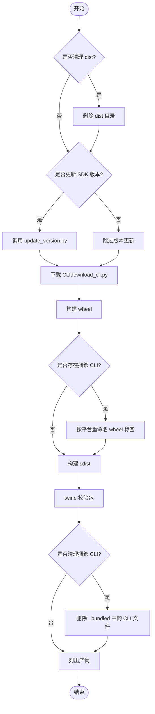
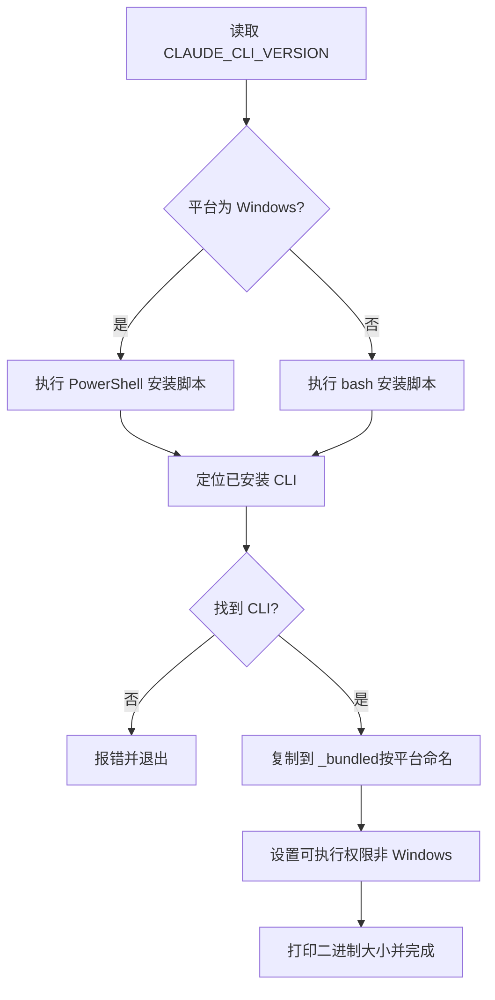
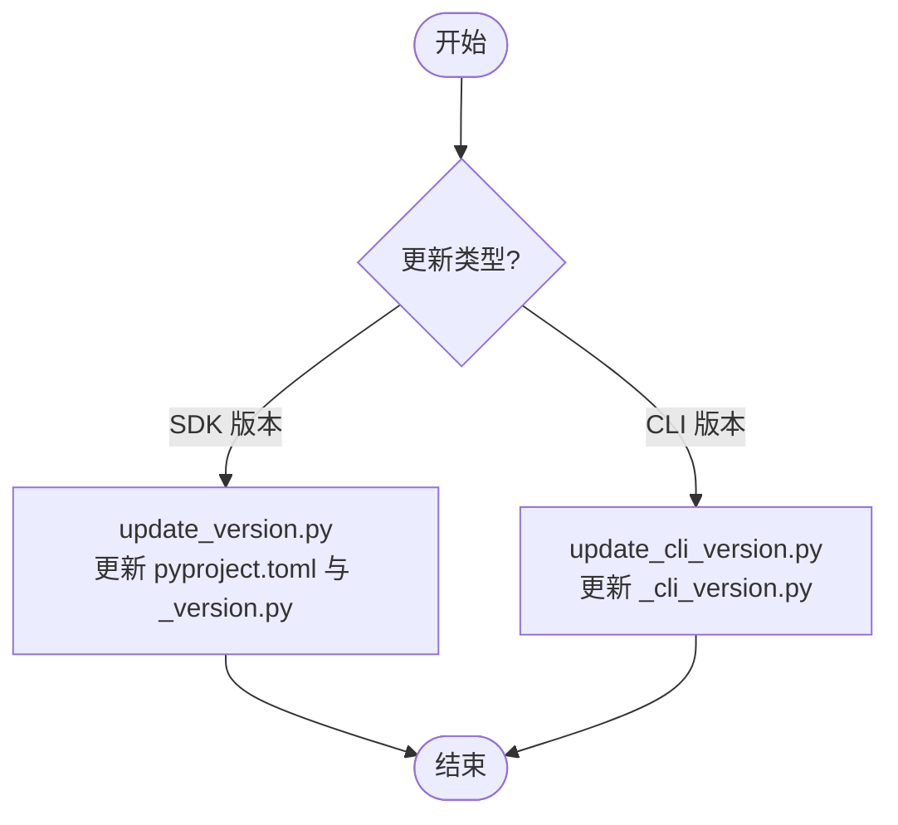
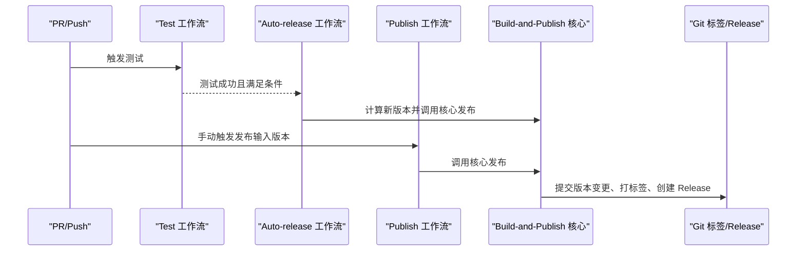
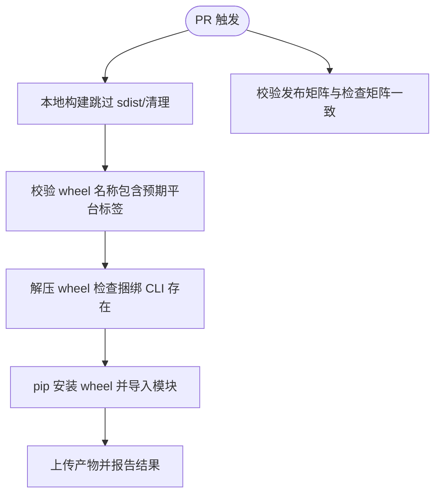
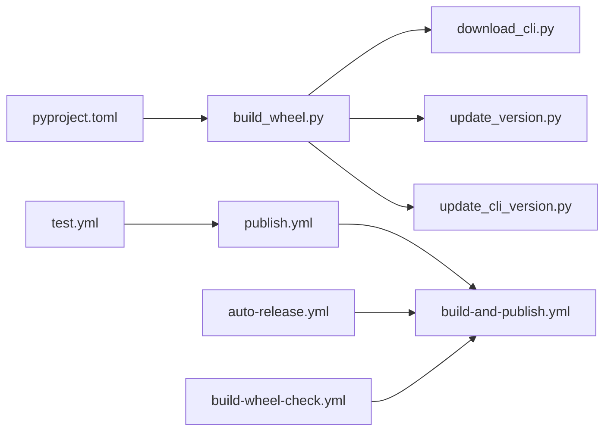

# 部署和发布

<cite>
**本文引用的文件**
- [RELEASING.md](file://RELEASING.md)
- [pyproject.toml](file://pyproject.toml)
- [scripts/build_wheel.py](file://scripts/build_wheel.py)
- [scripts/download_cli.py](file://scripts/download_cli.py)
- [scripts/update_version.py](file://scripts/update_version.py)
- [scripts/update_cli_version.py](file://scripts/update_cli_version.py)
- [.github/workflows/build-and-publish.yml](file://.github/workflows/build-and-publish.yml)
- [.github/workflows/publish.yml](file://.github/workflows/publish.yml)
- [.github/workflows/auto-release.yml](file://.github/workflows/auto-release.yml)
- [.github/workflows/build-wheel-check.yml](file://.github/workflows/build-wheel-check.yml)
- [.github/workflows/test.yml](file://.github/workflows/test.yml)
- [src/claude_agent_sdk/_version.py](file://src/claude_agent_sdk/_version.py)
- [src/claude_agent_sdk/_cli_version.py](file://src/claude_agent_sdk/_cli_version.py)
- [README.md](file://README.md)
- [tests/test_build_wheel.py](file://tests/test_build_wheel.py)
</cite>

## 目录
1. [简介](#简介)
2. [项目结构](#项目结构)
3. [核心组件](#核心组件)
4. [架构总览](#架构总览)
5. [详细组件分析](#详细组件分析)
6. [依赖关系分析](#依赖关系分析)
7. [性能考量](#性能考量)
8. [故障排查指南](#故障排查指南)
9. [结论](#结论)
10. [附录](#附录)

## 简介
本指南面向维护者与贡献者，系统讲解 Claude Agent SDK Python 包的本地构建、打包、发布与版本管理流程。内容覆盖：
- 本地构建：轮子文件生成、CLI 二进制下载与捆绑、清理构建产物
- 发布流程：GitHub Actions 工作流配置与手动触发
- 版本管理：语义化版本控制与版本更新脚本
- PyPI 发布：上传与包验证
- 平台兼容：多平台打包矩阵与注意事项
- 打包策略：CLI 版本管理与捆绑策略
- 质量保证：测试检查清单与回归防护
- 回退与紧急修复：操作指引

## 项目结构
该仓库采用“源码在 src 下、脚本在 scripts 下、CI 在 .github/workflows 下”的清晰分层组织。关键目录与文件职责如下：
- src/claude_agent_sdk：Python 包源码与内部实现
- scripts：本地构建与版本更新脚本
- .github/workflows：自动化工作流（测试、打包、发布）
- pyproject.toml：项目元数据、构建后端与工具配置
- README.md：使用说明与本地构建指引
- RELEASING.md：发布策略与流程说明

图表来源
- [pyproject.toml:1-109](file://pyproject.toml#L1-L109)
- [scripts/build_wheel.py:1-393](file://scripts/build_wheel.py#L1-L393)
- [scripts/download_cli.py:1-158](file://scripts/download_cli.py#L1-L158)
- [.github/workflows/publish.yml:1-84](file://.github/workflows/publish.yml#L1-L84)
- [.github/workflows/build-and-publish.yml:1-135](file://.github/workflows/build-and-publish.yml#L1-L135)
- [.github/workflows/auto-release.yml:1-55](file://.github/workflows/auto-release.yml#L1-L55)
- [.github/workflows/build-wheel-check.yml:1-108](file://.github/workflows/build-wheel-check.yml#L1-L108)
- [.github/workflows/test.yml:1-171](file://.github/workflows/test.yml#L1-L171)
- [src/claude_agent_sdk/_version.py:1-4](file://src/claude_agent_sdk/_version.py#L1-L4)
- [src/claude_agent_sdk/_cli_version.py:1-4](file://src/claude_agent_sdk/_cli_version.py#L1-L4)

章节来源
- [pyproject.toml:1-109](file://pyproject.toml#L1-L109)
- [README.md:290-360](file://README.md#L290-L360)

## 核心组件
- 构建脚本：scripts/build_wheel.py
  - 功能：下载 CLI、构建 wheel 与 sdist、校验包、清理捆绑 CLI、列出产物
  - 关键路径：[scripts/build_wheel.py:1-393](file://scripts/build_wheel.py#L1-L393)
- CLI 下载脚本：scripts/download_cli.py
  - 功能：按平台下载官方安装脚本并复制 CLI 到捆绑目录
  - 关键路径：[scripts/download_cli.py:1-158](file://scripts/download_cli.py#L1-L158)
- 版本更新脚本：scripts/update_version.py、scripts/update_cli_version.py
  - 功能：同步更新 pyproject.toml 与 _version.py；更新捆绑 CLI 版本
  - 关键路径：[scripts/update_version.py:1-50](file://scripts/update_version.py#L1-L50)、[scripts/update_cli_version.py:1-33](file://scripts/update_cli_version.py#L1-L33)
- 发布工作流：.github/workflows/publish.yml、.github/workflows/build-and-publish.yml、.github/workflows/auto-release.yml
  - 功能：手动触发或自动触发的完整发布流水线，含多平台打包、上传 PyPI、打标签与创建 GitHub Release
  - 关键路径：[.github/workflows/publish.yml:1-84](file://.github/workflows/publish.yml#L1-L84)、[.github/workflows/build-and-publish.yml:1-135](file://.github/workflows/build-and-publish.yml#L1-L135)、[.github/workflows/auto-release.yml:1-55](file://.github/workflows/auto-release.yml#L1-L55)
- 版本文件：src/claude_agent_sdk/_version.py、src/claude_agent_sdk/_cli_version.py
  - 功能：记录 SDK 与捆绑 CLI 的当前版本
  - 关键路径：[_version.py:1-4](file://src/claude_agent_sdk/_version.py#L1-L4)、[_cli_version.py:1-4](file://src/claude_agent_sdk/_cli_version.py#L1-L4)
- 测试与回归检查：.github/workflows/test.yml、.github/workflows/build-wheel-check.yml、tests/test_build_wheel.py
  - 功能：单元测试、端到端测试、打包回归检查（校验平台标签与捆绑 CLI 存在）
  - 关键路径：[test_build_wheel.py:1-61](file://tests/test_build_wheel.py#L1-L61)

章节来源
- [scripts/build_wheel.py:1-393](file://scripts/build_wheel.py#L1-L393)
- [scripts/download_cli.py:1-158](file://scripts/download_cli.py#L1-L158)
- [scripts/update_version.py:1-50](file://scripts/update_version.py#L1-L50)
- [scripts/update_cli_version.py:1-33](file://scripts/update_cli_version.py#L1-L33)
- [.github/workflows/publish.yml:1-84](file://.github/workflows/publish.yml#L1-L84)
- [.github/workflows/build-and-publish.yml:1-135](file://.github/workflows/build-and-publish.yml#L1-L135)
- [.github/workflows/auto-release.yml:1-55](file://.github/workflows/auto-release.yml#L1-L55)
- [src/claude_agent_sdk/_version.py:1-4](file://src/claude_agent_sdk/_version.py#L1-L4)
- [src/claude_agent_sdk/_cli_version.py:1-4](file://src/claude_agent_sdk/_cli_version.py#L1-L4)
- [.github/workflows/test.yml:1-171](file://.github/workflows/test.yml#L1-L171)
- [tests/test_build_wheel.py:1-61](file://tests/test_build_wheel.py#L1-L61)

## 架构总览
下图展示从本地构建到 PyPI 发布的全链路：

图表来源
- [scripts/build_wheel.py:310-393](file://scripts/build_wheel.py#L310-L393)
- [scripts/download_cli.py:51-158](file://scripts/download_cli.py#L51-L158)
- [.github/workflows/publish.yml:11-84](file://.github/workflows/publish.yml#L11-L84)
- [.github/workflows/build-and-publish.yml:16-135](file://.github/workflows/build-and-publish.yml#L16-L135)

章节来源
- [README.md:300-360](file://README.md#L300-L360)
- [RELEASING.md:19-76](file://RELEASING.md#L19-L76)

## 详细组件分析

### 组件 A：本地构建与打包（build_wheel.py）
- 主要职责
  - 可选更新 SDK 版本（调用 update_version.py）
  - 下载 CLI（调用 download_cli.py），支持环境变量指定版本
  - 构建 wheel 与 sdist
  - 平台标签重命名（retag）以适配多平台 wheel
  - 使用 twine 检查包
  - 清理捆绑 CLI 或 dist 目录
  - 列出产物并输出下一步建议
- 关键逻辑
  - 平台标签映射：macOS（arm/x86）、manylinux（x86_64/aarch64）、Windows（amd64/arm64/32）
  - 若检测到捆绑 CLI，将通用 wheel 重命名为平台特定标签
  - 通过 twine 检查包元信息与许可证等
- 使用示例（路径）
  - 本地构建：[scripts/build_wheel.py:310-393](file://scripts/build_wheel.py#L310-L393)
  - 指定版本：[scripts/build_wheel.py:315-344](file://scripts/build_wheel.py#L315-L344)
  - 跳过下载/仅构建/清理：[scripts/build_wheel.py:324-344](file://scripts/build_wheel.py#L324-L344)

图表来源
- [scripts/build_wheel.py:103-393](file://scripts/build_wheel.py#L103-L393)
- [scripts/download_cli.py:51-158](file://scripts/download_cli.py#L51-L158)

章节来源
- [scripts/build_wheel.py:1-393](file://scripts/build_wheel.py#L1-L393)
- [tests/test_build_wheel.py:21-61](file://tests/test_build_wheel.py#L21-L61)

### 组件 B：CLI 下载与捆绑（download_cli.py）
- 主要职责
  - 读取环境变量 CLAUDE_CLI_VERSION（默认 latest）
  - 跨平台执行官方安装脚本（Windows 使用 PowerShell，类 Unix 使用 bash）
  - 定位已安装 CLI 并复制到 src/claude_agent_sdk/_bundled，按平台命名（claude 或 claude.exe）
  - 设置可执行权限（非 Windows）
- 注意事项
  - Windows 平台需允许执行策略
  - 若未找到已安装 CLI，会直接失败退出

图表来源
- [scripts/download_cli.py:16-158](file://scripts/download_cli.py#L16-L158)

章节来源
- [scripts/download_cli.py:1-158](file://scripts/download_cli.py#L1-L158)

### 组件 C：版本管理与更新（update_version.py、update_cli_version.py）
- SDK 版本更新
  - 同步更新 pyproject.toml 与 src/claude_agent_sdk/_version.py
  - 用于手动发布时指定新版本
- 捆绑 CLI 版本更新
  - 更新 src/claude_agent_sdk/_cli_version.py
  - 用于自动发布（CLI 升级触发）或手动指定捆绑 CLI 版本

图表来源
- [scripts/update_version.py:9-42](file://scripts/update_version.py#L9-L42)
- [scripts/update_cli_version.py:9-24](file://scripts/update_cli_version.py#L9-L24)

章节来源
- [scripts/update_version.py:1-50](file://scripts/update_version.py#L1-L50)
- [scripts/update_cli_version.py:1-33](file://scripts/update_cli_version.py#L1-L33)

### 组件 D：发布工作流（publish.yml 与 build-and-publish.yml）
- 手动发布（publish.yml）
  - 测试：在多个 Python 版本运行 pytest
  - 代码检查：ruff 与 mypy
  - 调用 build-and-publish.yml 完成打包、上传、打标签与创建 Release
- 核心发布（build-and-publish.yml）
  - 多平台矩阵：ubuntu-latest（manylinux x86_64）、ubuntu-24.04-arm（manylinux aarch64）、macos-latest（arm64）、macos-15-intel（x86_64）、windows-latest（amd64）
  - 上传：twine 上传 dist/* 至 PyPI
  - 提交与标签：更新版本文件、提交、打标签、推送至 main 并创建 GitHub Release
- 自动发布（auto-release.yml）
  - 基于 Test 工作流完成后且提交消息以“chore: bump bundled CLI version to”开头触发
  - 自动计算 SDK 补丁版本并调用核心发布流程

图表来源
- [.github/workflows/test.yml:1-171](file://.github/workflows/test.yml#L1-L171)
- [.github/workflows/auto-release.yml:9-55](file://.github/workflows/auto-release.yml#L9-L55)
- [.github/workflows/publish.yml:11-84](file://.github/workflows/publish.yml#L11-L84)
- [.github/workflows/build-and-publish.yml:16-135](file://.github/workflows/build-and-publish.yml#L16-L135)

章节来源
- [.github/workflows/publish.yml:1-84](file://.github/workflows/publish.yml#L1-L84)
- [.github/workflows/build-and-publish.yml:1-135](file://.github/workflows/build-and-publish.yml#L1-L135)
- [.github/workflows/auto-release.yml:1-55](file://.github/workflows/auto-release.yml#L1-L55)

### 组件 E：打包回归检查（build-wheel-check.yml）
- 目标：在 PR 中提前发现打包问题，避免发布时才发现
- 步骤
  - 在每个目标平台执行本地构建（跳过 sdist、清理捆绑 CLI）
  - 校验 wheel 文件名包含预期平台标签
  - 解压 wheel 校验包含对应平台的捆绑 CLI
  - 安装 wheel 并导入模块，确认捆绑 CLI 存在
- 矩阵一致性检查：确保与发布矩阵一致

图表来源
- [.github/workflows/build-wheel-check.yml:15-108](file://.github/workflows/build-wheel-check.yml#L15-L108)

章节来源
- [.github/workflows/build-wheel-check.yml:1-108](file://.github/workflows/build-wheel-check.yml#L1-L108)

## 依赖关系分析
- 构建后端与打包
  - 使用 hatchling 作为构建后端，wheel 与 sdist 目标限定包路径
  - 关键路径：[pyproject.toml:1-109](file://pyproject.toml#L1-L109)
- 本地构建依赖
  - build、wheel、twine 由脚本安装
  - 关键路径：[scripts/build_wheel.py:29-31](file://scripts/build_wheel.py#L29-L31)
- 版本与 CLI 版本
  - SDK 版本与捆绑 CLI 版本分别管理，遵循语义化版本
  - 关键路径：[_version.py:3-4](file://src/claude_agent_sdk/_version.py#L3-L4)、[_cli_version.py:3-4](file://src/claude_agent_sdk/_cli_version.py#L3-L4)
- 工作流间耦合
  - publish.yml 依赖 test.yml 与 lint 步骤，再调用 build-and-publish.yml
  - auto-release.yml 依赖 test 工作流成功与提交消息规则
  - 关键路径：[publish.yml:11-84](file://.github/workflows/publish.yml#L11-L84)、[auto-release.yml:9-55](file://.github/workflows/auto-release.yml#L9-L55)

图表来源
- [pyproject.toml:1-109](file://pyproject.toml#L1-L109)
- [scripts/build_wheel.py:1-393](file://scripts/build_wheel.py#L1-L393)
- [scripts/download_cli.py:1-158](file://scripts/download_cli.py#L1-L158)
- [scripts/update_version.py:1-50](file://scripts/update_version.py#L1-L50)
- [scripts/update_cli_version.py:1-33](file://scripts/update_cli_version.py#L1-L33)
- [.github/workflows/publish.yml:1-84](file://.github/workflows/publish.yml#L1-L84)
- [.github/workflows/auto-release.yml:1-55](file://.github/workflows/auto-release.yml#L1-L55)
- [.github/workflows/test.yml:1-171](file://.github/workflows/test.yml#L1-L171)
- [.github/workflows/build-wheel-check.yml:1-108](file://.github/workflows/build-wheel-check.yml#L1-L108)

章节来源
- [pyproject.toml:1-109](file://pyproject.toml#L1-L109)
- [scripts/build_wheel.py:1-393](file://scripts/build_wheel.py#L1-L393)
- [.github/workflows/publish.yml:1-84](file://.github/workflows/publish.yml#L1-L84)
- [.github/workflows/auto-release.yml:1-55](file://.github/workflows/auto-release.yml#L1-L55)
- [.github/workflows/test.yml:1-171](file://.github/workflows/test.yml#L1-L171)
- [.github/workflows/build-wheel-check.yml:1-108](file://.github/workflows/build-wheel-check.yml#L1-L108)

## 性能考量
- 本地构建
  - 优先复用已存在的捆绑 CLI，可通过参数跳过下载以加速本地迭代
  - 构建完成后可选择清理捆绑 CLI，减小 dist 目录体积
- 多平台打包
  - 发布阶段在五个 runner 上并行构建，耗时主要受网络与下载影响
  - 建议在稳定网络环境下进行发布，避免重复下载 CLI
- 包体积
  - 捆绑 CLI 会增加 wheel 体积，但提升首次安装可用性
  - 如需最小体积，可在本地构建时清理捆绑 CLI（不推荐发布）

## 故障排查指南
- 本地构建失败
  - 检查 twine 是否安装（脚本会尝试调用 twine check）
  - 确认 Python 版本满足 requires-python（3.10+）
  - 参考路径：[scripts/build_wheel.py:237-268](file://scripts/build_wheel.py#L237-L268)、[pyproject.toml:10](file://pyproject.toml#L10)
- CLI 下载失败
  - Windows 平台需允许执行策略（PowerShell）
  - 确认网络可达安装脚本地址
  - 参考路径：[scripts/download_cli.py:58-98](file://scripts/download_cli.py#L58-L98)
- 打包标签错误
  - 平台标签映射由脚本决定，若自定义平台需确保标签正确
  - 参考路径：[scripts/build_wheel.py:114-150](file://scripts/build_wheel.py#L114-L150)、[tests/test_build_wheel.py:21-61](file://tests/test_build_wheel.py#L21-L61)
- 发布失败
  - 检查 PyPI 凭据（PYPI_API_TOKEN）与 GitHub 机密（DEPLOY_KEY、ANTHROPIC_API_KEY）
  - 确认上一个标签存在以便生成变更日志
  - 参考路径：[RELEASING.md:69-76](file://RELEASING.md#L69-L76)、[build-and-publish.yml:94-135](file://.github/workflows/build-and-publish.yml#L94-L135)
- 自动发布未触发
  - 确认提交消息以“chore: bump bundled CLI version to”开头
  - 确认 _cli_version.py 确实被修改
  - 参考路径：[auto-release.yml:12-29](file://.github/workflows/auto-release.yml#L12-L29)

章节来源
- [scripts/build_wheel.py:237-268](file://scripts/build_wheel.py#L237-L268)
- [scripts/download_cli.py:58-98](file://scripts/download_cli.py#L58-L98)
- [tests/test_build_wheel.py:21-61](file://tests/test_build_wheel.py#L21-L61)
- [RELEASING.md:69-76](file://RELEASING.md#L69-L76)
- [.github/workflows/build-and-publish.yml:94-135](file://.github/workflows/build-and-publish.yml#L94-L135)
- [.github/workflows/auto-release.yml:12-29](file://.github/workflows/auto-release.yml#L12-L29)

## 结论
本指南提供了从本地构建到发布的完整流程与最佳实践。通过脚本化与工作流自动化，确保版本管理、打包与发布的一致性与可追溯性。建议在每次发布前完成本地构建与回归检查，并在 CI 中保持严格的测试与格式/类型检查。

## 附录

### A. 本地构建步骤（摘要）
- 安装构建依赖：pip install build twine
- 运行构建脚本：python scripts/build_wheel.py
- 可选参数
  - --version：更新 SDK 版本
  - --cli-version：指定 CLI 版本
  - --skip-download：跳过下载 CLI（使用现有）
  - --clean：构建后清理捆绑 CLI
  - --clean-dist：清理 dist 目录
- 参考路径：[README.md:300-332](file://README.md#L300-L332)、[scripts/build_wheel.py:310-393](file://scripts/build_wheel.py#L310-L393)

章节来源
- [README.md:300-332](file://README.md#L300-L332)
- [scripts/build_wheel.py:310-393](file://scripts/build_wheel.py#L310-L393)

### B. 发布流程（手动与自动）
- 手动发布
  - 在 Actions 页面选择 publish.yml，输入版本号
  - 流程：测试 → 调用 build-and-publish.yml → 上传 PyPI → 提交版本 → 打标签 → 创建 Release
  - 参考路径：[publish.yml:1-84](file://.github/workflows/publish.yml#L1-L84)、[build-and-publish.yml:1-135](file://.github/workflows/build-and-publish.yml#L1-L135)
- 自动发布
  - 当提交消息匹配规则且 _cli_version.py 更新时触发
  - 自动计算 SDK 补丁版本并发布
  - 参考路径：[auto-release.yml:1-55](file://.github/workflows/auto-release.yml#L1-L55)

章节来源
- [.github/workflows/publish.yml:1-84](file://.github/workflows/publish.yml#L1-L84)
- [.github/workflows/build-and-publish.yml:1-135](file://.github/workflows/build-and-publish.yml#L1-L135)
- [.github/workflows/auto-release.yml:1-55](file://.github/workflows/auto-release.yml#L1-L55)

### C. 版本管理策略
- 两套版本
  - SDK 版本：pyproject.toml 与 src/claude_agent_sdk/_version.py
  - 捆绑 CLI 版本：src/claude_agent_sdk/_cli_version.py
- 语义化版本（MAJOR.MINOR.PATCH），Git 标签格式为 vX.Y.Z
- 自动发布：CLI 升级 → SDK 补丁版本递增
- 手动发布：可指定任意版本（如次版本/主版本）
- 参考路径：[RELEASING.md:19-46](file://RELEASING.md#L19-L46)、[_version.py:3-4](file://src/claude_agent_sdk/_version.py#L3-L4)、[_cli_version.py:3-4](file://src/claude_agent_sdk/_cli_version.py#L3-L4)

章节来源
- [RELEASING.md:19-46](file://RELEASING.md#L19-L46)
- [src/claude_agent_sdk/_version.py:3-4](file://src/claude_agent_sdk/_version.py#L3-L4)
- [src/claude_agent_sdk/_cli_version.py:3-4](file://src/claude_agent_sdk/_cli_version.py#L3-L4)

### D. PyPI 发布与包验证
- 上传命令：twine upload dist/*
- 机密要求：PYPI_API_TOKEN（上传）、ANTHROPIC_API_KEY（变更日志与 e2e）、DEPLOY_KEY（直接推送 main）
- 包验证：twine check dist/*
- 参考路径：[build-and-publish.yml:89-97](file://.github/workflows/build-and-publish.yml#L89-L97)、[build-wheel-check.yml:79-84](file://.github/workflows/build-wheel-check.yml#L79-L84)、[RELEASING.md:69-76](file://RELEASING.md#L69-L76)

章节来源
- [.github/workflows/build-and-publish.yml:89-97](file://.github/workflows/build-and-publish.yml#L89-L97)
- [.github/workflows/build-wheel-check.yml:79-84](file://.github/workflows/build-wheel-check.yml#L79-L84)
- [RELEASING.md:69-76](file://RELEASING.md#L69-L76)

### E. 平台兼容与打包矩阵
- 发布矩阵（runner → 平台标签）
  - ubuntu-latest → manylinux_2_17_x86_64
  - ubuntu-24.04-arm → manylinux_2_17_aarch64
  - macos-latest → macosx_11_0_arm64
  - macos-15-intel → macosx_11_0_x86_64
  - windows-latest → win_amd64
- 本地构建标签映射参考：[scripts/build_wheel.py:114-150](file://scripts/build_wheel.py#L114-L150)
- 回归检查矩阵同步：[build-wheel-check.yml:92-108](file://.github/workflows/build-wheel-check.yml#L92-L108)

章节来源
- [RELEASING.md:7-17](file://RELEASING.md#L7-L17)
- [scripts/build_wheel.py:114-150](file://scripts/build_wheel.py#L114-L150)
- [.github/workflows/build-wheel-check.yml:92-108](file://.github/workflows/build-wheel-check.yml#L92-L108)

### F. 打包中的 CLI 版本管理与捆绑策略
- 默认使用 _cli_version.py 中的版本，也可通过环境变量或脚本参数覆盖
- 捆绑策略：将 CLI 复制到 src/claude_agent_sdk/_bundled，随 wheel 分发
- 平台差异：Windows 使用 claude.exe，类 Unix 使用 claude
- 参考路径：[scripts/build_wheel.py:72-101](file://scripts/build_wheel.py#L72-L101)、[scripts/download_cli.py:101-137](file://scripts/download_cli.py#L101-L137)

章节来源
- [scripts/build_wheel.py:72-101](file://scripts/build_wheel.py#L72-L101)
- [scripts/download_cli.py:101-137](file://scripts/download_cli.py#L101-L137)

### G. 质量保证与测试检查清单
- 本地
  - 运行本地构建并 twine 检查包
  - 清理 dist 与捆绑 CLI，确保产物干净
- CI
  - 单元测试：pytest tests/（含覆盖率）
  - 端到端测试：e2e-tests（需要 API 密钥）
  - 代码质量：ruff 检查与格式、mypy 类型检查
  - 打包回归：build-wheel-check.yml 校验平台标签与捆绑 CLI
- 参考路径：[test.yml:1-171](file://.github/workflows/test.yml#L1-L171)、[build-wheel-check.yml:1-108](file://.github/workflows/build-wheel-check.yml#L1-L108)

章节来源
- [.github/workflows/test.yml:1-171](file://.github/workflows/test.yml#L1-L171)
- [.github/workflows/build-wheel-check.yml:1-108](file://.github/workflows/build-wheel-check.yml#L1-L108)

### H. 回退与紧急修复操作指南
- 回退版本
  - 通过 Git 标签回退：删除最新标签与 Release，回退到上一版本标签
  - 重新发布旧版本：在 publish.yml 中输入旧版本号
- 紧急修复
  - 修复后重新触发 build-and-publish.yml，或使用 auto-release（若为 CLI 升级）
  - 确保测试与打包检查全部通过后再发布
- 参考路径：[build-and-publish.yml:119-135](file://.github/workflows/build-and-publish.yml#L119-L135)、[auto-release.yml:1-55](file://.github/workflows/auto-release.yml#L1-L55)

章节来源
- [.github/workflows/build-and-publish.yml:119-135](file://.github/workflows/build-and-publish.yml#L119-L135)
- [.github/workflows/auto-release.yml:1-55](file://.github/workflows/auto-release.yml#L1-L55)