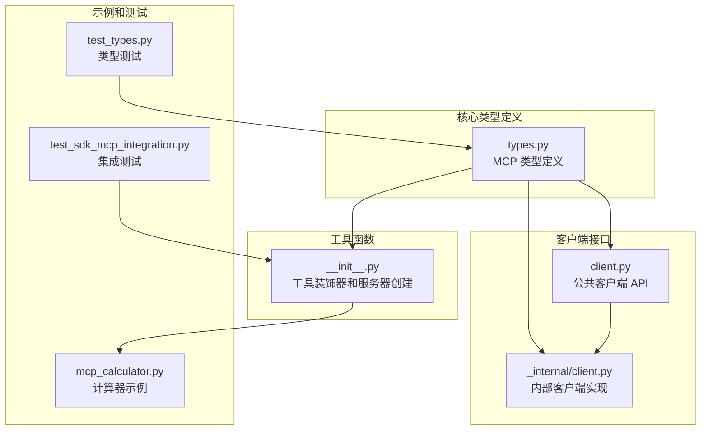
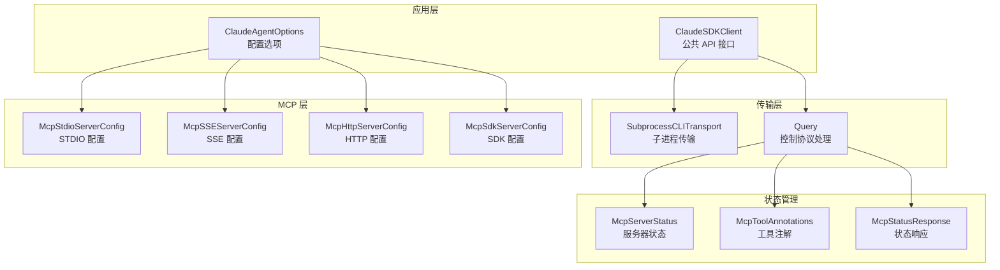
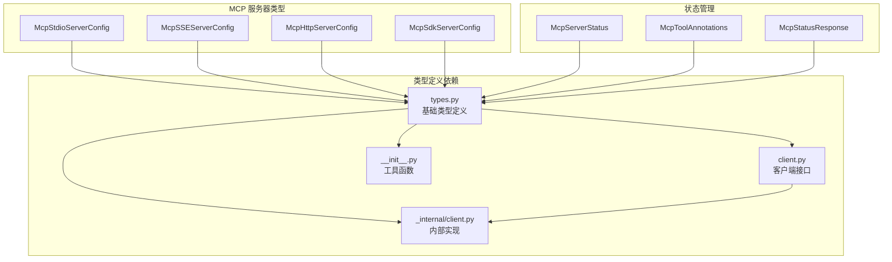

# MCP 服务器配置

<cite>
**本文档引用的文件**
- [types.py](file://src/claude_agent_sdk/types.py)
- [client.py](file://src/claude_agent_sdk/client.py)
- [_internal/client.py](file://src/claude_agent_sdk/_internal/client.py)
- [__init__.py](file://src/claude_agent_sdk/__init__.py)
- [mcp_calculator.py](file://examples/mcp_calculator.py)
- [test_sdk_mcp_integration.py](file://tests/test_sdk_mcp_integration.py)
- [test_types.py](file://tests/test_types.py)
</cite>

## 目录
1. [简介](#简介)
2. [项目结构](#项目结构)
3. [核心组件](#核心组件)
4. [架构概览](#架构概览)
5. [详细组件分析](#详细组件分析)
6. [依赖关系分析](#依赖关系分析)
7. [性能考虑](#性能考虑)
8. [故障排除指南](#故障排除指南)
9. [结论](#结论)
10. [附录](#附录)

## 简介
本文档全面介绍了 Claude Agent SDK 中的 MCP（Model Context Protocol）服务器配置系统。MCP 是一种标准化协议，允许 AI 模型与外部工具和服务进行交互。本 SDK 提供了四种主要的 MCP 服务器配置类型：标准输入输出（McpStdioServerConfig）、服务器发送事件（McpSSEServerConfig）、HTTP 服务器（McpHttpServerConfig）和 SDK 服务器（McpSdkServerConfig）。文档详细说明了每种配置类型的参数、使用场景、状态管理和工具注解功能，并提供了实际的集成示例和故障排除指南。

## 项目结构
Claude Agent SDK 的 MCP 服务器配置分布在多个模块中，采用分层架构设计：



**图表来源**
- [types.py:493-640](file://src/claude_agent_sdk/types.py#L493-L640)
- [client.py:21-500](file://src/claude_agent_sdk/client.py#L21-L500)
- [__init__.py:178-341](file://src/claude_agent_sdk/__init__.py#L178-L341)

**章节来源**
- [types.py:1-120](file://src/claude_agent_sdk/types.py#L1-L120)
- [client.py:1-100](file://src/claude_agent_sdk/client.py#L1-L100)

## 核心组件
MCP 服务器配置系统的核心组件包括四种服务器配置类型和相关的状态管理机制：

### MCP 服务器配置类型
SDK 定义了四种主要的 MCP 服务器配置类型，每种都有特定的用途和参数要求：

1. **标准输入输出服务器配置** (`McpStdioServerConfig`)
2. **服务器发送事件服务器配置** (`McpSSEServerConfig`)
3. **HTTP 服务器配置** (`McpHttpServerConfig`)
4. **SDK 服务器配置** (`McpSdkServerConfig`)

### MCP 服务器状态管理
SDK 提供了完整的服务器状态管理系统，包括连接状态跟踪、服务器信息获取和工具列表管理。

**章节来源**
- [types.py:493-640](file://src/claude_agent_sdk/types.py#L493-L640)

## 架构概览
MCP 服务器配置系统采用分层架构，从底层的类型定义到高层的客户端接口：



**图表来源**
- [client.py:94-180](file://src/claude_agent_sdk/client.py#L94-L180)
- [types.py:532-640](file://src/claude_agent_sdk/types.py#L532-L640)

## 详细组件分析

### 标准输入输出服务器配置 (McpStdioServerConfig)
标准输入输出服务器配置用于连接本地可执行文件或脚本，通过标准输入输出流进行通信。

#### 参数说明
- `type`: 可选的服务器类型标识符，默认为 "stdio"
- `command`: 要执行的命令路径
- `args`: 命令行参数列表（可选）
- `env`: 环境变量字典（可选）

#### 使用场景
- 连接本地开发的 MCP 工具
- 执行系统命令作为 MCP 服务
- 集成现有的 STDIO 兼容工具

**章节来源**
- [types.py:494-501](file://src/claude_agent_sdk/types.py#L494-L501)

### 服务器发送事件服务器配置 (McpSSEServerConfig)
服务器发送事件配置用于连接支持 Server-Sent Events 协议的 MCP 服务器。

#### 参数说明
- `type`: 必需的服务器类型标识符，值为 "sse"
- `url`: SSE 服务器的 URL 地址
- `headers`: HTTP 请求头字典（可选）

#### 使用场景
- 连接云托管的 MCP 服务器
- 实时数据流处理
- 事件驱动的工具调用

**章节来源**
- [types.py:503-510](file://src/claude_agent_sdk/types.py#L503-L510)

### HTTP 服务器配置 (McpHttpServerConfig)
HTTP 服务器配置用于连接基于 HTTP 的 MCP 服务器。

#### 参数说明
- `type`: 必需的服务器类型标识符，值为 "http"
- `url`: HTTP 服务器的 URL 地址
- `headers`: HTTP 请求头字典（可选）

#### 使用场景
- 连接 RESTful MCP 服务
- 企业内部 MCP 服务器
- 需要 HTTP 特定功能的工具

**章节来源**
- [types.py:511-518](file://src/claude_agent_sdk/types.py#L511-L518)

### SDK 服务器配置 (McpSdkServerConfig)
SDK 服务器配置用于在应用程序内部创建和管理 MCP 服务器实例。

#### 参数说明
- `type`: 必需的服务器类型标识符，值为 "sdk"
- `name`: 服务器名称（用于配置引用）
- `instance`: MCP Server 实例对象

#### 使用场景
- 在同一进程中运行 MCP 服务器
- 直接访问应用程序状态
- 无需进程间通信开销

**章节来源**
- [types.py:519-526](file://src/claude_agent_sdk/types.py#L519-L526)

### MCP 服务器状态管理
SDK 提供了完整的服务器状态管理功能，包括连接状态跟踪和实时状态查询。

#### 连接状态类型
- `"connected"`: 服务器已成功连接
- `"failed"`: 连接失败
- `"needs-auth"`: 需要身份验证
- `"pending"`: 连接正在进行中
- `"disabled"`: 服务器被禁用

#### 状态信息结构
- `name`: 服务器名称
- `status`: 当前连接状态
- `serverInfo`: 服务器信息（连接时可用）
- `error`: 错误消息（失败时可用）
- `config`: 服务器配置详情
- `scope`: 配置作用域
- `tools`: 工具列表（连接时可用）

**章节来源**
- [types.py:598-630](file://src/claude_agent_sdk/types.py#L598-L630)

### MCP 工具注解 (McpToolAnnotations)
工具注解提供了关于工具行为的重要元数据信息。

#### 注解类型
- `readOnly`: 只读工具（不会修改系统状态）
- `destructive`: 破坏性工具（可能删除或修改重要数据）
- `openWorld`: 开放世界工具（可以访问外部资源）

#### 配置方法
工具注解通过 `@tool` 装饰器的 `annotations` 参数进行配置：
```python
@tool("read_data", "读取数据", {"source": str}, 
     annotations=ToolAnnotations(readOnlyHint=True))
async def read_data(args):
    return {"content": [{"type": "text", "text": f"数据来自 {args['source']}"}]}
```

**章节来源**
- [types.py:572-581](file://src/claude_agent_sdk/types.py#L572-L581)
- [__init__.py:107-175](file://src/claude_agent_sdk/__init__.py#L107-L175)

## 依赖关系分析



**图表来源**
- [types.py:493-640](file://src/claude_agent_sdk/types.py#L493-L640)
- [client.py:11-18](file://src/claude_agent_sdk/client.py#L11-L18)

### 组件耦合度分析
- **高内聚**: 每个配置类型都封装了相关的参数和行为
- **低耦合**: 类型定义独立于具体实现，便于扩展
- **清晰的职责分离**: 类型定义负责数据结构，客户端负责业务逻辑

**章节来源**
- [types.py:493-640](file://src/claude_agent_sdk/types.py#L493-L640)

## 性能考虑
MCP 服务器配置系统在设计时充分考虑了性能因素：

### 服务器类型性能对比
1. **SDK 服务器**: 最高性能，无进程间通信开销
2. **STDIO 服务器**: 中等性能，进程间通信开销较小
3. **HTTP 服务器**: 较低性能，网络延迟影响较大
4. **SSE 服务器**: 性能取决于网络质量，适合实时场景

### 优化建议
- 优先使用 SDK 服务器进行内部工具集成
- 对于外部工具，考虑使用 SDK 服务器包装
- 合理设置超时时间，避免长时间阻塞
- 使用连接池管理 HTTP 连接
- 实现适当的重连机制

## 故障排除指南

### 常见问题及解决方案

#### 连接失败问题
**症状**: 服务器状态显示为 "failed"
**解决方案**:
1. 检查服务器 URL 和端口是否正确
2. 验证网络连接和防火墙设置
3. 确认服务器正在运行且可访问
4. 检查认证凭据是否正确

#### 认证问题
**症状**: 服务器状态显示为 "needs-auth"
**解决方案**:
1. 提供正确的认证信息
2. 检查令牌的有效期
3. 验证权限范围是否足够

#### 工具不可用问题
**症状**: 工具未出现在工具列表中
**解决方案**:
1. 检查服务器连接状态
2. 验证工具注册是否正确
3. 确认工具权限设置

### 调试技巧
1. 使用 `get_mcp_status()` 获取详细的服务器状态信息
2. 检查 `error` 字段获取具体的错误信息
3. 监控服务器连接状态变化
4. 实现适当的日志记录机制

**章节来源**
- [client.py:385-416](file://src/claude_agent_sdk/client.py#L385-L416)
- [types.py:604-630](file://src/claude_agent_sdk/types.py#L604-L630)

## 结论
Claude Agent SDK 的 MCP 服务器配置系统提供了强大而灵活的工具集成能力。通过支持多种服务器配置类型、完善的状态管理和丰富的工具注解功能，开发者可以轻松地将各种外部工具和服务集成到 AI 应用中。SDK 的设计注重性能、可扩展性和易用性，为构建复杂的 AI 工具生态系统奠定了坚实的基础。

## 附录

### 实际集成示例

#### SDK 服务器集成示例
```python
# 创建计算器 MCP 服务器
calculator = create_sdk_mcp_server(
    name="calculator",
    version="2.0.0",
    tools=[add_numbers, subtract_numbers, multiply_numbers, divide_numbers]
)

# 配置 Claude 使用计算器服务器
options = ClaudeAgentOptions(
    mcp_servers={"calc": calculator},
    allowed_tools=[
        "mcp__calc__add",
        "mcp__calc__subtract",
        "mcp__calc__multiply",
        "mcp__calc__divide"
    ]
)
```

#### 外部服务器集成示例
```python
# 配置外部 MCP 服务器
options = ClaudeAgentOptions(
    mcp_servers={
        "external-api": {
            "type": "http",
            "url": "https://api.example.com/mcp",
            "headers": {"Authorization": "Bearer token"}
        }
    }
)
```

**章节来源**
- [mcp_calculator.py:142-168](file://examples/mcp_calculator.py#L142-L168)
- [test_sdk_mcp_integration.py:162-174](file://tests/test_sdk_mcp_integration.py#L162-L174)

### API 参考

#### 客户端方法
- `get_mcp_status()`: 获取 MCP 服务器状态
- `reconnect_mcp_server()`: 重新连接断开的服务器
- `toggle_mcp_server()`: 启用或禁用服务器

#### 类型定义
- `McpServerConfig`: 服务器配置联合类型
- `McpServerStatus`: 服务器状态信息
- `McpToolAnnotations`: 工具注解类型

**章节来源**
- [client.py:385-416](file://src/claude_agent_sdk/client.py#L385-L416)
- [types.py:527-589](file://src/claude_agent_sdk/types.py#L527-L589)