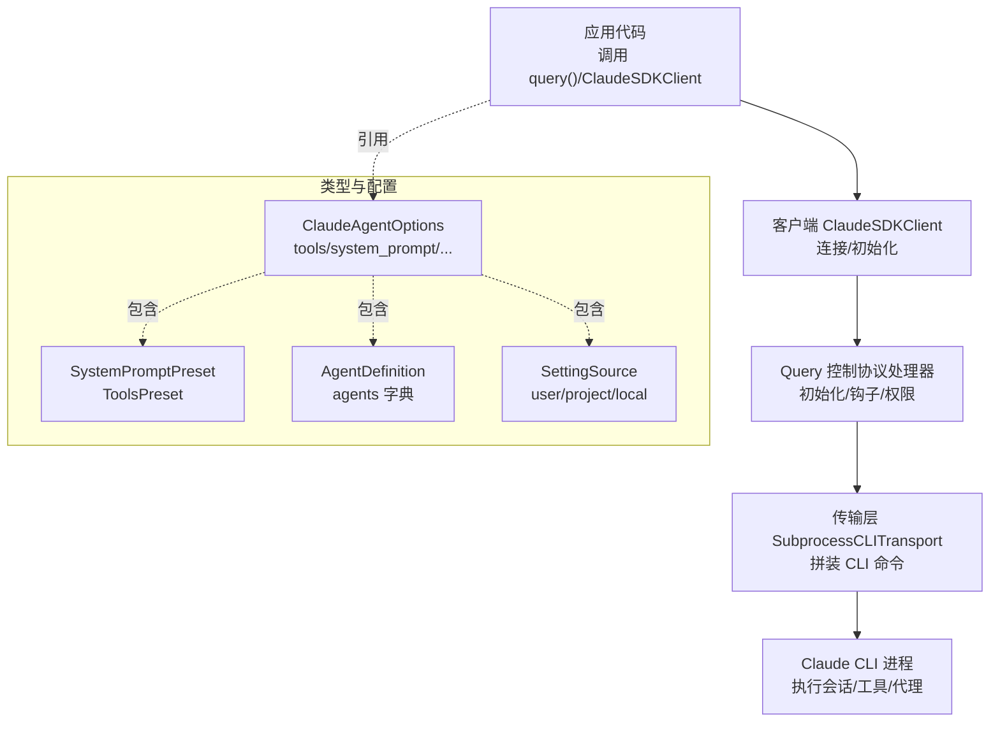
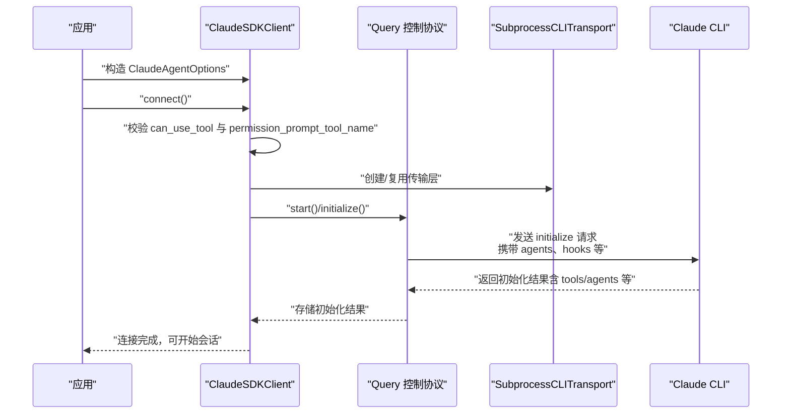
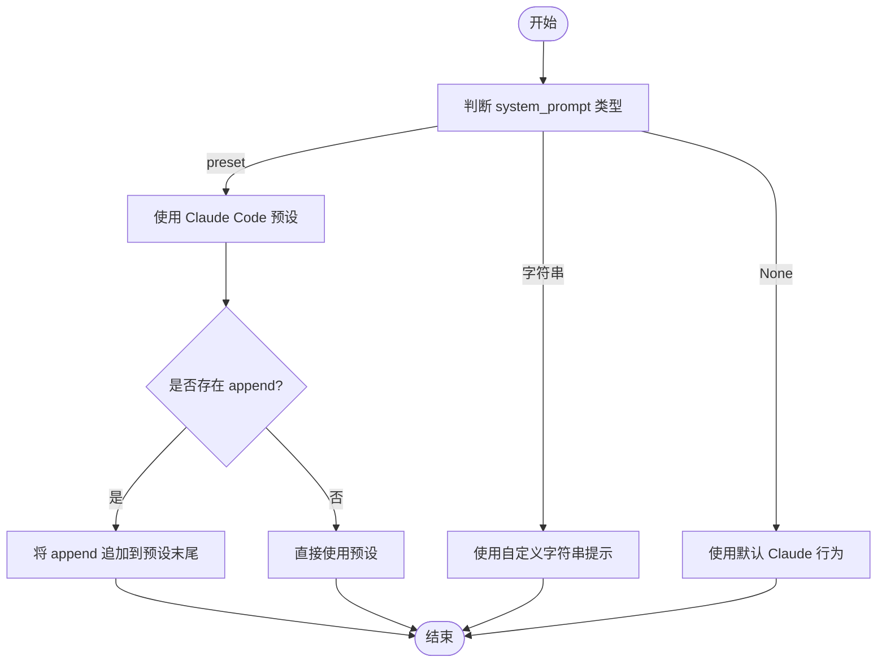
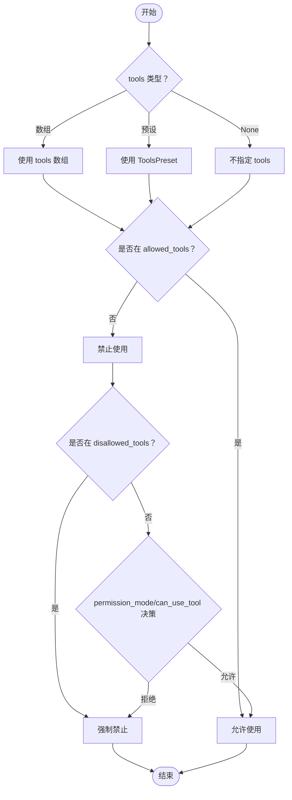
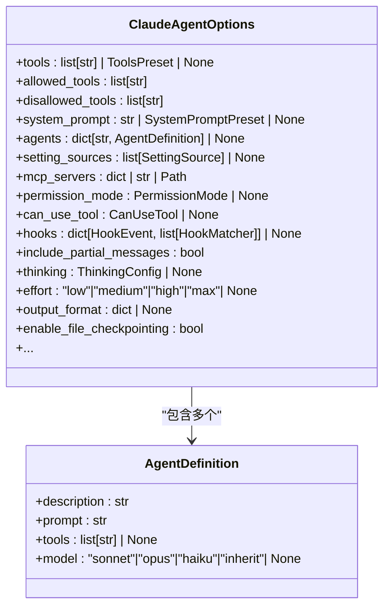
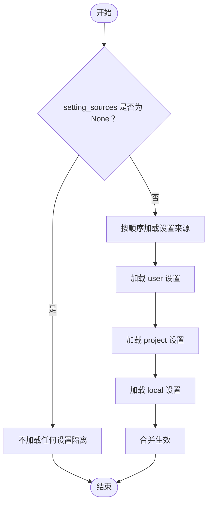
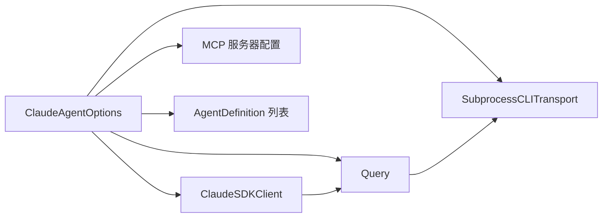

# 基础配置选项

<cite>
**本文引用的文件**
- [types.py](file://src/claude_agent_sdk/types.py)
- [client.py](file://src/claude_agent_sdk/client.py)
- [query.py](file://src/claude_agent_sdk/_internal/query.py)
- [subprocess_cli.py](file://src/claude_agent_sdk/_internal/transport/subprocess_cli.py)
- [system_prompt.py](file://examples/system_prompt.py)
- [tools_option.py](file://examples/tools_option.py)
- [setting_sources.py](file://examples/setting_sources.py)
- [agents.py](file://examples/agents.py)
- [filesystem_agents.py](file://examples/filesystem_agents.py)
- [quick_start.py](file://examples/quick_start.py)
- [test_types.py](file://tests/test_types.py)
- [test_agents_and_settings.py](file://e2e-tests/test_agents_and_settings.py)
</cite>

## 目录
1. [简介](#简介)
2. [项目结构](#项目结构)
3. [核心组件](#核心组件)
4. [架构总览](#架构总览)
5. [详细组件分析](#详细组件分析)
6. [依赖分析](#依赖分析)
7. [性能考虑](#性能考虑)
8. [故障排查指南](#故障排查指南)
9. [结论](#结论)
10. [附录](#附录)

## 简介
本文件聚焦 Claude Agent SDK 的基础配置选项，围绕 ClaudeAgentOptions 类展开，系统讲解以下核心主题：
- 系统提示配置（SystemPromptPreset）：数据类型、默认值、使用场景与实际示例
- 工具预设配置（ToolsPreset）：与 tools 数组、allowed_tools/disallowed_tools 的协作
- 代理定义（AgentDefinition）：自定义代理的结构、注册与使用
- 设置来源（SettingSource）：user/project/local 的优先级与作用域
- 配置验证机制与最佳实践
- 常见配置场景的完整示例路径

目标是帮助开发者快速理解并正确使用基础配置，构建稳定、可维护的代理行为。

## 项目结构
与基础配置相关的核心文件分布如下：
- 类型与配置定义：src/claude_agent_sdk/types.py
- 客户端与初始化流程：src/claude_agent_sdk/client.py、src/claude_agent_sdk/_internal/query.py
- CLI 传输层与命令拼装：src/claude_agent_sdk/_internal/transport/subprocess_cli.py
- 示例与测试：examples/*、tests/*、e2e-tests/*

图表来源
- [client.py:62-180](file://src/claude_agent_sdk/client.py#L62-L180)
- [query.py:119-163](file://src/claude_agent_sdk/_internal/query.py#L119-L163)
- [subprocess_cli.py:315-351](file://src/claude_agent_sdk/_internal/transport/subprocess_cli.py#L315-L351)

章节来源
- [types.py:27-50](file://src/claude_agent_sdk/types.py#L27-L50)
- [types.py:1029-1199](file://src/claude_agent_sdk/types.py#L1029-L1199)
- [client.py:62-180](file://src/claude_agent_sdk/client.py#L62-L180)
- [query.py:119-163](file://src/claude_agent_sdk/_internal/query.py#L119-L163)
- [subprocess_cli.py:315-351](file://src/claude_agent_sdk/_internal/transport/subprocess_cli.py#L315-L351)

## 核心组件
本节对 ClaudeAgentOptions 的关键配置项进行逐项说明，包括数据类型、默认值、典型使用场景与注意事项。

- tools
  - 类型：list[str] | ToolsPreset | None
  - 默认值：None
  - 说明：控制可用工具集合。可直接传入工具名称数组，或使用预设 {"type": "preset", "preset": "claude_code"}。与 allowed_tools/disallowed_tools 协作决定最终可用工具集。
  - 示例路径：[tools_option.py:16-100](file://examples/tools_option.py#L16-L100)

- allowed_tools
  - 类型：list[str]
  - 默认值：[]
  - 说明：白名单工具，无需权限确认即可使用；与 permission_mode 或 can_use_tool 决策配合。
  - 示例路径：[quick_start.py:46-65](file://examples/quick_start.py#L46-L65)

- disallowed_tools
  - 类型：list[str]
  - 默认值：[]
  - 说明：黑名单工具，强制禁止使用。
  - 示例路径：[test_types.py:96-102](file://tests/test_types.py#L96-L102)

- system_prompt
  - 类型：str | SystemPromptPreset | None
  - 默认值：None
  - 说明：系统提示词。可为纯字符串，也可为预设对象 {"type": "preset", "preset": "claude_code"}，并可选 append 字段追加内容。
  - 示例路径：[system_prompt.py:14-75](file://examples/system_prompt.py#L14-L75)

- mcp_servers
  - 类型：dict[str, McpServerConfig] | str | Path
  - 默认值：{}
  - 说明：MCP 服务器配置，支持 stdio/sse/http/sdk/proxy 等多种类型；也可通过字符串或 Path 指定配置来源。
  - 示例路径：[quick_start.py:46-65](file://examples/quick_start.py#L46-L65)

- permission_mode
  - 类型：PermissionMode | None
  - 默认值：None
  - 说明：权限模式，取值范围："default"、"acceptEdits"、"plan"、"bypassPermissions"。
  - 示例路径：[test_types.py:104-117](file://tests/test_types.py#L104-L117)

- can_use_tool
  - 类型：CanUseTool | None
  - 默认值：None
  - 说明：异步工具权限回调，用于动态决策是否允许工具调用；与 permission_prompt_tool_name 互斥。
  - 示例路径：[test_tool_callbacks.py:467-484](file://tests/test_tool_callbacks.py#L467-L484)

- hooks
  - 类型：dict[HookEvent, list[HookMatcher]] | None
  - 默认值：None
  - 说明：事件驱动的钩子匹配器与回调，覆盖 PreToolUse、PostToolUse、UserPromptSubmit 等事件。
  - 示例路径：[quick_start.py:46-65](file://examples/quick_start.py#L46-L65)

- agents
  - 类型：dict[str, AgentDefinition] | None
  - 默认值：None
  - 说明：自定义代理定义字典，键为代理名称，值为 AgentDefinition 对象；与 setting_sources 一起决定代理加载来源。
  - 示例路径：[agents.py:23-120](file://examples/agents.py#L23-L120)

- setting_sources
  - 类型：list[SettingSource] | None
  - 默认值：None
  - 说明：设置来源列表，取值来自 SettingSource："user"、"project"、"local"。当为 None 时不加载任何设置，形成隔离环境。
  - 示例路径：[setting_sources.py:47-131](file://examples/setting_sources.py#L47-L131)

- cwd/cli_path/settings
  - 类型：str | Path | None
  - 默认值：None
  - 说明：工作目录、CLI 路径、设置文件路径，影响 CLI 启动与配置加载。
  - 示例路径：[setting_sources.py:53-118](file://examples/setting_sources.py#L53-L118)

- include_partial_messages
  - 类型：bool
  - 默认值：False
  - 说明：是否包含部分消息事件，便于实时渲染。
  - 示例路径：[quick_start.py:15-24](file://examples/quick_start.py#L15-L24)

- thinking/effort/output_format
  - 类型：ThinkingConfig | None、Literal["low","medium","high","max"] | None、dict[str, Any] | None
  - 默认值：None
  - 说明：思维深度与输出格式控制，后者可结合 JSON Schema 约束结构化输出。
  - 示例路径：[quick_start.py:15-24](file://examples/quick_start.py#L15-L24)

- enable_file_checkpointing
  - 类型：bool
  - 默认值：False
  - 说明：启用文件检查点以便回溯到用户消息时点。
  - 示例路径：[client.py:282-312](file://src/claude_agent_sdk/client.py#L282-L312)

章节来源
- [types.py:1033-1098](file://src/claude_agent_sdk/types.py#L1033-L1098)
- [test_types.py:84-160](file://tests/test_types.py#L84-L160)
- [quick_start.py:15-65](file://examples/quick_start.py#L15-L65)

## 架构总览
下图展示了 ClaudeAgentOptions 在客户端初始化与 CLI 交互中的关键流转：

图表来源
- [client.py:94-180](file://src/claude_agent_sdk/client.py#L94-L180)
- [query.py:119-163](file://src/claude_agent_sdk/_internal/query.py#L119-L163)
- [subprocess_cli.py:315-351](file://src/claude_agent_sdk/_internal/transport/subprocess_cli.py#L315-L351)

## 详细组件分析

### 系统提示配置（SystemPromptPreset）
- 数据结构
  - SystemPromptPreset：包含 type 固定为 "preset"、preset 固定为 "claude_code"，以及可选 append 字段用于追加内容。
- 使用场景
  - 快速采用默认 Claude Code 行为风格
  - 在默认提示基础上追加特定约束或风格要求
- 实际示例
  - 无系统提示、字符串提示、预设提示、预设+append 的对比示例参见：
    - [system_prompt.py:14-75](file://examples/system_prompt.py#L14-L75)

图表来源
- [types.py:27-33](file://src/claude_agent_sdk/types.py#L27-L33)
- [system_prompt.py:14-75](file://examples/system_prompt.py#L14-L75)

章节来源
- [types.py:27-33](file://src/claude_agent_sdk/types.py#L27-L33)
- [system_prompt.py:14-75](file://examples/system_prompt.py#L14-L75)

### 工具预设配置（ToolsPreset）与工具集合
- 数据结构
  - ToolsPreset：包含 type 固定为 "preset"、preset 固定为 "claude_code"
- 与 tools/allowed_tools/disallowed_tools 的关系
  - tools 可为数组或预设；allowed_tools 为白名单，disallowed_tools 为黑名单
  - 最终可用工具集由 tools、allowed_tools、disallowed_tools 共同决定
- 实际示例
  - 工具数组、空数组禁用内置工具、预设工具的示例参见：
    - [tools_option.py:16-100](file://examples/tools_option.py#L16-L100)

图表来源
- [types.py:35-40](file://src/claude_agent_sdk/types.py#L35-L40)
- [types.py:1033-1042](file://src/claude_agent_sdk/types.py#L1033-L1042)
- [tools_option.py:16-100](file://examples/tools_option.py#L16-L100)

章节来源
- [types.py:35-40](file://src/claude_agent_sdk/types.py#L35-L40)
- [types.py:1033-1042](file://src/claude_agent_sdk/types.py#L1033-L1042)
- [tools_option.py:16-100](file://examples/tools_option.py#L16-L100)

### 代理定义（AgentDefinition）与 agents
- 数据结构
  - AgentDefinition：包含 description、prompt、tools（可选）、model（可选，支持 "sonnet"、"opus"、"haiku"、"inherit"）
  - ClaudeAgentOptions.agents：dict[str, AgentDefinition]，键为代理名称
- 使用方式
  - 通过 ClaudeAgentOptions.agents 注册自定义代理
  - 与 setting_sources["project"] 配合可从 .claude/agents/ 加载文件型代理
- 实际示例
  - 自定义代理、多代理、文件型代理加载示例参见：
    - [agents.py:23-120](file://examples/agents.py#L23-L120)
    - [filesystem_agents.py:43-104](file://examples/filesystem_agents.py#L43-L104)

图表来源
- [types.py:42-50](file://src/claude_agent_sdk/types.py#L42-L50)
- [types.py:1075-1078](file://src/claude_agent_sdk/types.py#L1075-L1078)

章节来源
- [types.py:42-50](file://src/claude_agent_sdk/types.py#L42-L50)
- [types.py:1075-1078](file://src/claude_agent_sdk/types.py#L1075-L1078)
- [agents.py:23-120](file://examples/agents.py#L23-L120)
- [filesystem_agents.py:43-104](file://examples/filesystem_agents.py#L43-L104)

### 设置来源（SettingSource）与作用域
- SettingSource 取值："user"、"project"、"local"
- 默认行为：setting_sources=None 时不加载任何设置，形成隔离环境
- 作用范围
  - user：全局用户设置（~/.claude/）
  - project：项目级设置（.claude/）
  - local：本地忽略提交的设置（.claude-local/）
- 实际示例
  - 默认（无设置）、仅 user、user+project 的示例参见：
    - [setting_sources.py:47-131](file://examples/setting_sources.py#L47-L131)
  - 端到端验证：未显式设置来源时，不加载 local 设置，验证输出样式示例参见：
    - [test_agents_and_settings.py:225-248](file://e2e-tests/test_agents_and_settings.py#L225-L248)

图表来源
- [types.py:24](file://src/claude_agent_sdk/types.py#L24)
- [setting_sources.py:47-131](file://examples/setting_sources.py#L47-L131)
- [test_agents_and_settings.py:225-248](file://e2e-tests/test_agents_and_settings.py#L225-L248)

章节来源
- [types.py:24](file://src/claude_agent_sdk/types.py#L24)
- [setting_sources.py:47-131](file://examples/setting_sources.py#L47-L131)
- [test_agents_and_settings.py:225-248](file://e2e-tests/test_agents_and_settings.py#L225-L248)

### 配置验证机制与最佳实践
- 验证与约束
  - can_use_tool 与 permission_prompt_tool_name 互斥，且需要流式模式
  - tools/allowed_tools/disallowed_tools 的组合需满足业务预期
  - setting_sources=None 时不会加载任何设置，避免意外污染
- 测试覆盖
  - 默认选项、工具集合、权限模式、系统提示、会话续传、模型指定等均有单元测试覆盖
- 最佳实践
  - 明确工具集，优先使用 allowed_tools 白名单
  - 合理设置 permission_mode 或 can_use_tool，确保安全可控
  - 使用 system_prompt 预设 + append 组合，统一风格
  - 通过 setting_sources 精准控制设置来源，避免全局污染
  - 使用 thinking/effort/output_format 提升结构化输出质量

章节来源
- [client.py:113-131](file://src/claude_agent_sdk/client.py#L113-L131)
- [test_types.py:84-160](file://tests/test_types.py#L84-L160)

## 依赖分析
- ClaudeAgentOptions 作为配置中心，被客户端与内部模块广泛依赖：
  - 客户端用于连接与初始化
  - Query 用于解析 hooks、agents 等
  - 传输层用于拼装 CLI 命令与参数
- 外部集成点
  - MCP 服务器（SDK/stdio/sse/http/proxy）
  - 文件系统代理（.claude/agents/）

图表来源
- [types.py:1029-1199](file://src/claude_agent_sdk/types.py#L1029-L1199)
- [client.py:62-180](file://src/claude_agent_sdk/client.py#L62-L180)
- [query.py:119-163](file://src/claude_agent_sdk/_internal/query.py#L119-L163)
- [subprocess_cli.py:315-351](file://src/claude_agent_sdk/_internal/transport/subprocess_cli.py#L315-L351)

## 性能考虑
- 工具与权限
  - 严格限制 allowed_tools，减少不必要的工具调用开销
  - 使用 can_use_tool 进行动态决策，避免频繁阻塞等待
- 会话与轮次
  - 合理设置 max_turns 与 max_budget_usd，控制成本与耗时
- 输出格式
  - 使用 output_format 与 thinking/effort，平衡生成质量与延迟
- MCP 服务器
  - SDK MCP 服务器（进程内）相比外部进程具有更低的 IPC 开销

## 故障排查指南
- 权限与工具
  - 若出现工具调用被拒绝，检查 permission_mode、allowed_tools、disallowed_tools 与 can_use_tool 的组合
  - 若设置了 can_use_tool，需确保以流式模式启动
- 设置来源
  - 若期望加载项目或用户设置，请显式设置 setting_sources
  - 若未设置，将处于“隔离”状态，不会加载任何设置
- 代理加载
  - 文件型代理需通过 setting_sources["project"] 并确保 .claude/agents/ 存在对应文件
- 初始化失败
  - 检查 mcp_servers 配置与 CLI 可用性，必要时查看 stderr 回调输出

章节来源
- [client.py:113-131](file://src/claude_agent_sdk/client.py#L113-L131)
- [setting_sources.py:47-131](file://examples/setting_sources.py#L47-L131)
- [filesystem_agents.py:43-104](file://examples/filesystem_agents.py#L43-L104)

## 结论
ClaudeAgentOptions 提供了从工具、系统提示、代理到设置来源的全链路基础配置能力。通过合理选择与组合这些选项，并遵循最佳实践，开发者可以快速搭建出行为可控、安全可靠的 Claude 代理应用。建议在开发初期明确工具白名单、系统提示风格与设置来源策略，再逐步引入钩子、MCP 与代理扩展。

## 附录
- 常见配置场景示例路径
  - 系统提示：[system_prompt.py](file://examples/system_prompt.py)
  - 工具集合：[tools_option.py](file://examples/tools_option.py)
  - 设置来源：[setting_sources.py](file://examples/setting_sources.py)
  - 自定义代理：[agents.py](file://examples/agents.py)
  - 文件型代理：[filesystem_agents.py](file://examples/filesystem_agents.py)
  - 基础用法：[quick_start.py](file://examples/quick_start.py)
- 相关测试与验证
  - 类型与默认值：[test_types.py](file://tests/test_types.py)
  - 设置来源端到端验证：[test_agents_and_settings.py](file://e2e-tests/test_agents_and_settings.py)