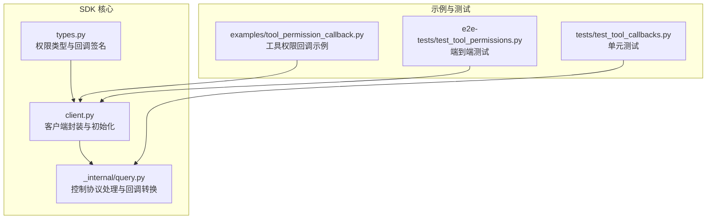
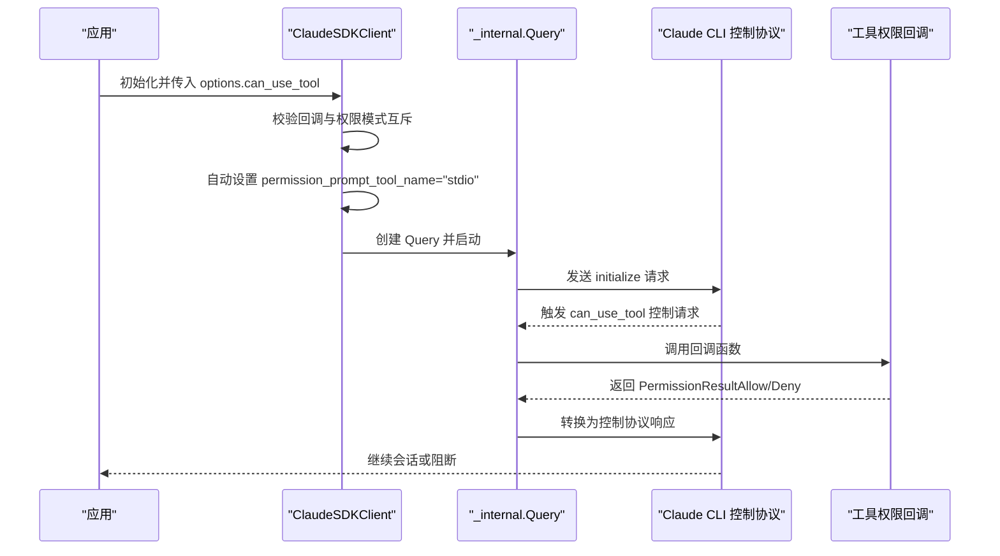
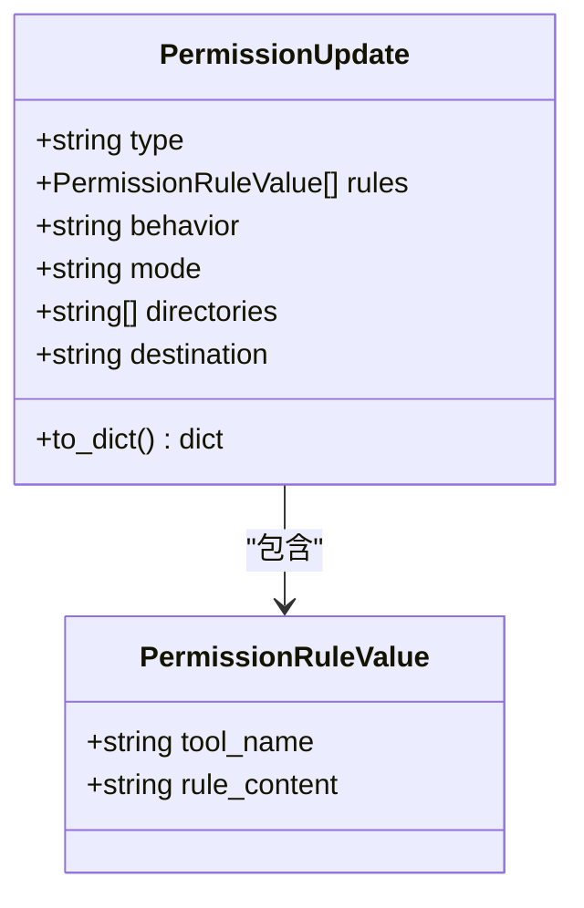
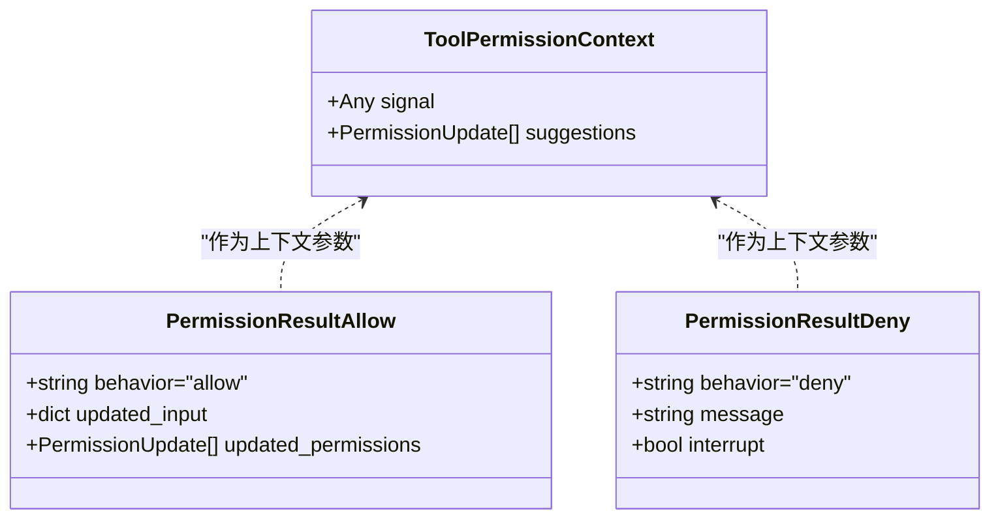
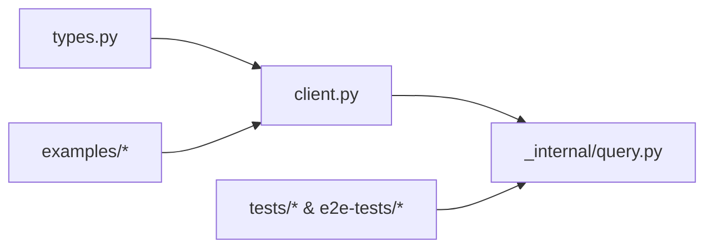

# 权限配置

<cite>
**本文引用的文件**
- [types.py](file://src/claude_agent_sdk/types.py)
- [client.py](file://src/claude_agent_sdk/client.py)
- [query.py](file://src/claude_agent_sdk/_internal/query.py)
- [tool_permission_callback.py](file://examples/tool_permission_callback.py)
- [test_tool_callbacks.py](file://tests/test_tool_callbacks.py)
- [test_tool_permissions.py](file://e2e-tests/test_tool_permissions.py)
- [README.md](file://README.md)
</cite>

## 目录
1. [简介](#简介)
2. [项目结构与定位](#项目结构与定位)
3. [核心权限类型与组件](#核心权限类型与组件)
4. [架构总览](#架构总览)
5. [详细组件解析](#详细组件解析)
6. [依赖关系分析](#依赖关系分析)
7. [性能与行为特性](#性能与行为特性)
8. [安全考虑与最佳实践](#安全考虑与最佳实践)
9. [故障排查指南](#故障排查指南)
10. [结论](#结论)
11. [附录：常见场景示例](#附录常见场景示例)

## 简介
本文件系统化梳理 Claude Agent SDK 的权限配置体系，聚焦以下关键能力：
- 权限模式（PermissionMode）
- 权限行为（PermissionBehavior）
- 权限规则值（PermissionRuleValue）
- 权限更新（PermissionUpdate）及其目的地（PermissionUpdateDestination）
- 工具权限回调（ToolPermissionCallback）与动态控制
- 安全与最佳实践
- 实战场景示例（开发环境、生产环境）

目标是帮助开发者在不牺牲安全性的前提下，灵活、可维护地控制工具访问与执行。

## 项目结构与定位
- 权限类型定义集中在 types 模块，涵盖权限模式、行为、规则、更新、回调签名等。
- 客户端与内部查询模块负责将权限决策与控制协议对接到 Claude CLI。
- 示例与测试覆盖了工具权限回调的实现、行为验证与端到端调用。

图表来源
- [types.py:17-131](file://src/claude_agent_sdk/types.py#L17-L131)
- [client.py:62-180](file://src/claude_agent_sdk/client.py#L62-L180)
- [query.py:264-286](file://src/claude_agent_sdk/_internal/query.py#L264-L286)
- [tool_permission_callback.py:26-94](file://examples/tool_permission_callback.py#L26-L94)
- [test_tool_callbacks.py:56-210](file://tests/test_tool_callbacks.py#L56-L210)
- [test_tool_permissions.py:19-61](file://e2e-tests/test_tool_permissions.py#L19-L61)

章节来源
- [types.py:17-131](file://src/claude_agent_sdk/types.py#L17-L131)
- [client.py:62-180](file://src/claude_agent_sdk/client.py#L62-L180)
- [query.py:264-286](file://src/claude_agent_sdk/_internal/query.py#L264-L286)

## 核心权限类型与组件
- 权限模式（PermissionMode）
  - default：默认模式，对危险工具进行提示或询问
  - acceptEdits：自动接受文件编辑类操作
  - plan：仅用于规划阶段，不直接执行工具
  - bypassPermissions：绕过权限检查（高风险）
- 权限行为（PermissionBehavior）
  - allow：允许
  - deny：拒绝
  - ask：询问用户或系统
- 权限规则值（PermissionRuleValue）
  - 包含工具名与规则内容，用于构建规则集
- 权限更新（PermissionUpdate）
  - 支持 addRules、replaceRules、removeRules、setMode、addDirectories、removeDirectories
  - 可指定目标作用域（userSettings、projectSettings、localSettings、session）
- 工具权限回调（ToolPermissionContext、PermissionResultAllow、PermissionResultDeny）
  - 回调函数签名：(tool_name, input_data, context) -> PermissionResult
  - 允许修改输入、建议更新权限、中断流程

章节来源
- [types.py:17-131](file://src/claude_agent_sdk/types.py#L17-L131)
- [types.py:1030-1067](file://src/claude_agent_sdk/types.py#L1030-L1067)
- [types.py:1101-1199](file://src/claude_agent_sdk/types.py#L1101-L1199)

## 架构总览
SDK 在连接时根据是否配置工具权限回调，决定是否启用“stdio”控制通道，并将回调结果转换为控制协议响应格式。

图表来源
- [client.py:112-131](file://src/claude_agent_sdk/client.py#L112-L131)
- [query.py:264-286](file://src/claude_agent_sdk/_internal/query.py#L264-L286)

章节来源
- [client.py:112-131](file://src/claude_agent_sdk/client.py#L112-L131)
- [query.py:264-286](file://src/claude_agent_sdk/_internal/query.py#L264-L286)

## 详细组件解析

### 权限模式（PermissionMode）
- default：对非只读工具触发权限回调或提示
- acceptEdits：自动通过文件写入/编辑类工具
- plan：限制为规划模式，不执行工具
- bypassPermissions：跳过权限校验（仅在受控环境下使用）

章节来源
- [types.py:17-21](file://src/claude_agent_sdk/types.py#L17-L21)
- [README.md:57-73](file://README.md#L57-L73)

### 权限行为（PermissionBehavior）
- allow：直接放行
- deny：拒绝并可中断
- ask：交由用户或系统决策

章节来源
- [types.py:57-57](file://src/claude_agent_sdk/types.py#L57-L57)

### 权限规则值（PermissionRuleValue）
- 字段：tool_name、rule_content
- 用于 addRules/replaceRules/removeRules 类型的 PermissionUpdate

章节来源
- [types.py:60-66](file://src/claude_agent_sdk/types.py#L60-L66)

### 权限更新（PermissionUpdate）
- 类型：
  - addRules、replaceRules、removeRules：需要 rules 和 behavior
  - setMode：需要 mode
  - addDirectories、removeDirectories：需要 directories
- 目的地（destination）：
  - userSettings、projectSettings、localSettings、session
- to_dict 转换：
  - 将内部对象序列化为控制协议期望的字典格式

图表来源
- [types.py:60-121](file://src/claude_agent_sdk/types.py#L60-L121)

章节来源
- [types.py:68-121](file://src/claude_agent_sdk/types.py#L68-L121)

### 工具权限回调（ToolPermissionContext、PermissionResult）
- ToolPermissionContext
  - 提供 suggestions（来自 CLI 的权限建议）与 signal（未来中止信号占位）
- PermissionResultAllow
  - behavior="allow"
  - 可选 updated_input（修改后的输入）
  - 可选 updated_permissions（建议的权限更新）
- PermissionResultDeny
  - behavior="deny"
  - 必填 message（拒绝原因）
  - 可选 interrupt（是否中断）

图表来源
- [types.py:123-157](file://src/claude_agent_sdk/types.py#L123-L157)

章节来源
- [types.py:123-157](file://src/claude_agent_sdk/types.py#L123-L157)

### 控制协议与回调转换
- 回调返回的 PermissionResult 会被转换为控制协议响应：
  - allow：包含 updatedInput；若存在 updated_permissions，则附加转换后的 PermissionUpdate 列表
  - deny：包含 message；可选 interrupt

章节来源
- [query.py:264-286](file://src/claude_agent_sdk/_internal/query.py#L264-L286)

## 依赖关系分析
- 类型层（types.py）定义了所有权限相关的核心数据结构与枚举
- 客户端层（client.py）在连接时根据是否存在 can_use_tool 决定控制通道与参数
- 查询层（query.py）负责将回调结果映射为控制协议响应
- 示例与测试层验证回调行为、输入修改与错误处理

图表来源
- [types.py:17-131](file://src/claude_agent_sdk/types.py#L17-L131)
- [client.py:62-180](file://src/claude_agent_sdk/client.py#L62-L180)
- [query.py:264-286](file://src/claude_agent_sdk/_internal/query.py#L264-L286)

章节来源
- [types.py:17-131](file://src/claude_agent_sdk/types.py#L17-L131)
- [client.py:62-180](file://src/claude_agent_sdk/client.py#L62-L180)
- [query.py:264-286](file://src/claude_agent_sdk/_internal/query.py#L264-L286)

## 性能与行为特性
- 流式交互：ClaudeSDKClient 默认以流式模式运行，便于实时权限决策与反馈
- 回调开销：工具权限回调在每次工具使用前触发，应避免阻塞与重 IO
- 输入修改：允许在回调中修改输入，减少后续失败重试成本
- 中断能力：deny 可选择中断，避免进一步执行

章节来源
- [client.py:35-60](file://src/claude_agent_sdk/client.py#L35-L60)
- [query.py:264-286](file://src/claude_agent_sdk/_internal/query.py#L264-L286)

## 安全考虑与最佳实践
- 最小权限原则
  - 使用 allowed_tools 与 disallowed_tools 进行显式白名单/黑名单
  - 对于危险工具（如 Bash、Write、Edit），优先通过回调严格校验
- 严格输入校验
  - 在回调中对路径、命令进行白名单/黑名单过滤
  - 对系统目录写入进行拦截
- 透明日志与审计
  - 记录工具使用日志，便于审计与回溯
- 高风险模式慎用
  - bypassPermissions 仅在受控沙箱或隔离环境中使用
- 环境隔离
  - 结合 sandbox 设置与权限规则共同约束
- 错误兜底
  - 回调异常应被捕获并返回 deny，避免影响会话稳定性

章节来源
- [tool_permission_callback.py:48-81](file://examples/tool_permission_callback.py#L48-L81)
- [test_tool_callbacks.py:176-210](file://tests/test_tool_callbacks.py#L176-L210)
- [types.py:696-727](file://src/claude_agent_sdk/types.py#L696-L727)

## 故障排查指南
- 回调未触发
  - 确认 options.permission_mode 设置为 default 或其他需要回调的模式
  - 确保 can_use_tool 与 permission_prompt_tool_name 不同时使用
- 回调异常
  - 查看控制协议错误响应中的错误信息
  - 确保回调返回 PermissionResultAllow 或 PermissionResultDeny
- 输入修改无效
  - 确认 updated_input 是否正确传递并在响应中生效
- 权限更新未生效
  - 检查 destination 是否与预期一致（userSettings、projectSettings、localSettings、session）

章节来源
- [client.py:112-131](file://src/claude_agent_sdk/client.py#L112-L131)
- [test_tool_callbacks.py:176-210](file://tests/test_tool_callbacks.py#L176-L210)
- [query.py:264-286](file://src/claude_agent_sdk/_internal/query.py#L264-L286)

## 结论
通过 PermissionMode、PermissionBehavior、PermissionRuleValue、PermissionUpdate 与工具权限回调的组合，Claude Agent SDK 提供了细粒度、可扩展且安全的权限控制能力。配合示例与测试，开发者可以快速实现从开发到生产的多场景权限策略，并在保证安全的前提下提升自动化效率。

## 附录：常见场景示例

### 开发环境权限控制
- 目标：允许只读工具（Read、Glob、Grep）自动通过；对写入与危险命令进行拦截与输入修正
- 关键点：
  - 使用 default 模式确保回调触发
  - 在回调中识别工具类型并进行路径/命令校验
  - 对系统目录写入直接拒绝
  - 对非临时目录写入进行路径重定向

章节来源
- [tool_permission_callback.py:44-81](file://examples/tool_permission_callback.py#L44-L81)

### 生产环境安全策略
- 目标：最小权限、严格审计、可恢复
- 关键点：
  - 使用 allowed_tools 显式白名单
  - 对 Bash 命令进行敏感词匹配与拒绝
  - 使用 session 作用域的 PermissionUpdate 临时放宽权限
  - 异常时中断并记录拒绝原因

章节来源
- [tool_permission_callback.py:67-81](file://examples/tool_permission_callback.py#L67-L81)
- [types.py:68-121](file://src/claude_agent_sdk/types.py#L68-L121)

### 动态权限更新
- 场景：根据会话上下文动态调整权限
- 方法：
  - 在回调中构造 PermissionUpdate（如 addRules、setMode、addDirectories）
  - 通过 updated_permissions 返回给 CLI，由其应用到指定 destination

章节来源
- [types.py:68-121](file://src/claude_agent_sdk/types.py#L68-L121)
- [query.py:274-278](file://src/claude_agent_sdk/_internal/query.py#L274-L278)

### 端到端验证
- 使用 e2e 测试验证回调确实被触发（例如 Bash 触发）
- 单元测试覆盖 allow/deny、输入修改、异常处理等分支

章节来源
- [test_tool_permissions.py:19-61](file://e2e-tests/test_tool_permissions.py#L19-L61)
- [test_tool_callbacks.py:56-210](file://tests/test_tool_callbacks.py#L56-L210)