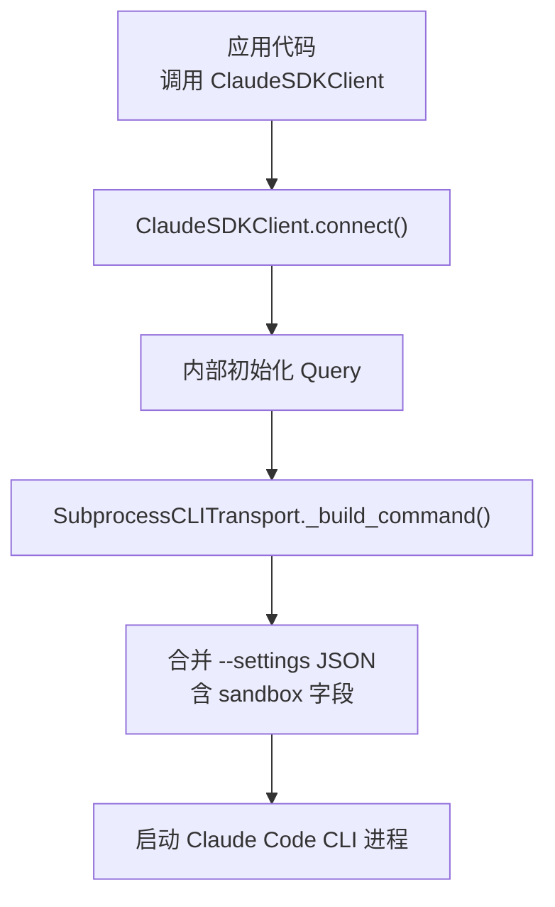
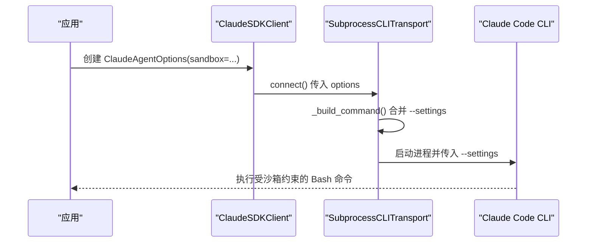
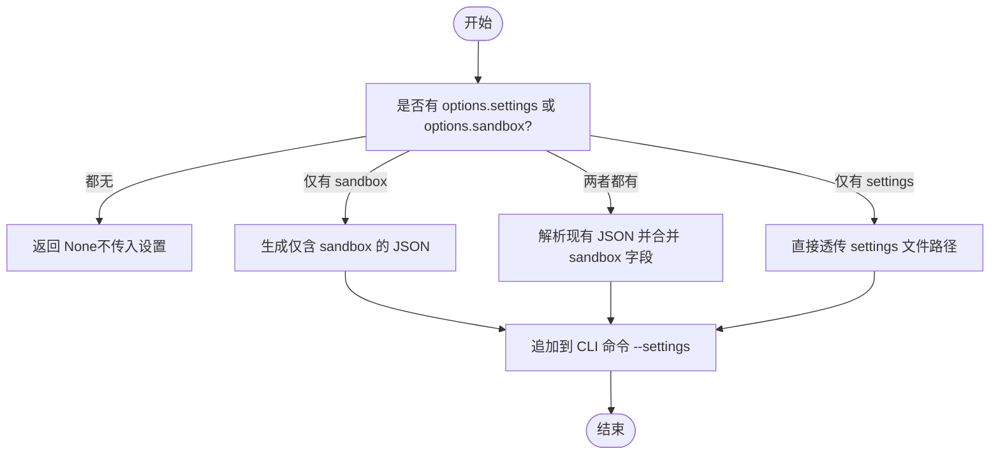
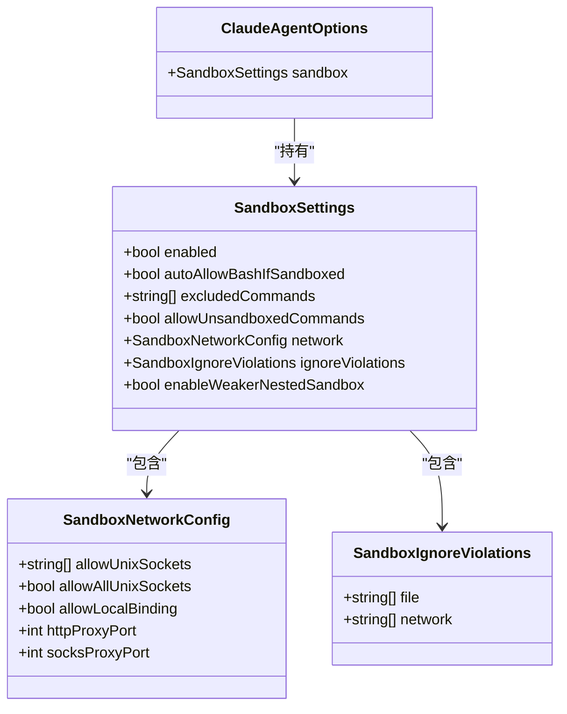

# 沙箱配置

<cite>
**本文引用的文件**
- [types.py](file://src/claude_agent_sdk/types.py)
- [subprocess_cli.py](file://src/claude_agent_sdk/_internal/transport/subprocess_cli.py)
- [test_transport.py](file://tests/test_transport.py)
- [client.py](file://src/claude_agent_sdk/client.py)
- [README.md](file://README.md)
- [CLAUDE.md](file://CLAUDE.md)
</cite>

## 目录
1. [简介](#简介)
2. [项目结构](#项目结构)
3. [核心组件](#核心组件)
4. [架构总览](#架构总览)
5. [详细组件分析](#详细组件分析)
6. [依赖分析](#依赖分析)
7. [性能考量](#性能考量)
8. [故障排查指南](#故障排查指南)
9. [结论](#结论)
10. [附录](#附录)

## 简介
本文件聚焦 Claude Agent SDK 的“沙箱配置”能力，系统性阐述如何通过 SandboxSettings、SandboxNetworkConfig 和 SandboxIgnoreViolations 控制 Bash 命令的执行边界，以及它们在网络隔离与文件系统保护中的作用。同时，我们将对比权限规则（PermissionRule）与沙箱设置的关系，给出最佳实践、安全注意事项、跨环境配置策略，并提供可直接参考的示例路径。

## 项目结构
围绕沙箱配置的关键代码分布在以下模块：
- 类型定义：SandboxSettings、SandboxNetworkConfig、SandboxIgnoreViolations
- 配置合并与注入：SubprocessCLITransport 将沙箱设置合并到 CLI 启动参数中
- 使用入口：ClaudeSDKClient 在连接时处理沙箱设置
- 测试验证：对命令构建、设置合并、网络配置进行端到端验证

图表来源
- [client.py:94-180](file://src/claude_agent_sdk/client.py#L94-L180)
- [subprocess_cli.py:112-229](file://src/claude_agent_sdk/_internal/transport/subprocess_cli.py#L112-L229)

章节来源
- [client.py:94-180](file://src/claude_agent_sdk/client.py#L94-L180)
- [subprocess_cli.py:112-229](file://src/claude_agent_sdk/_internal/transport/subprocess_cli.py#L112-L229)

## 核心组件
- SandboxSettings：控制 Bash 命令沙箱化行为的核心配置对象，包含启用开关、自动放行、排除命令、网络配置、违规忽略、嵌套沙箱强度等字段。
- SandboxNetworkConfig：细粒度控制网络访问的子配置，如 Unix Socket 访问、本地绑定、代理端口等。
- SandboxIgnoreViolations：允许针对特定文件路径或网络主机忽略沙箱违规检测，谨慎使用。
- ClaudeAgentOptions.sandbox：将沙箱设置注入到 SDK 选项中，最终由传输层合并为 CLI 的 --settings 参数。

章节来源
- [types.py:652-727](file://src/claude_agent_sdk/types.py#L652-L727)
- [types.py:1079-1082](file://src/claude_agent_sdk/types.py#L1079-L1082)

## 架构总览
下图展示了从应用配置到 CLI 执行的沙箱设置传递链路：

图表来源
- [client.py:94-180](file://src/claude_agent_sdk/client.py#L94-L180)
- [subprocess_cli.py:112-229](file://src/claude_agent_sdk/_internal/transport/subprocess_cli.py#L112-L229)

## 详细组件分析

### SandboxSettings（沙箱设置）
- 启用/禁用沙箱：enabled（macOS/Linux 可用，默认关闭）
- 自动放行：autoAllowBashIfSandboxed（默认开启），当命令被沙箱化时自动批准
- 排除命令：excludedCommands（例如 ["git","docker"]），这些命令将绕过沙箱直接运行
- 允许非沙箱命令：allowUnsandboxedCommands（默认开启），允许通过危险方式绕过沙箱；关闭后所有命令必须沙箱化或在排除列表
- 网络配置：network（SandboxNetworkConfig）
- 违规忽略：ignoreViolations（SandboxIgnoreViolations）
- 弱化嵌套沙箱：enableWeakerNestedSandbox（Linux 下用于非特权容器环境，降低安全性）

注意：文件系统与网络访问限制应通过权限规则（Read/Write/Edit/WebFetch）配置，而非通过 SandboxSettings。

章节来源
- [types.py:683-727](file://src/claude_agent_sdk/types.py#L683-L727)

### SandboxNetworkConfig（网络配置）
- allowUnixSockets：允许访问的 Unix Socket 路径列表（如容器引擎 socket）
- allowAllUnixSockets：是否允许全部 Unix Socket（安全性较低）
- allowLocalBinding：是否允许绑定到本地回环地址（macOS 专用）
- httpProxyPort / socksProxyPort：自建代理端口（若需要）

章节来源
- [types.py:653-669](file://src/claude_agent_sdk/types.py#L653-L669)

### SandboxIgnoreViolations（违规忽略）
- file：忽略违规检测的文件路径列表
- network：忽略违规检测的网络主机列表

使用场景：仅在明确风险可控且有充分审计的情况下使用，避免放宽安全边界。

章节来源
- [types.py:671-681](file://src/claude_agent_sdk/types.py#L671-L681)

### 配置合并与注入流程
- ClaudeSDKClient 在 connect 时准备传输层
- SubprocessCLITransport._build_command() 将 sandbox 设置合并进 --settings JSON
- 若已有 settings JSON，则合并；若仅提供 sandbox，则生成仅含 sandbox 的 JSON
- 最终以 --settings "<JSON>" 形式传给 CLI

图表来源
- [subprocess_cli.py:112-229](file://src/claude_agent_sdk/_internal/transport/subprocess_cli.py#L112-L229)

章节来源
- [subprocess_cli.py:112-229](file://src/claude_agent_sdk/_internal/transport/subprocess_cli.py#L112-L229)

### 实际示例与用法指引
以下示例展示了如何在不同场景下配置沙箱设置（请参考对应测试文件以获取完整可运行示例）：
- 最小化启用沙箱：仅启用 enabled
  - 示例路径：[最小化启用示例:596-617](file://tests/test_transport.py#L596-L617)
- 合并现有 settings JSON 与沙箱配置
  - 示例路径：[合并示例:543-581](file://tests/test_transport.py#L543-L581)
- 完整网络配置（Unix Socket、本地绑定、代理端口）
  - 示例路径：[网络配置示例:618-651](file://tests/test_transport.py#L618-L651)
- 仅提供 settings 文件路径（无沙箱）
  - 示例路径：[文件路径透传示例:582-595](file://tests/test_transport.py#L582-L595)

章节来源
- [test_transport.py:506-651](file://tests/test_transport.py#L506-L651)

## 依赖分析
- 类型依赖：SandboxSettings 依赖 SandboxNetworkConfig 与 SandboxIgnoreViolations
- 运行时依赖：ClaudeSDKClient 在 connect 时触发传输层，SubprocessCLITransport 负责命令构建与设置合并
- 测试依赖：通过单元测试覆盖命令构建、JSON 合并、网络配置等关键路径

图表来源
- [types.py:652-727](file://src/claude_agent_sdk/types.py#L652-L727)
- [types.py:1079-1082](file://src/claude_agent_sdk/types.py#L1079-L1082)

章节来源
- [types.py:652-727](file://src/claude_agent_sdk/types.py#L652-L727)
- [types.py:1079-1082](file://src/claude_agent_sdk/types.py#L1079-L1082)

## 性能考量
- 沙箱启用会引入额外的进程隔离与资源管理开销，通常对交互延迟影响有限，但在高并发 Bash 命令场景下可能增加子进程启动与上下文切换成本。
- 网络代理端口与 Unix Socket 访问会增加网络栈与文件系统权限检查的复杂度，建议仅在确需时开启。
- 自动放行（autoAllowBashIfSandboxed）可减少等待与确认次数，但会弱化安全边界，适合可信环境或开发阶段。
- 建议：
  - 开发环境：适度放宽（如允许本地绑定、自动放行），提升效率
  - 生产环境：严格启用沙箱、收紧网络访问、关闭自动放行与弱化嵌套沙箱
  - 对于频繁的 Bash 命令，优先考虑复用会话与缓存结果，减少重复沙箱化成本

## 故障排查指南
- 常见问题
  - 沙箱未生效：确认已设置 enabled=True，且操作系统支持（macOS/Linux）
  - 排除命令未生效：检查 excludedCommands 是否包含目标命令名
  - 网络访问失败：核对 allowUnixSockets、allowLocalBinding、代理端口配置
  - 违规被误报：谨慎使用 ignoreViolations，仅在审计完备的前提下放宽
- 调试步骤
  - 打印 CLI 命令：在 _build_command() 处输出最终命令，确认 --settings 内容
  - 校验 JSON 合并：确保现有 settings JSON 与 sandbox 字段正确合并
  - 观察 CLI 输出：通过 stderr 回调或日志定位沙箱拒绝原因

章节来源
- [subprocess_cli.py:112-229](file://src/claude_agent_sdk/_internal/transport/subprocess_cli.py#L112-L229)
- [test_transport.py:506-651](file://tests/test_transport.py#L506-L651)

## 结论
SandboxSettings 提供了对 Bash 命令执行边界的精细控制，结合 SandboxNetworkConfig 与 SandboxIgnoreViolations，可在保证安全的前提下满足多样化的运行需求。建议将文件系统与网络访问限制交由权限规则管理，沙箱设置专注于进程级隔离与网络边界控制。在不同环境下采用差异化的配置策略，并持续评估性能与安全的平衡点。

## 附录

### 最佳实践与安全考虑
- 默认关闭沙箱（开发/测试环境除外），逐步启用并验证
- 明确排除命令清单（excludedCommands），仅包含确需直连宿主的工具
- 网络配置最小化：仅开放必要的 Unix Socket 与代理端口
- 不建议在生产环境开启 allowUnsandboxedCommands 与 allowAllUnixSockets
- 定期审计 ignoreViolations 的使用情况，确保可追溯与合规

### 跨环境配置策略
- 开发环境
  - enabled: True
  - autoAllowBashIfSandboxed: True
  - excludedCommands: ["git","docker","kubectl"]
  - network: 允许本地绑定与必要 Unix Socket
- 预发布/测试环境
  - enabled: True
  - autoAllowBashIfSandboxed: False
  - excludedCommands: ["git"]
  - network: 严格限制
- 生产环境
  - enabled: True
  - autoAllowBashIfSandboxed: False
  - excludedCommands: 仅保留绝对必要项
  - network: 仅允许白名单主机与端口
  - ignoreViolations: 禁止使用

### 权限规则与沙箱设置的区别与联系
- 权限规则（Read/Write/Edit/WebFetch）用于控制文件系统读写与网络请求的许可，是“内容访问控制”
- 沙箱设置（SandboxSettings）用于控制 Bash 命令的执行环境与网络边界，是“执行环境控制”
- 二者互补：前者决定“能否做”，后者决定“在哪里做、如何做”

章节来源
- [types.py:689-694](file://src/claude_agent_sdk/types.py#L689-L694)