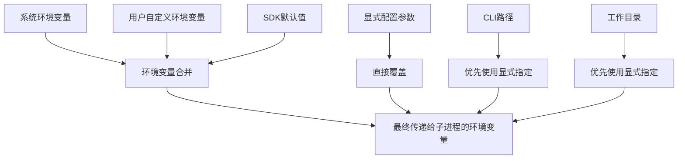
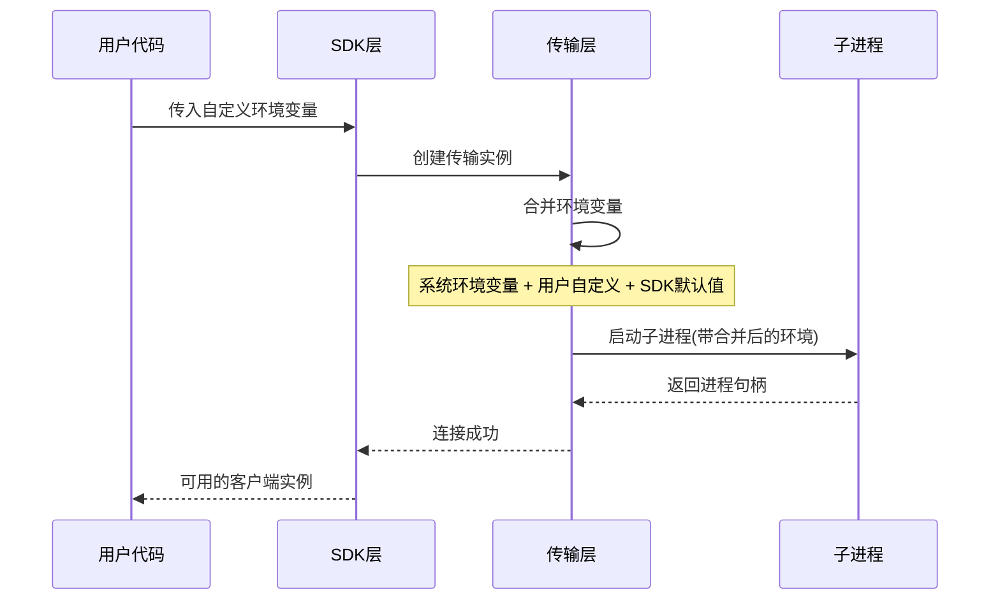
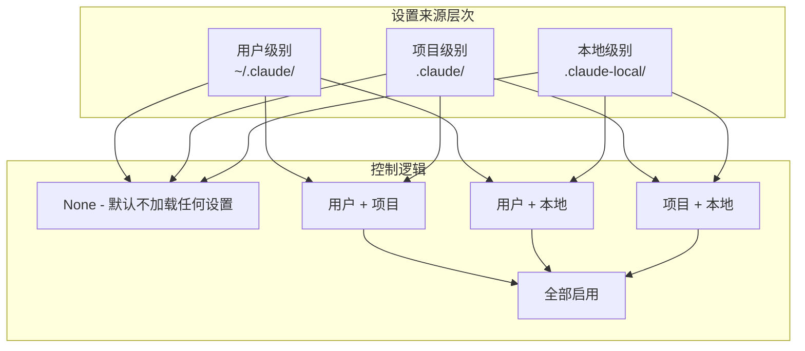
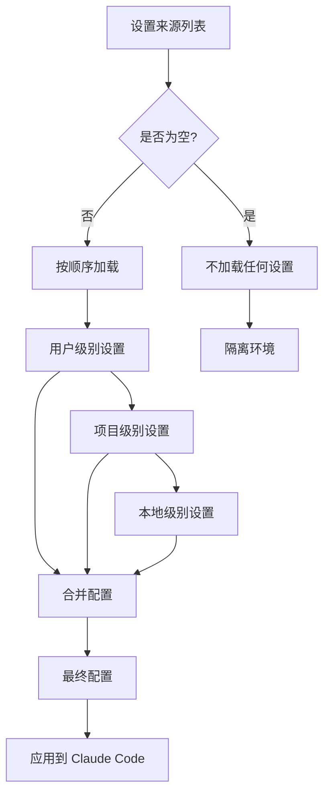
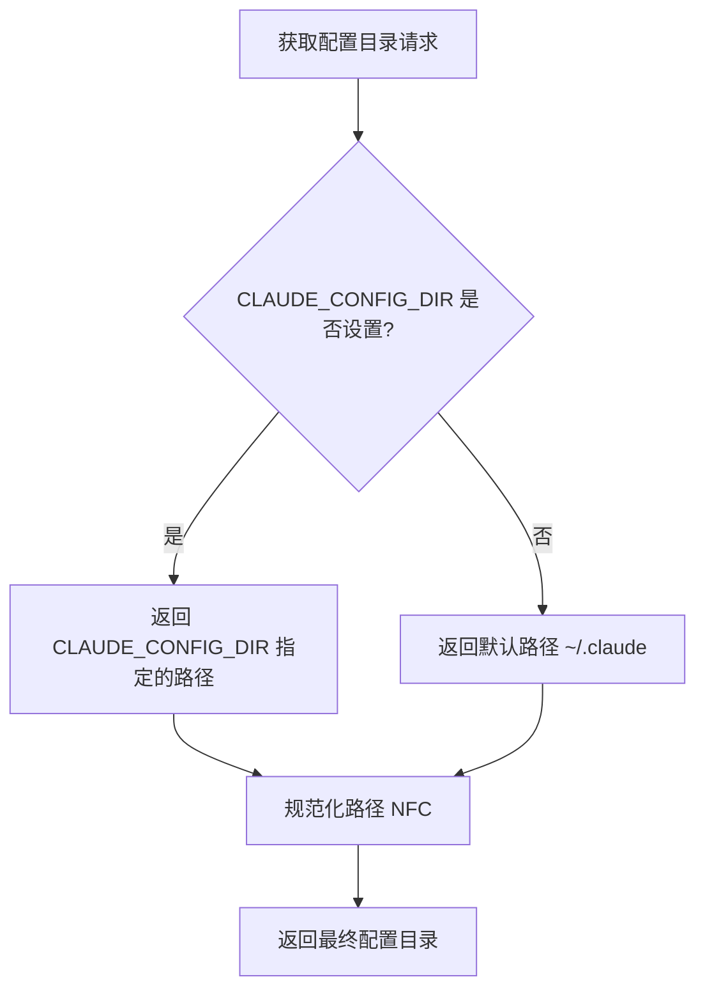
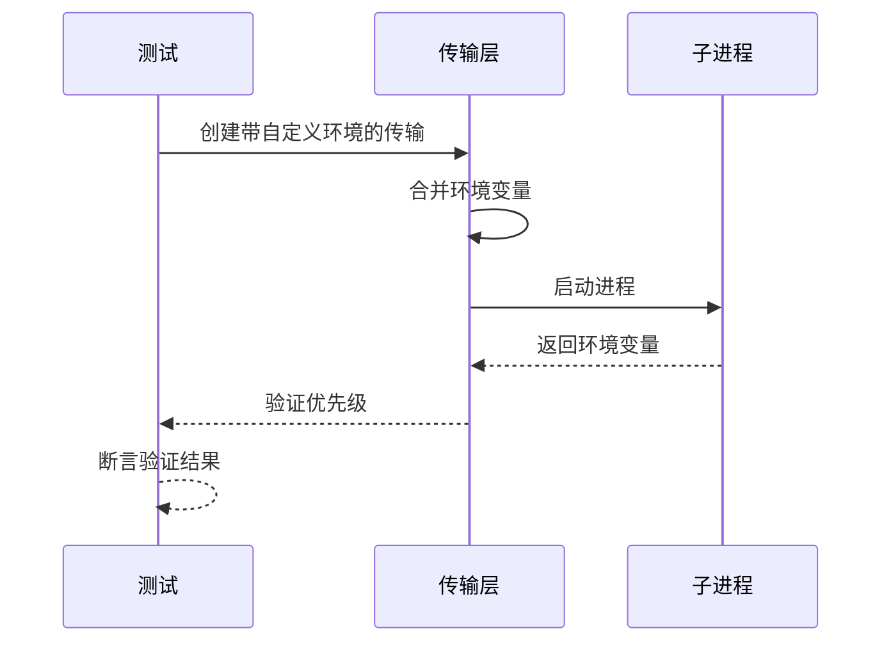

# 环境变量优先级处理

<cite>
**本文档引用的文件**
- [subprocess_cli.py](file://src/claude_agent_sdk/_internal/transport/subprocess_cli.py)
- [client.py](file://src/claude_agent_sdk/client.py)
- [_internal/query.py](file://src/claude_agent_sdk/_internal/query.py)
- [sessions.py](file://src/claude_agent_sdk/_internal/sessions.py)
- [test_transport.py](file://tests/test_transport.py)
- [setting_sources.py](file://examples/setting_sources.py)
- [types.py](file://src/claude_agent_sdk/types.py)
</cite>

## 目录
1. [简介](#简介)
2. [环境变量优先级概述](#环境变量优先级概述)
3. [核心环境变量处理机制](#核心环境变量处理机制)
4. [环境变量合并策略](#环境变量合并策略)
5. [设置来源控制机制](#设置来源控制机制)
6. [配置目录解析机制](#配置目录解析机制)
7. [测试验证与示例](#测试验证与示例)
8. [最佳实践建议](#最佳实践建议)
9. [故障排除指南](#故障排除指南)
10. [总结](#总结)

## 简介

本文档详细分析了 Claude Agent SDK Python 版本中的环境变量优先级处理机制。该系统通过精心设计的环境变量合并策略，确保用户配置、系统环境和 SDK 默认值之间的正确优先级关系，为开发者提供了灵活且可预测的配置管理体验。

## 环境变量优先级概述

环境变量优先级处理是 Claude Agent SDK 的核心功能之一，它决定了在不同配置场景下哪个值会被最终使用。系统采用以下优先级顺序：

1. **显式传入的配置**（最高优先级）
2. **用户自定义环境变量**
3. **SDK 默认值**
4. **系统环境变量**（最低优先级）

这种设计确保了用户可以精确控制配置行为，同时保持向后兼容性。

## 核心环境变量处理机制

### 环境变量合并策略

在子进程传输层中，环境变量通过一个精心设计的合并过程进行处理：

**图表来源**
- [subprocess_cli.py:344-353](file://src/claude_agent_sdk/_internal/transport/subprocess_cli.py#L344-L353)

### 关键环境变量处理点

系统中涉及环境变量处理的关键位置包括：

1. **CLAUDE_CODE_ENTRYPOINT**: SDK 默认设置为 "sdk-py"
2. **CLAUDE_AGENT_SDK_VERSION**: 始终由 SDK 设置
3. **CLAUDE_CODE_STREAM_CLOSE_TIMEOUT**: 控制流关闭超时时间
4. **CLAUDE_CONFIG_DIR**: 配置目录解析

**章节来源**
- [subprocess_cli.py:344-353](file://src/claude_agent_sdk/_internal/transport/subprocess_cli.py#L344-L353)
- [client.py:149-154](file://src/claude_agent_sdk/client.py#L149-L154)
- [_internal/query.py:115-117](file://src/claude_agent_sdk/_internal/query.py#L115-L117)

## 环境变量合并策略

### 详细合并流程

**图表来源**
- [subprocess_cli.py:371-379](file://src/claude_agent_sdk/_internal/transport/subprocess_cli.py#L371-L379)

### 优先级规则实现

环境变量合并遵循严格的优先级规则：

1. **用户自定义环境变量**：完全覆盖系统环境变量
2. **SDK 默认值**：提供基础配置，被用户设置覆盖
3. **系统环境变量**：作为最后的后备选项

**章节来源**
- [subprocess_cli.py:344-353](file://src/claude_agent_sdk/_internal/transport/subprocess_cli.py#L344-L353)
- [test_transport.py:455-496](file://tests/test_transport.py#L455-L496)

## 设置来源控制机制

### SettingSources 枚举

系统通过 `SettingSource` 枚举类型支持多层级设置来源控制：

**图表来源**
- [types.py:24](file://src/claude_agent_sdk/types.py#L24)
- [setting_sources.py:8-21](file://examples/setting_sources.py#L8-L21)

### 设置来源解析流程

**图表来源**
- [setting_sources.py:47-71](file://examples/setting_sources.py#L47-L71)
- [setting_sources.py:107-132](file://examples/setting_sources.py#L107-L132)

**章节来源**
- [types.py:24](file://src/claude_agent_sdk/types.py#L24)
- [setting_sources.py:8-21](file://examples/setting_sources.py#L8-L21)

## 配置目录解析机制

### CLAUDE_CONFIG_DIR 解析

系统通过 `CLAUDE_CONFIG_DIR` 环境变量提供灵活的配置目录管理：

**图表来源**
- [sessions.py:114-119](file://src/claude_agent_sdk/_internal/sessions.py#L114-L119)

### 路径规范化处理

系统实现了完整的路径规范化机制：

1. **Unicode 规范化**：使用 NFC 形式
2. **路径解析**：使用 `os.path.realpath`
3. **安全检查**：防止路径遍历攻击

**章节来源**
- [sessions.py:114-119](file://src/claude_agent_sdk/_internal/sessions.py#L114-L119)
- [sessions.py:130-137](file://src/claude_agent_sdk/_internal/sessions.py#L130-L137)

## 测试验证与示例

### 环境变量优先级测试

测试套件验证了环境变量合并的正确性：

**图表来源**
- [test_transport.py:391-453](file://tests/test_transport.py#L391-L453)

### 设置来源控制示例

示例展示了不同设置来源组合的效果：

**章节来源**
- [test_transport.py:391-453](file://tests/test_transport.py#L391-L453)
- [setting_sources.py:47-71](file://examples/setting_sources.py#L47-L71)

## 最佳实践建议

### 环境变量配置最佳实践

1. **明确优先级意识**：用户自定义配置总是优先于系统环境变量
2. **避免冲突**：不要在同一层级设置冲突的配置项
3. **使用显式配置**：对于关键配置，优先使用显式传入而非依赖环境变量
4. **测试环境隔离**：在 CI/CD 环境中明确设置所有必要的环境变量

### 设置来源管理建议

1. **明确用途**：根据配置的适用范围选择合适的来源级别
2. **最小权限原则**：只启用必要的设置来源，减少配置复杂性
3. **版本控制**：将项目特定的设置纳入版本控制
4. **文档化配置**：为重要的配置变更编写文档说明

## 故障排除指南

### 常见环境变量问题

1. **配置未生效**
   - 检查环境变量名称是否正确
   - 确认配置值格式符合预期
   - 验证是否有更高优先级的配置覆盖

2. **权限问题**
   - 确认用户具有访问相关目录的权限
   - 检查 SELinux 或其他安全策略的影响

3. **路径问题**
   - 验证路径是否正确解析
   - 检查路径分隔符在不同操作系统上的差异

### 调试技巧

1. **启用调试输出**：使用 `--verbose` 参数获取详细的日志信息
2. **检查环境变量**：在启动前打印所有环境变量以确认合并结果
3. **逐步排除**：逐个禁用配置来源以确定问题所在

## 总结

Claude Agent SDK 的环境变量优先级处理机制通过精心设计的合并策略和严格的优先级规则，为用户提供了强大而灵活的配置管理能力。系统不仅支持多层级的设置来源控制，还确保了配置的一致性和可预测性。

关键特性包括：
- 明确的优先级层次结构
- 灵活的设置来源组合
- 完善的错误处理和调试支持
- 全面的测试覆盖

这一机制使得开发者能够精确控制 Claude Code 的行为，同时保持系统的稳定性和可靠性。