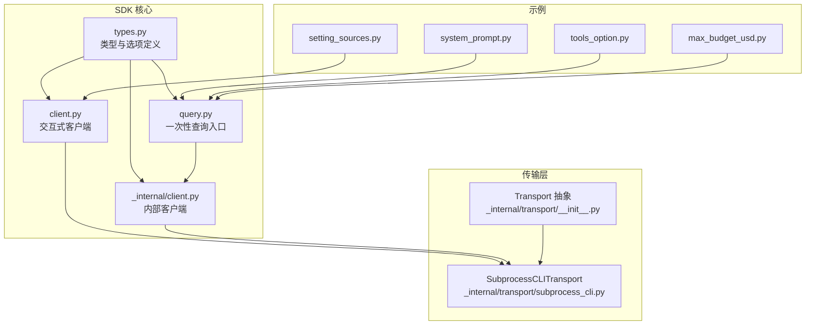
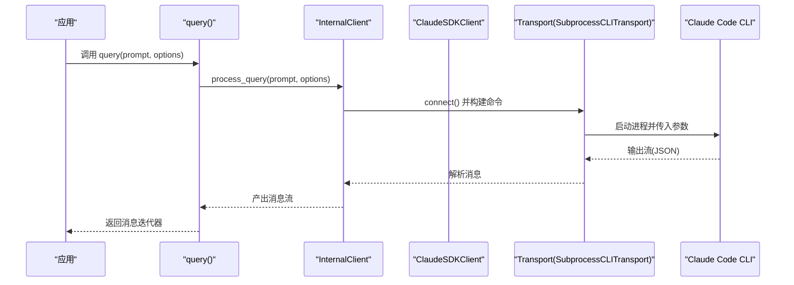
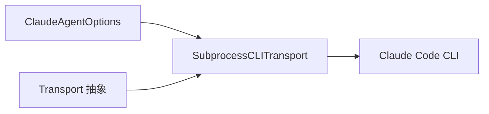

# 配置和选项

<cite>
**本文引用的文件**
- [src/claude_agent_sdk/types.py](file://src/claude_agent_sdk/types.py)
- [src/claude_agent_sdk/client.py](file://src/claude_agent_sdk/client.py)
- [src/claude_agent_sdk/_internal/client.py](file://src/claude_agent_sdk/_internal/client.py)
- [src/claude_agent_sdk/query.py](file://src/claude_agent_sdk/query.py)
- [src/claude_agent_sdk/_internal/transport/__init__.py](file://src/claude_agent_sdk/_internal/transport/__init__.py)
- [src/claude_agent_sdk/_internal/transport/subprocess_cli.py](file://src/claude_agent_sdk/_internal/transport/subprocess_cli.py)
- [_errors.py](file://src/claude_agent_sdk/_errors.py)
- [examples/setting_sources.py](file://examples/setting_sources.py)
- [examples/system_prompt.py](file://examples/system_prompt.py)
- [examples/tools_option.py](file://examples/tools_option.py)
- [examples/max_budget_usd.py](file://examples/max_budget_usd.py)
</cite>

## 目录
1. [简介](#简介)
2. [项目结构](#项目结构)
3. [核心组件](#核心组件)
4. [架构总览](#架构总览)
5. [详细组件分析](#详细组件分析)
6. [依赖分析](#依赖分析)
7. [性能考量](#性能考量)
8. [故障排除指南](#故障排除指南)
9. [结论](#结论)
10. [附录](#附录)

## 简介
本文件系统性梳理 Claude Agent SDK 的配置与选项体系，重点围绕 ClaudeAgentOptions 的所有可用配置项进行说明，涵盖系统提示、工作目录、工具集、预算限制、传输层配置（含自定义传输、环境变量与超时）、设置来源管理（默认/用户/项目/本地）以及配置验证与合并策略。同时提供开发与生产环境的配置示例、最佳实践与安全注意事项，并给出常见问题的排查路径。

## 项目结构
与“配置与选项”直接相关的代码主要分布在以下模块：
- 类型与选项定义：types.py
- 客户端与查询入口：client.py、_internal/client.py、query.py
- 传输层抽象与子进程实现：_internal/transport/*、_internal/transport/subprocess_cli.py
- 错误类型：_errors.py
- 示例：examples 下的 setting_sources.py、system_prompt.py、tools_option.py、max_budget_usd.py

**图表来源**
- [src/claude_agent_sdk/types.py:1-120](file://src/claude_agent_sdk/types.py#L1-L120)
- [src/claude_agent_sdk/query.py:1-127](file://src/claude_agent_sdk/query.py#L1-L127)
- [src/claude_agent_sdk/client.py:1-120](file://src/claude_agent_sdk/client.py#L1-L120)
- [src/claude_agent_sdk/_internal/client.py:1-146](file://src/claude_agent_sdk/_internal/client.py#L1-L146)
- [src/claude_agent_sdk/_internal/transport/__init__.py:1-69](file://src/claude_agent_sdk/_internal/transport/__init__.py#L1-L69)
- [src/claude_agent_sdk/_internal/transport/subprocess_cli.py:1-120](file://src/claude_agent_sdk/_internal/transport/subprocess_cli.py#L1-L120)
- [examples/setting_sources.py:1-174](file://examples/setting_sources.py#L1-L174)
- [examples/system_prompt.py:1-87](file://examples/system_prompt.py#L1-L87)
- [examples/tools_option.py:1-112](file://examples/tools_option.py#L1-L112)
- [examples/max_budget_usd.py:1-96](file://examples/max_budget_usd.py#L1-L96)

**章节来源**
- [src/claude_agent_sdk/types.py:1-120](file://src/claude_agent_sdk/types.py#L1-L120)
- [src/claude_agent_sdk/query.py:1-127](file://src/claude_agent_sdk/query.py#L1-L127)
- [src/claude_agent_sdk/client.py:1-120](file://src/claude_agent_sdk/client.py#L1-L120)
- [src/claude_agent_sdk/_internal/client.py:1-146](file://src/claude_agent_sdk/_internal/client.py#L1-L146)
- [src/claude_agent_sdk/_internal/transport/__init__.py:1-69](file://src/claude_agent_sdk/_internal/transport/__init__.py#L1-L69)
- [src/claude_agent_sdk/_internal/transport/subprocess_cli.py:1-120](file://src/claude_agent_sdk/_internal/transport/subprocess_cli.py#L1-L120)

## 核心组件
- ClaudeAgentOptions：SDK 的核心配置载体，承载系统提示、工作目录、工具集、预算、权限模式、模型、思维令牌预算、输出格式、插件、MCP 服务器、设置来源、额外参数等。
- Transport 抽象与 SubprocessCLITransport 实现：负责与 Claude Code CLI 的双向通信，支持自定义传输替换。
- 查询与客户端：query() 提供一次性查询；ClaudeSDKClient 提供交互式会话能力。
- 错误类型：CLIConnectionError、CLINotFoundError、ProcessError、CLIJSONDecodeError、MessageParseError 等，用于统一异常处理。

**章节来源**
- [src/claude_agent_sdk/types.py:1-120](file://src/claude_agent_sdk/types.py#L1-L120)
- [src/claude_agent_sdk/_internal/transport/__init__.py:1-69](file://src/claude_agent_sdk/_internal/transport/__init__.py#L1-L69)
- [src/claude_agent_sdk/_internal/transport/subprocess_cli.py:1-120](file://src/claude_agent_sdk/_internal/transport/subprocess_cli.py#L1-L120)
- [src/claude_agent_sdk/query.py:1-127](file://src/claude_agent_sdk/query.py#L1-L127)
- [src/claude_agent_sdk/client.py:1-120](file://src/claude_agent_sdk/client.py#L1-L120)
- [_errors.py:1-57](file://src/claude_agent_sdk/_errors.py#L1-L57)

## 架构总览
下图展示配置从应用到传输层的关键流转：

**图表来源**
- [src/claude_agent_sdk/query.py:115-127](file://src/claude_agent_sdk/query.py#L115-L127)
- [src/claude_agent_sdk/_internal/client.py:44-146](file://src/claude_agent_sdk/_internal/client.py#L44-L146)
- [src/claude_agent_sdk/_internal/transport/subprocess_cli.py:335-395](file://src/claude_agent_sdk/_internal/transport/subprocess_cli.py#L335-L395)

## 详细组件分析

### ClaudeAgentOptions 配置项详解
以下为 ClaudeAgentOptions 的关键配置项与行为说明（基于源码与示例）：

- 系统提示 system_prompt
  - 支持字符串或预设对象（preset），可选追加内容（append）。
  - 预设类型为 claude_code 时，映射到 CLI 的默认预设。
  - 参考：[示例：system_prompt.py:1-87](file://examples/system_prompt.py#L1-L87)，[类型定义：types.py:27-40](file://src/claude_agent_sdk/types.py#L27-L40)

- 工作目录 cwd
  - 设置 CLI 进程的工作目录，影响文件访问与会话持久化。
  - 参考：[传输层构建命令时使用 cwd:357-358](file://src/claude_agent_sdk/_internal/transport/subprocess_cli.py#L357-L358)

- 工具配置 tools 与 allowed_tools/disallowed_tools
  - tools 可为工具名数组或预设对象；空数组表示禁用内置工具。
  - allowed_tools/disallowed_tools 作为细粒度白名单/黑名单补充。
  - 参考：[示例：tools_option.py:1-112](file://examples/tools_option.py#L1-L112)，[传输层命令构建:183-205](file://src/claude_agent_sdk/_internal/transport/subprocess_cli.py#L183-L205)

- 预算限制 max_budget_usd
  - 用于控制累计消费上限；超过可能触发 error_max_budget_usd 结果状态。
  - 参考：[示例：max_budget_usd.py:1-96](file://examples/max_budget_usd.py#L1-L96)，[传输层命令构建:201-202](file://src/claude_agent_sdk/_internal/transport/subprocess_cli.py#L201-L202)

- 权限与模式 permission_mode/permission_prompt_tool_name/can_use_tool
  - permission_mode 控制工具执行策略（如 default、acceptEdits、bypassPermissions）。
  - can_use_tool 回调要求使用流式输入；与 permission_prompt_tool_name 互斥。
  - 参考：[客户端连接逻辑中的校验与转换:112-131](file://src/claude_agent_sdk/client.py#L112-L131)，[传输层命令构建:216-222](file://src/claude_agent_sdk/_internal/transport/subprocess_cli.py#L216-L222)

- 模型与回退模型 model/fallback_model
  - 指定主模型与回退模型。
  - 参考：[传输层命令构建:207-211](file://src/claude_agent_sdk/_internal/transport/subprocess_cli.py#L207-L211)

- 思维令牌预算 thinking/max_thinking_tokens
  - thinking 支持 adaptive/enabled/disabled；若未显式设置，adaptive 默认预算较大。
  - 参考：[传输层命令构建:300-313](file://src/claude_agent_sdk/_internal/transport/subprocess_cli.py#L300-L313)

- 输出格式 output_format
  - 当 type 为 json_schema 时，将 schema 传递给 CLI。
  - 参考：[传输层命令构建:318-327](file://src/claude_agent_sdk/_internal/transport/subprocess_cli.py#L318-L327)

- 插件 plugins
  - 仅支持本地插件（local），通过 --plugin-dir 注入。
  - 参考：[传输层命令构建:283-289](file://src/claude_agent_sdk/_internal/transport/subprocess_cli.py#L283-L289)

- MCP 服务器 mcp_servers
  - 支持字典形式（含 SDK 内嵌实例）或文件路径/JSON 字符串；SDK 服务器会剥离内部实例字段后传递。
  - 参考：[传输层命令构建:240-265](file://src/claude_agent_sdk/_internal/transport/subprocess_cli.py#L240-L265)，[示例：setting_sources.py:1-174](file://examples/setting_sources.py#L1-L174)

- 设置来源 setting_sources
  - 控制加载 user/project/local 等来源；默认 None 表示不加载任何设置。
  - 参考：[示例：setting_sources.py:1-174](file://examples/setting_sources.py#L1-L174)，[传输层命令构建:276-281](file://src/claude_agent_sdk/_internal/transport/subprocess_cli.py#L276-L281)

- 其他常用项
  - max_turns、continue_conversation、resume、include_partial_messages、fork_session、effort、env、stderr、extra_args、add_dirs、settings、sandbox、agents 等。
  - 参考：[传输层命令构建:183-333](file://src/claude_agent_sdk/_internal/transport/subprocess_cli.py#L183-L333)

**章节来源**
- [src/claude_agent_sdk/types.py:27-40](file://src/claude_agent_sdk/types.py#L27-L40)
- [src/claude_agent_sdk/_internal/transport/subprocess_cli.py:166-333](file://src/claude_agent_sdk/_internal/transport/subprocess_cli.py#L166-L333)
- [examples/system_prompt.py:1-87](file://examples/system_prompt.py#L1-L87)
- [examples/tools_option.py:1-112](file://examples/tools_option.py#L1-L112)
- [examples/max_budget_usd.py:1-96](file://examples/max_budget_usd.py#L1-L96)
- [examples/setting_sources.py:1-174](file://examples/setting_sources.py#L1-L174)

### 传输层配置与自定义实现
- Transport 抽象
  - 定义 connect、write、read_messages、close、is_ready、end_input 等接口，便于替换为远程或其它传输方式。
  - 参考：[_internal/transport/__init__.py:8-61](file://src/claude_agent_sdk/_internal/transport/__init__.py#L8-L61)

- SubprocessCLITransport
  - 基于 anyio 启动子进程，合并环境变量（系统 -> 用户 -> SDK 必需），注入调试与文件检查点开关。
  - 将 ClaudeAgentOptions 映射为 CLI 参数，支持 MCP、插件、工具、预算、模型、思维预算、输出格式等。
  - 参考：[_internal/transport/subprocess_cli.py:335-395](file://src/claude_agent_sdk/_internal/transport/subprocess_cli.py#L335-L395)

- 自定义传输
  - 通过构造函数传入自定义 Transport 实例，即可完全接管 I/O。
  - 参考：[client.py 中对自定义传输的使用:133-140](file://src/claude_agent_sdk/client.py#L133-L140)，[query.py 文档注释示例:99-113](file://src/claude_agent_sdk/query.py#L99-L113)

**章节来源**
- [src/claude_agent_sdk/_internal/transport/__init__.py:8-61](file://src/claude_agent_sdk/_internal/transport/__init__.py#L8-L61)
- [src/claude_agent_sdk/_internal/transport/subprocess_cli.py:335-395](file://src/claude_agent_sdk/_internal/transport/subprocess_cli.py#L335-L395)
- [src/claude_agent_sdk/client.py:133-140](file://src/claude_agent_sdk/client.py#L133-L140)
- [src/claude_agent_sdk/query.py:99-113](file://src/claude_agent_sdk/query.py#L99-L113)

### 设置来源管理（默认/用户/项目/本地）
- setting_sources 控制加载哪些设置来源：
  - None：不加载任何设置（隔离环境）。
  - ["user"]：仅加载用户全局设置。
  - ["user", "project"]：组合加载用户与项目设置。
- 示例演示了默认、仅用户、用户+项目三种场景下的斜杠命令差异。
- 参考：[examples/setting_sources.py:1-174](file://examples/setting_sources.py#L1-L174)，[传输层命令构建中 --setting-sources:276-281](file://src/claude_agent_sdk/_internal/transport/subprocess_cli.py#L276-L281)

**章节来源**
- [examples/setting_sources.py:1-174](file://examples/setting_sources.py#L1-L174)
- [src/claude_agent_sdk/_internal/transport/subprocess_cli.py:276-281](file://src/claude_agent_sdk/_internal/transport/subprocess_cli.py#L276-L281)

### 配置验证与合并策略
- 客户端连接阶段的验证
  - can_use_tool 回调必须配合流式输入；与 permission_prompt_tool_name 互斥；自动将 permission_prompt_tool_name 设为 "stdio"。
  - 参考：[client.py:112-131](file://src/claude_agent_sdk/client.py#L112-L131)

- 传输层参数构建
  - 将 ClaudeAgentOptions 的各项映射为 CLI 参数；对 tools/preset、思维预算、MCP 配置、插件、设置来源等进行处理。
  - 参考：[subprocess_cli.py:166-333](file://src/claude_agent_sdk/_internal/transport/subprocess_cli.py#L166-L333)

- 环境变量合并
  - 系统环境变量与用户提供的 env 合并，注入 SDK 版本与入口标记；支持文件检查点与 PWD。
  - 参考：[subprocess_cli.py:345-358](file://src/claude_agent_sdk/_internal/transport/subprocess_cli.py#L345-L358)

- 设置与沙箱合并
  - settings 可为 JSON 字符串或文件路径；当提供 sandbox 时，将其合并进 settings 对象。
  - 参考：[subprocess_cli.py:112-164](file://src/claude_agent_sdk/_internal/transport/subprocess_cli.py#L112-L164)

**章节来源**
- [src/claude_agent_sdk/client.py:112-131](file://src/claude_agent_sdk/client.py#L112-L131)
- [src/claude_agent_sdk/_internal/transport/subprocess_cli.py:112-164](file://src/claude_agent_sdk/_internal/transport/subprocess_cli.py#L112-L164)
- [src/claude_agent_sdk/_internal/transport/subprocess_cli.py:166-333](file://src/claude_agent_sdk/_internal/transport/subprocess_cli.py#L166-L333)

### 配置场景与示例
- 开发环境配置
  - 使用 preset 系统提示、启用部分工具、开启 include_partial_messages、设置 stderr 回调以便调试。
  - 参考：[examples/system_prompt.py:1-87](file://examples/system_prompt.py#L1-L87)，[examples/tools_option.py:1-112](file://examples/tools_option.py#L1-L112)

- 生产环境配置
  - 严格预算限制（max_budget_usd）、明确工具集（tools 或 allowed_tools/disallowed_tools）、固定模型与回退模型、最小化设置来源（仅 user 或 none）。
  - 参考：[examples/max_budget_usd.py:1-96](file://examples/max_budget_usd.py#L1-L96)

- 多环境部署配置
  - 通过 extra_args 扩展 CLI 未来标志；在 CI 环境中通过 env 注入凭据；使用 MCP 服务器集中管理外部能力。
  - 参考：[subprocess_cli.py 中 extra_args 处理:292-298](file://src/claude_agent_sdk/_internal/transport/subprocess_cli.py#L292-L298)，[MCP 配置构建:240-265](file://src/claude_agent_sdk/_internal/transport/subprocess_cli.py#L240-L265)

**章节来源**
- [examples/system_prompt.py:1-87](file://examples/system_prompt.py#L1-L87)
- [examples/tools_option.py:1-112](file://examples/tools_option.py#L1-L112)
- [examples/max_budget_usd.py:1-96](file://examples/max_budget_usd.py#L1-L96)
- [src/claude_agent_sdk/_internal/transport/subprocess_cli.py:240-298](file://src/claude_agent_sdk/_internal/transport/subprocess_cli.py#L240-L298)

### 最佳实践与安全考虑
- 最小权限原则
  - 优先使用 allowed_tools 与 disallowed_tools 精准控制工具集；谨慎开启 bypassPermissions。
  - 参考：[tools 与 allowed/disallowed 构建:195-205](file://src/claude_agent_sdk/_internal/transport/subprocess_cli.py#L195-L205)

- 预算与成本控制
  - 在高并发或长会话中设置 max_budget_usd，并在结果消息中监控 total_cost_usd。
  - 参考：[max_budget_usd 示例:1-96](file://examples/max_budget_usd.py#L1-L96)

- 环境变量与敏感信息
  - 通过 env 注入凭据，避免硬编码；在 CI 中使用受控的 extra_args。
  - 参考：[环境变量合并:345-351](file://src/claude_agent_sdk/_internal/transport/subprocess_cli.py#L345-L351)

- 沙箱与网络限制
  - 使用 sandbox 限制文件系统与网络访问；谨慎开启弱化沙箱。
  - 参考：[沙箱合并逻辑:112-164](file://src/claude_agent_sdk/_internal/transport/subprocess_cli.py#L112-L164)

**章节来源**
- [src/claude_agent_sdk/_internal/transport/subprocess_cli.py:112-164](file://src/claude_agent_sdk/_internal/transport/subprocess_cli.py#L112-L164)
- [src/claude_agent_sdk/_internal/transport/subprocess_cli.py:345-351](file://src/claude_agent_sdk/_internal/transport/subprocess_cli.py#L345-L351)
- [examples/max_budget_usd.py:1-96](file://examples/max_budget_usd.py#L1-L96)

## 依赖分析
- 组件耦合
  - query 与 InternalClient 通过 process_query 协作；ClaudeSDKClient 在交互式场景中复用相同逻辑。
  - Transport 抽象解耦了具体实现，允许替换为自定义实现。
- 外部依赖
  - anyio 用于异步进程与流处理；CLI 版本检查与最小版本约束。
- 关键依赖链
  - ClaudeAgentOptions -> SubprocessCLITransport._build_command -> CLI 参数 -> Claude Code CLI

**图表来源**
- [src/claude_agent_sdk/_internal/transport/subprocess_cli.py:166-333](file://src/claude_agent_sdk/_internal/transport/subprocess_cli.py#L166-L333)
- [src/claude_agent_sdk/_internal/transport/__init__.py:8-61](file://src/claude_agent_sdk/_internal/transport/__init__.py#L8-L61)

**章节来源**
- [src/claude_agent_sdk/_internal/transport/subprocess_cli.py:166-333](file://src/claude_agent_sdk/_internal/transport/subprocess_cli.py#L166-L333)
- [src/claude_agent_sdk/_internal/transport/__init__.py:8-61](file://src/claude_agent_sdk/_internal/transport/__init__.py#L8-L61)

## 性能考量
- 流式输入与输出
  - 始终使用流式 stdin/stdout，减少内存占用并提升响应速度。
  - 参考：[client.py 与 _internal/client.py 的流式处理:183-184](file://src/claude_agent_sdk/client.py#L183-L184)，[subprocess_cli.py 的流读取:519-571](file://src/claude_agent_sdk/_internal/transport/subprocess_cli.py#L519-L571)

- 缓冲区大小与 JSON 解析
  - 存在最大缓冲区限制，防止超大消息导致内存膨胀；解析采用累积缓冲与试探解析策略。
  - 参考：[subprocess_cli.py 的缓冲与解析:524-564](file://src/claude_agent_sdk/_internal/transport/subprocess_cli.py#L524-L564)

- 超时与初始化
  - 初始化超时可通过环境变量 CLAUDE_CODE_STREAM_CLOSE_TIMEOUT 控制（毫秒转秒，最小 60 秒）。
  - 参考：[client.py 中的初始化超时计算:150-155](file://src/claude_agent_sdk/client.py#L150-L155)

**章节来源**
- [src/claude_agent_sdk/client.py:150-155](file://src/claude_agent_sdk/client.py#L150-L155)
- [src/claude_agent_sdk/_internal/transport/subprocess_cli.py:519-564](file://src/claude_agent_sdk/_internal/transport/subprocess_cli.py#L519-L564)

## 故障排除指南
- 无法找到 Claude Code CLI
  - 现象：抛出 CLINotFoundError。
  - 排查：确认 CLI 是否安装、是否在 PATH 中、或通过 ClaudeAgentOptions.cli_path 指定。
  - 参考：[subprocess_cli.py 的 CLI 查找与异常:64-95](file://src/claude_agent_sdk/_internal/transport/subprocess_cli.py#L64-L95)

- 连接失败或进程退出
  - 现象：CLIConnectionError 或 ProcessError。
  - 排查：查看 stderr 输出、检查工作目录是否存在、确认权限与网络代理设置。
  - 参考：[错误类型:10-40](file://_errors.py#L10-L40)，[stderr 管道与回调:412-438](file://src/claude_agent_sdk/_internal/transport/subprocess_cli.py#L412-L438)

- JSON 解码错误
  - 现象：CLIJSONDecodeError。
  - 排查：检查输出格式、增大缓冲区、确认 CLI 输出是否被截断。
  - 参考：[JSON 解析与缓冲区限制:546-554](file://src/claude_agent_sdk/_internal/transport/subprocess_cli.py#L546-L554)

- 预算超支
  - 现象：结果消息 subtype 为 error_max_budget_usd。
  - 排查：调整 max_budget_usd 或优化提示长度与工具使用。
  - 参考：[max_budget_usd 示例:71-77](file://examples/max_budget_usd.py#L71-L77)

- 权限冲突
  - 现象：can_use_tool 与 permission_prompt_tool_name 互斥导致异常。
  - 排查：二选一使用；或移除 permission_prompt_tool_name。
  - 参考：[客户端连接校验:112-126](file://src/claude_agent_sdk/client.py#L112-L126)

**章节来源**
- [src/claude_agent_sdk/_internal/transport/subprocess_cli.py:64-95](file://src/claude_agent_sdk/_internal/transport/subprocess_cli.py#L64-L95)
- [_errors.py:10-40](file://src/claude_agent_sdk/_errors.py#L10-L40)
- [examples/max_budget_usd.py:71-77](file://examples/max_budget_usd.py#L71-L77)
- [src/claude_agent_sdk/client.py:112-126](file://src/claude_agent_sdk/client.py#L112-L126)

## 结论
Claude Agent SDK 的配置体系以 ClaudeAgentOptions 为核心，贯穿传输层与 CLI 的参数映射，提供了从系统提示、工具集、预算、模型到 MCP 与插件的全链路可控能力。通过设置来源管理与严格的验证策略，开发者可在不同环境中灵活定制 SDK 行为，并结合最佳实践与安全建议实现稳定高效的集成。

## 附录
- 常用配置清单（按类别）
  - 系统提示：system_prompt（字符串或 preset）
  - 工具集：tools、allowed_tools、disallowed_tools
  - 预算：max_budget_usd
  - 权限：permission_mode、permission_prompt_tool_name、can_use_tool
  - 模型：model、fallback_model
  - 思维预算：thinking、max_thinking_tokens
  - 输出格式：output_format（json_schema）
  - 插件：plugins（local）
  - MCP：mcp_servers（字典/文件/JSON）
  - 设置来源：setting_sources（["user","project","local"]）
  - 其他：cwd、env、stderr、extra_args、add_dirs、settings、sandbox、agents、max_turns、continue_conversation、resume、include_partial_messages、fork_session、effort

**章节来源**
- [src/claude_agent_sdk/_internal/transport/subprocess_cli.py:166-333](file://src/claude_agent_sdk/_internal/transport/subprocess_cli.py#L166-L333)
- [examples/system_prompt.py:1-87](file://examples/system_prompt.py#L1-L87)
- [examples/tools_option.py:1-112](file://examples/tools_option.py#L1-L112)
- [examples/max_budget_usd.py:1-96](file://examples/max_budget_usd.py#L1-L96)
- [examples/setting_sources.py:1-174](file://examples/setting_sources.py#L1-L174)