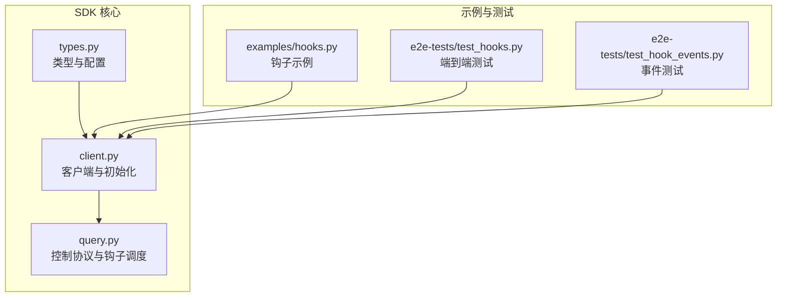
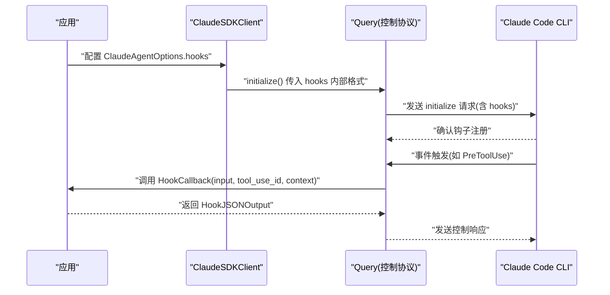
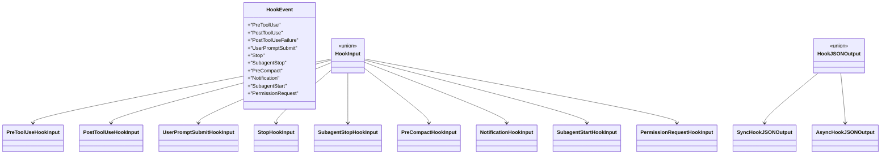
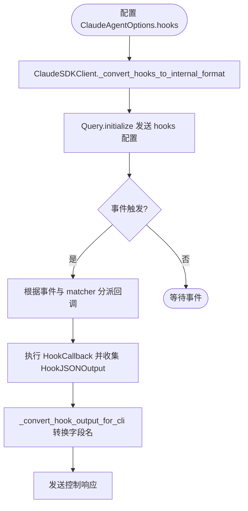
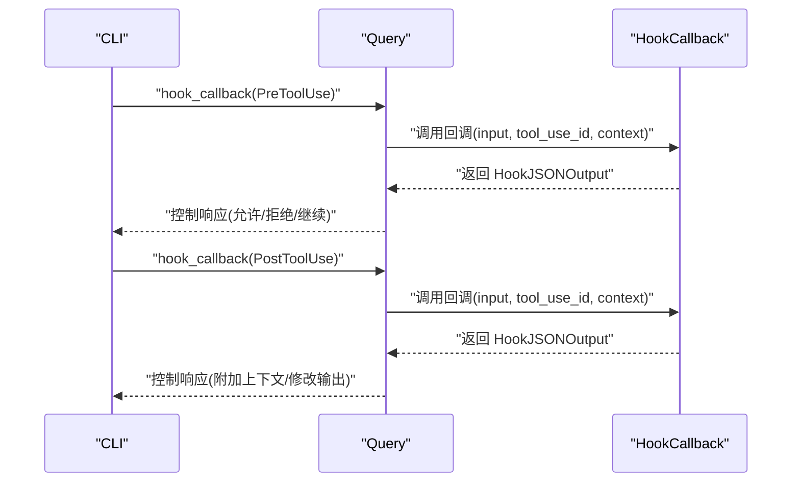
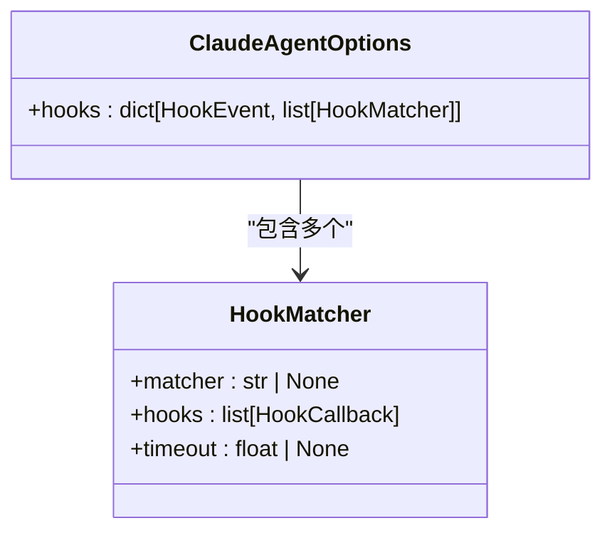
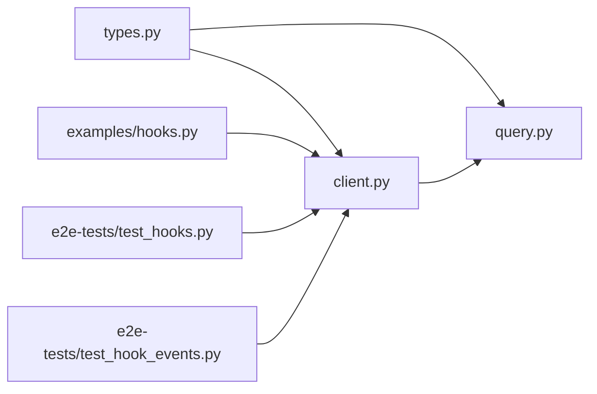

# 钩子配置

<cite>
**本文引用的文件**
- [types.py](file://src/claude_agent_sdk/types.py)
- [client.py](file://src/claude_agent_sdk/client.py)
- [query.py](file://src/claude_agent_sdk/_internal/query.py)
- [hooks.py](file://examples/hooks.py)
- [test_hooks.py](file://e2e-tests/test_hooks.py)
- [test_hook_events.py](file://e2e-tests/test_hook_events.py)
- [README.md](file://README.md)
</cite>

## 目录
1. [简介](#简介)
2. [项目结构](#项目结构)
3. [核心组件](#核心组件)
4. [架构总览](#架构总览)
5. [详细组件分析](#详细组件分析)
6. [依赖分析](#依赖分析)
7. [性能考虑](#性能考虑)
8. [故障排查指南](#故障排查指南)
9. [结论](#结论)
10. [附录](#附录)

## 简介
本文件系统性地阐述 Claude Agent SDK 的钩子（Hook）配置与使用方法，覆盖以下关键主题：
- 钩子事件类型（HookEvent）与输入输出模型
- 钩子匹配器（HookMatcher）的配置方式与匹配规则
- 各类钩子事件的触发时机与用途：PreToolUse、PostToolUse、PostToolUseFailure、UserPromptSubmit、Stop、SubagentStop、PreCompact、Notification、SubagentStart、PermissionRequest
- 钩子回调函数签名与实现要点（HookCallback）、返回结构（HookJSONOutput）
- 钩子执行顺序、超时配置与错误处理机制
- 钩子开发最佳实践与性能优化建议
- 完整的配置示例与常见扩展场景

## 项目结构
围绕钩子功能的相关代码主要分布在以下模块：
- 类型定义与配置：src/claude_agent_sdk/types.py
- 客户端与初始化：src/claude_agent_sdk/client.py
- 控制协议与钩子回调调度：src/claude_agent_sdk/_internal/query.py
- 示例与用法：examples/hooks.py
- 端到端测试：e2e-tests/test_hooks.py、e2e-tests/test_hook_events.py
- 快速开始与钩子概览：README.md

**图表来源**
- [types.py](file://src/claude_agent_sdk/types.py)
- [client.py](file://src/claude_agent_sdk/client.py)
- [query.py](file://src/claude_agent_sdk/_internal/query.py)
- [hooks.py](file://examples/hooks.py)
- [test_hooks.py](file://e2e-tests/test_hooks.py)
- [test_hook_events.py](file://e2e-tests/test_hook_events.py)

**章节来源**
- [types.py](file://src/claude_agent_sdk/types.py)
- [client.py](file://src/claude_agent_sdk/client.py)
- [query.py](file://src/claude_agent_sdk/_internal/query.py)
- [hooks.py](file://examples/hooks.py)
- [test_hooks.py](file://e2e-tests/test_hooks.py)
- [test_hook_events.py](file://e2e-tests/test_hook_events.py)
- [README.md](file://README.md)

## 核心组件
- 钩子事件类型（HookEvent）：枚举了所有可用的钩子事件名称，如 PreToolUse、PostToolUse、UserPromptSubmit、Stop、SubagentStop、PreCompact、Notification、SubagentStart、PermissionRequest。
- 钩子输入类型（HookInput）：基于事件类型的联合类型，包含各事件所需的字段，例如 PreToolUseHookInput 包含 tool_name、tool_input、tool_use_id；UserPromptSubmitHookInput 包含 prompt。
- 钩子输出类型（HookJSONOutput）：支持同步输出（SyncHookJSONOutput）与异步输出（AsyncHookJSONOutput），用于控制继续执行、阻断、附加上下文等。
- 钩子回调（HookCallback）：函数签名接受 HookInput、可选的 tool_use_id、HookContext，并返回 HookJSONOutput。
- 钩子匹配器（HookMatcher）：用于将事件名与一组钩子回调关联，并可设置该组钩子的超时时间。

**章节来源**
- [types.py](file://src/claude_agent_sdk/types.py)

## 架构总览
钩子在 SDK 中通过“控制协议”进行工作：客户端在初始化时将钩子配置发送给 Claude Code CLI，CLI 在相应事件发生时向 SDK 发送控制请求，SDK 调度对应的钩子回调并返回结果。

**图表来源**
- [client.py](file://src/claude_agent_sdk/client.py)
- [query.py](file://src/claude_agent_sdk/_internal/query.py)
- [types.py](file://src/claude_agent_sdk/types.py)

## 详细组件分析

### 钩子事件类型与输入输出模型
- 事件类型（HookEvent）：包括 PreToolUse、PostToolUse、PostToolUseFailure、UserPromptSubmit、Stop、SubagentStop、PreCompact、Notification、SubagentStart、PermissionRequest。
- 输入模型（HookInput）：按事件类型细分，如 PreToolUseHookInput、PostToolUseHookInput、UserPromptSubmitHookInput 等，均继承基础字段 session_id、transcript_path、cwd 等。
- 输出模型（HookJSONOutput）：分为同步输出与异步输出两类，支持控制字段（如 continue_、suppressOutput、stopReason）与决策字段（如 decision、systemMessage、reason），以及事件特定的 hookSpecificOutput。

**图表来源**
- [types.py](file://src/claude_agent_sdk/types.py)

**章节来源**
- [types.py](file://src/claude_agent_sdk/types.py)

### 钩子回调与匹配器
- 回调签名（HookCallback）：接收 HookInput、可选的 tool_use_id、HookContext，返回 HookJSONOutput。
- 匹配器（HookMatcher）：包含 matcher（字符串匹配规则，如工具名或“工具A|工具B”组合）、hooks（回调列表）、timeout（超时秒数）。
- 客户端转换：ClaudeSDKClient 将 ClaudeAgentOptions.hooks 转换为内部格式，传递给 Query.initialize。

**图表来源**
- [client.py](file://src/claude_agent_sdk/client.py)
- [query.py](file://src/claude_agent_sdk/_internal/query.py)
- [types.py](file://src/claude_agent_sdk/types.py)

**章节来源**
- [client.py](file://src/claude_agent_sdk/client.py)
- [query.py](file://src/claude_agent_sdk/_internal/query.py)
- [types.py](file://src/claude_agent_sdk/types.py)

### 钩子事件详解与触发时机
- PreToolUse：在工具调用前触发，可用于权限决策（permissionDecision）、修改输入（updatedInput）、附加上下文（additionalContext）。
- PostToolUse：在工具调用后触发，可用于记录结果、修改输出（updatedMCPToolOutput）、附加上下文。
- PostToolUseFailure：工具调用失败时触发，可用于记录错误、附加上下文。
- UserPromptSubmit：用户提交提示时触发，可用于注入上下文或系统消息。
- Stop：会话停止时触发，可用于清理资源或记录状态。
- SubagentStop：子代理停止时触发，包含 agent_id、agent_type 等信息。
- PreCompact：压缩对话前触发，包含触发方式与自定义指令。
- Notification：通知事件触发，可用于监控与审计。
- SubagentStart：子代理启动时触发，可用于初始化子代理上下文。
- PermissionRequest：权限请求时触发，可用于生成决策（decision）。

**图表来源**
- [query.py](file://src/claude_agent_sdk/_internal/query.py)
- [types.py](file://src/claude_agent_sdk/types.py)

**章节来源**
- [types.py](file://src/claude_agent_sdk/types.py)
- [test_hook_events.py](file://e2e-tests/test_hook_events.py)

### 钩子回调函数签名与实现要求
- 签名：async def callback(input_data: HookInput, tool_use_id: str | None, context: HookContext) -> HookJSONOutput
- 返回值：必须符合 HookJSONOutput 结构，可包含控制字段（如 continue_、suppressOutput、stopReason）、决策字段（如 decision、systemMessage、reason）与事件特定的 hookSpecificOutput。
- 字段名转换：Python 使用 async_ 与 continue_，SDK 会在发送给 CLI 前自动转换为 async 与 continue。

**章节来源**
- [types.py](file://src/claude_agent_sdk/types.py)
- [query.py](file://src/claude_agent_sdk/_internal/query.py)

### 钩子匹配器配置示例
- 单事件多匹配器：同一事件可注册多个 HookMatcher，每个可指定不同的 matcher 规则与超时。
- 工具名匹配：matcher 可为具体工具名（如 "Bash"），也可为“工具A|工具B”的组合。
- 全局匹配：matcher=None 表示匹配所有实例（如 UserPromptSubmit）。
- 超时配置：每个 HookMatcher 可设置 timeout 秒，影响该组回调的执行时限。

**图表来源**
- [types.py](file://src/claude_agent_sdk/types.py)

**章节来源**
- [types.py](file://src/claude_agent_sdk/types.py)
- [hooks.py](file://examples/hooks.py)

### 执行顺序、超时与错误处理
- 执行顺序：由 CLI 在事件发生时按注册顺序分派回调；SDK 为每个回调分配唯一 callback_id 并维护映射。
- 超时：可在 HookMatcher 指定 timeout；Query.initialize 时将超时信息一并发送；控制请求默认超时为 60 秒，可通过环境变量调整。
- 错误处理：回调异常会被捕获并转换为控制响应中的 error；CLI 侧若未在时限内收到响应，会抛出超时错误。

**章节来源**
- [query.py](file://src/claude_agent_sdk/_internal/query.py)
- [client.py](file://src/claude_agent_sdk/client.py)

### 钩子开发最佳实践与性能优化
- 最小化阻塞：避免在钩子中执行耗时操作；必要时使用异步输出（async_=True）与 asyncTimeout。
- 明确控制字段：合理使用 continue_、stopReason、suppressOutput，确保用户体验与安全性。
- 事件特定输出：充分利用 hookSpecificOutput 提供的事件级控制，减少跨事件的额外逻辑。
- 超时与并发：为高风险事件设置更短超时；对可能并发触发的事件（如 PostToolUse）注意幂等性与去重。
- 日志与可观测性：在钩子中记录关键信息，便于调试与审计。

**章节来源**
- [types.py](file://src/claude_agent_sdk/types.py)
- [query.py](file://src/claude_agent_sdk/_internal/query.py)

### 完整钩子配置示例（场景化）
以下示例展示了常见扩展场景的配置思路（请参考示例文件获取实际代码路径）：
- 阻止危险 Bash 命令：在 PreToolUse 中检查命令模式并拒绝。
- 添加会话上下文：在 UserPromptSubmit 中注入自定义上下文。
- 审核工具输出：在 PostToolUse 中对错误输出给出原因与系统消息。
- 严格写入策略：在 PreToolUse 中对敏感文件写入进行安全策略控制。
- 错误时中断：在 PostToolUse 中检测严重错误并停止执行。
- 多事件组合：同时注册 Notification、PreToolUse、PostToolUse 等事件，统一追踪。

**章节来源**
- [hooks.py](file://examples/hooks.py)
- [test_hooks.py](file://e2e-tests/test_hooks.py)
- [test_hook_events.py](file://e2e-tests/test_hook_events.py)
- [README.md](file://README.md)

## 依赖分析
钩子系统的关键依赖关系如下：
- ClaudeSDKClient 依赖 types.HookEvent、HookMatcher、HookCallback、HookJSONOutput。
- Query 在初始化阶段将钩子配置转换为 CLI 可识别的格式，并在事件触发时调度回调。
- 测试与示例验证了端到端行为，包括字段转换、决策字段、异步输出与多事件组合。

**图表来源**
- [types.py](file://src/claude_agent_sdk/types.py)
- [client.py](file://src/claude_agent_sdk/client.py)
- [query.py](file://src/claude_agent_sdk/_internal/query.py)
- [hooks.py](file://examples/hooks.py)
- [test_hooks.py](file://e2e-tests/test_hooks.py)
- [test_hook_events.py](file://e2e-tests/test_hook_events.py)

**章节来源**
- [types.py](file://src/claude_agent_sdk/types.py)
- [client.py](file://src/claude_agent_sdk/client.py)
- [query.py](file://src/claude_agent_sdk/_internal/query.py)
- [hooks.py](file://examples/hooks.py)
- [test_hooks.py](file://e2e-tests/test_hooks.py)
- [test_hook_events.py](file://e2e-tests/test_hook_events.py)

## 性能考虑
- 异步与超时：优先使用异步输出与合理超时，避免阻塞主流程。
- 回调数量与复杂度：尽量减少单事件回调数量与回调内的 IO 操作。
- 字段转换开销：SDK 对字段名进行一次转换，避免在回调中重复构造大对象。
- 并发与顺序：注意多匹配器并发执行时的资源竞争与幂等性设计。

[本节为通用指导，无需列出具体文件来源]

## 故障排查指南
- 回调未触发：检查事件名是否正确、matcher 是否匹配、是否在流式模式下初始化。
- 字段名不生效：确认使用 Python 风格字段名（async_、continue_），SDK 会自动转换。
- 超时问题：适当提高 HookMatcher.timeout 或全局初始化超时；检查回调内部是否有阻塞。
- 错误响应：查看控制响应中的 error 字段，定位回调异常。

**章节来源**
- [query.py](file://src/claude_agent_sdk/_internal/query.py)
- [test_hooks.py](file://e2e-tests/test_hooks.py)

## 结论
通过 HookMatcher 与 HookCallback 的组合，开发者可以在关键生命周期点对 Claude 的行为进行可控干预。遵循本文的配置方法、事件语义与最佳实践，可以构建稳定、可观测且高性能的钩子系统。

[本节为总结性内容，无需列出具体文件来源]

## 附录
- 快速开始与钩子概览参见 README 中的钩子示例与说明。
- 更多示例与端到端测试可参考 examples/hooks.py 与 e2e-tests 下的测试文件。

**章节来源**
- [README.md](file://README.md)
- [hooks.py](file://examples/hooks.py)
- [test_hooks.py](file://e2e-tests/test_hooks.py)
- [test_hook_events.py](file://e2e-tests/test_hook_events.py)