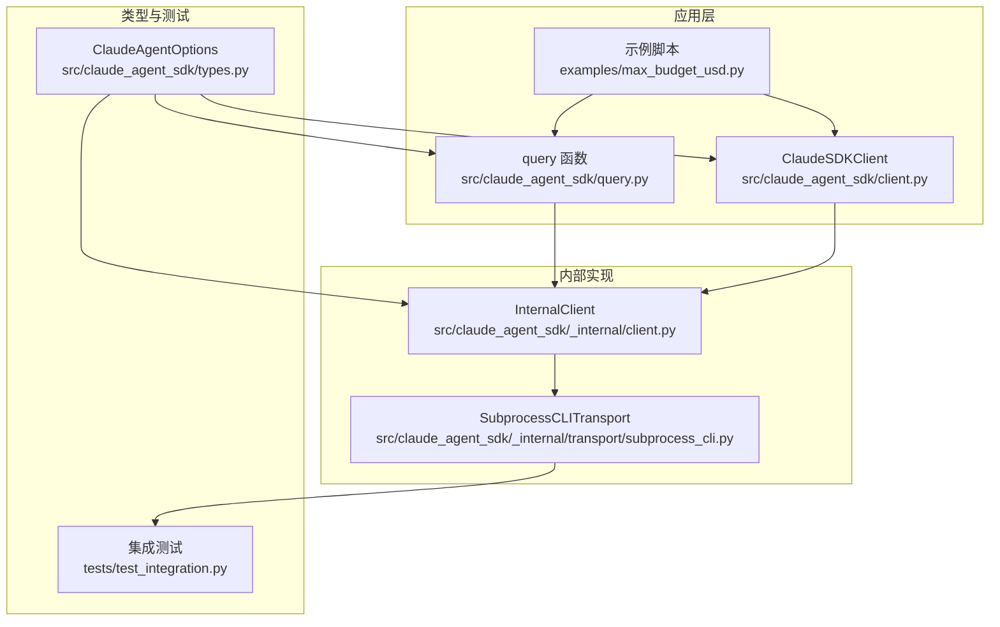
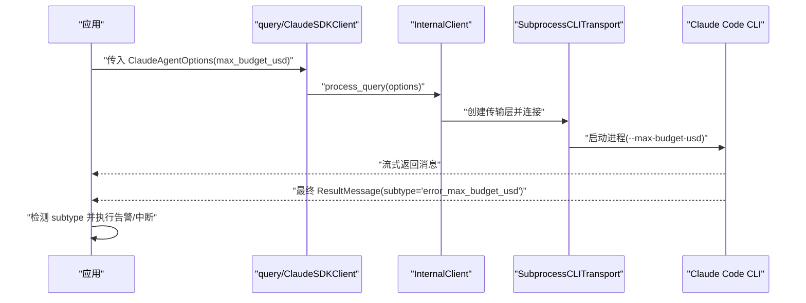
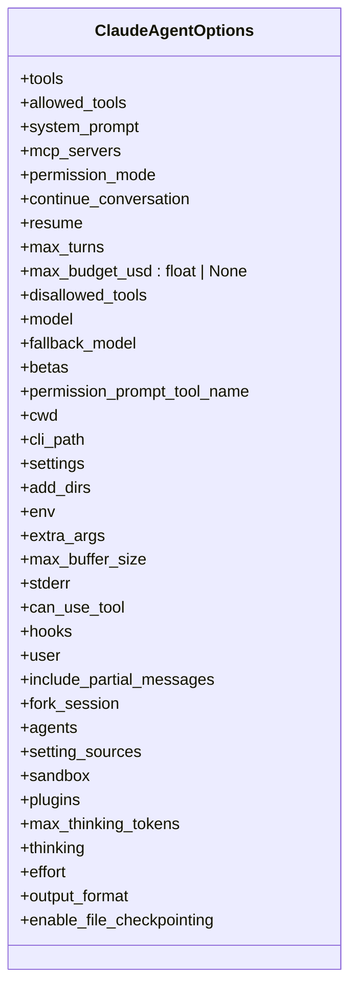
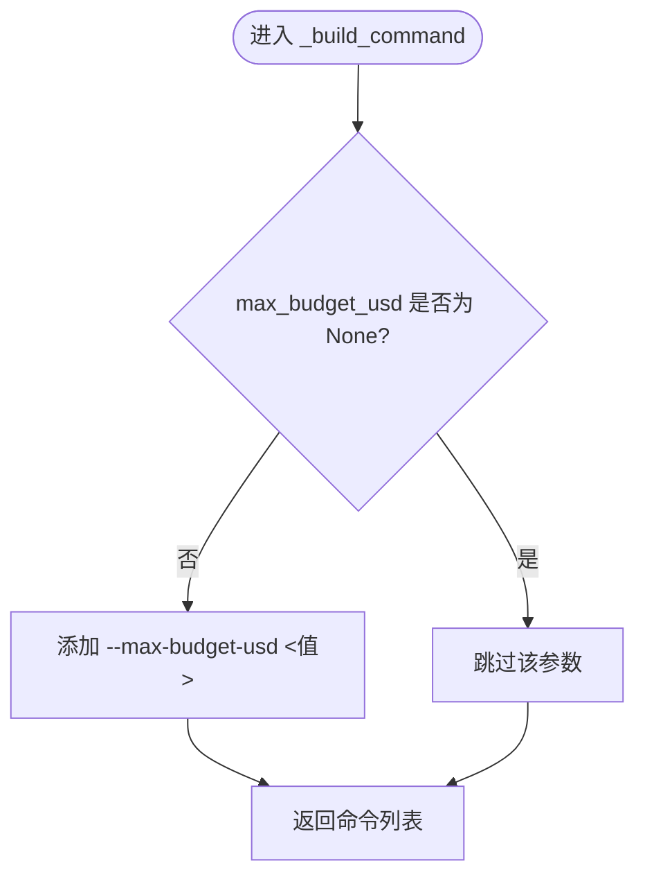
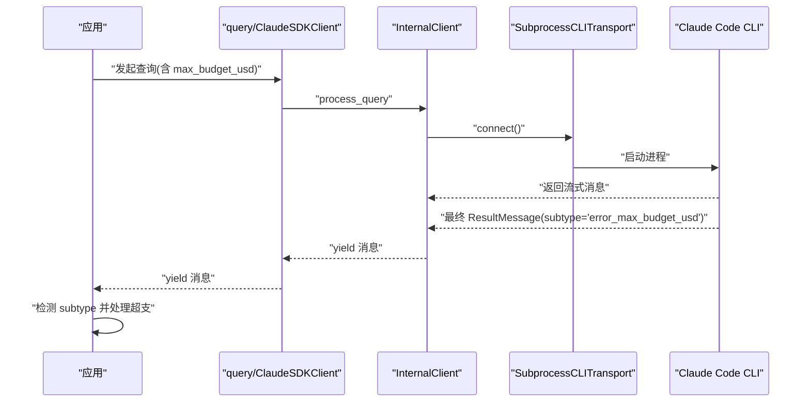
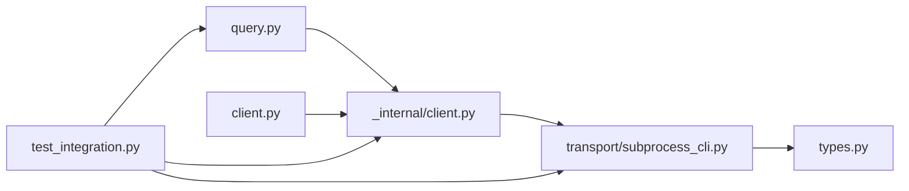

# 预算配置

<cite>
**本文引用的文件**
- [max_budget_usd.py](file://examples/max_budget_usd.py)
- [types.py](file://src/claude_agent_sdk/types.py)
- [query.py](file://src/claude_agent_sdk/query.py)
- [client.py](file://src/claude_agent_sdk/client.py)
- [_internal/client.py](file://src/claude_agent_sdk/_internal/client.py)
- [subprocess_cli.py](file://src/claude_agent_sdk/_internal/transport/subprocess_cli.py)
- [test_integration.py](file://tests/test_integration.py)
- [README.md](file://README.md)
</cite>

## 目录
1. [简介](#简介)
2. [项目结构](#项目结构)
3. [核心组件](#核心组件)
4. [架构总览](#架构总览)
5. [详细组件分析](#详细组件分析)
6. [依赖分析](#依赖分析)
7. [性能考虑](#性能考虑)
8. [故障排查指南](#故障排查指南)
9. [结论](#结论)
10. [附录](#附录)

## 简介
本章节面向希望在 Claude Agent SDK 中启用“最大预算限制（max_budget_usd）”的开发者，系统性阐述以下内容：
- 最大预算限制的概念与作用：通过在每次 API 调用完成后进行累计与比较，实现对总消费的上限控制。
- 预算计算方式与费用控制机制：预算检查发生在单次调用结束后，因此最终总花费可能略高于设定值，但不会超过一个 API 调用的范围。
- 配置方法与参数含义：如何在 ClaudeAgentOptions 中设置 max_budget_usd，并将其传递给底层 CLI。
- 监控与告警：如何在应用中识别预算超支事件（subtype 为 error_max_budget_usd），并据此触发告警或中断流程。
- 与其他配置的关系：max_budget_usd 与工具权限、会话管理、模型选择等配置的协同与优先级。
- 最佳实践与成本优化建议：如何根据任务复杂度与使用场景合理设置预算阈值。
- 实际示例：提供不同预算场景下的配置与行为示例。

## 项目结构
围绕预算配置的关键文件与职责如下：
- 示例：examples/max_budget_usd.py 提供了三种典型预算场景的演示（无预算、合理预算、紧预算）。
- 类型定义：src/claude_agent_sdk/types.py 定义了 ClaudeAgentOptions，其中包含 max_budget_usd 字段。
- 查询入口：src/claude_agent_sdk/query.py 与 src/claude_agent_sdk/client.py 提供两种交互模式，均支持传入 ClaudeAgentOptions。
- 内部实现：src/claude_agent_sdk/_internal/client.py 负责内部查询流程；src/claude_agent_sdk/_internal/transport/subprocess_cli.py 将 max_budget_usd 转换为 CLI 参数并启动子进程。
- 测试验证：tests/test_integration.py 验证预算超支时返回的 subtype 为 error_max_budget_usd，并确保预算值正确传递到传输层。

图表来源
- [max_budget_usd.py:1-95](file://examples/max_budget_usd.py#L1-L95)
- [query.py:1-127](file://src/claude_agent_sdk/query.py#L1-L127)
- [client.py:1-500](file://src/claude_agent_sdk/client.py#L1-L500)
- [_internal/client.py:1-146](file://src/claude_agent_sdk/_internal/client.py#L1-L146)
- [subprocess_cli.py:166-203](file://src/claude_agent_sdk/_internal/transport/subprocess_cli.py#L166-L203)
- [types.py:1030-1099](file://src/claude_agent_sdk/types.py#L1030-L1099)
- [test_integration.py:234-308](file://tests/test_integration.py#L234-L308)

章节来源
- [max_budget_usd.py:1-95](file://examples/max_budget_usd.py#L1-L95)
- [types.py:1030-1099](file://src/claude_agent_sdk/types.py#L1030-L1099)
- [query.py:1-127](file://src/claude_agent_sdk/query.py#L1-L127)
- [client.py:1-500](file://src/claude_agent_sdk/client.py#L1-L500)
- [_internal/client.py:1-146](file://src/claude_agent_sdk/_internal/client.py#L1-L146)
- [subprocess_cli.py:166-203](file://src/claude_agent_sdk/_internal/transport/subprocess_cli.py#L166-L203)
- [test_integration.py:234-308](file://tests/test_integration.py#L234-L308)

## 核心组件
- ClaudeAgentOptions.max_budget_usd
  - 类型：float | None
  - 含义：最大预算（美元）。当为 None 时不启用预算限制；设置为正数时启用预算控制。
  - 默认值：None
  - 传递路径：从 ClaudeAgentOptions 到 SubprocessCLITransport，再由 _build_command 构建为 --max-budget-usd CLI 参数。
- ResultMessage.subtype
  - 当预算超支时，最终的 ResultMessage.subtype 为 "error_max_budget_usd"，用于在应用侧识别并处理超支事件。
- 查询接口
  - query()：一次性查询，适合简单、无状态的任务。
  - ClaudeSDKClient：双向交互式会话，适合需要持续对话与动态控制的场景。

章节来源
- [types.py:1030-1099](file://src/claude_agent_sdk/types.py#L1030-L1099)
- [subprocess_cli.py:200-203](file://src/claude_agent_sdk/_internal/transport/subprocess_cli.py#L200-L203)
- [query.py:12-127](file://src/claude_agent_sdk/query.py#L12-L127)
- [client.py:21-60](file://src/claude_agent_sdk/client.py#L21-L60)
- [test_integration.py:234-308](file://tests/test_integration.py#L234-L308)

## 架构总览
预算配置在 SDK 中的端到端流程如下：
- 应用层设置 ClaudeAgentOptions.max_budget_usd。
- query 或 ClaudeSDKClient 将选项传递给 InternalClient。
- InternalClient 创建 SubprocessCLITransport 并调用其 _build_command。
- _build_command 将 max_budget_usd 转换为 --max-budget-usd CLI 参数。
- CLI 进程执行并返回流式消息；当累计消费超过预算时，最终 ResultMessage.subtype 为 "error_max_budget_usd"。
- 应用层监听 ResultMessage，检测 subtype 是否为 "error_max_budget_usd" 并采取相应动作（如中断、告警、记录日志）。

图表来源
- [query.py:12-127](file://src/claude_agent_sdk/query.py#L12-L127)
- [_internal/client.py:44-146](file://src/claude_agent_sdk/_internal/client.py#L44-L146)
- [subprocess_cli.py:166-203](file://src/claude_agent_sdk/_internal/transport/subprocess_cli.py#L166-L203)
- [test_integration.py:250-308](file://tests/test_integration.py#L250-L308)

## 详细组件分析

### 组件一：ClaudeAgentOptions 与 max_budget_usd
- 字段定义：max_budget_usd: float | None，默认为 None，表示不启用预算限制。
- 使用场景：在 query() 或 ClaudeSDKClient 初始化时传入，影响后续的传输层构建与 CLI 参数。
- 注意事项：仅当设置为正数值时才生效；若为 None，则不向 CLI 传递 --max-budget-usd 参数。

图表来源
- [types.py:1030-1099](file://src/claude_agent_sdk/types.py#L1030-L1099)

章节来源
- [types.py:1030-1099](file://src/claude_agent_sdk/types.py#L1030-L1099)

### 组件二：SubprocessCLITransport 与 CLI 参数映射
- 参数构建：当 options.max_budget_usd 不为 None 时，_build_command 会添加 --max-budget-usd <值>。
- 传输层职责：负责启动 CLI 子进程、读写标准输入输出、解析流式消息、处理错误与退出码。
- 版本检查：在未显式禁用版本检查时，会对 CLI 版本进行校验并发出警告。

图表来源
- [subprocess_cli.py:166-203](file://src/claude_agent_sdk/_internal/transport/subprocess_cli.py#L166-L203)

章节来源
- [subprocess_cli.py:166-203](file://src/claude_agent_sdk/_internal/transport/subprocess_cli.py#L166-L203)

### 组件三：查询流程与预算超支事件
- 流程要点：
  - query() 与 ClaudeSDKClient 均通过 InternalClient 处理请求。
  - InternalClient 创建 SubprocessCLITransport 并启动 CLI。
  - CLI 返回流式消息；当累计消费超过预算时，最终 ResultMessage.subtype 为 "error_max_budget_usd"。
- 应用侧处理：
  - 监听 ResultMessage，判断 subtype 是否为 "error_max_budget_usd"。
  - 执行告警、记录日志、中断后续操作或回滚状态。

图表来源
- [query.py:12-127](file://src/claude_agent_sdk/query.py#L12-L127)
- [_internal/client.py:44-146](file://src/claude_agent_sdk/_internal/client.py#L44-L146)
- [subprocess_cli.py:335-480](file://src/claude_agent_sdk/_internal/transport/subprocess_cli.py#L335-L480)
- [test_integration.py:250-308](file://tests/test_integration.py#L250-L308)

章节来源
- [query.py:12-127](file://src/claude_agent_sdk/query.py#L12-L127)
- [_internal/client.py:44-146](file://src/claude_agent_sdk/_internal/client.py#L44-L146)
- [subprocess_cli.py:335-480](file://src/claude_agent_sdk/_internal/transport/subprocess_cli.py#L335-L480)
- [test_integration.py:234-308](file://tests/test_integration.py#L234-L308)

### 组件四：示例与实际使用
- 无预算限制：直接发起查询，观察 ResultMessage 中的 total_cost_usd。
- 合理预算：设置 max_budget_usd 为足够覆盖一次简单查询的金额，避免超支。
- 紧预算：设置极小的 max_budget_usd，预期会触发 "error_max_budget_usd"，用于验证预算控制逻辑。

章节来源
- [max_budget_usd.py:15-95](file://examples/max_budget_usd.py#L15-L95)

## 依赖分析
- 组件耦合关系：
  - query/ClaudeSDKClient 依赖 InternalClient。
  - InternalClient 依赖 SubprocessCLITransport。
  - SubprocessCLITransport 依赖 ClaudeAgentOptions（含 max_budget_usd）。
  - 测试依赖集成测试模块验证预算超支事件。
- 外部依赖：
  - Claude Code CLI：作为子进程运行，接收 --max-budget-usd 参数。
  - anyio：用于异步 IO 与进程管理。
- 潜在循环依赖：当前结构为单向依赖，无明显循环。

图表来源
- [query.py:1-127](file://src/claude_agent_sdk/query.py#L1-L127)
- [client.py:1-500](file://src/claude_agent_sdk/client.py#L1-L500)
- [_internal/client.py:1-146](file://src/claude_agent_sdk/_internal/client.py#L1-L146)
- [subprocess_cli.py:1-630](file://src/claude_agent_sdk/_internal/transport/subprocess_cli.py#L1-L630)
- [types.py:1030-1099](file://src/claude_agent_sdk/types.py#L1030-L1099)
- [test_integration.py:234-308](file://tests/test_integration.py#L234-L308)

章节来源
- [query.py:1-127](file://src/claude_agent_sdk/query.py#L1-L127)
- [client.py:1-500](file://src/claude_agent_sdk/client.py#L1-L500)
- [_internal/client.py:1-146](file://src/claude_agent_sdk/_internal/client.py#L1-L146)
- [subprocess_cli.py:1-630](file://src/claude_agent_sdk/_internal/transport/subprocess_cli.py#L1-L630)
- [types.py:1030-1099](file://src/claude_agent_sdk/types.py#L1030-L1099)
- [test_integration.py:234-308](file://tests/test_integration.py#L234-L308)

## 性能考虑
- 预算检查时机：每次 API 调用完成后进行累计与比较，属于轻量级检查，对整体性能影响可忽略。
- 流式消息处理：SDK 以流式方式读取 CLI 输出，避免一次性加载大量数据，降低内存占用。
- 缓冲区大小：可通过 max_buffer_size 控制 JSON 缓冲区上限，防止异常长消息导致内存压力。
- 建议：
  - 在高并发场景下，建议将预算检查与业务逻辑解耦，避免阻塞消息处理主循环。
  - 对于长时间运行的任务，建议定期记录 total_cost_usd，以便提前预警。

## 故障排查指南
- 现象：预算超支但最终总花费略高于设定值
  - 原因：预算检查发生在单次调用完成后，最终总花费可能超出设定值一个 API 调用的范围。
  - 处理：在应用侧检测 ResultMessage.subtype 为 "error_max_budget_usd" 时立即中断后续操作。
- 现象：未设置 max_budget_usd，但 CLI 报错提示预算相关参数
  - 原因：CLI 参数构建逻辑仅在 max_budget_usd 非 None 时添加 --max-budget-usd。
  - 处理：确认 ClaudeAgentOptions 中 max_budget_usd 设置为 None 或正数。
- 现象：集成测试中 subtype 不为 "error_max_budget_usd"
  - 原因：测试用例模拟了预算超支场景，期望 subtype 为 "error_max_budget_usd"。
  - 处理：参考测试用例断言，确保应用侧正确识别该 subtype。

章节来源
- [max_budget_usd.py:88-91](file://examples/max_budget_usd.py#L88-L91)
- [test_integration.py:295-307](file://tests/test_integration.py#L295-L307)

## 结论
- max_budget_usd 是一个实用的成本控制工具，适用于需要严格预算约束的自动化脚本与生产环境。
- 其工作原理是在每次 API 调用完成后进行累计与比较，最终总花费可能略高于设定值，但不会超过一个 API 调用的范围。
- 在应用中应通过监听 ResultMessage.subtype 来识别预算超支事件，并结合告警与中断策略保障成本安全。
- 建议在不同场景下合理设置预算阈值，并结合工具权限、会话管理与模型选择等配置，形成完整的成本治理方案。

## 附录

### 预算配置最佳实践
- 开发与测试阶段：设置适中的 max_budget_usd，便于快速验证预算控制逻辑。
- 生产环境：根据任务复杂度与平均单次调用成本，设置保守的预算上限，并预留一个 API 调用的缓冲额度。
- 自动化流水线：在 CI/CD 中为每个任务配置独立预算，避免跨任务互相影响。
- 成本优化建议：
  - 优先使用较小模型或更短上下文，降低单次调用成本。
  - 合理使用 allowed_tools 与 permission_mode，减少不必要的工具调用。
  - 对长文本处理任务，分批进行并记录中间成本，及时中断高风险任务。

### 预算配置与其它配置的关系
- 工具权限与预算：allowed_tools 与 permission_mode 影响工具调用频率与成本，应与 max_budget_usd 协同设置。
- 会话与模型：max_turns 与 model/fallback_model 会影响总调用次数与单价，需综合评估。
- 工作目录与 MCP：cwd 与 mcp_servers 主要影响可用能力，对预算影响间接，但仍需纳入总体成本估算。

章节来源
- [README.md:57-83](file://README.md#L57-L83)
- [types.py:1030-1099](file://src/claude_agent_sdk/types.py#L1030-L1099)