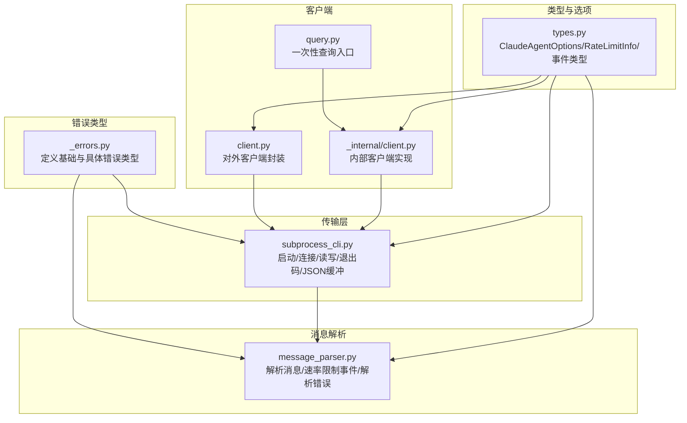
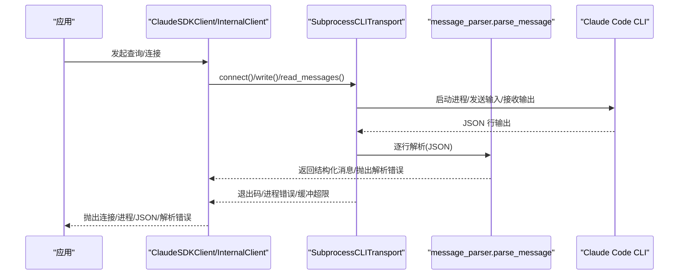
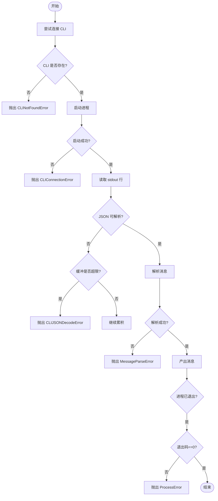
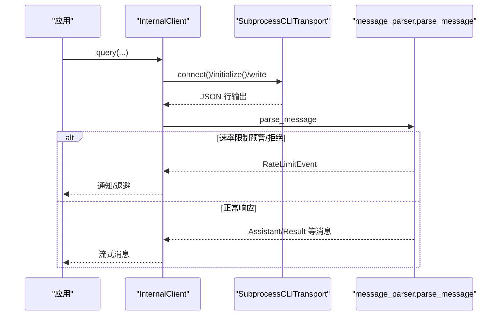
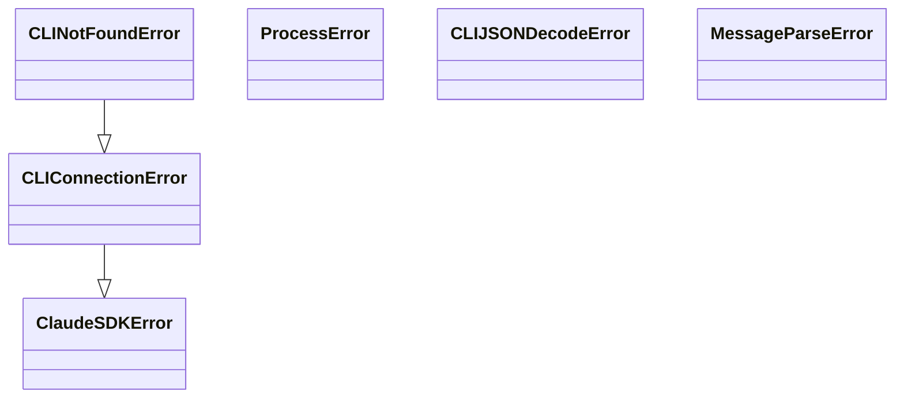

# 错误处理和调试

<cite>
**本文引用的文件**   
- [src/claude_agent_sdk/_errors.py](file://src/claude_agent_sdk/_errors.py)
- [src/claude_agent_sdk/_internal/transport/subprocess_cli.py](file://src/claude_agent_sdk/_internal/transport/subprocess_cli.py)
- [src/claude_agent_sdk/_internal/message_parser.py](file://src/claude_agent_sdk/_internal/message_parser.py)
- [src/claude_agent_sdk/_internal/client.py](file://src/claude_agent_sdk/_internal/client.py)
- [src/claude_agent_sdk/client.py](file://src/claude_agent_sdk/client.py)
- [src/claude_agent_sdk/query.py](file://src/claude_agent_sdk/query.py)
- [src/claude_agent_sdk/types.py](file://src/claude_agent_sdk/types.py)
- [examples/stderr_callback_example.py](file://examples/stderr_callback_example.py)
- [examples/max_budget_usd.py](file://examples/max_budget_usd.py)
- [tests/test_errors.py](file://tests/test_errors.py)
- [tests/test_rate_limit_event_repro.py](file://tests/test_rate_limit_event_repro.py)
- [e2e-tests/test_stderr_callback.py](file://e2e-tests/test_stderr_callback.py)
</cite>

## 目录
1. [简介](#简介)
2. [项目结构](#项目结构)
3. [核心组件](#核心组件)
4. [架构总览](#架构总览)
5. [详细组件分析](#详细组件分析)
6. [依赖分析](#依赖分析)
7. [性能考虑](#性能考虑)
8. [故障排查指南](#故障排查指南)
9. [结论](#结论)
10. [附录](#附录)

## 简介
本指南聚焦 Claude Agent SDK 的错误处理与调试实践，系统梳理 SDK 内置的错误类型（包括 ClaudeSDKError、CLINotFoundError、CLIConnectionError、ProcessError、CLIJSONDecodeError、MessageParseError），解释其触发条件、错误信息含义与解决方案；并提供异常捕获策略、错误恢复机制、用户友好提示、日志与调试技巧、常见问题排查流程以及与性能相关的错误处理（如速率限制与预算超支）。文档同时给出可直接定位到源码位置的参考路径，便于开发者快速对照实现。

## 项目结构
围绕错误处理与调试的关键模块如下：
- 错误类型定义：位于错误模块中，统一继承体系清晰，便于区分不同来源的异常。
- 传输层（子进程 CLI）：负责 CLI 启动、连接、读写、退出码处理与 JSON 解析，是多数运行时错误的源头。
- 消息解析器：负责将 CLI 输出的 JSON 行转为结构化消息对象，解析失败会抛出解析错误。
- 客户端封装：对外暴露查询与交互接口，内部协调传输与解析，并在连接状态不满足时抛出连接类错误。
- 类型与选项：提供 max_budget_usd、stderr 回调等配置项，支撑成本控制与调试输出。
- 示例与测试：覆盖 stderr 回调、预算超限、速率限制事件解析等真实用例。

图表来源
- [src/claude_agent_sdk/_errors.py:6-57](file://src/claude_agent_sdk/_errors.py#L6-L57)
- [src/claude_agent_sdk/_internal/transport/subprocess_cli.py:33-630](file://src/claude_agent_sdk/_internal/transport/subprocess_cli.py#L33-L630)
- [src/claude_agent_sdk/_internal/message_parser.py:29-251](file://src/claude_agent_sdk/_internal/message_parser.py#L29-L251)
- [src/claude_agent_sdk/client.py:21-500](file://src/claude_agent_sdk/client.py#L21-L500)
- [src/claude_agent_sdk/_internal/client.py:20-146](file://src/claude_agent_sdk/_internal/client.py#L20-L146)
- [src/claude_agent_sdk/query.py:12-127](file://src/claude_agent_sdk/query.py#L12-L127)
- [src/claude_agent_sdk/types.py:1030-1199](file://src/claude_agent_sdk/types.py#L1030-L1199)

章节来源
- [src/claude_agent_sdk/_errors.py:6-57](file://src/claude_agent_sdk/_errors.py#L6-L57)
- [src/claude_agent_sdk/_internal/transport/subprocess_cli.py:33-630](file://src/claude_agent_sdk/_internal/transport/subprocess_cli.py#L33-L630)
- [src/claude_agent_sdk/_internal/message_parser.py:29-251](file://src/claude_agent_sdk/_internal/message_parser.py#L29-L251)
- [src/claude_agent_sdk/client.py:21-500](file://src/claude_agent_sdk/client.py#L21-L500)
- [src/claude_agent_sdk/_internal/client.py:20-146](file://src/claude_agent_sdk/_internal/client.py#L20-L146)
- [src/claude_agent_sdk/query.py:12-127](file://src/claude_agent_sdk/query.py#L12-L127)
- [src/claude_agent_sdk/types.py:1030-1199](file://src/claude_agent_sdk/types.py#L1030-L1199)

## 核心组件
- 基础与具体错误类型
  - ClaudeSDKError：所有 SDK 异常的基类。
  - CLIConnectionError：无法连接到 Claude Code 的通用连接错误。
  - CLINotFoundError：未找到或未安装 Claude Code。
  - ProcessError：CLI 进程执行失败，携带 exit_code 与 stderr。
  - CLIJSONDecodeError：从 CLI 输出解析 JSON 失败，携带原始行与原始异常。
  - MessageParseError：消息解析失败，携带原始数据以便诊断。
- 传输层（SubprocessCLITransport）
  - 负责 CLI 查找、命令构建、进程启动、stdin/stdout/stderr 流管理、退出码处理、JSON 缓冲与解码、版本检查与警告。
- 消息解析器（parse_message）
  - 将 CLI 输出的 JSON 行解析为结构化消息对象，支持速率限制事件等；解析失败抛出 MessageParseError。
- 客户端与查询
  - ClaudeSDKClient：面向交互式会话的客户端，提供连接、消息收发、中断、权限与模型切换、MCP 管理等。
  - InternalClient/process_query：内部实现，负责传输初始化、消息流处理与关闭。
- 类型与选项
  - ClaudeAgentOptions：包含 stderr 回调、max_budget_usd、debug_stderr（已废弃）、max_buffer_size 等，支撑调试与成本控制。

章节来源
- [src/claude_agent_sdk/_errors.py:6-57](file://src/claude_agent_sdk/_errors.py#L6-L57)
- [src/claude_agent_sdk/_internal/transport/subprocess_cli.py:33-630](file://src/claude_agent_sdk/_internal/transport/subprocess_cli.py#L33-L630)
- [src/claude_agent_sdk/_internal/message_parser.py:29-251](file://src/claude_agent_sdk/_internal/message_parser.py#L29-L251)
- [src/claude_agent_sdk/client.py:21-500](file://src/claude_agent_sdk/client.py#L21-L500)
- [src/claude_agent_sdk/_internal/client.py:20-146](file://src/claude_agent_sdk/_internal/client.py#L20-L146)
- [src/claude_agent_sdk/query.py:12-127](file://src/claude_agent_sdk/query.py#L12-L127)
- [src/claude_agent_sdk/types.py:1030-1199](file://src/claude_agent_sdk/types.py#L1030-L1199)

## 架构总览
下图展示错误在各层的传播路径与典型触发点：

图表来源
- [src/claude_agent_sdk/client.py:94-197](file://src/claude_agent_sdk/client.py#L94-L197)
- [src/claude_agent_sdk/_internal/client.py:44-146](file://src/claude_agent_sdk/_internal/client.py#L44-L146)
- [src/claude_agent_sdk/_internal/transport/subprocess_cli.py:335-586](file://src/claude_agent_sdk/_internal/transport/subprocess_cli.py#L335-L586)
- [src/claude_agent_sdk/_internal/message_parser.py:29-251](file://src/claude_agent_sdk/_internal/message_parser.py#L29-L251)

## 详细组件分析

### 错误类型与触发条件
- ClaudeSDKError
  - 触发：SDK 内部逻辑抛出的通用异常。
  - 解决：由更具体的子类承载详细信息，上层按子类分支处理。
- CLIConnectionError
  - 触发：未连接或连接状态异常时进行读写/接收操作。
  - 典型场景：未先调用 connect() 即 query/receive_messages/interrupt。
  - 解决：先建立连接，再进行后续操作。
- CLINotFoundError
  - 触发：CLI 二进制未找到（含系统搜索与打包内嵌路径）。
  - 解决：正确安装 CLI，或通过 ClaudeAgentOptions 提供 cli_path。
- ProcessError
  - 触发：CLI 进程返回非零退出码；或写入失败、进程终止。
  - 解决：查看 stderr 输出，修正参数或环境；必要时重试或降级。
- CLIJSONDecodeError
  - 触发：JSON 行缓冲超限或解析失败。
  - 解决：增大 max_buffer_size 或检查 CLI 输出格式是否被截断。
- MessageParseError
  - 触发：消息结构缺失字段或类型不符。
  - 解决：检查上游 CLI 版本兼容性，或更新 SDK 以适配新消息类型。

章节来源
- [src/claude_agent_sdk/_errors.py:6-57](file://src/claude_agent_sdk/_errors.py#L6-L57)
- [src/claude_agent_sdk/client.py:186-232](file://src/claude_agent_sdk/client.py#L186-L232)
- [src/claude_agent_sdk/_internal/transport/subprocess_cli.py:396-410](file://src/claude_agent_sdk/_internal/transport/subprocess_cli.py#L396-L410)
- [src/claude_agent_sdk/_internal/transport/subprocess_cli.py:546-585](file://src/claude_agent_sdk/_internal/transport/subprocess_cli.py#L546-L585)
- [src/claude_agent_sdk/_internal/transport/subprocess_cli.py:587-626](file://src/claude_agent_sdk/_internal/transport/subprocess_cli.py#L587-L626)
- [src/claude_agent_sdk/_internal/message_parser.py:29-51](file://src/claude_agent_sdk/_internal/message_parser.py#L29-L51)

### 连接与消息收发中的错误传播
- 连接阶段
  - CLI 不存在或工作目录无效：抛出 CLINotFoundError/CLIConnectionError。
  - 进程启动失败：抛出 CLIConnectionError。
- 读取阶段
  - stdout 流读取异常：抛出 CLIConnectionError。
  - JSON 解析失败或缓冲超限：抛出 CLIJSONDecodeError。
  - 进程退出码非零：抛出 ProcessError。
- 写入阶段
  - 写入前检查连接状态与进程存活，否则抛出 CLIConnectionError。
- 解析阶段
  - parse_message 对未知/缺字段的消息抛出 MessageParseError。

图表来源
- [src/claude_agent_sdk/_internal/transport/subprocess_cli.py:396-585](file://src/claude_agent_sdk/_internal/transport/subprocess_cli.py#L396-L585)
- [src/claude_agent_sdk/_internal/message_parser.py:29-51](file://src/claude_agent_sdk/_internal/message_parser.py#L29-L51)

章节来源
- [src/claude_agent_sdk/_internal/transport/subprocess_cli.py:335-586](file://src/claude_agent_sdk/_internal/transport/subprocess_cli.py#L335-L586)
- [src/claude_agent_sdk/_internal/message_parser.py:29-251](file://src/claude_agent_sdk/_internal/message_parser.py#L29-L251)

### 速率限制与预算超支
- 速率限制事件
  - CLI 会发出 rate_limit_event，包含状态、重置时间、利用率、超额状态等。
  - SDK 解析为 RateLimitEvent，便于应用提前告警或退避。
- 预算超支
  - 通过 ClaudeAgentOptions.max_budget_usd 设置预算上限。
  - 当预算超支时，结果消息 subtype 为 error_max_budget_usd，应用据此提示用户。

图表来源
- [src/claude_agent_sdk/_internal/client.py:115-142](file://src/claude_agent_sdk/_internal/client.py#L115-L142)
- [src/claude_agent_sdk/_internal/message_parser.py:224-244](file://src/claude_agent_sdk/_internal/message_parser.py#L224-L244)
- [src/claude_agent_sdk/types.py:905-938](file://src/claude_agent_sdk/types.py#L905-L938)

章节来源
- [src/claude_agent_sdk/_internal/message_parser.py:224-244](file://src/claude_agent_sdk/_internal/message_parser.py#L224-L244)
- [src/claude_agent_sdk/types.py:905-938](file://src/claude_agent_sdk/types.py#L905-L938)
- [examples/max_budget_usd.py:51-77](file://examples/max_budget_usd.py#L51-L77)
- [tests/test_integration.py:250-282](file://tests/test_integration.py#L250-L282)

### 日志记录、调试模式与问题诊断
- stderr 回调
  - 通过 ClaudeAgentOptions.stderr 提供回调函数，实时接收 CLI 的调试输出。
  - 示例：stderr_callback_example.py 展示如何收集与筛选错误日志。
- 调试开关
  - 通过 extra_args 传入 debug-to-stderr 开启 CLI 调试输出。
  - e2e 测试验证开启后能捕获到 DEBUG 信息，关闭则不捕获。
- 日志记录
  - 传输层与解析器使用标准 logging 记录关键事件（如版本警告、未知消息跳过）。

章节来源
- [src/claude_agent_sdk/types.py:1053-1060](file://src/claude_agent_sdk/types.py#L1053-L1060)
- [src/claude_agent_sdk/_internal/transport/subprocess_cli.py:412-438](file://src/claude_agent_sdk/_internal/transport/subprocess_cli.py#L412-L438)
- [examples/stderr_callback_example.py:14-25](file://examples/stderr_callback_example.py#L14-L25)
- [e2e-tests/test_stderr_callback.py:10-31](file://e2e-tests/test_stderr_callback.py#L10-L31)

## 依赖分析
- 继承关系
  - CLIConnectionError 继承自 ClaudeSDKError。
  - CLINotFoundError 继承自 CLIConnectionError。
  - ProcessError、CLIJSONDecodeError、MessageParseError 独立于上述层级，分别对应进程、JSON 解析与消息解析。
- 耦合与职责
  - 传输层负责进程生命周期与 IO，向上抛出统一错误类型。
  - 解析器专注于消息结构校验与类型转换，失败即抛出解析错误。
  - 客户端在业务语义层面进行连接状态检查，避免对未连接实例进行操作。

图表来源
- [src/claude_agent_sdk/_errors.py:6-57](file://src/claude_agent_sdk/_errors.py#L6-L57)

章节来源
- [src/claude_agent_sdk/_errors.py:6-57](file://src/claude_agent_sdk/_errors.py#L6-L57)

## 性能考虑
- 速率限制
  - 使用 RateLimitEvent 提前感知“即将受限”或“已被拒绝”的状态，及时退避或提示用户等待窗口重置。
- 预算控制
  - 通过 max_budget_usd 在每次 API 调用完成后检查累计费用，允许轻微超支但可预期。
- 缓冲与吞吐
  - 合理设置 max_buffer_size，避免超大消息导致内存压力；必要时分块处理或降低输出复杂度。
- 并发与资源
  - 避免在同一进程中频繁重启 CLI；保持长连接以减少启动开销。

章节来源
- [src/claude_agent_sdk/_internal/message_parser.py:224-244](file://src/claude_agent_sdk/_internal/message_parser.py#L224-L244)
- [src/claude_agent_sdk/types.py:1041-1041](file://src/claude_agent_sdk/types.py#L1041-L1041)
- [src/claude_agent_sdk/_internal/transport/subprocess_cli.py:546-554](file://src/claude_agent_sdk/_internal/transport/subprocess_cli.py#L546-L554)
- [examples/max_budget_usd.py:51-77](file://examples/max_budget_usd.py#L51-L77)

## 故障排查指南
- CLI 未找到
  - 现象：抛出 CLINotFoundError。
  - 排查：确认 CLI 已安装、PATH 正确；若使用打包内嵌 CLI，确认路径存在；或通过 options.cli_path 指定。
  - 参考：[查找 CLI 与错误抛出:64-95](file://src/claude_agent_sdk/_internal/transport/subprocess_cli.py#L64-L95)
- 连接失败
  - 现象：抛出 CLIConnectionError。
  - 排查：检查工作目录是否存在、环境变量与额外参数；查看 stderr 回调输出。
  - 参考：[连接异常处理:396-410](file://src/claude_agent_sdk/_internal/transport/subprocess_cli.py#L396-L410)
- 进程退出码非零
  - 现象：抛出 ProcessError，包含 exit_code 与建议查看 stderr。
  - 排查：根据 stderr 定位具体错误（权限、参数、资源不足等）。
  - 参考：[退出码处理:572-585](file://src/claude_agent_sdk/_internal/transport/subprocess_cli.py#L572-L585)
- JSON 解析失败或缓冲超限
  - 现象：抛出 CLIJSONDecodeError。
  - 排查：增大 max_buffer_size；检查 CLI 输出是否被截断；确认输出格式为 stream-json。
  - 参考：[缓冲与解码:546-564](file://src/claude_agent_sdk/_internal/transport/subprocess_cli.py#L546-L564)
- 消息解析失败
  - 现象：抛出 MessageParseError。
  - 排查：检查消息字段完整性；升级 SDK 以适配新消息类型；忽略未知类型消息（解析器会跳过）。
  - 参考：[解析失败处理:29-51](file://src/claude_agent_sdk/_internal/message_parser.py#L29-L51)
- 速率限制预警/拒绝
  - 现象：收到 RateLimitEvent，status 为 allowed_warning 或 rejected。
  - 排查：根据 resets_at 与 overage_disabled_reason 判断是否需要等待或调整策略。
  - 参考：[速率限制事件解析:224-244](file://src/claude_agent_sdk/_internal/message_parser.py#L224-L244)
- 预算超支
  - 现象：结果消息 subtype 为 error_max_budget_usd。
  - 排查：提高预算或优化提示词/输出；注意最终费用可能略高于设定值。
  - 参考：[预算超支示例:51-77](file://examples/max_budget_usd.py#L51-L77)

章节来源
- [src/claude_agent_sdk/_internal/transport/subprocess_cli.py:64-95](file://src/claude_agent_sdk/_internal/transport/subprocess_cli.py#L64-L95)
- [src/claude_agent_sdk/_internal/transport/subprocess_cli.py:396-410](file://src/claude_agent_sdk/_internal/transport/subprocess_cli.py#L396-L410)
- [src/claude_agent_sdk/_internal/transport/subprocess_cli.py:572-585](file://src/claude_agent_sdk/_internal/transport/subprocess_cli.py#L572-L585)
- [src/claude_agent_sdk/_internal/transport/subprocess_cli.py:546-564](file://src/claude_agent_sdk/_internal/transport/subprocess_cli.py#L546-L564)
- [src/claude_agent_sdk/_internal/message_parser.py:29-51](file://src/claude_agent_sdk/_internal/message_parser.py#L29-L51)
- [src/claude_agent_sdk/_internal/message_parser.py:224-244](file://src/claude_agent_sdk/_internal/message_parser.py#L224-L244)
- [examples/max_budget_usd.py:51-77](file://examples/max_budget_usd.py#L51-L77)

## 结论
通过统一的错误类型体系、严谨的传输层与解析器实现、完善的调试与诊断能力，Claude Agent SDK 能够帮助开发者稳定地处理各类运行时问题。建议在生产环境中：
- 明确捕获与区分不同错误类型，提供针对性的用户提示与自动恢复策略；
- 启用 stderr 回调与调试开关，结合日志记录进行问题定位；
- 合理配置 max_budget_usd 与 max_buffer_size，配合速率限制事件实现稳健的性能控制。

## 附录
- 实际错误处理与调试示例
  - stderr 回调示例：[stderr_callback_example.py:14-25](file://examples/stderr_callback_example.py#L14-L25)
  - 预算超支示例：[max_budget_usd.py:51-77](file://examples/max_budget_usd.py#L51-L77)
- 单元与集成测试
  - 错误类型测试：[tests/test_errors.py:15-53](file://tests/test_errors.py#L15-L53)
  - 速率限制事件解析测试：[tests/test_rate_limit_event_repro.py:19-46](file://tests/test_rate_limit_event_repro.py#L19-L46)
  - 端到端 stderr 回调测试：[e2e-tests/test_stderr_callback.py:10-31](file://e2e-tests/test_stderr_callback.py#L10-L31)