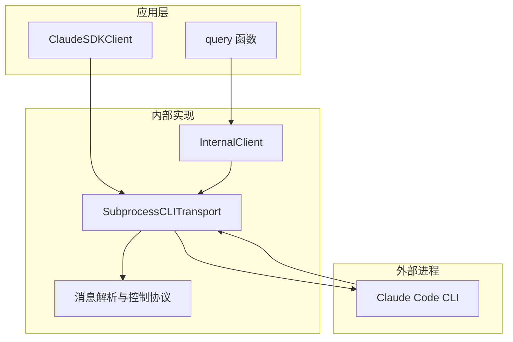
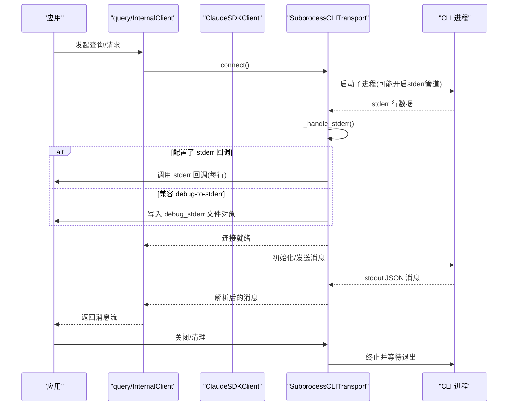
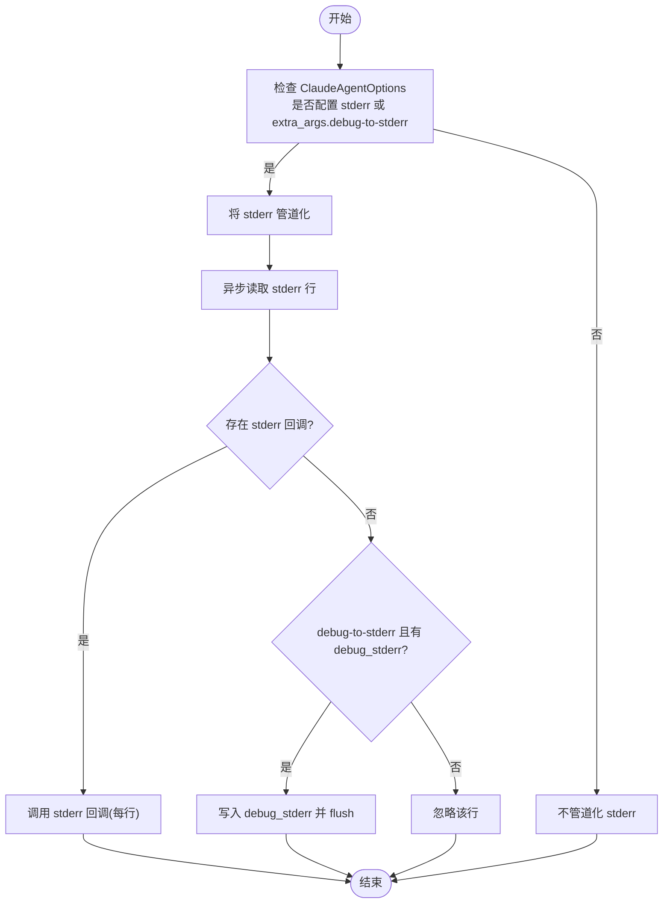
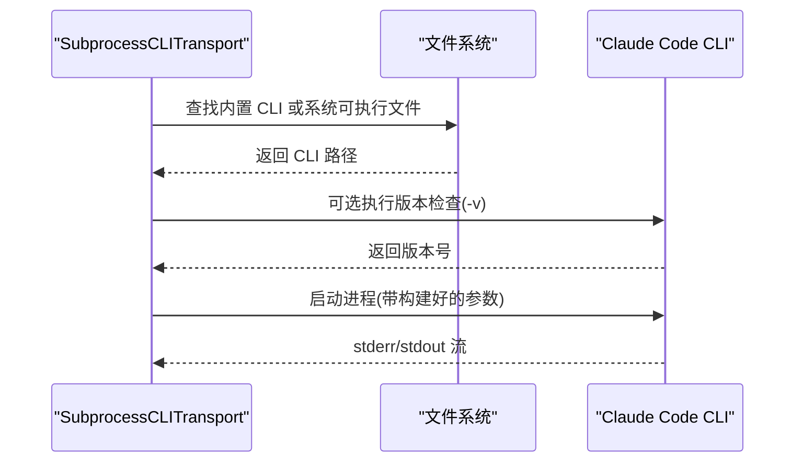
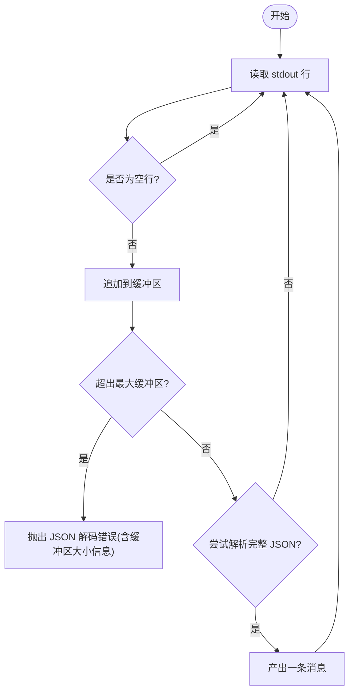
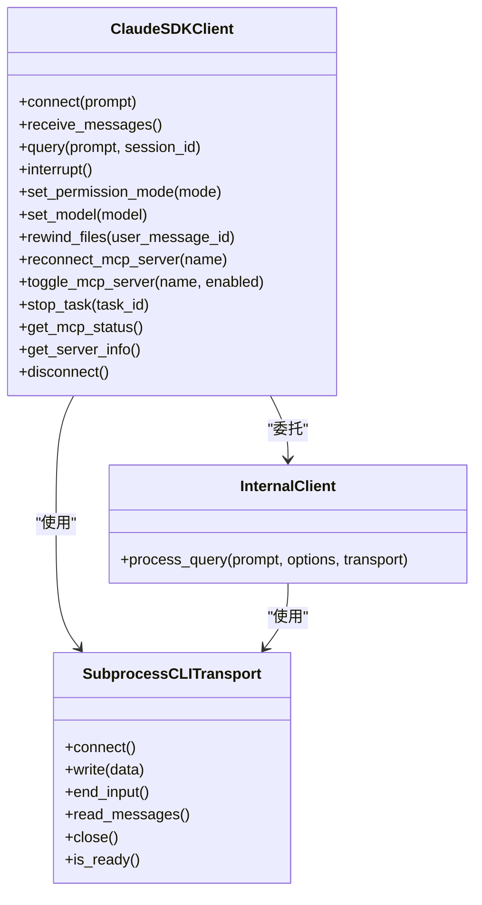
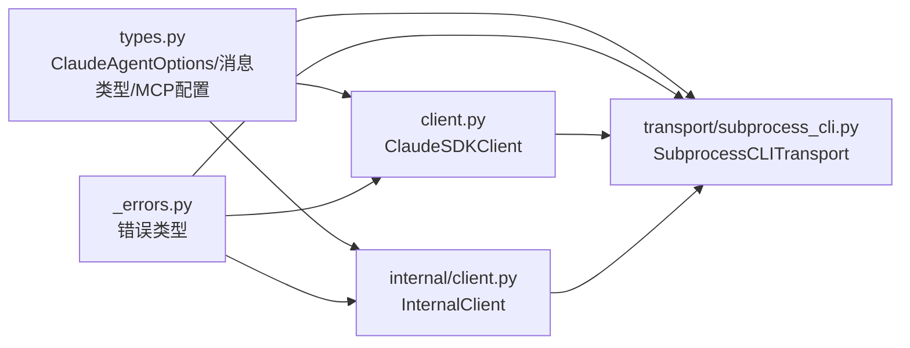

# 调试工具和技巧

<cite>
**本文引用的文件**
- [src/claude_agent_sdk/_internal/transport/subprocess_cli.py](file://src/claude_agent_sdk/_internal/transport/subprocess_cli.py)
- [examples/stderr_callback_example.py](file://examples/stderr_callback_example.py)
- [e2e-tests/test_stderr_callback.py](file://e2e-tests/test_stderr_callback.py)
- [src/claude_agent_sdk/_internal/client.py](file://src/claude_agent_sdk/_internal/client.py)
- [src/claude_agent_sdk/client.py](file://src/claude_agent_sdk/client.py)
- [src/claude_agent_sdk/types.py](file://src/claude_agent_sdk/types.py)
- [src/claude_agent_sdk/_errors.py](file://src/claude_agent_sdk/_errors.py)
- [src/claude_agent_sdk/query.py](file://src/claude_agent_sdk/query.py)
- [tests/test_subprocess_buffering.py](file://tests/test_subprocess_buffering.py)
- [tests/test_transport.py](file://tests/test_transport.py)
- [src/claude_agent_sdk/_version.py](file://src/claude_agent_sdk/_version.py)
</cite>

## 目录
1. [简介](#简介)
2. [项目结构](#项目结构)
3. [核心组件](#核心组件)
4. [架构总览](#架构总览)
5. [详细组件分析](#详细组件分析)
6. [依赖分析](#依赖分析)
7. [性能考虑](#性能考虑)
8. [故障排查指南](#故障排查指南)
9. [结论](#结论)
10. [附录](#附录)

## 简介
本指南围绕 Claude Agent SDK 的调试能力与实践展开，重点覆盖以下方面：
- stderr 回调的使用与配置，以及如何启用详细日志输出
- 如何分析 CLI 进程的 stderr 输出以诊断问题
- 系统化调试流程：环境检查、网络诊断、进程状态验证
- 使用日志级别与过滤器定位问题
- 性能分析与内存使用监控
- 常见调试场景：连接问题排查、消息解析错误诊断、工具调用失败分析
- 调试工具配置示例与最佳实践
- 如何收集与上报调试信息给开发者或技术支持团队

## 项目结构
该 SDK 通过内部传输层启动并管理 Claude Code CLI 子进程，同时提供查询与客户端两类入口。调试相关的关键路径包括：
- 传输层负责子进程生命周期、命令构建、stderr 流读取与回调分发
- 查询与客户端封装了控制协议、消息流处理与资源清理
- 类型定义中包含调试相关的选项（如 stderr 回调、extra_args）
- 错误类型对进程退出码与 JSON 解析异常进行统一包装

**图表来源**
- [src/claude_agent_sdk/query.py:12-127](file://src/claude_agent_sdk/query.py#L12-L127)
- [src/claude_agent_sdk/_internal/client.py:44-146](file://src/claude_agent_sdk/_internal/client.py#L44-L146)
- [src/claude_agent_sdk/_internal/transport/subprocess_cli.py:335-411](file://src/claude_agent_sdk/_internal/transport/subprocess_cli.py#L335-L411)

**章节来源**
- [src/claude_agent_sdk/query.py:12-127](file://src/claude_agent_sdk/query.py#L12-L127)
- [src/claude_agent_sdk/_internal/client.py:44-146](file://src/claude_agent_sdk/_internal/client.py#L44-L146)
- [src/claude_agent_sdk/_internal/transport/subprocess_cli.py:335-411](file://src/claude_agent_sdk/_internal/transport/subprocess_cli.py#L335-L411)

## 核心组件
- SubprocessCLITransport：负责 CLI 命令构建、子进程启动、stdin/stdout/stderr 流管理、stderr 回调分发、进程退出错误检测与资源清理
- InternalClient/ClaudeSDKClient：封装查询与客户端逻辑，负责连接、初始化、消息收发与控制协议交互
- ClaudeAgentOptions：包含 stderr 回调、extra_args、工作目录、环境变量等调试相关配置
- 错误类型：CLIConnectionError、CLINotFoundError、ProcessError、CLIJSONDecodeError 等，用于统一捕获与上报

**章节来源**
- [src/claude_agent_sdk/_internal/transport/subprocess_cli.py:33-63](file://src/claude_agent_sdk/_internal/transport/subprocess_cli.py#L33-L63)
- [src/claude_agent_sdk/_internal/client.py:20-146](file://src/claude_agent_sdk/_internal/client.py#L20-L146)
- [src/claude_agent_sdk/client.py:21-500](file://src/claude_agent_sdk/client.py#L21-L500)
- [src/claude_agent_sdk/types.py:1030-1100](file://src/claude_agent_sdk/types.py#L1030-L1100)
- [src/claude_agent_sdk/_errors.py:6-57](file://src/claude_agent_sdk/_errors.py#L6-L57)

## 架构总览
下图展示了从应用到 CLI 的完整调用链路，以及 stderr 回调在其中的触发点。

**图表来源**
- [src/claude_agent_sdk/query.py:12-127](file://src/claude_agent_sdk/query.py#L12-L127)
- [src/claude_agent_sdk/_internal/client.py:44-146](file://src/claude_agent_sdk/_internal/client.py#L44-L146)
- [src/claude_agent_sdk/_internal/transport/subprocess_cli.py:335-444](file://src/claude_agent_sdk/_internal/transport/subprocess_cli.py#L335-L444)

## 详细组件分析

### stderr 回调与详细日志输出
- 触发条件：当 ClaudeAgentOptions 中配置了 stderr 回调，或设置了 extra_args 中的 debug-to-stderr 标记时，传输层会将 CLI 的 stderr 管道化，并逐行读取后分发
- 回调行为：每行非空的 stderr 输出都会调用用户提供的回调函数；若未设置回调且启用了 debug-to-stderr，则写入 debug_stderr 文件对象
- 示例与测试：提供了最小示例与端到端测试，验证在启用 debug 模式时能够捕获到 DEBUG 日志，在未启用时不会捕获

**图表来源**
- [src/claude_agent_sdk/_internal/transport/subprocess_cli.py:360-438](file://src/claude_agent_sdk/_internal/transport/subprocess_cli.py#L360-L438)
- [examples/stderr_callback_example.py:8-44](file://examples/stderr_callback_example.py#L8-L44)
- [e2e-tests/test_stderr_callback.py:10-50](file://e2e-tests/test_stderr_callback.py#L10-L50)

**章节来源**
- [src/claude_agent_sdk/_internal/transport/subprocess_cli.py:360-438](file://src/claude_agent_sdk/_internal/transport/subprocess_cli.py#L360-L438)
- [examples/stderr_callback_example.py:8-44](file://examples/stderr_callback_example.py#L8-L44)
- [e2e-tests/test_stderr_callback.py:10-50](file://e2e-tests/test_stderr_callback.py#L10-L50)

### CLI 进程连接与版本检查
- CLI 查找与版本校验：优先使用内置 CLI，否则按系统路径搜索；支持跳过版本检查的环境变量
- 命令构建：根据选项动态拼装 CLI 参数，包含系统提示、工具集、模型、权限模式、MCP 配置、插件目录、思维深度、输出格式等
- 进程环境：合并系统环境、用户自定义 env、SDK 版本与入口标记等

**图表来源**
- [src/claude_agent_sdk/_internal/transport/subprocess_cli.py:64-110](file://src/claude_agent_sdk/_internal/transport/subprocess_cli.py#L64-L110)
- [src/claude_agent_sdk/_internal/transport/subprocess_cli.py:166-333](file://src/claude_agent_sdk/_internal/transport/subprocess_cli.py#L166-L333)
- [src/claude_agent_sdk/_internal/transport/subprocess_cli.py:340-411](file://src/claude_agent_sdk/_internal/transport/subprocess_cli.py#L340-L411)

**章节来源**
- [src/claude_agent_sdk/_internal/transport/subprocess_cli.py:64-110](file://src/claude_agent_sdk/_internal/transport/subprocess_cli.py#L64-L110)
- [src/claude_agent_sdk/_internal/transport/subprocess_cli.py:166-333](file://src/claude_agent_sdk/_internal/transport/subprocess_cli.py#L166-L333)
- [src/claude_agent_sdk/_internal/transport/subprocess_cli.py:340-411](file://src/claude_agent_sdk/_internal/transport/subprocess_cli.py#L340-L411)

### 消息解析与缓冲区限制
- stdout 流解析：按行累积 JSON 字符串，超过最大缓冲区大小则抛出 JSON 解码错误
- 缓冲区大小可通过选项配置，默认值为固定常量
- 该机制有助于在 CLI 输出异常或阻塞时快速暴露问题

**图表来源**
- [src/claude_agent_sdk/_internal/transport/subprocess_cli.py:519-586](file://src/claude_agent_sdk/_internal/transport/subprocess_cli.py#L519-L586)
- [tests/test_subprocess_buffering.py:235-285](file://tests/test_subprocess_buffering.py#L235-L285)

**章节来源**
- [src/claude_agent_sdk/_internal/transport/subprocess_cli.py:519-586](file://src/claude_agent_sdk/_internal/transport/subprocess_cli.py#L519-L586)
- [tests/test_subprocess_buffering.py:235-285](file://tests/test_subprocess_buffering.py#L235-L285)

### 客户端与控制协议
- ClaudeSDKClient：提供连接、查询、中断、权限模式切换、MCP 状态查询与重连、任务停止、文件回溯等功能
- InternalClient：封装传输层连接、Query 初始化与消息流处理
- 控制协议：通过 stdin 发送控制请求，接收系统消息与结果

**图表来源**
- [src/claude_agent_sdk/client.py:94-500](file://src/claude_agent_sdk/client.py#L94-L500)
- [src/claude_agent_sdk/_internal/client.py:44-146](file://src/claude_agent_sdk/_internal/client.py#L44-L146)
- [src/claude_agent_sdk/_internal/transport/subprocess_cli.py:335-630](file://src/claude_agent_sdk/_internal/transport/subprocess_cli.py#L335-L630)

**章节来源**
- [src/claude_agent_sdk/client.py:94-500](file://src/claude_agent_sdk/client.py#L94-L500)
- [src/claude_agent_sdk/_internal/client.py:44-146](file://src/claude_agent_sdk/_internal/client.py#L44-L146)
- [src/claude_agent_sdk/_internal/transport/subprocess_cli.py:335-630](file://src/claude_agent_sdk/_internal/transport/subprocess_cli.py#L335-L630)

## 依赖分析
- 传输层依赖 anyio 的进程与流抽象，确保跨运行时的兼容性
- 查询与客户端通过 Transport 接口解耦，便于替换与测试
- 类型定义集中于 types.py，包含 ClaudeAgentOptions、消息类型、MCP 配置等
- 错误类型集中于 _errors.py，便于上层统一捕获与处理

**图表来源**
- [src/claude_agent_sdk/types.py:1030-1100](file://src/claude_agent_sdk/types.py#L1030-L1100)
- [src/claude_agent_sdk/client.py:62-100](file://src/claude_agent_sdk/client.py#L62-L100)
- [src/claude_agent_sdk/_internal/client.py:20-50](file://src/claude_agent_sdk/_internal/client.py#L20-L50)
- [src/claude_agent_sdk/_internal/transport/subprocess_cli.py:33-63](file://src/claude_agent_sdk/_internal/transport/subprocess_cli.py#L33-L63)
- [src/claude_agent_sdk/_errors.py:6-57](file://src/claude_agent_sdk/_errors.py#L6-L57)

**章节来源**
- [src/claude_agent_sdk/types.py:1030-1100](file://src/claude_agent_sdk/types.py#L1030-L1100)
- [src/claude_agent_sdk/_errors.py:6-57](file://src/claude_agent_sdk/_errors.py#L6-L57)

## 性能考虑
- stdout JSON 解析缓冲区上限：可通过选项调整，避免超大响应导致内存占用过高
- 并发写入保护：传输层使用锁序列化写入，防止竞争条件导致的资源忙错误
- MCP 服务器状态查询：通过客户端接口实时获取连接状态，便于快速定位服务异常
- 初始化超时：可通过环境变量调整初始化等待时间，平衡稳定性与响应速度

**章节来源**
- [tests/test_subprocess_buffering.py:260-285](file://tests/test_subprocess_buffering.py#L260-L285)
- [tests/test_transport.py:729-765](file://tests/test_transport.py#L729-L765)
- [src/claude_agent_sdk/client.py:150-156](file://src/claude_agent_sdk/client.py#L150-L156)

## 故障排查指南

### 环境检查
- CLI 是否安装与可用：若 CLI 不存在或不可执行，将抛出连接错误；可在 options 中显式指定 cli_path
- 工作目录是否存在：若 cwd 指定的目录不存在，将直接报错
- 版本兼容性：默认会执行版本检查，低于最低要求的版本会发出警告；可通过环境变量跳过

**章节来源**
- [src/claude_agent_sdk/_internal/transport/subprocess_cli.py:396-410](file://src/claude_agent_sdk/_internal/transport/subprocess_cli.py#L396-L410)
- [src/claude_agent_sdk/_internal/transport/subprocess_cli.py:587-626](file://src/claude_agent_sdk/_internal/transport/subprocess_cli.py#L587-L626)

### 网络诊断与 MCP 服务器
- 获取 MCP 状态：使用客户端的 get_mcp_status 接口查看各服务器连接状态、错误信息与工具列表
- 重连与禁用/启用：针对失败或断开的服务器，可执行重连或临时禁用以隔离问题

**章节来源**
- [src/claude_agent_sdk/client.py:385-416](file://src/claude_agent_sdk/client.py#L385-L416)
- [src/claude_agent_sdk/client.py:314-361](file://src/claude_agent_sdk/client.py#L314-L361)

### 进程状态验证
- 退出码与错误：当 CLI 进程返回非零退出码时，会包装为进程错误并附带 stderr 提示
- stderr 分析：结合 stderr 回调与 debug-to-stderr，收集详细日志行进行定位

**章节来源**
- [src/claude_agent_sdk/_internal/transport/subprocess_cli.py:572-586](file://src/claude_agent_sdk/_internal/transport/subprocess_cli.py#L572-L586)
- [src/claude_agent_sdk/_internal/transport/subprocess_cli.py:412-438](file://src/claude_agent_sdk/_internal/transport/subprocess_cli.py#L412-L438)
- [src/claude_agent_sdk/_errors.py:25-40](file://src/claude_agent_sdk/_errors.py#L25-L40)

### 日志级别与过滤器
- 使用 stderr 回调按需筛选日志：例如仅打印包含特定关键字的日志行
- debug-to-stderr：在未提供回调时，仍可将调试输出写入 debug_stderr 文件对象
- extra_args：通过传入额外标志位扩展 CLI 行为（如启用更详细的调试）

**章节来源**
- [examples/stderr_callback_example.py:14-25](file://examples/stderr_callback_example.py#L14-L25)
- [e2e-tests/test_stderr_callback.py:18-20](file://e2e-tests/test_stderr_callback.py#L18-L20)
- [src/claude_agent_sdk/types.py:1053-1060](file://src/claude_agent_sdk/types.py#L1053-L1060)

### 常见场景与技巧
- 连接问题排查：确认 CLI 路径、工作目录、环境变量；必要时关闭版本检查；观察 stderr 中的错误提示
- 消息解析错误诊断：关注 JSON 解码错误与缓冲区溢出；适当增大 max_buffer_size；检查 CLI 输出格式
- 工具调用失败分析：结合 MCP 状态与工具列表，定位具体工具或服务器问题；必要时临时禁用相关服务器

**章节来源**
- [src/claude_agent_sdk/_errors.py:42-49](file://src/claude_agent_sdk/_errors.py#L42-L49)
- [tests/test_subprocess_buffering.py:235-285](file://tests/test_subprocess_buffering.py#L235-L285)
- [src/claude_agent_sdk/client.py:385-416](file://src/claude_agent_sdk/client.py#L385-L416)

### 收集与上报调试信息
- 收集内容建议：SDK 版本、CLI 版本、操作系统、Python 版本、CLI 命令行参数、stderr 回调输出、CLI 退出码、环境变量快照
- 上报方式：将上述信息整理为最小可复现步骤与预期/实际行为，附带 stderr 截图或附件

**章节来源**
- [src/claude_agent_sdk/_version.py:1-4](file://src/claude_agent_sdk/_version.py#L1-L4)
- [src/claude_agent_sdk/_internal/transport/subprocess_cli.py:166-333](file://src/claude_agent_sdk/_internal/transport/subprocess_cli.py#L166-L333)

## 结论
通过 stderr 回调与 debug-to-stderr 机制，配合 CLI 命令构建、版本检查、MCP 状态查询与消息解析缓冲区控制，本 SDK 提供了系统化的调试能力。遵循本文档的流程与最佳实践，可以高效定位连接、解析与工具调用等问题，并形成规范的调试信息收集与上报流程。

## 附录

### 配置示例与最佳实践
- 启用详细日志输出：在 ClaudeAgentOptions 中设置 stderr 回调，并添加 extra_args.debug-to-stderr 标记
- 自定义缓冲区大小：在 options 中设置 max_buffer_size，以适配大响应场景
- 环境变量：必要时设置用户环境变量，或通过环境变量控制初始化超时
- 最佳实践：优先使用 stderr 回调进行日志采集；在生产环境中避免过度输出；对敏感信息进行脱敏

**章节来源**
- [examples/stderr_callback_example.py:22-25](file://examples/stderr_callback_example.py#L22-L25)
- [src/claude_agent_sdk/types.py:1053-1060](file://src/claude_agent_sdk/types.py#L1053-L1060)
- [tests/test_subprocess_buffering.py:260-285](file://tests/test_subprocess_buffering.py#L260-L285)
- [src/claude_agent_sdk/client.py:150-156](file://src/claude_agent_sdk/client.py#L150-L156)