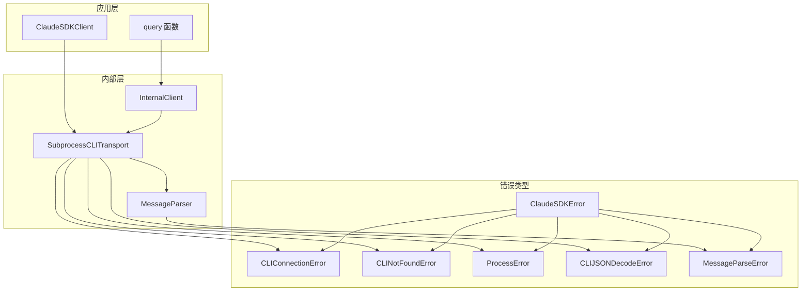
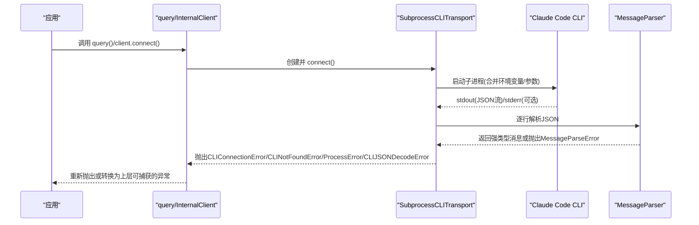
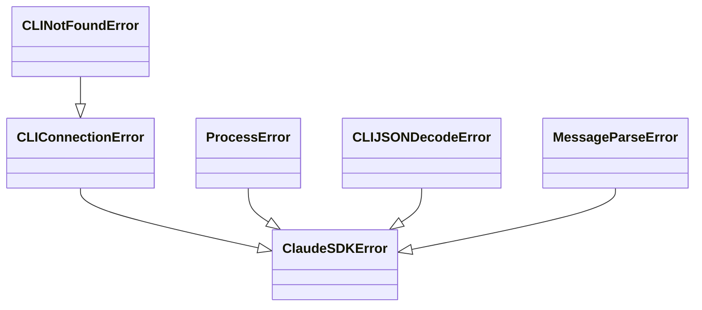
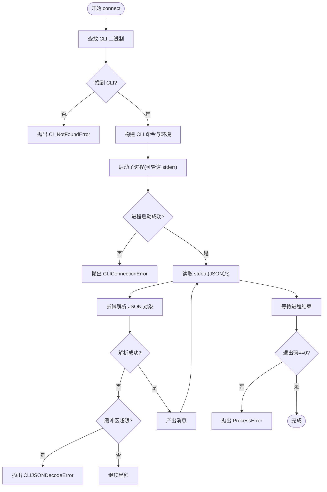
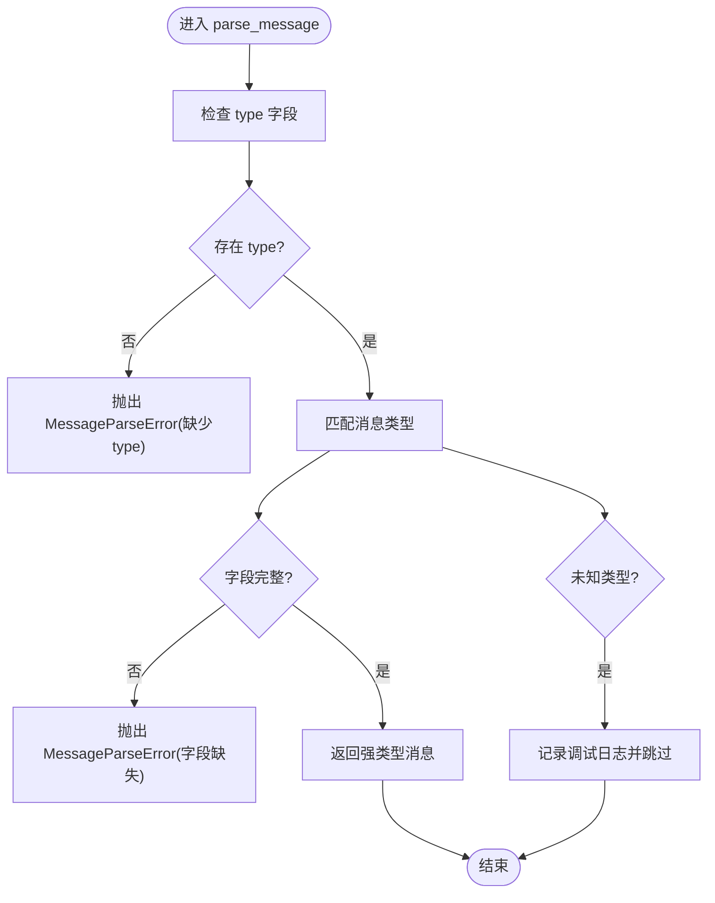
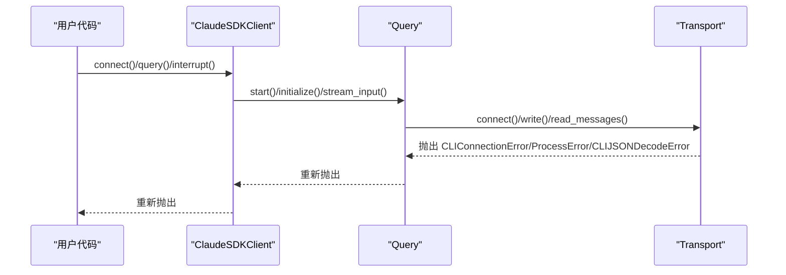
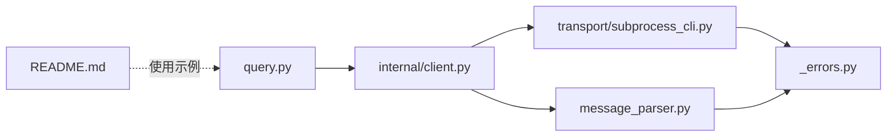

# 错误处理和调试

<cite>
**本文引用的文件**
- [src/claude_agent_sdk/_errors.py](file://src/claude_agent_sdk/_errors.py)
- [src/claude_agent_sdk/client.py](file://src/claude_agent_sdk/client.py)
- [src/claude_agent_sdk/_internal/client.py](file://src/claude_agent_sdk/_internal/client.py)
- [src/claude_agent_sdk/_internal/message_parser.py](file://src/claude_agent_sdk/_internal/message_parser.py)
- [src/claude_agent_sdk/_internal/transport/subprocess_cli.py](file://src/claude_agent_sdk/_internal/transport/subprocess_cli.py)
- [src/claude_agent_sdk/query.py](file://src/claude_agent_sdk/query.py)
- [examples/stderr_callback_example.py](file://examples/stderr_callback_example.py)
- [e2e-tests/test_stderr_callback.py](file://e2e-tests/test_stderr_callback.py)
- [tests/test_errors.py](file://tests/test_errors.py)
- [tests/test_subprocess_buffering.py](file://tests/test_subprocess_buffering.py)
- [README.md](file://README.md)
- [src/claude_agent_sdk/_version.py](file://src/claude_agent_sdk/_version.py)
</cite>

## 目录
1. [简介](#简介)
2. [项目结构](#项目结构)
3. [核心组件](#核心组件)
4. [架构总览](#架构总览)
5. [详细组件分析](#详细组件分析)
6. [依赖分析](#依赖分析)
7. [性能考虑](#性能考虑)
8. [故障排查指南](#故障排查指南)
9. [结论](#结论)
10. [附录](#附录)

## 简介
本指南聚焦于 Claude Agent SDK 的错误处理与调试体系，涵盖异常层次结构、各类错误类型的触发条件与解决方法、系统化的错误诊断流程（日志分析、状态检查、网络/进程诊断）、调试工具与技巧（stderr 回调、详细日志配置）、常见错误场景的解决方案（CLI 不可用、连接失败、JSON 解析错误等）、错误恢复策略与重试机制、性能问题诊断与优化建议，以及生产环境监控与告警配置思路，并提供错误收集与上报的最佳实践。

## 项目结构
围绕错误处理与调试的关键模块如下：
- 异常定义：集中于错误类型定义文件，提供统一的异常层次结构
- 客户端封装：对外暴露的客户端与查询函数，负责连接、消息收发与错误传播
- 内部实现：内部客户端与传输层，负责与 Claude Code CLI 的交互、版本检查、stderr 捕获、JSON 流解析与错误包装
- 示例与测试：stderr 回调示例、端到端测试、错误类型测试、缓冲区限制测试



**图表来源**
- [src/claude_agent_sdk/query.py:12-127](file://src/claude_agent_sdk/query.py#L12-L127)
- [src/claude_agent_sdk/client.py:21-500](file://src/claude_agent_sdk/client.py#L21-L500)
- [src/claude_agent_sdk/_internal/client.py:20-146](file://src/claude_agent_sdk/_internal/client.py#L20-L146)
- [src/claude_agent_sdk/_internal/transport/subprocess_cli.py:33-630](file://src/claude_agent_sdk/_internal/transport/subprocess_cli.py#L33-L630)
- [src/claude_agent_sdk/_internal/message_parser.py:29-251](file://src/claude_agent_sdk/_internal/message_parser.py#L29-L251)
- [src/claude_agent_sdk/_errors.py:6-57](file://src/claude_agent_sdk/_errors.py#L6-L57)

**章节来源**
- [src/claude_agent_sdk/query.py:12-127](file://src/claude_agent_sdk/query.py#L12-L127)
- [src/claude_agent_sdk/client.py:21-500](file://src/claude_agent_sdk/client.py#L21-L500)
- [src/claude_agent_sdk/_internal/client.py:20-146](file://src/claude_agent_sdk/_internal/client.py#L20-L146)
- [src/claude_agent_sdk/_internal/transport/subprocess_cli.py:33-630](file://src/claude_agent_sdk/_internal/transport/subprocess_cli.py#L33-L630)
- [src/claude_agent_sdk/_internal/message_parser.py:29-251](file://src/claude_agent_sdk/_internal/message_parser.py#L29-L251)
- [src/claude_agent_sdk/_errors.py:6-57](file://src/claude_agent_sdk/_errors.py#L6-L57)

## 核心组件
- 异常层次结构
  - 基类：ClaudeSDKError
  - 连接相关：CLIConnectionError（父类：ClaudeSDKError）
  - CLI 未找到：CLINotFoundError（父类：CLIConnectionError）
  - 进程错误：ProcessError（父类：ClaudeSDKError），携带 exit_code 与 stderr
  - JSON 解析错误：CLIJSONDecodeError（父类：ClaudeSDKError），记录原始行与原始异常
  - 消息解析错误：MessageParseError（父类：ClaudeSDKError），用于消息结构不合法或字段缺失
- 客户端与查询
  - query：一次性/单向流式查询，适合无状态、简单任务
  - ClaudeSDKClient：双向交互、会话管理、中断、权限模式切换、MCP 服务器控制等
- 传输层
  - SubprocessCLITransport：启动/管理 Claude Code CLI 子进程，处理 stdin/stdout/stderr，支持 stderr 回调与调试输出，内置 JSON 流解析与缓冲区上限
- 消息解析
  - parse_message：将 CLI 输出的字典消息解析为强类型消息对象，字段缺失或格式异常时抛出 MessageParseError

**章节来源**
- [src/claude_agent_sdk/_errors.py:6-57](file://src/claude_agent_sdk/_errors.py#L6-L57)
- [src/claude_agent_sdk/query.py:12-127](file://src/claude_agent_sdk/query.py#L12-L127)
- [src/claude_agent_sdk/client.py:21-500](file://src/claude_agent_sdk/client.py#L21-L500)
- [src/claude_agent_sdk/_internal/transport/subprocess_cli.py:33-630](file://src/claude_agent_sdk/_internal/transport/subprocess_cli.py#L33-L630)
- [src/claude_agent_sdk/_internal/message_parser.py:29-251](file://src/claude_agent_sdk/_internal/message_parser.py#L29-L251)

## 架构总览
下图展示了从应用层到传输层再到 CLI 的调用链路，以及错误在各层的产生与传播路径。



**图表来源**
- [src/claude_agent_sdk/query.py:12-127](file://src/claude_agent_sdk/query.py#L12-L127)
- [src/claude_agent_sdk/_internal/client.py:44-146](file://src/claude_agent_sdk/_internal/client.py#L44-L146)
- [src/claude_agent_sdk/_internal/transport/subprocess_cli.py:335-586](file://src/claude_agent_sdk/_internal/transport/subprocess_cli.py#L335-L586)
- [src/claude_agent_sdk/_internal/message_parser.py:29-251](file://src/claude_agent_sdk/_internal/message_parser.py#L29-L251)

## 详细组件分析

### 异常层次结构与错误类型详解
- ClaudeSDKError：所有 SDK 异常的基类
- CLIConnectionError：无法连接到 Claude Code 的通用连接异常
- CLINotFoundError：CLI 未找到或未安装；构造时可携带 CLI 路径
- ProcessError：CLI 进程失败；携带 exit_code 与 stderr，便于定位执行错误
- CLIJSONDecodeError：从 CLI 输出解析 JSON 失败；记录原始行与原始异常
- MessageParseError：消息结构不合法或字段缺失导致解析失败



**图表来源**
- [src/claude_agent_sdk/_errors.py:6-57](file://src/claude_agent_sdk/_errors.py#L6-L57)

**章节来源**
- [src/claude_agent_sdk/_errors.py:6-57](file://src/claude_agent_sdk/_errors.py#L6-L57)
- [tests/test_errors.py:12-53](file://tests/test_errors.py#L12-L53)

### 传输层错误与 stderr 回调
- CLI 查找与版本检查：若未找到 CLI 或工作目录不存在，抛出 CLINotFoundError 或 CLIConnectionError
- 子进程启动：合并环境变量，按需管道 stderr；支持通过 stderr 回调接收调试输出
- JSON 流解析：累积行直到可完整解析；超过最大缓冲区阈值时抛出 CLIJSONDecodeError
- 进程退出：非零退出码时包装为 ProcessError 并抛出



**图表来源**
- [src/claude_agent_sdk/_internal/transport/subprocess_cli.py:335-586](file://src/claude_agent_sdk/_internal/transport/subprocess_cli.py#L335-L586)

**章节来源**
- [src/claude_agent_sdk/_internal/transport/subprocess_cli.py:335-586](file://src/claude_agent_sdk/_internal/transport/subprocess_cli.py#L335-L586)
- [tests/test_subprocess_buffering.py:250-285](file://tests/test_subprocess_buffering.py#L250-L285)

### 消息解析与 MessageParseError
- parse_message 对不同消息类型进行严格校验，缺失关键字段时抛出 MessageParseError，并附带原始数据以便诊断
- 对未知消息类型采用前向兼容策略，跳过并记录调试日志



**图表来源**
- [src/claude_agent_sdk/_internal/message_parser.py:29-251](file://src/claude_agent_sdk/_internal/message_parser.py#L29-L251)

**章节来源**
- [src/claude_agent_sdk/_internal/message_parser.py:29-251](file://src/claude_agent_sdk/_internal/message_parser.py#L29-L251)

### 查询与客户端中的错误传播
- query：通过 InternalClient 封装传输与消息处理，最终将底层异常向上抛出
- ClaudeSDKClient：在连接、查询、中断、模型切换、MCP 控制等操作中，若未连接则抛出 CLIConnectionError



**图表来源**
- [src/claude_agent_sdk/client.py:94-180](file://src/claude_agent_sdk/client.py#L94-L180)
- [src/claude_agent_sdk/_internal/client.py:44-146](file://src/claude_agent_sdk/_internal/client.py#L44-L146)
- [src/claude_agent_sdk/_internal/transport/subprocess_cli.py:515-586](file://src/claude_agent_sdk/_internal/transport/subprocess_cli.py#L515-L586)

**章节来源**
- [src/claude_agent_sdk/client.py:94-180](file://src/claude_agent_sdk/client.py#L94-L180)
- [src/claude_agent_sdk/_internal/client.py:44-146](file://src/claude_agent_sdk/_internal/client.py#L44-L146)

### 调试工具与技巧
- stderr 回调：通过 ClaudeAgentOptions.stderr 提供回调函数，即可捕获 CLI 的调试输出；结合 extra_args 中的 debug-to-stderr 标志启用详细日志
- 示例与端到端测试：提供了 stderr 回调的使用示例与端到端测试，验证在开启调试模式时能捕获到 DEBUG 日志

```mermaid
sequenceDiagram
participant App as "应用"
participant Opt as "ClaudeAgentOptions"
participant T as "SubprocessCLITransport"
participant CLI as "Claude Code CLI"
App->>Opt : 设置 stderr 回调 + debug-to-stderr
App->>T : connect()
T->>CLI : 启动子进程(管道 stderr)
CLI-->>T : 输出调试行
T->>Opt : 调用 stderr 回调(line)
Opt-->>App : 收集到调试信息
```

**图表来源**
- [examples/stderr_callback_example.py:8-44](file://examples/stderr_callback_example.py#L8-L44)
- [e2e-tests/test_stderr_callback.py:10-51](file://e2e-tests/test_stderr_callback.py#L10-L51)
- [src/claude_agent_sdk/_internal/transport/subprocess_cli.py:412-439](file://src/claude_agent_sdk/_internal/transport/subprocess_cli.py#L412-L439)

**章节来源**
- [examples/stderr_callback_example.py:8-44](file://examples/stderr_callback_example.py#L8-L44)
- [e2e-tests/test_stderr_callback.py:10-51](file://e2e-tests/test_stderr_callback.py#L10-L51)
- [src/claude_agent_sdk/_internal/transport/subprocess_cli.py:360-439](file://src/claude_agent_sdk/_internal/transport/subprocess_cli.py#L360-L439)

## 依赖分析
- query 依赖 InternalClient 与 Transport
- InternalClient 依赖 Transport、Query、parse_message
- SubprocessCLITransport 依赖 _errors 中的 CLIConnectionError、CLINotFoundError、ProcessError、CLIJSONDecodeError
- MessageParser 依赖 _errors 中的 MessageParseError
- README 提供了错误处理的使用示例与参考文档链接



**图表来源**
- [src/claude_agent_sdk/query.py:12-127](file://src/claude_agent_sdk/query.py#L12-L127)
- [src/claude_agent_sdk/_internal/client.py:44-146](file://src/claude_agent_sdk/_internal/client.py#L44-L146)
- [src/claude_agent_sdk/_internal/transport/subprocess_cli.py:21-25](file://src/claude_agent_sdk/_internal/transport/subprocess_cli.py#L21-L25)
- [src/claude_agent_sdk/_internal/message_parser.py:6-24](file://src/claude_agent_sdk/_internal/message_parser.py#L6-L24)
- [README.md:247-270](file://README.md#L247-L270)

**章节来源**
- [src/claude_agent_sdk/query.py:12-127](file://src/claude_agent_sdk/query.py#L12-L127)
- [src/claude_agent_sdk/_internal/client.py:44-146](file://src/claude_agent_sdk/_internal/client.py#L44-L146)
- [src/claude_agent_sdk/_internal/transport/subprocess_cli.py:21-25](file://src/claude_agent_sdk/_internal/transport/subprocess_cli.py#L21-L25)
- [src/claude_agent_sdk/_internal/message_parser.py:6-24](file://src/claude_agent_sdk/_internal/message_parser.py#L6-L24)
- [README.md:247-270](file://README.md#L247-L270)

## 性能考虑
- JSON 流解析缓冲区上限：当累积的 JSON 行超过阈值时立即抛错，避免内存膨胀；可通过 options.max_buffer_size 调整
- 版本检查超时：对 CLI 版本进行快速检查，超时即忽略，不影响主流程
- stderr 管道：仅在提供 stderr 回调或启用 debug-to-stderr 时才管道 stderr，减少 IO 开销
- 并发写入保护：对 stdin 写入加锁，避免竞态与 TOCTOU 问题

**章节来源**
- [src/claude_agent_sdk/_internal/transport/subprocess_cli.py:29-63](file://src/claude_agent_sdk/_internal/transport/subprocess_cli.py#L29-L63)
- [tests/test_subprocess_buffering.py:260-285](file://tests/test_subprocess_buffering.py#L260-L285)
- [src/claude_agent_sdk/_internal/transport/subprocess_cli.py:587-626](file://src/claude_agent_sdk/_internal/transport/subprocess_cli.py#L587-L626)
- [src/claude_agent_sdk/_internal/transport/subprocess_cli.py:360-368](file://src/claude_agent_sdk/_internal/transport/subprocess_cli.py#L360-L368)
- [src/claude_agent_sdk/_internal/transport/subprocess_cli.py:481-506](file://src/claude_agent_sdk/_internal/transport/subprocess_cli.py#L481-L506)

## 故障排查指南

### 系统化诊断方法
- 日志分析
  - 启用 stderr 回调并设置 debug-to-stderr，收集 CLI 调试输出
  - 关注 stderr 中的 ERROR/DEBUG/INFO 等关键字，定位具体阶段
- 状态检查
  - 检查 CLI 是否已安装、是否在 PATH 中、是否具有可执行权限
  - 验证工作目录是否存在、环境变量是否正确传递
- 网络与进程诊断
  - 若使用外部 MCP 服务器，确认其可达性与认证状态
  - 观察进程退出码与 stderr 输出，结合 ProcessError 定位问题
- 消息解析与缓冲区
  - 若出现 JSON 解析错误，检查 CLI 输出是否被截断或包含非 UTF-8 字符
  - 调整 max_buffer_size 以适配大消息场景

**章节来源**
- [examples/stderr_callback_example.py:8-44](file://examples/stderr_callback_example.py#L8-L44)
- [e2e-tests/test_stderr_callback.py:10-51](file://e2e-tests/test_stderr_callback.py#L10-L51)
- [src/claude_agent_sdk/_internal/transport/subprocess_cli.py:396-411](file://src/claude_agent_sdk/_internal/transport/subprocess_cli.py#L396-L411)
- [src/claude_agent_sdk/_internal/transport/subprocess_cli.py:515-586](file://src/claude_agent_sdk/_internal/transport/subprocess_cli.py#L515-L586)
- [tests/test_subprocess_buffering.py:250-285](file://tests/test_subprocess_buffering.py#L250-L285)

### 常见错误场景与解决方案
- CLI 不可用
  - 现象：抛出 CLINotFoundError
  - 排查：确认 CLI 是否安装、路径是否正确、是否在 PATH 中
  - 解决：安装 CLI 或通过 ClaudeAgentOptions(cli_path=...) 指定路径
- 连接失败
  - 现象：抛出 CLIConnectionError
  - 排查：工作目录不存在、环境变量冲突、权限不足
  - 解决：修正工作目录、清理环境变量、赋予执行权限
- JSON 解析错误
  - 现象：抛出 CLIJSONDecodeError
  - 排查：输出被截断、缓冲区不足、非标准编码
  - 解决：增大 max_buffer_size、修复 CLI 输出、确保 UTF-8 编码
- 消息解析错误
  - 现象：抛出 MessageParseError
  - 排查：字段缺失、类型不匹配、未知消息类型
  - 解决：升级 SDK 以兼容新消息类型，或修复上游消息生成逻辑
- 进程执行失败
  - 现象：抛出 ProcessError，包含 exit_code 与 stderr 提示
  - 排查：CLI 参数错误、资源限制、外部依赖缺失
  - 解决：修正参数、释放资源、补齐依赖

**章节来源**
- [src/claude_agent_sdk/_errors.py:14-57](file://src/claude_agent_sdk/_errors.py#L14-L57)
- [src/claude_agent_sdk/_internal/transport/subprocess_cli.py:396-411](file://src/claude_agent_sdk/_internal/transport/subprocess_cli.py#L396-L411)
- [src/claude_agent_sdk/_internal/transport/subprocess_cli.py:515-586](file://src/claude_agent_sdk/_internal/transport/subprocess_cli.py#L515-L586)
- [src/claude_agent_sdk/_internal/message_parser.py:29-251](file://src/claude_agent_sdk/_internal/message_parser.py#L29-L251)

### 错误恢复策略与重试机制
- 重试策略
  - 对瞬时网络/IO 错误可采用指数退避重试
  - 对 CLI 不可用错误，可在重试前检测 CLI 可用性
- 资源清理
  - 发生异常时确保关闭 stderr 任务组、stdin 流与子进程
- 上下文隔离
  - 在 ClaudeSDKClient 中注意运行时上下文一致性，避免跨上下文复用实例

**章节来源**
- [src/claude_agent_sdk/_internal/transport/subprocess_cli.py:440-480](file://src/claude_agent_sdk/_internal/transport/subprocess_cli.py#L440-L480)
- [src/claude_agent_sdk/client.py:484-499](file://src/claude_agent_sdk/client.py#L484-L499)

### 生产环境监控与告警
- 建议指标
  - CLI 启动成功率、进程退出码分布、stderr 中 ERROR 次数、JSON 解析失败率、消息解析失败率
- 告警规则
  - 进程退出码非零、stderr 中 ERROR 比例突增、JSON 解析失败率上升、连接失败次数过多
- 日志与追踪
  - 结合 stderr 回调与应用日志，建立请求级 trace_id，串联 CLI 调用链

[本节为通用指导，无需特定文件引用]

### 错误收集与上报
- 使用 stderr 回调收集 CLI 调试输出，作为错误现场证据
- 捕获并记录异常类型、参数、环境变量、CLI 版本、SDK 版本
- 在上报前脱敏敏感信息（如路径、命令、密钥）

**章节来源**
- [examples/stderr_callback_example.py:8-44](file://examples/stderr_callback_example.py#L8-L44)
- [src/claude_agent_sdk/_version.py:1-4](file://src/claude_agent_sdk/_version.py#L1-L4)

## 结论
本指南梳理了 Claude Agent SDK 的异常层次结构与传播路径，明确了各类错误的触发条件与解决方法，并提供了系统化的诊断流程、调试技巧与生产监控建议。通过 stderr 回调、缓冲区上限、严格的 JSON/消息解析与完善的异常包装，SDK 能够在复杂环境中稳定运行并便于排障。

## 附录

### 快速参考：错误类型与典型触发场景
- ClaudeSDKError：所有异常基类
- CLIConnectionError：连接/进程阶段失败
- CLINotFoundError：CLI 未找到或路径错误
- ProcessError：CLI 执行失败（exit_code/stderr）
- CLIJSONDecodeError：JSON 解析失败（缓冲区超限/格式错误）
- MessageParseError：消息结构不合法（字段缺失/类型不符）

**章节来源**
- [src/claude_agent_sdk/_errors.py:6-57](file://src/claude_agent_sdk/_errors.py#L6-L57)
- [src/claude_agent_sdk/_internal/transport/subprocess_cli.py:515-586](file://src/claude_agent_sdk/_internal/transport/subprocess_cli.py#L515-L586)
- [src/claude_agent_sdk/_internal/message_parser.py:29-251](file://src/claude_agent_sdk/_internal/message_parser.py#L29-L251)