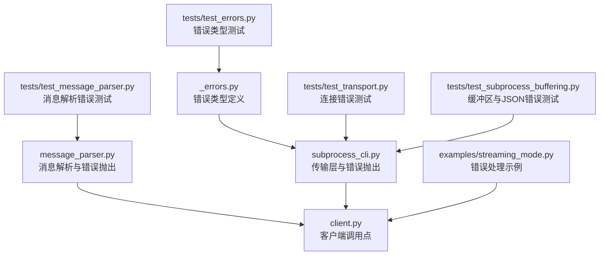
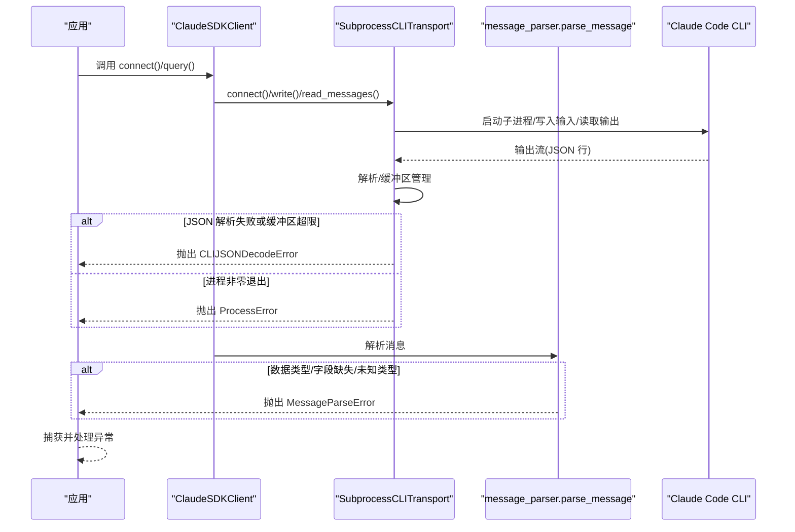
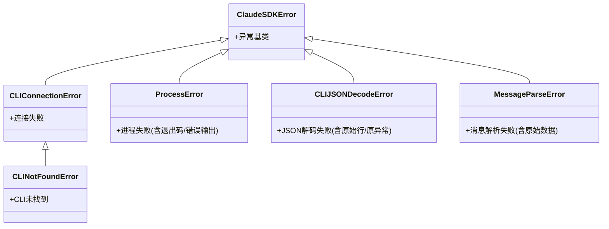
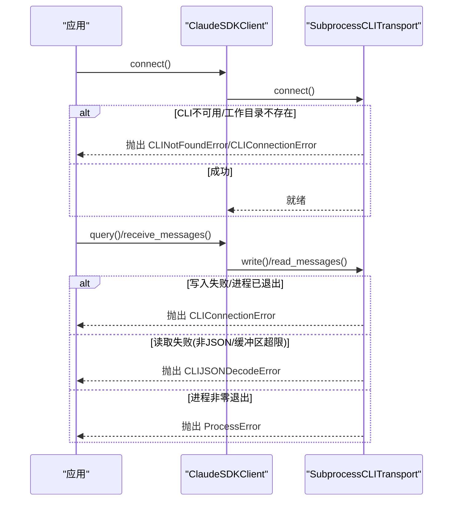
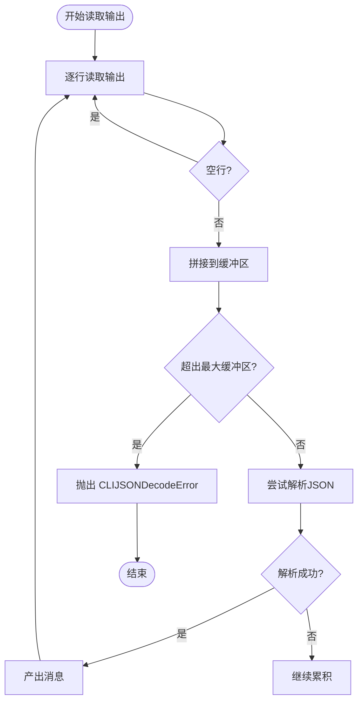
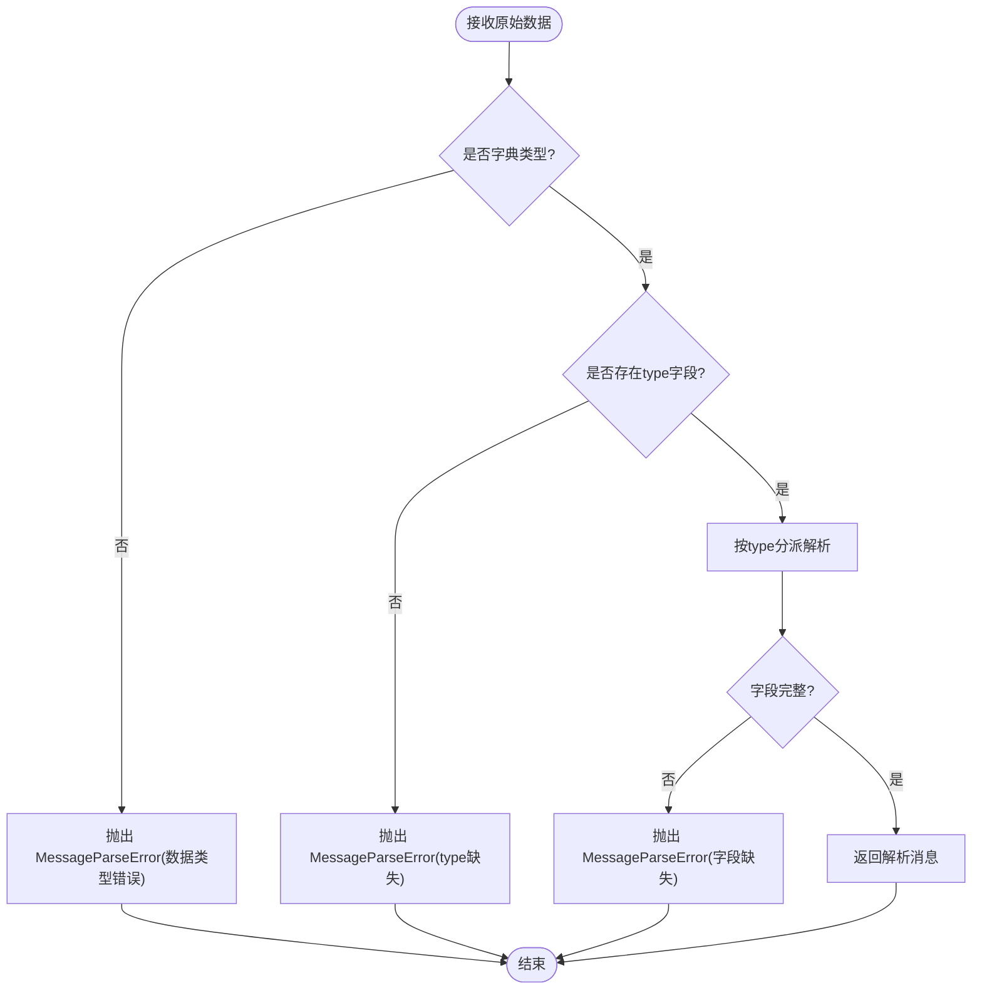
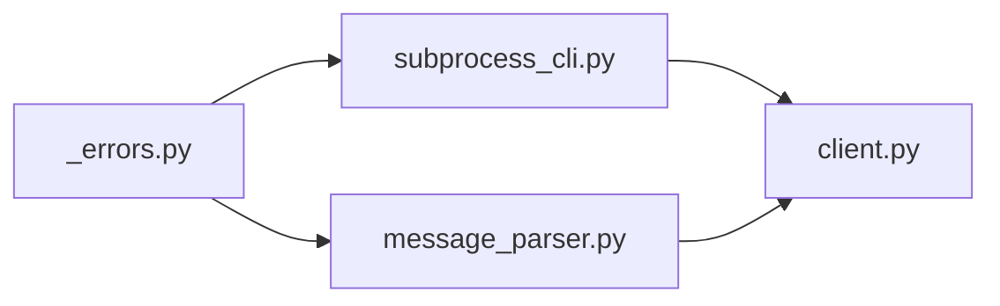

# 错误类型和处理

<cite>
**本文引用的文件**
- [src/claude_agent_sdk/_errors.py](file://src/claude_agent_sdk/_errors.py)
- [src/claude_agent_sdk/_internal/transport/subprocess_cli.py](file://src/claude_agent_sdk/_internal/transport/subprocess_cli.py)
- [src/claude_agent_sdk/_internal/message_parser.py](file://src/claude_agent_sdk/_internal/message_parser.py)
- [src/claude_agent_sdk/client.py](file://src/claude_agent_sdk/client.py)
- [tests/test_errors.py](file://tests/test_errors.py)
- [tests/test_message_parser.py](file://tests/test_message_parser.py)
- [tests/test_transport.py](file://tests/test_transport.py)
- [tests/test_subprocess_buffering.py](file://tests/test_subprocess_buffering.py)
- [examples/streaming_mode.py](file://examples/streaming_mode.py)
- [README.md](file://README.md)
</cite>

## 目录
1. [简介](#简介)
2. [项目结构](#项目结构)
3. [核心组件](#核心组件)
4. [架构总览](#架构总览)
5. [详细组件分析](#详细组件分析)
6. [依赖分析](#依赖分析)
7. [性能考虑](#性能考虑)
8. [故障排查指南](#故障排查指南)
9. [结论](#结论)
10. [附录](#附录)

## 简介
本指南系统性地介绍 Claude SDK 的错误体系与处理最佳实践，重点覆盖以下内容：
- 基类与子类：ClaudeSDKError 及其派生类（CLIConnectionError、CLINotFoundError、ProcessError、CLIJSONDecodeError、MessageParseError）。
- 触发条件、构造参数与典型使用场景。
- 捕获与处理不同异常的代码示例路径。
- 错误信息解读与故障排除步骤。
- 生产环境中的记录与恢复策略、重试机制建议。
- 常见问题诊断：CLI 不可用、连接超时、JSON 解析失败等。

## 项目结构
围绕错误处理的关键模块与文件如下：
- 错误定义：src/claude_agent_sdk/_errors.py
- 传输层（子进程 CLI 交互）：src/claude_agent_sdk/_internal/transport/subprocess_cli.py
- 消息解析：src/claude_agent_sdk/_internal/message_parser.py
- 客户端封装：src/claude_agent_sdk/client.py
- 测试与示例：tests/*、examples/*

图表来源
- [src/claude_agent_sdk/_errors.py:1-57](file://src/claude_agent_sdk/_errors.py#L1-L57)
- [src/claude_agent_sdk/_internal/transport/subprocess_cli.py:1-630](file://src/claude_agent_sdk/_internal/transport/subprocess_cli.py#L1-L630)
- [src/claude_agent_sdk/_internal/message_parser.py:1-251](file://src/claude_agent_sdk/_internal/message_parser.py#L1-L251)
- [src/claude_agent_sdk/client.py:1-500](file://src/claude_agent_sdk/client.py#L1-L500)
- [tests/test_errors.py:1-53](file://tests/test_errors.py#L1-L53)
- [tests/test_message_parser.py:1-621](file://tests/test_message_parser.py#L1-L621)
- [tests/test_transport.py:257-291](file://tests/test_transport.py#L257-L291)
- [tests/test_subprocess_buffering.py:72-285](file://tests/test_subprocess_buffering.py#L72-L285)
- [examples/streaming_mode.py:420-512](file://examples/streaming_mode.py#L420-L512)

章节来源
- [src/claude_agent_sdk/_errors.py:1-57](file://src/claude_agent_sdk/_errors.py#L1-L57)
- [src/claude_agent_sdk/_internal/transport/subprocess_cli.py:1-630](file://src/claude_agent_sdk/_internal/transport/subprocess_cli.py#L1-L630)
- [src/claude_agent_sdk/_internal/message_parser.py:1-251](file://src/claude_agent_sdk/_internal/message_parser.py#L1-L251)
- [src/claude_agent_sdk/client.py:1-500](file://src/claude_agent_sdk/client.py#L1-L500)
- [tests/test_errors.py:1-53](file://tests/test_errors.py#L1-L53)
- [tests/test_message_parser.py:1-621](file://tests/test_message_parser.py#L1-L621)
- [tests/test_transport.py:257-291](file://tests/test_transport.py#L257-L291)
- [tests/test_subprocess_buffering.py:72-285](file://tests/test_subprocess_buffering.py#L72-L285)
- [examples/streaming_mode.py:420-512](file://examples/streaming_mode.py#L420-L512)

## 核心组件
本节对每个错误类型进行深入说明，包括触发条件、构造参数、典型场景与处理要点。

- ClaudeSDKError
  - 描述：所有 SDK 错误的基类。
  - 典型使用：作为统一异常类型用于捕获与分类。
  - 参考路径：[src/claude_agent_sdk/_errors.py:6-8](file://src/claude_agent_sdk/_errors.py#L6-L8)

- CLIConnectionError
  - 描述：无法连接到 Claude Code 时抛出。
  - 触发条件：
    - 连接阶段工作目录不存在或权限不足。
    - 子进程启动失败或未就绪。
    - 写入/读取通道处于非就绪状态。
  - 构造参数：无特定参数，通常由内部逻辑在连接失败时构造。
  - 典型场景：connect()、write()、read_messages() 等调用前后的连接检查。
  - 参考路径：
    - [src/claude_agent_sdk/_internal/transport/subprocess_cli.py:396-410](file://src/claude_agent_sdk/_internal/transport/subprocess_cli.py#L396-L410)
    - [src/claude_agent_sdk/_internal/transport/subprocess_cli.py:519-522](file://src/claude_agent_sdk/_internal/transport/subprocess_cli.py#L519-L522)
    - [src/claude_agent_sdk/_internal/transport/subprocess_cli.py:481-505](file://src/claude_agent_sdk/_internal/transport/subprocess_cli.py#L481-L505)
    - [src/claude_agent_sdk/client.py:188-190](file://src/claude_agent_sdk/client.py#L188-L190)

- CLINotFoundError
  - 描述：未找到 Claude Code CLI 或未安装。
  - 触发条件：CLI 查找失败（系统路径、打包路径均不可用）。
  - 构造参数：
    - message：默认为“未找到”，可自定义。
    - cli_path：可选，传入具体路径以便定位问题。
  - 典型场景：初始化或自动查找 CLI 失败。
  - 参考路径：
    - [src/claude_agent_sdk/_internal/transport/subprocess_cli.py:64-95](file://src/claude_agent_sdk/_internal/transport/subprocess_cli.py#L64-L95)
    - [src/claude_agent_sdk/_errors.py:17-22](file://src/claude_agent_sdk/_errors.py#L17-L22)
    - [tests/test_transport.py:257-267](file://tests/test_transport.py#L257-L267)

- ProcessError
  - 描述：CLI 进程执行失败。
  - 触发条件：子进程返回码非零。
  - 构造参数：
    - message：错误描述。
    - exit_code：退出码（可选）。
    - stderr：标准错误输出（可选）。
  - 典型场景：命令执行失败、工具权限不足、配置错误导致进程退出。
  - 参考路径：
    - [src/claude_agent_sdk/_errors.py:28-39](file://src/claude_agent_sdk/_errors.py#L28-L39)
    - [src/claude_agent_sdk/_internal/transport/subprocess_cli.py:578-585](file://src/claude_agent_sdk/_internal/transport/subprocess_cli.py#L578-L585)

- CLIJSONDecodeError
  - 描述：从 CLI 输出中解码 JSON 失败。
  - 触发条件：
    - 输出流中出现非 JSON 文本。
    - 缓冲区溢出（超过最大限制）。
  - 构造参数：
    - line：导致解析失败的原始行。
    - original_error：底层 JSON 解析异常。
  - 典型场景：输出被截断、缓冲区过小、网络/IO 异常导致不完整 JSON。
  - 参考路径：
    - [src/claude_agent_sdk/_errors.py:45-48](file://src/claude_agent_sdk/_errors.py#L45-L48)
    - [src/claude_agent_sdk/_internal/transport/subprocess_cli.py:546-554](file://src/claude_agent_sdk/_internal/transport/subprocess_cli.py#L546-L554)
    - [tests/test_subprocess_buffering.py:250-283](file://tests/test_subprocess_buffering.py#L250-L283)

- MessageParseError
  - 描述：无法解析来自 CLI 的消息对象。
  - 触发条件：消息数据类型不符、缺少必要字段、未知消息类型。
  - 构造参数：
    - message：错误描述。
    - data：原始数据（可选），便于调试。
  - 典型场景：CLI 协议变更、消息格式异常。
  - 参考路径：
    - [src/claude_agent_sdk/_errors.py:54-56](file://src/claude_agent_sdk/_errors.py#L54-L56)
    - [src/claude_agent_sdk/_internal/message_parser.py:42-50](file://src/claude_agent_sdk/_internal/message_parser.py#L42-L50)
    - [tests/test_message_parser.py:573-584](file://tests/test_message_parser.py#L573-L584)

章节来源
- [src/claude_agent_sdk/_errors.py:6-56](file://src/claude_agent_sdk/_errors.py#L6-L56)
- [src/claude_agent_sdk/_internal/transport/subprocess_cli.py:64-95](file://src/claude_agent_sdk/_internal/transport/subprocess_cli.py#L64-L95)
- [src/claude_agent_sdk/_internal/transport/subprocess_cli.py:519-585](file://src/claude_agent_sdk/_internal/transport/subprocess_cli.py#L519-L585)
- [src/claude_agent_sdk/_internal/message_parser.py:42-50](file://src/claude_agent_sdk/_internal/message_parser.py#L42-L50)
- [tests/test_errors.py:15-52](file://tests/test_errors.py#L15-L52)
- [tests/test_transport.py:257-267](file://tests/test_transport.py#L257-L267)
- [tests/test_subprocess_buffering.py:250-283](file://tests/test_subprocess_buffering.py#L250-L283)
- [tests/test_message_parser.py:573-584](file://tests/test_message_parser.py#L573-L584)

## 架构总览
下图展示了错误在系统中的传播路径：从传输层（子进程 CLI）到消息解析，再到客户端调用点。

图表来源
- [src/claude_agent_sdk/_internal/transport/subprocess_cli.py:335-410](file://src/claude_agent_sdk/_internal/transport/subprocess_cli.py#L335-L410)
- [src/claude_agent_sdk/_internal/transport/subprocess_cli.py:519-585](file://src/claude_agent_sdk/_internal/transport/subprocess_cli.py#L519-L585)
- [src/claude_agent_sdk/_internal/message_parser.py:29-251](file://src/claude_agent_sdk/_internal/message_parser.py#L29-L251)
- [src/claude_agent_sdk/client.py:94-197](file://src/claude_agent_sdk/client.py#L94-L197)

## 详细组件分析

### 类层次与关系

图表来源
- [src/claude_agent_sdk/_errors.py:6-56](file://src/claude_agent_sdk/_errors.py#L6-L56)

章节来源
- [src/claude_agent_sdk/_errors.py:6-56](file://src/claude_agent_sdk/_errors.py#L6-L56)

### API/服务组件：错误处理流程
以下序列图展示客户端在连接、写入与读取过程中的错误处理要点。

图表来源
- [src/claude_agent_sdk/client.py:94-197](file://src/claude_agent_sdk/client.py#L94-L197)
- [src/claude_agent_sdk/_internal/transport/subprocess_cli.py:335-410](file://src/claude_agent_sdk/_internal/transport/subprocess_cli.py#L335-L410)
- [src/claude_agent_sdk/_internal/transport/subprocess_cli.py:519-585](file://src/claude_agent_sdk/_internal/transport/subprocess_cli.py#L519-L585)

### 复杂逻辑组件：JSON 解析与缓冲区控制

图表来源
- [src/claude_agent_sdk/_internal/transport/subprocess_cli.py:519-585](file://src/claude_agent_sdk/_internal/transport/subprocess_cli.py#L519-L585)

### 消息解析错误处理

图表来源
- [src/claude_agent_sdk/_internal/message_parser.py:29-251](file://src/claude_agent_sdk/_internal/message_parser.py#L29-L251)

## 依赖分析
- 错误类型定义集中于 _errors.py，被传输层与消息解析器广泛使用。
- 传输层负责实际的系统级错误抛出（CLI 不可用、进程失败、JSON 解码失败）。
- 消息解析器负责协议层面的错误（数据类型/字段缺失）。
- 客户端在关键调用点（connect/query/receive_messages）可能抛出连接相关错误。

图表来源
- [src/claude_agent_sdk/_errors.py:1-57](file://src/claude_agent_sdk/_errors.py#L1-L57)
- [src/claude_agent_sdk/_internal/transport/subprocess_cli.py:1-630](file://src/claude_agent_sdk/_internal/transport/subprocess_cli.py#L1-L630)
- [src/claude_agent_sdk/_internal/message_parser.py:1-251](file://src/claude_agent_sdk/_internal/message_parser.py#L1-L251)
- [src/claude_agent_sdk/client.py:1-500](file://src/claude_agent_sdk/client.py#L1-L500)

章节来源
- [src/claude_agent_sdk/_errors.py:1-57](file://src/claude_agent_sdk/_errors.py#L1-L57)
- [src/claude_agent_sdk/_internal/transport/subprocess_cli.py:1-630](file://src/claude_agent_sdk/_internal/transport/subprocess_cli.py#L1-L630)
- [src/claude_agent_sdk/_internal/message_parser.py:1-251](file://src/claude_agent_sdk/_internal/message_parser.py#L1-L251)
- [src/claude_agent_sdk/client.py:1-500](file://src/claude_agent_sdk/client.py#L1-L500)

## 性能考虑
- 缓冲区大小：传输层提供最大缓冲区限制，避免内存膨胀；在高吞吐场景下可根据需求调整。
- 解析策略：采用“累积+试探解析”方式，减少因行截断导致的失败率。
- 进程生命周期：及时关闭 stdin/stdout/stderr，避免资源泄漏与后续错误叠加。

## 故障排查指南
- CLI 不可用/未安装
  - 现象：抛出 CLINotFoundError。
  - 排查：确认 CLI 是否安装、路径是否正确、环境变量 PATH 是否包含 CLI 所在目录。
  - 参考路径：
    - [src/claude_agent_sdk/_internal/transport/subprocess_cli.py:64-95](file://src/claude_agent_sdk/_internal/transport/subprocess_cli.py#L64-L95)
    - [tests/test_transport.py:257-267](file://tests/test_transport.py#L257-L267)

- 连接超时/工作目录不存在
  - 现象：抛出 CLIConnectionError。
  - 排查：检查工作目录存在性与权限；确认 CLI 可执行且版本满足要求。
  - 参考路径：
    - [src/claude_agent_sdk/_internal/transport/subprocess_cli.py:396-410](file://src/claude_agent_sdk/_internal/transport/subprocess_cli.py#L396-L410)

- JSON 解析失败/缓冲区超限
  - 现象：抛出 CLIJSONDecodeError；可能伴随缓冲区超限提示。
  - 排查：检查输出格式、网络稳定性、增大缓冲区上限（谨慎评估内存占用）。
  - 参考路径：
    - [src/claude_agent_sdk/_internal/transport/subprocess_cli.py:546-554](file://src/claude_agent_sdk/_internal/transport/subprocess_cli.py#L546-L554)
    - [tests/test_subprocess_buffering.py:250-283](file://tests/test_subprocess_buffering.py#L250-L283)

- 进程执行失败
  - 现象：抛出 ProcessError，包含退出码与错误输出提示。
  - 排查：查看 stderr 输出、检查工具权限、配置项与参数合法性。
  - 参考路径：
    - [src/claude_agent_sdk/_internal/transport/subprocess_cli.py:578-585](file://src/claude_agent_sdk/_internal/transport/subprocess_cli.py#L578-L585)

- 消息解析失败
  - 现象：抛出 MessageParseError，data 字段可用于调试。
  - 排查：确认 CLI 版本与协议一致性、消息字段完整性。
  - 参考路径：
    - [src/claude_agent_sdk/_internal/message_parser.py:42-50](file://src/claude_agent_sdk/_internal/message_parser.py#L42-L50)
    - [tests/test_message_parser.py:573-584](file://tests/test_message_parser.py#L573-L584)

- 生产环境记录与上报
  - 建议：捕获异常后记录错误类型、关键上下文（如 exit_code、line、data）、堆栈信息，并区分可重试与不可重试错误。
  - 参考路径：
    - [examples/streaming_mode.py:421-462](file://examples/streaming_mode.py#L421-L462)

章节来源
- [src/claude_agent_sdk/_internal/transport/subprocess_cli.py:396-585](file://src/claude_agent_sdk/_internal/transport/subprocess_cli.py#L396-L585)
- [src/claude_agent_sdk/_internal/message_parser.py:42-50](file://src/claude_agent_sdk/_internal/message_parser.py#L42-L50)
- [tests/test_transport.py:257-267](file://tests/test_transport.py#L257-L267)
- [tests/test_subprocess_buffering.py:250-283](file://tests/test_subprocess_buffering.py#L250-L283)
- [tests/test_message_parser.py:573-584](file://tests/test_message_parser.py#L573-L584)
- [examples/streaming_mode.py:421-462](file://examples/streaming_mode.py#L421-L462)

## 结论
- 错误类型清晰分层，便于精准捕获与差异化处理。
- 传输层与解析层分别承担系统级与协议级错误，职责明确。
- 建议在生产中结合日志与监控，对可重试错误实施指数退避重试，对不可重试错误快速失败并上报。

## 附录

### 错误处理代码示例路径
- 基础错误处理示例（README）
  - [README.md:247-269](file://README.md#L247-L269)
- 客户端错误处理示例（示例程序）
  - [examples/streaming_mode.py:421-462](file://examples/streaming_mode.py#L421-L462)

### 测试覆盖参考
- 错误类型与属性测试
  - [tests/test_errors.py:15-52](file://tests/test_errors.py#L15-L52)
- 消息解析错误测试
  - [tests/test_message_parser.py:573-621](file://tests/test_message_parser.py#L573-L621)
- 连接错误测试
  - [tests/test_transport.py:257-267](file://tests/test_transport.py#L257-L267)
- 缓冲区与 JSON 错误测试
  - [tests/test_subprocess_buffering.py:250-283](file://tests/test_subprocess_buffering.py#L250-L283)