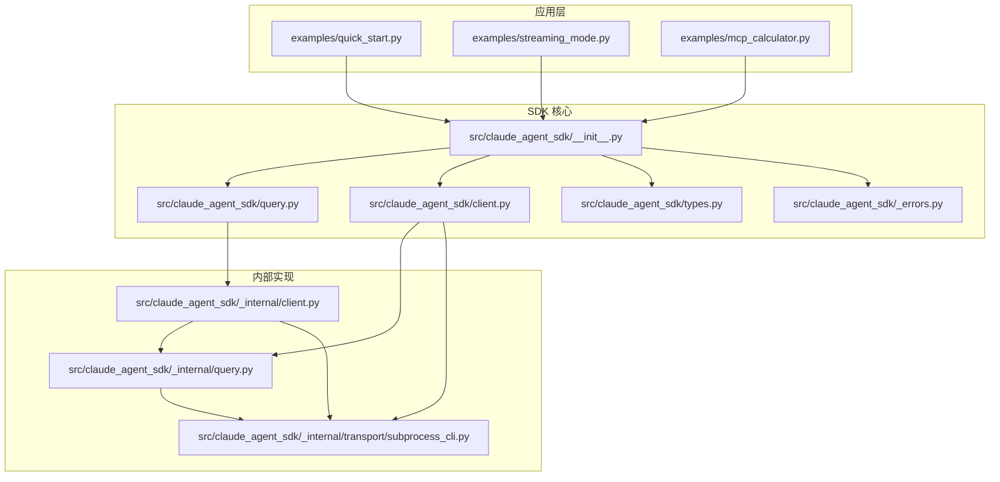
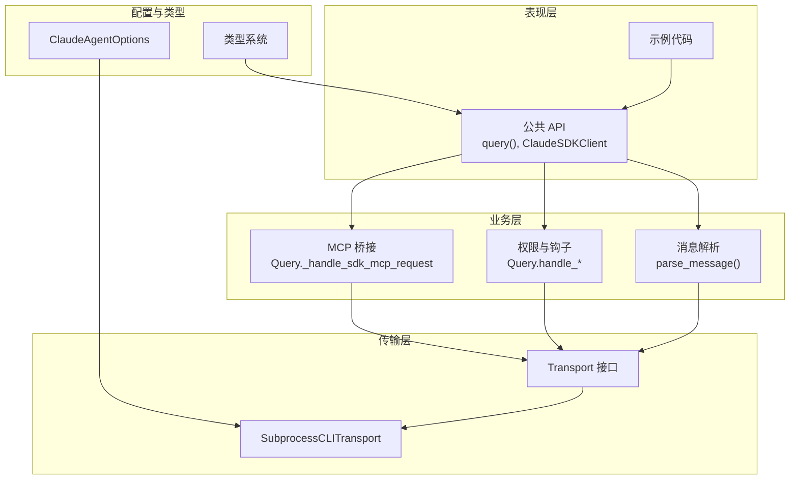
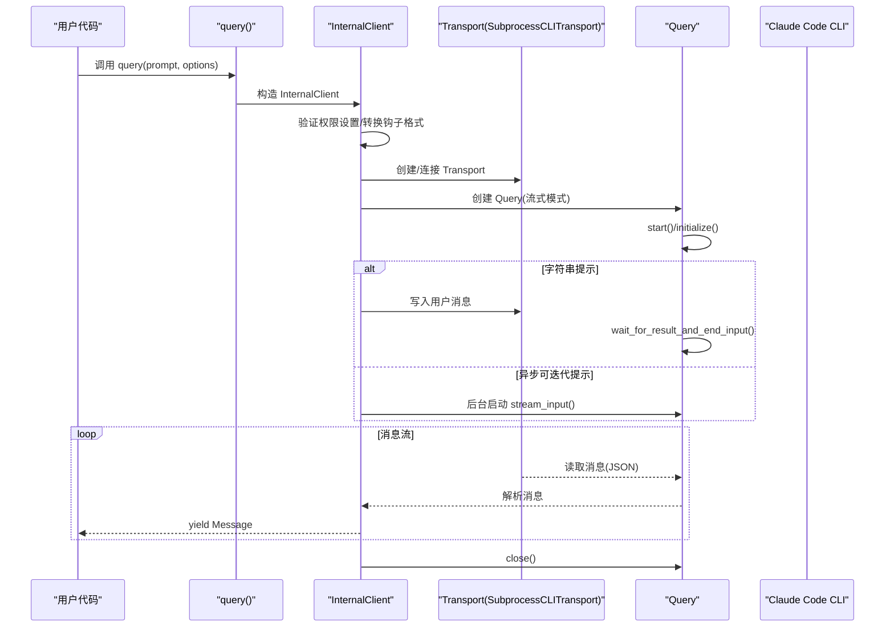
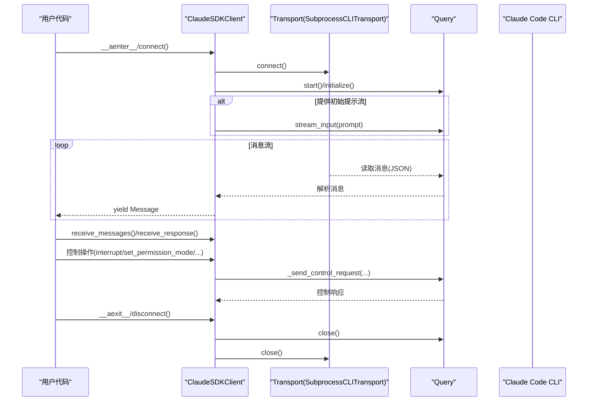
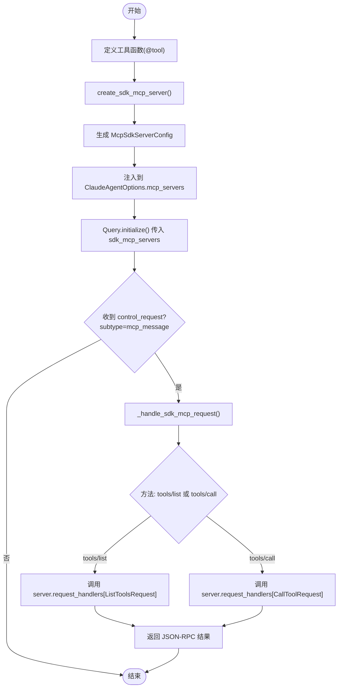
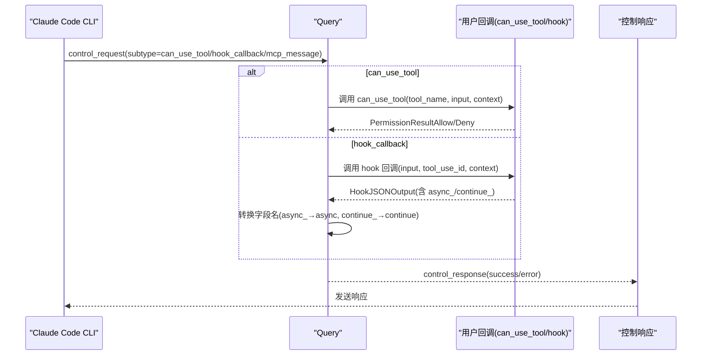
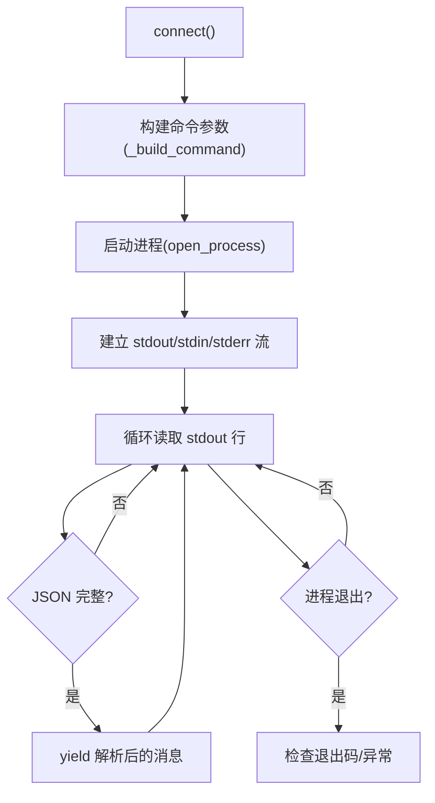
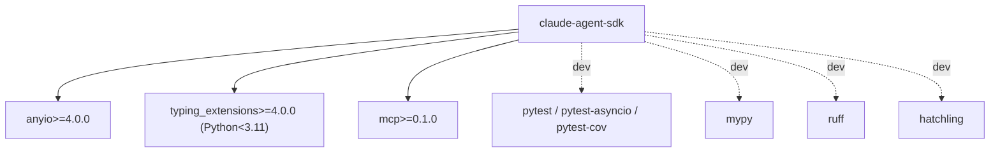

# 项目概述

<cite>
**本文引用的文件**
- [README.md](file://README.md)
- [CLAUDE.md](file://CLAUDE.md)
- [pyproject.toml](file://pyproject.toml)
- [src/claude_agent_sdk/__init__.py](file://src/claude_agent_sdk/__init__.py)
- [src/claude_agent_sdk/client.py](file://src/claude_agent_sdk/client.py)
- [src/claude_agent_sdk/query.py](file://src/claude_agent_sdk/query.py)
- [src/claude_agent_sdk/types.py](file://src/claude_agent_sdk/types.py)
- [src/claude_agent_sdk/_errors.py](file://src/claude_agent_sdk/_errors.py)
- [src/claude_agent_sdk/_internal/client.py](file://src/claude_agent_sdk/_internal/client.py)
- [src/claude_agent_sdk/_internal/query.py](file://src/claude_agent_sdk/_internal/query.py)
- [src/claude_agent_sdk/_internal/transport/subprocess_cli.py](file://src/claude_agent_sdk/_internal/transport/subprocess_cli.py)
- [examples/quick_start.py](file://examples/quick_start.py)
- [examples/streaming_mode.py](file://examples/streaming_mode.py)
- [examples/mcp_calculator.py](file://examples/mcp_calculator.py)
</cite>

## 目录
1. [简介](#简介)
2. [项目结构](#项目结构)
3. [核心组件](#核心组件)
4. [架构总览](#架构总览)
5. [详细组件分析](#详细组件分析)
6. [依赖分析](#依赖分析)
7. [性能考量](#性能考量)
8. [故障排查指南](#故障排查指南)
9. [结论](#结论)
10. [附录](#附录)

## 简介
Claude Agent SDK Python 是面向 Claude Code 平台的官方 Python 开发工具包，旨在帮助开发者以统一、可扩展的方式与 Claude 进行交互。其核心价值主张包括：
- 深度集成 Claude Code 平台：通过内置 CLI 传输层直接驱动 Claude Code CLI，实现从本地到云端的无缝连接。
- 双模式支持：既支持一次性查询（单向流式）也支持双向流式对话（交互式会话），满足从简单问答到复杂协作场景。
- 内建 MCP 服务器支持：提供“SDK MCP 服务器”能力，允许在应用进程内直接注册工具函数，避免外部子进程开销，提升性能与部署简化度。
- 权限与钩子系统：通过细粒度的工具权限控制与钩子回调机制，实现对工具调用、会话行为的可控干预与自动化反馈。
- 会话与状态管理：支持会话列表、消息检索、重放与文件检查点回溯等高级能力，便于构建长期对话与可审计的交互流程。

适用场景与目标用户：
- 开发者：快速集成 Claude 的代码生成、分析与调试能力。
- 企业集成商：在内部系统中嵌入智能代理，实现自动化任务编排与合规控制。
- AI 应用构建者：基于 SDK 构建聊天机器人、代码助手、知识问答等产品。

技术栈概览：
- Python 3.10+，异步编程模型（anyio），类型注解（mypy、typing_extensions）。
- 依赖 MCP 协议（mcp>=0.1.0）与 Claude Code CLI，支持跨平台运行。
- 工程化工具链：pytest、mypy、ruff、hatchling 等。

许可证与商业条款：
- 包级许可证为 MIT；使用 SDK 时受 Anthropic 商业条款约束，尤其当用于对外提供服务或产品时。

章节来源
- [README.md:1-360](file://README.md#L1-L360)
- [pyproject.toml:1-109](file://pyproject.toml#L1-L109)

## 项目结构
项目采用模块化分层设计，核心目录与职责如下：
- src/claude_agent_sdk：主包，包含公共 API、类型定义、错误类型与内部实现。
- src/claude_agent_sdk/_internal：内部实现细节，包括传输层、消息解析、控制协议处理等。
- examples：示例代码，覆盖基础查询、流式对话、MCP 服务器、钩子与工具权限等主题。
- tests：端到端测试与单元测试，覆盖 SDK 功能与集成场景。
- .github/workflows：CI/CD 流水线，涵盖构建、测试、发布与自动版本管理。

图表来源
- [src/claude_agent_sdk/__init__.py:1-445](file://src/claude_agent_sdk/__init__.py#L1-L445)
- [src/claude_agent_sdk/query.py:1-127](file://src/claude_agent_sdk/query.py#L1-L127)
- [src/claude_agent_sdk/client.py:1-500](file://src/claude_agent_sdk/client.py#L1-L500)
- [src/claude_agent_sdk/_internal/client.py:1-146](file://src/claude_agent_sdk/_internal/client.py#L1-L146)
- [src/claude_agent_sdk/_internal/query.py:1-679](file://src/claude_agent_sdk/_internal/query.py#L1-L679)
- [src/claude_agent_sdk/_internal/transport/subprocess_cli.py:1-630](file://src/claude_agent_sdk/_internal/transport/subprocess_cli.py#L1-L630)

章节来源
- [CLAUDE.md:19-28](file://CLAUDE.md#L19-L28)
- [pyproject.toml:1-109](file://pyproject.toml#L1-L109)

## 核心组件
- 公共 API 与导出
  - query：一次性查询入口，返回异步迭代器的消息流，适合简单、无状态的任务。
  - ClaudeSDKClient：交互式客户端，支持双向流式对话、中断、权限模式切换、MCP 服务器状态管理等。
  - 类型系统：涵盖消息类型、内容块、工具与权限、钩子输入输出、MCP 服务器配置与状态等。
  - 错误体系：统一的 SDK 异常基类与 CLI 相关错误类型，便于上层捕获与处理。
- 内部实现
  - Transport 抽象与 SubprocessCLITransport：负责与 Claude Code CLI 的进程通信，支持流式读写、环境变量注入、缓冲区与超时控制。
  - Query 控制协议：封装 CLI 控制通道，处理工具权限请求、钩子回调、MCP 请求桥接、模型切换、任务停止、文件回溯等。
  - 内部客户端 InternalClient：query() 的内部实现，统一处理传输、初始化、输入流与消息解析。

章节来源
- [src/claude_agent_sdk/__init__.py:1-445](file://src/claude_agent_sdk/__init__.py#L1-L445)
- [src/claude_agent_sdk/query.py:12-127](file://src/claude_agent_sdk/query.py#L12-L127)
- [src/claude_agent_sdk/client.py:21-500](file://src/claude_agent_sdk/client.py#L21-L500)
- [src/claude_agent_sdk/_internal/client.py:20-146](file://src/claude_agent_sdk/_internal/client.py#L20-L146)
- [src/claude_agent_sdk/_internal/query.py:53-679](file://src/claude_agent_sdk/_internal/query.py#L53-L679)
- [src/claude_agent_sdk/_internal/transport/subprocess_cli.py:33-630](file://src/claude_agent_sdk/_internal/transport/subprocess_cli.py#L33-L630)

## 架构总览
SDK 采用分层架构与接口抽象，确保高内聚、低耦合与可扩展性：
- 表现层：公共 API（query、ClaudeSDKClient）与示例代码。
- 业务层：消息解析、权限与钩子处理、MCP 服务器桥接。
- 传输层：统一 Transport 接口与 SubprocessCLITransport 实现，屏蔽 CLI 交互细节。
- 配置与类型层：强类型定义与配置对象，保证参数一致性与可维护性。

图表来源
- [src/claude_agent_sdk/query.py:12-127](file://src/claude_agent_sdk/query.py#L12-L127)
- [src/claude_agent_sdk/client.py:21-500](file://src/claude_agent_sdk/client.py#L21-L500)
- [src/claude_agent_sdk/_internal/query.py:53-679](file://src/claude_agent_sdk/_internal/query.py#L53-L679)
- [src/claude_agent_sdk/_internal/transport/subprocess_cli.py:33-630](file://src/claude_agent_sdk/_internal/transport/subprocess_cli.py#L33-L630)
- [src/claude_agent_sdk/types.py:1-1199](file://src/claude_agent_sdk/types.py#L1-L1199)

## 详细组件分析

### 组件一：一次性查询（query）
- 设计要点
  - 返回异步迭代器，支持字符串提示与异步可迭代提示（流式）两种模式。
  - 内部使用 InternalClient，统一处理传输、初始化与消息解析。
  - 支持自定义 Transport，便于替换底层实现或进行测试。
- 关键流程
  - 构造 InternalClient → 创建/选择 Transport → 启动 Query → 初始化 → 发送用户消息（如为字符串）→ 解析消息流 → 关闭 Query。

图表来源
- [src/claude_agent_sdk/query.py:12-127](file://src/claude_agent_sdk/query.py#L12-L127)
- [src/claude_agent_sdk/_internal/client.py:44-146](file://src/claude_agent_sdk/_internal/client.py#L44-L146)
- [src/claude_agent_sdk/_internal/query.py:165-235](file://src/claude_agent_sdk/_internal/query.py#L165-L235)
- [src/claude_agent_sdk/_internal/transport/subprocess_cli.py:335-411](file://src/claude_agent_sdk/_internal/transport/subprocess_cli.py#L335-L411)

章节来源
- [src/claude_agent_sdk/query.py:12-127](file://src/claude_agent_sdk/query.py#L12-L127)
- [src/claude_agent_sdk/_internal/client.py:44-146](file://src/claude_agent_sdk/_internal/client.py#L44-L146)

### 组件二：交互式客户端（ClaudeSDKClient）
- 设计要点
  - 支持双向流式对话、中断、权限模式切换、模型切换、文件回溯、MCP 服务器启停与重连、任务停止、服务器状态查询等。
  - 内部持有 Query 与 Transport，统一管理生命周期。
- 关键流程
  - connect() → 初始化控制协议 → 启动消息读取 → 可选发送初始提示流 → receive_messages()/receive_response() → 控制协议操作（interrupt/set_permission_mode/set_model/rewind_files/reconnect_mcp_server/toggle_mcp_server/stop_task/get_mcp_status）→ disconnect()。

图表来源
- [src/claude_agent_sdk/client.py:94-499](file://src/claude_agent_sdk/client.py#L94-L499)
- [src/claude_agent_sdk/_internal/query.py:165-679](file://src/claude_agent_sdk/_internal/query.py#L165-L679)
- [src/claude_agent_sdk/_internal/transport/subprocess_cli.py:335-586](file://src/claude_agent_sdk/_internal/transport/subprocess_cli.py#L335-L586)

章节来源
- [src/claude_agent_sdk/client.py:21-500](file://src/claude_agent_sdk/client.py#L21-L500)

### 组件三：MCP 服务器与工具系统
- 设计要点
  - 提供 @tool 装饰器与 create_sdk_mcp_server，可在应用进程中直接注册工具函数，无需外部子进程。
  - Query 对 SDK MCP 请求进行桥接，将 JSON-RPC 方法映射到对应处理器。
- 关键流程
  - 定义工具函数 → 使用 @tool 注册 → create_sdk_mcp_server 创建服务器配置 → 在 ClaudeAgentOptions 中注入 → Query 处理 mcp_message 控制请求 → 调用工具处理器 → 返回结果给 CLI。

图表来源
- [src/claude_agent_sdk/__init__.py:111-341](file://src/claude_agent_sdk/__init__.py#L111-L341)
- [src/claude_agent_sdk/_internal/query.py:394-531](file://src/claude_agent_sdk/_internal/query.py#L394-L531)

章节来源
- [src/claude_agent_sdk/__init__.py:95-341](file://src/claude_agent_sdk/__init__.py#L95-L341)
- [src/claude_agent_sdk/_internal/query.py:394-531](file://src/claude_agent_sdk/_internal/query.py#L394-L531)

### 组件四：权限与钩子系统
- 设计要点
  - 权限：支持默认、接受编辑、计划与绕过权限等模式；可通过 can_use_tool 回调动态决策；支持 PermissionUpdate 规则变更。
  - 钩子：支持 PreToolUse、PostToolUse、PostToolUseFailure、UserPromptSubmit、Stop、SubagentStop、PreCompact、Notification、SubagentStart、PermissionRequest 等事件，提供同步与异步输出结构。
- 关键流程
  - Query.handle_control_request() 分派 can_use_tool 与 hook_callback 请求 → 执行回调 → 转换输出字段名（async_/continue_ → async/continue）→ 返回控制响应。

图表来源
- [src/claude_agent_sdk/_internal/query.py:236-346](file://src/claude_agent_sdk/_internal/query.py#L236-L346)
- [src/claude_agent_sdk/types.py:124-472](file://src/claude_agent_sdk/types.py#L124-L472)

章节来源
- [src/claude_agent_sdk/_internal/query.py:236-346](file://src/claude_agent_sdk/_internal/query.py#L236-L346)
- [src/claude_agent_sdk/types.py:124-472](file://src/claude_agent_sdk/types.py#L124-L472)

### 组件五：传输层（SubprocessCLITransport）
- 设计要点
  - 自动查找并使用内置 CLI 或系统 CLI；支持工作目录、环境变量注入、stderr 管道与回调、缓冲区大小限制与超时控制。
  - 统一 read_messages() 与 write()/end_input() 接口，屏蔽底层进程细节。
- 关键流程
  - connect() → 构建命令参数 → 启动进程 → 建立 stdout/stdin/stderr 流 → 循环读取 JSON 行 → 解析消息 → 处理异常与退出码。

图表来源
- [src/claude_agent_sdk/_internal/transport/subprocess_cli.py:335-586](file://src/claude_agent_sdk/_internal/transport/subprocess_cli.py#L335-L586)

章节来源
- [src/claude_agent_sdk/_internal/transport/subprocess_cli.py:33-630](file://src/claude_agent_sdk/_internal/transport/subprocess_cli.py#L33-L630)

## 依赖分析
- 直接依赖
  - anyio>=4.0.0：异步 I/O 与任务组管理。
  - typing_extensions>=4.0.0（Python < 3.11）：类型扩展支持。
  - mcp>=0.1.0：MCP 协议与服务器桥接。
- 可选开发依赖
  - pytest、pytest-asyncio、pytest-cov、mypy、ruff、hatchling 等，用于测试、类型检查与打包。
- 版本与兼容性
  - Python >= 3.10；最小 CLI 版本要求 2.0.0（运行时校验）。

图表来源
- [pyproject.toml:27-41](file://pyproject.toml#L27-L41)

章节来源
- [pyproject.toml:1-109](file://pyproject.toml#L1-L109)

## 性能考量
- 内建 MCP 服务器优势
  - 无 IPC 开销：工具调用直接在进程内执行，减少序列化与进程间通信成本。
  - 更易调试：所有代码在同一进程，便于断点与日志追踪。
  - 更简部署：单进程运行，降低运维复杂度。
- 传输层优化
  - 缓冲区上限与长行处理：防止内存膨胀与解析失败。
  - 写锁保护：避免并发写入导致的竞争条件。
  - 流式输入：后台任务流式发送消息，配合首结果等待策略，平衡延迟与可靠性。
- 异步模型
  - anyio 任务组与内存对象流，确保高吞吐与低阻塞。

章节来源
- [README.md:92-143](file://README.md#L92-L143)
- [src/claude_agent_sdk/_internal/transport/subprocess_cli.py:515-586](file://src/claude_agent_sdk/_internal/transport/subprocess_cli.py#L515-L586)
- [src/claude_agent_sdk/_internal/query.py:621-647](file://src/claude_agent_sdk/_internal/query.py#L621-L647)

## 故障排查指南
- 常见错误类型
  - CLIConnectionError：无法连接到 CLI 或进程已终止。
  - CLINotFoundError：未找到 Claude Code CLI。
  - ProcessError：CLI 进程失败（带退出码与错误输出）。
  - CLIJSONDecodeError：无法解析 CLI 输出的 JSON。
  - MessageParseError：消息解析失败。
- 排查建议
  - 确认 CLI 安装与路径：优先使用内置 CLI，或通过 ClaudeAgentOptions 指定路径。
  - 检查工作目录是否存在与权限是否正确。
  - 查看 stderr 回调或启用调试模式，收集 CLI 输出。
  - 检查缓冲区大小与超时设置，避免长消息截断。
  - 对于 MCP 服务器，确认名称与工具注册一致，检查服务器状态与错误信息。

章节来源
- [src/claude_agent_sdk/_errors.py:1-57](file://src/claude_agent_sdk/_errors.py#L1-L57)
- [src/claude_agent_sdk/_internal/transport/subprocess_cli.py:396-410](file://src/claude_agent_sdk/_internal/transport/subprocess_cli.py#L396-L410)
- [src/claude_agent_sdk/_internal/transport/subprocess_cli.py:515-586](file://src/claude_agent_sdk/_internal/transport/subprocess_cli.py#L515-L586)

## 结论
Claude Agent SDK Python 以清晰的分层架构与强大的接口抽象，实现了与 Claude Code 平台的深度集成。其双模式设计兼顾了简单查询与复杂交互，内建 MCP 服务器显著提升了工具调用的性能与部署便利性，权限与钩子系统则提供了精细的控制与可观测性。结合完善的类型系统与工程化工具链，该 SDK 为开发者、企业集成商与 AI 应用构建者提供了稳定、可扩展且易于维护的解决方案。

## 附录
- 示例参考
  - 快速开始：examples/quick_start.py
  - 流式对话：examples/streaming_mode.py
  - MCP 计算器：examples/mcp_calculator.py
- 文档与许可
  - 项目主页与文档链接、许可证与商业条款详见 README 与 pyproject.toml。

章节来源
- [examples/quick_start.py:1-77](file://examples/quick_start.py#L1-L77)
- [examples/streaming_mode.py:1-512](file://examples/streaming_mode.py#L1-L512)
- [examples/mcp_calculator.py:1-194](file://examples/mcp_calculator.py#L1-L194)
- [README.md:357-360](file://README.md#L357-L360)
- [pyproject.toml:10-25](file://pyproject.toml#L10-L25)