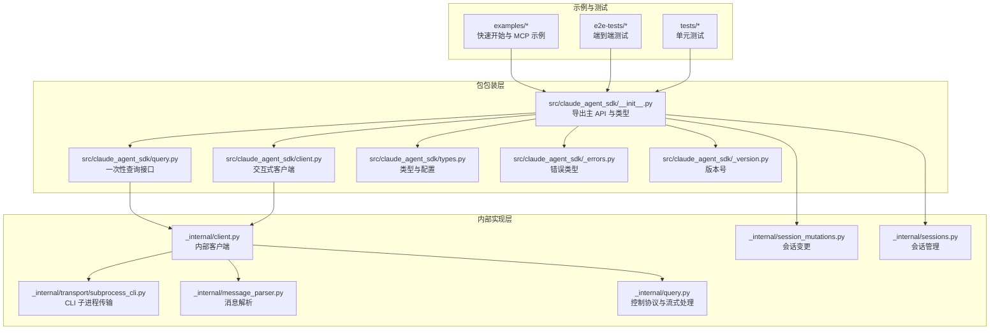
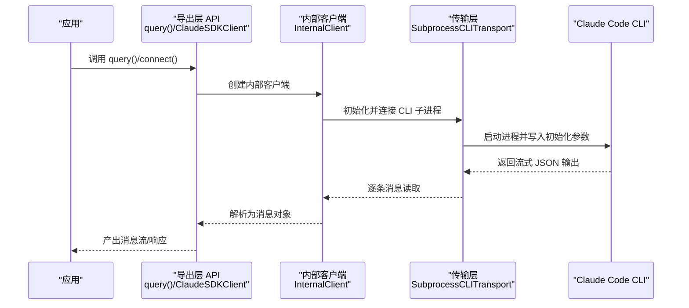
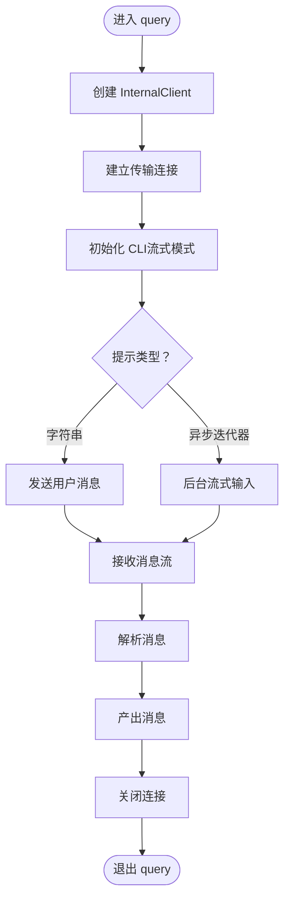
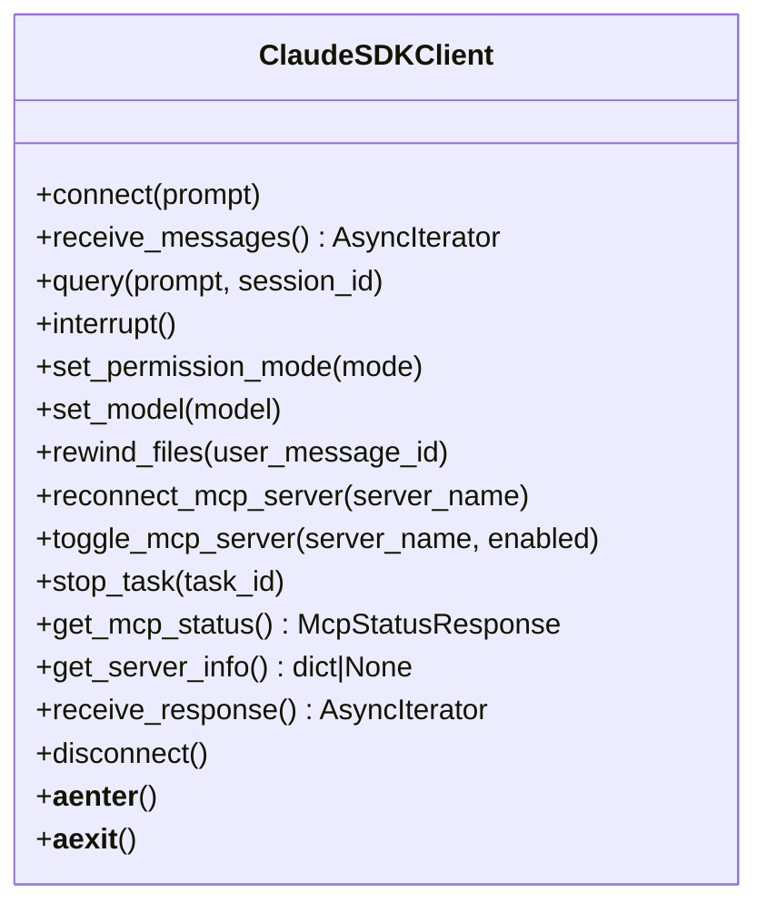
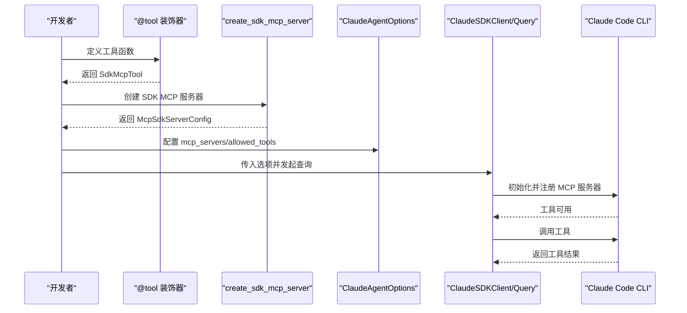
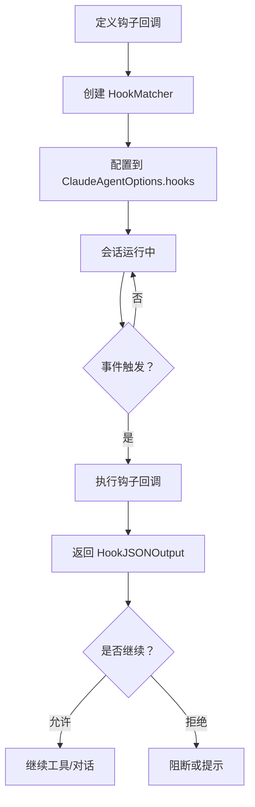
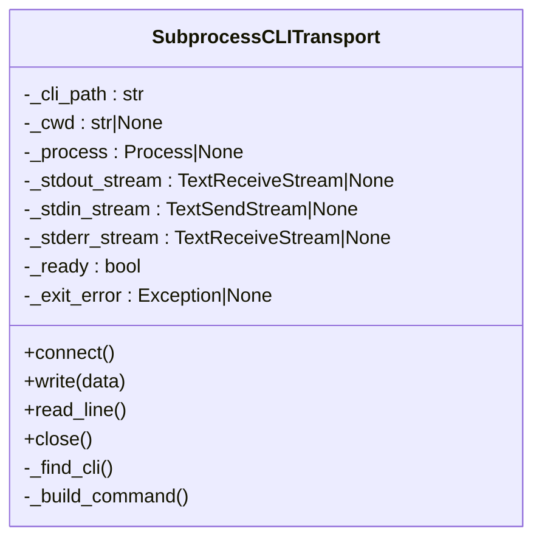
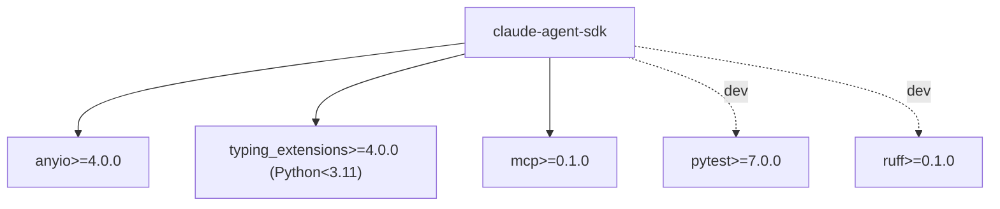

# 项目概述

<cite>
**本文档引用的文件**
- [README.md](file://README.md)
- [pyproject.toml](file://pyproject.toml)
- [src/claude_agent_sdk/__init__.py](file://src/claude_agent_sdk/__init__.py)
- [src/claude_agent_sdk/client.py](file://src/claude_agent_sdk/client.py)
- [src/claude_agent_sdk/query.py](file://src/claude_agent_sdk/query.py)
- [src/claude_agent_sdk/types.py](file://src/claude_agent_sdk/types.py)
- [src/claude_agent_sdk/_errors.py](file://src/claude_agent_sdk/_errors.py)
- [src/claude_agent_sdk/_version.py](file://src/claude_agent_sdk/_version.py)
- [src/claude_agent_sdk/_internal/client.py](file://src/claude_agent_sdk/_internal/client.py)
- [src/claude_agent_sdk/_internal/transport/subprocess_cli.py](file://src/claude_agent_sdk/_internal/transport/subprocess_cli.py)
- [examples/quick_start.py](file://examples/quick_start.py)
- [examples/mcp_calculator.py](file://examples/mcp_calculator.py)
- [CHANGELOG.md](file://CHANGELOG.md)
- [CLAUDE.md](file://CLAUDE.md)
</cite>

## 目录
1. [简介](#简介)
2. [项目结构](#项目结构)
3. [核心组件](#核心组件)
4. [架构总览](#架构总览)
5. [详细组件分析](#详细组件分析)
6. [依赖分析](#依赖分析)
7. [性能考虑](#性能考虑)
8. [故障排除指南](#故障排除指南)
9. [结论](#结论)
10. [附录](#附录)

## 简介
Claude Agent SDK Python 是面向 Claude Code 平台的官方 Python 开发工具包，旨在帮助开发者以统一、类型安全且可扩展的方式构建 AI 代理应用。其核心价值主张包括：
- 一次性查询与双向对话：提供简洁的单次查询接口与交互式会话客户端，满足从简单问答到复杂多轮对话的广泛场景。
- MCP 服务器支持：内置“SDK MCP 服务器”能力，允许在进程中直接注册自定义工具，避免外部进程开销，提升性能与易用性。
- 钩子系统：通过事件驱动的钩子机制，对工具调用、权限请求、通知等关键节点进行拦截与控制，实现确定性行为与自动化反馈。
- 异步编程模型：基于 anyio 的异步传输层，支持高并发与流式处理，适配现代 Python 异步生态。
- 模块化设计：清晰的导出层、内部实现层与传输层分离，便于扩展与维护。

该 SDK 在 AI 代理生态系统中的定位是“连接开发者与 Claude Code 的桥梁”，既适合快速原型与脚本化任务，也适合构建企业级的智能代理应用。

## 项目结构
仓库采用按功能域划分的模块化组织方式：
- 根目录包含文档、CI 工作流、示例与脚本。
- 包装入口位于 src/claude_agent_sdk，对外暴露查询函数、客户端类、类型定义与错误类型。
- 内部实现位于 _internal 子包，涵盖传输层（子进程 CLI）、消息解析与内部客户端逻辑。
- 示例与端到端测试覆盖典型用法与高级特性（如 MCP 工具、钩子、流式输出等）。

**图表来源**
- [src/claude_agent_sdk/__init__.py:1-445](file://src/claude_agent_sdk/__init__.py#L1-L445)
- [src/claude_agent_sdk/query.py:1-127](file://src/claude_agent_sdk/query.py#L1-L127)
- [src/claude_agent_sdk/client.py:1-500](file://src/claude_agent_sdk/client.py#L1-L500)
- [src/claude_agent_sdk/_internal/client.py:1-146](file://src/claude_agent_sdk/_internal/client.py#L1-L146)
- [src/claude_agent_sdk/_internal/transport/subprocess_cli.py:1-200](file://src/claude_agent_sdk/_internal/transport/subprocess_cli.py#L1-L200)

**章节来源**
- [CLAUDE.md:19-28](file://CLAUDE.md#L19-L28)

## 核心组件
- 查询接口（query）：面向一次性或单向流式交互，适合简单问题、批处理与自动化脚本。
- 交互式客户端（ClaudeSDKClient）：支持双向对话、中断、权限模式切换、MCP 服务器动态管理与会话控制。
- 类型系统（types）：涵盖消息类型、内容块、权限规则、钩子输入/输出、MCP 服务器配置与状态等。
- 错误体系（_errors）：统一的异常层次，覆盖 CLI 连接、进程失败、JSON 解析与消息解析错误。
- MCP 工具与服务器（工具装饰器与 SDK MCP 服务器）：在进程中注册工具，简化部署与调试，提升性能。
- 传输层（SubprocessCLITransport）：封装 Claude Code CLI 的子进程通信，负责命令构建、参数传递与流式读写。

**章节来源**
- [src/claude_agent_sdk/query.py:12-127](file://src/claude_agent_sdk/query.py#L12-L127)
- [src/claude_agent_sdk/client.py:21-500](file://src/claude_agent_sdk/client.py#L21-L500)
- [src/claude_agent_sdk/types.py:1-800](file://src/claude_agent_sdk/types.py#L1-L800)
- [src/claude_agent_sdk/_errors.py:1-57](file://src/claude_agent_sdk/_errors.py#L1-L57)
- [src/claude_agent_sdk/__init__.py:100-341](file://src/claude_agent_sdk/__init__.py#L100-L341)
- [src/claude_agent_sdk/_internal/transport/subprocess_cli.py:33-200](file://src/claude_agent_sdk/_internal/transport/subprocess_cli.py#L33-L200)

## 架构总览
SDK 通过“导出层 API → 内部客户端 → 传输层”的分层设计，实现与 Claude Code CLI 的解耦与扩展。查询路径与交互式路径共享相同的传输与解析逻辑，差异在于初始化与控制协议的使用方式。

**图表来源**
- [src/claude_agent_sdk/query.py:12-127](file://src/claude_agent_sdk/query.py#L12-L127)
- [src/claude_agent_sdk/_internal/client.py:44-146](file://src/claude_agent_sdk/_internal/client.py#L44-L146)
- [src/claude_agent_sdk/_internal/transport/subprocess_cli.py:166-200](file://src/claude_agent_sdk/_internal/transport/subprocess_cli.py#L166-L200)

## 详细组件分析

### 组件 A：一次性查询（query）
- 设计要点
  - 单向流式交互，适合一次性任务与批处理。
  - 支持字符串提示与异步迭代器提示（流式输入）。
  - 内部始终以流式模式初始化，确保代理与大配置通过初始化请求发送。
- 典型流程
  - 构建内部客户端 → 连接传输 → 初始化 → 发送用户消息 → 流式接收消息 → 关闭连接。
- 适用场景
  - 简单问答、代码生成、批量分析、CI/CD 集成。

**图表来源**
- [src/claude_agent_sdk/query.py:12-127](file://src/claude_agent_sdk/query.py#L12-L127)
- [src/claude_agent_sdk/_internal/client.py:44-146](file://src/claude_agent_sdk/_internal/client.py#L44-L146)

**章节来源**
- [src/claude_agent_sdk/query.py:12-127](file://src/claude_agent_sdk/query.py#L12-L127)
- [src/claude_agent_sdk/_internal/client.py:44-146](file://src/claude_agent_sdk/_internal/client.py#L44-L146)

### 组件 B：交互式客户端（ClaudeSDKClient）
- 设计要点
  - 双向、有状态、可中断的会话；支持权限模式切换、模型切换、任务停止、文件回滚等高级控制。
  - 支持 SDK MCP 服务器与外部 MCP 服务器混合使用。
  - 提供钩子匹配器与回调，实现对工具调用、权限请求、通知等事件的拦截与决策。
- 关键方法
  - connect/receive_messages/query/interrupt/set_permission_mode/set_model/rewind_files/reconnect_mcp_server/toggle_mcp_server/stop_task/get_mcp_status/get_server_info/receive_response/disconnect。
- 适用场景
  - 聊天界面、调试探索、长时会话、实时交互与动态控制。

**图表来源**
- [src/claude_agent_sdk/client.py:21-500](file://src/claude_agent_sdk/client.py#L21-L500)

**章节来源**
- [src/claude_agent_sdk/client.py:21-500](file://src/claude_agent_sdk/client.py#L21-L500)

### 组件 C：MCP 工具与 SDK MCP 服务器
- 设计要点
  - 工具装饰器提供类型安全与输入校验，支持字典/TypedDict/JSON Schema 多种输入模式。
  - SDK MCP 服务器在进程中运行，避免 IPC 开销，便于调试与访问应用状态。
  - 支持混合服务器（SDK 与外部 MCP 服务器共存）。
- 典型流程
  - 定义工具函数 → 使用装饰器注册 → 创建 SDK MCP 服务器 → 配置选项并传入客户端/查询 → 注册工具权限 → 执行对话。

**图表来源**
- [src/claude_agent_sdk/__init__.py:111-341](file://src/claude_agent_sdk/__init__.py#L111-L341)
- [examples/mcp_calculator.py:138-194](file://examples/mcp_calculator.py#L138-L194)

**章节来源**
- [src/claude_agent_sdk/__init__.py:111-341](file://src/claude_agent_sdk/__init__.py#L111-L341)
- [examples/mcp_calculator.py:1-194](file://examples/mcp_calculator.py#L1-L194)

### 组件 D：钩子系统
- 设计要点
  - 钩子事件覆盖工具调用前后、权限请求、通知、子代理生命周期等。
  - 支持同步与异步钩子输出，提供决策字段与附加上下文。
  - 通过 HookMatcher 将事件名与回调函数绑定，并可设置超时。
- 典型流程
  - 定义钩子回调 → 配置 HookMatcher → 传入选项 → 在事件触发时执行回调 → 返回控制输出。

**图表来源**
- [src/claude_agent_sdk/types.py:160-473](file://src/claude_agent_sdk/types.py#L160-L473)
- [src/claude_agent_sdk/client.py:76-92](file://src/claude_agent_sdk/client.py#L76-L92)

**章节来源**
- [src/claude_agent_sdk/types.py:160-473](file://src/claude_agent_sdk/types.py#L160-L473)
- [src/claude_agent_sdk/client.py:76-92](file://src/claude_agent_sdk/client.py#L76-L92)

### 组件 E：传输层（SubprocessCLITransport）
- 设计要点
  - 自动查找并使用捆绑的 Claude Code CLI 或系统安装版本。
  - 构建命令行参数，支持系统提示、工具白名单、最大轮次、工作目录、缓冲区大小等。
  - 基于 anyio 的文本流读写，保证高并发与流式处理。
- 关键职责
  - CLI 查找与版本检查、命令构建、进程启动、stdin/stdout/stderr 管道管理、JSON 行解析与错误传播。

**图表来源**
- [src/claude_agent_sdk/_internal/transport/subprocess_cli.py:33-200](file://src/claude_agent_sdk/_internal/transport/subprocess_cli.py#L33-L200)

**章节来源**
- [src/claude_agent_sdk/_internal/transport/subprocess_cli.py:33-200](file://src/claude_agent_sdk/_internal/transport/subprocess_cli.py#L33-L200)

## 依赖分析
- 运行时依赖
  - anyio：异步运行时与流式 I/O。
  - typing_extensions：类型增强（Python < 3.11）。
  - mcp：MCP 协议支持，用于工具与服务器交互。
- 可选开发依赖
  - pytest、pytest-asyncio、mypy、ruff 等，用于测试、类型检查与代码规范。
- 版本与许可
  - 包版本：0.1.48
  - 许可证：MIT
  - Python 版本要求：3.10+

**图表来源**
- [pyproject.toml:27-41](file://pyproject.toml#L27-L41)

**章节来源**
- [pyproject.toml:1-109](file://pyproject.toml#L1-L109)
- [src/claude_agent_sdk/_version.py:1-4](file://src/claude_agent_sdk/_version.py#L1-L4)

## 性能考虑
- SDK MCP 服务器在进程内运行，避免 IPC 开销，适合高频工具调用与低延迟场景。
- 传输层使用 anyio 的异步流式读写，减少阻塞与上下文切换。
- 对未知消息类型的前向兼容处理，避免因新消息类型导致崩溃，提升稳定性。
- 缓冲区大小可配置，平衡内存占用与吞吐量。

[本节为通用性能讨论，无需具体文件分析]

## 故障排除指南
- CLI 未找到/连接失败
  - 现象：抛出 CLI 连接或 CLI 未找到错误。
  - 排查：确认已安装 Claude Code CLI，或使用捆绑 CLI；检查路径与环境变量。
- 进程失败
  - 现象：进程退出码非零或标准错误输出。
  - 排查：查看错误输出，定位 CLI 参数或权限问题。
- JSON 解析失败
  - 现象：无法解析 CLI 输出的 JSON 行。
  - 排查：检查输出格式与编码，确认 CLI 版本兼容性。
- 消息解析错误
  - 现象：未知消息类型导致解析异常。
  - 排查：当前实现会跳过未知类型，建议升级 SDK 以支持新类型。

**章节来源**
- [src/claude_agent_sdk/_errors.py:1-57](file://src/claude_agent_sdk/_errors.py#L1-L57)
- [src/claude_agent_sdk/_internal/transport/subprocess_cli.py:88-95](file://src/claude_agent_sdk/_internal/transport/subprocess_cli.py#L88-L95)

## 结论
Claude Agent SDK Python 以清晰的分层架构、完善的类型系统与强大的 MCP/钩子能力，为构建智能代理应用提供了高效、稳定与可扩展的基础设施。它既能满足快速原型与自动化脚本的需求，也能支撑企业级的交互式与流式应用场景。随着版本迭代，SDK 在 MCP 控制、会话管理、钩子事件与消息类型方面持续增强，向前兼容与稳定性也在不断提升。

[本节为总结性内容，无需具体文件分析]

## 附录

### 适用场景与目标用户
- 初学者：通过快速开始示例与简单查询接口，快速体验 Claude Code 的能力。
- 开发者：利用交互式客户端、MCP 工具与钩子系统，构建可定制的智能代理。
- 企业集成商：通过 SDK 的会话管理、权限控制与 MCP 服务器管理，对接现有系统与工具链。

### 版本与许可信息
- 版本：0.1.48
- 许可证：MIT
- Python 要求：3.10+

**章节来源**
- [src/claude_agent_sdk/_version.py:1-4](file://src/claude_agent_sdk/_version.py#L1-L4)
- [pyproject.toml:5-25](file://pyproject.toml#L5-L25)

### 社区与资源
- 文档与示例：README 中包含丰富的使用示例与迁移指南。
- 示例参考：快速开始与 MCP 计算器示例展示了基本与高级用法。
- 变更记录：CHANGELOG 记录了版本更新、新特性与修复。

**章节来源**
- [README.md:1-360](file://README.md#L1-L360)
- [examples/quick_start.py:1-77](file://examples/quick_start.py#L1-L77)
- [examples/mcp_calculator.py:1-194](file://examples/mcp_calculator.py#L1-L194)
- [CHANGELOG.md:1-200](file://CHANGELOG.md#L1-L200)