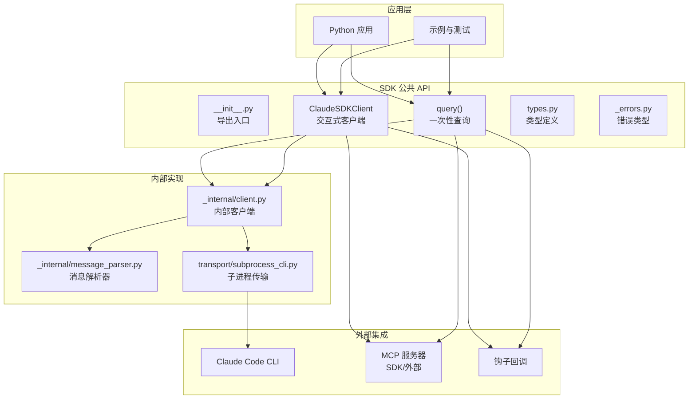
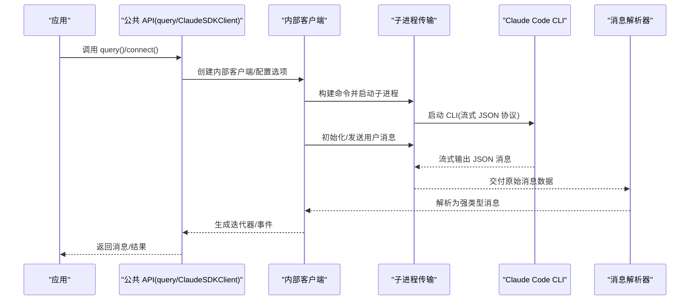
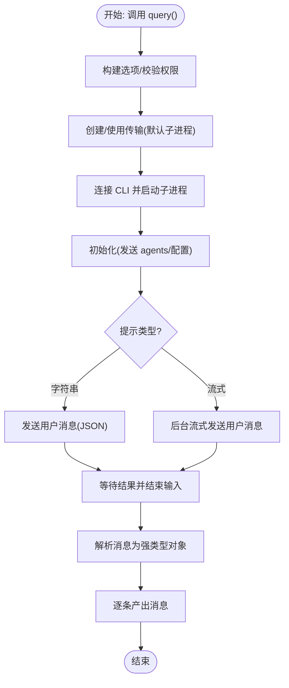
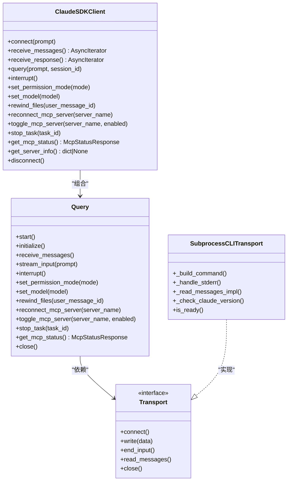
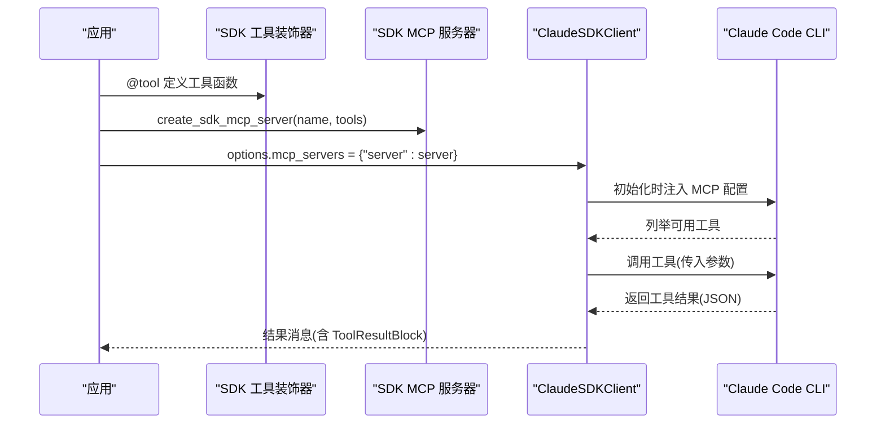
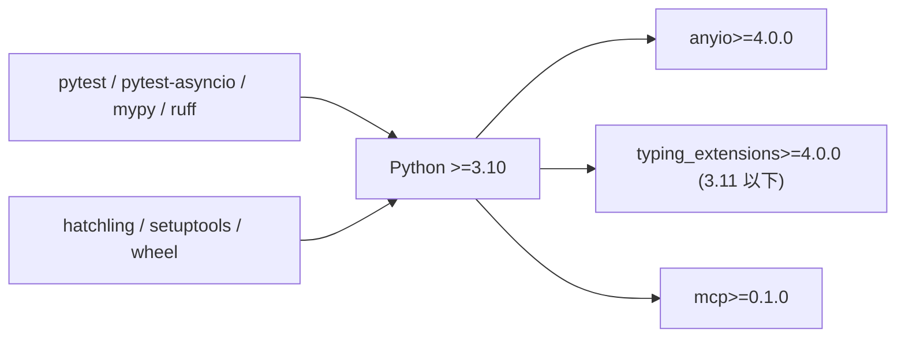

# 项目概述

<cite>
**本文档引用的文件**
- [README.md](file://README.md)
- [pyproject.toml](file://pyproject.toml)
- [CLAUDE.md](file://CLAUDE.md)
- [src/claude_agent_sdk/__init__.py](file://src/claude_agent_sdk/__init__.py)
- [src/claude_agent_sdk/client.py](file://src/claude_agent_sdk/client.py)
- [src/claude_agent_sdk/query.py](file://src/claude_agent_sdk/query.py)
- [src/claude_agent_sdk/types.py](file://src/claude_agent_sdk/types.py)
- [src/claude_agent_sdk/_errors.py](file://src/claude_agent_sdk/_errors.py)
- [src/claude_agent_sdk/_internal/transport/subprocess_cli.py](file://src/claude_agent_sdk/_internal/transport/subprocess_cli.py)
- [src/claude_agent_sdk/_internal/client.py](file://src/claude_agent_sdk/_internal/client.py)
- [src/claude_agent_sdk/_internal/message_parser.py](file://src/claude_agent_sdk/_internal/message_parser.py)
- [examples/quick_start.py](file://examples/quick_start.py)
</cite>

## 目录
1. [简介](#简介)
2. [项目结构](#项目结构)
3. [核心组件](#核心组件)
4. [架构总览](#架构总览)
5. [详细组件分析](#详细组件分析)
6. [依赖关系分析](#依赖关系分析)
7. [性能考量](#性能考量)
8. [故障排查指南](#故障排查指南)
9. [结论](#结论)
10. [附录](#附录)

## 简介
Claude Agent SDK Python 是一个用于连接 Python 应用与 Claude Code 平台的官方 SDK。它通过子进程方式启动 Claude Code CLI，并以流式 JSON 协议与 CLI 通信，实现与 Claude 的双向交互。SDK 提供两类主要能力：
- 一次性查询：适合简单、无状态的问答或批处理任务。
- 交互式客户端：支持持续会话、中断控制、动态消息发送、工具与钩子扩展等高级特性。

该 SDK 在 AI 应用开发中定位为“本地代理执行器”，将 Python 应用的业务逻辑、自定义工具与 Claude 的推理能力结合，形成可编程、可观测、可控的智能体工作流。

## 项目结构
项目采用分层模块化组织：
- 根目录包含文档、CI 工作流、示例与脚本。
- 源码位于 src/claude_agent_sdk，核心分为公共 API、内部实现与类型系统。
- 内部实现包含传输层（子进程 CLI）、消息解析器、查询控制协议等。
- 示例与端到端测试覆盖常见使用场景。

图表来源
- [src/claude_agent_sdk/__init__.py:1-445](file://src/claude_agent_sdk/__init__.py#L1-L445)
- [src/claude_agent_sdk/query.py:1-127](file://src/claude_agent_sdk/query.py#L1-L127)
- [src/claude_agent_sdk/client.py:1-500](file://src/claude_agent_sdk/client.py#L1-L500)
- [src/claude_agent_sdk/_internal/client.py:1-146](file://src/claude_agent_sdk/_internal/client.py#L1-L146)
- [src/claude_agent_sdk/_internal/message_parser.py:1-251](file://src/claude_agent_sdk/_internal/message_parser.py#L1-L251)
- [src/claude_agent_sdk/_internal/transport/subprocess_cli.py:1-630](file://src/claude_agent_sdk/_internal/transport/subprocess_cli.py#L1-L630)

章节来源
- [README.md:1-360](file://README.md#L1-L360)
- [CLAUDE.md:19-28](file://CLAUDE.md#L19-L28)

## 核心组件
- 公共 API 导出与工具
  - 导出 query()、ClaudeSDKClient、类型与错误类，以及 SDK MCP 工具装饰器与服务器创建函数。
  - 支持 SDK MCP 服务器（在进程中运行）与外部 MCP 服务器混合配置。
- 一次性查询接口
  - query() 返回异步迭代器，支持字符串提示或流式输入，自动处理初始化与结果收尾。
- 交互式客户端
  - ClaudeSDKClient 提供双向、有状态的对话能力，支持中断、权限模式切换、模型切换、文件回溯、MCP 服务器启停与状态查询等。
- 类型系统
  - 完整的消息类型、内容块类型、钩子类型、MCP 服务器配置与状态类型，确保强类型开发体验。
- 错误体系
  - 统一的 SDK 异常基类与 CLI 连接、进程、JSON 解析、消息解析等具体错误类型。
- 内部传输与解析
  - 子进程传输负责 CLI 启动、参数构建、标准输入输出读写与错误处理。
  - 消息解析器将 CLI 输出的 JSON 数据转换为 SDK 的强类型消息对象。

章节来源
- [src/claude_agent_sdk/__init__.py:1-445](file://src/claude_agent_sdk/__init__.py#L1-L445)
- [src/claude_agent_sdk/query.py:1-127](file://src/claude_agent_sdk/query.py#L1-L127)
- [src/claude_agent_sdk/client.py:1-500](file://src/claude_agent_sdk/client.py#L1-L500)
- [src/claude_agent_sdk/types.py:1-1199](file://src/claude_agent_sdk/types.py#L1-L1199)
- [src/claude_agent_sdk/_errors.py:1-57](file://src/claude_agent_sdk/_errors.py#L1-L57)
- [src/claude_agent_sdk/_internal/transport/subprocess_cli.py:1-630](file://src/claude_agent_sdk/_internal/transport/subprocess_cli.py#L1-L630)
- [src/claude_agent_sdk/_internal/message_parser.py:1-251](file://src/claude_agent_sdk/_internal/message_parser.py#L1-L251)

## 架构总览
SDK 通过“公共 API 层”调用“内部实现层”，内部实现层再与“外部 CLI”进行协议交互。消息在 CLI 与 SDK 之间以流式 JSON 形式传递，SDK 负责解析、路由与控制。

图表来源
- [src/claude_agent_sdk/query.py:1-127](file://src/claude_agent_sdk/query.py#L1-L127)
- [src/claude_agent_sdk/client.py:1-500](file://src/claude_agent_sdk/client.py#L1-L500)
- [src/claude_agent_sdk/_internal/client.py:1-146](file://src/claude_agent_sdk/_internal/client.py#L1-L146)
- [src/claude_agent_sdk/_internal/transport/subprocess_cli.py:1-630](file://src/claude_agent_sdk/_internal/transport/subprocess_cli.py#L1-L630)
- [src/claude_agent_sdk/_internal/message_parser.py:1-251](file://src/claude_agent_sdk/_internal/message_parser.py#L1-L251)

## 详细组件分析

### 组件 A：一次性查询流程（query）
- 设计要点
  - 无状态、单次往返：适合简单问答、批处理与自动化脚本。
  - 支持字符串提示与流式输入两种模式；流式模式仍为单向（先发后收）。
  - 自动设置入口标记，内部使用子进程传输与查询控制协议。
- 关键路径
  - 公共 API：query() -> InternalClient.process_query()
  - 内部实现：构建传输、启动 CLI、初始化、发送用户消息、等待结果并结束输入。
  - 消息解析：将 CLI 输出映射为强类型消息对象。
- 使用场景
  - 快速问答、代码生成、批量分析、CI/CD 集成。

图表来源
- [src/claude_agent_sdk/query.py:1-127](file://src/claude_agent_sdk/query.py#L1-L127)
- [src/claude_agent_sdk/_internal/client.py:1-146](file://src/claude_agent_sdk/_internal/client.py#L1-L146)
- [src/claude_agent_sdk/_internal/message_parser.py:1-251](file://src/claude_agent_sdk/_internal/message_parser.py#L1-L251)

章节来源
- [src/claude_agent_sdk/query.py:1-127](file://src/claude_agent_sdk/query.py#L1-L127)
- [src/claude_agent_sdk/_internal/client.py:1-146](file://src/claude_agent_sdk/_internal/client.py#L1-L146)

### 组件 B：交互式客户端（ClaudeSDKClient）
- 设计要点
  - 双向、有状态、可中断：适合聊天界面、探索性调试、长会话与实时交互。
  - 支持权限模式切换、模型切换、文件回溯、MCP 服务器启停与状态查询。
  - 钩子系统允许在特定生命周期点拦截与控制 Claude 的行为。
- 关键路径
  - connect() 建立连接，内部创建 Query 控制协议实例，启动消息读取任务组。
  - receive_messages()/receive_response() 提供消息迭代与单轮响应收集。
  - query() 支持字符串与流式输入；interrupt() 发送中断信号。
  - get_mcp_status()/toggle_mcp_server()/reconnect_mcp_server() 管理 MCP 服务器。
- 使用场景
  - 对话式应用、多轮探索、工具编排、安全策略控制。

图表来源
- [src/claude_agent_sdk/client.py:1-500](file://src/claude_agent_sdk/client.py#L1-L500)
- [src/claude_agent_sdk/_internal/client.py:1-146](file://src/claude_agent_sdk/_internal/client.py#L1-L146)
- [src/claude_agent_sdk/_internal/transport/subprocess_cli.py:1-630](file://src/claude_agent_sdk/_internal/transport/subprocess_cli.py#L1-L630)

章节来源
- [src/claude_agent_sdk/client.py:1-500](file://src/claude_agent_sdk/client.py#L1-L500)

### 组件 C：MCP 服务器与工具系统
- 设计要点
  - SDK MCP 服务器在应用进程内直接运行，避免子进程 IPC 开销，具备更好的性能与调试体验。
  - 支持 SDK 与外部 MCP 服务器混合配置，兼容 stdio/sse/http/proxy 等多种连接方式。
  - 工具装饰器提供类型安全与输入模式校验，简化工具定义与注册。
- 关键路径
  - @tool 装饰器定义工具，create_sdk_mcp_server 创建服务器配置。
  - SubprocessCLITransport 将服务器配置序列化传给 CLI。
  - Query 处理工具调用与结果返回。
- 使用场景
  - 文件读写、数据库访问、外部服务调用、复杂业务编排。

图表来源
- [src/claude_agent_sdk/__init__.py:100-341](file://src/claude_agent_sdk/__init__.py#L100-L341)
- [src/claude_agent_sdk/client.py:143-180](file://src/claude_agent_sdk/client.py#L143-L180)
- [src/claude_agent_sdk/_internal/transport/subprocess_cli.py:240-266](file://src/claude_agent_sdk/_internal/transport/subprocess_cli.py#L240-L266)

章节来源
- [src/claude_agent_sdk/__init__.py:100-341](file://src/claude_agent_sdk/__init__.py#L100-L341)

### 组件 D：钩子系统
- 设计要点
  - 钩子是 Python 函数，由 Claude Code 应用在特定生命周期事件触发，用于拦截与控制 Claude 的行为。
  - 支持 PreToolUse、PostToolUse、PostToolUseFailure、UserPromptSubmit、Stop、SubagentStart/Stop、PermissionRequest 等事件。
  - HookMatcher 支持按工具名匹配与超时控制。
- 使用场景
  - 安全策略（如禁止危险命令）、审计日志、动态权限决策、任务通知与进度跟踪。

章节来源
- [src/claude_agent_sdk/types.py:160-473](file://src/claude_agent_sdk/types.py#L160-L473)
- [src/claude_agent_sdk/client.py:76-92](file://src/claude_agent_sdk/client.py#L76-L92)

## 依赖关系分析
- 技术栈与依赖
  - 运行时：Python 3.10+，anyio（异步运行时），typing_extensions（类型增强，3.11 以下），mcp（MCP 协议支持）。
  - 开发工具：pytest、pytest-asyncio、mypy、ruff、hatchling（打包）。
- 依赖关系图

图表来源
- [pyproject.toml:27-31](file://pyproject.toml#L27-L31)
- [pyproject.toml:33-41](file://pyproject.toml#L33-L41)

章节来源
- [pyproject.toml:1-109](file://pyproject.toml#L1-L109)

## 性能考量
- 子进程传输
  - 默认使用子进程运行 CLI，支持流式 JSON 协议，减少网络开销。
  - 通过环境变量与参数控制缓冲区大小、版本检查与调试输出。
- SDK MCP 服务器
  - 在进程内运行，避免 IPC 与进程间通信开销，提升工具调用性能与调试便利性。
- 流式处理
  - 消息解析采用增量缓冲与逐行解析，避免大消息阻塞。
- 资源管理
  - 传输层提供写锁与资源关闭流程，防止竞态与资源泄漏。

章节来源
- [src/claude_agent_sdk/_internal/transport/subprocess_cli.py:1-630](file://src/claude_agent_sdk/_internal/transport/subprocess_cli.py#L1-L630)
- [src/claude_agent_sdk/__init__.py:178-341](file://src/claude_agent_sdk/__init__.py#L178-L341)

## 故障排查指南
- 常见错误类型
  - CLI 未找到/连接失败：检查 CLI 是否安装、路径是否正确、工作目录是否存在。
  - 进程失败：查看退出码与标准错误输出，确认权限与资源限制。
  - JSON 解析失败：检查 CLI 输出格式与缓冲区上限，必要时增大缓冲区。
  - 消息解析异常：确认 CLI 版本与 SDK 兼容性，关注未知消息类型的跳过策略。
- 排查步骤
  - 启用调试输出（stderr 回调或 debug-to-stderr），观察 CLI 行为。
  - 校验 MCP 服务器配置与连接状态，必要时重连或禁用。
  - 检查权限模式与工具白名单，确认 can_use_tool 与 permission_prompt_tool_name 的互斥关系。
- 相关实现参考
  - 错误类型定义与抛出位置。
  - 传输层的连接、写入、读取与关闭流程。
  - 消息解析器对未知类型的容错处理。

章节来源
- [src/claude_agent_sdk/_errors.py:1-57](file://src/claude_agent_sdk/_errors.py#L1-L57)
- [src/claude_agent_sdk/_internal/transport/subprocess_cli.py:335-586](file://src/claude_agent_sdk/_internal/transport/subprocess_cli.py#L335-L586)
- [src/claude_agent_sdk/_internal/message_parser.py:29-251](file://src/claude_agent_sdk/_internal/message_parser.py#L29-L251)

## 结论
Claude Agent SDK Python 以清晰的分层设计与强类型体系，将 Python 应用与 Claude Code 平台紧密连接。它既满足一次性查询的简洁需求，也提供交互式客户端的高级能力，配合 SDK MCP 服务器与钩子系统，能够灵活扩展工具与控制策略。通过子进程传输与流式 JSON 协议，SDK 在性能与易用性之间取得平衡，适用于从简单自动化到复杂智能体编排的广泛场景。

## 附录
- 快速开始示例
  - 参考示例脚本展示基本查询、带选项查询与工具使用。
- 开发与贡献
  - 使用 CLAUDE.md 中的命令进行代码风格检查、类型检查与测试。
  - 通过 pyproject.toml 查看依赖与打包配置。

章节来源
- [examples/quick_start.py:1-77](file://examples/quick_start.py#L1-L77)
- [CLAUDE.md:1-28](file://CLAUDE.md#L1-L28)
- [pyproject.toml:60-109](file://pyproject.toml#L60-L109)