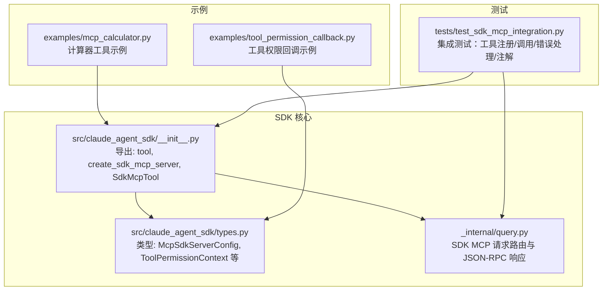
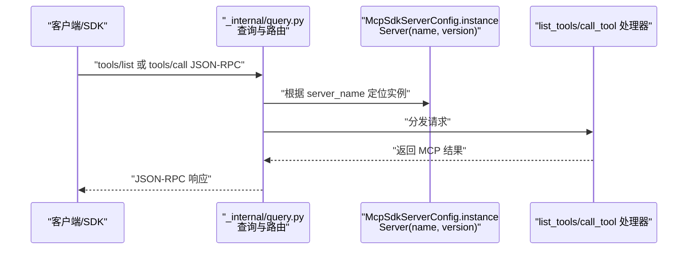
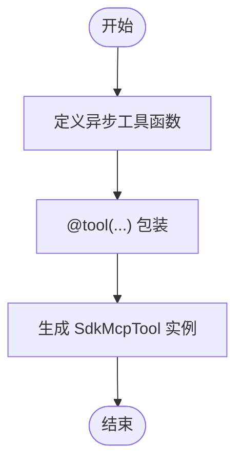
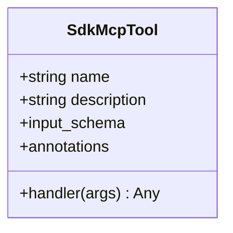
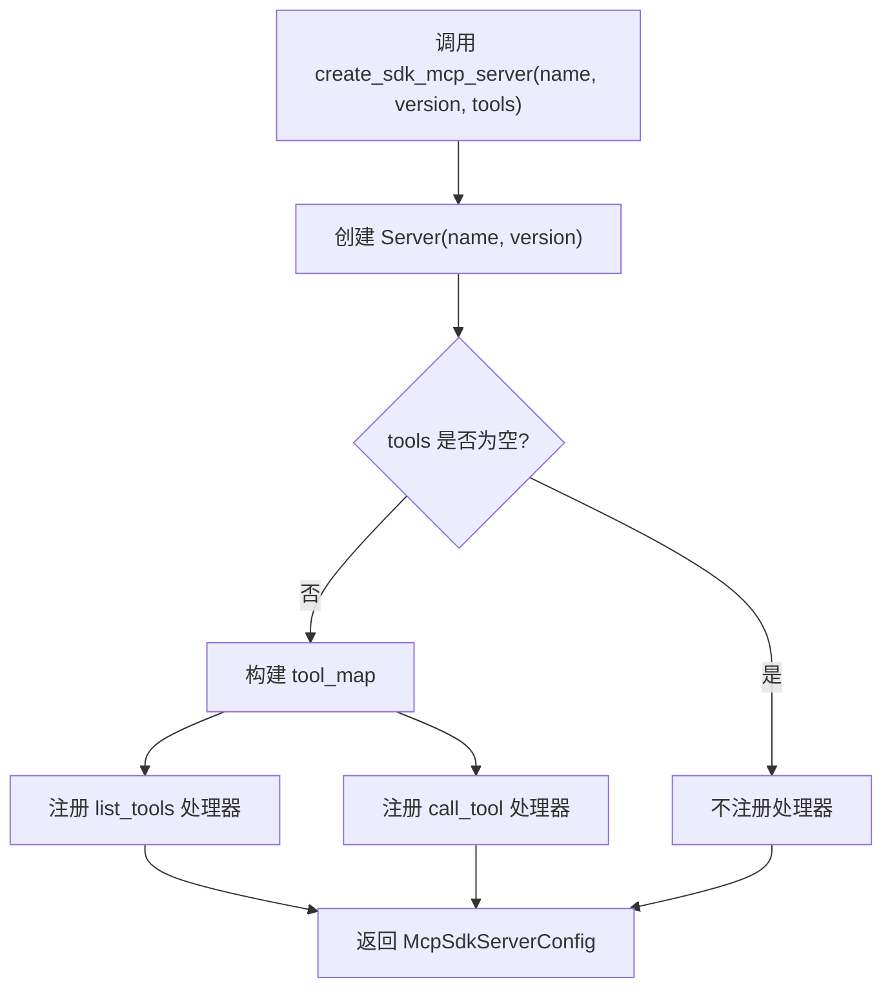
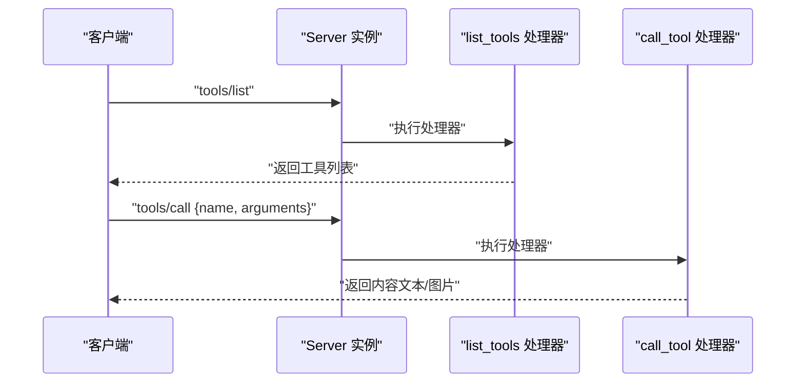
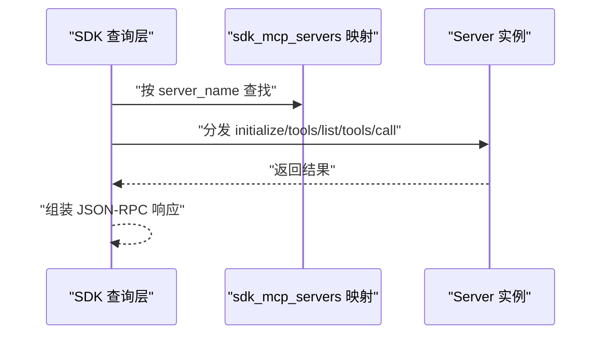
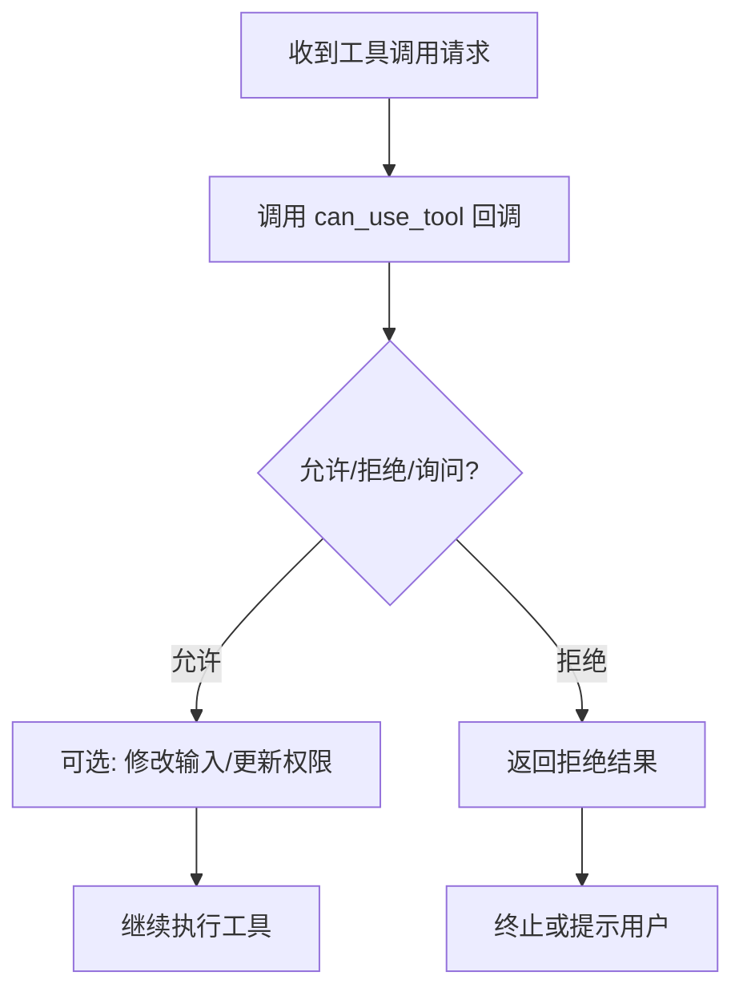
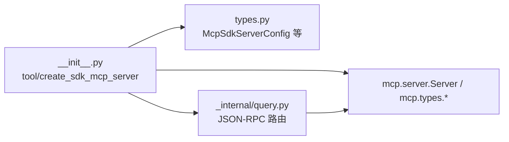

# MCP 服务器

<cite>
**本文引用的文件**
- [src/claude_agent_sdk/__init__.py](file://src/claude_agent_sdk/__init__.py)
- [src/claude_agent_sdk/types.py](file://src/claude_agent_sdk/types.py)
- [src/claude_agent_sdk/_internal/query.py](file://src/claude_agent_sdk/_internal/query.py)
- [examples/mcp_calculator.py](file://examples/mcp_calculator.py)
- [examples/tool_permission_callback.py](file://examples/tool_permission_callback.py)
- [tests/test_sdk_mcp_integration.py](file://tests/test_sdk_mcp_integration.py)
</cite>

## 目录
1. [简介](#简介)
2. [项目结构](#项目结构)
3. [核心组件](#核心组件)
4. [架构总览](#架构总览)
5. [详细组件分析](#详细组件分析)
6. [依赖关系分析](#依赖关系分析)
7. [性能考量](#性能考量)
8. [故障排查指南](#故障排查指南)
9. [结论](#结论)
10. [附录](#附录)

## 简介
本文件面向开发者，系统性讲解 Claude Agent SDK 的 MCP（Model Context Protocol）服务器能力，重点覆盖以下主题：
- 如何创建与配置 SDK 内置的 MCP 服务器：create_sdk_mcp_server() 的参数、行为与返回值
- 工具装饰器 @tool 的实现原理、使用语法与最佳实践
- SdkMcpTool 数据类的结构与用途
- 自定义工具的完整开发流程：函数定义、输入校验、错误处理、结果格式化
- 在同一进程内运行 MCP 服务器的优势：性能、调试与状态共享
- 实际示例：计算器工具与更复杂工具的开发思路
- 工具注册机制、工具发现与工具调用的内部流程
- 工具权限配置与安全考虑

## 项目结构
围绕 MCP 服务器功能的核心代码位于 SDK 主模块与类型定义中，并通过示例与测试进行验证。

**图表来源**
- [src/claude_agent_sdk/__init__.py:178-340](file://src/claude_agent_sdk/__init__.py#L178-L340)
- [src/claude_agent_sdk/types.py:520-719](file://src/claude_agent_sdk/types.py#L520-L719)
- [src/claude_agent_sdk/_internal/query.py:403-476](file://src/claude_agent_sdk/_internal/query.py#L403-L476)
- [examples/mcp_calculator.py:1-194](file://examples/mcp_calculator.py#L1-L194)
- [examples/tool_permission_callback.py:1-159](file://examples/tool_permission_callback.py#L1-L159)
- [tests/test_sdk_mcp_integration.py:1-382](file://tests/test_sdk_mcp_integration.py#L1-L382)

**章节来源**
- [src/claude_agent_sdk/__init__.py:178-340](file://src/claude_agent_sdk/__init__.py#L178-L340)
- [src/claude_agent_sdk/types.py:520-719](file://src/claude_agent_sdk/types.py#L520-L719)
- [src/claude_agent_sdk/_internal/query.py:403-476](file://src/claude_agent_sdk/_internal/query.py#L403-L476)
- [examples/mcp_calculator.py:1-194](file://examples/mcp_calculator.py#L1-L194)
- [examples/tool_permission_callback.py:1-159](file://examples/tool_permission_callback.py#L1-L159)
- [tests/test_sdk_mcp_integration.py:1-382](file://tests/test_sdk_mcp_integration.py#L1-L382)

## 核心组件
- SdkMcpTool：封装单个工具的元数据与处理器，供 create_sdk_mcp_server 注册到服务器。
- @tool 装饰器：将异步工具函数包装为 SdkMcpTool，支持输入模式（字典/TypedDict/JSON Schema）与可选注解。
- create_sdk_mcp_server(name, version, tools)：创建一个内置于应用进程中的 MCP 服务器，返回 McpSdkServerConfig，用于与 ClaudeAgentOptions 集成。
- 类型系统：McpSdkServerConfig、ToolPermissionContext、PermissionResult* 等，支撑权限控制与工具注解传递。

**章节来源**
- [src/claude_agent_sdk/__init__.py:100-176](file://src/claude_agent_sdk/__init__.py#L100-L176)
- [src/claude_agent_sdk/__init__.py:178-340](file://src/claude_agent_sdk/__init__.py#L178-L340)
- [src/claude_agent_sdk/types.py:520-719](file://src/claude_agent_sdk/types.py#L520-L719)

## 架构总览
SDK MCP 服务器在应用进程内直接运行，避免跨进程通信开销；SDK 查询层负责将 JSON-RPC 请求路由到对应服务器实例，再由服务器内部的 list_tools/call_tool 处理器执行工具逻辑。

**图表来源**
- [src/claude_agent_sdk/_internal/query.py:403-446](file://src/claude_agent_sdk/_internal/query.py#L403-L446)
- [src/claude_agent_sdk/__init__.py:250-340](file://src/claude_agent_sdk/__init__.py#L250-L340)

## 详细组件分析

### 组件一：工具装饰器 @tool
- 作用：将异步工具函数包装为 SdkMcpTool，声明工具名称、描述、输入模式与可选注解。
- 输入模式支持：
  - 字典映射（键为参数名，值为类型）
  - TypedDict（复杂结构）
  - JSON Schema 字典（全量校验）
- 返回：SdkMcpTool 实例，包含 handler（即被装饰的异步函数），供 create_sdk_mcp_server 注册。

**图表来源**
- [src/claude_agent_sdk/__init__.py:111-176](file://src/claude_agent_sdk/__init__.py#L111-L176)

**章节来源**
- [src/claude_agent_sdk/__init__.py:111-176](file://src/claude_agent_sdk/__init__.py#L111-L176)

### 组件二：SdkMcpTool 数据类
- 字段：
  - name：工具唯一标识
  - description：工具描述
  - input_schema：输入模式（字典/TypedDict/JSON Schema）
  - handler：异步处理器
  - annotations：工具注解（如只读、破坏性、开放世界等）
- 用途：作为 create_sdk_mcp_server 的工具清单，驱动工具发现与调用。

**图表来源**
- [src/claude_agent_sdk/__init__.py:100-109](file://src/claude_agent_sdk/__init__.py#L100-L109)

**章节来源**
- [src/claude_agent_sdk/__init__.py:100-109](file://src/claude_agent_sdk/__init__.py#L100-L109)

### 组件三：create_sdk_mcp_server()
- 参数
  - name：服务器唯一标识
  - version：版本字符串（仅信息用途）
  - tools：SdkMcpTool 列表（可为空）
- 行为
  - 创建 Server(name, version)
  - 若提供 tools，则构建 tool_map 并注册：
    - list_tools：将 SdkMcpTool 转换为 MCP Tool（含 inputSchema 与 annotations）
    - call_tool：按名称查找工具并调用其 handler，将返回结果转换为 MCP 文本/图片内容
- 返回
  - McpSdkServerConfig：包含 type="sdk"、name 与 instance（Server）

**图表来源**
- [src/claude_agent_sdk/__init__.py:178-340](file://src/claude_agent_sdk/__init__.py#L178-L340)

**章节来源**
- [src/claude_agent_sdk/__init__.py:178-340](file://src/claude_agent_sdk/__init__.py#L178-L340)

### 组件四：工具注册机制、工具发现与工具调用
- 注册机制
  - list_tools：遍历 tools，将 input_schema 转换为 JSON Schema（若为简单字典则自动补全 required 与类型），并附带 annotations
  - call_tool：按 name 查找工具，调用 handler(arguments)，将结果中的 content 转换为 MCP 文本/图片内容
- 工具发现
  - 通过 tools/list 请求返回工具列表，包含 name、description、inputSchema、annotations
- 工具调用
  - 通过 tools/call 请求执行具体工具，返回文本或图片内容

**图表来源**
- [src/claude_agent_sdk/__init__.py:261-337](file://src/claude_agent_sdk/__init__.py#L261-L337)

**章节来源**
- [src/claude_agent_sdk/__init__.py:261-337](file://src/claude_agent_sdk/__init__.py#L261-L337)

### 组件五：SDK 查询层对 SDK MCP 的路由与响应
- 当 SDK 接收到 JSON-RPC 请求时，会根据 server_name 定位 sdk_mcp_servers 中的 Server 实例
- 对 initialize、tools/list、tools/call 等方法进行处理，并将结果以 JSON-RPC 形式返回
- tools/list 的响应中包含工具的 annotations（若存在）

**图表来源**
- [src/claude_agent_sdk/_internal/query.py:403-476](file://src/claude_agent_sdk/_internal/query.py#L403-L476)

**章节来源**
- [src/claude_agent_sdk/_internal/query.py:403-476](file://src/claude_agent_sdk/_internal/query.py#L403-L476)

### 组件六：权限控制与安全
- 工具权限回调
  - 可通过 can_use_tool 回调控制是否允许某工具、是否修改输入、是否中断
  - 支持 PermissionResultAllow/PermissionResultDeny，以及 updated_input、updated_permissions
- 权限更新
  - PermissionUpdate 支持添加/替换/移除规则、设置模式、增删目录等
- 示例
  - 示例脚本演示了基于工具类型与输入的安全策略，以及对危险命令的拦截与重定向

**图表来源**
- [src/claude_agent_sdk/types.py:68-157](file://src/claude_agent_sdk/types.py#L68-L157)
- [examples/tool_permission_callback.py:26-94](file://examples/tool_permission_callback.py#L26-L94)

**章节来源**
- [src/claude_agent_sdk/types.py:68-157](file://src/claude_agent_sdk/types.py#L68-L157)
- [examples/tool_permission_callback.py:1-159](file://examples/tool_permission_callback.py#L1-L159)

### 组件七：工具注解与 JSON-RPC 响应
- 注解存储与传播
  - SdkMcpTool.annotations 保存只读、破坏性、幂等等提示
  - list_tools 与 JSON-RPC tools/list 响应均包含 annotations
- 测试验证
  - 集成测试覆盖注解的存储、传播与 JSON-RPC 输出

**章节来源**
- [tests/test_sdk_mcp_integration.py:270-381](file://tests/test_sdk_mcp_integration.py#L270-L381)
- [src/claude_agent_sdk/__init__.py:298-306](file://src/claude_agent_sdk/__init__.py#L298-L306)

## 依赖关系分析
- 内部依赖
  - create_sdk_mcp_server 依赖 mcp.server.Server 与 mcp.types.Tool、TextContent、ImageContent
  - _internal/query.py 依赖 mcp.types.ListToolsRequest/CallToolRequest 与 ServerResult
- 类型依赖
  - types.py 提供 McpSdkServerConfig、ToolPermissionContext、PermissionResult* 等类型
- 外部依赖
  - mcp 库（Server、Types）用于 MCP 协议处理

**图表来源**
- [src/claude_agent_sdk/__init__.py:250-251](file://src/claude_agent_sdk/__init__.py#L250-L251)
- [src/claude_agent_sdk/_internal/query.py:403-446](file://src/claude_agent_sdk/_internal/query.py#L403-L446)
- [src/claude_agent_sdk/types.py:520-525](file://src/claude_agent_sdk/types.py#L520-L525)

**章节来源**
- [src/claude_agent_sdk/__init__.py:250-251](file://src/claude_agent_sdk/__init__.py#L250-L251)
- [src/claude_agent_sdk/_internal/query.py:403-446](file://src/claude_agent_sdk/_internal/query.py#L403-L446)
- [src/claude_agent_sdk/types.py:520-525](file://src/claude_agent_sdk/types.py#L520-L525)

## 性能考量
- 同进程运行优势
  - 无 IPC 开销，工具调用延迟更低
  - 直接访问应用状态，无需序列化/反序列化
  - 更易调试，断点与日志在同一进程内
- 部署简化
  - 单进程部署，减少外部进程管理复杂度

**章节来源**
- [src/claude_agent_sdk/__init__.py:183-189](file://src/claude_agent_sdk/__init__.py#L183-L189)

## 故障排查指南
- 工具未找到
  - 现象：tools/call 抛出“工具不存在”错误
  - 排查：确认 tools 列表与工具名称一致，且已传入 create_sdk_mcp_server
- 错误处理
  - 现象：工具抛异常但未中断会话
  - 排查：SDK 会捕获异常并返回 isError 与错误内容；检查工具 handler 是否正确返回内容结构
- 注解缺失
  - 现象：tools/list 响应缺少 annotations
  - 排查：确认 SdkMcpTool.annotations 是否设置，以及 list_tools 与 JSON-RPC 路由是否正确传播

**章节来源**
- [tests/test_sdk_mcp_integration.py:120-149](file://tests/test_sdk_mcp_integration.py#L120-L149)
- [src/claude_agent_sdk/_internal/query.py:448-476](file://src/claude_agent_sdk/_internal/query.py#L448-L476)

## 结论
通过 SDK 内置的 MCP 服务器，开发者可以在同一进程内高效地暴露自定义工具，借助装饰器与类型系统快速完成工具定义、注册与调用；配合权限回调与注解机制，可在保证安全的前提下灵活控制工具使用。示例与测试覆盖了从基础计算器到复杂权限策略的多种场景，便于快速上手与扩展。

## 附录

### 使用指南：自定义工具开发流程
- 步骤
  - 使用 @tool 定义工具，声明 name、description、input_schema 与可选 annotations
  - 编写异步 handler，接收参数字典，返回包含 content 的字典（可含文本/图片）
  - 可选：在 handler 中进行输入校验、错误处理与结果格式化
  - 调用 create_sdk_mcp_server 创建服务器，传入 tools 列表
  - 将返回的 McpSdkServerConfig 配置到 ClaudeAgentOptions.mcp_servers 中，并在 allowed_tools 中授权相应工具
- 最佳实践
  - input_schema 使用字典时建议明确类型与必填字段
  - 错误通过返回 is_error 与文本内容表达，避免抛出未捕获异常
  - 对敏感操作使用权限回调进行二次确认或输入改写

**章节来源**
- [src/claude_agent_sdk/__init__.py:111-176](file://src/claude_agent_sdk/__init__.py#L111-L176)
- [src/claude_agent_sdk/__init__.py:178-340](file://src/claude_agent_sdk/__init__.py#L178-L340)
- [examples/mcp_calculator.py:24-97](file://examples/mcp_calculator.py#L24-L97)

### 实际示例：计算器工具
- 示例文件展示了多个数学工具的定义与使用，包括加减乘除、平方根、幂运算等
- 通过 create_sdk_mcp_server 创建服务器，并在 ClaudeAgentOptions 中启用相应工具

**章节来源**
- [examples/mcp_calculator.py:1-194](file://examples/mcp_calculator.py#L1-L194)

### 集成测试要点
- 工具注册与调用：验证 list_tools 与 call_tool 的行为
- 错误处理：验证异常被捕获并返回错误结果
- 图像内容：验证工具返回图片内容的正确性
- 工具注解：验证 annotations 的存储与 JSON-RPC 响应传播

**章节来源**
- [tests/test_sdk_mcp_integration.py:21-98](file://tests/test_sdk_mcp_integration.py#L21-L98)
- [tests/test_sdk_mcp_integration.py:120-149](file://tests/test_sdk_mcp_integration.py#L120-L149)
- [tests/test_sdk_mcp_integration.py:200-267](file://tests/test_sdk_mcp_integration.py#L200-L267)
- [tests/test_sdk_mcp_integration.py:270-381](file://tests/test_sdk_mcp_integration.py#L270-L381)