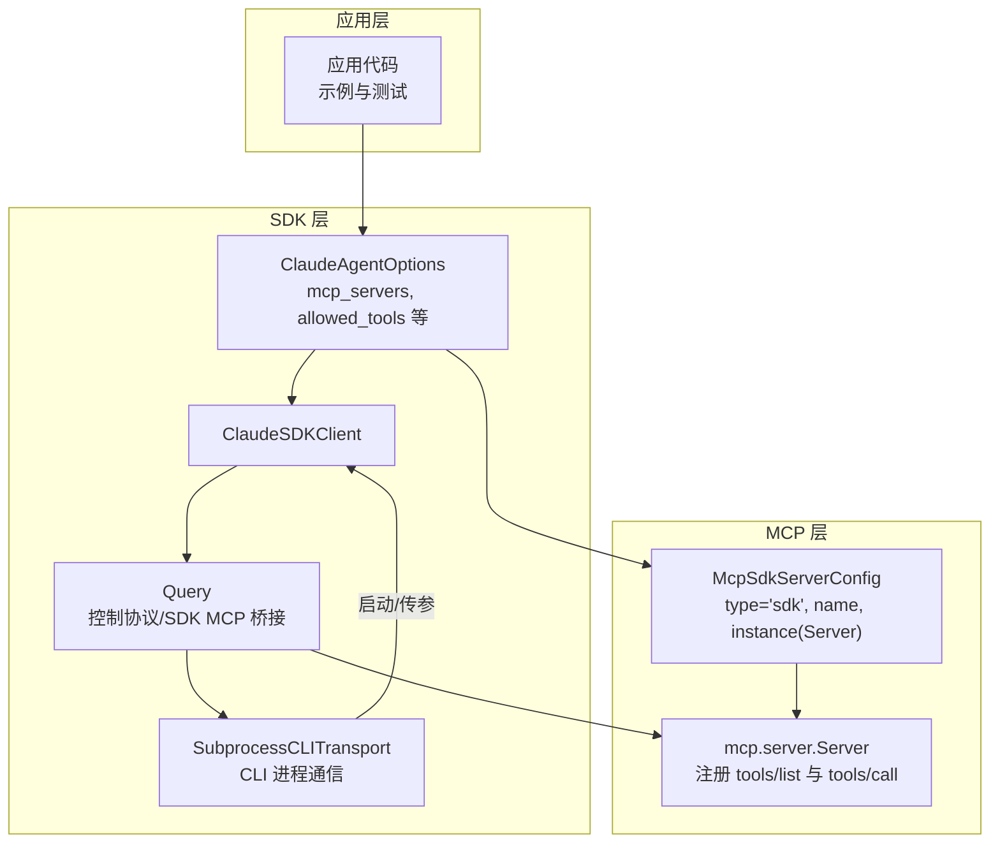
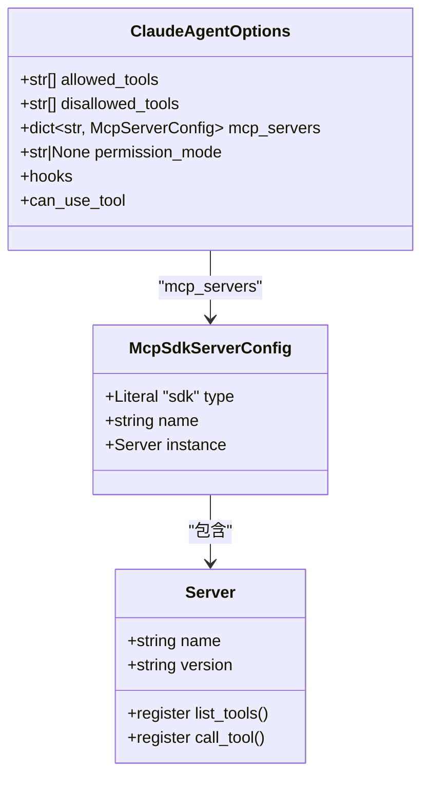
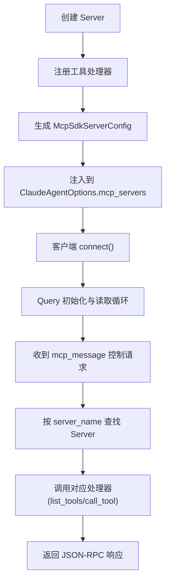
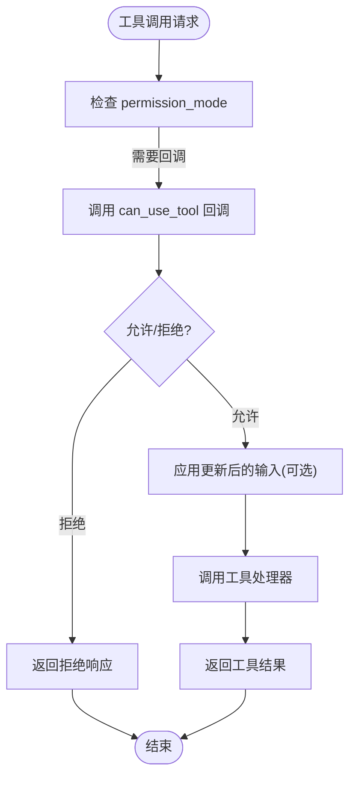
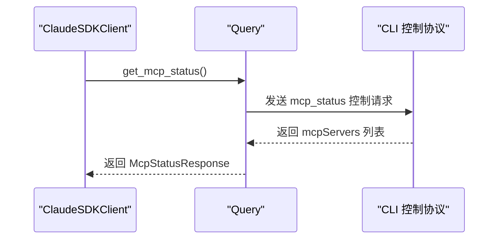
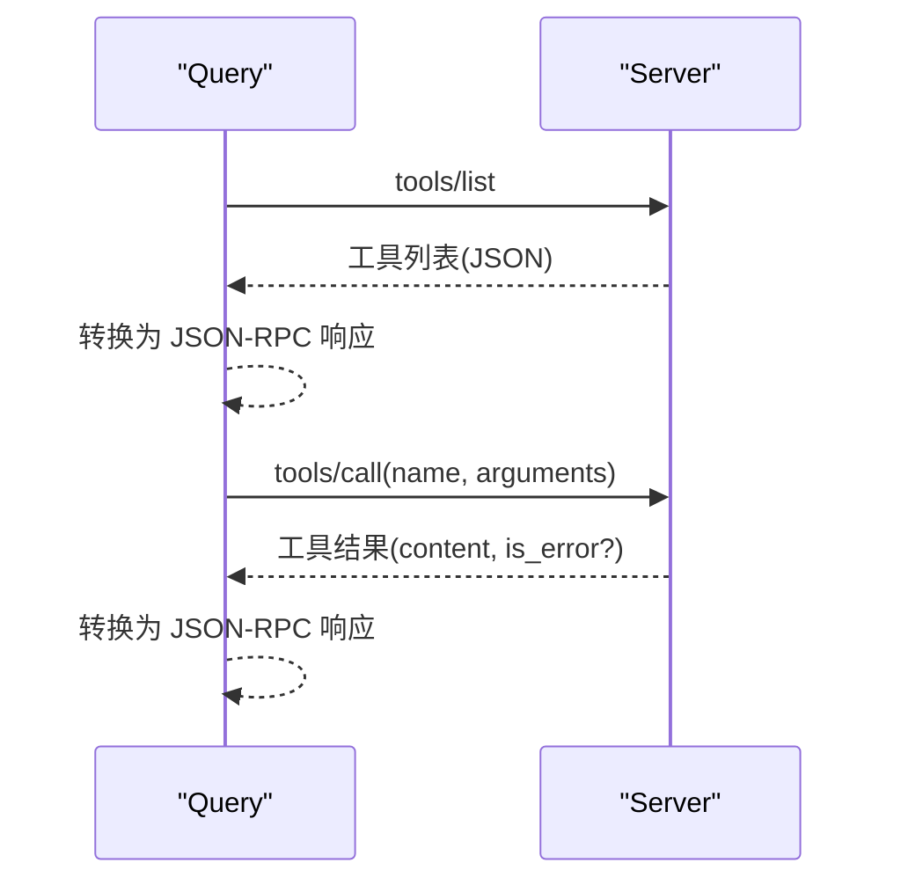
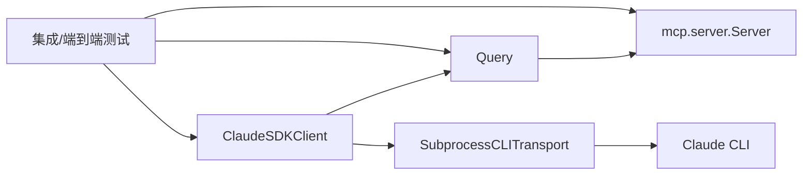

# MCP 集成与配置

<cite>
**本文引用的文件**
- [types.py](file://src/claude_agent_sdk/types.py)
- [client.py](file://src/claude_agent_sdk/client.py)
- [__init__.py](file://src/claude_agent_sdk/__init__.py)
- [query.py](file://src/claude_agent_sdk/_internal/query.py)
- [subprocess_cli.py](file://src/claude_agent_sdk/_internal/transport/subprocess_cli.py)
- [mcp_calculator.py](file://examples/mcp_calculator.py)
- [test_sdk_mcp_integration.py](file://tests/test_sdk_mcp_integration.py)
- [test_sdk_mcp_tools.py](file://e2e-tests/test_sdk_mcp_tools.py)
- [tool_permission_callback.py](file://examples/tool_permission_callback.py)
</cite>

## 目录
1. [简介](#简介)
2. [项目结构](#项目结构)
3. [核心组件](#核心组件)
4. [架构总览](#架构总览)
5. [详细组件分析](#详细组件分析)
6. [依赖关系分析](#依赖关系分析)
7. [性能考虑](#性能考虑)
8. [故障排查指南](#故障排查指南)
9. [结论](#结论)
10. [附录](#附录)

## 简介
本文件面向希望在 Claude Agent SDK 中集成 MCP（Model Context Protocol）服务器的开发者，系统性阐述以下内容：
- McpSdkServerConfig 数据结构与配置项
- 如何将 SDK MCP 服务器集成到 ClaudeAgentOptions 的 mcp_servers 字典中，并通过 allowed_tools 设置工具权限
- 服务器实例与配置对象的关系及生命周期管理
- 完整集成示例：从服务器创建到代理使用的端到端流程
- 服务器状态监控、连接状态检查与错误处理机制
- 工具调用内部流程：参数传递、结果返回与异常处理
- 性能优化建议与调试技巧
- 集成测试方法与验证步骤

## 项目结构
本项目采用分层设计：
- 类型与配置层：定义 ClaudeAgentOptions、MCP 配置类型与状态模型
- 客户端层：ClaudeSDKClient 提供连接、消息收发、控制协议请求等能力
- 内部协议层：Query 负责控制协议编排、SDK MCP 请求桥接
- 传输层：SubprocessCLITransport 将配置与消息转发给 Claude CLI
- 示例与测试：演示工具权限回调、SDK MCP 服务器创建与工具执行



图表来源
- [client.py:94-180](file://src/claude_agent_sdk/client.py#L94-L180)
- [query.py:53-118](file://src/claude_agent_sdk/_internal/query.py#L53-L118)
- [subprocess_cli.py:195-289](file://src/claude_agent_sdk/_internal/transport/subprocess_cli.py#L195-L289)
- [__init__.py:178-341](file://src/claude_agent_sdk/__init__.py#L178-L341)
- [types.py:493-530](file://src/claude_agent_sdk/types.py#L493-L530)

章节来源
- [client.py:94-180](file://src/claude_agent_sdk/client.py#L94-L180)
- [query.py:53-118](file://src/claude_agent_sdk/_internal/query.py#L53-L118)
- [subprocess_cli.py:195-289](file://src/claude_agent_sdk/_internal/transport/subprocess_cli.py#L195-L289)
- [__init__.py:178-341](file://src/claude_agent_sdk/__init__.py#L178-L341)
- [types.py:493-530](file://src/claude_agent_sdk/types.py#L493-L530)

## 核心组件
- McpSdkServerConfig：用于在 ClaudeAgentOptions.mcp_servers 中声明 SDK MCP 服务器，包含 type='sdk'、name 与 instance（mcp.server.Server 实例）
- ClaudeAgentOptions：主配置对象，支持 mcp_servers 字典、allowed_tools/disallowed_tools、permission_mode、hooks 等
- ClaudeSDKClient：负责连接 CLI、初始化控制协议、发送/接收消息、查询 MCP 状态、重连与启停服务器
- Query：控制协议与 SDK MCP 请求的桥接器，负责将 JSON-RPC 请求路由到 SDK MCP 服务器并返回结果
- SubprocessCLITransport：将 mcp_servers 配置序列化并通过 CLI 参数传入，建立双向通信通道
- 工具装饰器与 SDK MCP 服务器创建：@tool 定义工具；create_sdk_mcp_server 创建 Server 并注册 list_tools/call_tool 处理器

章节来源
- [types.py:493-530](file://src/claude_agent_sdk/types.py#L493-L530)
- [types.py:1029-1100](file://src/claude_agent_sdk/types.py#L1029-L1100)
- [client.py:94-180](file://src/claude_agent_sdk/client.py#L94-L180)
- [query.py:394-531](file://src/claude_agent_sdk/_internal/query.py#L394-L531)
- [subprocess_cli.py:255-289](file://src/claude_agent_sdk/_internal/transport/subprocess_cli.py#L255-L289)
- [__init__.py:178-341](file://src/claude_agent_sdk/__init__.py#L178-L341)

## 架构总览
下图展示了 SDK MCP 服务器在整体架构中的位置与交互路径。

```mermaid
sequenceDiagram
participant App as "应用"
participant Opt as "ClaudeAgentOptions"
participant Cli as "ClaudeSDKClient"
participant Q as "Query"
participant T as "SubprocessCLITransport"
participant Srv as "mcp.server.Server"
App->>Opt : 配置 mcp_servers 与 allowed_tools
App->>Cli : 初始化客户端并 connect()
Cli->>Q : 构造 Query(含 sdk_mcp_servers)
Cli->>T : 启动 CLI 进程并传入 mcp_servers
Cli->>Q : start() 与 initialize()
Note over Q,Srv : Query 在内存中桥接 JSON-RPC 到 Server
Q->>Srv : tools/list 或 tools/call
Srv-->>Q : 返回工具定义或执行结果
Q-->>Cli : 控制响应/消息流
Cli-->>App : 接收消息/状态查询
```

图表来源
- [client.py:94-180](file://src/claude_agent_sdk/client.py#L94-L180)
- [query.py:394-531](file://src/claude_agent_sdk/_internal/query.py#L394-L531)
- [subprocess_cli.py:255-289](file://src/claude_agent_sdk/_internal/transport/subprocess_cli.py#L255-L289)
- [__init__.py:178-341](file://src/claude_agent_sdk/__init__.py#L178-L341)

## 详细组件分析

### McpSdkServerConfig 与 ClaudeAgentOptions 集成
- McpSdkServerConfig 结构要点
  - type: 固定为 "sdk"
  - name: 服务器名称，用于在 mcp_servers 中标识
  - instance: mcp.server.Server 实例，包含工具处理器
- 在 ClaudeAgentOptions 中使用
  - mcp_servers: 字典，键为服务器名，值为 McpServerConfig（type='sdk' 时为 McpSdkServerConfig）
  - allowed_tools/disallowed_tools: 控制工具可用性
  - permission_mode: 权限模式（如 default、acceptEdits、bypassPermissions 等）



图表来源
- [types.py:1029-1100](file://src/claude_agent_sdk/types.py#L1029-L1100)
- [types.py:493-530](file://src/claude_agent_sdk/types.py#L493-L530)
- [__init__.py:178-341](file://src/claude_agent_sdk/__init__.py#L178-L341)

章节来源
- [types.py:1029-1100](file://src/claude_agent_sdk/types.py#L1029-L1100)
- [types.py:493-530](file://src/claude_agent_sdk/types.py#L493-L530)
- [__init__.py:178-341](file://src/claude_agent_sdk/__init__.py#L178-L341)

### 服务器实例与配置对象的关系与生命周期
- 生命周期
  - 创建：通过 create_sdk_mcp_server(name, version, tools) 返回 McpSdkServerConfig
  - 注册：在 Server 上注册 list_tools 与 call_tool 处理器
  - 使用：Query 在内存中桥接 JSON-RPC 请求到 Server
  - 关闭：客户端断开连接时，Query 与 Transport 资源释放
- 关系
  - McpSdkServerConfig 仅包含可序列化的元数据与 Server 实例
  - Query 持有 sdk_mcp_servers 映射，按 server_name 路由请求



图表来源
- [__init__.py:178-341](file://src/claude_agent_sdk/__init__.py#L178-L341)
- [query.py:394-531](file://src/claude_agent_sdk/_internal/query.py#L394-L531)
- [client.py:143-180](file://src/claude_agent_sdk/client.py#L143-L180)

章节来源
- [__init__.py:178-341](file://src/claude_agent_sdk/__init__.py#L178-L341)
- [query.py:394-531](file://src/claude_agent_sdk/_internal/query.py#L394-L531)
- [client.py:143-180](file://src/claude_agent_sdk/client.py#L143-L180)

### 工具权限与 allowed_tools 设置
- allowed_tools：白名单，仅允许指定工具被调用
- disallowed_tools：黑名单，阻止特定工具
- permission_mode：权限模式影响是否触发 can_use_tool 回调
- can_use_tool：异步回调，可动态决定允许/拒绝并修改输入



图表来源
- [client.py:112-131](file://src/claude_agent_sdk/client.py#L112-L131)
- [query.py:245-286](file://src/claude_agent_sdk/_internal/query.py#L245-L286)
- [types.py:1029-1100](file://src/claude_agent_sdk/types.py#L1029-L1100)

章节来源
- [client.py:112-131](file://src/claude_agent_sdk/client.py#L112-L131)
- [query.py:245-286](file://src/claude_agent_sdk/_internal/query.py#L245-L286)
- [types.py:1029-1100](file://src/claude_agent_sdk/types.py#L1029-L1100)

### 服务器状态监控与连接状态检查
- 查询状态：ClaudeSDKClient.get_mcp_status() 返回 McpStatusResponse，包含 mcpServers 列表
- 状态字段：name、status、serverInfo、error、config、scope、tools
- 支持操作：reconnect_mcp_server、toggle_mcp_server



图表来源
- [client.py:385-416](file://src/claude_agent_sdk/client.py#L385-L416)
- [query.py:532-534](file://src/claude_agent_sdk/_internal/query.py#L532-L534)

章节来源
- [client.py:385-416](file://src/claude_agent_sdk/client.py#L385-L416)
- [query.py:532-534](file://src/claude_agent_sdk/_internal/query.py#L532-L534)

### 工具调用内部流程（参数传递、结果返回、异常处理）
- JSON-RPC 到 Server 的桥接：Query._handle_sdk_mcp_request 将 JSON-RPC 方法映射到 Server 的处理器
- tools/list：返回工具清单（含 inputSchema 与 annotations）
- tools/call：执行工具，返回 content（文本/图片），可标记 is_error
- 异常处理：捕获异常并以 JSON-RPC 错误格式返回



图表来源
- [query.py:448-510](file://src/claude_agent_sdk/_internal/query.py#L448-L510)
- [__init__.py:256-340](file://src/claude_agent_sdk/__init__.py#L256-L340)

章节来源
- [query.py:448-510](file://src/claude_agent_sdk/_internal/query.py#L448-L510)
- [__init__.py:256-340](file://src/claude_agent_sdk/__init__.py#L256-L340)

### 完整集成示例（计算器）
- 创建 SDK MCP 服务器：使用 @tool 定义工具，create_sdk_mcp_server 组装 Server
- 配置 ClaudeAgentOptions：mcp_servers 指向服务器，allowed_tools 指定工具名
- 使用 ClaudeSDKClient：connect() 后 query() 发送提示，receive_response() 获取结果

```mermaid
sequenceDiagram
participant App as "应用"
participant Calc as "Calculator Server"
participant Opt as "ClaudeAgentOptions"
participant Cli as "ClaudeSDKClient"
App->>Calc : 定义工具并创建 Server
App->>Opt : mcp_servers={'calc' : server}, allowed_tools=工具名列表
App->>Cli : connect() + query() + receive_response()
Cli-->>App : 返回消息流与最终结果
```

图表来源
- [mcp_calculator.py:138-194](file://examples/mcp_calculator.py#L138-L194)
- [__init__.py:178-341](file://src/claude_agent_sdk/__init__.py#L178-L341)

章节来源
- [mcp_calculator.py:138-194](file://examples/mcp_calculator.py#L138-L194)
- [__init__.py:178-341](file://src/claude_agent_sdk/__init__.py#L178-L341)

## 依赖关系分析
- ClaudeSDKClient 依赖 Query 与 SubprocessCLITransport
- Query 依赖 mcp.server.Server（通过 SDK MCP 配置注入）
- SubprocessCLITransport 将 mcp_servers 序列化为 CLI 参数传入
- 测试覆盖了 SDK MCP 服务器处理器注册、工具执行、错误处理与注解传播



图表来源
- [client.py:94-180](file://src/claude_agent_sdk/client.py#L94-L180)
- [query.py:394-531](file://src/claude_agent_sdk/_internal/query.py#L394-L531)
- [subprocess_cli.py:255-289](file://src/claude_agent_sdk/_internal/transport/subprocess_cli.py#L255-L289)
- [test_sdk_mcp_integration.py:21-98](file://tests/test_sdk_mcp_integration.py#L21-L98)
- [test_sdk_mcp_tools.py:19-50](file://e2e-tests/test_sdk_mcp_tools.py#L19-L50)

章节来源
- [client.py:94-180](file://src/claude_agent_sdk/client.py#L94-L180)
- [query.py:394-531](file://src/claude_agent_sdk/_internal/query.py#L394-L531)
- [subprocess_cli.py:255-289](file://src/claude_agent_sdk/_internal/transport/subprocess_cli.py#L255-L289)
- [test_sdk_mcp_integration.py:21-98](file://tests/test_sdk_mcp_integration.py#L21-L98)
- [test_sdk_mcp_tools.py:19-50](file://e2e-tests/test_sdk_mcp_tools.py#L19-L50)

## 性能考虑
- SDK MCP 服务器运行于同一进程，避免 IPC 开销，适合高频工具调用场景
- 合理设置初始化超时（CLAUDE_CODE_STREAM_CLOSE_TIMEOUT）以适配外部 MCP 服务器启动时间
- 使用 allowed_tools 精准授权，减少不必要的工具枚举与权限协商
- 对工具输入进行最小化 schema 定义，降低序列化与校验成本
- 在高并发场景下，注意工具处理器的异步实现与资源竞争

## 故障排查指南
- 服务器未找到：确认 mcp_servers 中 server_name 与 Query 路由一致
- 工具未执行：检查 allowed_tools 是否包含工具全名（mcp__<server>__<tool>）
- 权限问题：设置 permission_mode 或实现 can_use_tool 回调
- 状态异常：使用 get_mcp_status() 检查 status、error、tools 等字段
- 重连与启停：toggle_mcp_server 与 reconnect_mcp_server 可用于恢复

章节来源
- [query.py:410-418](file://src/claude_agent_sdk/_internal/query.py#L410-L418)
- [client.py:314-360](file://src/claude_agent_sdk/client.py#L314-L360)
- [client.py:385-416](file://src/claude_agent_sdk/client.py#L385-L416)

## 结论
通过 McpSdkServerConfig 与 ClaudeAgentOptions 的组合，开发者可以将 SDK MCP 服务器无缝集成到 Claude Agent SDK 中。该方案具备高性能、易部署与强扩展性的优势。配合完善的权限控制、状态监控与错误处理机制，可在生产环境中稳定运行。

## 附录

### 集成步骤清单
- 使用 @tool 定义工具函数
- 调用 create_sdk_mcp_server 创建服务器配置
- 在 ClaudeAgentOptions.mcp_servers 中注册服务器
- 配置 allowed_tools 与 permission_mode
- 通过 ClaudeSDKClient.connect()/query()/receive_response() 完成交互
- 使用 get_mcp_status() 监控状态，必要时 toggle/reconnect

章节来源
- [mcp_calculator.py:138-194](file://examples/mcp_calculator.py#L138-L194)
- [client.py:94-180](file://src/claude_agent_sdk/client.py#L94-L180)
- [client.py:385-416](file://src/claude_agent_sdk/client.py#L385-L416)

### 测试与验证
- 单元测试：验证 SDK MCP 服务器处理器注册、工具执行与错误处理
- 端到端测试：验证工具权限生效、多工具顺序调用与无权限场景
- 权限回调示例：参考工具权限回调示例，了解 can_use_tool 的使用方式

章节来源
- [test_sdk_mcp_integration.py:21-98](file://tests/test_sdk_mcp_integration.py#L21-L98)
- [test_sdk_mcp_tools.py:19-50](file://e2e-tests/test_sdk_mcp_tools.py#L19-L50)
- [tool_permission_callback.py:26-94](file://examples/tool_permission_callback.py#L26-L94)