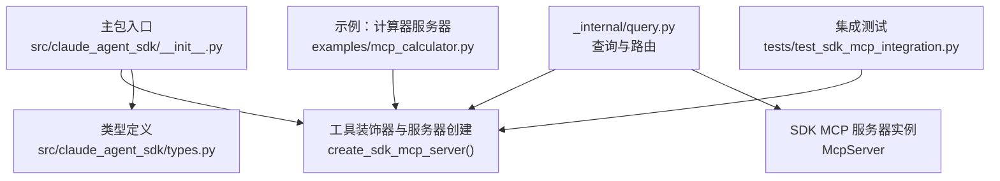
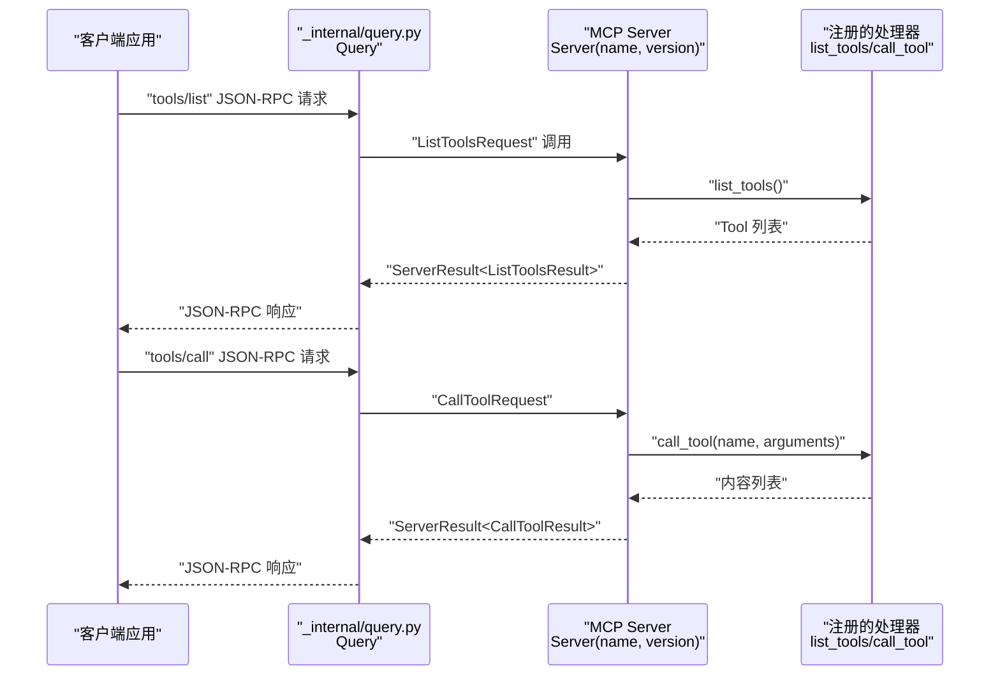
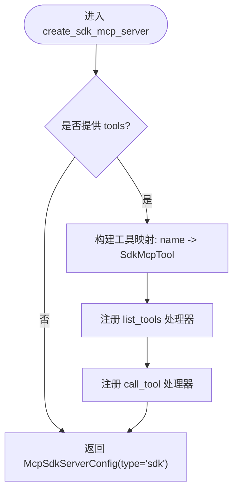
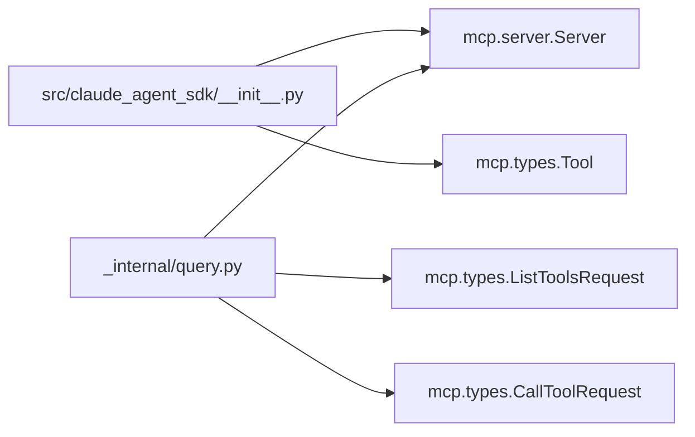

# SDK MCP 服务器

<cite>
**本文引用的文件**
- [src/claude_agent_sdk/__init__.py](file://src/claude_agent_sdk/__init__.py)
- [src/claude_agent_sdk/types.py](file://src/claude_agent_sdk/types.py)
- [src/claude_agent_sdk/_internal/query.py](file://src/claude_agent_sdk/_internal/query.py)
- [examples/mcp_calculator.py](file://examples/mcp_calculator.py)
- [tests/test_sdk_mcp_integration.py](file://tests/test_sdk_mcp_integration.py)
- [src/claude_agent_sdk/_version.py](file://src/claude_agent_sdk/_version.py)
- [src/claude_agent_sdk/_errors.py](file://src/claude_agent_sdk/_errors.py)
</cite>

## 目录
1. [简介](#简介)
2. [项目结构](#项目结构)
3. [核心组件](#核心组件)
4. [架构总览](#架构总览)
5. [详细组件分析](#详细组件分析)
6. [依赖分析](#依赖分析)
7. [性能考量](#性能考量)
8. [故障排除指南](#故障排除指南)
9. [结论](#结论)
10. [附录](#附录)

## 简介
本文件面向 SDK MCP 服务器的使用者与维护者，系统性阐述 create_sdk_mcp_server() 的实现原理、参数配置与使用方法；详解服务器创建过程中的关键步骤：Server 实例初始化、工具注册机制、list_tools 与 call_tool 处理器的实现；解释服务器运行在同一进程中的优势（性能、调试、状态共享）；提供完整配置示例（计算器服务器、数据存储服务器等）；说明生命周期管理与自动清理机制；涵盖版本控制、名称标识与元数据管理；最后给出故障排除与常见问题解决方案。

## 项目结构
SDK MCP 服务器能力由以下模块协同实现：
- 入口与工具定义：在主包中导出工具装饰器与服务器创建函数，并封装类型与错误信息。
- 类型与配置：定义 MCP 服务器配置类型、工具注解、状态响应等。
- 查询与路由：在内部查询类中对接 SDK MCP 服务器，处理 JSON-RPC 请求到 MCP Server 的映射。
- 示例与测试：提供计算器示例与集成测试，验证工具注册、处理器行为与混合服务器场景。

图表来源
- [src/claude_agent_sdk/__init__.py:178-340](file://src/claude_agent_sdk/__init__.py#L178-L340)
- [src/claude_agent_sdk/types.py:519-529](file://src/claude_agent_sdk/types.py#L519-L529)
- [src/claude_agent_sdk/_internal/query.py:420-476](file://src/claude_agent_sdk/_internal/query.py#L420-L476)
- [examples/mcp_calculator.py:143-154](file://examples/mcp_calculator.py#L143-L154)
- [tests/test_sdk_mcp_integration.py:39-98](file://tests/test_sdk_mcp_integration.py#L39-L98)

章节来源
- [src/claude_agent_sdk/__init__.py:178-340](file://src/claude_agent_sdk/__init__.py#L178-L340)
- [src/claude_agent_sdk/types.py:519-529](file://src/claude_agent_sdk/types.py#L519-L529)
- [src/claude_agent_sdk/_internal/query.py:420-476](file://src/claude_agent_sdk/_internal/query.py#L420-L476)
- [examples/mcp_calculator.py:143-154](file://examples/mcp_calculator.py#L143-L154)
- [tests/test_sdk_mcp_integration.py:39-98](file://tests/test_sdk_mcp_integration.py#L39-L98)

## 核心组件
- 工具装饰器：用于声明工具名称、描述、输入模式与处理器函数，返回 SdkMcpTool。
- 服务器创建函数：创建 MCP Server 实例，注册 list_tools 与 call_tool 处理器，并返回 McpSdkServerConfig。
- 类型系统：定义 McpSdkServerConfig、McpServerConfig、McpToolAnnotations 等类型，支撑配置与状态。
- 查询与路由：在内部查询类中将 JSON-RPC 请求映射到 MCP Server 的 request_handlers，处理 tools/list 与 tools/call。

章节来源
- [src/claude_agent_sdk/__init__.py:100-176](file://src/claude_agent_sdk/__init__.py#L100-L176)
- [src/claude_agent_sdk/__init__.py:178-340](file://src/claude_agent_sdk/__init__.py#L178-L340)
- [src/claude_agent_sdk/types.py:519-529](file://src/claude_agent_sdk/types.py#L519-L529)
- [src/claude_agent_sdk/_internal/query.py:420-476](file://src/claude_agent_sdk/_internal/query.py#L420-L476)

## 架构总览
SDK MCP 服务器以“同进程内嵌”方式运行，客户端通过 JSON-RPC 与 SDK 查询层交互，查询层再将请求路由至 MCP Server 的 request_handlers，完成工具列表与调用。

图表来源
- [src/claude_agent_sdk/_internal/query.py:420-476](file://src/claude_agent_sdk/_internal/query.py#L420-L476)
- [src/claude_agent_sdk/__init__.py:250-340](file://src/claude_agent_sdk/__init__.py#L250-L340)

## 详细组件分析

### create_sdk_mcp_server() 实现与参数
- 功能概述：创建一个在当前进程内运行的 MCP 服务器，避免 IPC 开销，便于调试与状态共享。
- 参数说明：
  - name：服务器唯一标识，用于在 mcp_servers 配置中引用。
  - version：服务器版本字符串，用于元数据与状态报告。
  - tools：SdkMcpTool 列表，每个工具包含名称、描述、输入模式与异步处理器。
- 返回值：McpSdkServerConfig，包含 type、name 与 instance（MCP Server 实例），供 ClaudeAgentOptions 使用。

章节来源
- [src/claude_agent_sdk/__init__.py:178-249](file://src/claude_agent_sdk/__init__.py#L178-L249)

### Server 实例初始化与工具注册机制
- 初始化：通过 MCP Server(name, version) 创建实例，保留 name 与 version 供后续状态与握手使用。
- 工具注册：
  - 若提供 tools，则构建工具名到工具定义的映射。
  - 注册 list_tools 处理器：遍历工具，将输入模式转换为 JSON Schema（支持简单字典映射与复杂类型），生成 Tool 对象列表。
  - 注册 call_tool 处理器：根据名称查找工具定义，调用其异步处理器，将结果转换为 MCP 文本/图像内容列表后返回。

图表来源
- [src/claude_agent_sdk/__init__.py:250-340](file://src/claude_agent_sdk/__init__.py#L250-L340)

章节来源
- [src/claude_agent_sdk/__init__.py:250-340](file://src/claude_agent_sdk/__init__.py#L250-L340)

### list_tools 处理器实现
- 输入：无参数（JSON-RPC tools/list）。
- 处理逻辑：
  - 遍历工具定义，将 input_schema 转换为 JSON Schema：
    - 若为简单字典映射：按类型映射为 JSON Schema 的 properties，必要时推断 required。
    - 若为复杂类型：生成基础 object schema。
  - 组装 Tool 对象（name、description、inputSchema、annotations）。
- 输出：Tool 列表。

章节来源
- [src/claude_agent_sdk/__init__.py:261-307](file://src/claude_agent_sdk/__init__.py#L261-L307)

### call_tool 处理器实现
- 输入：name 与 arguments。
- 处理逻辑：
  - 校验 name 是否存在于工具映射，否则抛出异常。
  - 调用工具处理器，等待异步结果。
  - 将结果中的 content 转换为 MCP 文本/图像内容列表（遵循 MCP 类型）。
  - 返回内容列表（MCP SDK 会将其包装为 CallToolResult）。
- 错误处理：工具处理器抛出的异常会被 MCP SDK 捕获并转换为错误结果。

章节来源
- [src/claude_agent_sdk/__init__.py:308-338](file://src/claude_agent_sdk/__init__.py#L308-L338)

### 服务器运行在应用程序同一进程中的优势
- 性能：无 IPC 开销，工具调用直接在内存中完成。
- 部署：单进程，简化部署与运维。
- 调试：与应用同进程，便于断点调试与日志定位。
- 状态共享：工具可直接访问应用变量与状态，无需序列化或远程访问。

章节来源
- [src/claude_agent_sdk/__init__.py:183-189](file://src/claude_agent_sdk/__init__.py#L183-L189)

### 完整服务器配置示例
- 计算器服务器示例：展示了如何定义多个数学工具、创建服务器、配置允许使用的工具，并通过 ClaudeSDKClient 进行交互。
- 数据存储服务器示例：通过工具访问应用状态（如列表），实现读写操作。

章节来源
- [examples/mcp_calculator.py:143-154](file://examples/mcp_calculator.py#L143-L154)
- [examples/mcp_calculator.py:24-97](file://examples/mcp_calculator.py#L24-L97)

### 服务器生命周期管理与自动清理机制
- 生命周期：服务器实例由 create_sdk_mcp_server 返回的 McpSdkServerConfig 中的 instance 持有；SDK 在内部查询类中维护 sdk_mcp_servers 字典，按名称路由请求。
- 自动清理：当 SDK 关闭或停止任务时，内部查询类负责关闭消息流与资源释放；SDK MCP 服务器实例随查询对象生命周期结束而被回收。

章节来源
- [src/claude_agent_sdk/_internal/query.py:420-476](file://src/claude_agent_sdk/_internal/query.py#L420-L476)
- [src/claude_agent_sdk/_internal/query.py:614-615](file://src/claude_agent_sdk/_internal/query.py#L614-L615)

### 版本控制、名称标识与元数据管理
- 名称与版本：服务器名称与版本在 Server(name, version) 中设置，并在初始化响应中返回 serverInfo.name 与 serverInfo.version。
- 配置类型：McpSdkServerConfig 仅包含 type、name 与 instance；状态输出类型 McpSdkServerConfigStatus 仅包含可序列化字段。
- 工具注解：McpToolAnnotations 支持 readOnly、destructive、openWorld 等注解，用于工具能力标注。

章节来源
- [src/claude_agent_sdk/__init__.py:250-254](file://src/claude_agent_sdk/__init__.py#L250-L254)
- [src/claude_agent_sdk/types.py:519-529](file://src/claude_agent_sdk/types.py#L519-L529)
- [src/claude_agent_sdk/types.py:572-581](file://src/claude_agent_sdk/types.py#L572-L581)

## 依赖分析
- 内部依赖：
  - create_sdk_mcp_server 依赖 MCP Server 与 Tool 类型进行处理器注册与工具描述生成。
  - 查询类在内部路由 JSON-RPC 请求到 MCP Server 的 request_handlers。
- 外部依赖：
  - mcp.server.Server：MCP 服务器核心。
  - mcp.types：JSON-RPC 请求/响应类型与内容类型（TextContent、ImageContent、Tool）。

图表来源
- [src/claude_agent_sdk/__init__.py:250-251](file://src/claude_agent_sdk/__init__.py#L250-L251)
- [src/claude_agent_sdk/_internal/query.py:10-15](file://src/claude_agent_sdk/_internal/query.py#L10-L15)

章节来源
- [src/claude_agent_sdk/__init__.py:250-251](file://src/claude_agent_sdk/__init__.py#L250-L251)
- [src/claude_agent_sdk/_internal/query.py:10-15](file://src/claude_agent_sdk/_internal/query.py#L10-L15)

## 性能考量
- 同进程执行：避免跨进程通信开销，工具调用延迟更低。
- 简化部署：单进程减少容器化与进程间协调成本。
- 调试友好：与应用同线程，便于断点与日志追踪。
- 注意事项：工具处理器需保持异步非阻塞，避免阻塞事件循环；对共享状态的并发访问需加锁或采用不可变数据结构。

## 故障排除指南
- 工具未找到：当 call_tool 的 name 不在工具映射中时会抛出异常。请检查工具名称与注册顺序。
- 输入模式不匹配：list_tools 会将输入模式转换为 JSON Schema；若 schema 不符合预期，请确保输入模式为简单字典或兼容的复杂类型。
- 异常传播：工具处理器抛出的异常会被 MCP SDK 捕获并转换为错误结果；可在工具中显式返回错误标记以区分业务错误与系统异常。
- 服务器未启动：确认已将服务器配置注入到 ClaudeAgentOptions.mcp_servers，并正确设置 allowed_tools。
- JSON-RPC 映射：查询类内部将 JSON-RPC 方法映射到 MCP Server 的 request_handlers；若出现方法不识别，检查方法名与参数格式。

章节来源
- [src/claude_agent_sdk/__init__.py:312-313](file://src/claude_agent_sdk/__init__.py#L312-L313)
- [src/claude_agent_sdk/_internal/query.py:420-476](file://src/claude_agent_sdk/_internal/query.py#L420-L476)
- [tests/test_sdk_mcp_integration.py:120-149](file://tests/test_sdk_mcp_integration.py#L120-L149)

## 结论
SDK MCP 服务器通过在应用同一进程中运行，显著提升了工具调用性能与开发体验；借助工具装饰器与类型系统，开发者可以快速声明工具并获得一致的工具描述与注解支持；查询层将 JSON-RPC 请求映射到 MCP Server 的处理器，形成清晰的职责边界。配合完善的测试与示例，该方案适用于计算器、数据存储、文件系统等各类工具场景。

## 附录

### API 定义与使用要点
- 工具装饰器：用于声明工具名称、描述、输入模式与处理器函数，返回 SdkMcpTool。
- 服务器创建：create_sdk_mcp_server(name, version, tools) 返回 McpSdkServerConfig。
- 配置注入：将服务器配置放入 ClaudeAgentOptions.mcp_servers，并设置 allowed_tools。
- 示例参考：计算器示例展示了多工具组合与交互流程。

章节来源
- [src/claude_agent_sdk/__init__.py:100-176](file://src/claude_agent_sdk/__init__.py#L100-L176)
- [src/claude_agent_sdk/__init__.py:178-249](file://src/claude_agent_sdk/__init__.py#L178-L249)
- [examples/mcp_calculator.py:143-154](file://examples/mcp_calculator.py#L143-L154)