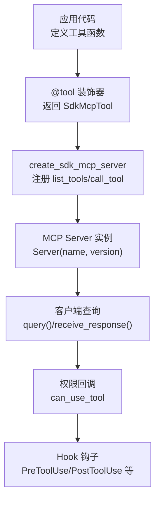
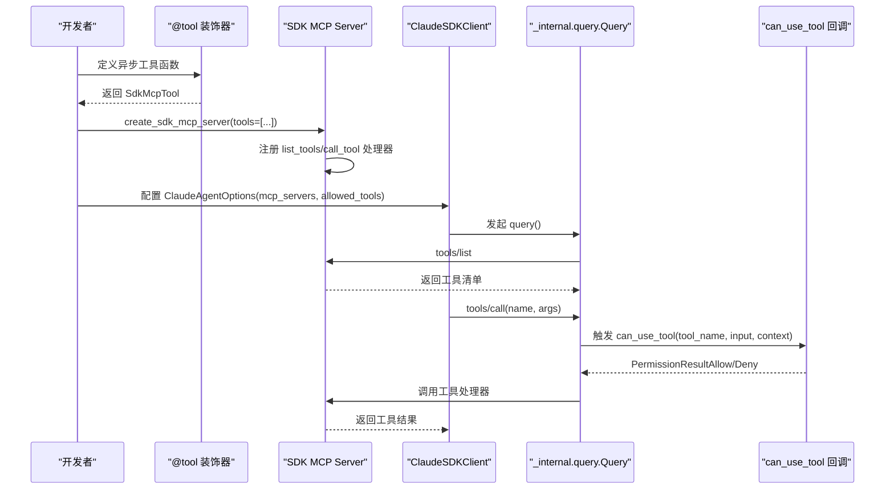
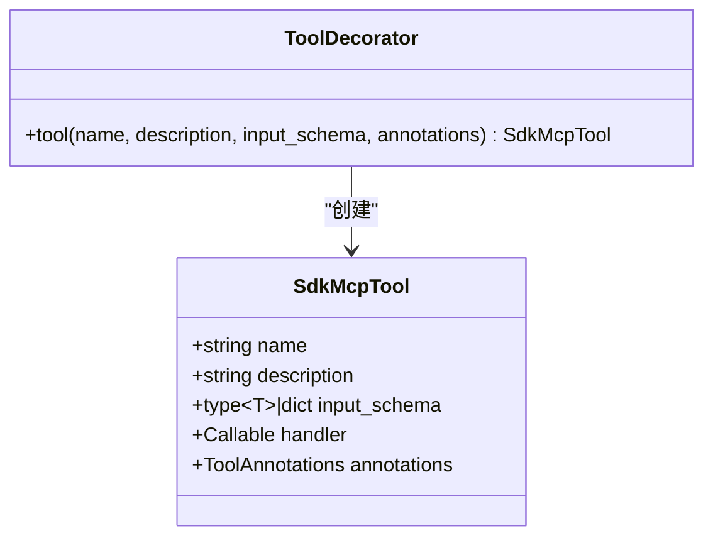
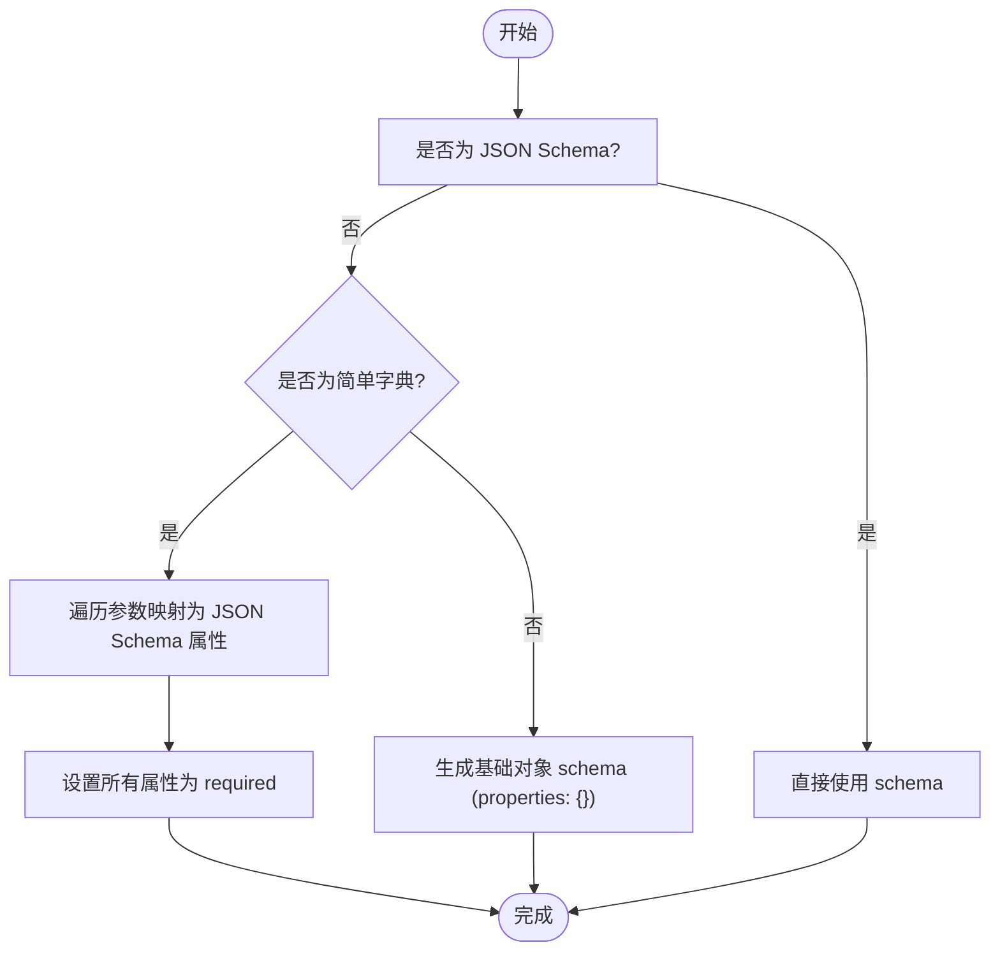
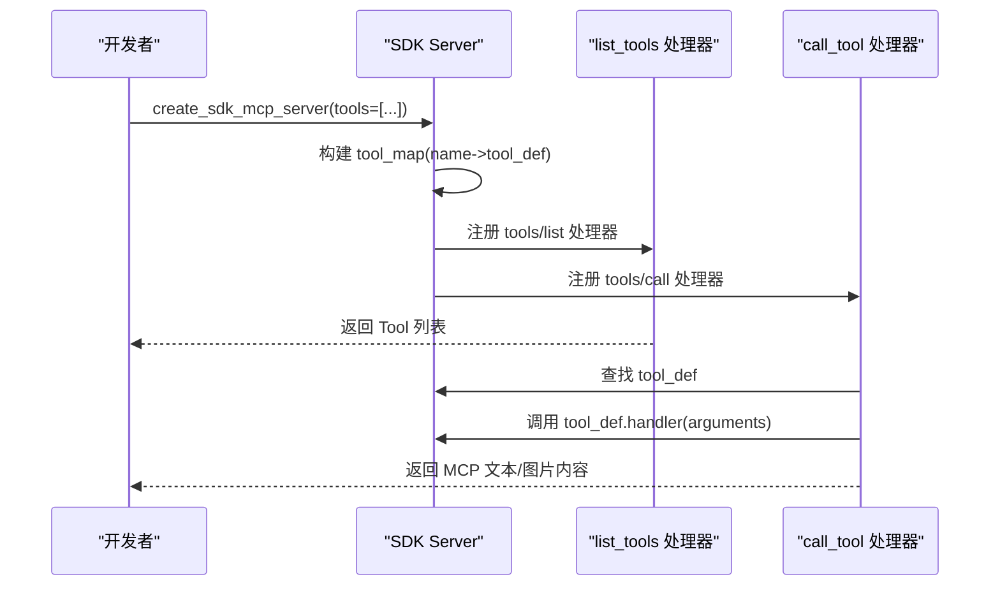
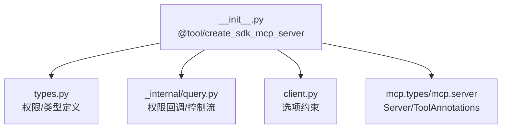

# 工具装饰器

<cite>
**本文引用的文件**
- [src/claude_agent_sdk/__init__.py](file://src/claude_agent_sdk/__init__.py)
- [src/claude_agent_sdk/types.py](file://src/claude_agent_sdk/types.py)
- [examples/mcp_calculator.py](file://examples/mcp_calculator.py)
- [examples/tool_permission_callback.py](file://examples/tool_permission_callback.py)
- [tests/test_sdk_mcp_integration.py](file://tests/test_sdk_mcp_integration.py)
- [tests/test_tool_callbacks.py](file://tests/test_tool_callbacks.py)
- [e2e-tests/test_tool_permissions.py](file://e2e-tests/test_tool_permissions.py)
- [src/claude_agent_sdk/_internal/query.py](file://src/claude_agent_sdk/_internal/query.py)
- [src/claude_agent_sdk/client.py](file://src/claude_agent_sdk/client.py)
</cite>

## 目录
1. [简介](#简介)
2. [项目结构](#项目结构)
3. [核心组件](#核心组件)
4. [架构总览](#架构总览)
5. [详细组件分析](#详细组件分析)
6. [依赖分析](#依赖分析)
7. [性能考量](#性能考量)
8. [故障排查指南](#故障排查指南)
9. [结论](#结论)
10. [附录](#附录)

## 简介
本文件面向“工具装饰器系统”，围绕 @tool 装饰器与 SdkMcpTool 数据类展开，系统性阐述其设计原理、语法结构、使用方法与最佳实践。内容涵盖：
- @tool 装饰器如何将异步工具函数包装为可被 SDK MCP 服务器调用的工具定义
- SdkMcpTool 字段语义与用途（name、description、input_schema、handler、annotations）
- 输入模式：简单字典模式、TypedDict 模式、JSON Schema 模式的适用场景与转换规则
- 工具函数开发指南：异步定义、参数校验、错误处理、结果格式化
- 工具注册与发现流程：create_sdk_mcp_server 如何注册 list_tools/call_tool 处理器
- 权限控制与安全：工具权限回调、权限模式、Hook 钩子
- 实战案例：从简单文本处理到复杂多参数计算工具
- 最佳实践与常见陷阱

## 项目结构
该 SDK 的工具装饰器能力位于主包导出模块中，并通过类型系统与内部查询逻辑协同工作。关键位置如下：
- 工具装饰器与 SDK MCP 服务器：src/claude_agent_sdk/__init__.py
- 类型与权限模型：src/claude_agent_sdk/types.py
- 示例与端到端测试：examples/* 与 e2e-tests/*
- 权限回调与控制流：src/claude_agent_sdk/_internal/query.py、src/claude_agent_sdk/client.py

图表来源
- [src/claude_agent_sdk/__init__.py:111-340](file://src/claude_agent_sdk/__init__.py#L111-L340)
- [src/claude_agent_sdk/_internal/query.py:236-286](file://src/claude_agent_sdk/_internal/query.py#L236-L286)

章节来源
- [src/claude_agent_sdk/__init__.py:111-340](file://src/claude_agent_sdk/__init__.py#L111-L340)
- [src/claude_agent_sdk/types.py:17-120](file://src/claude_agent_sdk/types.py#L17-L120)

## 核心组件
- @tool 装饰器：将异步工具函数包装为 SdkMcpTool，提供名称、描述、输入模式与处理器等元数据。
- SdkMcpTool：工具定义的数据类，承载工具元信息与处理器。
- create_sdk_mcp_server：创建 SDK 内嵌 MCP 服务器，自动注册 list_tools 与 call_tool 处理器。
- 类型系统与权限：types.py 定义了工具权限、Hook 输入输出、MCP 服务器状态等类型。
- 权限回调与 Hook：query.py 实现 can_use_tool 控制流；client.py 对外暴露选项约束。

章节来源
- [src/claude_agent_sdk/__init__.py:100-176](file://src/claude_agent_sdk/__init__.py#L100-L176)
- [src/claude_agent_sdk/__init__.py:178-340](file://src/claude_agent_sdk/__init__.py#L178-L340)
- [src/claude_agent_sdk/types.py:124-158](file://src/claude_agent_sdk/types.py#L124-L158)
- [src/claude_agent_sdk/_internal/query.py:236-286](file://src/claude_agent_sdk/_internal/query.py#L236-L286)
- [src/claude_agent_sdk/client.py:99-126](file://src/claude_agent_sdk/client.py#L99-L126)

## 架构总览
下图展示了工具装饰器在 SDK 中的运行时架构：装饰器生成工具定义，服务器注册处理器，客户端发起查询并通过权限回调与 Hook 协同。

图表来源
- [src/claude_agent_sdk/__init__.py:178-340](file://src/claude_agent_sdk/__init__.py#L178-L340)
- [src/claude_agent_sdk/_internal/query.py:236-286](file://src/claude_agent_sdk/_internal/query.py#L236-L286)
- [src/claude_agent_sdk/client.py:99-126](file://src/claude_agent_sdk/client.py#L99-L126)

## 详细组件分析

### @tool 装饰器与 SdkMcpTool
- 作用：将异步工具函数包装为 SdkMcpTool，便于 create_sdk_mcp_server 统一注册与分发。
- 关键参数：
  - name：工具唯一标识，用于工具调用与权限匹配
  - description：工具用途描述，帮助模型选择合适工具
  - input_schema：输入模式，支持简单字典、TypedDict 或 JSON Schema
  - annotations：工具注解（如只读、破坏性、开放世界），用于工具状态与安全提示
  - handler：异步处理器函数，接收单个参数字典，返回包含 content 的字典
- 返回值：SdkMcpTool 实例，包含上述字段

图表来源
- [src/claude_agent_sdk/__init__.py:100-176](file://src/claude_agent_sdk/__init__.py#L100-L176)

章节来源
- [src/claude_agent_sdk/__init__.py:111-176](file://src/claude_agent_sdk/__init__.py#L111-L176)
- [src/claude_agent_sdk/__init__.py:100-109](file://src/claude_agent_sdk/__init__.py#L100-L109)

### 输入模式与转换规则
- 简单字典模式：形如 {"param": type}，装饰器在注册时自动转换为 JSON Schema 的 properties 与 required 字段
- TypedDict 模式：用于更复杂的结构化输入，注册时生成基础对象 schema
- JSON Schema 模式：直接传入完整 schema，装饰器识别 type/properties 后直接使用
- 转换逻辑要点：
  - 若 input_schema 已为 JSON Schema（含 type 与 properties），则直接使用
  - 否则根据映射将 str/int/float/bool 映射为 JSON Schema 类型，其余默认 string
  - 所有参数均为必填（required）

图表来源
- [src/claude_agent_sdk/__init__.py:267-296](file://src/claude_agent_sdk/__init__.py#L267-L296)

章节来源
- [src/claude_agent_sdk/__init__.py:267-306](file://src/claude_agent_sdk/__init__.py#L267-L306)

### 工具注册与发现流程
- create_sdk_mcp_server 在传入工具列表后：
  - 构建工具名到工具定义的映射
  - 注册 list_tools 处理器：将 SdkMcpTool 转换为 MCP 的 Tool 列表（含 name/description/inputSchema/annotations）
  - 注册 call_tool 处理器：按名称查找工具，调用 handler(arguments)，并将返回结果转换为 MCP 文本/图片内容
- 未提供工具时，不注册处理器，避免空服务器

图表来源
- [src/claude_agent_sdk/__init__.py:257-340](file://src/claude_agent_sdk/__init__.py#L257-L340)

章节来源
- [src/claude_agent_sdk/__init__.py:257-340](file://src/claude_agent_sdk/__init__.py#L257-L340)

### 工具函数开发指南
- 异步函数定义：必须使用 async def，接收单个参数字典（来自 input_schema）
- 结果格式化：返回包含 "content" 键的字典；content 为文本或图片内容数组
- 错误处理：可通过返回包含 "is_error": True 的结果标记错误；也可抛出异常由服务器捕获并转为错误响应
- 参数验证：装饰器会基于 input_schema 生成 JSON Schema；建议在 handler 内补充业务校验
- 多参数工具：使用字典模式或 TypedDict 模式定义复杂输入结构

章节来源
- [src/claude_agent_sdk/__init__.py:117-162](file://src/claude_agent_sdk/__init__.py#L117-L162)
- [src/claude_agent_sdk/__init__.py:309-337](file://src/claude_agent_sdk/__init__.py#L309-L337)

### 实战案例
- 计算器工具：加减乘除、开方、幂运算，演示多参数与错误处理
- 权限回调：对写操作、危险命令进行拦截与输入修改
- 端到端测试：验证工具注册、调用、错误处理与混合服务器（SDK+外部）共存

章节来源
- [examples/mcp_calculator.py:24-97](file://examples/mcp_calculator.py#L24-L97)
- [examples/tool_permission_callback.py:26-94](file://examples/tool_permission_callback.py#L26-L94)
- [tests/test_sdk_mcp_integration.py:21-98](file://tests/test_sdk_mcp_integration.py#L21-L98)

### 权限配置与安全
- 工具权限回调 can_use_tool：在工具执行前触发，允许/拒绝或修改输入
- 选项约束：若提供 can_use_tool，需使用流式模式（AsyncIterable），且不可与 permission_prompt_tool_name 同时使用
- Hook 钩子：PreToolUse/PostToolUse 等可用于增强上下文、修改输出或阻断执行
- MCP 工具注解：annotations 支持只读、破坏性、开放世界等提示，影响工具状态与安全策略

章节来源
- [src/claude_agent_sdk/types.py:124-158](file://src/claude_agent_sdk/types.py#L124-L158)
- [src/claude_agent_sdk/_internal/query.py:236-286](file://src/claude_agent_sdk/_internal/query.py#L236-L286)
- [src/claude_agent_sdk/client.py:99-126](file://src/claude_agent_sdk/client.py#L99-L126)
- [tests/test_tool_callbacks.py:61-173](file://tests/test_tool_callbacks.py#L61-L173)
- [e2e-tests/test_tool_permissions.py:17-66](file://e2e-tests/test_tool_permissions.py#L17-L66)

## 依赖分析
- 工具装饰器依赖 mcp.types 的 ToolAnnotations 与 Server
- create_sdk_mcp_server 内部使用 mcp.server.Server 创建服务器实例
- 权限回调与 Hook 通过内部 query 模块与客户端选项交互
- 类型系统提供 McpToolAnnotations、McpToolInfo、McpServerStatus 等类型支撑工具状态与权限

图表来源
- [src/claude_agent_sdk/__init__.py:7-19](file://src/claude_agent_sdk/__init__.py#L7-L19)
- [src/claude_agent_sdk/__init__.py:250-254](file://src/claude_agent_sdk/__init__.py#L250-L254)
- [src/claude_agent_sdk/_internal/query.py:236-286](file://src/claude_agent_sdk/_internal/query.py#L236-L286)
- [src/claude_agent_sdk/client.py:99-126](file://src/claude_agent_sdk/client.py#L99-L126)

章节来源
- [src/claude_agent_sdk/__init__.py:7-19](file://src/claude_agent_sdk/__init__.py#L7-L19)
- [src/claude_agent_sdk/types.py:572-589](file://src/claude_agent_sdk/types.py#L572-L589)

## 性能考量
- SDK MCP 服务器在进程内运行，避免跨进程通信开销，适合高频工具调用
- 工具处理器直接在当前进程中执行，便于访问应用状态与资源
- 建议将重型计算拆分为多个轻量工具，以提升并发与可维护性

## 故障排查指南
- 工具未找到：确保工具名与 allowed_tools/annotations 匹配；检查 create_sdk_mcp_server 是否正确传入工具列表
- 权限回调未触发：确认已提供 can_use_tool 且处于流式模式；避免与 permission_prompt_tool_name 混用
- 结果格式错误：确保返回字典包含 "content"，且内容符合 MCP 文本/图片格式
- 输入模式问题：若使用简单字典模式，注意所有参数均为必填；复杂结构建议使用 TypedDict 或 JSON Schema

章节来源
- [src/claude_agent_sdk/__init__.py:312-317](file://src/claude_agent_sdk/__init__.py#L312-L317)
- [src/claude_agent_sdk/_internal/query.py:245-286](file://src/claude_agent_sdk/_internal/query.py#L245-L286)
- [src/claude_agent_sdk/client.py:112-126](file://src/claude_agent_sdk/client.py#L112-L126)

## 结论
工具装饰器系统通过 @tool 与 SdkMcpTool 提供了简洁而强大的工具定义方式，结合 create_sdk_mcp_server 的自动注册机制，实现了从开发到部署的一体化体验。配合权限回调与 Hook，系统在保证安全性的同时提供了灵活的扩展能力。建议在实际项目中遵循本文的最佳实践，合理选择输入模式、严格处理错误与权限，并通过示例与测试验证工具行为。

## 附录
- 使用建议
  - 输入模式选择：简单参数用字典模式；复杂结构用 TypedDict；需要细粒度校验用 JSON Schema
  - 错误处理：优先返回带 "is_error": True 的结果；必要时抛出异常以便统一捕获
  - 权限控制：对写操作、系统目录、危险命令实施严格限制；对未知工具采用询问策略
  - Hook 应用：在 PostToolUse 中增强输出，在 PreToolUse 中注入上下文或修改输入
- 常见陷阱
  - 忘记 async def 导致无法注册或调用
  - 忽略 "content" 键导致结果为空
  - 将字符串 "true"/"false" 传给布尔参数
  - 在非流式模式下提供 can_use_tool 回调