# MCP 协议实现

<cite>
**本文档引用的文件**
- [client.py](file://src/claude_agent_sdk/client.py)
- [query.py](file://src/claude_agent_sdk/query.py)
- [types.py](file://src/claude_agent_sdk/types.py)
- [subprocess_cli.py](file://src/claude_agent_sdk/_internal/transport/subprocess_cli.py)
- [message_parser.py](file://src/claude_agent_sdk/_internal/message_parser.py)
- [__init__.py](file://src/claude_agent_sdk/__init__.py)
- [mcp_calculator.py](file://examples/mcp_calculator.py)
- [test_sdk_mcp_integration.py](file://tests/test_sdk_mcp_integration.py)
- [_errors.py](file://src/claude_agent_sdk/_errors.py)
</cite>

## 目录
1. [简介](#简介)
2. [项目结构](#项目结构)
3. [核心组件](#核心组件)
4. [架构概览](#架构概览)
5. [详细组件分析](#详细组件分析)
6. [依赖关系分析](#依赖关系分析)
7. [性能考虑](#性能考虑)
8. [故障排除指南](#故障排除指南)
9. [结论](#结论)

## 简介

本文件详细阐述了 Claude Agent SDK 中 Model Context Protocol (MCP) 协议的实现。MCP 是一种用于在 AI 助手与外部工具服务器之间建立双向通信的标准协议。在 Claude Agent SDK 中，MCP 协议通过内部的控制协议层实现，支持 SDK 内置的 MCP 服务器以及外部 MCP 服务器。

该实现提供了完整的 MCP 协议支持，包括工具发现、工具调用、状态管理和错误处理。SDK 支持多种 MCP 服务器配置方式，包括内进程 SDK MCP 服务器和外部 MCP 服务器，并提供了统一的接口来管理这些服务器的状态和连接。

## 项目结构

Claude Agent SDK 的 MCP 协议实现主要分布在以下模块中：

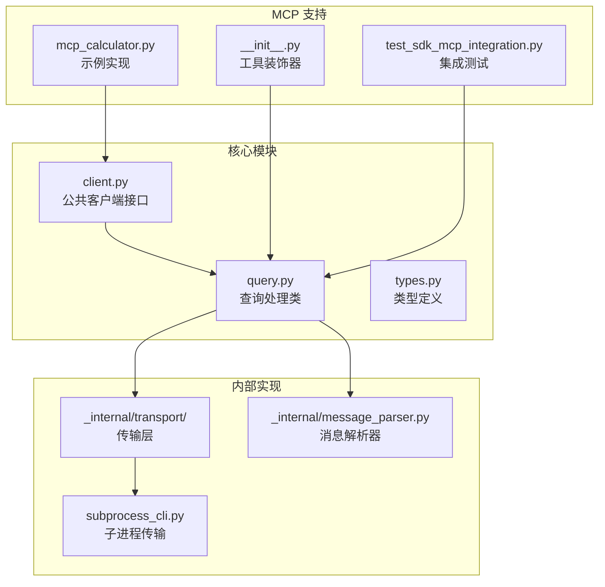

**图表来源**
- [client.py:1-500](file://src/claude_agent_sdk/client.py#L1-L500)
- [query.py:1-679](file://src/claude_agent_sdk/query.py#L1-L679)
- [subprocess_cli.py:1-630](file://src/claude_agent_sdk/_internal/transport/subprocess_cli.py#L1-L630)

**章节来源**
- [client.py:1-500](file://src/claude_agent_sdk/client.py#L1-L500)
- [query.py:1-679](file://src/claude_agent_sdk/query.py#L1-L679)
- [types.py:1-1199](file://src/claude_agent_sdk/types.py#L1-L1199)

## 核心组件

### 1. MCP 服务器配置

SDK 支持多种 MCP 服务器配置方式：

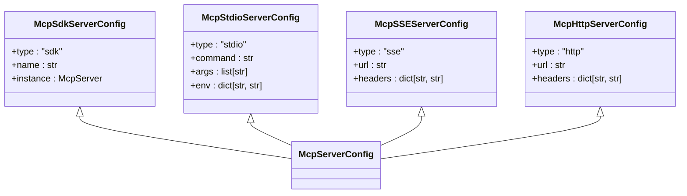

**图表来源**
- [types.py:494-529](file://src/claude_agent_sdk/types.py#L494-L529)

### 2. 工具装饰器系统

SDK 提供了强大的工具装饰器系统，支持类型安全的工具定义：

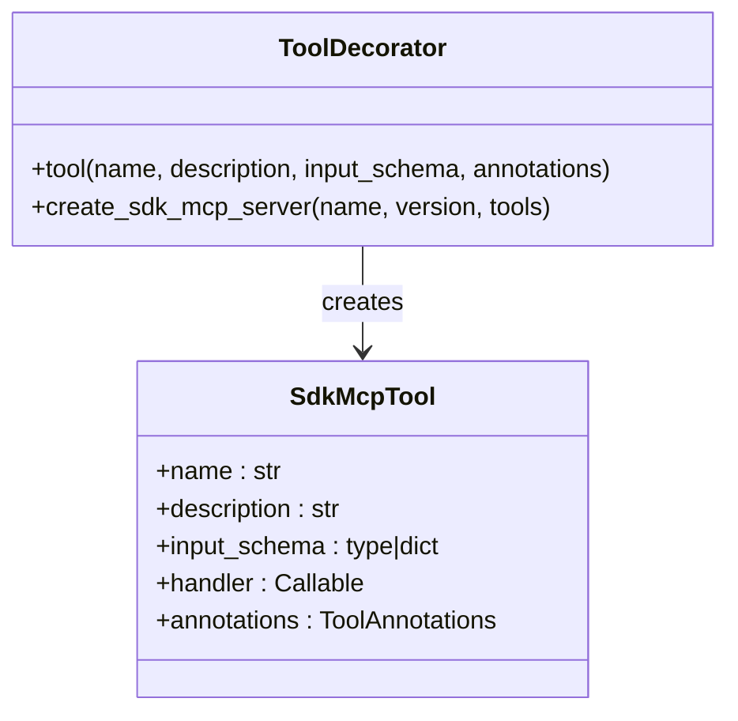

**图表来源**
- [__init__.py:100-176](file://src/claude_agent_sdk/__init__.py#L100-L176)
- [__init__.py:178-341](file://src/claude_agent_sdk/__init__.py#L178-L341)

**章节来源**
- [__init__.py:1-445](file://src/claude_agent_sdk/__init__.py#L1-L445)
- [types.py:494-641](file://src/claude_agent_sdk/types.py#L494-L641)

## 架构概览

MCP 协议在 Claude Agent SDK 中的架构实现如下：

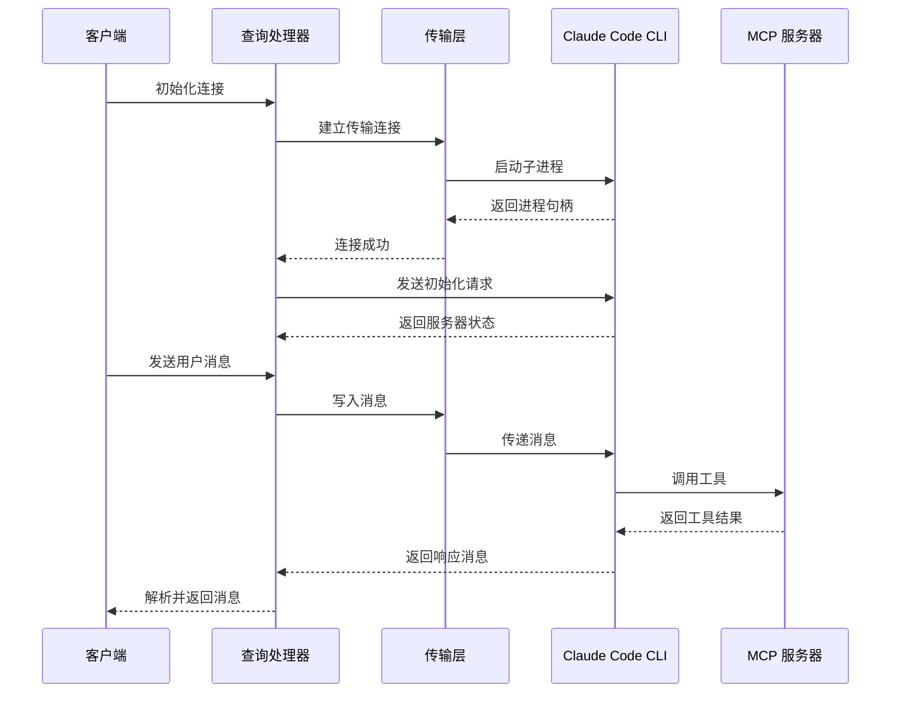

**图表来源**
- [query.py:119-164](file://src/claude_agent_sdk/query.py#L119-L164)
- [subprocess_cli.py:335-411](file://src/claude_agent_sdk/_internal/transport/subprocess_cli.py#L335-L411)

## 详细组件分析

### 1. Query 类 - 控制协议处理

Query 类是 MCP 协议的核心实现，负责处理双向控制协议：

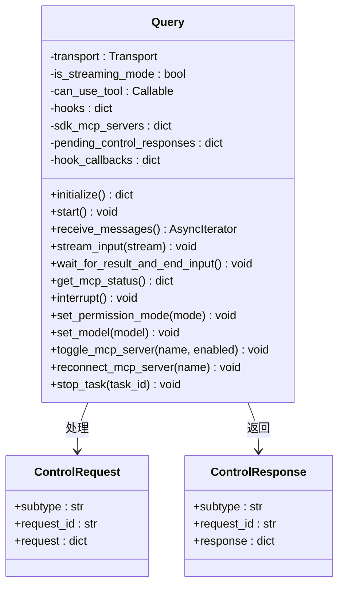

**图表来源**
- [query.py:53-112](file://src/claude_agent_sdk/query.py#L53-L112)
- [query.py:347-393](file://src/claude_agent_sdk/query.py#L347-L393)

### 2. MCP 请求处理流程

SDK 对 MCP 请求的处理流程如下：

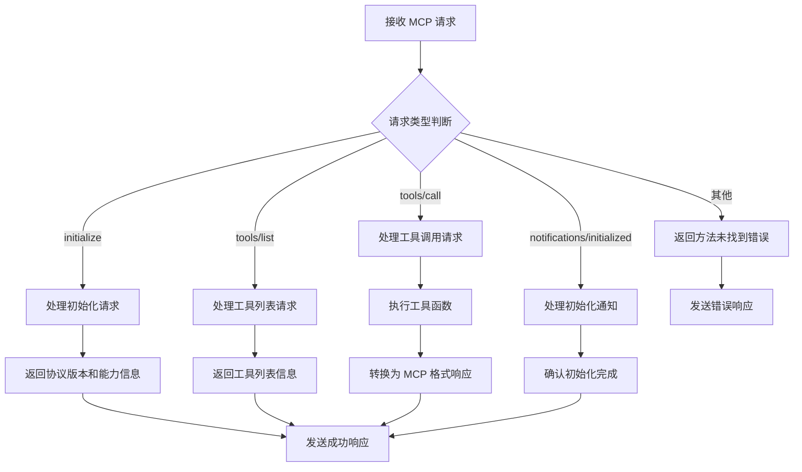

**图表来源**
- [query.py:394-531](file://src/claude_agent_sdk/query.py#L394-L531)

### 3. 工具调用示例

以下是一个完整的工具调用示例流程：

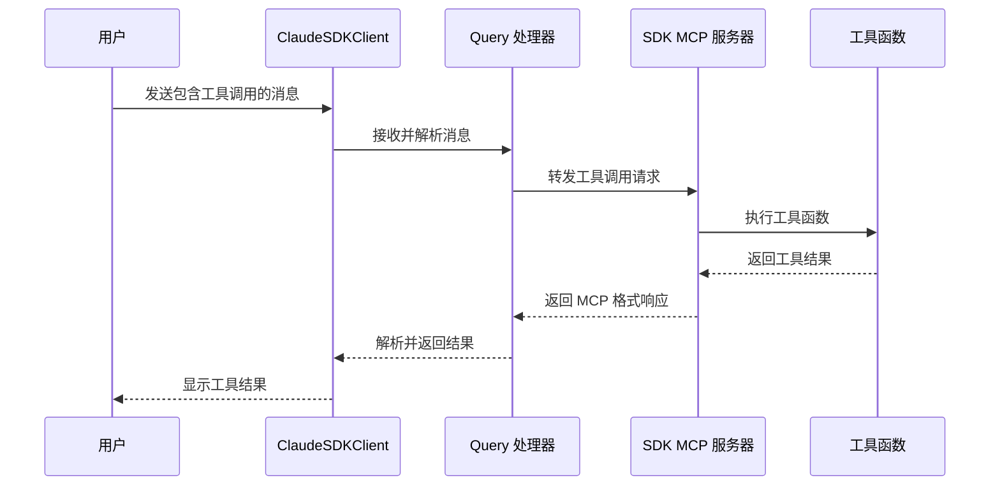

**图表来源**
- [mcp_calculator.py:138-194](file://examples/mcp_calculator.py#L138-L194)
- [query.py:478-511](file://src/claude_agent_sdk/query.py#L478-L511)

**章节来源**
- [query.py:1-679](file://src/claude_agent_sdk/query.py#L1-L679)
- [subprocess_cli.py:1-630](file://src/claude_agent_sdk/_internal/transport/subprocess_cli.py#L1-L630)
- [mcp_calculator.py:1-194](file://examples/mcp_calculator.py#L1-L194)

### 4. 消息解析系统

SDK 提供了完整的消息解析系统，支持多种消息类型的解析：

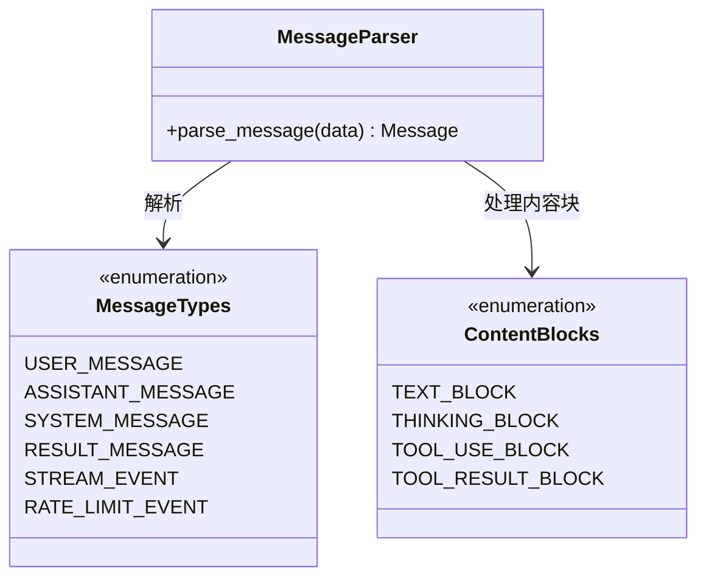

**图表来源**
- [message_parser.py:29-251](file://src/claude_agent_sdk/_internal/message_parser.py#L29-L251)

**章节来源**
- [message_parser.py:1-251](file://src/claude_agent_sdk/_internal/message_parser.py#L1-L251)
- [types.py:766-800](file://src/claude_agent_sdk/types.py#L766-L800)

## 依赖关系分析

### 1. 核心依赖关系

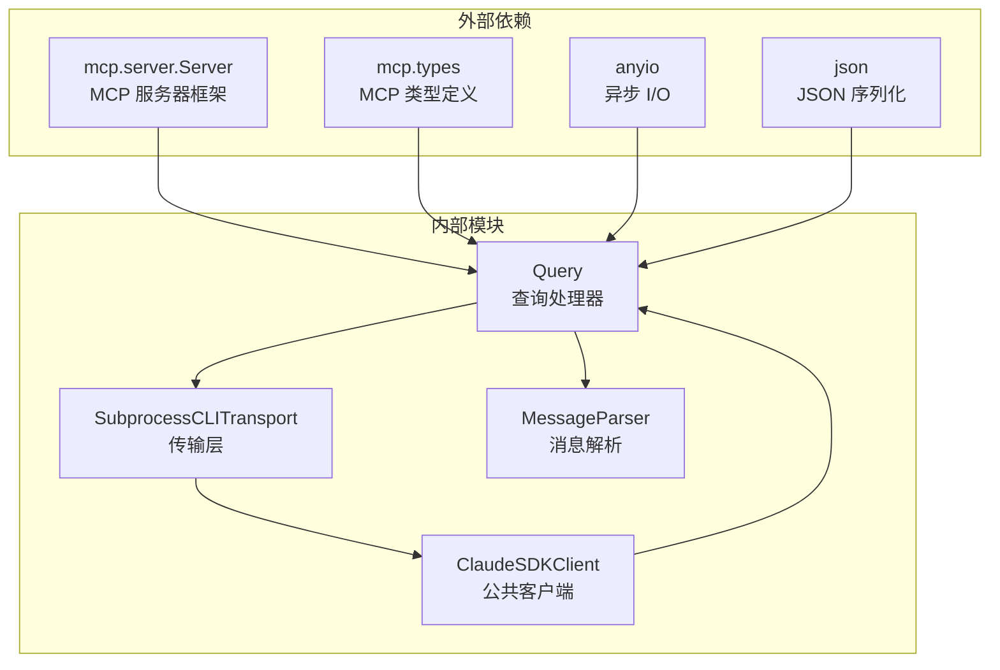

**图表来源**
- [query.py:10-26](file://src/claude_agent_sdk/query.py#L10-L26)
- [client.py:9-18](file://src/claude_agent_sdk/client.py#L9-L18)

### 2. 版本兼容性

SDK 在版本兼容性方面采用了向前兼容的设计：

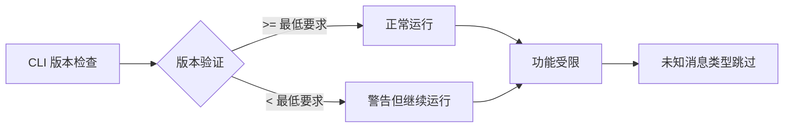

**图表来源**
- [subprocess_cli.py:587-626](file://src/claude_agent_sdk/_internal/transport/subprocess_cli.py#L587-L626)

**章节来源**
- [subprocess_cli.py:29-31](file://src/claude_agent_sdk/_internal/transport/subprocess_cli.py#L29-L31)
- [types.py:1-16](file://src/claude_agent_sdk/types.py#L1-L16)

## 性能考虑

### 1. 异步处理优化

SDK 采用异步编程模型来优化性能：

- **内存对象流**: 使用 anyio 的内存对象流来缓冲消息，避免阻塞操作
- **任务组管理**: 使用 anyio 任务组来管理并发操作
- **流式处理**: 支持流式输入输出，减少内存占用

### 2. 缓冲区管理

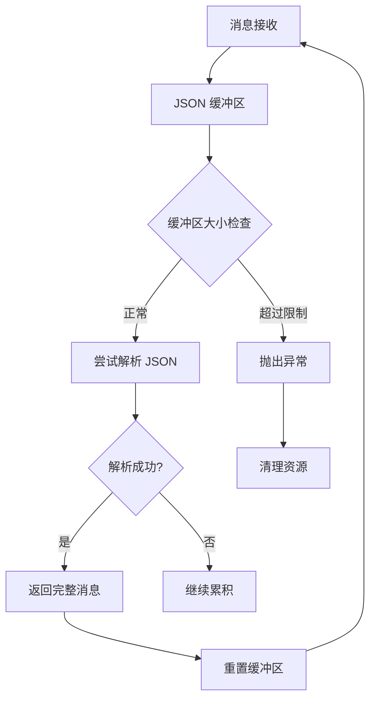

**图表来源**
- [subprocess_cli.py:546-565](file://src/claude_agent_sdk/_internal/transport/subprocess_cli.py#L546-L565)

### 3. 连接池和资源管理

SDK 提供了完善的资源管理机制：

- **自动连接管理**: 自动处理传输层的连接和断开
- **超时控制**: 支持可配置的超时设置
- **错误恢复**: 提供错误检测和恢复机制

## 故障排除指南

### 1. 常见错误类型

SDK 定义了多种错误类型来帮助诊断问题：

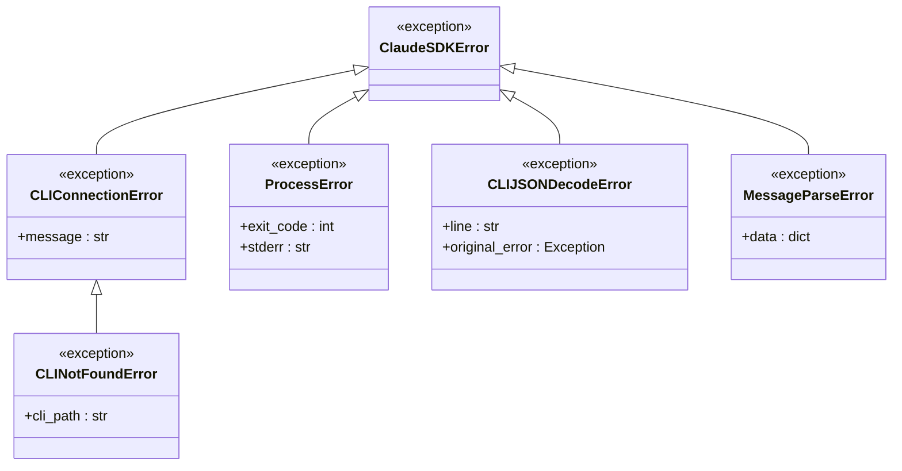

**图表来源**
- [_errors.py:6-57](file://src/claude_agent_sdk/_errors.py#L6-L57)

### 2. 调试方法

#### 2.1 启用调试输出

```python
# 设置调试环境变量
import os
os.environ["debug-to-stderr"] = "true"

# 或者使用 stderr 回调
client = ClaudeSDKClient(
    options=ClaudeAgentOptions(
        stderr=lambda line: print(f"DEBUG: {line}")
    )
)
```

#### 2.2 MCP 服务器状态监控

```python
# 获取 MCP 服务器状态
status = await client.get_mcp_status()
for server in status["mcpServers"]:
    print(f"服务器: {server['name']}")
    print(f"状态: {server['status']}")
    if server["status"] == "failed":
        print(f"错误: {server.get('error')}")
```

#### 2.3 工具调用调试

```python
# 启用详细的工具调用日志
import logging
logging.basicConfig(level=logging.DEBUG)
logger = logging.getLogger("claude_agent_sdk")
```

**章节来源**
- [_errors.py:1-57](file://src/claude_agent_sdk/_errors.py#L1-L57)
- [client.py:385-416](file://src/claude_agent_sdk/client.py#L385-L416)

### 3. 典型问题解决方案

#### 3.1 MCP 服务器连接失败

**问题**: MCP 服务器无法连接或频繁断开

**解决方案**:
1. 检查服务器配置是否正确
2. 验证网络连接和防火墙设置
3. 查看服务器日志获取详细错误信息
4. 使用 `reconnect_mcp_server()` 方法重新连接

#### 3.2 工具调用超时

**问题**: 工具调用响应时间过长

**解决方案**:
1. 检查工具实现的性能
2. 增加超时配置
3. 优化工具逻辑
4. 考虑异步处理

#### 3.3 消息解析错误

**问题**: 无法解析来自 CLI 的消息

**解决方案**:
1. 检查 CLI 版本兼容性
2. 验证消息格式
3. 查看日志中的原始消息
4. 更新 SDK 到最新版本

## 结论

Claude Agent SDK 的 MCP 协议实现提供了完整、可靠的工具集成解决方案。通过精心设计的架构，SDK 支持多种 MCP 服务器配置方式，包括内进程 SDK MCP 服务器和外部 MCP 服务器，并提供了统一的接口来管理这些服务器。

该实现的主要优势包括：

1. **类型安全**: 通过工具装饰器和类型定义确保代码质量
2. **向前兼容**: 支持新版本 CLI 的消息格式
3. **异步处理**: 优化的异步架构提供良好的性能
4. **完整错误处理**: 详细的错误类型和诊断信息
5. **灵活配置**: 支持多种 MCP 服务器配置方式

对于开发者来说，SDK 提供了清晰的 API 和丰富的示例，使得集成 MCP 工具变得简单直观。无论是简单的工具调用还是复杂的多服务器管理，SDK 都能提供稳定可靠的支持。