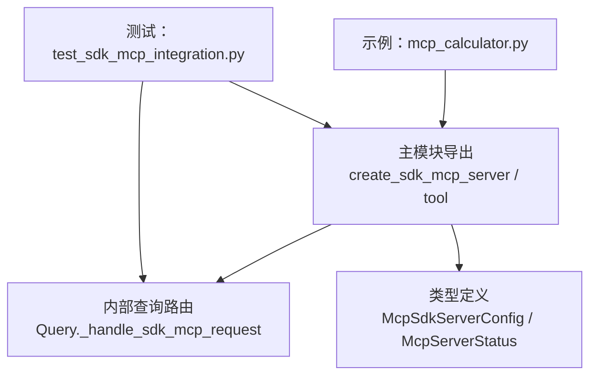
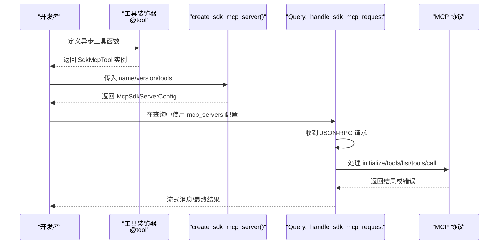
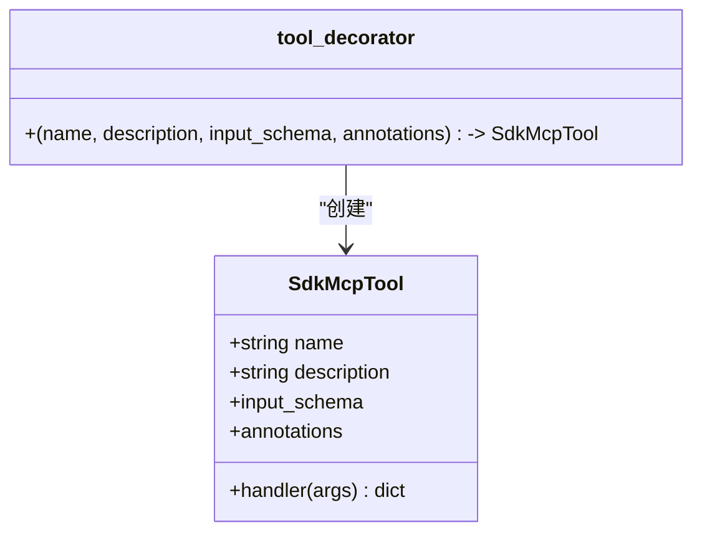
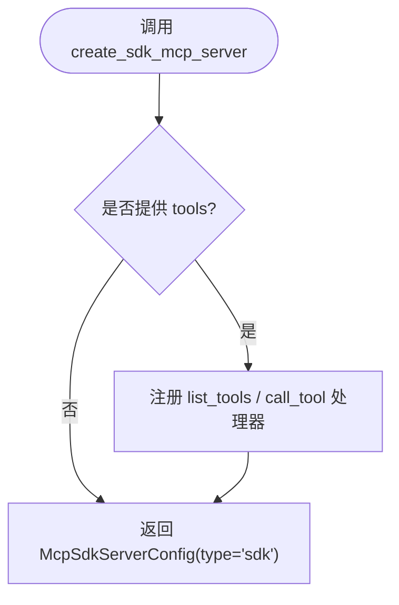
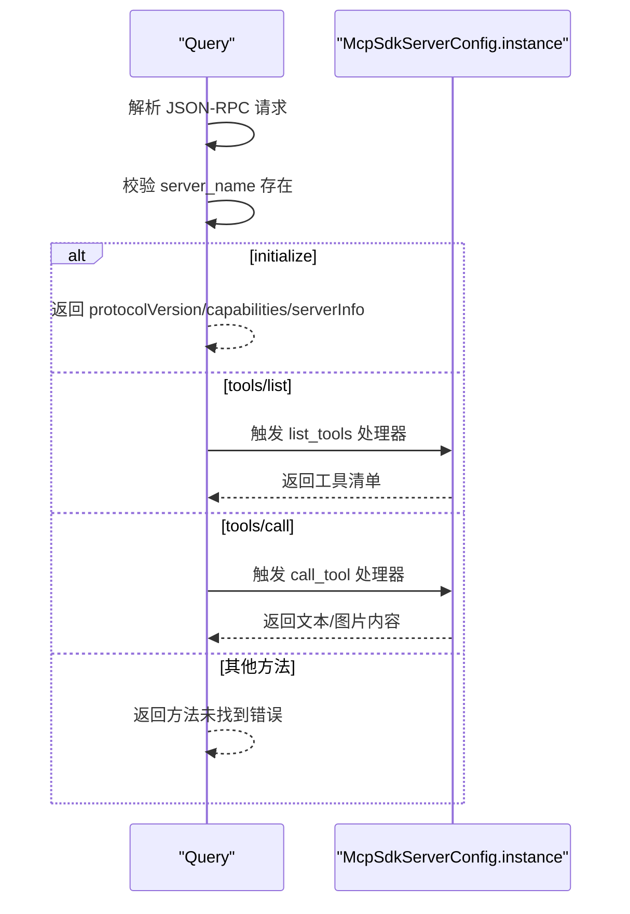
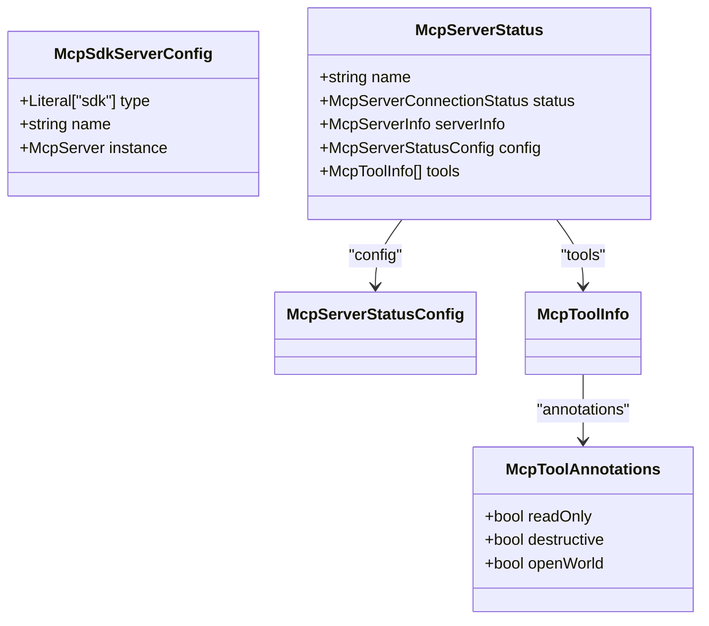
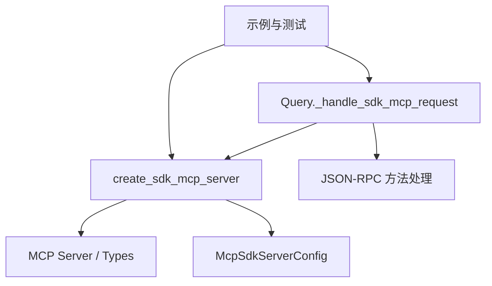

# MCP 服务器创建

<cite>
**本文引用的文件**
- [src/claude_agent_sdk/__init__.py](file://src/claude_agent_sdk/__init__.py)
- [examples/mcp_calculator.py](file://examples/mcp_calculator.py)
- [tests/test_sdk_mcp_integration.py](file://tests/test_sdk_mcp_integration.py)
- [src/claude_agent_sdk/types.py](file://src/claude_agent_sdk/types.py)
- [src/claude_agent_sdk/_internal/query.py](file://src/claude_agent_sdk/_internal/query.py)
- [README.md](file://README.md)
</cite>

## 目录
1. [简介](#简介)
2. [项目结构](#项目结构)
3. [核心组件](#核心组件)
4. [架构总览](#架构总览)
5. [详细组件分析](#详细组件分析)
6. [依赖分析](#依赖分析)
7. [性能考虑](#性能考虑)
8. [故障排除指南](#故障排除指南)
9. [结论](#结论)
10. [附录](#附录)

## 简介
本文件系统性阐述如何使用 SDK 创建“内嵌式 MCP 服务器”，重点围绕 create_sdk_mcp_server() 的用法与实现细节，包括：
- 服务器名称与版本号配置
- 工具列表注册与输入模式
- 初始化流程中的参数校验与配置项说明
- 完整的服务器创建示例（含元数据与工具集合）
- 生命周期管理与内存使用注意事项
- 错误处理与异常场景应对

该 SDK 提供的内嵌式 MCP 服务器直接运行在应用进程内，避免子进程与 IPC 开销，便于调试与状态访问。

## 项目结构
与 MCP 服务器创建相关的关键位置如下：
- 公共 API：工具装饰器与服务器创建函数位于主模块导出中
- 示例：计算器示例展示了工具定义与服务器创建的完整流程
- 类型定义：MCP 服务器配置类型、状态类型等
- 查询路由：SDK 内部对 SDK MCP 服务器的 JSON-RPC 请求处理逻辑
- 测试：覆盖工具注册、错误处理、注解传递、图像内容返回等场景

**图表来源**
- [src/claude_agent_sdk/__init__.py:178-340](file://src/claude_agent_sdk/__init__.py#L178-L340)
- [src/claude_agent_sdk/_internal/query.py:403-538](file://src/claude_agent_sdk/_internal/query.py#L403-L538)
- [src/claude_agent_sdk/types.py:518-640](file://src/claude_agent_sdk/types.py#L518-L640)
- [examples/mcp_calculator.py:140-170](file://examples/mcp_calculator.py#L140-L170)
- [tests/test_sdk_mcp_integration.py:39-98](file://tests/test_sdk_mcp_integration.py#L39-L98)

**章节来源**
- [src/claude_agent_sdk/__init__.py:178-340](file://src/claude_agent_sdk/__init__.py#L178-L340)
- [examples/mcp_calculator.py:140-170](file://examples/mcp_calculator.py#L140-L170)
- [tests/test_sdk_mcp_integration.py:39-98](file://tests/test_sdk_mcp_integration.py#L39-L98)
- [src/claude_agent_sdk/types.py:518-640](file://src/claude_agent_sdk/types.py#L518-L640)
- [src/claude_agent_sdk/_internal/query.py:403-538](file://src/claude_agent_sdk/_internal/query.py#L403-L538)

## 核心组件
- 工具装饰器：用于定义可被 MCP 调用的异步函数，并携带描述、输入模式与注解
- 服务器创建函数：基于工具集合构建内嵌式 MCP 服务器实例，并返回 SDK 配置对象
- 类型定义：MCP 服务器配置类型、状态类型、工具注解等
- 查询路由：SDK 内部对 SDK MCP 服务器的 JSON-RPC 方法进行处理（如 initialize、tools/list、tools/call）

**章节来源**
- [src/claude_agent_sdk/__init__.py:111-176](file://src/claude_agent_sdk/__init__.py#L111-L176)
- [src/claude_agent_sdk/__init__.py:178-340](file://src/claude_agent_sdk/__init__.py#L178-L340)
- [src/claude_agent_sdk/types.py:518-640](file://src/claude_agent_sdk/types.py#L518-L640)
- [src/claude_agent_sdk/_internal/query.py:403-538](file://src/claude_agent_sdk/_internal/query.py#L403-L538)

## 架构总览
下图展示了从工具定义到服务器创建、再到查询时对 SDK MCP 服务器的请求处理路径。

**图表来源**
- [src/claude_agent_sdk/__init__.py:111-176](file://src/claude_agent_sdk/__init__.py#L111-L176)
- [src/claude_agent_sdk/__init__.py:178-340](file://src/claude_agent_sdk/__init__.py#L178-L340)
- [src/claude_agent_sdk/_internal/query.py:403-538](file://src/claude_agent_sdk/_internal/query.py#L403-L538)

## 详细组件分析

### 组件一：工具装饰器与工具定义
- 作用：为异步工具函数提供类型安全的输入模式声明、描述与注解
- 输入模式支持：字典映射（简单类型）、TypedDict 或 JSON Schema 字典
- 注解：可选的工具注解（如只读、破坏性、开放世界等）会透传至工具清单

**图表来源**
- [src/claude_agent_sdk/__init__.py:100-176](file://src/claude_agent_sdk/__init__.py#L100-L176)

**章节来源**
- [src/claude_agent_sdk/__init__.py:111-176](file://src/claude_agent_sdk/__init__.py#L111-L176)

### 组件二：服务器创建函数 create_sdk_mcp_server()
- 参数
  - name：服务器唯一标识，用于在 mcp_servers 中引用
  - version：服务器版本字符串（仅信息用途）
  - tools：SdkMcpTool 列表；为空则不注册任何工具处理器
- 行为
  - 基于 MCP Server 创建实例
  - 若提供 tools，则注册 tools/list 与 tools/call 处理器
  - 返回 McpSdkServerConfig，包含 type、name 与 instance
- 结果
  - 可直接作为 ClaudeAgentOptions.mcp_servers 的值使用

**图表来源**
- [src/claude_agent_sdk/__init__.py:178-340](file://src/claude_agent_sdk/__init__.py#L178-L340)

**章节来源**
- [src/claude_agent_sdk/__init__.py:178-340](file://src/claude_agent_sdk/__init__.py#L178-L340)

### 组件三：查询路由与 SDK MCP 服务器交互
- 当 SDK 接收到 JSON-RPC 请求时，会根据 server_name 查找已注册的 SDK MCP 服务器
- 对 initialize 方法返回固定协议版本与能力（当前为工具能力）
- 对 tools/list 返回工具清单（含注解）
- 对 tools/call 调用对应工具处理器，并将返回内容转换为 MCP 文本/图片内容

**图表来源**
- [src/claude_agent_sdk/_internal/query.py:403-538](file://src/claude_agent_sdk/_internal/query.py#L403-L538)

**章节来源**
- [src/claude_agent_sdk/_internal/query.py:403-538](file://src/claude_agent_sdk/_internal/query.py#L403-L538)

### 组件四：类型定义与状态
- McpSdkServerConfig：SDK 服务器配置（type、name、instance）
- McpServerStatus/McpServerStatusConfig：服务器状态与配置输出（包含 SDK 服务器状态）
- 工具注解：McpToolAnnotations（readOnly、destructive、openWorld）

**图表来源**
- [src/claude_agent_sdk/types.py:518-640](file://src/claude_agent_sdk/types.py#L518-L640)

**章节来源**
- [src/claude_agent_sdk/types.py:518-640](file://src/claude_agent_sdk/types.py#L518-L640)

## 依赖分析
- create_sdk_mcp_server 依赖 MCP Server 与 MCP 类型（Tool、TextContent、ImageContent）
- Query._handle_sdk_mcp_request 依赖 SDK MCP 服务器实例与 JSON-RPC 方法
- 示例与测试验证了工具注册、注解传递、图像内容返回、错误处理等行为

**图表来源**
- [src/claude_agent_sdk/__init__.py:178-340](file://src/claude_agent_sdk/__init__.py#L178-L340)
- [src/claude_agent_sdk/_internal/query.py:403-538](file://src/claude_agent_sdk/_internal/query.py#L403-L538)
- [examples/mcp_calculator.py:140-170](file://examples/mcp_calculator.py#L140-L170)
- [tests/test_sdk_mcp_integration.py:39-98](file://tests/test_sdk_mcp_integration.py#L39-L98)

**章节来源**
- [src/claude_agent_sdk/__init__.py:178-340](file://src/claude_agent_sdk/__init__.py#L178-L340)
- [src/claude_agent_sdk/_internal/query.py:403-538](file://src/claude_agent_sdk/_internal/query.py#L403-L538)
- [examples/mcp_calculator.py:140-170](file://examples/mcp_calculator.py#L140-L170)
- [tests/test_sdk_mcp_integration.py:39-98](file://tests/test_sdk_mcp_integration.py#L39-L98)

## 性能考虑
- 内嵌式优势：无子进程与 IPC 开销，工具调用直接在进程中执行，延迟更低、部署更简单
- 资源占用：工具函数共享同一进程地址空间，注意避免长时间阻塞操作；必要时拆分为外部服务器
- 并发模型：工具需为异步函数；SDK 使用任务组与流式传输，合理设置超时与缓冲区大小

[本节为通用指导，无需列出具体文件来源]

## 故障排除指南
- 服务器未找到
  - 现象：JSON-RPC 返回方法未找到或服务器不存在
  - 原因：mcp_servers 中未正确注册或 server_name 不匹配
  - 处理：确认 McpSdkServerConfig.name 与查询配置一致
- 工具未找到
  - 现象：tools/call 抛出工具不存在错误
  - 原因：tools 列表为空或名称拼写错误
  - 处理：确保工具已通过 @tool 装饰并加入 tools 列表
- 异常传播
  - 现象：工具抛出异常导致 JSON-RPC 错误
  - 处理：在工具内部捕获并返回标准响应（包含错误标记），或在上层统一异常处理
- 图像内容返回
  - 现象：需要返回图片内容
  - 处理：工具返回包含图片类型的响应，SDK 会转换为 MCP 图片内容

**章节来源**
- [src/claude_agent_sdk/_internal/query.py:403-538](file://src/claude_agent_sdk/_internal/query.py#L403-L538)
- [tests/test_sdk_mcp_integration.py:119-148](file://tests/test_sdk_mcp_integration.py#L119-L148)

## 结论
通过 create_sdk_mcp_server()，开发者可以快速在应用进程内创建 MCP 服务器，配合 @tool 装饰器定义工具，实现高性能、易调试的工具调用链路。结合 SDK 的查询路由与类型系统，可稳定地完成工具清单暴露与调用执行，并在测试与示例中得到充分验证。

[本节为总结性内容，无需列出具体文件来源]

## 附录

### 使用步骤与最佳实践
- 定义工具：使用 @tool 装饰器声明名称、描述与输入模式
- 创建服务器：调用 create_sdk_mcp_server(name, version, tools)
- 配置选项：将服务器放入 ClaudeAgentOptions.mcp_servers，并在 allowed_tools 中预授权
- 生命周期：服务器实例由 SDK 管理；若需自定义生命周期，请在应用层面控制创建与销毁时机
- 内存与并发：避免在工具中执行长时间阻塞操作；合理设置 SDK 超时与缓冲区

**章节来源**
- [README.md:100-170](file://README.md#L100-L170)
- [examples/mcp_calculator.py:140-170](file://examples/mcp_calculator.py#L140-L170)
- [tests/test_sdk_mcp_integration.py:39-98](file://tests/test_sdk_mcp_integration.py#L39-L98)

### 完整示例（路径参考）
- 工具定义与服务器创建：参见示例脚本中的工具函数与 create_sdk_mcp_server 调用
- 配置与使用：参见示例脚本中 ClaudeAgentOptions 的 mcp_servers 与 allowed_tools 设置

**章节来源**
- [examples/mcp_calculator.py:24-98](file://examples/mcp_calculator.py#L24-L98)
- [examples/mcp_calculator.py:140-170](file://examples/mcp_calculator.py#L140-L170)