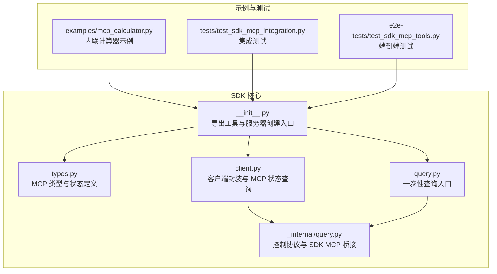
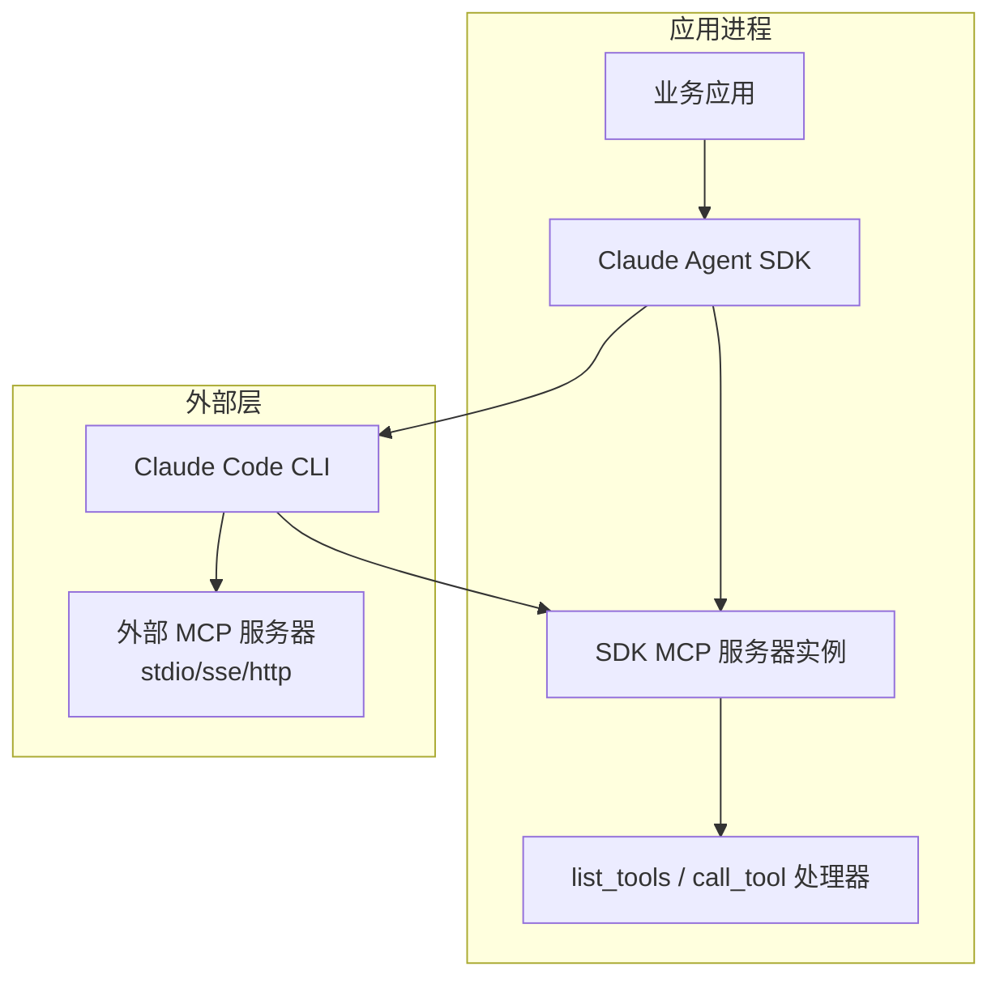
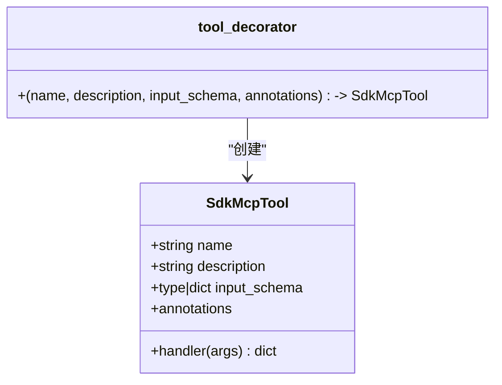
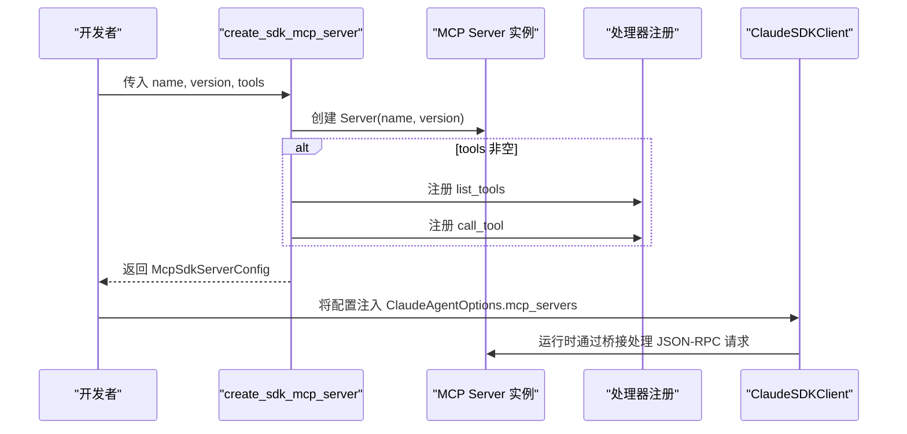
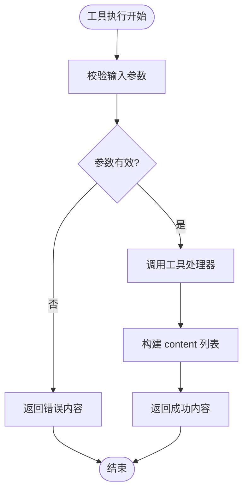
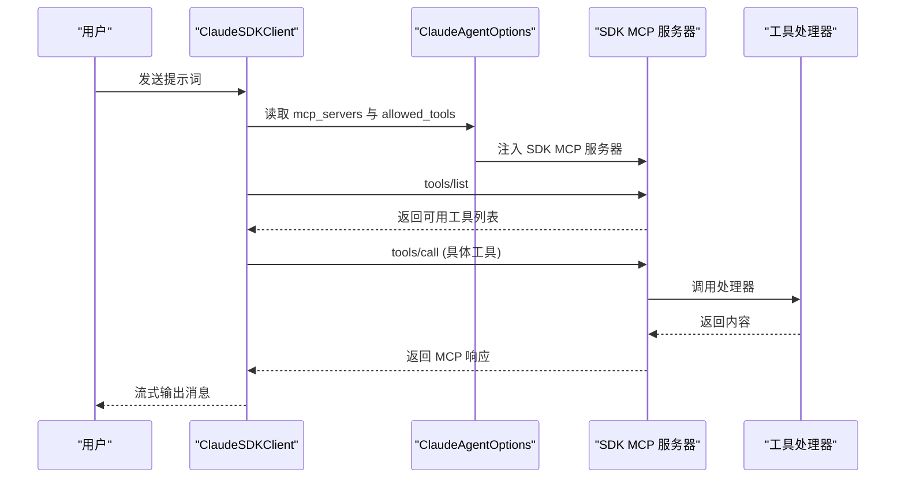
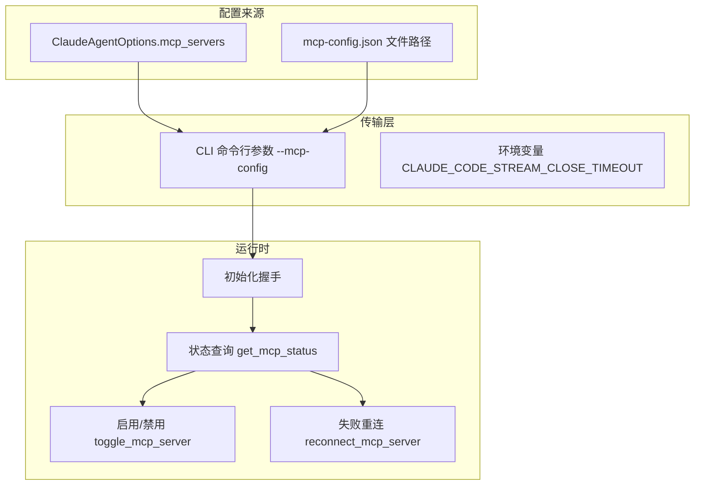
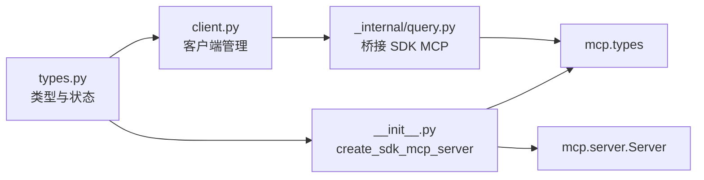

# MCP 服务器系统

<cite>
**本文引用的文件**
- [src/claude_agent_sdk/__init__.py](file://src/claude_agent_sdk/__init__.py)
- [src/claude_agent_sdk/types.py](file://src/claude_agent_sdk/types.py)
- [examples/mcp_calculator.py](file://examples/mcp_calculator.py)
- [tests/test_sdk_mcp_integration.py](file://tests/test_sdk_mcp_integration.py)
- [e2e-tests/test_sdk_mcp_tools.py](file://e2e-tests/test_sdk_mcp_tools.py)
- [src/claude_agent_sdk/client.py](file://src/claude_agent_sdk/client.py)
- [src/claude_agent_sdk/query.py](file://src/claude_agent_sdk/query.py)
- [src/claude_agent_sdk/_internal/query.py](file://src/claude_agent_sdk/_internal/query.py)
</cite>

## 目录
1. [简介](#简介)
2. [项目结构](#项目结构)
3. [核心组件](#核心组件)
4. [架构总览](#架构总览)
5. [详细组件分析](#详细组件分析)
6. [依赖关系分析](#依赖关系分析)
7. [性能考量](#性能考量)
8. [故障排查指南](#故障排查指南)
9. [结论](#结论)
10. [附录](#附录)

## 简介
本文件系统性阐述 Claude Agent SDK 中的 MCP（Model Context Protocol）服务器能力，重点覆盖：
- MCP 协议工作原理与在 SDK 中的实现方式
- 如何使用 create_sdk_mcp_server() 创建自定义 MCP 服务器
- 服务器配置、版本管理与工具注册流程
- 完整计算器示例分析：工具装饰器使用、参数验证与错误处理
- 工具函数签名规范、返回值格式与错误处理机制
- 外部 MCP 服务器（stdio/SSE/HTTP）的集成方法与最佳实践

## 项目结构
该仓库围绕 Claude Agent SDK 提供 MCP 服务器支持，核心位于 src/claude_agent_sdk 包中，并配套示例与测试用例验证端到端行为。

图表来源
- [src/claude_agent_sdk/__init__.py:1-445](file://src/claude_agent_sdk/__init__.py#L1-L445)
- [src/claude_agent_sdk/types.py:494-640](file://src/claude_agent_sdk/types.py#L494-L640)
- [src/claude_agent_sdk/client.py:1-500](file://src/claude_agent_sdk/client.py#L1-L500)
- [src/claude_agent_sdk/query.py:1-127](file://src/claude_agent_sdk/query.py#L1-L127)
- [src/claude_agent_sdk/_internal/query.py:1-200](file://src/claude_agent_sdk/_internal/query.py#L1-L200)
- [examples/mcp_calculator.py:1-194](file://examples/mcp_calculator.py#L1-L194)
- [tests/test_sdk_mcp_integration.py:1-382](file://tests/test_sdk_mcp_integration.py#L1-L382)
- [e2e-tests/test_sdk_mcp_tools.py:1-169](file://e2e-tests/test_sdk_mcp_tools.py#L1-L169)

章节来源
- [src/claude_agent_sdk/__init__.py:1-445](file://src/claude_agent_sdk/__init__.py#L1-L445)
- [src/claude_agent_sdk/types.py:494-640](file://src/claude_agent_sdk/types.py#L494-L640)

## 核心组件
- 工具装饰器与工具定义
  - SdkMcpTool：SDK 内联 MCP 工具的定义载体，包含名称、描述、输入模式与处理器。
  - tool()：装饰器，用于声明工具，支持简单字典模式或复杂 JSON Schema/TypedDict 输入模式，并可附加 ToolAnnotations。
- 服务器创建与注册
  - create_sdk_mcp_server()：创建内联 MCP 服务器实例，自动注册 list_tools 与 call_tool 处理器；返回 McpSdkServerConfig，供 ClaudeAgentOptions.mcp_servers 使用。
- 类型与状态
  - McpServerConfig/McpSdkServerConfig：服务器配置类型，支持 sdk/stdio/sse/http 三种形态。
  - McpServerStatus/McpStatusResponse：服务器连接状态与查询响应结构。
  - ToolAnnotations/McpToolAnnotations：工具注解（只读、破坏性、开放世界等）。
- 客户端与桥接
  - ClaudeSDKClient：提供 get_mcp_status、reconnect_mcp_server、toggle_mcp_server 等管理接口。
  - _internal/query.py：负责与 CLI 控制协议交互，桥接 SDK MCP 服务器的 JSON-RPC 请求。

章节来源
- [src/claude_agent_sdk/__init__.py:100-341](file://src/claude_agent_sdk/__init__.py#L100-L341)
- [src/claude_agent_sdk/types.py:494-640](file://src/claude_agent_sdk/types.py#L494-L640)
- [src/claude_agent_sdk/client.py:385-416](file://src/claude_agent_sdk/client.py#L385-L416)
- [src/claude_agent_sdk/_internal/query.py:394-530](file://src/claude_agent_sdk/_internal/query.py#L394-L530)

## 架构总览
下图展示了 SDK MCP 服务器在整体架构中的位置与交互路径。

图表来源
- [src/claude_agent_sdk/__init__.py:178-341](file://src/claude_agent_sdk/__init__.py#L178-L341)
- [src/claude_agent_sdk/_internal/query.py:394-530](file://src/claude_agent_sdk/_internal/query.py#L394-L530)
- [src/claude_agent_sdk/types.py:527-529](file://src/claude_agent_sdk/types.py#L527-L529)

## 详细组件分析

### 组件一：工具装饰器与工具定义
- SdkMcpTool
  - 字段：name、description、input_schema、handler、annotations
  - 作用：承载工具元数据与处理器，供 create_sdk_mcp_server 注册。
- tool()
  - 参数：name、description、input_schema（支持 dict[str, type]、TypedDict 或 JSON Schema）、annotations
  - 返回：SdkMcpTool 实例
  - 行为：装饰器包装异步处理器，确保工具以统一签名运行。

图表来源
- [src/claude_agent_sdk/__init__.py:100-176](file://src/claude_agent_sdk/__init__.py#L100-L176)

章节来源
- [src/claude_agent_sdk/__init__.py:100-176](file://src/claude_agent_sdk/__init__.py#L100-L176)

### 组件二：SDK MCP 服务器创建与注册
- create_sdk_mcp_server()
  - 输入：name、version、tools（可选）
  - 输出：McpSdkServerConfig（type="sdk"，包含 name 与 instance）
  - 注册逻辑：
    - 若提供 tools，则构建 tool_map 并注册 list_tools 与 call_tool 处理器
    - list_tools：将 SdkMcpTool.input_schema 转换为 JSON Schema（支持 dict 映射与 TypedDict/其他类型），并附带 annotations
    - call_tool：按名称查找工具，调用 handler(arguments)，将返回内容转换为 MCP 文本/图片内容列表
  - 版本管理：version 仅用于信息展示，不影响功能

图表来源
- [src/claude_agent_sdk/__init__.py:178-341](file://src/claude_agent_sdk/__init__.py#L178-L341)
- [src/claude_agent_sdk/_internal/query.py:394-530](file://src/claude_agent_sdk/_internal/query.py#L394-L530)

章节来源
- [src/claude_agent_sdk/__init__.py:178-341](file://src/claude_agent_sdk/__init__.py#L178-L341)

### 组件三：工具签名规范、返回值与错误处理
- 签名规范
  - 工具必须为异步函数（async def）
  - 接收单一 dict 参数（即工具输入）
  - 返回 dict，其中必须包含 "content" 键，其值为文本/图片内容项列表
- 返回值格式
  - 文本内容：包含 type="text" 与 text 字段
  - 图片内容：包含 type="image"、data（base64）与 mimeType
  - 错误标记：可通过在返回字典中设置特定字段（如 is_error）指示错误状态
- 错误处理机制
  - 服务器内部捕获异常并转换为 MCP 错误响应
  - 测试覆盖了直接抛错与通过服务器调用时的错误返回

图表来源
- [src/claude_agent_sdk/__init__.py:310-338](file://src/claude_agent_sdk/__init__.py#L310-L338)
- [tests/test_sdk_mcp_integration.py:120-149](file://tests/test_sdk_mcp_integration.py#L120-L149)

章节来源
- [src/claude_agent_sdk/__init__.py:310-338](file://src/claude_agent_sdk/__init__.py#L310-L338)
- [tests/test_sdk_mcp_integration.py:120-149](file://tests/test_sdk_mcp_integration.py#L120-L149)

### 组件四：计算器示例分析
- 示例目标：演示内联 MCP 服务器的完整使用流程
- 工具清单：加法、减法、乘法、除法、平方根、幂运算
- 错误处理：除零、负数开方等场景返回错误内容
- 权限配置：通过 allowed_tools 指定允许使用的工具名称前缀（mcp__<server>__<tool>）

图表来源
- [examples/mcp_calculator.py:138-194](file://examples/mcp_calculator.py#L138-L194)
- [tests/test_sdk_mcp_integration.py:21-98](file://tests/test_sdk_mcp_integration.py#L21-L98)

章节来源
- [examples/mcp_calculator.py:1-194](file://examples/mcp_calculator.py#L1-L194)
- [tests/test_sdk_mcp_integration.py:21-98](file://tests/test_sdk_mcp_integration.py#L21-L98)

### 组件五：外部 MCP 服务器集成与最佳实践
- 支持类型
  - sdk：内联服务器（本仓库核心）
  - stdio：子进程启动的外部服务器
  - sse：基于 SSE 的外部服务器
  - http：基于 HTTP 的外部服务器
- 配置方式
  - 通过 ClaudeAgentOptions.mcp_servers 传入字典或文件路径
  - SDK 会将配置序列化并通过 CLI 启动参数传递给 Claude Code CLI
- 最佳实践
  - 明确区分内联与外部服务器的部署与运维成本
  - 对外部服务器进行健康检查与重连策略（通过客户端提供的 get_mcp_status 与 reconnect_mcp_server）
  - 在权限模型中明确 allowed_tools/disallowed_tools，避免未授权工具调用
  - 对于 HTTP/SSE 服务器，注意网络代理与认证配置

图表来源
- [src/claude_agent_sdk/client.py:143-180](file://src/claude_agent_sdk/client.py#L143-L180)
- [src/claude_agent_sdk/types.py:527-569](file://src/claude_agent_sdk/types.py#L527-L569)
- [src/claude_agent_sdk/_internal/query.py:532-538](file://src/claude_agent_sdk/_internal/query.py#L532-L538)

章节来源
- [src/claude_agent_sdk/types.py:527-569](file://src/claude_agent_sdk/types.py#L527-L569)
- [src/claude_agent_sdk/client.py:314-361](file://src/claude_agent_sdk/client.py#L314-L361)
- [src/claude_agent_sdk/_internal/query.py:532-538](file://src/claude_agent_sdk/_internal/query.py#L532-L538)

## 依赖关系分析
- 组件耦合
  - __init__.py 中的 create_sdk_mcp_server 依赖 mcp.server.Server 与 mcp.types（Tool、TextContent、ImageContent）
  - _internal/query.py 作为桥接层，将 JSON-RPC 请求路由至 SDK MCP 服务器实例
  - client.py 通过 Query 抽象与 Transport 层交互，暴露 MCP 管理接口
- 外部依赖
  - mcp.server.Server：MCP 服务器框架
  - mcp.types：MCP 协议请求/响应类型
- 可能的循环依赖
  - 通过类型注解与 TYPE_CHECKING 分离，避免运行时循环导入

图表来源
- [src/claude_agent_sdk/__init__.py:250-251](file://src/claude_agent_sdk/__init__.py#L250-L251)
- [src/claude_agent_sdk/_internal/query.py:11-15](file://src/claude_agent_sdk/_internal/query.py#L11-L15)
- [src/claude_agent_sdk/client.py:99-100](file://src/claude_agent_sdk/client.py#L99-L100)
- [src/claude_agent_sdk/types.py:11-15](file://src/claude_agent_sdk/types.py#L11-L15)

章节来源
- [src/claude_agent_sdk/__init__.py:250-251](file://src/claude_agent_sdk/__init__.py#L250-L251)
- [src/claude_agent_sdk/_internal/query.py:11-15](file://src/claude_agent_sdk/_internal/query.py#L11-L15)
- [src/claude_agent_sdk/client.py:99-100](file://src/claude_agent_sdk/client.py#L99-L100)
- [src/claude_agent_sdk/types.py:11-15](file://src/claude_agent_sdk/types.py#L11-L15)

## 性能考量
- 内联服务器优势
  - 无进程间通信开销，工具调用在同一进程中完成，延迟更低
  - 更易调试与状态共享
- 外部服务器考虑
  - 子进程/网络调用带来额外延迟与资源占用
  - 需要更完善的健康检查与重连策略
- 版本与配置
  - version 仅用于信息展示，不参与协议实现
  - 通过环境变量 CLAUDE_CODE_STREAM_CLOSE_TIMEOUT 控制初始化超时

## 故障排查指南
- 常见问题
  - 工具未被发现：确认 tools 列表非空且名称正确；检查 allowed_tools 前缀是否匹配
  - 服务器状态为 failed：使用 get_mcp_status 获取错误详情，必要时调用 reconnect_mcp_server
  - 权限拒绝：检查 allowed_tools/disallowed_tools 配置，或使用 can_use_tool 回调动态决策
- 关键接口
  - get_mcp_status：查询所有服务器状态与工具列表
  - reconnect_mcp_server：针对失败服务器尝试重连
  - toggle_mcp_server：临时禁用/启用服务器
- 单元与端到端测试
  - 集成测试覆盖了工具注册、调用、错误处理与注解传播
  - 端到端测试验证了工具在真实 API 调用链路中的执行

章节来源
- [src/claude_agent_sdk/client.py:385-416](file://src/claude_agent_sdk/client.py#L385-L416)
- [src/claude_agent_sdk/client.py:314-361](file://src/claude_agent_sdk/client.py#L314-L361)
- [tests/test_sdk_mcp_integration.py:1-382](file://tests/test_sdk_mcp_integration.py#L1-L382)
- [e2e-tests/test_sdk_mcp_tools.py:1-169](file://e2e-tests/test_sdk_mcp_tools.py#L1-L169)

## 结论
Claude Agent SDK 通过内联 MCP 服务器提供了高性能、易调试的工具扩展能力，同时兼容外部 stdio/SSE/HTTP 服务器。借助工具装饰器与统一的返回格式，开发者可以快速构建安全可控的工具集；配合客户端的状态查询与管理接口，能够实现稳定的生产级集成。

## 附录
- 快速上手步骤
  - 使用 tool() 装饰器定义工具
  - 调用 create_sdk_mcp_server() 创建服务器并注入 ClaudeAgentOptions.mcp_servers
  - 通过 allowed_tools 指定允许使用的工具
  - 使用 ClaudeSDKClient 或 query() 发起对话，观察工具调用结果
- 参考示例
  - 计算器示例展示了多工具组合与错误处理
  - 端到端测试验证了工具执行与权限控制

章节来源
- [examples/mcp_calculator.py:1-194](file://examples/mcp_calculator.py#L1-L194)
- [e2e-tests/test_sdk_mcp_tools.py:1-169](file://e2e-tests/test_sdk_mcp_tools.py#L1-L169)