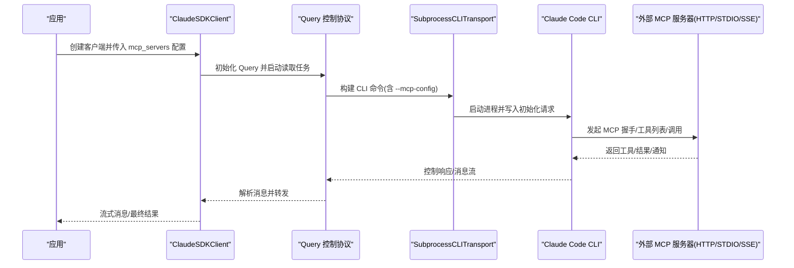
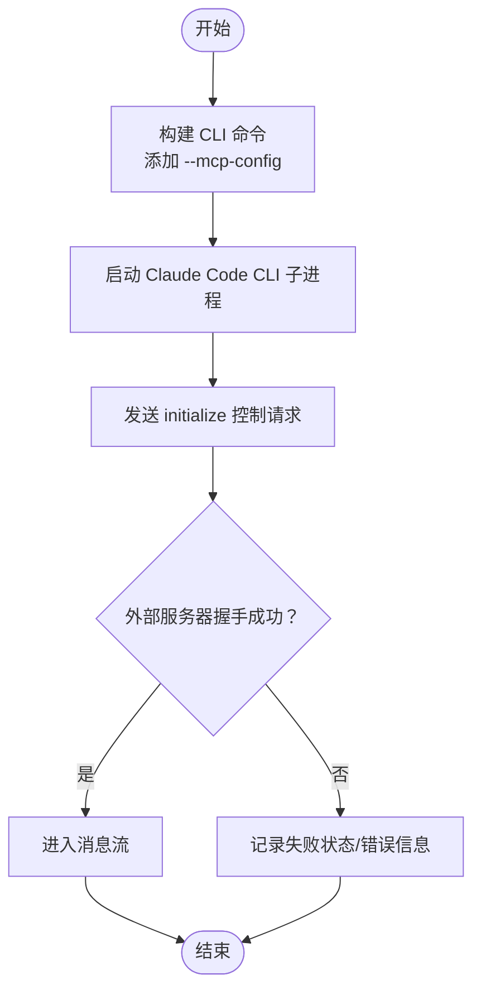
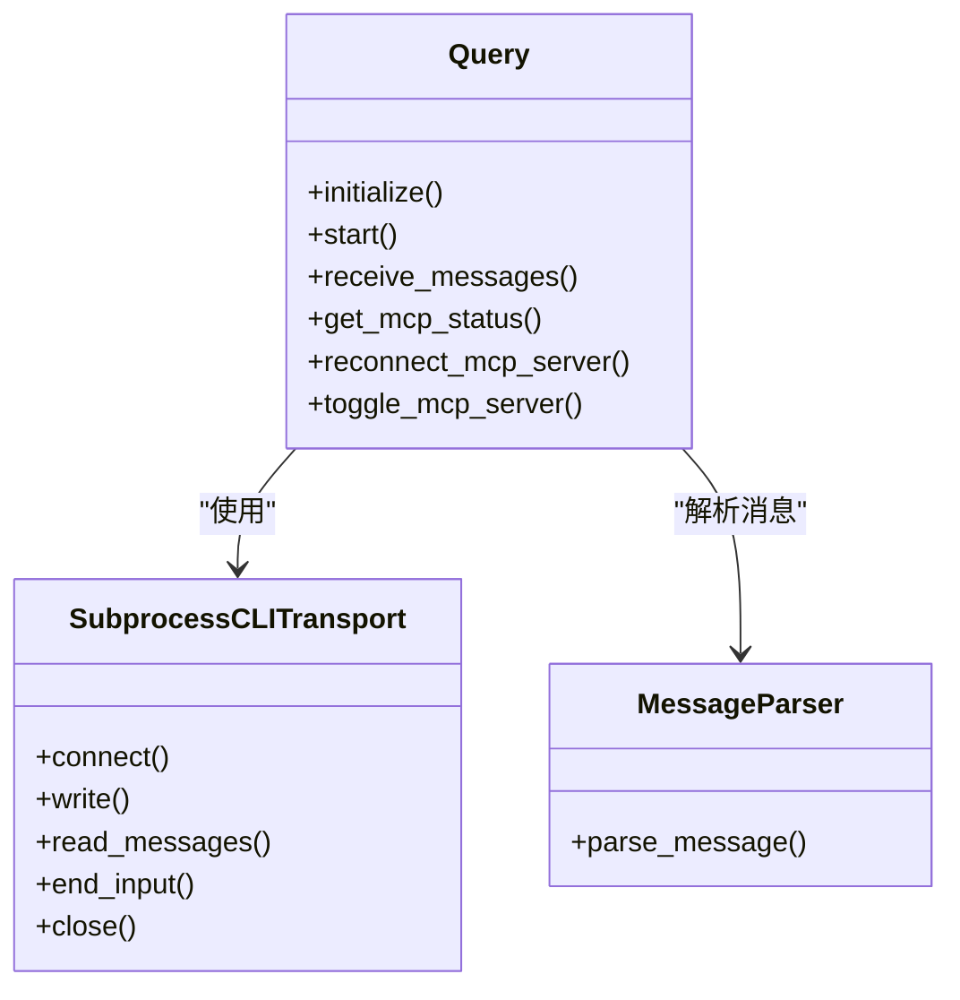
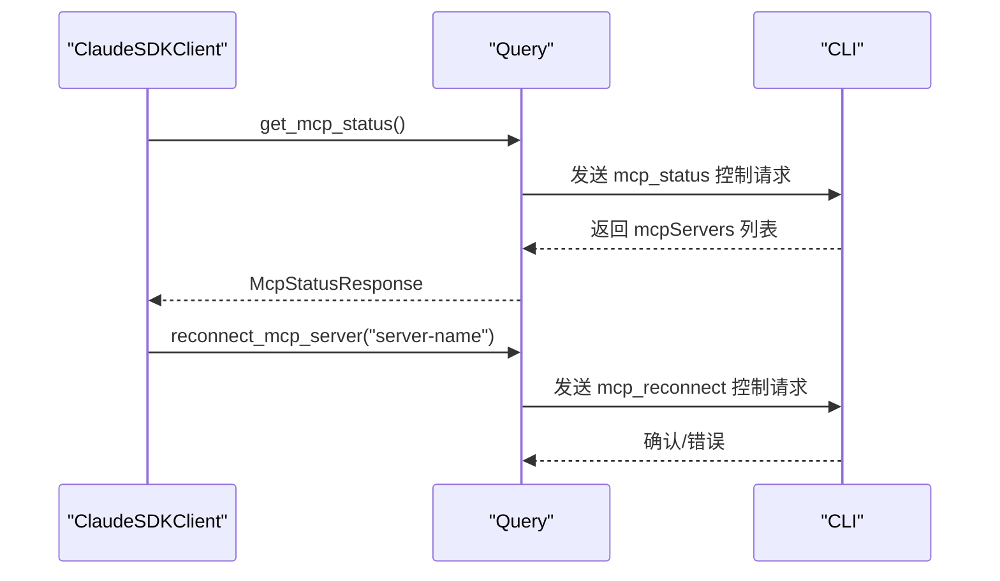

# 外部 MCP 服务器集成

<cite>
**本文档引用的文件**
- [client.py](file://src/claude_agent_sdk/client.py)
- [query.py](file://src/claude_agent_sdk/query.py)
- [types.py](file://src/claude_agent_sdk/types.py)
- [subprocess_cli.py](file://src/claude_agent_sdk/_internal/transport/subprocess_cli.py)
- [_errors.py](file://src/claude_agent_sdk/_errors.py)
- [message_parser.py](file://src/claude_agent_sdk/_internal/message_parser.py)
- [mcp_calculator.py](file://examples/mcp_calculator.py)
- [README.md](file://README.md)
- [test_transport.py](file://tests/test_transport.py)
- [test_streaming_client.py](file://tests/test_streaming_client.py)
- [test_sdk_mcp_integration.py](file://tests/test_sdk_mcp_integration.py)
</cite>

## 目录
1. [简介](#简介)
2. [项目结构](#项目结构)
3. [核心组件](#核心组件)
4. [架构总览](#架构总览)
5. [详细组件分析](#详细组件分析)
6. [依赖关系分析](#依赖关系分析)
7. [性能考虑](#性能考虑)
8. [故障排除指南](#故障排除指南)
9. [结论](#结论)
10. [附录](#附录)

## 简介
本文件面向需要在 Claude Agent SDK 中集成外部 MCP（Model Context Protocol）服务器的开发者，系统性说明如何配置、连接与管理外部 MCP 服务器，涵盖连接配置、认证机制、通信协议、监控与日志、性能优化以及与内置 SDK MCP 服务器的差异与最佳实践。

## 项目结构
围绕外部 MCP 服务器集成的关键模块包括：
- 客户端与查询层：负责控制协议、消息流、工具权限与钩子回调
- 传输层：封装与 Claude Code CLI 的进程间通信（stdin/stdout/err）
- 类型定义：描述 MCP 服务器配置、状态与消息格式
- 示例与测试：验证外部服务器配置、命令行参数构建与状态查询

```mermaid
graph TB
subgraph "应用层"
Client[ClaudeSDKClient]
Query[Query 控制协议]
Parser[消息解析器]
end
subgraph "传输层"
Transport[Transport 接口]
Subprocess[SubprocessCLITransport 子进程传输]
end
subgraph "CLI 层"
CLI[Claude Code CLI]
MCP_HTTP[MCP HTTP 服务器]
MCP_STDIO[MCP STDIO 服务器]
MCP_SSE[MCP SSE 服务器]
end
Client --> Query
Query --> Transport
Transport --> Subprocess
Subprocess --> CLI
CLI <- --> MCP_HTTP
CLI <- --> MCP_STDIO
CLI <- --> MCP_SSE
Query --> Parser
```

**图表来源**
- [client.py:94-180](file://src/claude_agent_sdk/client.py#L94-L180)
- [query.py:119-163](file://src/claude_agent_sdk/query.py#L119-L163)
- [subprocess_cli.py:335-394](file://src/claude_agent_sdk/_internal/transport/subprocess_cli.py#L335-L394)

**章节来源**
- [client.py:94-180](file://src/claude_agent_sdk/client.py#L94-L180)
- [query.py:119-163](file://src/claude_agent_sdk/query.py#L119-L163)
- [subprocess_cli.py:166-333](file://src/claude_agent_sdk/_internal/transport/subprocess_cli.py#L166-L333)

## 核心组件
- 外部 MCP 服务器配置类型
  - 支持三种外部服务器类型：STDIO（子进程）、HTTP（REST）、SSE（事件流）
  - 配置字段包含类型标识、地址、请求头等
- 连接与初始化
  - 通过 CLI 命令行参数传递 MCP 配置，支持 JSON 字符串或文件路径
  - 初始化阶段发送控制请求，等待 CLI 完成服务器握手
- 状态查询与管理
  - 提供获取 MCP 服务器状态、重连、启用/禁用等能力
- 错误处理与日志
  - 统一的错误类型与 JSON 解码异常处理
  - 可选 stderr 管道化输出，便于调试

**章节来源**
- [types.py:493-529](file://src/claude_agent_sdk/types.py#L493-L529)
- [subprocess_cli.py:240-266](file://src/claude_agent_sdk/_internal/transport/subprocess_cli.py#L240-L266)
- [client.py:385-416](file://src/claude_agent_sdk/client.py#L385-L416)
- [_errors.py:10-57](file://src/claude_agent_sdk/_errors.py#L10-L57)

## 架构总览
外部 MCP 服务器通过 CLI 的 MCP 配置注入到 Claude Code 进程中，SDK 通过控制协议与 CLI 协作，实现双向消息流与工具调用。下图展示从应用到外部服务器的完整链路：



**图表来源**
- [client.py:94-180](file://src/claude_agent_sdk/client.py#L94-L180)
- [query.py:119-163](file://src/claude_agent_sdk/query.py#L119-L163)
- [subprocess_cli.py:166-333](file://src/claude_agent_sdk/_internal/transport/subprocess_cli.py#L166-L333)

## 详细组件分析

### 外部 MCP 服务器配置与连接
- 配置类型
  - STDIO：指定可执行命令与参数，支持环境变量覆盖
  - HTTP：指定 URL 与请求头，用于 REST 风格的 MCP 服务器
  - SSE：指定 URL 与可选头部，用于事件推送
- CLI 注入
  - 将 mcp_servers 转换为 JSON 并通过 --mcp-config 传递给 CLI
  - 支持直接传入文件路径或 JSON 字符串
- 初始化握手
  - Query 在流式模式下发送 initialize 请求，等待 CLI 完成外部服务器连接与能力协商



**图表来源**
- [subprocess_cli.py:166-333](file://src/claude_agent_sdk/_internal/transport/subprocess_cli.py#L166-L333)
- [query.py:119-163](file://src/claude_agent_sdk/query.py#L119-L163)

**章节来源**
- [types.py:493-529](file://src/claude_agent_sdk/types.py#L493-L529)
- [subprocess_cli.py:240-266](file://src/claude_agent_sdk/_internal/transport/subprocess_cli.py#L240-L266)
- [test_transport.py:332-370](file://tests/test_transport.py#L332-L370)

### 认证机制与安全
- HTTP/SSE 外部服务器
  - 通过 headers 字段传递认证信息（如 Authorization）
  - 建议使用受信网络与 HTTPS，避免明文凭据
- STDIO 外部服务器
  - 通过 env 字段注入环境变量，适合令牌或密钥
  - 注意最小权限原则与进程隔离
- 权限控制
  - 使用 allowed_tools 或 permission_mode 控制工具调用
  - 可结合 can_use_tool 回调进行细粒度决策

**章节来源**
- [types.py:503-517](file://src/claude_agent_sdk/types.py#L503-L517)
- [client.py:234-256](file://src/claude_agent_sdk/client.py#L234-L256)

### 通信协议与消息流
- 控制协议
  - Query 负责控制请求/响应路由、钩子回调与工具权限
  - 支持 can_use_tool、hook_callback、mcp_message 等子类型
- 消息解析
  - message_parser 将 CLI 输出转换为强类型消息对象
  - 支持用户消息、助手消息、系统消息、结果消息等
- 流式输入
  - 支持异步迭代器作为输入流，配合 stdin 流式写入



**图表来源**
- [query.py:53-163](file://src/claude_agent_sdk/query.py#L53-L163)
- [subprocess_cli.py:335-518](file://src/claude_agent_sdk/_internal/transport/subprocess_cli.py#L335-L518)
- [message_parser.py:29-251](file://src/claude_agent_sdk/_internal/message_parser.py#L29-L251)

**章节来源**
- [query.py:236-346](file://src/claude_agent_sdk/query.py#L236-L346)
- [message_parser.py:29-251](file://src/claude_agent_sdk/_internal/message_parser.py#L29-L251)

### 状态监控与运维
- 获取状态
  - get_mcp_status 返回每个服务器的连接状态、版本信息、工具清单与作用域
- 重连与启停
  - reconnect_mcp_server 用于故障恢复
  - toggle_mcp_server 支持临时禁用/启用以隔离问题
- 日志与调试
  - 可通过 stderr 回调或 debug-to-stderr 方式输出调试信息
  - JSON 缓冲区大小限制防止内存膨胀



**图表来源**
- [client.py:385-416](file://src/claude_agent_sdk/client.py#L385-L416)
- [query.py:532-584](file://src/claude_agent_sdk/query.py#L532-L584)

**章节来源**
- [client.py:314-360](file://src/claude_agent_sdk/client.py#L314-L360)
- [test_streaming_client.py:706-804](file://tests/test_streaming_client.py#L706-L804)

### 与内置 SDK MCP 服务器的对比
- 内置 SDK 服务器
  - 以字典形式配置，type 为 sdk，包含 name 与 instance
  - 通过 Query 内部桥接 JSONRPC 方法（initialize/tools/list/tools/call）
  - 性能更优、部署简单、类型安全
- 外部服务器
  - 支持 STDIO/HTTP/SSE 三种接入方式
  - 更灵活的部署与扩展，但需处理进程生命周期与网络稳定性
- 混合使用
  - SDK 与外部服务器可共存于同一会话，按名称区分与调度

**章节来源**
- [types.py:519-529](file://src/claude_agent_sdk/types.py#L519-L529)
- [test_sdk_mcp_integration.py:152-174](file://tests/test_sdk_mcp_integration.py#L152-L174)
- [README.md:136-185](file://README.md#L136-L185)

### 实际示例与最佳实践
- 示例：计算器 SDK MCP 服务器
  - 展示了如何创建内联工具、注册服务器并允许工具自动执行
  - 适用于演示与快速原型
- 外部服务器最佳实践
  - 明确服务器类型与地址，合理设置超时与重试
  - 使用 allowed_tools 限定可用工具，避免高风险操作
  - 对 HTTP/SSE 服务器使用 HTTPS 与安全头，避免泄露敏感信息
  - 通过 get_mcp_status 定期检查连接状态，必要时触发重连
  - 结合钩子对危险工具进行前置校验

**章节来源**
- [mcp_calculator.py:138-194](file://examples/mcp_calculator.py#L138-L194)
- [README.md:136-185](file://README.md#L136-L185)

## 依赖关系分析

```mermaid
graph LR
A[ClaudeSDKClient] --> B[Query]
B --> C[SubprocessCLITransport]
C --> D[Claude Code CLI]
B --> E[消息解析器]
A --> F[类型定义(types.py)]
C --> F
B --> F
```

**图表来源**
- [client.py:94-180](file://src/claude_agent_sdk/client.py#L94-L180)
- [query.py:53-163](file://src/claude_agent_sdk/query.py#L53-L163)
- [subprocess_cli.py:335-394](file://src/claude_agent_sdk/_internal/transport/subprocess_cli.py#L335-L394)

**章节来源**
- [client.py:94-180](file://src/claude_agent_sdk/client.py#L94-L180)
- [query.py:53-163](file://src/claude_agent_sdk/query.py#L53-L163)
- [types.py:17-85](file://src/claude_agent_sdk/types.py#L17-L85)

## 性能考虑
- 选择合适的服务器类型
  - 内置 SDK 服务器通常具有更低的 IPC 开销与更高的吞吐量
  - 外部服务器适合需要独立进程隔离或复杂网络拓扑的场景
- 输入流与缓冲
  - 使用异步迭代器进行流式输入，减少一次性负载
  - 合理设置最大缓冲区大小，避免内存占用过高
- 连接管理
  - 合理设置初始化超时与流关闭超时，平衡响应速度与资源占用
  - 对 HTTP/SSE 服务器启用连接复用与健康检查

[本节为通用指导，无需特定文件引用]

## 故障排除指南
- 常见错误类型
  - CLIConnectionError：无法连接 CLI 或进程已退出
  - CLINotFoundError：未找到 Claude Code CLI
  - ProcessError：CLI 进程失败，附带退出码与错误输出
  - CLIJSONDecodeError：CLI 输出 JSON 解码失败
- 排查步骤
  - 检查 CLI 是否正确安装与可执行
  - 验证 mcp_servers 配置是否符合类型定义
  - 查看 stderr 输出以定位外部服务器连接问题
  - 使用 get_mcp_status 确认服务器状态与错误信息

**章节来源**
- [_errors.py:10-57](file://src/claude_agent_sdk/_errors.py#L10-L57)
- [client.py:385-416](file://src/claude_agent_sdk/client.py#L385-L416)
- [subprocess_cli.py:412-439](file://src/claude_agent_sdk/_internal/transport/subprocess_cli.py#L412-L439)

## 结论
通过 CLI 的 MCP 配置注入与控制协议，SDK 支持灵活集成外部 MCP 服务器（STDIO/HTTP/SSE）。对于性能敏感与类型安全要求高的场景，推荐使用内置 SDK MCP 服务器；对于需要独立部署、网络隔离或复杂生态集成的场景，外部服务器提供了更强的灵活性。结合状态监控、日志与权限控制，可在生产环境中稳定运行。

[本节为总结性内容，无需特定文件引用]

## 附录
- 关键 API 速览
  - get_mcp_status：查询所有 MCP 服务器状态
  - reconnect_mcp_server：重连断开的服务器
  - toggle_mcp_server：启用/禁用服务器
  - set_permission_mode：动态调整权限模式
- 配置要点
  - mcp_servers 支持字典与文件路径两种形式
  - 外部服务器配置需包含 type、url/command/headers 等字段
  - 建议为高风险工具配置权限策略与钩子回调

[本节为概览性内容，无需特定文件引用]